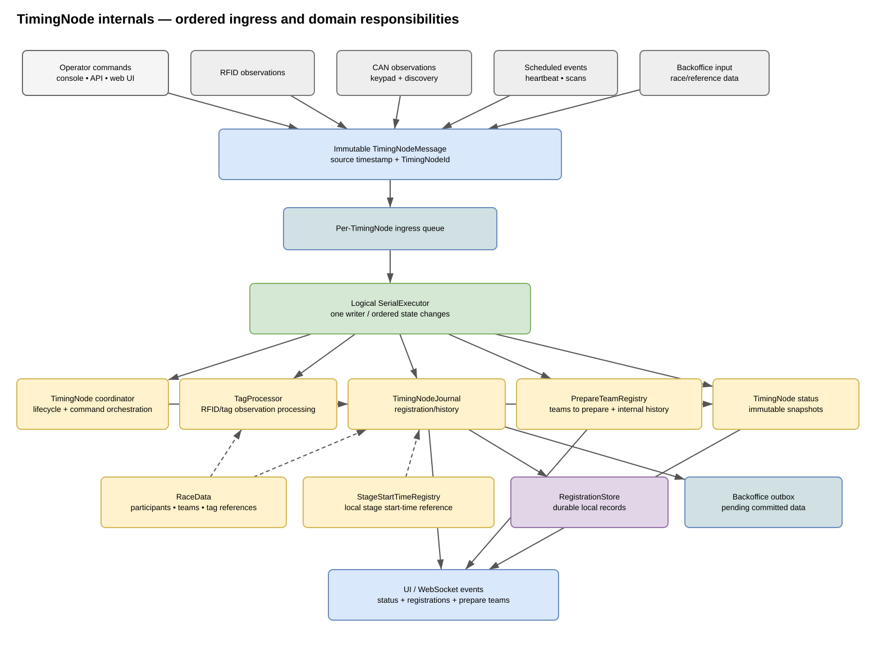
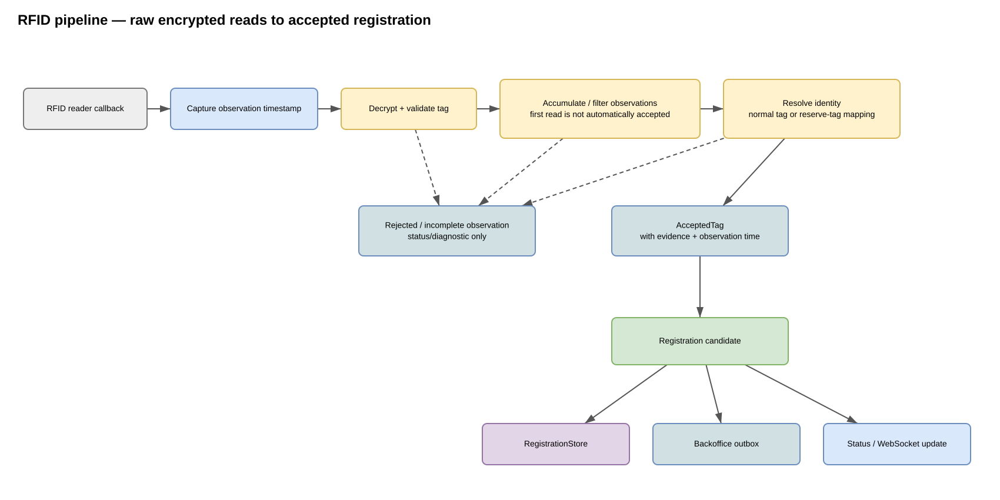
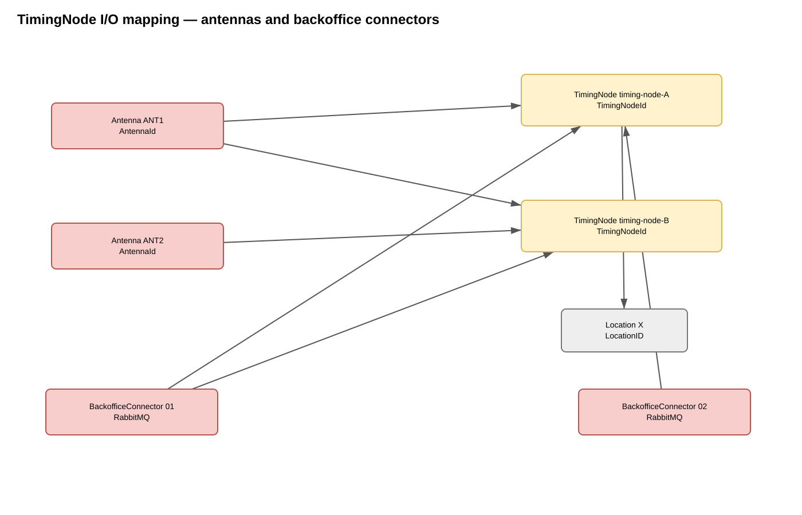
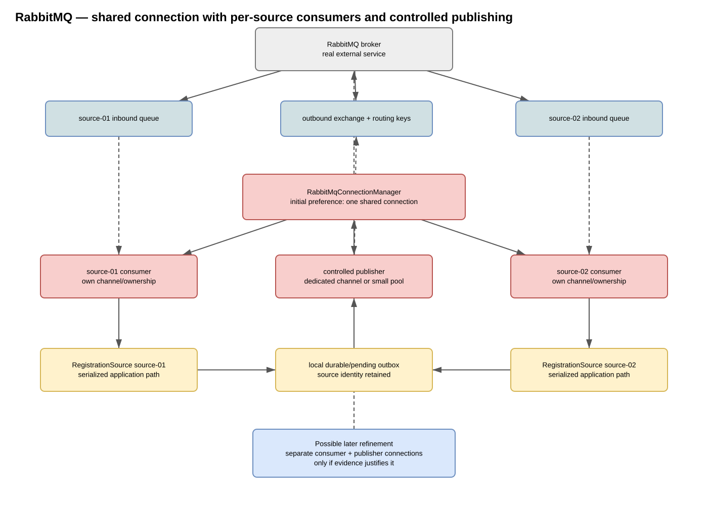
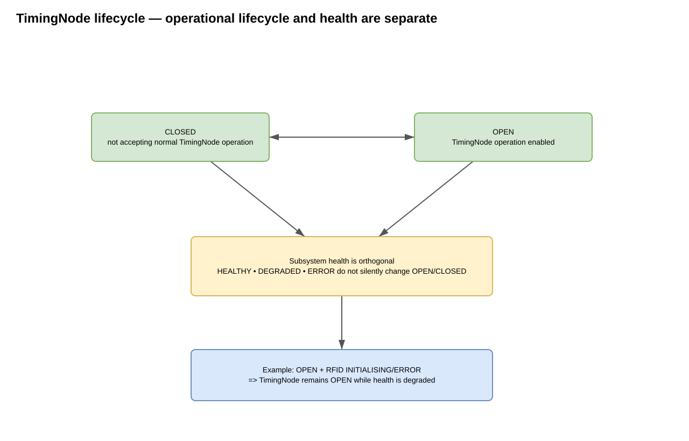
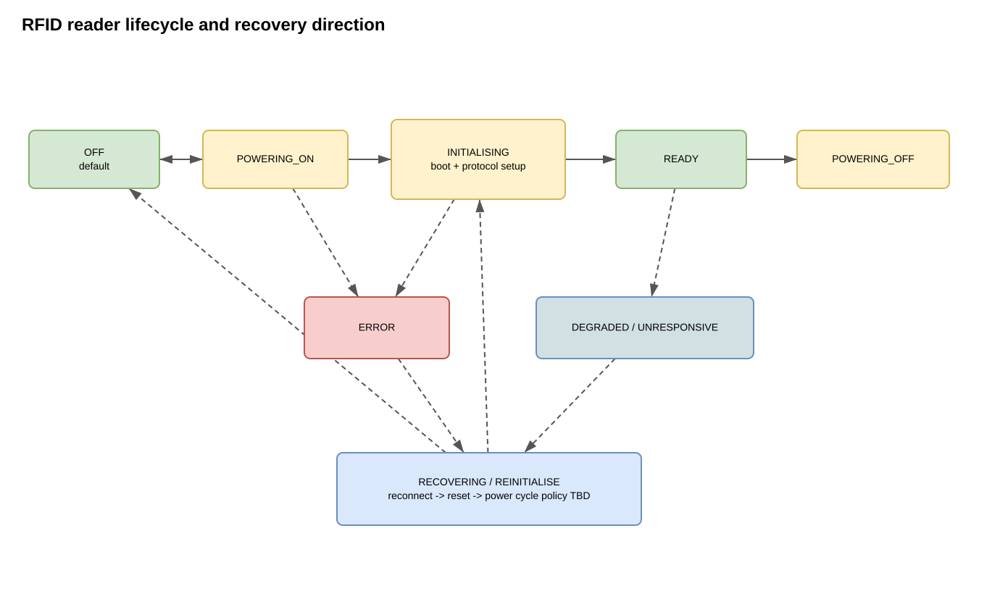
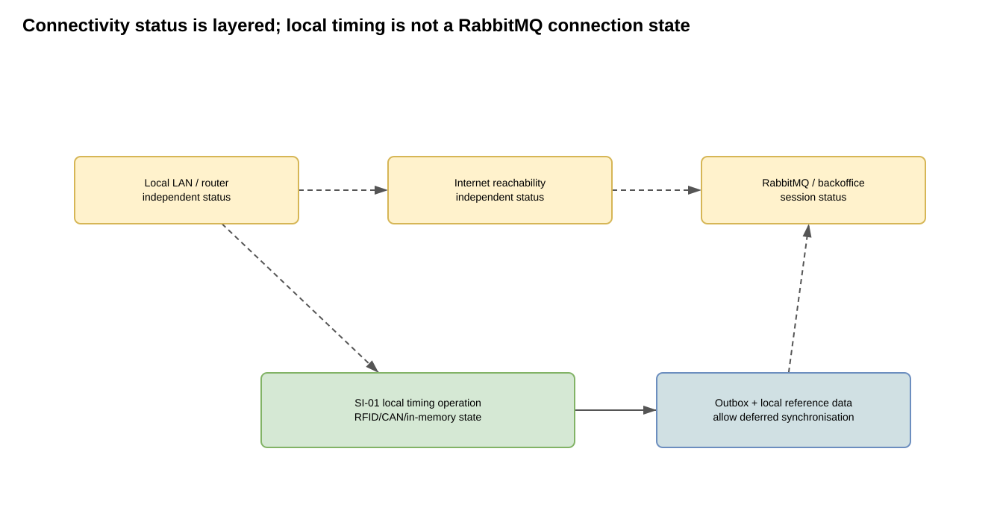

## TimingNode-system detail views

### TimingNode internals — ordered ingress and domain responsibilities

- [Editable draw.io file](./timing-node-internals.drawio)

### RFID pipeline — raw encrypted reads to accepted registration

- [Editable draw.io file](./rfid-pipeline.drawio)

## Data, traceability and display views

### TimingNode data, backup and V1/V2 display behaviour

- [Editable draw.io file](./data-display-flow.drawio)

### Registration traceability — monotonic sequence per TimingNodeId

- [Editable draw.io file](./registration-stream-identity.drawio)

## System software-item, topology and state-model views

### Software items and principal system interfaces

- [Editable draw.io file](./software-item-system-overview.drawio)

### SI-01 software/domain decomposition — TimingNodes and responsibilities

- [Editable draw.io file](./timing-node-software-decomposition.drawio)

### TimingNode I/O mapping — antennas and backoffice connectors

- [Editable draw.io file](./timing-node-routing-mapping.drawio)

### RabbitMQ — BackofficeConnector implementations with TimingNode routing

- [Editable draw.io file](./rabbitmq-source-topology.drawio)

### TimingNode lifecycle — operational lifecycle and health are separate

- [Editable draw.io file](./timing-node-lifecycle.drawio)

### RFID reader lifecycle and recovery direction

- [Editable draw.io file](./rfid-lifecycle.drawio)

### Connectivity status is layered; local timing is not a RabbitMQ connection state

- [Editable draw.io file](./connectivity-layers.drawio)

