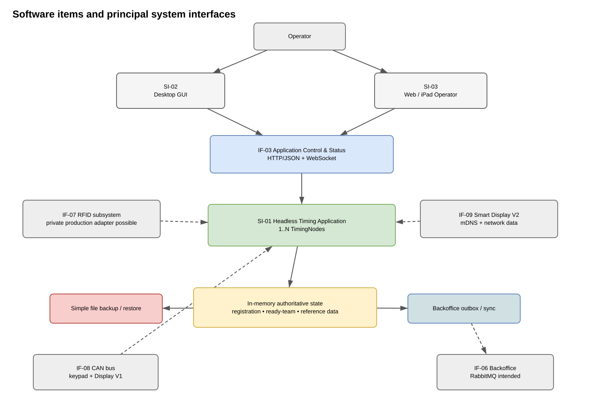
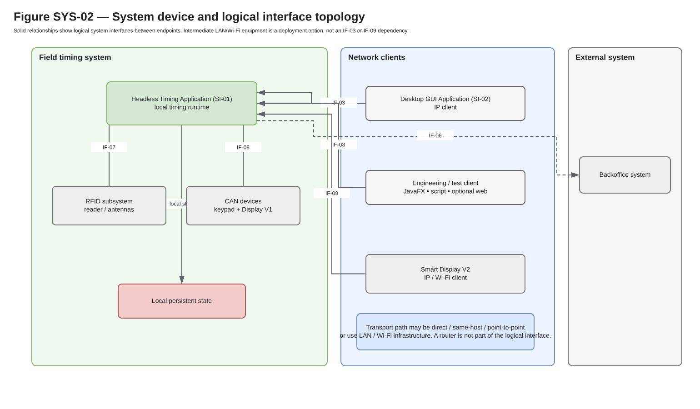
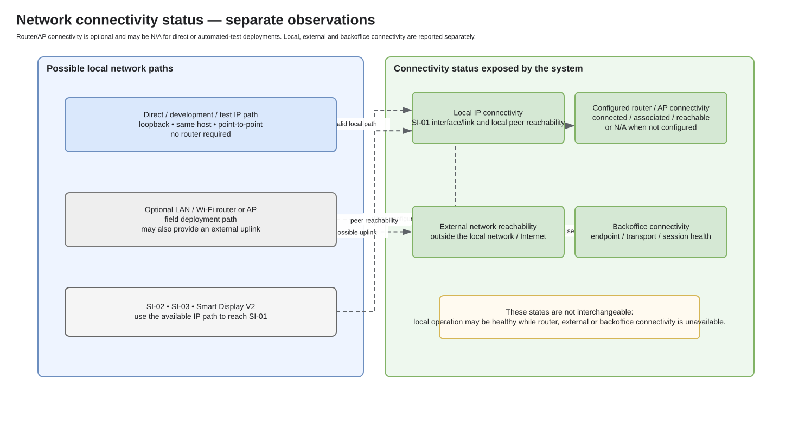
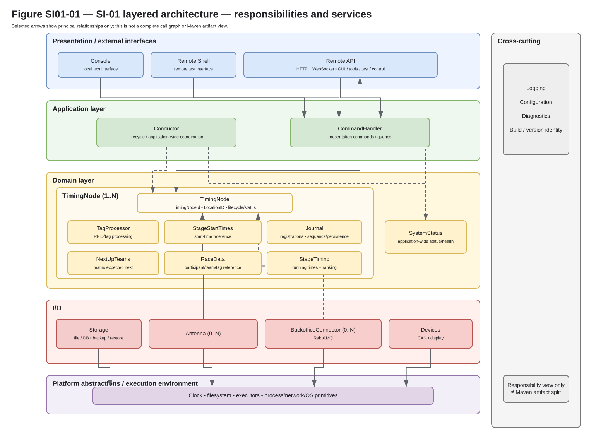
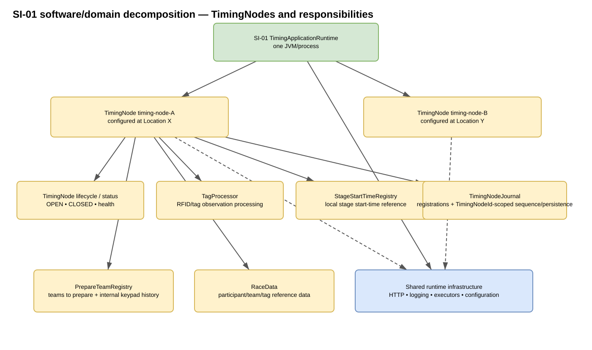
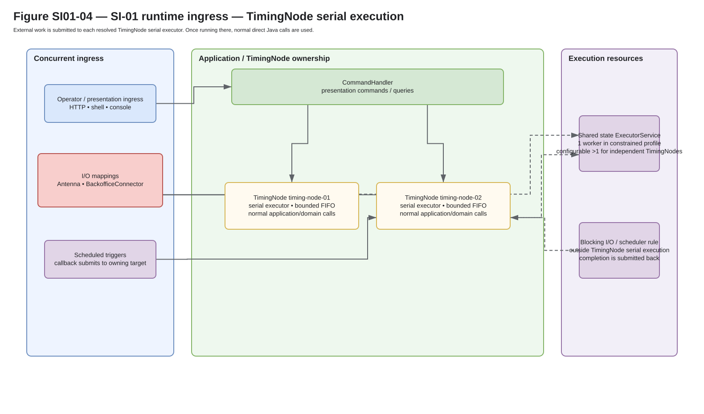
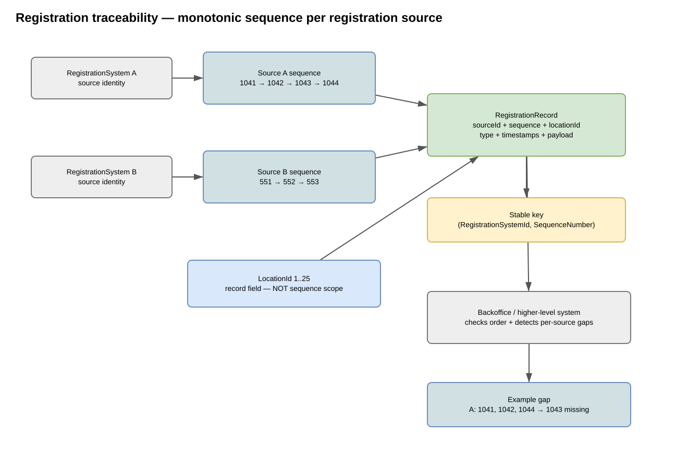
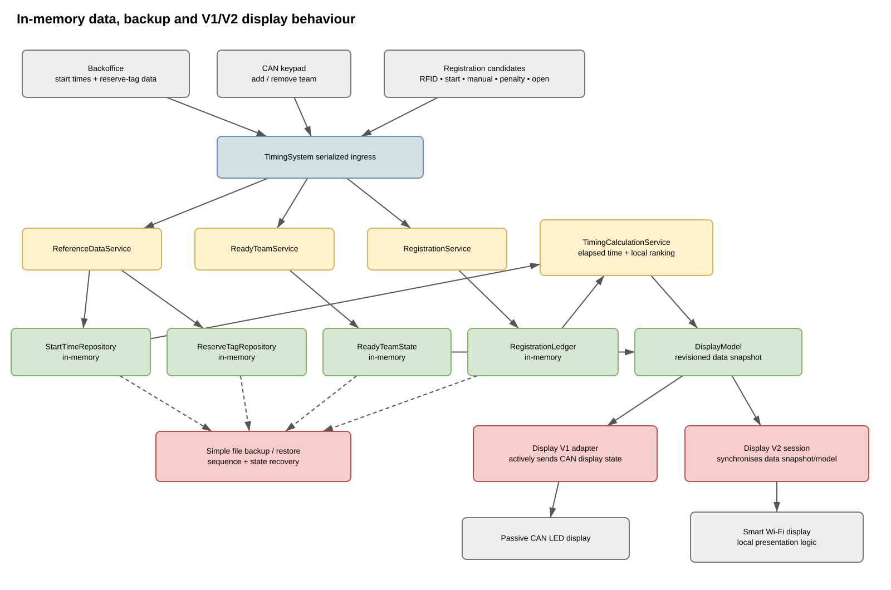

# Software engineering document set

Generated review/output book containing the current domain baseline, use cases, planning, requirements, development-environment, architecture, deferred design notes, interfaces and verification documents. The numbered source documents on the source branch remain authoritative.

## Contents

- [Domain baseline](03-domain-baseline.md)
- [System use cases](04-UC-system-use-cases.md)
- [Software Development Plan (SDP)](10-SDP-software-development-plan.md)
- [Software Implementation Planning (SIP)](11-SIP-software-implementation-planning.md)
- [Software Development Environment (SDE)](12-SDE-software-development-environment.md)
- [Java Build and Test Toolchain (SDE)](13-SDE-java-build-test-toolchain.md)
- [Timing Application Requirements (SRD)](20-01-SRD-timing-application-requirements.md)
- [Software System Architecture Document (SSAD)](30-SSAD-software-system-architecture.md)
- [Timing Application Architecture (SAD)](31-01-SAD-timing-application-architecture.md)
- [Java component, package and artifact detailed design](31-01-SDD-02-java-component-design.md)
- [GUI Application Architecture (SAD)](31-02-SAD-gui-application-architecture.md)
- [Data and display detailed design](31-01-SDD-01-data-and-display-design.md)
- [Backoffice transport detailed design](31-01-SDD-03-backoffice-transport-design.md)
- [Remote API Interface (IDD)](40-01-IDD-application-control-status.md)
- [Software Verification Plan (SVP)](50-SVP-software-verification-plan.md)
- [60-01-SUM — Headless Timing Application](60-01-SUM-headless-timing-application.md)

---

## Domain baseline

**Source document:** [03-domain-baseline.md](03-domain-baseline.md)

Status: working domain knowledge / non-authoritative requirements

This document captures stable domain facts and terminology supplied during the initial architecture work. It is intentionally separate from formal requirements: it records what the system domain looks like so later requirements, IDDs, architecture and code use the same concepts consistently.

Concrete production asset names, external registration-system IDs, source mappings and deployment inventories are intentionally **not** recorded in this public repository. They are deployment/proprietary information. Public documents describe the structure and semantics using generic identifiers only.

### TimingNodes, stages and locations

One running headless timing application must be able to host **multiple logical timingNodes** at the same time.

The working software/domain term is `TimingNode` for one independently addressed logical timing aggregate at the **end of a stage**. A `TimingNode` is deployed or configured for a physical event `LocationID`; the software identity of the timing node and the physical location where it is used are separate concepts.

Conceptually, one timing application owns one or more independently addressed timingNodes:

```text
TimingApplication
  |
  +-- SystemStatus
  |
  +-- 1..N TimingNode
        +-- TimingNodeId
        +-- LocationID
        +-- lifecycle / status
        +-- TagProcessor
        +-- StageStartTimes
        +-- TimingNodeJournal
        +-- NextUpTeams
        +-- RaceData
        +-- StageTiming
```

`TimingNodeId` is the stable identity of the `TimingNode`; `LocationID` identifies the physical event location where that timing node is configured or deployed.

Operational state such as `OPEN` / `CLOSED` belongs to the TimingNode software/domain concept. It is not the lifecycle of a physical registration box merely because that box is used by the timing node.

A `Stage` and a `TimingNode` are related but distinct concepts: a stage ends at a timing node. Stage-specific reference data such as start-time data may therefore be consumed by the timing node software without making the stage itself a hardware or runtime container.

The previous working name `TimingSystemInstance` mixed runtime isolation with the domain meaning of a timing node. New architecture/design work should use `TimingNode`; existing implementation names may be migrated later to match this documentation-led model.

### Antenna and TimingNode identity

`TimingNodeId`, `AntennaId` and `LocationID` are separate namespaces.

`TimingNodeId` is the stable software identity of a `TimingNode`. It scopes
that TimingNode's registration sequence, persistence and synchronisation
semantics. `LocationID` separately identifies the event location where the
TimingNode is configured or deployed.

The I/O boundary owns antenna configuration and mapping:

```text
Antenna (0..N)
  +-- AntennaId
  +-- driver / device configuration

each Antenna
        -> 1..N TimingNodeId
```

An `Antenna` is the configured registration input. Reader/protocol/device
details belong to the concrete antenna implementation/configuration and are not
separate software identities unless implementation evidence later requires that
distinction.

One antenna may intentionally feed more than one TimingNode. Each target
TimingNode keeps its own `TimingNodeId`, sequence and state; `AntennaId`
remains source/diagnostic context.

Known structural rules:

- `TimingNodeId` identifies the logical TimingNode;
- `AntennaId` identifies a configured antenna within the application;
- the application may compose 0..N antennas; configuration maps each `AntennaId` to its TimingNode targets;
- every TimingNode owns its own monotonic registration sequence and
  TimingNode-specific persistence/synchronisation state;
- reserve and virtual TimingNodes may share a physical antenna through routing;
- concrete production antenna/device settings remain deployment information.

#### Antenna identifiers

The software needs a stable configuration identity for every antenna.

Public examples use simple synthetic names:

```text
ANT1
ANT2
ANT3
```

A future physical label may use the same `AntennaId`. Production antenna names
and device settings remain deployment data and should not be copied into this
public repository.

### Separate software, I/O and configuration views

Do not express the complete system as one parent/child tree. The software/domain
decomposition and I/O/configuration routing answer different questions.

#### Software/domain view

```text
TimingApplication
  |
  +-- SystemStatus
  |
  +-- 1..N TimingNode
        +-- TimingNodeId
        +-- LocationID
        +-- lifecycle / status
        +-- TagProcessor
        +-- StageStartTimes
        +-- TimingNodeJournal
        +-- NextUpTeams
        +-- RaceData
        +-- StageTiming
```

The exact component/class boundaries remain design work, but the TimingNode is
the software/domain aggregate being operated.

#### I/O routing view

```text
Antenna (0..N)
  +-- each Antenna -> 1..N TimingNode

BackofficeConnector (0..N)
  +-- bindings <-> 1..N TimingNode
```

The same routing model supports real and simulated I/O without changing the
TimingNode domain model.

### Location and record context

Each physical event location has a unique numeric identifier:

```text
LocationID = 1..25
```

A `TimingNode` is configured/deployed at a location, while its software identity remains separate from that location identity.

A registration record is associated with both:

```text
TimingNodeId
LocationID
```

This lets a logical timing node preserve one ordered stream while records still state where the registration occurred. Moving or reconfiguring a producing system must not silently redefine either namespace.

### Registration sequence

Every timing node registration stream has a monotonically increasing sequence number scoped by **`TimingNodeId`**.

Conceptually:

```text
RegistrationRecordKey = (TimingNodeId, SequenceNumber)
```

The `LocationID` and `AntennaId` may provide useful context, but neither changes the sequence scope.

Generic example:

```text
timing-node-01:  1041, 1042, 1043, 1044, ...
timing-node-02:   551,  552,  553, ...
```

This allows receiving/upstream systems to reason about stream consistency independently for every source. For example, receiving `1041`, `1042`, `1044` from one source makes a missing `1043` detectable.

Important intended properties:

- the number is monotonic per `TimingNodeId`-scoped stream;
- a committed number must not be reused after restart/recovery;
- higher-level synchronisation can use it for ordering and gap/consistency detection;
- moving/changing location must not implicitly reset the timing node sequence;
- multiple `TimingNode` streams in one application keep independent sequence streams;
- the exact rules for allowed gaps, wraparound and sequence persistence still need formal requirements.

### Per-source persistence

Each `TimingNodeId`-scoped timing node registration stream has its **own registration file**.

The active application model may remain in memory, but registration persistence/recovery must preserve the timing node boundary so one `TimingNodeId`-scoped stream and its sequence state can be recovered and synchronised independently.

Conceptually:

```text
TimingNodeId timing-node-01
  in-memory ledger/state
  TimingNode-specific sequence
  TimingNode-specific registration file

TimingNodeId timing-node-02
  in-memory ledger/state
  TimingNode-specific sequence
  TimingNode-specific registration file
```

The exact file names, external IDs and deployment mappings are configuration/private data. The file format, append/snapshot policy, atomicity and durability rules still need detailed design and formal requirements.

### Registration entries

A registration entry is not limited to participant RFID passage data. Operational events can also be persisted as registration entries when they must participate in the traceable/synchronised stream.

Known example:

- opening a location/timing node is itself a registration entry.

A working minimal envelope is therefore conceptually:

```text
RegistrationRecord
  timingNodeId
  locationId
  sequenceNumber
  recordType
  observed/event time
  created time
  record-specific payload
```

Asset and antenna context may additionally be retained where useful for diagnostics/audit, but the exact storage/wire schema is not yet fixed.

### Time semantics

Recorded event time and start-time data need one unambiguous absolute-time meaning independent of how a local clock is displayed.

The working dedicated software value name is `TimingTimestamp`. At domain boundaries it represents an absolute point on the time line rather than a local date/time with an implicit time zone. Local time-zone and daylight-saving conversion are presentation/configuration concerns unless a future business rule explicitly depends on a local civil time.

A timestamp is **not** the source-ordering mechanism. Registration timing node sequence numbers remain the stable ordering/consistency mechanism even if an operating-system wall clock is corrected forwards or backwards.

The SI-01 SAD owns the implementation architecture for `TimingTimestamp`, injectable clock/time sources, monotonic duration measurement and the risk created by wall-clock corrections.

### Team number

The decoded participant/team identity contains a team number in the range:

```text
TeamNumber = 0..999
```

### Race data

`RaceData` is the locally available participant/team/tag reference data used by one `TimingNode`.

It may include participant/team reference data, normal tag references and reserve-tag conversion/mapping data. It is TimingNode-scoped application/domain state; obtaining or synchronising that data from the backoffice is an integration/application responsibility rather than behaviour owned by a `RaceData`.

Stage start-time data remains a separate concern owned by `StageStartTimes`.

### RFID tag identity structure

The tag ultimately represents a structured identity containing:

```text
prefix + team number + postfix
```

Known semantics:

- `team number` is `0..999`;
- prefix semantics distinguish at least normal, reserve and test tag classes;
- a dedicated prefix indicates that a tag is a reserve tag;
- a dedicated prefix indicates that a tag is a test tag;
- there are two physical tags for a team/identity;
- a postfix distinguishes the two tag copies.

The exact encoded prefix/postfix values, encryption details and protocol representation are proprietary and are not defined here.

A working public semantic representation should preserve the tag class after decoding rather than immediately flattening every tag into one normal participant identity. The exact class/type API remains an implementation/design decision.

### Reserve tags

Reserve tags require conversion/mapping data supplied by the backoffice.

The local timing application therefore needs to be able to resolve a decoded reserve-tag identity through locally synchronised reference data before treating it as the intended team identity.

The mapping must remain available locally when live backoffice connectivity is temporarily unavailable, subject to later freshness/validity requirements.

### Test tags

Test tags are a separate RFID tag class identified by their prefix. They are **not** the same concept as software test doubles, stub adapters or synthetic test tooling.

After decoding, SI-01 must be able to distinguish a test tag from both a normal tag and a reserve tag so test-specific behaviour can be applied deliberately. A test tag must not be silently treated as a normal participant tag merely because its decoded payload also contains a team-like number.

The exact behaviour is intentionally not fixed in this domain baseline. It belongs in operational use cases and later requirements, including whether a test tag creates a registration record, affects calculations, is synchronised to backoffice, is allowed in all lifecycle states, and how it is made visible to an operator.

### Start-time reference data

Start times are supplied/synchronised from the backoffice and retained locally.

They support local calculations such as elapsed time and ranking without requiring every calculation to make a live backoffice request.

### Full-field simulation

A single SI-01 application must be capable of running enough configured `TimingNode` objects to represent the complete field behaviour required for backoffice integration testing.

For this use case:

- each configured `TimingNode` remains separately addressable by its `TimingNodeId`;
- each configured producer uses its configured timing node identity/identities according to the deployment mapping;
- each `TimingNodeId` retains its configured logical identity and independent sequence stream;
- antennas/devices may be stubbed or simulated through the normal adapter contracts;
- registrations still follow the same normal queue, source-sequence, persistence and backoffice paths as production data;
- simulation must not require a special bypass around the application/domain model;
- public test scenarios use generic identities, while a private integration configuration may map to the actual production inventory/protocol IDs.

The Raspberry Pi Zero target and desktop/integration-test hosts may show different runtime behaviour. Measure that difference when representative software exists; do not invent target resource limits in the domain model.

### Public/private domain-data boundary

This repository can document structural facts and generic ranges required for reusable framework design, but it must not become an inventory of the live/real deployment.

Keep the following outside the public repository unless deliberately approved for publication:

- concrete antenna/device IDs and their real mappings;
- exact virtual/reserve-source assignments;
- exact production antenna/device topology;
- proprietary protocol field values;
- encryption keys or secrets.

Public examples should use names such as `timing-node-01`, `ANT1`, and `connector-01`.

### Traceability implications

The combination of timing node identity and monotonically increasing sequence is a domain-level consistency mechanism, not merely an implementation convenience.

Later requirements/design must therefore preserve at least:

```text
timing node identity
sequence order
registration-asset context where useful
containing total-system context
location association
antenna context where relevant
record type/payload
record time
TimingNode-specific persistence/recovery without sequence reuse
synchronisation/gap detection
```

Corrections/revocations should remain traceable rather than silently rewriting earlier records; the exact record model remains under design.

### Open domain questions

- Can a `TimingNode` change `LocationID` during one operational session, or is location fixed until the timing node is closed/reconfigured?
- How are reserve/virtual TimingNodes represented in registration-routing rules when they share a physical producer with normal TimingNodes?
- Does sequence numbering start at a defined value for a new timing node?
- Are sequence-number gaps allowed after failed/aborted persistence, provided numbers are never reused?
- What happens if the numeric sequence reaches its maximum representation?
- Which operational events besides `OPEN` must be part of a timing node registration stream (for example close/reinitialisation/configuration changes)?
- What exact data must an `OPEN` registration entry contain?
- Are normal, reserve and virtual timingNodes treated identically by backoffice synchronisation once their timing node identity is known?
- What exact operational behaviour is required for test tags, and which parts deliberately differ from normal and reserve tags?


---

## System use cases

**Source document:** [04-UC-system-use-cases.md](04-UC-system-use-cases.md)

Status: working draft / non-authoritative

This document captures system-level operational use cases that explain how operators, devices, external systems and test tooling use the event-timing software system.

Use cases are intentionally placed between the domain baseline and formal requirements. They describe **desired externally meaningful behaviour and goals**, not implementation details. Later system requirements, IDDs, software-item SRDs and verification cases may reference these use cases.

The public repository uses generic/synthetic identities. Real deployment asset names, external data-source IDs, broker topology and proprietary protocol details remain outside this repository.

### Relationship to other documents

```text
03 Domain baseline
      |
      v
04 System use cases
      |
      +--> system requirements / IDDs
      |          |
      |          v
      |      software-item SRDs
      |          |
      |          v
      |       SAD / SDD
      |
      +--> SVP / ST-* verification scenarios
```

A use case is not a test case. One use case may be verified by several unit, interface, system, fault-injection and hardware tests.

### Use-case format

Each use case should eventually contain:

```text
ID
Name / goal
Primary actor(s)
Supporting actor(s)
Preconditions
Trigger
Main flow
Alternative / failure flows
Postconditions / observable result
Relevant interfaces
Derived requirements (later)
Verification references (later)
```

The current catalogue starts lightweight and can be expanded as requirements are promoted.

### Use-case catalogue

| ID | Name | Primary actor | Goal |
| --- | --- | --- | --- |
| UC-001 | Start and prepare a TimingNode | Operator | Bring one configured TimingNode into a usable operational state. |
| UC-002 | Open a TimingNode | Operator | Start accepting/processing normal timing operation and create the required traceable open event(s). |
| UC-003 | Register a participant through RFID | RFID subsystem | Turn valid filtered/decrypted RFID observations into traceable source-specific registration records. |
| UC-004 | Recover or reinitialise RFID equipment | Operator / system | Restore an RFID device after startup, heartbeat or protocol failure without losing committed timing state. |
| UC-005 | Manage teams to prepare through keypad/operator input | Operator / keypad | Add or remove team numbers from the preparation registry and preserve the change history. |
| UC-006 | Drive a passive display from current system state | Timing application | Keep a passive Display V1 aligned with the current ready-team/display model. |
| UC-007 | Synchronise a smart display | Smart display | Connect to the advertised service and receive current/synchronised display data while SI-01 remains the source of that state. |
| UC-008 | Operate SI-01 through the planned desktop GUI | Operator | View status/data and execute permitted commands through the Remote API. |
| UC-009 | Exercise the Remote API through an optional web test client | Test/developer | Use a simple browser client when it is useful for manual interface testing. |
| UC-010 | Synchronise reference data from backoffice | Backoffice | Deliver start times, reserve-tag mappings and other required reference data for local use. |
| UC-011 | Synchronise `TimingNodeId`-scoped data to backoffice | Timing application / backoffice | Deliver committed source streams while preserving source identity, ordering and recoverability. |
| UC-012 | Continue local operation during backoffice outage | Operator / timing application | Continue required local timing behaviour while external synchronisation is unavailable, retaining data for later recovery. |
| UC-013 | Restart and restore local state | Operator / platform | Restore source sequences, registration state, ready-team/reference state and status after process/device restart. |
| UC-014 | Run multiple TimingNodes in one process | Test/operator tooling | Run several independently addressed TimingNodes and source streams in one SI-01 process. |
| UC-015 | Simulate a complete field toward backoffice | Test tooling | Exercise normal multi-TimingNode/source behaviour without real production hardware or private deployment identities. |
| UC-016 | Replace real devices with controllable stubs | Test tooling | Drive normal application paths with simulated RFID/CAN/display/backoffice components and fault injection. |
| UC-017 | Use an alternative backoffice transport for loop testing | Test tooling / simulator | Exercise source-aware backoffice semantics across a real socket/process boundary without requiring RabbitMQ. |
| UC-018 | Verify production-shaped messaging through RabbitMQ | Test tooling / backoffice adapter | Exercise source-specific consumers/publishing, broker recovery and outbox behaviour against a real disposable broker. |
| UC-019 | Process a test RFID tag | RFID subsystem / operator | Recognise a test-tag identity and apply explicit test-tag behaviour without silently treating it as a normal or reserve participant tag. |

### UC-001 — Start and prepare a TimingNode

**Goal:** bring one configured `TimingNode` into a known usable state.

**Primary actor:** operator or automated startup policy.

**Preconditions:**

- SI-01 has loaded and validated configuration;
- the target instance exists;
- required local state has been restored or an explicit restore fault is visible.

**Main flow:**

1. The actor selects/addresses a TimingNode.
2. SI-01 reports current instance and subsystem status.
3. Required devices are started according to configuration/policy.
4. RFID equipment that is required for the instance goes through power-on and initialisation.
5. SI-01 reports individual device/subsystem readiness rather than hiding startup progress behind one boolean.
6. The instance becomes ready for the operator to open when required operational prerequisites are satisfied.

**Alternative/failure flows:**

- an RFID device does not boot or initialise;
- a CAN device is not discovered;
- required reference data is unavailable/stale;
- persistence/restore is unhealthy;
- network/backoffice is unavailable while local operation may still remain possible.

**Relevant interfaces:** IF-01/02/03, IF-07, IF-08, status model.

### UC-002 — Open a TimingNode

**Goal:** enter normal timing operation in a traceable way.

**Primary actor:** operator.

**Main flow:**

1. The operator issues `open` through an authorised operator interface.
2. The command is translated to the shared application command boundary.
3. The addressed `TimingNode` processes the command through its serialized state boundary.
4. The lifecycle becomes `OPEN` if preconditions are met.
5. The required operational open event is written as a traceable registration-stream entry for the applicable source(s) according to the final requirements.
6. Status/event consumers receive the new lifecycle state.

**Alternative/failure flows:**

- invalid lifecycle transition;
- required persistence cannot commit the open event;
- degraded devices exist but policy still permits open;
- duplicate/open-again command.

### UC-003 — Register a participant through RFID

**Goal:** create a valid traceable registration from RFID observations without treating the first raw observation as automatically accepted.

**Primary actor:** RFID subsystem.

**Main flow:**

1. The RFID adapter captures raw tag data, antenna identity and observation time.
2. The RFID integration supplies the observation with its configured hardware/antenna context and SI-01 routes it into the addressed `TimingNode`.
3. Proprietary/private decoding/decryption translates the raw tag into a public semantic identity representation while retaining whether the tag is normal, reserve or test-class.
4. Filtering/observation accumulation determines whether the observation is accepted.
5. Reserve-tag resolution is applied when applicable using locally available reference data.
6. A test-tag identity branches to the explicit test-tag behaviour in UC-019 rather than silently continuing as a normal participant registration.
7. The configured producer/data mapping determines the applicable `TimingNodeId` used for the committed ordered stream.
8. Each committed source record receives the next monotonic source sequence number.
9. The record is persisted in that source's registration file/repository.
10. Derived local state/calculations and status are updated.
11. Outbound synchronisation is queued independently from local commit.

**Alternative/failure flows:**

- decryption/validation fails;
- tag is observed but filtering does not yet accept it;
- reserve mapping is unavailable;
- a test-tag policy does not permit the requested/observed operation;
- source routing is ambiguous/invalid;
- local persistence fails;
- backoffice is unavailable after local commit.

### UC-004 — Recover or reinitialise RFID equipment

**Goal:** allow explicit operator/system recovery of an RFID device while keeping timing-system state and committed registrations intact.

**Primary actor:** operator, supported by health/recovery logic.

**Main flow:**

1. SI-01 detects/reports an RFID startup, heartbeat or protocol problem.
2. The operator sees the exact affected asset/antenna state.
3. The operator requests reinitialisation, reconnect, reset or power-cycle according to supported recovery policy.
4. The adapter performs the hardware/protocol recovery operation.
5. Device state returns through `INITIALISING` to `READY`, or remains in an explicit error state.
6. Existing committed registration/source sequence state is not reset or rewritten by device recovery.

### UC-005 — Manage ready teams through keypad/operator input

**Goal:** maintain the current registry of teams that must prepare at the timing node/exchange point while keeping keypad/operator add/remove history traceable.

**Primary actor:** keypad or operator client.

**Main flow:**

1. A team-number add/remove action enters through a normal input adapter.
2. SI-01 routes the command to the applicable TimingNode.
3. `PrepareTeamRegistry` records the traceable add/remove mutation and updates its current set.
4. Display state is rebuilt/updated from the current prepare-team state.
5. Operator/status clients can observe the resulting state.

The `PrepareTeamRegistry` history is separate from participant/timing `RegistrationRecord` streams.

### UC-006 — Drive a passive display from current system state

**Goal:** ensure Display V1 shows the current ready-team/display model.

**Primary actor:** SI-01.

**Main flow:**

1. SI-01 derives a current `DisplayModel` from application state.
2. The passive-display adapter translates that model into CAN/device commands.
3. On state change, reconnect or rediscovery, SI-01 actively refreshes the display as required.
4. The display itself does not own ready-team/domain state.

### UC-007 — Synchronise a smart display

**Goal:** provide a smarter network display with data/state while SI-01 keeps that state.

**Primary actor:** smart display.

**Main flow:**

1. SI-01 advertises the configured service through mDNS.
2. The display discovers and connects to SI-01.
3. SI-01 provides a full current snapshot/data set.
4. Subsequent updates are synchronised over the selected network protocol.
5. After reconnect, the display can recover from a fresh current snapshot.

### UC-008 — Operate SI-01 through a desktop GUI

**Goal:** operate/observe a timing application through the Remote API.

**Primary actor:** operator.

**Main flow:**

1. SI-02 connects through the system-defined application-control/status interface.
2. It retrieves current application/instance/subsystem state.
3. The operator performs permitted commands such as open/close/device recovery and later registration-related operations.
4. SI-02 shows command outcome and live/stale/disconnected status explicitly.
5. Timing state remains in SI-01 rather than being stored only in the GUI.

### UC-009 — Exercise the Remote API through an optional web test client

**Goal:** provide a simple browser-based way to inspect or exercise the Remote API when
that is useful during development.

**Primary actor:** test/developer.

**Main flow:**

1. A small web client connects to the existing Remote API.
2. It shows a small set of API data such as version/status.
3. It may exercise supported commands/events needed for manual integration testing.
4. It remains test tooling; it does not become another source of timing/domain state.

This use case is optional. The current JavaFX engineering client already provides manual
integration inspection, and there is no current requirement for a separate web product.


### UC-010 — Synchronise reference data from backoffice

**Goal:** make required reference data available locally even when later backoffice connectivity is interrupted.

**Primary actor:** backoffice.

**Main flow:**

1. Source-aware inbound backoffice communication receives a reference-data update.
2. The transport adapter translates private/wire representation into public semantic data.
3. SI-01 validates and applies the update.
4. Start times/reserve-tag mappings and related metadata are stored in in-memory repositories.
5. Backup/restore state is updated according to persistence policy.
6. Status exposes version/freshness/health where required.

### UC-011 — Synchronise `TimingNodeId`-scoped data to backoffice

**Goal:** deliver committed ordered source streams without coupling domain logic to one transport technology.

**Primary actors:** SI-01 and backoffice.

**Main flow:**

1. A source record is committed locally with `(TimingNodeId, SequenceNumber)` identity.
2. A corresponding outbound item becomes pending in the outbox/synchronisation state.
3. The selected `BackofficeTransportPort` sends the semantic message through its configured transport.
4. RabbitMQ production-shaped transport may map the source to its configured exchange/routing endpoint; a test socket adapter may use a simpler synthetic framing.
5. Successful acknowledgement/reconciliation advances the pending state according to the final protocol.
6. Source ordering and gap detection remain possible at higher levels.

### UC-012 — Continue local operation during backoffice outage

**Goal:** preserve required local timing functionality and traceability while external connectivity is unavailable.

**Primary actor:** operator / SI-01.

**Main flow:**

1. SI-01 detects loss of internet/broker/backoffice connectivity and exposes the appropriate status layer.
2. Local device operation, registration and calculations continue where required local configuration/reference data is available.
3. New committed source records remain locally durable.
4. Outbound items remain pending.
5. After transport recovery, synchronisation resumes without inventing/reusing committed sequence numbers.

### UC-013 — Restart and restore local state

**Goal:** recover a coherent timing application after restart/power interruption.

**Primary actor:** platform/operator.

**Main flow:**

1. SI-01 starts and loads configuration.
2. Source-specific registration files and sequence state are restored/validated.
3. Ready-team/reference/other recoverable state is restored according to the design.
4. The runtime reconstructs configured TimingNodes and configured hardware/data-source adapters.
5. Status reports restore health/errors before normal operation is presented as healthy.
6. Backoffice/outbox recovery resumes independently from local startup.

### UC-014 — Run multiple TimingNodes in one process

**Goal:** host multiple independently addressed TimingNodes while preserving independent lifecycle, state and `TimingNodeId`-scoped streams.

**Primary actor:** configuration/test/operator tooling.

**Main flow:**

1. Settings describe several independently addressed `TimingNode` objects and their location/timing node identity mappings.
2. Each instance receives its own logical serialized state boundary.
3. Deployment configuration routes each producer/asset/antenna origin to one or more applicable `TimingNodeId` targets without making those hardware objects children of the `TimingNode` software model.
4. Runtime-wide infrastructure may be shared without sharing mutable instance state.
5. Public interfaces can address each instance explicitly.

### UC-015 — Simulate a complete field toward backoffice

**Goal:** exercise realistic multi-TimingNode/multi-source behaviour from one test application.

**Primary actor:** automated/system test tooling.

**Main flow:**

1. A synthetic configuration creates enough TimingNodes and configured producer/timing node identity mappings to represent the required test scale.
2. Stub devices inject observations/faults through normal adapter boundaries.
3. SI-01 follows the same queues, `TimingNodeId`-scoped sequences, persistence and backoffice-port paths as production composition.
4. A backoffice simulator or broker fixture observes all source streams.
5. Tests validate isolation, ordering, recovery and status across the simulated field.

### UC-016 — Replace real devices with controllable stubs

**Goal:** make hardware-dependent application behaviour testable without duplicating business logic.

**Primary actor:** test tooling.

**Main flow:**

1. Composition selects stub adapters through normal public contracts.
2. Test control injects reads, device discovery, disconnects, failures or recoveries through the adapter surface.
3. The application processes those events through normal queues/domain handlers.
4. Tests observe behaviour only through supported state/interfaces/evidence points.

### UC-017 — Use an alternative backoffice transport for loop testing

**Goal:** test real process/network communication and `TimingNodeId`-scoped stream routing without RabbitMQ.

**Primary actors:** backoffice simulator and test tooling.

**Main flow:**

1. SI-01 is configured with a simple socket-based `BackofficeTransportPort` implementation.
2. A simulator connects over a real TCP/socket boundary.
3. Generic public `BackofficeEnvelope` messages are framed with explicit `TimingNodeId` context.
4. Several `TimingNodeId`-scoped streams can share the connection.
5. Disconnect/reconnect and malformed-message behaviour can be injected cheaply.
6. SI-01's domain/outbox/stream behaviour remains identical to the RabbitMQ composition.

This use case is intentionally protocol-neutral and does not reproduce private production RabbitMQ message schemas.

### UC-018 — Verify production-shaped messaging through RabbitMQ

**Goal:** verify broker/client lifecycle and source-specific messaging using a real disposable broker.

**Primary actors:** automated test tooling and SI-01 RabbitMQ adapter.

**Main flow:**

1. A Docker/Compose test environment starts a RabbitMQ broker with synthetic topology/credentials.
2. SI-01 establishes the configured broker connection(s).
3. Each configured `TimingNodeId`-scoped inbound stream establishes its applicable queue consumer/channel.
4. Outbound messages use `TimingNodeId`-specific routing configuration.
5. Tests exercise inbound/outbound behaviour and `TimingNodeId` isolation.
6. The broker is stopped/restarted to exercise reconnect, consumer restoration and pending-outbox resume.

Production names, source IDs, schemas and credentials remain outside the public fixture.

### UC-019 — Process a test RFID tag

**Goal:** recognise a test-tag observation and apply deliberate test-specific behaviour without allowing the tag to masquerade as a normal or reserve participant tag.

**Primary actors:** RFID subsystem and operator.

**Preconditions:**

- the tag has been decoded sufficiently to identify its semantic tag class;
- the configured TimingNode can identify that the tag is a test tag.

**Main flow:**

1. The RFID adapter captures the observation through the same normal ingress path used for other tags.
2. Decoding preserves the semantic tag class as `test` rather than flattening the identity to a normal participant identity.
3. Any common validation/filtering that also applies to test tags is performed according to the final requirements.
4. SI-01 applies the configured/test-tag policy instead of the normal or reserve-tag path.
5. The resulting action and operator-visible state remain explicitly distinguishable as test-tag behaviour.
6. If any record is persisted or synchronised, its semantics remain distinguishable from a normal participant registration.

**Behaviour still to define:**

- whether a test tag creates a registration-stream record at all;
- whether it uses a dedicated record type and/or `TimingNodeId` routing rule;
- whether it may affect elapsed-time/ranking/other derived calculations;
- whether it is synchronised to backoffice, and if so with what semantics;
- in which lifecycle states a test tag is accepted;
- what an operator sees when a test tag is detected/accepted/rejected;
- whether test-tag handling requires an explicit enable/configuration mode.

This use case is about a real semantic RFID tag class. It is separate from UC-015/016 software simulation and stub-device testing.

### Cross-cutting alternative/failure scenarios

The following scenarios should be associated with applicable use cases rather than becoming isolated implementation details:

- RFID power/boot/heartbeat failure;
- invalid/decryption/filtering failure;
- missing/stale reserve-tag or start-time data;
- test-tag detection while test-tag behaviour is disabled or not valid in the current lifecycle state;
- CAN device disappearance;
- passive display reset/reconnect;
- smart-display reconnect;
- local LAN versus internet versus backoffice loss;
- source persistence/backup failure;
- process restart after committed events;
- source sequence continuity/gap detection;
- operating-system wall-clock correction forwards or backwards while observations are being captured;
- local daylight-saving-time transition or other local-time ambiguity;
- queue pressure/backpressure;
- GUI/test-client disconnect/stale state;
- socket transport disconnect/reconnect;
- RabbitMQ broker/channel/consumer recovery.

### Traceability direction

When requirements are promoted, prefer explicit references such as:

```text
UC-003
  -> SYS-REG-xxx
  -> IDD-... where external behaviour applies
  -> SI01-SRD-...
  -> SDD registration/RFID/`TimingNodeId`-routing elements
  -> VC-... / ST-1, ST-2, ST-3, HIL evidence
```

This allows one operational goal to remain visible even when implementation responsibilities are distributed over several software items/components.

### Open use-case questions

- Which use cases are required during normal operation versus maintenance/service-only operation?
- What exact preconditions are required before a TimingNode may be opened?
- Which subsystem failures should block `OPEN`, and which should only mark the instance degraded?
- Which operational events besides `OPEN` must become registration-stream records?
- Can a timing node change location during one operational session, or is `LocationID` fixed until the timing node is closed/reconfigured?
- What operator roles/authorisation distinctions will exist for local, desktop and web clients?
- Which reference-data updates are automatically accepted versus requiring operator acknowledgement?
- What exact local behaviour is required if reference data is stale but backoffice is unavailable?
- Which configured mapping cases can intentionally create records in multiple virtual/`TimingNodeId`-scoped streams from one accepted RFID event?
- Which UC-019 test-tag behaviours are part of normal operational verification versus maintenance/service-only behaviour?


---

## Software Development Plan (SDP)

**Source document:** [10-SDP-software-development-plan.md](10-SDP-software-development-plan.md)

Status: working draft / non-authoritative

This document records the **current development direction**. It should stay short and
should distinguish decisions from things that still need discussion or evidence.

The SIP owns the implementation steps. The SDE owns the development/release environment.
The SVP owns verification detail.

### Current direction

The project currently centres on the **Headless Timing Application** (SI-01):

- Java application with one or more `TimingNode` instances;
- external configuration;
- console, remote shell and a programmable Remote API;
- timing/domain behaviour added incrementally;
- hardware and backoffice adapters added when their contracts become concrete;
- Windows as the convenient development host;
- Raspberry Pi Zero / Zero W as a target to run and verify on real hardware.

A separate **Desktop GUI Application** (SI-02) is planned as a real Remote API client.
Its implementation technology has not yet been selected.

The current JavaFX application is **not SI-02**. It is an engineering tool for manual
integration testing of the Remote API.

A small web client may also be useful later for exercising the Remote API. That is
currently a test-tool idea, not a separate product/software item.

### Development approach

#### Keep the next step concrete

Prefer a small runnable increment over a large future design. Each SIP step should say
why it exists, what it needs and what can be demonstrated when it is done.

#### Add architecture when it solves a real problem

Keep the important domain/application/I/O/presentation boundaries clear, but do not add
layers, services or product clients only because they might become useful later.

#### Measure before optimising

The Raspberry Pi target should be tested with representative software. We currently do
**not** assume that one Java timing application is too heavy for it.

CPU, memory, startup time and thread count are useful measurements. They become design
constraints only if measurements show a problem.

#### Keep interfaces independently testable

Console, shell, Remote API and later GUI behaviour should use the same application
semantics where appropriate.

Engineering clients may use a different runtime or technology from SI-01. They should
still use public interfaces rather than internal SI-01 classes.

#### Automate repeatable work

Builds, tests, generated documentation and releases should be repeatable. Detailed Git,
CI and release rules live in the SDE/repository guidance rather than here.

### Broad phases

These are direction markers, not a fixed schedule.

#### A — Architecture and framework baseline

Establish the useful domain/application boundaries and a buildable Java framework.

#### B — First useful Headless Timing Application

Grow SI-01 on the development host: configuration, lifecycle, Remote API, logging and
basic black-box testing.

#### C — Raspberry Pi target proof

Run the representative application on the Pi Zero/Zero W and learn what, if anything,
the target requires in deployment or runtime design.

#### D — Desktop GUI

Build SI-02 as a real independent client of the Remote API. The GUI technology remains
an open choice until this phase becomes active.

#### E — Timing/domain behaviour

Implement registrations, StageStartTimes, NextUpTeams, RaceData, StageTiming and the
persistence/recovery needed by those capabilities.

#### F — Device and backoffice integration

Add representative RFID/CAN/display and backoffice behaviour as their interfaces become
concrete.

### Resources

Known or expected resources are modest:

- normal Windows development workstation;
- original Raspberry Pi Zero / Zero W when target work starts;
- representative RFID/CAN/display hardware when those integrations are implemented;
- a broker/backoffice test environment when backoffice integration starts.

A dedicated integration host is an option only if a real need appears.

### Open points

These should remain questions until we have a reason to decide them:

- target-platform choice, including Raspberry Pi availability and OTS versus custom hardware;
- whether local e-ink display, RTC and CAN belong on the target platform;
- exact Raspberry Pi/target OS, image and update approach;
- exact Java runtime on the Pi target;
- whether target measurements reveal any meaningful CPU/RAM/thread limitations;
- technology and packaging for the real Desktop GUI Application (SI-02);
- whether a small web Remote-API test client is useful in addition to the JavaFX tool;
- exact persistence format/strategy as domain state grows;
- exact device and backoffice transports where not already fixed by external systems;
- whether a separate integration host is worthwhile;
- whether there is ever a reason to move the SI-01 Java baseline beyond Java 8.

### Main risks

Only risks that can materially change the direction belong here.

| Risk / unknown | Current response |
| --- | --- |
| Target hardware availability or lifecycle blocks the preferred platform. | Keep software development hardware-independent; study Pi-class alternatives and OTS/custom options before procurement. |
| Pi/target deployment/runtime differs materially from development-host behaviour. | Run the representative application on selected real hardware and measure before changing architecture. |
| Timing/order/threading mistakes affect results. | Keep state changes controlled and verify timing/ordering behaviour deterministically. |
| Hardware behaviour differs from simulations. | Keep adapters replaceable and verify against representative hardware when available. |
| Backoffice details leak into application/domain APIs. | Keep application semantics separate from transport/proprietary mappings. |
| Part-time cadence loses context. | Keep steps small, demonstrable and documented at their actual decision points. |

### When to update this plan

Change the SDP when the **development direction** changes: target, major software item,
broad phase or project-level risk.

Ordinary task progress belongs in the SIP, issues and pull requests.


---

## Software Implementation Planning (SIP)

**Source document:** [11-SIP-software-implementation-planning.md](11-SIP-software-implementation-planning.md)

Status: working draft / non-authoritative

This document explains **how the software is expected to grow from the current framework
into a usable timing system**. The roadmap is intended for two audiences:

- a software engineer should be able to understand why the next increment exists, its
  boundaries, dependencies and exit criteria;
- a project reviewer/manager should be able to see what value or uncertainty the step
  addresses, which resources can block it, and what can be demonstrated afterwards.

The SIP is the content source of truth for the generated roadmap and step cards. Detailed
activity history, CI logs and release mechanics live in issues, pull requests, SDE and
generated evidence.

### How to read a step

Each step uses the same small structure, but the text should carry useful information
rather than merely fill headings:

- **Purpose** explains why the step is in this position and which value/risk it addresses.
- **Goal** states the capability to add.
- **Scope** says what work belongs in the step.
- **Not in this step** is used where a boundary prevents accidental scope growth.
- **Needs** names real dependencies or resources that can gate the work.
- **Result** is the short manager-facing outcome shown on the roadmap.
- **Demo** is the practical end demonstration.
- **Done** is the engineering exit criterion.

The roadmap estimates are focused project days. Each step may show its original estimate,
git-derived actual effort and current remaining estimate. These are independent planning
signals: original minus actual does not have to equal remaining. Future phase ends are
shown as concrete Monday boundaries for readability; the underlying cumulative forecast
is calculated before that display rounding. Forecast dates are planning aids, not
commitments.

---

### Step 1 — Architecture baseline

Status: completed

#### Purpose

Create enough shared language and ownership before implementation starts. The objective
was not to finish the whole architecture, but to stop the first code changes from
silently deciding domain boundaries, software-item ownership and interface direction.

#### Goal

Define the first architecture baseline for the timing software.

#### Scope

- domain and TimingNode baseline;
- Headless Timing Application boundary;
- initial interface catalogue;
- Java/Maven and verification direction.

#### Needs

- project/domain knowledge;
- architecture/document tooling.

#### Result

- First software architecture baseline.
- TimingNode and application ownership are clear.
- Implementation can start deliberately.

#### Demo

- Walk through the architecture diagrams.
- Explain TimingNode and application ownership.
- Show where the first executable fits.

#### Done

- architecture documents build and are reviewable;
- framework implementation can start without inventing basic ownership;
- unresolved subjects remain explicit rather than being presented as decisions.

---

### Step 2 — Framework repository skeleton

Status: completed

#### Purpose

Move from architecture into executable software. A real repository, build and runnable
application provide the foundation on which every later domain, interface and device
increment can be verified.

#### Goal

Create the Java repository and prove that it builds and runs independently.

#### Scope

- Maven reactor with reusable framework and runnable application;
- Java baseline;
- build/version identity and logging baseline;
- unit tests and Linux/Windows CI;
- minimal application lifecycle.

#### Needs

- development workstation;
- GitHub CI.

#### Result

- Framework and runnable application artifacts.
- Clean Linux and Windows build/test.
- Traceable build identity and lifecycle.

#### Demo

- Build from a clean checkout.
- Produce both artifacts.
- Start, identify and stop the application.

#### Done

- clean bootstrap/build works;
- Linux and Windows verification are green;
- release `v0.1.0` is the accepted Step-2 baseline.

---

### Step 3 — Application and Remote API foundation

Status: active

#### Purpose

Turn the framework into a useful long-running application before adding timing-domain
complexity. This step establishes the application boundary that later simulation, GUI,
backoffice and hardware work can all use without reaching into SI-01 internals.

#### Goal

Build the first useful **Headless Timing Application** (SI-01) on the development host.

#### Scope

- external application configuration with at least one TimingNode;
- shared command/query behaviour;
- local console and remote shell;
- Remote API over HTTP/JSON and WebSocket;
- consistent version/status semantics;
- runtime file logging;
- black-box/application testing;
- JavaFX engineering client for manual Remote API integration testing.

#### Not in this step

- real timing/domain behaviour beyond the minimum needed for the application shell;
- production timing hardware;
- the planned Desktop GUI Application (SI-02).

#### Needs

- Windows development workstation;
- built SI-01 artifacts;
- no Raspberry Pi or timing hardware.

#### Result

- SI-01 runs from external configuration.
- Public interfaces share application semantics.
- Black-box testing is repeatable.

#### Demo

- Start SI-01 from configuration.
- Inspect version/status through public interfaces.
- Inspect IF-03 with the JavaFX test client.

#### Done

- configuration drives application composition;
- initial presentation interfaces use shared application behaviour;
- ST-1 exercises the running application through public interfaces;
- runtime logging and Windows artifact execution are repeatable;
- the step closes on the next accepted `0.2.x` release.

---

### Step 4 — TimingNode state and domain foundation

Status: planned

#### Purpose

Put useful timing concepts into software while the environment is still completely
controlled. This is where we learn whether the TimingNode model is pleasant to implement,
without letting hardware protocols or deployment details shape the domain prematurely.

#### Goal

Implement the main local TimingNode data/state model with deterministic tests.

#### Scope

- registrations and source sequence/history;
- StageStartTimes;
- NextUpTeams;
- RaceData/reference data;
- TimingNode lifecycle/status needed by these capabilities;
- clear state-change ownership and observable results.

#### Not in this step

- production RFID/CAN hardware;
- target-platform deployment;
- full persistence/recovery and end-to-end event simulation.

#### Needs

- representative synthetic data;
- domain examples/test cases.

#### Result

- Core TimingNode state exists in software.
- State changes are deterministic and testable.
- Domain behaviour has no hardware dependency.

#### Demo

- Create a TimingNode with synthetic data.
- Update starts, teams and reference data.
- Show registration history and state changes.

#### Done

- core state transitions have deterministic tests;
- source identity/sequence rules are represented consistently;
- no production adapter is required to exercise the implemented behaviour.

---

### Step 5 — Simulated timing flow and recovery

Status: planned

#### Purpose

Prove a useful timing flow end-to-end **without physical timing hardware**. This step
should expose mistakes in routing, sequencing, persistence and restart behaviour while
the inputs remain easy to reproduce.

It also creates the software baseline against which real hardware can later be compared:
hardware integration should replace a synthetic edge, not invent a second application
path.

#### Goal

Run realistic synthetic timing scenarios through the normal SI-01 application paths.

#### Scope

- synthetic registration/antenna input through supported I/O boundaries;
- StageTiming / derived timing results;
- multiple TimingNodes/sources where useful;
- persistence and restart/restore for the state that actually needs it;
- reconnect/recovery scenarios at public interfaces;
- stronger ST-1 black-box scenarios.

A small browser test client may be added here only if it materially improves manual
Remote API testing; it is not a product/software item.

#### Needs

- deterministic scenario/test data;
- controllable synthetic adapters;
- no target hardware.

#### Result

- Complete synthetic timing flow works.
- Restart/recovery behaviour is testable.
- Hardware can later replace simulated inputs.

#### Demo

- Feed a repeatable synthetic timing scenario.
- Show derived timing results.
- Restart SI-01 and continue the scenario.

#### Done

- normal timing flow is reproducible in automated tests;
- persistence/recovery semantics are explicit for implemented state;
- synthetic inputs use the same application/domain paths intended for real adapters.

---

### Step 6 — Desktop GUI Application

Status: planned

#### Purpose

Create the first real external user application once SI-01 has something useful to show.
The GUI is both a product capability and an independent consumer test for the Remote API.

The current JavaFX engineering client does **not** predetermine this GUI technology.

#### Goal

Create the first useful **Desktop GUI Application** (SI-02) as a separate Remote API
client.

#### Scope

First useful increment:

- GUI technology/runtime/packaging decision;
- endpoint selection and connect/disconnect;
- application and TimingNode status;
- selected timing data from the Step-4/5 model;
- clear connected/disconnected/stale state;
- reconnect behaviour;
- no dependency on SI-01 internal classes/files.

#### Needs

- stable enough Remote API and timing model from Steps 3-5;
- development workstation;
- explicit GUI technology decision when the step starts.

#### Result

- Real independent desktop GUI exists.
- GUI uses only the Remote API.
- GUI technology is chosen explicitly.

#### Demo

- Connect the GUI to a running SI-01.
- Show live timing/status data.
- Disconnect, reconnect and recover state.

#### Done

- GUI and SI-01 build independently;
- connection/status behaviour has useful automated coverage;
- GUI technology and packaging choice are documented with their rationale.

---

### Step 7 — Backoffice integration on development infrastructure

Status: planned

#### Purpose

Add external data exchange while everything can still run on development machines. This
keeps backoffice failure/reconnect work separate from later target-hardware debugging and
proves that local timing behaviour is not accidentally coupled to broker availability.

#### Goal

Connect SI-01 to the required backoffice flows using reproducible test infrastructure.

#### Scope

- reference/input data needed locally;
- outbound registrations/results as required;
- source identity/order where relevant;
- disconnect/reconnect/reconciliation behaviour;
- concrete transport adapter when the external contract is known;
- integration tests using synthetic/public test topology.

#### Needs

- backoffice/interface information;
- broker/test environment if RabbitMQ is the selected transport;
- synthetic identities and test credentials/configuration.

#### Result

- Backoffice data flow works in test.
- Local operation survives a broker outage.
- Transport remains outside domain behaviour.

#### Demo

- Exchange representative data.
- Stop the external service.
- Continue locally and reconnect cleanly.

#### Done

- implemented flows have repeatable integration tests;
- disconnect/reconnect semantics are explicit;
- transport/proprietary details do not leak into generic domain APIs.

---

### Step 8 — Target hardware and platform study

Status: planned

#### Purpose

Choose the physical target **after** the software architecture and main flows are proven.
A Raspberry Pi Zero/Zero W has been the working target, but availability and the complete
hardware need should be treated as project questions rather than assumptions.

This step is a decision/research step, not yet device integration. It should answer
whether suitable off-the-shelf hardware exists or whether a small carrier/custom PCB is
worthwhile.

#### Goal

Select a credible target-platform direction and understand cost, availability and
hardware gaps before procurement/prototyping.

#### Scope

Investigate at least:

- availability and lifecycle risk of Raspberry Pi Zero-class options and alternatives;
- OS/runtime support for SI-01;
- networking, storage and power needs;
- whether a small local display is useful and practical, including e-ink options;
- RTC need and available RTC solutions;
- CAN controller/transceiver need and integration options;
- required GPIO/I/O/connectors and serviceability;
- off-the-shelf board/stack versus HAT/carrier/custom PCB;
- rough prototype BOM and assembly cost if a custom PCB is justified;
- low-cost PCB assembly services as an option, without selecting a supplier in advance.

#### Questions to answer

- Can the required system be assembled from readily available off-the-shelf parts?
- Is a custom PCB solving a real integration/availability problem or merely adding work?
- Which hardware must be procured before the next step?
- Does the platform choice change any already-tested software boundary?

#### Needs

- current availability and price research when the step starts;
- candidate board/module datasheets;
- rough electrical/interface requirements;
- small prototype quantity/cost assumptions.

#### Result

- Target-platform shortlist and decision.
- Hardware gaps and risks are visible.
- Prototype cost/order path is understood.

#### Demo

- Compare credible target options.
- Show the proposed hardware block diagram.
- Show rough BOM/prototype cost and risks.

#### Done

- target direction is selected with recorded rationale;
- required hardware/features and procurement risks are explicit;
- off-the-shelf versus custom-PCB choice is justified;
- next-step hardware can be ordered or assembled without reopening basic platform questions.

---

### Step 9 — Target bring-up and deployment proof

Status: planned

#### Purpose

Prove SI-01 on the selected physical platform before adding all real timing devices. This
separates OS/runtime/deployment problems from RFID/CAN/display integration problems.

If Step 8 selects a Pi-based solution this is the first deliberate Pi bring-up step. If
another target or a small custom carrier is selected, the same proof applies there.

#### Goal

Run the representative software stack on the selected target platform.

#### Scope

- acquire/assemble the selected target hardware;
- install/provision the chosen OS/runtime;
- deploy and start SI-01;
- connect through the Remote API and desktop GUI;
- record basic startup/memory/CPU/thread observations;
- decide which deployment/update automation is actually useful.

#### Needs

- hardware selected in Step 8;
- storage/power/network accessories;
- representative SI-01 build.

#### Result

- SI-01 runs on selected target hardware.
- Real runtime behaviour is measured.
- Deployment needs are known from use.

#### Demo

- Boot the target and start SI-01.
- Connect through Remote API/GUI.
- Show runtime observations and restart.

#### Done

- target execution is repeatable enough for development;
- selected OS/runtime/install path is recorded;
- actual target limitations, if any, are backed by measurements;
- required deployment automation is identified from experience rather than assumed.

---

### Step 10 — Real timing-device integration

Status: planned

#### Purpose

Replace the synthetic edges proven in Step 5 with representative real timing hardware.
Because the application/domain flows already work, failures here can be isolated to
device contracts, electrical integration, drivers and adapter behaviour.

#### Goal

Connect the required real timing devices to SI-01 on the selected target platform.

#### Scope

Expected areas, refined from the Step-8 platform decision:

- RFID observations and lifecycle;
- CAN and CAN-connected devices where required;
- local display behaviour where selected;
- RTC integration where selected;
- keypad/other local controls where required;
- device status and useful recovery/error behaviour;
- comparison with the equivalent synthetic test flows.

#### Needs

- selected target platform;
- representative RFID/CAN/display/RTC hardware as applicable;
- device/protocol information;
- synthetic scenarios retained as regression references.

#### Result

- Real timing devices use normal SI-01 paths.
- Device status/recovery is observable.
- Synthetic and real flows remain comparable.

#### Demo

- Run a representative real-device flow.
- Show timing data/results through the GUI.
- Demonstrate one device recovery case.

#### Done

- implemented adapters use normal application/domain contracts;
- representative hardware behaviour is verified;
- synthetic tests remain usable for fast regression;
- unsupported hardware behaviour remains explicit.

---

### Step 11 — Integrated system and field proof

Status: planned

#### Purpose

Bring the already-proven pieces together and learn what remains before treating the
system as an operational baseline. This is where integration/recovery gaps should surface;
it is not intended to reopen architecture choices that earlier steps already proved.

#### Goal

Demonstrate the complete representative timing system as one integrated setup.

#### Scope

- selected target platform and real timing devices;
- Desktop GUI Application;
- backoffice connection and outage/reconnect behaviour;
- persistence/restart and service recovery;
- useful operational logging/diagnostics;
- representative longer-running timing scenario;
- identify only the hardening work actually exposed by the integrated proof.

#### Needs

- outputs of Steps 6-10;
- representative field/test setup;
- access to the required integration services.

#### Result

- Representative integrated system works.
- Recovery paths are demonstrated.
- Remaining hardening work is evidence-based.

#### Demo

- Run a representative timing session.
- Interrupt one external dependency/device.
- Recover and complete the session.

#### Done

- integrated scenario is repeatable;
- important failure/recovery behaviour is visible and verified;
- unresolved operational work is recorded as concrete follow-up rather than speculative roadmap filler;
- a suitable software baseline/release is produced.

---

### Open / later possibilities

These remain options until an earlier step creates a concrete need:

- a small web client for exercising the Remote API;
- more elaborate image/update/rollback automation;
- a dedicated integration host;
- extra public/private extension proofs;
- a later Java runtime baseline;
- additional custom electronics beyond what Step 8 justifies.

### Planning rules

- Do as much useful software work as possible before requiring scarce hardware.
- Do not make the number of roadmap steps determine the project duration.
- Estimates describe effort; planning reserve covers uncertainty and should affect the
  forecast horizon.
- Keep original estimate, git-derived actual and remaining estimate distinct; use their
  differences as re-estimation evidence rather than treating them as time-accounting sums.
- Show at least one concrete end date per phase. Future calculated ends round up to the
  next Monday for presentation only; do not feed that rounded date into later forecasts.
- Explain why a step exists and what uncertainty/value it addresses.
- Name real dependencies/resources before they can become blockers.
- Keep roadmap Result/Demo short; put explanation in Purpose/Scope/Needs.
- Keep planning changes on the per-step detail card, not on the broad roadmap.


---

## Software Development Environment (SDE)

**Source document:** [12-SDE-software-development-environment.md](12-SDE-software-development-environment.md)

Status: working draft / non-authoritative

This Software Development Environment document defines the **concrete engineering environment and repository conventions** used to develop, build, test, document and review the software system.

The SDE is project/software-system level and applies across software items and implementation repositories unless a repository documents a justified exception.

### Document boundary

The SDE is not the high-level development plan and it is not the detailed implementation sequence.

Use the documents as follows:

```text
SDP  why/how the project is developed at high level: strategy, phases, risks, resources, assumptions
SIP  what is implemented next: concrete steps, deliverables, demonstrations and exit evidence
SDE  where/how engineering work is performed: repositories, tooling, GitHub flow, CI, artifacts, local environments
SVP  how the product is verified: levels, profiles, verification cases and evidence
```

The SDE may define detailed mechanisms that support the SDP/SIP/SVP, but should not duplicate their planning or verification content.

### Purpose

The development environment should make work:

- reproducible;
- reviewable;
- traceable from issue through implementation and verification;
- usable by both human developers and AI agents;
- consistent across public and private repositories;
- suitable for generated documentation and build artifacts;
- easy to reconstruct on a new workstation or CI runner;
- simple enough for a small project without losing engineering discipline.

### Development hosts and execution environments

The high-level need for development/test hardware belongs in the SDP. This SDE defines how those environments are used once selected.

Expected environment classes are:

```text
Developer workstation
  primary interactive development
  initially Windows
  Java/Maven/Python/Git
  optional Docker/Compose

GitHub-hosted CI
  build/unit/system/integration automation where supported
  generated documentation/artifacts

Raspberry Pi Zero target
  SI-01 runtime
  selected compatible Java runtime
  target/runtime/HIL verification

Optional integration host
  broker/test services
  test drivers/simulators
  longer integration workloads
```

Exact host provisioning scripts and image tooling are introduced by the relevant SIP steps and implementation repositories.

### Primary development services and tools

Current baseline:

- **GitHub** — source control, issues, pull requests and review history;
- **GitHub Actions** — automated build, test, generated documentation and later image/deployment workflows;
- **Git** — source/version control;
- **Maven** — Java build/dependency-management baseline;
- **Java 8** — initial SI-01 language/API/runtime baseline;
- **Python** — lightweight project tooling/document generation where appropriate;
- **draw.io + generated SVG** — editable and GitHub-readable diagrams;
- **Docker / Docker Compose** — reproducible external integration services such as RabbitMQ where a real service materially improves verification.

Individual repositories may add tools, but system-wide additions should be deliberate and documented.

### Repository baseline

Every implementation or coordination repository is expected to contain at least:

```text
README.md
AGENTS.md
CHANGELOG.md
```

#### `README.md`

The human entry point. It should normally contain:

- repository purpose;
- relationship to the wider software system;
- build/run/test entry points or links;
- important document/navigation links;
- generated-output links where applicable.

#### `AGENTS.md`

Persistent repository-specific instructions for AI/coding agents, including:

- repository purpose and boundaries;
- sources of truth;
- workflow rules;
- files that must be read before work;
- public/private boundaries;
- build/test expectations;
- scope/plan discipline.

AI follows the same controlled engineering workflow as human development.

#### `CHANGELOG.md`

Records notable repository changes. It does not replace Git history, issue history or PR evidence.

### Repository content layout

Exact source trees differ by repository, but use predictable top-level locations where applicable.

Typical coordination/documentation repository:

```text
README.md
AGENTS.md
CHANGELOG.md
.github/
  workflows/
docs/
reference/
tools/
bld/                 local/generated build output; normally ignored in source
```

Typical Java implementation repository may evolve toward:

```text
README.md
AGENTS.md
CHANGELOG.md
.github/
  workflows/
docs/
<module>/
  src/main/...
  src/test/...
tools/
integration/         integration fixtures/config where useful
bld/ or target/      generated output, not hand-maintained source
pom.xml
```

Do not create directories merely to satisfy a template. Introduce them when the repository has content that belongs there.

#### Source versus generated versus reference material

Keep these categories distinct:

- **source** — hand-maintained code/config/documentation on normal branches;
- **generated output** — CI/build artifacts, generated documents/images/packages/images;
- **reference material** — preserved external/source documents used for research or traceability;
- **runtime/deployment data** — environment-specific configuration, secrets and mutable operational data; not normal public source.

Generated output should not be manually edited as if it were source.

### Documentation layout

Use predictable numbered document families in the meta/engineering documentation where applicable:

```text
00-09  working context, brainstorm, use cases and domain baseline
10-19  development planning/environment
20-29  requirements / SRDs
30-39  architecture and detailed design
40-49  system-level IDDs
50-59  verification planning
```

Established abbreviations include `SDP`, `SIP`, `SDE`, `SRD`, `SSAD`, `SAD`, `SDD`, `IDD`, `SVP` and `UC`.

Software-item numbers remain stable across requirement/design documents.

### GitHub issue → branch → pull-request workflow

Normal development follows a PR-first workflow:

```text
issue / work item
      ↓
feature branch
      ↓
draft pull request
      ↓
implementation + discussion + tests + evidence
      ↓
ready-for-review
      ↓
merge
```

#### Issue/work-item creation

Use a GitHub issue when useful to reserve/identify work and provide a stable work number.

#### Feature branch

Create from the intended target branch using:

```text
feature/pr-<N>-<short-slug>
```

Do not perform normal work directly on `main`.

#### Draft PR as active work container

Create/promote the draft PR early. It carries:

- scope;
- change-specific design discussion;
- implementation commits;
- tests/results;
- generated evidence;
- deviations and deferred scope;
- review conversation.

Long-term planning documents should not become detailed activity logs when the PR can carry that evidence.

#### Review and merge

Before merge:

- required checks are green;
- generated outputs have been inspected where relevant;
- important evidence is recorded;
- documentation/changelog updates are included where required;
- deferred or unresolved scope is explicit.

### Branch protection direction

Expected default-branch policy:

- require pull requests for normal merges;
- prevent force pushes;
- restrict deletion;
- allow zero required approving reviewers where appropriate for a solo-maintainer project;
- require meaningful stable CI checks once available;
- delete merged feature branches where appropriate.

Do not introduce merge queues or similarly heavy process unless there is a concrete need.

### Generated-output branches

Build outputs may be published separately from source branches.

General pattern:

```text
source PR/branch
      |
      | CI
      v
dev/pr-<N>/<output-type>
      |
      | merged main
      v
prod/<output-type>
```

Current documentation example:

```text
dev/pr-<N>/docs
prod/docs
```

Rules:

- generated branches are build output;
- the normal source branch is authoritative;
- generated PR branches exist so human/AI reviewers can inspect the real generated result before merge;
- corresponding `dev/pr-N/...` branches should be removed when the PR closes;
- `prod/...` represents output generated from merged/default-branch source.

The same approach can later be used for target images/packages when it provides useful review/release separation.

### Generated documentation

Source documentation remains Markdown plus project-controlled diagram-generator source.

The generated documentation set may contain:

- complete GitHub-readable Markdown copies;
- local SVG assets;
- editable draw.io files;
- combined review books;
- source commit/provenance metadata.

Generated documents are for review/publication. Their source Markdown remains authoritative.

### AI-assisted development environment

AI is an engineering tool inside the repository process, not an alternative process.

Before substantial work an agent should:

1. read `AGENTS.md`;
2. read handoff/active plan where present;
3. inspect the current open/draft PR;
4. inspect predecessor PR context when relevant;
5. identify the active SIP/AP scope;
6. work within that scope unless a plan correction is necessary.

An agent must not:

- bypass PR-first development;
- treat brainstorm material as approved requirements automatically;
- silently promote major architecture decisions;
- copy proprietary/private information into public source;
- edit generated branches as hand-maintained source;
- claim test/build/hardware evidence that was not actually produced.

### AI/session handoff environment

A new session should reconstruct current state from repository artifacts rather than requiring hidden conversation state.

Preferred sources include:

```text
AGENTS.md
current open/draft PR
relevant predecessor PR
active SIP/AP material
requirements / architecture / IDDs
README.md
CHANGELOG.md
```

Active implementation evidence belongs mainly in the PR. Persistent rules belong in `AGENTS.md`; development strategy belongs in the SDP; implementation ordering belongs in the SIP.

### Build and CI environment

Implementation repositories should introduce CI from the first useful increment.

Environment expectations include:

- Maven build/test entry points that also work locally;
- Java source/bytecode baseline enforced in build configuration;
- fast checks suitable for normal PRs;
- separate integration jobs where external services make tests slower;
- target/HIL workflows separated from hosted-runner-only tests;
- generated artifacts retained or published when they improve review/traceability;
- CI configuration kept in source under `.github/workflows/`.

Which behaviours belong to unit, ST-1, ST-2, ST-3 or ST-4 is defined by the SVP; the SDE only defines the environment mechanisms that make those profiles executable.

### Test-support environment

The engineering environment should support progressively more realistic verification without forcing every developer/test to require all infrastructure.

Expected mechanisms include:

- in-process/direct fakes for unit/component work;
- executable SI-01 plus external test driver for application/system testing;
- small manual test clients where they materially improve developer inspection of a public interface;
- lightweight native socket simulator for network-loop tests;
- Docker/Compose service fixtures for RabbitMQ-specific integration;
- real Pi Zero / hardware environment for target/HIL testing when relevant.

A manual test client may use a different desktop runtime/toolchain from SI-01 when that boundary is explicit. It must still consume the public interface
rather than internal SI-01 classes.

Do not make Docker a prerequisite for fast tests that do not need an external service.

### Containerized integration services

Docker/Compose is appropriate for real external dependencies with meaningful connection/protocol/recovery behaviour.

RabbitMQ is the first identified example.

Environment rules:

- synthetic/public test topology and credentials only;
- no real queue/source/deployment names or secrets;
- intentionally pinned image versions/tags;
- health/readiness checks;
- same basic environment usable locally and in GitHub Actions where practical;
- simple teardown/cleanup;
- restart/failure control where recovery is under test.

Detailed verification scenarios belong in the SVP and relevant SDD, not in this SDE.

### Raspberry Pi build/deployment environment

The exact Pi deployment approach is still open. When the Raspberry Pi SIP step starts,
begin with the simplest repeatable way to install and run SI-01 on the target.

Record the chosen OS/runtime and installation procedure. Add image generation, update
automation or rollback tooling only when it solves a demonstrated development or field
need. Detailed scripts/tool choices belong in the implementation repository.

### Public and private repository environment

Public/private separation must be enforceable by normal build structure:

- public framework repositories build/test without private source;
- private implementations consume public APIs/artifacts;
- private Maven/repository credentials use secure CI/developer credential mechanisms;
- proprietary protocols and real deployment mappings remain private;
- public integration fixtures use synthetic identities;

### Secrets and configuration

Credentials, tokens, encryption keys and environment-specific secrets are not committed to source control.

Use GitHub environment/repository secrets and runtime configuration mechanisms appropriate to each target.

Public example configuration uses placeholders/synthetic values.

Exact application configuration semantics remain architecture/SDD/IDD concerns.

### Tooling reproducibility

Start with the simplest adequate reproducible mechanism:

- pinned/action-versioned CI actions;
- Maven for Java;
- Python standard library where sufficient;
- native/simple socket tooling where sufficient;
- Docker/Compose for meaningful external service dependencies;
- dedicated custom build containers only when they isolate a substantial toolchain or solve a real reproducibility problem.

Do not introduce a custom Docker image merely because a small script exists.

### Repository-specific extensions

Each repository may extend this SDE via its own `AGENTS.md`, README, workflows, build files and local development documentation.

Repository-specific rules may add constraints but should not silently weaken system-level traceability/workflow rules. Material deviations should be documented.

### Open SDE topics

Environment/convention decisions still to resolve include:

- exact developer-machine JDK provisioning;
- concrete Java runtime provisioning for the Pi target;
- Maven public/private artifact repository and credential setup;
- standard Java formatting/static-analysis toolchain;
- standard unit/integration-test libraries;
- reusable repository bootstrap/template conventions;
- exact ruleset/branch-protection template;
- release/version/artifact naming conventions;
- whether image-builder/update tooling is useful after the first Pi target proof;
- exact local integration-host setup if a separate host becomes necessary;
- whether generated documentation later also produces PDF/HTML.


---

## Java Build and Test Toolchain (SDE)

**Source document:** [13-SDE-java-build-test-toolchain.md](13-SDE-java-build-test-toolchain.md)

Status: working baseline / AP-2

This document refines the system-level Software Development Environment for Java repositories. It defines the **engineering toolchain roles, build/test matrix, artifact flow and reusable-tool boundary** needed before the first SI-01 implementation repository is bootstrapped.

It does not define SI-01 product behaviour. Product requirements remain in the SRD/IDD/SAD/SDD documents, and verification intent remains owned by the SVP.

### Why this document exists

A Java repository alone is not yet a reproducible engineering environment. Before creating the first implementation repository the project needs a deliberate answer to:

- which environments build and test Java code;
- which operating systems are verified;
- how Maven itself is provisioned;
- which JDK/API baseline is authoritative;
- which job produces the canonical application artifact;
- how that same artifact is exercised on other platforms;
- which parts are generic enough to reuse across future Java repositories;
- when a dedicated/self-hosted machine is actually justified.

This document exists because those decisions are cross-repository SDE policy rather than SI-01 application design.

### Engineering roles are not physical machines

The toolchain defines **roles/environments** first. One physical computer or hosted runner can fulfil more than one role.

Initial roles:

```text
Windows developer workstation
  interactive development and demonstrations
  local Maven Wrapper build/test
  local application execution

GitHub-hosted Linux CI
  canonical CI build
  compile + unit/component verification
  package canonical Java artifact
  provenance/build metadata
  fast system-test jobs when available

GitHub-hosted Windows CI
  Windows compatibility build/test
  Windows execution/smoke verification
  later ST-1 compatibility execution

Raspberry Pi Zero target
  target execution only after the target/deployment SIP increment
  ARMv6-compatible Java 8 runtime
  resource/ST-4/HIL evidence

Optional integration/test controller
  not required initially
  later Docker/RabbitMQ services
  longer-running tests
  target/HIL orchestration when hosted CI is insufficient
```

A separate physical build server or Java test server is therefore **not an initial requirement**.

### Initial platform matrix

| Environment | Build source? | Unit/component tests | Runs canonical artifact | Main purpose |
| --- | --- | --- | --- | --- |
| Windows developer workstation | yes | yes | yes | interactive development and stakeholder demo |
| GitHub Ubuntu runner | **yes — canonical** | **yes** | yes | authoritative CI build/package path |
| GitHub Windows runner | yes, compatibility | yes | **yes** | detect Windows-specific build/runtime problems |
| Original Raspberry Pi Zero / Zero W | no normal source build required | selected target tests | **yes** | target viability/resource/HIL evidence |
| Optional Linux integration host | optional | integration/system | yes | external services and longer test orchestration |

The matrix can grow only when there is evidence that another environment materially improves verification or deployment.

### Java baseline

The first SI-01 baseline remains **Java SE 8** because the original Raspberry Pi Zero / Zero W is mandatory.

Toolchain implications:

- the canonical compile runs with a Java 8 JDK, not merely a newer JDK configured with `source=8`;
- Maven compiler/source/target settings must enforce Java 8 bytecode/source compatibility;
- the CI job records the actual JDK vendor/version used;
- source code remains vendor-neutral at the Java SE/API boundary;
- the Pi may use a different ARMv6-capable Java 8 runtime vendor from hosted CI without changing the application artifact;
- Java 11 remains a later evidence-driven compatibility/upgrade checkpoint, not part of the first canonical build.

The exact hosted-CI JDK distribution and patch version should be pinned/configured in the reusable workflow when that workflow is implemented. The exact Pi runtime is selected by the target-image SIP increment after ARMv6 evidence.

### Maven Wrapper policy

Every Java consumer/implementation repository should carry the Maven Wrapper:

```text
mvnw
mvnw.cmd
.mvn/wrapper/...
```

Normal commands are therefore repository-owned:

```text
Linux/macOS/CI:
  ./mvnw verify

Windows:
  mvnw.cmd verify
```

This avoids requiring every workstation or runner to install an independently managed Maven version.

Rules:

- the wrapper pins the Maven distribution used by the repository;
- CI invokes the wrapper rather than a runner-global `mvn` installation;
- wrapper files are source-controlled and reviewed;
- changing Maven version is a deliberate repository/toolchain change;
- the JDK remains an environment prerequisite and is provisioned explicitly by CI/developer setup.

### Canonical build and artifact model

The normal Java application artifact should be platform-neutral where the code/dependencies permit it.

Preferred flow:

```text
source commit
    |
    v
GitHub Linux canonical build
  pinned JDK 8 policy
  Maven Wrapper
  ./mvnw verify
    |
    +--> test reports
    +--> build/provenance manifest
    +--> canonical Java artifact(s)
                 |
                 +--> Linux execution/smoke
                 +--> Windows execution/smoke
                 +--> later Pi Zero execution
```

The project should **not** produce a separate Windows JAR, Linux JAR and Pi JAR merely because those operating systems are different.

A platform-specific artifact is justified only when a genuine native/platform dependency makes it necessary. Such a dependency must remain behind an appropriate adapter/module boundary rather than silently making core Java code platform-specific.

### Canonical versus compatibility builds

Two related questions need evidence:

1. can the source build/test correctly on an environment?
2. can the **same produced artifact** execute on another supported environment?

The toolchain should eventually verify both.

Initial CI direction:

```text
linux-canonical
  checkout
  set up JDK 8
  ./mvnw verify
  collect reports
  create/upload canonical artifact
  record build metadata

windows-compatibility
  checkout
  set up JDK 8
  mvnw.cmd verify

windows-artifact-smoke (when runnable app exists)
  download canonical artifact from linux-canonical
  java -jar ...
  execute first public smoke/ST-1 check
```

A Linux artifact-smoke job may use the same canonical artifact as an additional packaging sanity check.

### Build provenance

A produced artifact should be traceable without relying on a developer's workstation memory.

The build/release evidence should record at least:

```text
repository
source commit SHA
source ref/tag where applicable
project/application version
build timestamp or reproducible-build epoch policy
JDK vendor/version
Maven version from Wrapper
workflow/toolchain version
OS/runner class used for canonical build
```

Where practical, the application should embed enough non-secret build identity to answer its public version query without reading CI logs.

Reproducible-JAR settings such as a controlled Maven build output timestamp should be considered when the first Maven reactor is created.

### Test execution responsibility

The toolchain executes tests; the SVP defines what the tests mean.

Initial allocation:

#### Linux canonical CI

- compile all modules;
- unit tests;
- deterministic component/module tests that need no platform-specific behaviour;
- architecture/dependency checks;
- package artifacts;
- later fast ST-1 tests where practical;
- publish reports/artifacts.

#### Windows compatibility CI

- compile/test with the same Java source/API baseline;
- catch path, shell, filesystem and process-launch differences;
- run the canonical application artifact once it exists;
- later run a compact ST-1 compatibility subset.

#### Raspberry Pi Zero

- do not use the Pi as the normal project build machine;
- run the already-produced canonical artifact;
- verify ARMv6 runtime compatibility;
- collect startup/RSS/CPU/thread/latency evidence;
- run selected target/ST-4 scenarios.

#### Optional integration host

Introduce only when needed for capabilities that are awkward or inappropriate on hosted runners, for example:

- long-running RabbitMQ/recovery tests;
- hardware access;
- Pi image deployment/orchestration;
- CAN/RFID/display HIL;
- multi-target endurance testing.

### Docker policy

Docker is **not** part of the basic Java compile/unit-test toolchain.

Use Docker/Compose when a real external service materially improves verification, for example RabbitMQ in ST-3.

This keeps:

```text
normal Java verify
  JDK + Maven Wrapper
```

independent from:

```text
integration service fixture
  Docker/Compose + RabbitMQ/etc.
```

### Reusable `tool.java-project` boundary

Working repository name:

```text
tool.java-project
```

The name is provisional until that repository is created.

The reusable tool repository should own **generic Java-project engineering behaviour**, not product behaviour.

Good candidates:

```text
.github/workflows/
  reusable-java-verify.yml
  reusable-java-artifact.yml
  later reusable-integration entrypoints

templates/ or examples/
  minimal consumer workflow
  Maven Wrapper/bootstrap guidance

scripts/ (only when a script is genuinely reused)
  build/provenance collection
  project/toolchain validation

docs/
  supported inputs/outputs
  versioning/release policy
  consumer migration notes
```

Potential later candidates, only after repeated need is proven:

- a reusable Maven parent/convention artifact;
- a Maven plugin for project-specific convention checks;
- shared test-support tooling that is not timing-domain-specific.

Do **not** put the following in `tool.java-project`:

- SI-01 module layout as a hard-coded product assumption;
- timing-domain requirements;
- RFID/CAN/display behaviour;
- proprietary/private protocols or credentials;
- real deployment identities;
- Raspberry Pi image content that is specific to SI-01;
- RabbitMQ topology that belongs to a product/integration contract.

### Relationship to existing reusable tooling pattern

The existing SCAD tooling separates reusable project workflow from its runtime/toolchain and from consumer projects. The Java toolchain should preserve the same responsibility discipline without copying implementation mechanisms blindly.

In particular:

- Java consumers should normally use versioned/released reusable workflows rather than depend on an unversioned branch;
- Maven Wrapper remains local to each Java repository;
- a Git submodule is **not** assumed to be the Java reuse mechanism;
- reusable CI should be referenced by an immutable commit or a deliberately managed release tag/version;
- consumer projects must still be buildable/testable locally without requiring the reusable GitHub workflow repository at runtime.

### Toolchain release/use direction

A reusable toolchain change should be testable before consumers adopt it.

Target model:

```text
tool.java-project change
       |
       v
its own CI + reference consumer tests
       |
       v
versioned release/tag
       |
       v
consumer workflow pins/adopts that version
```

Consumer updates can then be reviewed as normal dependency/tooling changes rather than silently changing every project when `main` moves.

### First consumer expectation

The eventual SI-01 implementation repository becomes the first real consumer and validation project.

A clean checkout should require no globally managed Maven installation:

```text
Windows developer
  JDK 8 + Git
  mvnw.cmd verify

Linux CI
  provision JDK 8
  ./mvnw verify

Windows CI
  provision JDK 8
  mvnw.cmd verify
```

Once the application artifact exists, the exact artifact produced by the canonical Linux build should also be run by the Windows compatibility job and later by the Pi target step.

### Dedicated build/test hardware decision

Initial decision: **do not create a dedicated self-hosted build server yet**.

Rationale:

- GitHub-hosted Linux and Windows runners cover the first cross-platform build/test need;
- the developer workstation provides interactive Windows evidence;
- the Pi Zero provides target evidence;
- a self-hosted machine introduces patching, credentials, runner security and availability work before it solves a demonstrated problem.

Revisit this decision when external services, HIL, endurance or target orchestration need a stable local controller.

### Initial deliverable boundary

Before the SI-01 implementation repository is bootstrapped, the engineering baseline should be able to answer:

1. What command builds/tests a clean Java checkout on Windows and Linux?
2. Which environment is the canonical artifact producer?
3. What Java/Maven versions/policies are recorded and controlled?
4. How are test reports and artifacts retained?
5. How do we prove the canonical artifact is portable to Windows and later the Pi?
6. Which workflow/tooling logic is generic and belongs in a reusable tool repository?
7. Which configuration remains consumer/product-specific?

The next implementation increment may create the reusable tool repository and a minimal reference/fixture consumer before SI-01 adopts it.

### Open AP-2 decisions

- exact JDK 8 distribution/version used on GitHub Linux/Windows runners;
- exact Maven Wrapper/Maven version to pin initially;
- exact reusable-workflow inputs/outputs;
- whether canonical artifact publication initially uses workflow artifacts only or also a package/release channel;
- naming/version policy for `tool.java-project` releases;
- whether a minimal generic reference consumer lives inside the tool repository or as a separate template/test repository;
- when repeated Maven configuration justifies a reusable parent/convention artifact;
- exact checks used to prove the canonical JAR remains platform-neutral.


---

## Timing Application Requirements (SRD)

**Source document:** [20-01-SRD-timing-application-requirements.md](20-01-SRD-timing-application-requirements.md)

Status: review candidate / AP-1 first-executable slice

Software item: **SI-01 — Headless Timing Application**

### Purpose

This Software Requirements Document captures only the SI-01 requirements needed for the **first executable slice** covered by the current framework-skeleton and minimal version/status SIP increments.

It is intentionally incomplete for the future product. RFID, CAN, displays, registration-domain behaviour, ready-team behaviour and production backoffice integration remain outside this requirement baseline until their SIP increments approach implementation.

The goal is to make the first executable implementable without forcing the implementation repository to invent externally visible behaviour.

### Inputs

This first slice is derived from:

- `04-UC-system-use-cases.md`, especially the status/control aspects of UC-001, UC-008 and UC-009;
- `11-SIP-software-implementation-planning.md`, the framework-skeleton and minimal version/status increments;
- `30-SSAD-software-system-architecture.md`;
- `31-01-SAD-timing-application-architecture.md`;
- `50-SVP-software-verification-plan.md`, especially ST-1.

Interface semantics for IF-03 are owned by `40-01-IDD-application-control-status.md`. This SRD references that interface rather than duplicating its protocol contract.

### Requirement identifier convention

Requirements in this slice use:

```text
SI01-REQ-<number>
```

Identifiers in this review candidate are intended to remain stable. A later capability should add requirements without renumbering these merely for document neatness.

### First-executable requirements

#### Process lifecycle and configuration

**SI01-REQ-001 — Start from external configuration**  
SI-01 shall start using externally supplied configuration rather than requiring production/deployment values to be compiled into application code. The deployment/configuration contract is defined by IF-11.

**SI01-REQ-002 — Clean process shutdown**  
SI-01 shall support a controlled shutdown path that terminates the first-executable runtime without requiring forced process termination during normal operation/testing.

**SI01-REQ-003 — Minimal TimingNode composition**  
The first executable shall support configuration of at least one `TimingNode` with a stable `TimingNodeId` that can be represented in application status.

IF-11 defines how a configured TimingNode is referenced from presentation and I/O configuration while keeping `TimingNodeId`, registration-asset identity and antenna identity distinct. Detailed operational RFID behaviour remains outside this first slice.

#### Build and version identity

**SI01-REQ-010 — Single application build identity**  
A running SI-01 process shall expose one authoritative application build/version identity derived from the produced application artifact/build.

**SI01-REQ-011 — Consistent identity across interfaces**  
The build/version identity exposed through supported first-executable operator/application interfaces shall represent the same underlying build identity rather than interface-specific copies.

The public representation and required fields are defined by IF-03.

#### Status

**SI01-REQ-020 — Authoritative current status snapshot**  
SI-01 shall maintain an authoritative current application status model that is separate from log output.

**SI01-REQ-021 — Minimum first-executable status content**  
The first-executable status shall expose enough information to determine at least:

- application/build identity;
- application state;
- configured `TimingNode` `TimingNodeId` value(s);
- the current minimal lifecycle state represented for those TimingNodes;
- explicit degraded/error information for first-executable configuration/startup failures that remain observable while the process can continue serving status.

The concrete IF-03 schema is defined by `40-01-IDD-application-control-status.md`.

**SI01-REQ-022 — Equivalent status semantics across first interfaces**  
Local console, remote-shell and IF-03 application-control/status representations shall be derived from the same application status semantics. A transport adapter shall not maintain a separate authoritative status model.

**SI01-REQ-023 — Status-change publication**  
SI-01 shall publish first-executable status-change information through IF-03 WebSocket/event delivery from the same authoritative status model used for status queries.

On connection/reconnection the client shall be able to recover a complete authoritative snapshot according to the IF-03 contract.

#### Application boundary and testability

**SI01-REQ-030 — Shared application behaviour**  
Transport-specific adapters shall invoke shared SI-01 application commands/queries rather than implementing independent copies of version/status behaviour.

**SI01-REQ-031 — Externally testable executable**  
The produced SI-01 application shall support ST-1 verification as a separate running process through its public application interface without direct test mutation of internal application/domain state.

**SI01-REQ-032 — Safe default network exposure**  
The first-executable IF-03 service shall default to local/loopback-only access. Non-loopback listening shall require explicit configuration until a later security/interface baseline defines production exposure and authentication policy.

**SI01-REQ-033 — Compatible first API evolution**  
SI-01 shall implement IF-03 `v1` such that compatible additions can be made without requiring clients to understand every newly added JSON member or event type; breaking interface semantics shall not silently redefine the existing `v1` contract.

### First-executable lifecycle interpretation

The first executable is not yet an operational timing implementation.

Therefore:

- application state may move through `STARTING`, `RUNNING`, `DEGRADED` and `STOPPING` according to IF-03;
- at least one configured minimal `TimingNode` is represented;
- that TimingNode reports lifecycle `CLOSED` in this slice;
- operational open/close commands and resulting registration-stream events remain deferred to the later domain increment.

This prevents the first version/status executable from inventing partial operational semantics merely to make a demo look more complete.

### Explicitly deferred requirements

The following areas are intentionally not made concrete by this SRD slice:

- RFID power/read/filter/decryption behaviour;
- registration and source-sequence behaviour beyond any minimal topology placeholder needed for configuration;
- ready-team/start/penalty behaviour;
- CAN/keypad/Display V1;
- smart Display V2;
- persistence/backup of operational timing data;
- backoffice semantic/protocol behaviour;
- RabbitMQ-specific behaviour;
- target-image/update/rollback requirements beyond what the later Pi deployment increment needs;
- production authentication/authorisation and final security policy;
- browser-specific CORS/origin policy.

These areas remain governed by the working architecture/use cases until a later SIP/document-maturity gate requires formalisation.

### Traceability view

| Requirement | Current source | Interface/design allocation | Planned verification |
| --- | --- | --- | --- |
| SI01-REQ-001/002 | SIP framework/version-status increments | IF-11 + SI-01 composition/runtime | build/start/stop + ST-1 process control |
| SI01-REQ-003 | UC-001; SSAD runtime topology | IF-11 + SI-01 runtime composition | `VC-ST1-001` status inspection |
| SI01-REQ-010/011 | UC-008/009; SIP first executable | IF-01/02/03; shared query boundary | V2/V3 + `VC-ST1-001` |
| SI01-REQ-020/021/022 | UC-001/008/009; SSAD/SAD status model | Status service/model + IF-01/02/03 | V1/V2 + `VC-ST1-001` |
| SI01-REQ-023 | first executable live status need | IF-03 WebSocket/event adapter | V2/V3 + `VC-ST1-001` |
| SI01-REQ-030/031 | SAD testability; SVP ST-1 | shared application boundary | architecture/component checks + `VC-ST1-001` |
| SI01-REQ-032 | AP-1 controlled development exposure | IF03-REQ-002/009 | configuration/interface verification |
| SI01-REQ-033 | AP-1 interface evolution policy | IF03-REQ-010 | contract/component verification |

### AP-1 decisions resolved by this baseline

The following are now fixed for the first-executable contract:

- build/version identity fields are owned by IF-03: `application`, `version`, `revision`, `buildTime`, `apiVersion`;
- minimal application status/lifecycle semantics are defined in IF-03 and the lifecycle interpretation above;
- IF-03 HTTP resources are `/api/v1/version` and `/api/v1/status`;
- IF-03 WebSocket endpoint is `/api/v1/events`;
- WebSocket connect/reconnect starts with a complete status snapshot;
- first-executable change events carry complete current status rather than a patch/replay protocol;
- explicit JSON error responses and initial HTTP status mapping are defined in the IDD;
- authentication/authorisation is explicitly deferred for the first executable while default network binding remains loopback-only;
- verification-case identifiers use `VC-<profile>-<number>` for the first baseline;
- no separate remote-shell IDD is required by AP-1 because that adapter reuses shared version/status semantics and is not yet a stable software-to-software contract.

### Remaining implementation/toolchain choices

The following do **not** block this requirement baseline and belong in the implementation/toolchain increments:

- concrete Java HTTP/WebSocket library;
- concrete remote-shell implementation;
- JSON/configuration/logging libraries;
- Maven/JDK provisioning details;
- concrete code/package classes implementing the shared status model;
- exact mechanism used to cause the first deterministic status transition in `VC-ST1-001`.

A chosen implementation technology must satisfy this SRD and IF-03 rather than redefining them.


---

## Software System Architecture Document (SSAD)

**Source document:** [30-SSAD-software-system-architecture.md](30-SSAD-software-system-architecture.md)

Status: working draft / non-authoritative

This document defines the architecture of the software system as a whole. Its purpose is to show the software items, their responsibilities and relationships, the system-owned interfaces, deployment relationships and constraints that apply across software-item boundaries.

It deliberately does **not** define the internal threading, messaging, persistence, package structure, device processing or implementation technology of the **Headless Timing Application** (SI-01). Those concerns belong in the applicable software-item SAD and, only where justified later, a focused detailed-design document.

Stable working domain facts and terminology are consolidated in `03-domain-baseline.md` and should not be silently reinterpreted here.

### Document role

The intended architecture hierarchy is:

```text
system/domain source knowledge
        |
        v
system requirements + system interfaces
        |
        v
30-SSAD  software-system architecture
        |
        +--> 31-01-SAD  SI-01 Timing Application Architecture
        +--> 31-02-SAD  SI-02 Desktop GUI Application Architecture
                    |
                    +--> focused SDD only when separate detailed design is useful
```

The SSAD answers questions such as:

- which software items exist and what does each own;
- how the software items communicate;
- which external systems/devices form system boundaries;
- where the software items execute;
- which architectural constraints must remain consistent across software items.

The software-item SADs answer how each software item is internally structured and implemented.

### Architecture drivers

The software-system architecture is driven by these system-level concerns:

- the **Headless Timing Application** (SI-01) keeps the local timing/registration state and runs the timing/device functions;
- the planned **Desktop GUI Application** (SI-02) is a separate software item and communicates with the Headless Timing Application through the Remote API;
- local timing/device operation must not depend on a connected GUI or engineering/test client;
- external devices and backoffice systems are explicit system interfaces rather than hidden implementation dependencies;
- public framework/reference code and private/proprietary implementations must meet common supported contracts without private source leaking into public code;
- deployments should support the intended field target and normal development/test hosts; target limits are measured rather than assumed;
- system interfaces and software-item ownership should remain stable even when internal implementation technology changes;
- IP-based system interfaces must not require a particular router or Wi-Fi topology merely to exercise the interface.

### Software-item register

The second-level number used in SRD/SAD/SDD filenames identifies the software item.

| Software item | Name | Current status | Primary responsibility | Expected deployment |
| --- | --- | --- | --- | --- |
| **SI-01** | Headless Timing Application | working architecture | Local timing/registration runtime, device integration, state, status, persistence and backoffice synchronisation | Raspberry Pi Zero/Zero W; Linux/Windows development/test/runtime |
| **SI-02** | Desktop GUI Application | planned / technology open | Desktop client for status and later control through the Remote API | Operator workstation/laptop |

Supporting framework modules, adapters and engineering/test clients are not automatically separate product software items. The current JavaFX Remote API client is engineering support, not SI-02. A small web test client may be added later without creating another software item.

### System context

```text
                         Operator
                            |
                            v
                    SI-02 Desktop GUI
                            |
                            v
                    SI-01 Timing Application
                       ^            ^
                       |            |
              engineering/test   scripts / optional
              JavaFX client      web test client
                    /      |       \
                   v       v        v
             field devices local   Backoffice
             RFID / CAN     state   integration
             / displays
```

GUI and engineering/test clients may disconnect without changing where timing state is kept: it remains in the **Headless Timing Application** (SI-01).

<a id="fig-sys-01"></a>

*Figure SYS-01 — Software items and principal system interfaces.*

### Software-item relationships

#### **Headless Timing Application** (SI-01) ↔ **Desktop GUI Application** (SI-02)

The **Desktop GUI Application** (SI-02) is an IP network client of the **Headless Timing Application** (SI-01). It presents operator status and control but does not access the application's memory, files or Java objects directly. The logical IF-03 relationship does not require a Wi-Fi router: a direct, same-host, point-to-point or normal LAN/Wi-Fi IP path may carry the interface.


#### **Headless Timing Application** (SI-01) ↔ backoffice

The **Headless Timing Application** (SI-01) exchanges race/reference data, registration information, status and reconciliation information with the backoffice through a system-owned semantic interface. The concrete transport, codec and network route are implementation/integration design concerns for the **Headless Timing Application** (SI-01) unless they change the external system contract.

#### **Headless Timing Application** (SI-01) ↔ field devices

RFID, CAN, keypad and display equipment are external device boundaries of the **Headless Timing Application** (SI-01). Device semantics belong in system/device interfaces; internal adapter lifecycle, threads and processing pipelines belong in the **Headless Timing Application** (SI-01) architecture/design.

### System interface catalogue

This catalogue identifies system-owned boundaries before all individual IDDs are mature. IDs are working identifiers but should remain stable once promoted.

| Interface | Parties | Current transport/direction | Purpose | Planned documentation |
| --- | --- | --- | --- | --- |
| **IF-01 Local Operator Console** | Operator ↔ SI-01 | local console/shell | Local version, status and operator commands | operator/application interface material |
| **IF-02 Remote Shell** | Operator/service tool ↔ SI-01 | remote terminal/shell, technology TBD | Remote status and commands using shared semantics | IDD candidate |
| **IF-03 Remote API** | SI-02 / engineering & test clients ↔ SI-01 | HTTP/JSON + WebSocket over an available IP path | General remote query/control/diagnostics/test API; first slice is version/status/events | `40-01-IDD-application-control-status.md` candidate |
| **IF-04 Desktop Operator HMI** | Operator ↔ SI-02 | desktop GUI | Desktop screens, controls and operator feedback | GUI/HMI IDD candidate |
| **IF-06 Backoffice Integration** | SI-01 ↔ Backoffice | transport implementation below semantic boundary | Race/reference-data sync, registrations, reconciliation/status | system IDD; proprietary wire details may remain private |
| **IF-07 RFID Integration** | SI-01 ↔ RFID subsystem | hardware/protocol adapter | RFID observations, lifecycle and health | device/semantic contract candidate |
| **IF-08 CAN Device Integration** | SI-01 ↔ CAN bus/devices | CAN | Discovery, Display V1 and keypad interaction | system/device IDD candidate |
| **IF-09 Smart Display V2** | SI-01 ↔ Display V2 | IP path; direct or LAN/Wi-Fi deployment | Synchronised display/domain data | system IDD candidate |
| **IF-10 Test Control** | test/reference tooling ↔ public stubs | development-only | Inject device/network/fault behaviour through supported boundaries | SDE/SVP/test design |
| **IF-11 Application Configuration** | Deployment/configuration source → SI-01 | external configuration + platform/profile overlays + secret references | Define deployed TimingNodes, I/O assets, presentation bindings and runtime composition inputs | `40-02-IDD-application-configuration.md` |

System-level IDDs own interface semantics. Software-item SRDs and SADs reference those obligations rather than redefining the wire/system contract independently.

### Cross-software-item interaction principles

The following rules apply across software-item boundaries:

- operator and engineering clients should use shared application semantics rather than implement different business rules per client;
- network clients read state from and send commands to the **Headless Timing Application** (SI-01); timing state remains in that application;
- loss of the **Desktop GUI Application** (SI-02) or an engineering/test client must not by itself stop local operation of the **Headless Timing Application** (SI-01);
- IF-03 and IF-09 are endpoint-to-endpoint logical interfaces and must not make a physical Wi-Fi router an architectural prerequisite;
- development and automated integration verification may use loopback, same-host or direct IP connectivity while exercising the same system interface semantics;
- interface versioning and compatibility must be explicit once interfaces become stable contracts;
- transport-specific implementation detail should not leak into the semantic system interface unless that transport is itself part of the external contract;
- system status must distinguish local IP availability, configured network-infrastructure state, external reachability and backoffice/session health where those distinctions affect operator decisions.

### System deployment view

The principal device/interface relationships are a **software-system concern** because they show where the **Headless Timing Application** (SI-01), the operator software items, external field devices and backoffice meet. The lines in this view are logical system-interface relationships: they deliberately do not force traffic through a router node.

<a id="fig-sys-02"></a>

*Figure SYS-02 — System device and logical interface topology.*

Representative relationships are:

```text
Deployment/configuration source
  +-- IF-11 --> SI-01

Field host
  SI-01 Headless Timing Application
    |
    +-- IF-07 --> RFID subsystem
    +-- IF-08 --> CAN devices / keypad / Display V1
    +-- local persistent state

SI-02 Desktop GUI
  +-- IF-03 over available IP path --> SI-01

Engineering/test clients
  +-- IF-03 over available IP path --> SI-01

Smart Display V2
  +-- IF-09 over available IP path --> SI-01

Backoffice
  +-- IF-06 over configured external path --> SI-01
```

An available IP path may be direct/point-to-point, same-host or loopback during development/test, or may run over normal LAN/Wi-Fi infrastructure in a field deployment. A Wi-Fi router/access point is therefore **optional deployment infrastructure**, not part of the semantic definition of IF-03 or IF-09.

#### Connectivity and reachability state

Network health is not one boolean and should not be modeled as one mandatory chain. The system needs to expose separately observable states because they answer different operational questions.

<a id="fig-sys-03"></a>

*Figure SYS-03 — Network connectivity status — separate observations.*

At minimum distinguish:

- **local IP connectivity** — network interface/link of the **Headless Timing Application** (SI-01) and its ability to communicate with local peers;
- **configured router/AP connectivity** — whether the deployment is connected/associated with the configured local router or access point; this may legitimately be **N/A** for direct/development/test compositions;
- **external network reachability** — whether connectivity beyond the local network is available;
- **backoffice connectivity** — whether the configured backoffice endpoint/transport/session is healthy.

These states must not be conflated. For example, local timing and direct local clients may remain fully operational while the router, external uplink or backoffice is unavailable. Conversely, a configured field deployment may need to report that it has lost its expected router/AP even before external reachability is tested.

The exact process/thread topology, internal runtime cardinality, queueing model, service composition, connectivity probing mechanism and adapter implementation are intentionally outside this SSAD.

### Cross-system architectural constraints

#### State ownership and disconnected operation

The **Headless Timing Application** (SI-01) keeps the local operational state. Losing a GUI/test client or external connection must not move that state elsewhere or make synchronisation appear healthy when it is not.

#### Public/private implementation boundary

System contracts used by public framework/reference code must allow private production implementations to plug in without public code depending on private source or proprietary identities.

#### Interface-first separation

Software-item interaction is defined in terms of system-owned semantics. Internal implementation choices such as RabbitMQ libraries, HTTP servers, logging frameworks, executors or file formats are owned by the relevant software-item architecture unless the choice becomes part of an external contract.

#### Deployment portability

The architecture must support constrained field deployment and normal Linux/Windows development/test environments without changing the software-item boundaries. Automated integration verification must be able to exercise network interfaces without provisioning a physical Wi-Fi router unless the test explicitly targets router/AP behaviour.

### Relationship to software-item architecture

The SAD for the **Headless Timing Application** (SI-01) owns, among other things:

- layered application responsibilities;
- `TimingNode` software/domain decomposition, separate registration-hardware topology, and their configuration/data-source identity mapping;
- threading/concurrency and internal messaging;
- status architecture and lifecycle handling;
- persistence and restore strategy;
- logging/configuration/composition choices;
- Java/framework/library decisions;
- RFID/CAN/display adapter architecture behind the system device interfaces;
- backoffice transport implementation behind IF-06;
- resource-budget implications of those choices.

The SAD for the planned **Desktop GUI Application** (SI-02) owns its internal architecture while conforming to the Remote API and applicable IDDs.

### Architecture review model

The project uses the 4+1 architectural view model as a review aid, not as a requirement for five documents. At system level, the SSAD primarily provides system context and deployment/relationship views. The software-item SADs provide the coherent logical, process, development and deployment views of each item and reference selected use cases as scenarios.

Reference: `reference/README.md`.

### Open system-architecture questions

- final system interface/IDD breakdown and ownership;
- authentication, authorisation and secure transport requirements across software-item boundaries;
- compatibility/versioning policy for IF-03 and IF-06;
- which device semantics require system-level IDDs versus software-item-only design;
- required behaviour when local IP, configured router/AP, external network or backoffice connectivity is unavailable;
- final system-level availability/recovery requirements.


---

## Timing Application Architecture (SAD)

**Source document:** [31-01-SAD-timing-application-architecture.md](31-01-SAD-timing-application-architecture.md)

Status: working draft / non-authoritative

Software item: **Headless Timing Application** (SI-01)

This Software Architecture Document describes the **Headless Timing Application** (SI-01). It sits below `30-SSAD-software-system-architecture.md` and is the primary technical design document for this application at the current project stage.

The SAD is expected to contain concrete architecture decisions such as threading, concurrency, internal messaging, framework/library choices, logging, configuration, persistence, composition and integration structure. A separate SDD is created only when a topic genuinely needs implementation detail that would make this SAD harder to use.

### Document relationship

```text
30-SSAD  Software-system architecture
    |
    v
31-01-SAD  SI-01 Timing Application Architecture
    |
    +-- focused SDD only when separate detailed design is useful
    +-- system IDDs for externally owned interface semantics
    +-- SVP/test material for verification strategy and evidence
```

At this stage the intended bias is **towards one coherent SAD rather than early SDD decomposition**.

### Architecture drivers

The **Headless Timing Application** (SI-01) architecture is driven by these concerns:

- run on the original Raspberry Pi Zero / Zero W target; actual runtime/resource constraints are established by measurement;
- remain usable on Linux/Windows development and test hosts;
- keep timing/domain state in the application;
- support one or more logical TimingNodes without state leakage;
- preserve deterministic ordering of state-changing work;
- isolate external I/O concurrency from application/domain state mutation;
- preserve unambiguous time semantics across local time zones, daylight-saving transitions and wall-clock corrections;
- remain testable without production RFID, CAN, backoffice or proprietary implementations;
- expose one coherent command/query/status/event model to local and network presentation adapters;
- support local persistence/recovery and disconnected operation;
- keep public framework/reference code independent of private production source;
- avoid framework complexity that is not justified by the application.

### +1 scenarios used to validate the architecture

The existing use cases in `04-UC-system-use-cases.md` are the scenario source. The SAD should not create a second competing use-case catalogue.

Representative architecture-validation scenarios include:

1. start the **Headless Timing Application** (SI-01), load configuration, expose version/status and shut down cleanly;
2. accept an operator command through local or network presentation and route it to the correct logical TimingNode;
3. accept a device observation from an external callback without allowing that callback thread to change application state directly;
4. persist accepted operational state and recover it after restart;
5. continue local operation while a GUI/test client or backoffice connection is unavailable;
6. host several TimingNodes in a development/simulation composition without state leakage;
7. substitute public stubs for production devices/transports while exercising the same application/domain paths;
8. capture and process observations correctly when local civil time crosses a daylight-saving transition or the operating-system wall clock is corrected forwards/backwards.

These scenarios are used to check the logical, process, development and deployment views below.

### Logical view

#### Layered application architecture

The primary logical view is a responsibility/layer view. It describes semantic ownership and dependency direction; it does **not** prescribe one Maven artifact per layer.

`TimingApplication` is the top-level executable/composition root. Presentation interfaces, application-layer coordination, domain state and I/O adapters are instantiated as parts of that one running application; `TimingApplication` is therefore not itself a component inside the application layer.

The compact software/domain ownership model is intentionally also kept as copyable text:

```text
TimingApplication
  |
  +-- SystemStatus
  |
  +-- 1..N TimingNode
        +-- TimingNodeId
        +-- LocationID
        +-- lifecycle / status
        +-- TagProcessor
        +-- StageStartTimes
        +-- Journal
        +-- NextUpTeams
        +-- RaceData
        +-- StageTiming
```

<a id="fig-si01-01"></a>

*Figure SI01-01 — SI-01 layered architecture.*

The source for this view is `docs/_diagrams/layered-architecture.yaml`.

#### Presentation

Presentation owns client-facing interfaces and their external representations. Its structure is **functional interface first, transport second**:

```text
presentation/
  interfaces/
    remoteapi/
      http/
      websocket/
      messages/
    console/
    shell/
  common/
    terminal/         behaviour genuinely shared by console + shell
```

The **Remote API** is the general programmable interface of the **Headless Timing Application** (SI-01) for remote clients, engineering tools and headless black-box/integration tests. A06/A07 implement only its first version/status/event slice; later supported control and diagnostic operations grow inside the same functional interface.

A browser-based engineering client, if useful later, consumes the same Remote API as other external test tools. It does not require a separate SI-01 presentation interface merely because the client itself runs in a browser. Console and remote shell remain separate presentation interfaces; sharing a terminal session does not make them one interface.

`presentation.common` is reserved for behaviour genuinely shared across presentation interfaces. Message mapping shared only by Remote API HTTP and WebSocket stays under `interfaces/remoteapi/messages`, not global common code.

Presentation converts external requests to application calls and application results to client representations. It does not own mutable application/domain state.

#### Application

The application responsibility coordinates use cases:

```text
application/
  Conductor
    lifecycle and application-wide coordination

  CommandHandler
    shared presentation command/query boundary
```

`Conductor` coordinates application-wide lifecycle and active TimingNodes.

`CommandHandler` is the shared entry point for presentation requests. It may
serve simple application reads such as `version()`. When a presentation command
or query names a `TimingNodeId`, the application looks up that `TimingNode` and
submits state-changing work to its serial executor.

Once code is executing for a TimingNode, normal direct Java calls are preferred;
do not introduce commands merely to preserve a layer diagram. I/O routing and
binding are configuration/composition responsibilities; they do not imply
separate router classes unless implementation behaviour later justifies them.

#### Domain

The domain owns timing rules and TimingNode state:

```text
TimingNode
  TimingNodeId
  LocationID
  TagProcessor
  StageStartTimes
  Journal
  NextUpTeams
  RaceData
  StageTiming
```

`TagProcessor` handles tag observations. `StageStartTimes` owns stage start references. `Journal` owns
registration/history data and sequence semantics. `NextUpTeams` owns the teams
expected next at the TimingNode.
`RaceData` contains participant/team/tag reference data. `StageTiming`
derives running times and ranking.

Detailed domain semantics belong in `03-domain-baseline.md`.

#### Core runtime support

Core contains reusable execution mechanics, not business behaviour:

```text
serial execution
lifecycle mechanics
scheduling
asynchronous completion
```

#### I/O

I/O contains adapters that move data between the application and the outside world:

```text
io/
  Antenna (0..N)
  BackofficeConnector (0..N)
    RabbitMqBackofficeConnector
    SocketBackofficeConnector
  Devices
    CAN
    Display
  Storage
    file
    db
```

Presentation stays separate because it owns client-facing API/view semantics.
I/O owns the external boundary and its mapping to TimingNodes.

The **Headless Timing Application** (SI-01) may compose 0..N configured `Antenna` instances and 0..N
`BackofficeConnector` instances. Antenna mappings route observations to 1..N
TimingNodes; connector bindings map inbound/outbound data to/from TimingNodes.
Concrete antennas/connectors own their protocol/device resources internally.

#### Platform

Platform contains low-level execution-environment facilities:

```text
clock / time source
filesystem/path primitives
executors / threads
process/runtime information
network / OS primitives
```

#### Cross-cutting concerns

Cross-cutting technical concerns include logging, configuration, diagnostics,
metrics and build/version identity. In Java, `infra` is reserved for concrete
cross-cutting support such as `BuildIdentity`; it is not the I/O layer.

### Principal runtime abstractions

A `TimingNode` is the primary independently addressed operational/domain aggregate inside the **Headless Timing Application** (SI-01). One application process may host one or more TimingNodes. `SystemStatus` is application-scoped and aggregates/monitors overall runtime and TimingNode status rather than belonging to one TimingNode.

The architecture deliberately uses **separate views** for software/domain decomposition, hardware/deployment topology and configuration/identity mapping. These views must not be collapsed into one ownership tree.

#### Software/domain decomposition

```text
TimingApplication
  |
  +-- SystemStatus
  |
  +-- 1..N TimingNode
        +-- TimingNodeId
        +-- LocationID
        +-- lifecycle / status
        +-- TagProcessor
        +-- StageStartTimes
        +-- Journal
        +-- NextUpTeams
        +-- RaceData
        +-- StageTiming
```

`TimingNodeId` is the stable identity of the `TimingNode` and scopes its registration sequence, persistence and synchronisation semantics. `LocationID` is the separately configured physical event location.

<a id="fig-si01-02"></a>

*Figure SI01-02 — SI-01 software/domain decomposition.*

The exact Java class/package boundaries may evolve as implementation evidence appears, but the `TimingNode` aggregate is the semantic owner of the operational TimingNode state. The physical registration asset is not a child component of this software tree.

#### Antenna topology

The active software/configuration model uses the configured antenna directly:

```text
Antenna (0..N)
```

An `Antenna` is an I/O source with its own `AntennaId` and concrete
driver/connection settings. Reader/protocol/device details stay inside that
concrete antenna implementation/configuration unless later evidence requires a
separate architectural concept.

One antenna may intentionally feed one or more TimingNodes.

#### Configuration, routing and identity mapping

Configuration connects identities without collapsing them:

```text
Antenna (0..N)
    +-- each Antenna -> 1..N TimingNodeId

BackofficeConnector (0..N)
    +-- bindings <-> 1..N TimingNodeId
```

<a id="fig-si01-03"></a>

*Figure SI01-03 — TimingNode, hardware and backoffice routing.*

`TimingNodeId` is the stable identity of a `TimingNode` and scopes its sequence, persistence and synchronisation semantics. `LocationID` and `AntennaId` are separate namespaces.

Configured antenna mappings associate each `AntennaId` with one or more TimingNodes. Fan-out is explicit: if one antenna feeds two TimingNodes, each target TimingNode processes the observation through its own serialized state boundary and keeps its own TimingNodeId-scoped sequence/state while the original `AntennaId` remains available as context.

Configured backoffice bindings map connector-specific inbound/outbound data to TimingNodes. A connector binding may assign an external/backoffice-facing name to a TimingNode without changing its internal `TimingNodeId`. One connector may serve many TimingNodes and one TimingNode may bind to more than one connector.

These mappings belong to the I/O composition/configuration boundary; they do not require a separate router object. Concrete `Antenna` and `BackofficeConnector` implementations own their protocol/device resources internally.

Runtime-wide infrastructure may be shared where that does not leak mutable TimingNode state. Candidates include backing executors, logging infrastructure, HTTP server infrastructure, shared connector infrastructure, configuration loading and network monitoring.

Stable domain facts behind these views are maintained in `03-domain-baseline.md`; this SAD owns their software-architecture composition and execution implications.

### Command, query and event model

All presentation transports should converge on one shared application model. The first Java implementation proves this with a deliberately small `CommandHandler.version()` query rather than a generic messaging framework; future request methods should be added only when a real client use case requires them.

```text
local console ----------------+
remote shell -----------------+
Remote API HTTP/JSON ---------+--> typed command/query boundary --> application runtime
Remote API WebSocket <---------+<--------------------------------------------+
future Web interface ----------+
```

Working rules:

- commands request state changes;
- queries read current state/snapshots without becoming alternate owners of state;
- events report facts/results that have occurred;
- external protocol DTOs are mapped at the presentation/I/O boundary rather than used as the internal domain model;
- messages crossing thread/process boundaries should be immutable where practical;
- a generic event-bus framework is **not** assumed to be necessary.

The initial architecture uses explicit typed routing because the flow is easier to reason about, test and keep lightweight on the Pi Zero. A third-party messaging/event framework should only be introduced when it solves a demonstrated problem better than explicit routing and JDK concurrency primitives.

### Process view: threading and concurrency

The domain model is intentionally kept simple. Code working on one `TimingNode`
should be able to behave as if it is single-threaded.

That guarantee is provided by the application around the domain code. Domain
objects are not expected to add locks everywhere to protect themselves from
normal application callbacks.

#### The rule for one TimingNode

For each `TimingNode`:

1. any code that changes its mutable state is submitted to that TimingNode's
   serial executor;
2. that executor runs at most one accepted task for that TimingNode at a time;
3. once a task is running there, normal direct Java calls are used between the
   TimingNode's domain objects;
4. a second task for the same TimingNode waits until the first one has finished;
5. another TimingNode may run at the same time.

In short:

```text
RFID callback ----+
operator command -+--> TimingNode A serial executor --> normal domain calls
timer callback ---+

other input ------+--> TimingNode B serial executor --> normal domain calls
```

The serial executor does not need a dedicated thread. It may use a shared
`ExecutorService`. The important rule is that two tasks for the same TimingNode
must never execute at the same time.

The initial constrained composition may use one shared worker. A desktop or
simulation composition may use more workers so different TimingNodes can run in
parallel.

#### Where input enters

External libraries may call the application from their own threads. Examples are HTTP,
WebSocket, shell, RFID, CAN, RabbitMQ and timer callbacks.

Those callback threads must not change mutable TimingNode state directly.

The application boundary determines which TimingNode(s) receive the work:

- `CommandHandler` handles presentation commands/queries that address a TimingNode;
- configured antenna mappings map an `AntennaId` to 1..N TimingNodes;
- configured connector bindings/names map a `BackofficeConnector` to 1..N TimingNodes;
- a scheduled task keeps the TimingNode target it was registered for.

Each resolved target is then submitted to that TimingNode's serial executor.
When one observation fans out to two TimingNodes, both receive their own queued
work and keep independent TimingNode-scoped state/sequence semantics.

There is no central generic `TimingSystemDispatcher`. The two routers above are
specific boundary responsibilities with real mapping ownership; they are not a
generic message bus or all-purpose mediator.

```text
operator endpoint
      |
      v
 CommandHandler ---------------------+
      |                              |
      v                              v
TimingNode A serial executor    TimingNode B serial executor
      ^                              ^
      |                              |
I/O mappings / timers resolve targets
```

<a id="fig-si01-04"></a>

*Figure SI01-04 — SI-01 runtime dispatch process.*

The source for this process view is
`docs/_diagrams/runtime-dispatch-process.yaml`.

#### Reads

A read does not automatically need the TimingNode serial executor.

Use the simplest rule that preserves correctness:

- application data that does not depend on mutable TimingNode state, such as the
  build/version identity, may be read directly;
- a read that must see an exact combination of mutable TimingNode values is run
  through that TimingNode's serial executor;
- presentation code must not gain write access to domain state just because it
  can read it.

The HTTP/status representation may later be built from values returned by the
application. The architecture does not require a Java class called
`ApplicationStatusSnapshot`, `ApplicationStatusModel` or any other specific
status helper merely to satisfy this rule.

#### Blocking I/O

Do not block the TimingNode serial executor on network, device or slow file I/O.

A normal flow is:

```text
TimingNode task
   |
   +--> request I/O
            |
            v
      I/O executor / external library
            |
            v
      completion/failure
            |
            +--> submit follow-up task to the owning TimingNode
```

If a domain transition depends on successful I/O, represent that pending state
explicitly and finish the transition when the completion comes back. Do not keep
the TimingNode blocked while waiting for the external operation.

#### Queue and failure behaviour

The queue in front of a TimingNode must be bounded in field use.

- accepted tasks are processed in submission order;
- a full queue is an explicit failure, never a silent drop;
- one task throwing an exception must not permanently stop later accepted work;
- queue depth/high-water information should be observable for diagnostics;
- exact queue sizes remain a configuration/verification decision.

#### Shutdown

Normal shutdown follows the same ownership rules:

1. stop accepting new client/device input;
2. stop or quiesce adapters;
3. allow already accepted TimingNode work to finish within a configured timeout;
4. finish required persistence/outbox work;
5. stop scheduler/I/O/state executors;
6. report failure if graceful shutdown cannot finish in time.

#### Architecture review cases

The concurrency design is reviewed against concrete cases rather than by adding
placeholder classes:

| Case | Required behaviour |
| --- | --- |
| Two commands arrive at the same TimingNode together | one runs, then the other; they never overlap |
| Commands arrive at two different TimingNodes | they may run concurrently |
| RFID callback arrives while an operator command changes the same TimingNode | callback work waits in the same TimingNode queue |
| Timer fires while that TimingNode is busy | timer work is queued for the same TimingNode |
| A handler throws | failure is reported; later accepted tasks can still run |
| TimingNode queue is full | submission fails visibly; work is not silently dropped |
| Blocking network/file/device operation is needed | I/O runs outside the TimingNode serial executor |
| I/O completion comes back on another thread | completion is submitted back to the owning TimingNode before changing state |
| A query needs an exact view of several mutable TimingNode values | query runs in that TimingNode serial executor |
| A client asks for application build/version | read directly; no TimingNode executor is involved |
| Shutdown starts with queued work | new ingress stops and accepted work gets a bounded chance to finish |
| Domain code calls another domain object while already inside the TimingNode task | use a normal direct Java call; do not send another command merely to preserve layers |

These cases are the basis for implementation tests of the serial-execution
mechanism and its callers.

#### Concurrency technology baseline

The selected baseline is deliberately small:

- JDK `java.util.concurrent`;
- one small project-owned serial-executor implementation per TimingNode;
- one shared configurable backing `ExecutorService`;
- separate I/O/scheduler execution when needed;
- direct/controllable executors in unit tests;
- no actor, reactive-stream or generic event-bus framework unless a later
  measured need justifies one.

### Time and clock architecture

Time is an explicit architecture concern rather than an incidental use of `Date`, `Calendar`, `LocalDateTime`, Java/SQL timestamp classes or raw millisecond values throughout the codebase.

#### `TimingTimestamp` value

The **Headless Timing Application** (SI-01) uses one dedicated immutable application/domain class named `TimingTimestamp` for externally meaningful absolute event times such as observations, registrations, start times and persisted/synchronised event timestamps.

Working semantics:

- `TimingTimestamp` represents an absolute point on a UTC-based time line;
- it does not contain an implicit local time zone or daylight-saving state;
- conversion to/from local civil time happens at explicit presentation/configuration/integration boundaries;
- its precision and external serialisation are explicit rather than inherited accidentally from a Java API or wire codec;
- domain/application APIs pass `TimingTimestamp` rather than arbitrary `long`, `Date`, generic Java timestamp classes or local-date/time values where an absolute event time is intended.

The dedicated class may internally delegate to a suitable Java primitive such as `Instant`, but its public semantic contract remains project-owned. Protocol-specific formatting/parsing, time-only strings and deployment-specific zone conversion belong in boundary adapters/codecs rather than in `TimingTimestamp` itself. This keeps the domain type independent of one protocol, storage format or deployment time zone.

#### Time sources

Code that needs the current absolute time receives it through an injectable time-source/clock abstraction. Production composition can use the operating-system wall clock; deterministic tests can supply a controlled clock that can be advanced or stepped explicitly.

Elapsed durations, retry intervals, filtering windows, scheduling delays and timeout measurements should use a **monotonic time source** where their semantics are duration-based. On Java 8 this can be backed by `System.nanoTime()` behind a small platform abstraction. A monotonic mark is process-local and is not a persisted event timestamp.

The distinction is therefore:

```text
TimingTimestamp / wall-clock source
  absolute event time
  persistence / synchronisation / external semantics

monotonic time source
  elapsed duration
  timeout / retry / filtering windows
  process-local only

TimingNodeId + SequenceNumber
  stable stream ordering / gap detection
```

A source sequence is not derived from a timestamp. Two registrations may have equal timestamps, and a wall-clock correction may even make a later observation carry an earlier absolute timestamp; source ordering must remain recoverable from source sequence semantics.

#### Architecture risk — wall-clock discontinuity and local-time ambiguity

This is an explicit architecture risk because timing software can produce plausible but incorrect results when local civil time and elapsed time are conflated.

| Risk | Possible consequence | Architectural mitigation / open work |
| --- | --- | --- |
| daylight-saving transition repeats or skips local civil times | ambiguous/non-existent local timestamps and wrong ordering if local time is persisted directly | persist/use absolute `TimingTimestamp`; perform local-zone conversion only at explicit boundaries; add DST transition tests |
| NTP, manual correction or platform synchronisation steps wall clock backwards/forwards | negative/large elapsed differences; a later observation can have an earlier wall-clock timestamp | use monotonic time for durations; source sequence for ordering; expose/inject wall clock; define correction/health policy |
| clock offset/drift differs between the application and external systems | incorrect elapsed/race-time calculations or reconciliation disagreement | define clock synchronisation/offset acceptance requirements and verification before timing accuracy is accepted |
| restart loses monotonic origin | process-local duration marks cannot be compared across restart | never persist monotonic marks as event timestamps; restore from absolute `TimingTimestamp` plus domain/source state |

Daylight-saving time by itself does **not** change UTC/absolute time; the ambiguity appears when a local civil time is treated as if it were an absolute timestamp. Conversely, using an absolute `TimingTimestamp` does not make the operating-system clock monotonic: a wall-clock correction can still cause newly captured absolute timestamps to move backwards.

Before physical timing behaviour is accepted, the project must decide how an active timing system reacts to a material clock correction: whether it is merely diagnosed, blocks/marks the system degraded, records an audit event, or uses an explicit correction/offset mechanism. That policy needs requirements and verification evidence rather than being hidden inside the `TimingTimestamp` class.

### Internal messaging direction

Internal messaging exists at asynchronous/ownership boundaries; it is **not** a requirement to turn ordinary in-lane Java calls into messages.

Working semantic categories are:

```text
TimingCommand
  request an application/domain state change

TimingEvent
  report an observation, fact, adapter completion or failure

TimingQuery<R>
  request a consistency-sensitive result from current TimingNode state
```

The exact Java interface/generic signatures remain implementation detail, but the semantic distinction should stay visible.

Rules:

- use typed messages when work crosses an asynchronous or TimingNode execution boundary;
- resolve the target explicitly; do not use a generic event bus or topic discovery;
- once running in a TimingNode's serial executor, use normal direct Java calls;
- submit asynchronous I/O completion back to the owning TimingNode before changing its state;
- RabbitMQ is external I/O, not an in-process message bus.

Choose concrete command/query return types when the first real consumers need them.

### Status and diagnostics architecture

Status is a first-class current-state model and is distinct from logging.

Status should allow presentation and diagnostics to observe application, timing-system and subsystem health without parsing log text. Representative areas include:

- application version / uptime / overall health;
- TimingNode lifecycle;
- registration asset/source state;
- TimingNode queue depth/high-water/overload health;
- RFID power/startup/protocol/heartbeat;
- CAN/device availability;
- persistence/backup state;
- race-data freshness;
- local clock/time-source health where relevant to timing validity;
- network/backoffice connectivity;
- inbound/outbound synchronisation state.

Status returned to a client is read-only from that client's point of view. The transport response does not define the internal Java class structure used to produce it.

Logging records diagnostic/history information; status represents current operational state. One must not be used as a substitute for the other.

### Logging architecture

Logging is a SAD-level technology decision because it affects almost every component, operational diagnostics, footprint and public/private integration.

The baseline logging architecture is:

```text
framework/application code
        |
        v
      SLF4J API
        |
        v
provider selected by executable composition
        |
        +-- initial default: slf4j-jdk14
                         |
                         v
                  java.util.logging
                     |
                     +-- console handler
                     +-- file handler
                     +-- future live diagnostic handler
```

Working decisions:

- reusable framework code logs through the SLF4J API;
- `event-timing-framework.jar` depends on `slf4j-api` only and must not impose a provider/backend on consumers;
- the executable composition selects exactly one provider;
- the initial Java-8/Pi-Zero application composition uses `slf4j-jdk14`, delegating to the JDK `java.util.logging` backend;
- Logback/reload4j or another backend is not part of the baseline unless later operational requirements justify it;
- another executable/private consumer may choose a different compatible provider without changing framework/domain source;
- log calls use parameterised messages where practical so disabled diagnostic logging does not require avoidable string construction;
- high-frequency observations should not automatically produce one INFO record per observation; detailed per-observation diagnostics belong at controlled diagnostic levels while current health/counters remain part of status/metrics;
- stable TimingNode/data-source/device/correlation identifiers should be represented consistently in diagnostic messages/context, without making logging context the owner of application state;
- logging is not the mechanism for application status, registration history, audit/domain records or backoffice synchronisation state;
- the selected backend may publish the same log records to multiple handlers/sinks;
- the initial operational sink is file logging; a later diagnostic/debug presentation may add a live sink without changing framework logging calls;
- a live diagnostic sink is a support/presentation stream and must not become a substitute for the structured application-status model.

The exact field handlers, console/file split, rotation, retention and default level policy remain deployment/runtime configuration choices. They must be measured on the Pi Zero before being treated as accepted field defaults.

SLF4J 2.0.x is compatible with the Java-8 baseline; the implementation repository should pin the API/provider patch version together through Maven dependency management.

### Configuration and composition architecture

Configuration describes deployment/composition rather than domain behaviour hard-coded in source. The concrete deployment/configuration contract is owned by **IF-11** in `40-02-IDD-application-configuration.md`.

The main configuration groups are:

```text
ApplicationConfig
├── timingNodes
├── io
│   ├── hardware
│   ├── registrationRouting
│   ├── backoffice
│   │   └── 0..N connectors
│   └── storage
├── presentation
├── runtime
└── security
```

The identity boundaries are deliberate:

- a `TimingNode` owns its stable `TimingNodeId` and configured `LocationID`;
- the application may compose 0..N configured antennas; each antenna has its own `AntennaId` and may map to 1..N `TimingNodeId` targets;
- the application may compose 0..N backoffice connectors, each with 1..N TimingNode bindings;
- connector-specific external names/routing identities do not replace `TimingNodeId`;
- presentation endpoints reference TimingNodes explicitly; an HTTP port, tablet or shell binding is not a property of the TimingNode domain object.

Deployment composition is intentionally small:

```text
base application configuration
        +
one platform overlay
        +
optional one profile overlay
        +
resolved secret values
        =
effective ApplicationConfig
```

A profile such as `simulation` changes composition by selecting simulated adapters in place of real hardware/integration adapters. It does not introduce a second domain model or simulation-specific TimingNode semantics. Platform selection and profile selection remain separate concerns; for example, Windows does not imply simulation.

Startup follows three distinct responsibilities:

```text
load sources -> effective typed configuration -> validate references/settings -> compose application
```

Build provenance remains separate from deployment configuration. `BuildIdentity` describes the built artifact; it is not loaded from IF-11 deployment settings. The embedded provenance contains stable build inputs/context — version, exact revision, source ref, build origin and dirty-state — but deliberately omits wall-clock build time, CI run identifiers and actor/user data. This keeps the artifact self-identifying for test/support work without introducing per-run variability solely from timestamp/run metadata.

Working rules:

- keep secrets/credentials out of committed configuration and store only secret references there;
- prefer explicit/manual composition initially rather than adding a dependency-injection framework without a demonstrated need;
- keep overlay rules deliberately limited rather than creating general inheritance/includes;
- keep the concrete file syntax/library open until the first Step-3 implementation selects it;
- create Java configuration types only as real executable slices need them rather than mirroring the entire conceptual tree in advance.

### Data and persistence architecture

The initial architecture keeps application/domain state in memory and uses simple file-based persistence/restore rather than requiring an embedded database.

Keep these concepts distinct:

1. ingress/ordering — concurrency ownership;
2. registration ledger/source sequence — traceable domain/operational history;
3. prepare-team registry — current teams-to-prepare plus internal traceable history;
4. race/reference data — locally available participant/team/tag-reference input received from external sources;
5. absolute event time — project-owned `TimingTimestamp` semantics independent of local display time;
6. local backup/restore — restart/power-loss recovery;
7. backoffice outbox/synchronisation — pending external delivery/reconciliation.

Registration identity remains TimingNode-scoped; the current stable conceptual key is `(TimingNodeId, SequenceNumber)`.

Persistence durability semantics, file format, atomic-write strategy and corruption/recovery rules remain open decisions and may justify a focused data/persistence SDD only when implementation reaches that complexity.

### Integration architecture

The **external device and network topology is owned by the SSAD**, because RFID/CAN devices, local LAN clients, displays and backoffice are system-level deployment/interface relationships. This SAD starts at the **Headless Timing Application** (SI-01) boundary and explains how the application realises those system interfaces internally through ports, adapters, callbacks, status handling and transport implementations.

#### Backoffice

RabbitMQ is not the application-level backoffice API. The application depends on semantic source-aware ports, explicit TimingNode routing/bindings and local synchronisation/outbox behaviour. A process may compose 0..N backoffice connectors; RabbitMQ is one connector type.

```text
application/domain
    semantic backoffice ports
            |
            +--> stub/in-memory adapter
            +--> lightweight socket test adapter
            +--> RabbitMQ adapter
            +--> private/proprietary codec/mapping where required
```

The socket implementation exists to test a real process/network boundary without requiring the production broker. RabbitMQ is the intended production-shaped broker transport. Exact connection/channel topology, routing keys and retry mechanics are adapter-level decisions and should be detailed when that implementation is active.

#### RFID

RFID integration is an adapter boundary. Raw callbacks/protocol data do not directly mutate application state. The adapter is responsible for protocol/device interaction and turns accepted observations/health changes into typed application-facing messages.

Decoding must retain public semantic tag classification (normal/reserve/test) even if proprietary prefix/encryption details stay in a private codec. Reserve resolution and test-tag policy are domain/use-case concerns rather than reasons for the adapter to silently rewrite every decoded tag to one normal identity.

Power/startup/recovery lifecycle and filtering semantics are architectural concerns where they affect application behaviour; exact protocol commands, crypto/proprietary codecs and retry sequences remain implementation/private detail.

#### CAN, keypad and displays

CAN/device integrations follow the same rule: device/protocol callbacks enter the application through integration boundaries and application-facing messages. Display state remains in the application rather than in the display device.

Display V1 is a CAN-based integration. Display V2 is a network client that discovers the Headless Timing Application service on the local network and connects for synchronised display data. Exact protocol/session details remain deferred until implementation requires them.

#### Connectivity

Status must distinguish at least local network reachability from external/backoffice session health where those distinctions affect operator decisions. Temporary external connectivity loss must not silently invalidate otherwise available local operation.

### Development view

#### Maven artifact boundary

The current implementation baseline deliberately starts with one reusable framework library and one executable application:

```text
event-timing-parent
framework/ -> event-timing-framework.jar
app/       -> event-timing-app.jar
```

Architecture layers/packages are **not automatically Maven artifacts**. A new artifact is justified by an actual consumer, reuse, dependency, lifecycle, deployment, public/private or release boundary.

#### Package direction

Likely package responsibilities may evolve toward areas such as:

```text
application
domain
core
presentation
  interfaces
    remoteapi
    console
    shell
    web          when implemented
  common
io
platform
```

Within presentation, functional interfaces own their transport-specific subpackages. External GUI or engineering clients consume the Remote API rather than creating transport packages inside SI-01.

Do not create future packages merely to mirror the architecture picture. Package structure becomes explicit only as real classes make ownership and dependency rules enforceable.

#### Public/private extension model

Private repositories may provide production RFID control, encrypted/proprietary protocol implementations, deployment mappings and production backoffice codecs. Public framework code defines supported contracts and must compile/test without those private implementations.

### Technology decision register

This table intentionally lives in the SAD because these choices shape the whole **Headless Timing Application** (SI-01) architecture.

| Concern | Current direction | Status / next evidence |
| --- | --- | --- |
| Java baseline | Java SE 8 is the current SI-01 baseline | accepted for current implementation; verify the selected runtime on the Pi target |
| Build | Maven | accepted |
| Concurrency | one project-owned `SerialExecutor` per `TimingNode` over shared configurable JDK executors | architecture baseline selected; keep defaults simple and tune only if evidence requires it |
| Internal messaging | typed immutable command/event/query objects only at async/ownership boundaries + explicit TimingNode mapping/routing at the owning boundary; no central generic dispatcher; direct calls inside a TimingNode task | architecture baseline selected; refine first consumer API signatures during implementation |
| Time model | dedicated project-owned immutable `TimingTimestamp` + injectable absolute clock + separate monotonic duration source | working direction; define precision/serialisation, sync and clock-correction policy |
| Dependency injection | explicit/manual composition initially | working direction; add framework only if complexity justifies it |
| Logging | SLF4J API in reusable framework; initial executable provider `slf4j-jdk14` / `java.util.logging` | architecture baseline selected; refine handlers/retention when runtime needs are known |
| Configuration | IF-11 effective `ApplicationConfig`: base + platform + optional profile + secret resolution | file syntax/library and first Java type set still open |
| Persistence | application/domain state + simple file persistence/restore | durability/file mechanics still open |
| Remote API HTTP | JDK `HttpServer` for the first IF-03 request/response slice | A06 baseline selected; transport belongs to the Remote API functional interface |
| Remote API WebSocket | `org.java-websocket:Java-WebSocket:1.6.0` on a dedicated configured listener | A07 baseline selected; Java 8+, pure Java/NIO and existing SLF4J boundary; keep A06 JDK `HttpServer` unchanged |
| Remote shell | Java 8 JDK `ServerSocket`, line-oriented TCP, shared A04 command semantics | A05 development/service baseline selected; one active session, reconnect allowed; SSH/Telnet/authentication deferred |
| Backoffice | semantic ports + socket test adapter + RabbitMQ production-shaped adapter | architecture direction established; implementation detail deferred |
| Test doubles | public controllable stubs through the same supported ports | established direction |

Technology choices should fit the actual application and target. Pi compatibility is verified on real hardware; memory/thread footprint becomes a design concern only when measurements make it one.

### Physical/deployment view

Representative **Headless Timing Application** (SI-01) deployments are:

```text
Production field host
  Raspberry Pi Zero / Zero W
    one Headless Timing Application process
      one or more configured TimingNode objects
      local devices + local files
      optional network/backoffice connectivity

Development/test host
  Linux or Windows
    same Headless Timing Application framework/application behaviour
    real or stub adapters
    may host larger multi-TimingNode simulation topology
```

The architecture should not require a different domain implementation for simulation. Different compositions select different adapters/topologies around the same application/domain behaviour. The system-level placement of the Headless Timing Application relative to devices, operator clients, LAN/Wi-Fi and backoffice is defined in the SSAD rather than duplicated here.

### Testability and failure/recovery architecture

Testability is an architecture property. Application/domain code should where practical:

- avoid uncontrolled threads and global mutable state;
- receive absolute time through an injectable abstraction;
- receive duration/timeout measurements through a controllable monotonic abstraction where needed;
- include tests that step the wall clock forwards/backwards and cross representative DST/local-time transitions;
- exercise `SerialExecutor` ordering, same-TimingNode non-overlap, cross-TimingNode parallelism and bounded-queue rejection deterministically;
- depend on semantic ports rather than concrete device/network libraries;
- keep protocol parsing in adapters;
- use deterministic handlers that can run synchronously in unit tests;
- expose observable status for degraded/failure conditions;
- avoid `Thread.sleep()` as a domain timing mechanism.

Fault handling should preserve local operation, traceability and explicit status. Exact retry counts, timeouts and durability guarantees belong to requirements or focused implementation design when evidence exists.

Detailed verification strategy belongs in `50-SVP-software-verification-plan.md`.

### Detailed-design documents

Keep this SAD as the main technical design for the **Headless Timing Application** (SI-01). Use a separate SDD only when
implementation detail would make the SAD harder to read.

Current active focused SDD:

```text
31-01-SDD-02-java-component-design.md
  Java packages, Maven artifacts and composition
```

Persistence/data and backoffice transport notes remain deferred until their
implementation needs focused design.

### Open architecture decisions

The next useful architecture work is to resolve concrete implementation choices, not create more document layers:

- TimingNode queue capacities and overload policy if real workloads show a need for explicit limits;
- field logging handlers, level defaults and rotation/retention;
- remote-shell technology;
- first concrete command/query submission/result API signatures;
- `TimingTimestamp` representation/precision/serialisation and equality/comparison semantics;
- wall-clock synchronisation, correction detection and the operational policy for a material forward/backward clock step;
- concrete configuration file syntax/library and first Java configuration type boundaries;
- persistence commit/durability/atomic-write/recovery policy;
- concrete Java runtime/vendor/version for the Pi target;
- status/health vocabulary and publication model;
- exact public API/SPI boundaries as real consumers appear;
- RabbitMQ connection/channel/retry strategy when that integration becomes active;
- whether there is ever a concrete reason to move beyond the current Java 8 baseline.


---

## Java component, package and artifact detailed design

**Source document:** [31-01-SDD-02-java-component-design.md](31-01-SDD-02-java-component-design.md)

Status: working draft / non-authoritative

Software item: **SI-01 — Headless Timing Application**

This SDD has one focused purpose: refine the SI-01 architecture into Java package, Maven artifact, composition and contract-placement rules that are already relevant to the implementation repository.

The application architecture itself — including runtime hierarchy, threading, messaging, integration, configuration and technology direction — is owned by `31-01-SAD-timing-application-architecture.md`.

### Why this SDD exists

This detail is kept separate because artifact/package choices already affect source layout, dependency checks, public/private composition and release boundaries in the implementation repository.

The central rule is:

> **An architecture layer or Java package is not automatically a Maven artifact.**

Keep these concepts distinct:

1. **Architecture responsibility** — semantic ownership and dependency direction, defined by the SAD.
2. **Java package** — cohesive source organisation and enforceable dependency discipline.
3. **Maven artifact** — reusable library or deployable application with a concrete consumer/lifecycle reason to exist.
4. **Application composition** — assembly of framework code and selected implementations into an executable.
5. **Contract/port** — semantic boundary placed with the responsibility that owns its meaning.

A separate artifact is justified only by a real consumer, reuse, dependency, lifecycle, deployment, ownership, public/private, release or versioning boundary.

### Initial Maven reactor

The current implementation deliberately proves only one reusable library and one executable application:

```text
event-timing-framework/
├── pom.xml                  event-timing-parent
├── framework/
│   └── pom.xml              event-timing-framework.jar
└── app/
    └── pom.xml              event-timing-app.jar
```

Working coordinates:

```text
groupId: io.github.brainboxemb.eventtiming

parent:     event-timing-parent
library:    event-timing-framework
executable: event-timing-app
```

The root parent POM is build/aggregation metadata, not a deployed product component.

### Package direction

The current Java structure should grow from real code, not from the architecture
diagram.

Likely top-level packages are:

```text
io.github.brainboxemb.eventtiming/
  application/
  domain/
  core/
  presentation/
    interfaces/
      remoteapi/
        http/
        websocket/
        messages/
      console/
      shell/
      web/              only when implemented
    common/
      terminal/
  io/
    hardware/
    messaging/
    storage/
  infra/
  platform/
```

Presentation subpackages are organised by **functional interface first**. HTTP/WebSocket are implementation transports inside a functional interface, not global presentation categories. `presentation.common` is only for behaviour shared by more than one presentation interface.

These are source-organisation boundaries, not automatically Maven modules.

Use these rules:

- create a class only when current behaviour needs it;
- keep small enums with the object that owns them until reuse justifies a
  separate type;
- do not create marker classes to represent layers;
- place a type by what it means, not by which layer happens to call it;
- use capability-oriented subpackages when a domain concept has a main object plus
  closely related value/supporting types; keep that small group together rather
  than introducing generic `helper`, `model` or single-type `identity`
  subpackages;
- split a capability package further only when multiple cohesive sub-capabilities
  exist in real code;
- reserve `infra` for concrete cross-cutting technical support such as
  `BuildIdentity`;
- use `io` for external hardware, messaging and storage adapters.

For example, the first TimingNode implementation is grouped as:

```text
domain/
  timing/
    TimingNode.java
    TimingNodeId.java
```

If this capability later grows into several cohesive areas, deeper packages such
as `timing/registration` or `timing/stage` may become useful. Do not create
those packages before the corresponding code exists.

An IDD response shape does not require an equally shaped internal Java object.
For example, the status JSON does not by itself require classes named
`ApplicationStatusSnapshot` or `ApplicationStatusModel`.

### Contract placement

Place contracts with the responsibility that owns their meaning:

```text
presentation
  functional client interfaces / transport mapping / wire messages

application
  commands, queries and application-level ports

domain
  domain model and semantic ports

core
  runtime/execution contracts

io
  hardware, messaging and storage adapters

infra
  cross-cutting technical support

platform
  execution-environment abstractions
```

Do not create one generic top-level `api` package merely to collect
interfaces.

### Internal dependency direction

```text
presentation --> application
application  --> domain / core / I/O ports
io           --> application/domain ports + platform
core         --> reusable runtime mechanics
platform     --> low-level environment only
```

Domain code does not depend on presentation or concrete I/O adapters.
Executable composition may depend on the complete supported framework surface
and selected external libraries.

### Logging dependency placement

Logging follows the same library-versus-executable composition boundary.

```text
event-timing-framework.jar
  -> slf4j-api only

 event-timing-app.jar / runtime composition
  -> selects exactly one SLF4J provider
  -> initial provider: slf4j-jdk14
  -> backend: java.util.logging
```

Working rules:

- framework code may compile against the SLF4J API but must not force a concrete provider/backend on consumers;
- the executable application chooses the provider as part of runtime composition;
- the initial Java-8/Pi-Zero baseline uses `slf4j-jdk14` so the provider delegates to the JDK `java.util.logging` backend without introducing Logback into the baseline;
- another executable/private consumer may select another compatible provider later without changing framework source;
- exactly one provider should be present in a runtime composition;
- provider/backend versions are pinned centrally by Maven dependency management rather than scattered through modules.

This keeps logging technology replaceable at the executable boundary while giving reusable framework code one consistent facade.

### Default executable application

`event-timing-app` is the first executable consumer of the framework library.

Its package root remains:

```text
io.github.brainboxemb.eventtiming.app
```

The executable stays primarily a composition/startup boundary:

```text
main()
  -> obtain embedded BuildIdentity
  -> load effective ApplicationConfig
  -> validate configuration
  -> select/construct concrete presentation/I/O/platform implementations
  -> create reusable application/domain/core objects
  -> start lifecycle
  -> install shutdown handling
```

`BuildIdentity` and `ApplicationConfig` are different inputs. Build identity is artifact provenance; application configuration is deployment composition defined by IF-11. The executable embeds deterministic provenance fields (`application`, `version`, exact `revision`, `sourceRef`, `buildOrigin`, `dirty`, `apiVersion`). Wall-clock build time, CI run/build id and actor/user are not embedded because they are per-run metadata rather than stable build inputs/context.

Reusable application behaviour should not migrate into the executable merely because the architectural responsibility is called `application`. When a reusable framework application/runtime object becomes justified by real shared behaviour, executables should **compose** that object rather than extend a `BaseApplication` hierarchy.

The current executable uses a small nested composition helper:

```java
TimingApplication.builder(buildIdentity).build()
```

This builder is an executable-composition convenience, not a new architecture layer. It should construct only currently real collaborators and grow only when concrete composition needs appear. `ApplicationConfigLoader` now owns the implemented Step-3 YAML parsing/validation, while `ApplicationConfig` and the currently real presentation config types remain executable-composition inputs rather than domain objects.

The implemented presentation structure is:

```text
presentation/
  interfaces/
    console/
      LocalConsole
    shell/
      RemoteShellServer
    remoteapi/
      http/
        RemoteApiHttpServer
      websocket/
        RemoteApiWebSocketServer
      messages/
        RemoteApiMessageWriter
  common/
    terminal/
      TerminalSession
```

Console and remote shell are separate presentation interfaces. They share only the
line-oriented command-session behaviour in `presentation.common.terminal`; both call
the same `CommandHandler` and shutdown callback.

A06/A07 are the first slice of the functional **Remote API**:

```text
RemoteApiHttpServer
  +-- GET /api/v1/version
  +-- GET /api/v1/status
            \
             +--> CommandHandler.version() / status()
            /
RemoteApiWebSocketServer
  +-- WS /api/v1/events
  +-- STATUS_SNAPSHOT on connect/reconnect
  +-- STATUS_CHANGED only for real status changes
```

`RemoteApiMessageWriter` owns the IF-03 wire/JSON representation shared by the Remote
API HTTP and WebSocket transports. It is not application/control logic and therefore
does not live in the application layer or in global presentation common code.

The first WebSocket implementation uses `Java-WebSocket 1.6.0` in the reusable
framework and keeps the accepted A06 JDK HTTP server unchanged rather than replacing
both transports with a larger combined stack.

A browser-based engineering client, if added, should consume the Remote API like any other external client. It does not require a separate SI-01 `presentation.web` package.

Manual inspection is provided by an independent development tool:

```text
test-client/
  TestClientApplication      plain Java launcher
          |
          v
  TestClientFxApplication    JavaFX development view
          |
          +-- RemoteApiClient          HTTP/JSON client
          +-- RemoteApiEventClient       Java 17 WebSocket client
          +-- RemoteShellClient          A05 raw TCP shell client
          |
          v
        SI-01
```

`test-client/` is a standalone Java-17 Maven project, not a module in the Java-8
SI-01 reactor. It has no dependency on `event-timing-framework` or
`event-timing-app`; this preserves the external-client boundary and makes later
extraction to a dedicated repository straightforward if the tool grows. It is engineering support rather than the planned SI-02 GUI, and its JavaFX choice does not select the SI-02 GUI technology.

The shared presentation/application boundary remains small:
`CommandHandler.version()` returns build identity and
`CommandHandler.status()` returns the current TimingNode status used by the
current presentation adapters.

### Derived consumers

The framework is deliberately not tied to one executable topology. Plausible consumers include:

```text
single-system application
multi-system / simulation application
public reference/test application
private/product application
```

These are consumer possibilities, not modules to create now.

### Public/private composition

Expected private/product-specific areas may include:

- production RFID control/protocol details;
- product-specific I/O/protocol implementations;
- production asset/source inventory and mappings;
- production backoffice schemas/codecs where sensitive;
- deployment-specific composition/policies.

Prefer normal composition and constructor/factory injection. Do not introduce a subclass-based `BaseApplication` extension model or runtime plugin discovery unless a real requirement appears.

### Possible future artifacts

Create future artifacts only when a real boundary requires them. Candidates might eventually include:

- RabbitMQ/messaging I/O;
- Linux/Raspberry-Pi platform support;
- public/private RFID/CAN I/O implementations;
- stable Java API/SPI;
- reusable test support.

Splitting later is preferred over speculative libraries, provided package/responsibility boundaries remain clean enough to extract.

### Architecture/dependency checks

Useful automated rules may include:

- presentation packages do not own or persist application state;
- domain services do not reference presentation or concrete I/O classes;
- platform packages do not depend on event-timing application/domain behaviour;
- wire/protocol classes stay with their presentation or I/O capability;
- semantic contracts are not moved into transport packages merely because transport code uses them;
- public code contains no real deployment mappings or proprietary values;
- the executable consumes `event-timing-framework` rather than copying/forking framework source;
- the framework artifact does not carry a concrete SLF4J provider/backend transitively;
- an executable runtime contains exactly one intended SLF4J provider.

### Open detailed-design decisions

- exact package granularity after real application/domain classes exist;
- final package naming where capability-oriented packages prove clearer than layer names;
- exact reusable boundary between single-instance runtime mechanics and multi-system application orchestration;
- how applications select/inject presentation/I/O/platform implementations;
- private Maven artifact publication/consumption mechanism;
- version alignment between public framework and private implementations;
- which I/O capabilities eventually deserve independent artifacts;
- whether and when a dedicated public Java API/SPI artifact becomes justified;
- exact field logging configuration/rotation/retention policy in the default executable.


---

## GUI Application Architecture (SAD)

**Source document:** [31-02-SAD-gui-application-architecture.md](31-02-SAD-gui-application-architecture.md)

Status: working draft / non-authoritative

Software item: **Desktop GUI Application** (SI-02)

This Software Architecture Document describes the initial architecture direction for the planned desktop GUI. The GUI is a separate software item from the **Headless Timing Application** (SI-01) and communicates with it through system-defined network interfaces.

### Purpose

The GUI provides an operator-facing desktop application for monitoring and controlling the timing application.

The GUI must be able to connect to a timing application running:

- locally during development;
- in a public reference/test application;
- remotely on a Raspberry Pi target;
- remotely on another Windows/Linux host where applicable.

It must not depend on in-process Java calls, internal runtime classes or direct access to timing-application files.

### Software-item relationship

```text
Software item 02
Desktop GUI Application
        |
        | system-defined application-control/status interface
        | HTTP/JSON + WebSocket are current architecture candidates
        v
Software item 01
Headless Timing Application
        |
        +-- local development host
        +-- Raspberry Pi Zero target
        +-- Windows/Linux target
```

The transport and message contracts ultimately belong in a system-level IDD rather than being owned by either software item.

### Relationship to the current JavaFX test client

The current JavaFX test client is an engineering/manual-integration tool for IF-03. It is
**not** the first implementation of SI-02 and does not select the GUI toolkit, runtime or
packaging for SI-02.

### First increment

The first GUI increment should remain deliberately small and validate the software-item/interface boundary:

- configure/select a timing-application endpoint;
- connect/disconnect;
- query/display application version;
- show connection state;
- show central application status;
- show available `TimingSystem` status;
- show stale/disconnected state explicitly;
- reconnect cleanly after temporary network loss.

This is enough to verify that the GUI can operate against a timing application running on a Raspberry Pi before adding operational timing controls.

### Later operator capabilities

As system requirements and IDDs mature, the GUI may add:

- open/close a timing system;
- RFID power and reinitialisation controls;
- start procedure control;
- registration overview;
- manual registration;
- penalty registration/revocation;
- ready-team overview/control;
- device/network/backoffice status and diagnostics.

These operations are handled by the **Headless Timing Application** (SI-01). The GUI sends commands and presents state; it does not duplicate timing-domain business rules.

### GUI IDD as system input

The graphical user interface should be treated as a **system-level interface** rather than allowing the implementation to invent screens ad hoc.

A system-level GUI IDD can define items such as:

- screen/navigation structure;
- information that must be visible;
- operator actions and control availability;
- status/state representations;
- warnings/errors/confirmation behaviour;
- update/staleness behaviour;
- terminology and identifiers;
- interaction flows for open/close/start/RFID recovery and later registration operations.

The future SRD for the **Desktop GUI Application** (SI-02) can reference the applicable GUI-IDD clauses as requirements instead of copying the interface definition into the software-item requirements.

### Software-to-software interface IDD

A separate system-level IDD should define the communication interface between the **Desktop GUI Application** (SI-02) and **Headless Timing Application** (SI-01).

Current direction:

- HTTP/JSON for commands, queries and initial snapshots;
- WebSocket for live status/data events;
- explicit versioning/compatibility of the interface;
- connection/reconnection semantics;
- authentication/authorisation when defined;
- stale-data behaviour;
- errors/result semantics.

The same interface is also used by engineering/test tools. A small browser-based test client may consume it later without becoming another software item.

### Internal GUI layering

A possible GUI structure is:

```text
GUI bootstrap
    |
    +-- presentation / views
    |
    +-- presentation models / view models
    |
    +-- GUI application services
    |      connection state
    |      status subscriptions
    |      command execution
    |
    +-- timing-application client port
           |
           +-- HTTP/WebSocket implementation
           +-- fake/stub implementation for GUI tests
```

Views should depend on presentation/application models rather than directly on HTTP/WebSocket libraries. This allows most GUI behaviour to be unit tested without a live timing application.

### Testability

The GUI should support at least three test levels:

1. **unit tests** using a fake timing-application client;
2. **integration tests** against the public reference/test application;
3. **system tests** against a real timing application, including one running on a Raspberry Pi.

The fake client should be able to produce version/status changes, disconnects, stale state and command results deterministically.

### Technology choices still open

- desktop GUI toolkit/framework;
- packaging/distribution model;
- HTTP/WebSocket client library compatible with the selected GUI runtime;
- whether the GUI uses the same Java baseline as the **Headless Timing Application** (SI-01) or can use a newer runtime;
- configuration storage for known endpoints;
- authentication/credential storage;
- update mechanism.

The Raspberry Pi Java-8 constraint applies to the headless timing application. It does **not automatically require** the desktop GUI to use Java 8; that should be a separate software-item decision.


---

## Data and display detailed design

**Source document:** [31-01-SDD-01-data-and-display-design.md](31-01-SDD-01-data-and-display-design.md)

Status: working draft / non-authoritative

Software item: **01 — Headless Timing Application**

This document refines local data ownership, backup/restore, traceable registration streams, ready-team behaviour, reference data, and the two display generations.

The initial design does **not** require a conventional embedded database. Runtime state is held in typed Java data structures/repositories and is backed up to simple files so the application can restore its state after restart.

Domain identifiers and known ranges are captured in `03-domain-baseline.md`. This SDD translates those facts into software/data-design direction.

### Core distinction: two traceable information models

Two information flows must not be conflated:

1. **registration stream/ledger** — timing and operational entries that are synchronised as an ordered source stream;
2. **prepare-team registry history/state** — keypad/operator actions that prepare/remove teams and drive current display state.

Both need traceability and persistence, but they have different semantics and sequence scopes.

### Registration-source identity

Every `TimingNode` has a `TimingNodeId`.

Known source classes are:

```text
normal registration systems   A..I
reserve registration systems  1..4 (exact identifier representation TBD)
virtual registration systems  exist; exact identifier representation TBD
```

Every physical location has:

```text
LocationID = 1..25
```

A registration entry is associated with both its source and its location.

`TimingNodeId`, `LocationID` and `AntennaId` are separate namespaces. I/O configuration relates antenna observations to TimingNodes; code must not infer one identity from another.

### Registration ledger

The registration ledger contains timing/registration-domain and traceable operational records such as:

```text
SYSTEM_OPEN
PASSAGE
START
MANUAL_REGISTRATION
PENALTY
PENALTY_REVOKED
```

`SYSTEM_OPEN` is explicitly part of the registration stream: opening a location/timing node is not merely a transient status change; it produces a synchronisable traceable entry.

Additional operational record types may be added only when domain requirements justify them.

Records are historical facts and are not silently overwritten when corrected or revoked.

### Registration sequence and stable record key

The registration sequence is **monotonically increasing per `TimingNodeId` / timing node**.

It is not scoped by location and it is not one global sequence across all registration systems.

Conceptually:

```text
RegistrationRecordKey = (TimingNodeId, SequenceNumber)
```

Example:

```text
source A:  1041, 1042, 1043, 1044, ...
source B:   551,  552,  553, ...
```

The location remains explicit data on each record:

```text
source=A  sequence=1042  location=7   type=PASSAGE  ...
source=A  sequence=1043  location=7   type=SYSTEM_OPEN ...
```

If the source is later associated with another location, the source sequence does not implicitly restart. This preserves one consistent source stream for higher-level synchronisation.

A receiving/upstream system can use the sequence for ordering and gap detection. Receiving `1041`, `1042`, `1044` from source `A` makes the missing `1043` visible.



#### Illustrative record model

```java
final class RegistrationRecord {
    private TimingNodeId timingNodeId;
    private long sequenceNumber;
    private LocationID locationId;
    private RegistrationType type;
    private Instant observedAt;
    private Instant createdAt;
    private RegistrationOrigin origin;
    private TeamNumber teamNumber;              // when applicable
    private RegistrationRecordKey reference;    // corrections/revocations
    private RegistrationPayload payload;         // type-specific data
}

final class RegistrationRecordKey {
    private TimingNodeId timingNodeId;
    private long sequenceNumber;
}
```

Names are illustrative; the important design is the TimingNode-scoped sequence and explicit location association.

#### Sequence allocation

A sequence allocator is owned per `TimingNode`:

```java
interface RegistrationSequence {
    long next(TimingNodeId timingNodeId);
}
```

Conceptual processing:

```java
void acceptRegistration(RegistrationCandidate candidate) {
    TimingNodeId timing node = candidate.timingNodeId();
    long sequence = registrationSequence.next(timing node);

    RegistrationRecord record = registrationFactory.create(
        source,
        sequence,
        candidate.locationId(),
        candidate);

    registrationRepository.append(record);
    registrationState.apply(record);
    backupCoordinator.registrationChanged(registrationRepository.snapshot());
    outbox.enqueue(RegistrationCommitted.from(record));
}
```

The serialized timing node application path is a natural place to coordinate committed records, while sequence allocation remains scoped independently by `TimingNodeId`.

### Sequence persistence and synchronisation

Sequence allocation is a domain consistency mechanism, not a storage implementation detail.

Required direction:

- never reuse a committed `(TimingNodeId, SequenceNumber)` after restart;
- preserve monotonic order independently for each `TimingNode`;
- persist enough allocator state that restore cannot accidentally restart a source sequence;
- expose source + sequence in synchronisation/support data;
- support upstream gap/consistency detection;
- corrections/revocations refer to a stable earlier record key rather than mutating history.

Backup metadata should therefore be source-keyed, for example:

```text
registration.nextSequence.A  = 1045
registration.nextSequence.B  = 554
registration.nextSequence.R1 = ...   # exact reserve identifier form TBD
```

Whether sequence gaps are allowed is still a formal requirement question. **No reuse and monotonicity** are already known; contiguity across failed/aborted persistence still needs definition.

### Prepare-team registry

Keypad input indicates which teams should prepare at the timing node/exchange point. A keypad action is not itself a passage/start/penalty registration.

The keypad can:

```text
add team to prepare registry
remove team from prepare registry
```

Those actions must remain traceable so operator history is auditable and the registry can be recovered after restart.

Conceptually:

```text
PrepareTeamRegistry
  current teams to prepare: [456]

  internal traceable history:
    501  TEAM_ADDED     123
    502  TEAM_ADDED     456
    503  TEAM_REMOVED   123
```

The registry owns both:

- **current state** — which teams must currently prepare at the timing node/exchange point;
- **traceable history** — the keypad/operator add/remove mutations needed for audit and restore.

The history is an internal persistence/state aspect of the registry, not a separate architecture component.

Illustrative internal history record:

```java
final class PrepareTeamEvent {
    private long sequenceNumber;
    private TimingNodeId timingNodeId;
    private PrepareTeamEventType type; // ADDED / REMOVED
    private TeamNumber teamNumber;
    private Instant createdAt;
    private InputSource source;         // keypad / UI / API / test
}
```

The prepare-team history sequence is a separate design question from the `TimingNodeId`-scoped sequence. It may use its own internal registry sequence or later a broader operational-event sequence, but it must not accidentally consume/alter a `TimingNodeId` registration sequence unless requirements explicitly make a prepare-team action a registration-stream entry.

### Team and tag identities

Decoded team numbers are in the known range:

```text
TeamNumber = 0..999
```

An RFID tag identity ultimately contains:

```text
prefix + team number + postfix
```

Known semantics:

- a dedicated prefix indicates a reserve tag;
- two physical tags exist for the same team/identity;
- the postfix distinguishes those two physical tag copies;
- exact encoded prefix/postfix values and encryption/protocol format are not defined in this public design.

Reserve-tag identities are resolved through locally available backoffice-synchronised mapping data before normal participant/team processing.

### In-memory authoritative state with file backup

The initial implementation direction is:

```text
live application
    |
    +-- TimingNodeJournal             source-ordered registration/history in memory
    +-- RegistrationState           current/derived registration views
    |
    +-- PrepareTeamRegistry   current teams-to-prepare + traceable mutation history
    |
    +-- StageStartTimeRegistry      stage start-time reference data in memory
    +-- RaceData                    participant/team/tag reference data in memory
    |
    +-- RegistrationSequenceState   next sequence per TimingNodeId
    |
    +-- simple file backup / restore
```

The application operates on typed in-memory structures rather than repeatedly parsing files during normal operation. Files provide persistence/recovery, not the primary domain API.

Possible interfaces:

```java
interface TimingNodeJournal {
    void append(RegistrationRecord record);
    List<RegistrationRecord> snapshot();
}

interface PrepareTeamRegistry {
    void add(TeamNumber team, InputSource source, Instant createdAt);
    void remove(TeamNumber team, InputSource source, Instant createdAt);
    List<TeamNumber> currentTeams();
    List<PrepareTeamEvent> history();
}

interface StageStartTimeRegistry {
    void replace(StartTimeSnapshot snapshot);
    StartTime find(TeamNumber teamNumber);
    StartTimeSnapshot snapshot();
}
```

Concrete implementations can use collections/maps appropriate to lookup patterns.

### Backup policy

The exact write policy still needs evidence and requirements. Candidates include:

- persist every accepted traceable event before acknowledging it;
- keep an append recovery journal plus periodic snapshots;
- atomically write current-state/reference snapshots using temporary-file + rename/replace;
- keep all source sequence allocator state in the same recoverable persistence set.

For the initial implementation, correctness and recoverability are more important than introducing a database engine.

Status should eventually expose at least:

```text
backup state
last successful backup time
last restore result
last registration sequence per timing node
last ready-team sequence
last reference-data synchronisation time/version
```

### Startup restore

A possible startup sequence is:

```text
start process
   |
   v
load configuration
   |
   v
load trace journals / snapshots / timing node sequence metadata
   |
   v
reconstruct in-memory repositories and derived state
   |
   v
load reference-data backup
   |
   v
validate sequence state against restored records
   |
   v
start interfaces/devices
   |
   v
connect/synchronise with backoffice when available
```

For ready teams, restoration can restore a snapshot or replay the journal:

```java
PrepareTeamRegistry prepareTeams = restorePrepareTeamRegistry(backup.prepareTeamRegistry());
```

A missing/corrupt backup or inconsistent sequence metadata must result in explicit status rather than silently looking healthy.

### Start-time and reserve-tag synchronisation

Start times and reserve-tag mappings are backoffice-owned reference data that must also be available locally.

The application maintains local in-memory repositories and synchronises accepted data from the backoffice.

A useful model is snapshot/version based:

```text
Backoffice
   |
   | ReferenceDataSnapshot(version, entries)
   v
Backoffice adapter
   |
   v
TimingSystem/application message queue
   |
   v
ReferenceDataService
   |
   +--> validate version/content
   +--> replace/update repositories
   +--> write simple backup file
   +--> publish status/data-changed event
```

Pseudocode:

```java
void handle(StartTimeSnapshotReceived message) {
    StartTimeSnapshot incoming = message.getSnapshot();

    if (!startTimeValidator.accept(incoming, startTimes.snapshot())) {
        status.referenceData().recordRejectedUpdate(incoming.getVersion());
        return;
    }

    startTimes.replace(incoming);
    referenceBackup.save(referenceData.snapshot());
    status.referenceData().recordStartTimesSynced(incoming.getVersion());
    displayService.referenceDataChanged();
}
```

The same pattern applies to reserve-tag conversion data. Full-snapshot versus delta updates, version identifiers and correction semantics still need requirements/IDD design.

### Keypad behaviour

The CAN keypad can both add and remove team numbers from prepare-team registry.

Possible incoming messages:

```text
KeypadTeamAddRequested(teamNumber)
KeypadTeamRemoveRequested(teamNumber)
```

Both enter the normal serialized state-change path. The handler mutates `PrepareTeamRegistry`; the registry records the traceable mutation and updates its current set atomically from the application/domain point of view. The handler then rebuilds/publishes display data.

```java
void handle(KeypadTeamAddRequested command) {
    prepareTeams.add(
        command.getTeamNumber(),
        KEYPAD,
        clock.instant());

    backupCoordinator.prepareTeamsChanged(prepareTeams);
    displayService.prepareTeamsChanged(prepareTeams.currentTeams());
}
```

Removing a team follows the same path with `REMOVED`.

The application, not the keypad, remains authoritative for current prepare-team registry. Duplicate-add, remove-not-present, ordering and capacity behaviour need explicit requirements.

### Display model

Display data is derived from **current state**, not by forwarding keypad history directly.

```text
PrepareTeamRegistry         StageStartTimeRegistry
      |                          |
      +--------------------------+
      |                          |
      +----> DisplayModelBuilder <+
                    |
                    v
              DisplayModel
              /          \
             v            v
      V1 CAN adapter    V2 data session
```



A conceptual model might contain:

```java
final class DisplayModel {
    private List<TeamDisplayData> prepareTeams;
    private Instant generatedAt;
    private long revision;
}

final class TeamDisplayData {
    private TeamNumber teamNumber;
    private StartTime startTime;
    private Duration elapsedTime;
    private LocalRank rank;
}
```

Fields are illustrative. The display IDD will ultimately define the system contract.

### Display V1 — passive CAN display

Display V1 is relatively passive and must be actively driven by the timing application.

V1 does not reconstruct add/remove history. The application derives the **current prepare-team list** and writes the appropriate complete/current display state.

```java
void refreshV1() {
    DisplayModel current = displayModelService.current();
    canDisplayV1.apply(current);
}
```

Implications:

- `TEAM_ADDED` updates `PrepareTeamRegistry`, then triggers a refreshed current list;
- `TEAM_REMOVED` updates `PrepareTeamRegistry`, then triggers a refreshed current list;
- after discovery/reconnect/reset, send a full refresh from current state;
- a V1 reset does not destroy application prepare-team registry;
- status distinguishes discovered/reachable/last successfully updated.

### Display V2 — smart Wi-Fi display

Display V2 is a smarter network client. The timing application communicates domain/display **data**, while V2 owns presentation/rendering behaviour.

Intended connection direction:

1. timing application advertises an mDNS service;
2. V2 discovers the service;
3. V2 connects to the timing application;
4. application sends current ready-team/reference/result data;
5. application and V2 keep data synchronised while connected.

The data can be represented as a revisioned snapshot/model even though V2 renders it differently from V1.

```java
void onDisplayV2Connected(DisplaySession session) {
    session.send(displayModelService.current());
}
```

A later optimisation may send deltas, but reconnect must always be recoverable through a complete current snapshot.

### Registration versus ready-team display state

These flows remain separate:

```text
RFID/manual/start/penalty/system-open
          |
          v
 RegistrationLedger
          |
          +--> local results/ranking
          +--> backoffice outbox

keypad/UI prepare/remove team
          |
          v
    PrepareTeamRegistry
      current state + internal history
          |
          +--> V1 current list
          +--> V2 synchronised data
```

A team can be ready for display without having produced a registration, and a registration can exist independently from whether that team is currently ready.

Later interactions (for example automatically removing a team after a successful start/passage) must be explicit domain requirements rather than accidental display side effects.

### Synchronisation and threading

Registration records, ready-team events, reference-data updates and UI/device commands enter through controlled serialized state-change boundaries so in-memory transitions are deterministic.

File writes/network sends should not stall those boundaries indefinitely. Durability semantics need explicit requirements, particularly for traceable registration records whose source sequence is used for upstream consistency checking.

One possible pattern is:

```text
serial handler
   |
   +-- allocate source sequence
   +-- append in-memory ledger
   +-- update derived state
   +-- create immutable persistence work
   +-- schedule durable file write
   +-- create downstream backoffice work
```

However, because upstream systems depend on the sequence stream, formal requirements must decide when a sequence/record is considered committed and which failure gaps are legal.

### Candidate requirements

Temporary identifiers only; these are not yet formal requirements.

#### Registration identity and traceability

- **CAND-REG-001** — Each registration system/source shall have a stable `TimingNodeId`.
- **CAND-REG-002** — Each physical location shall have a unique `LocationID` in the known domain range `1..25`.
- **CAND-REG-003** — Each committed registration entry shall contain both `TimingNodeId` and `LocationID`.
- **CAND-REG-004** — Each committed registration entry shall receive a monotonically increasing sequence number scoped to its `TimingNodeId`.
- **CAND-REG-005** — The stable registration record identity shall include `TimingNodeId` and sequence number so upstream systems can order records and detect gaps per timing node.
- **CAND-REG-006** — Registration sequence allocation shall survive restart/restore and shall not reuse previously committed sequence numbers for a source.
- **CAND-REG-007** — Opening a location/timing node shall create a traceable registration-stream entry.
- **CAND-REG-008** — Registration corrections and revocations shall remain traceable to earlier record identity and shall not silently overwrite historical records.

#### Tag/team identity

- **CAND-TAG-001** — Decoded team numbers shall support the known range `0..999`.
- **CAND-TAG-002** — Tag decoding shall distinguish normal versus reserve-tag prefix semantics.
- **CAND-TAG-003** — Tag decoding shall retain the postfix/copy identity needed to distinguish the two physical tags associated with one team identity.
- **CAND-TAG-004** — Reserve tags shall be resolvable using locally available mapping data synchronised from the backoffice.

#### Local data and backup

- **CAND-DATA-001** — The initial implementation shall maintain active registration, ready-team and reference state in application data structures without requiring an external database engine.
- **CAND-DATA-002** — The system shall back up locally required traceable history/state to simple persistent files and shall be able to restore that information during startup.
- **CAND-DATA-003** — Backup/restore failures shall be represented in system status.
- **CAND-DATA-004** — The local start-time data set shall be synchronisable from the backoffice and remain available after loss of live backoffice connectivity.
- **CAND-DATA-005** — The system shall track enough reference-data synchronisation metadata to determine whether local data is current/stale relative to the latest accepted update.

#### Ready-team/keypad data

- **CAND-READY-001** — The system shall maintain prepare-team registry logically separate from timing/registration records.
- **CAND-READY-002** — Adding or removing a team from prepare-team registry shall create a traceable persisted ready-team event.
- **CAND-READY-003** — Ready-team events shall be processed through the normal controlled state-change path.
- **CAND-READY-004** — Prepare-team registry state shall be recoverable after application restart from locally persisted information.
- **CAND-READY-005** — The keypad shall be able to request both addition and removal of a team number.

#### Displays

- **CAND-DISP-004** — The application shall derive display data from current timing/reference/prepare-team registry rather than requiring displays to reconstruct operational event history.
- **CAND-DISP-005** — Display V1 shall be actively controlled by the application and shall receive current ready-team display state/list after relevant changes or reconnect.
- **CAND-DISP-006** — Display V2 shall consume synchronised timing/ready-team/reference data from the application and shall own local presentation/rendering behaviour.
- **CAND-DISP-007** — When Display V2 connects or reconnects, the application shall be able to provide a complete current data snapshot independent of previously delivered incremental updates.
- **CAND-DISP-008** — Display data shall support a revision/version mechanism or equivalent means of detecting stale/missed state.

### Open questions

- What exact identifiers represent reserve registration systems `1..4` in software/wire formats?
- What exact identifiers represent virtual registration systems?
- Is each physical producer configured with exactly one `TimingNodeId`, and how are reserve/virtual TimingNodes associated with registration hardware?
- At what value does a new source sequence start?
- Are sequence gaps acceptable after failed/aborted persistence provided committed numbers are never reused?
- Which durability point makes a source sequence/record committed and eligible for backoffice transmission?
- What sequence numeric width/wraparound policy is required?
- Which operational events besides `SYSTEM_OPEN` belong in the registration stream?
- What payload is required on a `SYSTEM_OPEN` entry?
- Should ready-team events use their own sequence stream or a broader operational event sequence?
- Which state must survive restart: all registration history, all ready-team history, current ready-team snapshot, start times, reserve tags, display revision, outbox, or all of these?
- Is snapshot-only backup sufficient for registrations/ready-team events, or should traceable changes use an append journal plus periodic snapshot?
- How frequently may simple backup files be written without unnecessary SD-card wear?
- Should reference data use one combined backup snapshot or separate files per data set?
- Is start-time synchronisation always a full snapshot, or can the backoffice send deltas/corrections?
- What is the keypad protocol for distinguishing add versus remove?
- What should happen on duplicate add or removal of a team that is not ready?
- Is ready-team ordering significant and, if so, is it insertion order, start-time order, or another rule?
- How many teams can be ready concurrently?
- Should a successful start/passage automatically affect the prepare-team list, or must that always be an explicit action?
- Does V1 retain any useful state across reconnect/power interruption or must every connection be treated as blank/unknown?
- What exact data fields does V2 need, and which presentation decisions belong exclusively inside V2?


---

## Backoffice transport detailed design

**Source document:** [31-01-SDD-03-backoffice-transport-design.md](31-01-SDD-03-backoffice-transport-design.md)

Status: working draft / non-authoritative

Software item: **SI-01 — Headless Timing Application**

This SDD defines the transport-independent backoffice boundary and two intended communication implementations:

- a lightweight **socket implementation** for automated loop/network system tests;
- a **RabbitMQ implementation** for production-shaped integration and deployment.

The application/domain model must not depend on RabbitMQ classes, socket classes, broker names, or the proprietary production message format.

Concrete production broker endpoint names, credentials, queue/exchange names, routing keys, external source IDs and message schemas are deployment/proprietary information and are intentionally excluded from this public repository.

Package/artifact placement follows `31-01-SDD-02-java-component-design.md`: a transport implementation can initially live under the framework `comm` packages and becomes a separate Maven library only when independent reuse, dependencies, lifecycle, ownership or release boundaries justify that split.

### Architectural goal

Backoffice semantics and transport are separate responsibilities:

```text
Timing/domain behaviour
       |
       v
Backoffice semantic boundary
  source-aware messages
  status
  outbox
       |
       +-----------------------+
       |                       |
       v                       v
SocketBackoffice           RabbitMqBackoffice
system-test transport      production-shaped transport
       |                       |
       v                       v
socket test peer           RabbitMQ broker
```

Both implementations must preserve the same logical `RegistrationSource` identity and feed the same serialized application/domain path.

### Semantic backoffice boundary

The reusable framework/domain side should work with semantic source-aware messages, not transport destinations.

Illustrative contracts:

```java
interface BackofficePublisherPort {
    void publish(RegistrationSourceKey source, BackofficeEnvelope message);
}

interface BackofficeInboundListener {
    void onMessage(RegistrationSourceKey source, BackofficeEnvelope message);
}
```

`BackofficeEnvelope` is a reusable/public semantic envelope or test representation. It must not force proprietary production serialization into the public framework.

These semantic contracts belong with the domain/backoffice responsibility that owns their meaning. Transport/session/wire types belong under `comm`.

The final system-level backoffice IDD can define the semantic obligations that both sides must fulfil while transport-specific/private specifications define their actual encoding where required.

### Registration-source separation

Every configured `RegistrationSource` has its own logical inbound and outbound backoffice path.

Conceptually:

```text
source-01
  inbound semantic stream
  outbound semantic stream

source-02
  inbound semantic stream
  outbound semantic stream
```

This logical separation remains the same regardless of whether the selected transport is an in-memory stub, socket connection, or RabbitMQ.

### Transport selection and composition

Backoffice transport is selected through settings/application composition rather than compiled into domain code.

Pseudo-configuration:

```yaml
backoffice:
  transport: socket-test   # or rabbitmq
```

The executable application resolves this selection to a concrete communication implementation. A public reference/test application can use `socket-test` or a stub. A private/product application can select RabbitMQ plus private mappings/codecs where required.

This selection does not imply a separate Maven artifact for every transport. Initial implementations may coexist in the framework library while their boundaries are being tested.

### Socket test transport

#### Purpose

The socket implementation provides a lightweight real communication boundary without requiring RabbitMQ or Docker.

It is intended for automated system tests that need to prove:

- SI-01 runs as a real process;
- source-aware messages cross a real TCP/socket boundary;
- inbound and outbound routing works for several sources;
- connect/disconnect/reconnect behaviour is observable;
- tests can run quickly and locally without production infrastructure.

It is not intended to define or expose the production backoffice protocol.

#### Test topology

```text
System test driver / backoffice simulator
             |
             | simple TCP socket
             v
SocketBackoffice
             |
             v
Backoffice semantic boundary
             |
             v
framework domain/core
```

One connection can multiplex several logical registration sources because every test message includes a generic source key.

#### Test framing

The exact framing remains an implementation choice. A simple public test protocol could use a length-prefixed or line-delimited synthetic envelope such as:

```text
sourceKey
messageType
payload
```

The socket test protocol must use only synthetic/public fields and must not copy proprietary production serialization.

The important contract is deterministic framing, source identity, reconnect behaviour and unambiguous message boundaries.

#### Socket-loop scenarios

Candidate scenarios include:

- connect a backoffice simulator to a real application process;
- inject source-01 and source-02 messages over one connection;
- verify they reach the correct source path;
- trigger application behaviour through the normal application interface;
- observe outbound source messages at the simulator;
- drop the socket and verify status/reconnect behaviour;
- reconnect and continue without changing committed registration-sequence identity;
- exercise one or multiple `TimingNode`/asset/source combinations according to the selected executable topology.

### RabbitMQ transport

RabbitMQ is a concrete communication implementation beneath the same semantic boundary.


#### RabbitMQ terminology

Receiving and sending are intentionally modelled differently:

- a consumer reads/delivers messages from a RabbitMQ **queue**;
- a publisher normally publishes to an **exchange** with a **routing key**;
- RabbitMQ routes that publication to one or more queues according to broker bindings.

The working source configuration is therefore:

```text
RabbitMqSourceMessagingConfig
  inboundQueue
  outboundExchange
  outboundRoutingKey
```

If production uses the default exchange or a direct-to-queue convention, the implementation can represent that through the same outbound-endpoint abstraction.

#### RabbitMQ connector topology

The application may compose 0..N `BackofficeConnector` instances. RabbitMQ is one concrete connector implementation:

```text
application
  +-- BackofficeConnector connector-01
  |     -> RabbitMqBackofficeConnector
  |     -> 1..N TimingNode/source bindings
  |
  +-- BackofficeConnector connector-02
        -> RabbitMqBackofficeConnector
        -> 1..N TimingNode/source bindings
```

A `RabbitMqBackofficeConnector` owns its broker connection/channel/consumer/publisher resources internally. Those mechanics are implementation detail, not a separate architectural manager component.

One connector may multiplex several source-specific queues/channels over one physical broker connection. Separate connectors may use different brokers, credentials or routing domains. A TimingNode may intentionally participate in more than one connector.

Within one connector, separate consumer and publisher connections remain an implementation option when fault isolation, channel/thread ownership, broker-client behaviour or measured Pi Zero evidence justifies it. That refinement must not change the semantic connector boundary.

#### RabbitMQ threading

RabbitMQ callbacks are external I/O callbacks and must not directly mutate timing-domain state.

```text
RabbitMQ consumer callback
      |
      v
source-aware BackofficeInboundMessage
      |
      v
Backoffice binding resolution selects TimingNodeId / RegistrationSource
      |
      v
serialized framework/domain boundary
```

Each consumer must have controlled channel ownership. Arbitrary domain threads must not publish directly on shared RabbitMQ channels.

#### RabbitMQ source-specific settings

Pseudo-configuration only:

```yaml
backoffice:
  connectors:
    - id: connector-01
      type: rabbitmq
      host: ${BROKER_HOST}
      port: ${BROKER_PORT}
      virtualHost: ${BROKER_VHOST}
      credentials: external-secret-reference
      bindings:
        - timingNode: timing-node-01
          externalName: ${PRIVATE_TIMING_NODE_NAME}

      sources:
        - key: source-01
          externalId: ${PRIVATE_SOURCE_ID_01}
          timingNode: timing-node-01
          inboundQueue: ${PRIVATE_SOURCE_01_IN_QUEUE}
          outboundExchange: ${PRIVATE_SOURCE_01_OUT_EXCHANGE}
          outboundRoutingKey: ${PRIVATE_SOURCE_01_OUT_KEY}
        - key: source-02
          externalId: ${PRIVATE_SOURCE_ID_02}
          timingNode: timing-node-02
          inboundQueue: ${PRIVATE_SOURCE_02_IN_QUEUE}
          outboundExchange: ${PRIVATE_SOURCE_02_OUT_EXCHANGE}
          outboundRoutingKey: ${PRIVATE_SOURCE_02_OUT_KEY}
```

For two configured sources, two inbound consumers exist even if they share one physical RabbitMQ connection.

### Outbox and delivery

Local commitment and external transport are deliberately separated.

```text
RegistrationSource
  committed record
       |
       v
local outbox / sync state
       |
       v
BackofficePublisherPort
       |
       +--> SocketBackoffice
       |
       +--> RabbitMqBackoffice
```

A locally committed registration must not disappear because a transport is unavailable.

Working direction:

1. commit registration locally according to the final persistence rule;
2. represent it as pending in local outbox/synchronisation state;
3. selected transport attempts delivery;
4. transport acknowledgement/reconciliation advances pending state;
5. failure remains pending and visible through status.

The exact acknowledgement, retry, duplicate/idempotency and reconciliation rules belong to later requirements/IDD/detail design.

### Status model

Transport status and source status remain separately observable.

```text
BackofficeStatus
  selectedTransport
  connection/session state

  source-01
    inbound
      configured
      active
      lastMessage
    outbound
      pendingCount
      lastPublish
      lastFailure

  source-02
    ...
```

For RabbitMQ, connection status can additionally expose broker/authentication/recovery information. For socket testing, it can expose connected/disconnected peer state.

### Java package and future artifact placement

Working package direction inside the reusable framework:

```text
io.github.brainboxemb.eventtiming.domain.backoffice
    semantic backoffice contracts/state/outbox concepts

io.github.brainboxemb.eventtiming.comm.socket
    socket session/framing/test transport

io.github.brainboxemb.eventtiming.comm.rabbitmq
    RabbitMQ connection/channel/consumer/publisher implementation
```

This does **not** require three Maven libraries.

A future `event-timing-comm-rabbitmq` (or similarly named) artifact becomes useful when, for example:

- several applications need RabbitMQ independently;
- the RabbitMQ client dependency should be optional and excluded from non-RabbitMQ applications;
- lifecycle/release ownership needs an independent boundary;
- public/private implementation ownership requires extraction.

Until such evidence exists, clean package boundaries are sufficient and make later extraction straightforward.

### Public/private boundary

Public framework/test code may define:

- transport-independent semantic ports;
- generic `RegistrationSourceKey`;
- generic/test `BackofficeEnvelope`;
- socket-test communication implementation/protocol;
- RabbitMQ connection/consumer infrastructure if proprietary production codec details remain separate;
- synthetic RabbitMQ topology for integration tests.

Private components/configuration may provide:

- actual external source-ID mappings;
- actual broker topology names;
- proprietary message schemas/codecs;
- authentication details;
- production-specific retry/reconciliation protocol details where sensitive.

### Automated system-test profiles

The transport abstraction supports progressively more realistic automated system tests.

#### ST-1 — Application behaviour

Goal: validate application behaviour through its public control/status interface while external dependencies are controlled stubs.

```text
System-test driver
      |
      | public application control/status interface
      v
real application process
      |
      +-- stub RFID/CAN/display
      +-- in-memory/stub backoffice port
```

This is the fastest system-level feedback loop and does not require a network backoffice service.

#### ST-2 — Socket loop/network

Goal: add a real communication/process boundary with minimal infrastructure.

```text
application test driver --> real application process
backoffice simulator <----> simple socket implementation
```

This profile verifies source multiplexing/routing, network session state, disconnect/reconnect and outbound/inbound semantics without RabbitMQ.

#### ST-3 — RabbitMQ integration

Goal: verify the production-shaped broker transport with a real disposable broker.

```text
system-test driver
      |
      +--> application interface
      |
      +--> RabbitMQ test broker (Docker Compose)
```

This verifies broker connection/channel/consumer behaviour, source-specific queues/routing, outbox recovery and broker restart scenarios.

These profiles complement unit/component tests and Pi Zero/hardware-in-the-loop verification; they do not replace them.

### Docker-based RabbitMQ test environment

RabbitMQ is a good candidate for a containerised integration dependency because it is a real external service with meaningful connection and recovery behaviour.

A future implementation/reference application can provide a small Compose environment:

```text
compose.yaml
  rabbitmq-test
```

The broker must use synthetic/public queue names and credentials.

Typical lifecycle:

```text
start RabbitMQ container
wait for health
start application
exercise several source consumers + publisher
stop/restart broker
verify consumer restoration + pending delivery
clean up
```

Docker remains optional for ST-1 and ST-2 so most behaviour can be tested without container startup cost.

### Candidate requirements

Temporary identifiers only.

- **CAND-BO-001** — SI-01 backoffice semantics shall be independent from the concrete communication transport.
- **CAND-BO-002** — The backoffice transport shall be selectable through external configuration/composition.
- **CAND-BO-003** — A lightweight socket transport shall be available for automated system/integration testing without requiring RabbitMQ.
- **CAND-BO-004** — The socket test protocol shall support multiple logical registration sources over a real communication boundary.
- **CAND-BO-005** — RabbitMQ shall support a source-specific inbound queue configuration for each configured registration source.
- **CAND-BO-006** — RabbitMQ shall support source-specific outbound routing configuration for each configured registration source.
- **CAND-BO-007** — Multiple RabbitMQ source consumers shall be able to share one physical broker connection.
- **CAND-BO-008** — External transport callbacks shall not directly mutate timing-domain state.
- **CAND-BO-009** — Transport connection status and per-source inbound/outbound status shall be observable independently.
- **CAND-BO-010** — Loss of external backoffice transport shall not discard locally committed registration data.
- **CAND-BO-011** — Reconnection shall restore configured source communication and resume pending outbound synchronisation.
- **CAND-BO-012** — Production broker/source topology, protocol details and credentials shall remain external/private configuration or implementation.
- **CAND-BO-013** — A disposable RabbitMQ broker shall be available for automated ST-3 integration tests.
- **CAND-BO-014** — SI-01 shall support zero or more configured backoffice connectors within one application composition.
- **CAND-BO-015** — A backoffice connector shall support bindings for one or more TimingNodes, and one TimingNode may be bound to more than one connector.
- **CAND-BO-016** — Connector-specific external names/routing identities shall not redefine the internal `TimingNodeId`.
- **CAND-BO-017** — Backoffice routing/fan-out shall remain separate from concrete connector transport/resource handling.

### Open questions

- What exact semantic messages belong in the public backoffice IDD?
- What minimal public socket-test framing should be used: length-prefixed binary, line-delimited JSON, or another simple representation?
- Should the socket implementation use one bidirectional connection or separate inbound/outbound sockets?
- Within one RabbitMqBackofficeConnector, is one physical connection sufficient, or should consumer and publisher traffic use separate connections?
- Are RabbitMQ queues/exchanges pre-provisioned or should the application declare/bind any topology?
- At what point does RabbitMQ deserve its own Maven library rather than a `comm` package inside the framework artifact?
- What is the production acknowledgement/reconciliation protocol?
- Which outbound items require durable local outbox persistence versus rebuildable state?
- What publisher-confirm/retry policy is required?
- How are duplicates/redeliveries detected and handled?
- What broker/client settings are appropriate on the Raspberry Pi Zero memory/CPU budget?


---

## Remote API Interface (IDD)

**Source document:** [40-01-IDD-application-control-status.md](40-01-IDD-application-control-status.md)

Status: review candidate / AP-1 first-executable slice

System interface: **IF-03 — Remote API**

### Purpose

This Interface Design/Description Document owns the general programmable remote contract between SI-01 and the planned SI-02 GUI, engineering/service tools and automated ST-1 black-box/integration tooling.

For AP-1 it defines only the first-executable subset needed to expose build/version identity, current status and status-change events. The interface is intentionally broader than "status": later supported remote control, test and diagnostic operations may extend IF-03 when their SIP increments require them.

A simple browser-based test client may consume IF-03 later, just like the current JavaFX engineering client. It is not currently a separate product interface.

### Parties

```text
client side
  planned SI-02 GUI / engineering client
  headless ST-1 / integration test driver
  other supported remote tooling
        |
        | IF-03 Remote API
        v
SI-01 Headless Timing Application
```

SI-01 keeps the TimingNode/status state. Clients observe/query it and later submit permitted commands; cached responses do not move that state into the client.

### Transport baseline

The first-executable transport contract is:

- HTTP with JSON for request/response queries;
- WebSocket for live status/event delivery;
- API major version represented in the resource path as `/api/v1`;
- network boundary usable when SI-01 and the client run on different hosts;
- the same semantic application model may also be represented through local console/remote-shell adapters, but those transports are not owned by this IDD.

The contract must remain compatible with the current Java 8 SI-01 baseline and the selected runtime on the Raspberry Pi target. HTTP and WebSocket may use separate configured listeners/ports in the first executable; the resource paths and semantics remain one IF-03 contract.

### First-executable resources

```text
GET /api/v1/version
GET /api/v1/status
WS  /api/v1/events
```

Only `GET` is required for the two HTTP resources in this slice. Later application commands may add other methods/resources without changing the ownership principle.

### Common compatibility rules

- JSON member names defined by this first slice are stable within API major version `v1`.
- Clients shall tolerate additional/unknown JSON members so the status model can grow compatibly.
- A breaking representation/semantic change requires a new API major path such as `/api/v2` or an explicitly documented compatible migration mechanism.
- Unknown event types shall not corrupt client state; a client may ignore/log an event type it does not understand and can always re-query `/status`.
- UTF-8 is used for JSON text.
- timestamps in the public contract use ISO-8601 UTC text form.

### Build/version identity

The stable first-executable build identity is:

```json
{
  "application": "timing-application",
  "version": "<project-version>",
  "revision": "<source-revision>",
  "sourceRef": "<branch-tag-or-ref>",
  "buildOrigin": "local|github-actions",
  "dirty": false,
  "apiVersion": "1"
}
```

Field semantics:

- `application` — stable application identity for SI-01;
- `version` — project/application version from the produced build;
- `revision` — exact source revision used to produce the running artifact, normally the Git commit SHA;
- `sourceRef` — source branch, tag or CI ref associated with the build;
- `buildOrigin` — stable build-environment class such as `local` or `github-actions`;
- `dirty` — whether uncommitted source changes were present when the artifact was built;
- `apiVersion` — IF-03 major API version represented by this contract.

The embedded identity deliberately excludes wall-clock build time, CI run/build number,
actor/user and other per-run metadata. Those values would make otherwise identical build
inputs produce different artifacts merely because a build was repeated. `revision` remains the
exact source authority; `sourceRef` and `buildOrigin` provide the human diagnostic context
needed when testing an artifact. A `dirty=true` local build is explicitly not fully described
by its commit SHA alone.

### Current status response

The first-executable status representation is:

> This is an external interface shape. It does not prescribe a Java class with
> the same structure or a class named `ApplicationStatusSnapshot`. The
> implementation may assemble this response from the application objects that
> exist when the HTTP/status adapter is implemented.

```json
{
  "apiVersion": "1",
  "build": {
    "application": "timing-application",
    "version": "<project-version>",
    "revision": "<source-revision>",
    "sourceRef": "<branch-tag-or-ref>",
    "buildOrigin": "local|github-actions",
    "dirty": false,
    "apiVersion": "1"
  },
  "timingNodes": [
    {
      "timingNodeId": "<configured-timing-node-id>",
      "lifecycle": "CLOSED"
    }
  ],
  "problems": []
}
```

The first executable does not expose a separate application lifecycle state in
`/status`. A successful query already establishes that the IF-03 service is
running; startup/shutdown process lifecycle remains an internal/runtime concern
for this slice. Observable operational status is owned by the configured
`TimingNode` objects and by structured problem entries.

The first executable does not yet implement operational open/close commands. A
configured minimal `TimingNode` therefore reports `CLOSED`; later SIP
increments may add additional lifecycle values while preserving the
field/ownership model.

Problem entries use:

```json
{
  "code": "<stable-machine-code>",
  "severity": "WARNING|ERROR",
  "message": "<human-readable-summary>"
}
```

Clients must not make business decisions by parsing the human-readable `message`; `code` and structured status fields are the machine-readable contract.

### First-executable semantic operations

#### IF03-OP-001 — Get build/version identity

HTTP mapping:

```text
GET /api/v1/version
```

Successful response:

- HTTP `200`;
- `application/json`;
- body is the build/version identity defined above.

Semantics:

- returns the authoritative application build/version identity;
- does not derive a separate client-specific version value;
- remains stable for the lifetime of one running application build;
- is equivalent in meaning to version identity shown by first-executable console/remote-shell views.

#### IF03-OP-002 — Get current status

HTTP mapping:

```text
GET /api/v1/status
```

Successful response:

- HTTP `200`;
- `application/json`;
- body contains the current TimingNode status using the schema above.

Later subsystem/device/backoffice fields may extend the model without changing the ownership principle.

#### IF03-OP-003 — Subscribe to status/event updates

WebSocket mapping:

```text
/api/v1/events
```

The first executable may expose this path on a dedicated configured WebSocket listener rather than the A06 HTTP listener. Clients therefore configure the WebSocket endpoint independently while the path and payload semantics remain stable.

After the WebSocket connection is established SI-01 shall immediately send a complete `STATUS_SNAPSHOT` event before normal change events are relied upon.

Event envelope:

```json
{
  "apiVersion": "1",
  "eventType": "STATUS_SNAPSHOT",
  "occurredAt": "<ISO-8601 UTC>",
  "payload": {}
}
```

First-executable event types:

```text
STATUS_SNAPSHOT
STATUS_CHANGED
```

For `STATUS_SNAPSHOT`, `payload` contains the complete current status representation.

For `STATUS_CHANGED`, `payload` also contains a complete current status representation in the first executable. SI-01 emits this event only after an actual authoritative status change; it shall not manufacture periodic or duplicate changes merely to exercise the transport. This deliberately avoids introducing partial-patch/replay semantics before they are needed. Later compatible optimisation may add more event types while `/status` remains the authoritative resynchronisation operation.

WebSocket transport ordering is sufficient for first-executable events; no durable cross-connection event sequence is introduced in AP-1.

### Reconnect and resynchronisation

Reconnect semantics are intentionally simple:

1. client reconnects to `/api/v1/events`;
2. SI-01 sends a new complete `STATUS_SNAPSHOT` event;
3. the client replaces its cached status with that snapshot;
4. subsequent `STATUS_CHANGED` events are applied in WebSocket delivery order;
5. the client may call `GET /api/v1/status` at any time to explicitly recover current authoritative state.

No event replay across disconnected sessions is required by the first executable.

### Error responses

HTTP failures use a JSON envelope:

```json
{
  "apiVersion": "1",
  "error": {
    "code": "<stable-machine-code>",
    "message": "<human-readable-summary>"
  }
}
```

Initial status mapping:

| HTTP status | Meaning in first executable |
| --- | --- |
| `400` | malformed request where applicable |
| `404` | unknown resource |
| `405` | unsupported HTTP method on a known resource |
| `500` | unexpected internal interface failure |

A normal reported problem represented by `/status` is not converted into HTTP `500` merely because a problem entry is present.

### Network access and first-executable security policy

Authentication/authorisation is explicitly **deferred** for the first executable development baseline. This is a deliberate scope decision, not an assumption that the final product is unauthenticated.

Until a later security/interface increment defines authentication:

- the default IF-03 listen address shall be loopback/local-only;
- non-loopback binding must require explicit configuration;
- remote first-executable demonstrations shall run only on a trusted development/test network;
- deployment/prod exposure outside that controlled environment is out of scope;
- CORS/browser-origin policy is deferred until a browser-based client is actually needed.

This allows ST-1, engineering-client and later SI-02 development without prematurely inventing production security while preventing accidental default exposure.

### First-executable contract rules

**IF03-REQ-001 — Shared semantics**  
HTTP/JSON and WebSocket representations shall map to the shared SI-01 application/status semantics rather than implement independent business/status state in the transport adapter.

**IF03-REQ-002 — Remote-host operation**  
The interface shall support operation across a normal IP network boundary when non-loopback access is explicitly configured, so a client can run on a workstation while SI-01 runs on another host such as a Raspberry Pi.

**IF03-REQ-003 — Version query**  
The interface shall provide `GET /api/v1/version` representing `IF03-OP-001`.

**IF03-REQ-004 — Status query**  
The interface shall provide `GET /api/v1/status` representing `IF03-OP-002`.

**IF03-REQ-005 — Live status/event delivery**  
The interface shall provide WebSocket `/api/v1/events` representing `IF03-OP-003` for the first executable.

**IF03-REQ-006 — Reconnect to current state**  
A client that connects/reconnects shall receive a complete current status snapshot before relying on subsequent live events.

**IF03-REQ-007 — Machine-readable representation**  
The HTTP query representation shall be machine-readable JSON suitable for SI-02, engineering clients and automated ST-1 verification.

**IF03-REQ-008 — Explicit failure response**  
Unsupported or invalid HTTP requests shall produce the explicit JSON failure outcome defined in this IDD rather than a successful response containing silently invalid data.

**IF03-REQ-009 — Safe default listen scope**  
Without explicit configuration the first-executable IF-03 service shall bind only to a local/loopback interface.

**IF03-REQ-010 — Compatible extension**  
Clients shall be able to ignore unknown response members/event types within API major version `v1`; breaking contract changes shall not silently redefine existing `v1` semantics.

### Relationship to SI-01 SRD

| IDD obligation | SI-01 requirement(s) |
| --- | --- |
| IF03-REQ-001 | SI01-REQ-022, SI01-REQ-030 |
| IF03-REQ-002 | SI01-REQ-031 |
| IF03-REQ-003 | SI01-REQ-010, SI01-REQ-011 |
| IF03-REQ-004 | SI01-REQ-020, SI01-REQ-021, SI01-REQ-022 |
| IF03-REQ-005/006 | SI01-REQ-023 |
| IF03-REQ-007/008 | SI01-REQ-031 |
| IF03-REQ-009 | SI01-REQ-032 |
| IF03-REQ-010 | SI01-REQ-033 |

The SRD references this contract instead of duplicating transport schema details.

### First AP-1 verification case

Verification-case identifiers use `VC-<profile>-<number>` for this baseline.

#### VC-ST1-001 — Query and resynchronise first-executable status

Trace target:

```text
UC-001 / UC-008
  -> SI01-REQ-010/011/020/021/022/023/031/032/033
  -> IF03-REQ-001..010 as applicable
  -> SI-01 status/application boundary from SAD/SDD
  -> VC-ST1-001
```

Procedure:

1. start SI-01 as a separate process with a synthetic configuration containing at least one configured `TimingNode`;
2. wait for the configured local IF-03 endpoint to become available;
3. call `GET /api/v1/version` and verify the required identity fields are present;
4. call `GET /api/v1/status` and verify the same build identity and configured TimingNode `TimingNodeId` is represented;
5. connect to `/api/v1/events` and verify the first application message is a complete `STATUS_SNAPSHOT`;
6. disconnect the WebSocket client;
7. reconnect and verify a new complete `STATUS_SNAPSHOT` is received before further change events are relied upon;
8. call `/status` once more and verify it is semantically consistent with the latest snapshot;
9. shut the SI-01 process down through the supported controlled shutdown path.

A07 separately verifies the `STATUS_CHANGED` broadcast path at adapter level. End-to-end black-box verification of a real `STATUS_CHANGED` event is added when a supported public capability can actually change the status. The test driver shall not fabricate or directly mutate status solely to satisfy that event case.

The test driver shall not mutate internal Java objects or inspect private implementation state to obtain the pass/fail result.

### Remote shell scope

The first executable may expose equivalent version/status semantics through a remote-shell adapter as required by the SIP, but AP-1 does **not** introduce a separate system IDD for that transport.

Reason:

- the public programmable contract needed by the planned SI-02 GUI, engineering tooling and ST-1 is IF-03;
- remote-shell technology is an implementation/support adapter concern at this stage;
- it must reuse the shared version/status application queries and must not own a separate status model.

If the remote shell later becomes a stable externally consumed system interface, it should receive an appropriate IDD then.

### Deferred interface scope

The following IF-03 capabilities are visible in later use cases/architecture but intentionally outside this AP-1 baseline:

- open/close TimingNode commands;
- start procedure;
- RFID power/reinitialisation commands;
- ready-team add/remove;
- manual registration/penalty/revocation;
- registration/history queries;
- reference-data administration;
- backoffice controls;
- detailed diagnostics/support export;
- production authentication/role-based authorisation;
- browser CORS/origin policy if a browser-based test/client tool is later added.

They should be added when their corresponding SIP capability approaches implementation.

### Remaining AP-1 implementation choices

The following are implementation/toolchain selections rather than unresolved interface semantics and may be chosen in the implementation repository/toolchain step:

- concrete Java HTTP/WebSocket library;
- concrete remote-shell library/technology;
- concrete JSON library;
- concrete configuration library;
- exact JDK/Maven/toolchain provisioning.

Changing one of these libraries must not silently change the contract defined above.


---

## Software Verification Plan (SVP)

**Source document:** [50-SVP-software-verification-plan.md](50-SVP-software-verification-plan.md)

Status: working draft / non-authoritative

This Software Verification Plan defines the initial verification strategy for the software system. It is introduced early so public interfaces, testability, fault handling and target execution can be checked as the software grows.

The SVP applies across software items unless a software-item-specific verification document later adds more detail.

### Verification objectives

Verification should provide evidence that:

- requirements and interface contracts are implemented correctly;
- software-item boundaries remain usable independently;
- domain behaviour is deterministic and unit-testable;
- application behaviour can be tested automatically through its public interface;
- real and stub/proprietary adapters conform to the same public contracts;
- backoffice semantics remain correct across stub, socket and RabbitMQ transports;
- faults and reconnect/recovery paths behave deliberately;
- local operation remains available where required during backoffice/network outages;
- multiple registration assets/sources remain isolated and correctly routed;
- SI-01 runs correctly on the intended Raspberry Pi Zero / Zero W target;
- public framework code can be consumed by external reference and private integration projects;
- generated documentation and build artifacts are reproducible and reviewable.

### Traceability direction

The intended traceability chain is:

```text
system requirement
      |
      +--> system-level IDD requirement/section where applicable
      |
      v
software-item requirement (SRD)
      |
      v
SAD / SDD design element
      |
      v
implementation
      |
      v
verification case + evidence
```

An IDD remains software-system-owned. A software-item requirement references the relevant IDD obligation rather than duplicating the interface definition.

Verification identifiers and exact requirement-reference syntax are still to be defined.

### Verification levels

The `V*` levels describe **what scope is being verified**. Separate `ST-*` profiles below describe concrete automated system-test compositions.

#### V1 — Unit verification

Purpose: verify deterministic application/domain behaviour without external processes or real hardware.

Typical techniques:

- direct/synchronous execution instead of production thread scheduling;
- `FakeClock` rather than wall-clock waiting;
- in-memory repositories;
- fake/stub RFID, CAN, display and backoffice ports;
- deterministic state-machine and filtering tests;
- source-routing and sequence/traceability tests;
- restore/replay tests for local state.

Examples:

- first RFID observation does not automatically create a registration;
- `OPEN` / `CLOSED` transition rules;
- ready-team add/remove projection;
- registration-source sequence allocation;
- registration asset/source routing does not use hard-coded production IDs;
- penalty revocation references the original record;
- full Display V1 state is rebuilt from current ready-team state;
- Display V2 reconnect receives a complete current snapshot;
- status snapshots reflect subsystem state changes.

#### V2 — Component/module verification

Purpose: verify one concrete adapter or component against its contract while controlling the surrounding system.

Examples:

- file backup/restore adapter;
- HTTP/JSON adapter;
- WebSocket status/event stream;
- remote shell adapter;
- simple socket backoffice adapter and framing;
- CAN scanner with simulated CAN traffic;
- public stub devices;
- RabbitMQ adapter against a controlled broker fixture;
- proprietary RFID implementation in its private repository.

#### V3 — Interface verification

Purpose: verify system-level interface contracts/IDDs between software items or external systems.

Expected examples:

- local console returns the same application version/status model as other clients;
- remote shell returns the same version/status semantics;
- the current JavaFX engineering client and later Desktop GUI (SI-02) consume IF-03 across a real network boundary;
- an optional simple web test client may consume IF-03 if it becomes useful;
- backoffice semantic exchange through both socket-test and RabbitMQ adapters;
- Display V2 mDNS discovery and subsequent data/session protocol;
- CAN keypad/display interactions.

These tests should verify externally observable behaviour rather than internal class structure.

#### V4 — Integration/system verification

Purpose: verify multiple real components together with realistic process/network boundaries.

Candidate scenarios:

- SI-01 + test driver through the public application-control interface;
- SI-01 + simple socket backoffice simulator;
- SI-01 + RabbitMQ test broker with multiple configured source consumers/publishers;
- SI-01 + JavaFX engineering client over localhost;
- SI-01 + planned SI-02 GUI when that software item exists;
- SI-01 on Raspberry Pi + an external IF-03 client;
- stub RFID + real domain pipeline + local persistence;
- CAN scanner + keypad + Display V1 stub/real hardware;
- backoffice disconnect/reconnect with local outbox;
- restart/restore followed by synchronisation;
- multiple `TimingNode` objects, assets and source streams in one runtime;
- full-field simulation using synthetic identities against the same normal backoffice path.

#### V5 — Hardware-in-the-loop verification

Purpose: verify behaviour that cannot be adequately represented by normal automated test doubles.

Likely scope:

- original Raspberry Pi Zero runtime behaviour;
- RFID reader power/boot/reinitialisation;
- real RFID read/filter behaviour;
- real CAN bus/device discovery;
- Display V1 physical behaviour;
- Display V2 network discovery/session behaviour;
- power-cycle/restart recovery where practical.

Hardware tests should be separated from the fast normal pull-request path when they are slow, scarce, or environment-specific.

#### V6 — Target/runtime observations

Purpose: record enough real target behaviour to detect an actual problem rather than
assuming one in advance.

For the first Pi proof, simple observations are sufficient:

- startup time;
- memory use;
- idle and representative CPU use;
- thread count;
- basic Remote API responsiveness.

Add more detailed measurements only when a feature or observed problem justifies them.
There are no numeric Pi resource budgets at this stage.

### Automated system-test profiles

The `ST-*` profiles provide a progressive set of reusable system-test compositions. A test case can exist at one or more profiles depending on the behaviour being verified.

#### ST-1 — Application behaviour profile

Purpose: fast automated verification of **application behaviour through the public application interface**.

Composition:

```text
System-test driver
      |
      | public application control/status interface
      v
SI-01 real application process
      |
      +-- stub RFID/CAN/display adapters
      +-- in-memory/stub backoffice adapter
      +-- test configuration
```

Characteristics:

- real SI-01 process and composition;
- no direct mutation of domain state from the test;
- test actions enter through the same public application interface intended for GUI/automation clients;
- external devices/backoffice can be deterministic stubs;
- no Docker required;
- suitable for frequent PR execution.

Typical cases:

- start application and query version/status;
- open/close a `TimingNode` through the public interface;
- inject stub RFID observations and verify registrations/status;
- add/remove ready-team values and verify display model/state;
- start procedure commands;
- verify several configured TimingNodes/sources behave independently;
- verify backup/restore and application restart at the observable interface level.

This is intended to become the **primary fast system-level regression layer**.

A manual development/test client may consume the same public interface for human
inspection, but it does not replace automated ST-1 evidence. The current A06 direction
uses a small JavaFX client for manual version/status inspection while automated tests
continue to own pass/fail verification.

#### ST-2 — Socket loop/network profile

Purpose: add a real process/network communication boundary for the backoffice while remaining lightweight.

Composition:

```text
Application test driver ----> SI-01 public application interface
                               |
                               +-- SocketBackofficeAdapter
                                         ^
                                         |
                                    simple TCP socket
                                         |
                               Backoffice test simulator
```

Characteristics:

- no RabbitMQ/Docker required;
- same source-aware semantic backoffice messages as other transports;
- simple public/synthetic test framing;
- one socket can multiplex several registration sources;
- suitable for reconnect/session/source-routing tests;
- still fast enough for normal automated integration testing.

Typical cases:

- several registration sources over one socket session;
- source identity preserved in both directions;
- socket loss reflected in status while local operation continues;
- reconnect and resume;
- outbound registrations observed by the simulator;
- inbound reference/control data delivered to the correct source/application path;
- full-field multi-TimingNode simulation without broker infrastructure.

#### ST-3 — RabbitMQ integration profile

Purpose: verify the production-shaped broker transport against a real RabbitMQ service.

Composition:

```text
Application test driver ----> SI-01 public application interface
                               |
                               +-- RabbitMqBackofficeAdapter
                                         |
                                         v
                                  RabbitMQ test broker
                                  (Docker Compose)
                                         ^
                                         |
                               broker-side test driver
```

Characteristics:

- disposable real RabbitMQ broker;
- synthetic/public queue/exchange/source topology;
- verifies connection/channel/consumer/publisher behaviour;
- verifies multiple source consumers on shared connection(s);
- exercises broker restart and outbox recovery;
- slower than ST-1/ST-2 and may run as integration CI.

Typical cases:

- one registration source inbound/outbound happy path;
- two or more sources sharing one broker connection;
- independent inbound consumers per source;
- source-specific outbound routing;
- broker outage while local registrations continue;
- pending outbound data retained during outage;
- reconnect restores all source consumers;
- broker restart does not alter committed registration sequence identity;
- malformed/unavailable/misconfigured broker resource handling.

#### ST-4 — Target/full-system profile

Purpose: run representative system tests on target hardware and/or with real external hardware/services.

Possible compositions include:

- SI-01 on original Raspberry Pi Zero with ST-1 application driver;
- Pi Zero + socket simulator to isolate target runtime/network behaviour;
- Pi Zero + RabbitMQ broker on another host;
- Pi Zero + real RFID/CAN/display hardware;
- engineering client and later SI-02 against the real target application.

ST-4 is generally slower/on-demand and can reuse test scenarios first proven at ST-1/ST-3.

### Raspberry Pi Zero baseline evidence

The original Raspberry Pi Zero / Zero W is an intended target for SI-01. The first representative executable should be run on real hardware using the selected runtime so target behaviour is known rather than guessed.

Useful first baseline:

```text
hardware model / RAM
OS image/version
Java runtime vendor/version
application commit/version
configuration profile
startup time
RSS after startup
RSS after representative workload
heap settings / observed heap use
thread count
idle CPU
representative workload CPU
configured TimingNode / asset / source counts
socket/RabbitMQ connection counts when enabled
RabbitMQ channel/consumer counts when enabled
version/status request latency
notes / anomalies
```

A later Java 11 evaluation must compare against the same or equivalent workload and hardware rather than only desktop benchmarks.

### RabbitMQ container integration environment

ST-3 uses a disposable real RabbitMQ broker, preferably through Docker Compose in the implementation/reference repository.

The broker fixture must use only synthetic/public test topology and credentials.

A normal test sequence should be automatable as:

```text
start RabbitMQ container
      |
      v
wait for broker health/readiness
      |
      v
start SI-01/reference application with synthetic multi-source configuration
      |
      v
exercise inbound + outbound messaging
      |
      v
stop/restart RabbitMQ
      |
      v
verify connection recovery + source consumer restoration + outbox resume
      |
      v
collect evidence and remove test environment
```

The same basic Compose definition should be usable locally and in GitHub Actions where practical.

Actual production queue names, source IDs, schemas and credentials are not public test data.

### Fault-injection verification

Failures should be verified deliberately rather than waiting for accidental occurrence.

Candidate injected conditions include:

- RFID power unavailable / boot failure / unresponsive reader;
- CAN device disappears;
- non-discoverable keypad remains silent;
- Display V1 reconnect/reset;
- Display V2 network disconnect/reconnect;
- local network loss;
- internet loss with local LAN still available;
- simple socket backoffice disconnect/reconnect;
- RabbitMQ/backoffice connection loss;
- individual registration-source consumer failure while broker remains connected;
- RabbitMQ broker restart;
- delayed or rejected reference-data update;
- file backup write failure;
- corrupt/missing restore data;
- application restart after traceable events;
- queue pressure/overload;
- GUI/client disconnect and stale status.

Stubs/test-control interfaces should inject faults through normal adapter boundaries rather than mutating domain state directly.

### CI execution classes

A likely CI split is:

```text
PR fast checks
  compile
  unit tests
  architecture/dependency checks
  ST-1 application behaviour tests
  selected fast component/interface tests

PR integration
  ST-2 socket loop/network tests
  reference-project consumer tests
  selected fault/reconnect scenarios

merge / selected PR / scheduled integration
  ST-3 RabbitMQ Docker/Compose integration tests
  high-source-count/full-field simulations

scheduled/on-demand
  long-running integration
  performance/resource regression where a suitable target exists

hardware pipeline
  ST-4 Pi Zero / RFID / CAN / display hardware-in-loop
```

The exact boundary between normal PR and merge-time ST-3 execution can be adjusted once runtime is known. Exact workflow names and triggers belong in implementation repositories and the SDE.

### Public/private verification model

The public framework must be verifiable without proprietary source or deployment identities.

Private implementations should use the same public contracts where applicable; detailed private-repository verification is added when such an implementation actually exists.

Production asset names, source IDs, broker mappings, proprietary message schemas and credentials must not be copied into public verification fixtures.

### Generated evidence

Useful evidence may include:

- JUnit/Maven test reports;
- GitHub Actions run links;
- ST-1/ST-2/ST-3 scenario reports;
- integration logs;
- Docker/Compose service logs for integration failures;
- target/runtime measurement notes where useful;
- generated architecture/documentation review output;
- hardware-test notes or captured device logs;
- protocol/interface test reports where appropriate.

The active implementation PR should contain or link the detailed evidence for its scope. Long-term plans should only retain durable conclusions/baselines.

### Verification status model

Documents and requirements should eventually support states such as:

```text
not verified
verification planned
verification implemented
verified
failed / evidence not sufficient
verification impacted by change
```

The exact traceability tooling is still open; initially this can remain Markdown + tests + PR evidence.

### Open verification topics

- requirement and verification-case identifier conventions;
- scenario identifier convention across ST-1/ST-4 profiles;
- whether any measured Pi behaviour warrants a numeric acceptance limit;
- standard test framework/version compatible with Java 8;
- architecture-test tooling compatible with the Java baseline;
- exact public test-driver protocol/API for ST-1 automation;
- exact simple socket framing for ST-2;
- Docker/Compose version/image-pinning conventions for ST-3;
- hardware-runner setup and how ST-4 is triggered;
- coverage expectations and whether line coverage is useful for this project;
- long-running/soak-test duration and acceptance criteria;
- timestamp precision/clock-synchronisation verification method;
- RFID filtering verification data sets;
- RabbitMQ production acknowledgement/reconciliation verification approach;
- how proprietary interface/protocol verification evidence is referenced without exposing private details in public repositories;
- release-level regression criteria.


---

## 60-01-SUM — Headless Timing Application

**Source document:** [60-01-SUM-headless-timing-application.md](60-01-SUM-headless-timing-application.md)

Status: working release-oriented user manual  
Software item: **SI-01 — Headless Timing Application**

### 1. Purpose, audience and applicability

This is a **technical software user manual**, not an end-user/operator manual for the
timing system.

Its intended audience is developers, integrators, testers and operations/support
engineers who need to obtain, build, configure, start, stop or diagnose SI-01. It does
not describe timing-event workflows for an operator or other product end user.

This manual records how an identified SI-01 software release is obtained, built,
configured, started and stopped. It also records the compatible development/runtime
baseline needed to reproduce that release.

The detailed development-environment documents remain authoritative for how tooling is
managed. This manual answers the technical release/user question: **which combination
belongs with this software version, and how do I run or work with it?**

A released row in the compatibility matrix is immutable historical guidance. The
current development row may change until it is promoted to a normal software release.

### 2. Compatibility matrix

| Software baseline | Java | Maven | Maven Wrapper | tool.git-project | tool.java-project | Windows / IDE status | Runtime/configuration |
| --- | --- | --- | --- | --- | --- | --- | --- |
| **v0.2.1** | Temurin 8.0.504+1 / Java SE 8 | 3.9.16 | 3.3.4 | v0.2.8 | v0.3.2 | Windows is the primary development host; NetBeans version is not pinned for this release | Short-lived executable baseline; no external application configuration required |
| **0.2.2-SNAPSHOT** — current development line, not a release | Temurin 8.0.504+1 / Java SE 8 | 3.9.16 | 3.3.4 | v0.2.8 | v0.3.2 | Windows/NetBeans A04 acceptance completed; record the verified NetBeans version before the next release | External `application.yml`; configured TimingNode; long-running process with graceful Ctrl+C/OS shutdown |

Exact immutable tooling commits are recorded in the implementation repository's
`docs/tooling-baseline.md`.

A tool or IDE version only belongs in a released compatibility row after the release
has actually been built/verified with that combination.

### 3. Obtain the software

For a released version, prefer the artifacts attached to the corresponding GitHub
release. Building from source should use the exact release tag when reproducibility is
important.

For source development:

```text
brainboxemb/2026-010-02.java.event-timing-framework
```

Normal clone/bootstrap does not require recursive submodule checkout; repository
bootstrap restores the pinned tooling.

### 4. Open and build on Windows

#### Command line

From the repository root:

```powershell
.\bootstrap.ps1
.\mvnw.cmd verify
```

Use the repository Maven Wrapper rather than a separately selected Maven installation
for the normal project build.

#### NetBeans

Open the repository root as a Maven project and select a Java 8 JDK matching the
release compatibility row.

The repository contains a committed root `nbactions.xml` for the SI-01 development
workflow. **Run Project** prepares the current reactor and starts the configured
`app/` executable with `config/application.yml`; **Debug Project** uses the same
configured application path and adds the NetBeans JPDA debugger.

The A04 Windows/NetBeans acceptance check has been completed. The exact NetBeans
version is not yet a released compatibility requirement; record the verified version
in this manual before the next software release.

### 5. Application configuration

#### v0.2.1

No external application configuration is required by the released v0.2.1 executable
baseline.

#### Current 0.2.2-SNAPSHOT development line

The current development application uses one external YAML file. The implemented slice
contains one TimingNode identity plus optional remote-terminal and HTTP listeners:

```yaml
timingNodeId: timing-node-01

presentation:
  remoteShell:
    bindAddress: 127.0.0.1
    port: 8023
  http:
    bindAddress: 127.0.0.1
    port: 8081
```

A synthetic development example is stored as:

```text
config/application.yml
```

Do not infer support for the complete future IF-11 configuration tree from this
development slice.

### 6. Start and stop

#### v0.2.1

After building the release tag:

```powershell
java -jar app\target\event-timing-app-0.2.1.jar
```

This baseline performs the short lifecycle used by that release and exits.

#### Current 0.2.2-SNAPSHOT development line

After building:

```powershell
java -jar app\target\event-timing-app-0.2.2-SNAPSHOT.jar config\application.yml
```

The configured application remains running. On a normal Windows/Linux foreground
terminal, **Ctrl+C** or the normal OS/JVM shutdown route closes the application through
its graceful lifecycle.

### 7. Build provenance

A built SI-01 artifact identifies itself without requiring a sidecar text/JSON file. The embedded
provenance includes application/version, exact Git revision, source ref, build origin and dirty-state.

Typical development output is expected to distinguish, for example:

```text
revision=c715455...
sourceRef=feature/pr-52-a04-local-console
buildOrigin=local
dirty=false
```

CI-built artifacts use a CI ref/origin instead. Wall-clock build time, CI run id and actor/user are
not embedded because they change per execution and are not required to identify the source context.

### 8. Local console

The local console is implemented on the current 0.2.2-SNAPSHOT development line. Its command set is:

```text
help
version
status
quit
exit
```

Do not list the local console as a released v0.2.1 capability. The command behaviour
and Windows/NetBeans development-host acceptance are complete on the current
0.2.2-SNAPSHOT line and can be promoted with the next accepted release.

### 9. Remote terminal

The current 0.2.2-SNAPSHOT line exposes the same text commands over a simple
line-oriented TCP connection. It uses the configured `presentation.remoteShell`
address and port.

This endpoint is not an SSH or Telnet protocol implementation. The first baseline
serves one active remote terminal session at a time; disconnecting ends only that
session and a later client may reconnect. `quit` / `exit` retain the local-console
meaning and request graceful SI-01 shutdown.

The committed example binds only to `127.0.0.1`. No authentication or encryption is
provided by this A05 development/service slice, so non-loopback exposure must be an
explicit controlled test/deployment choice.

### 10. HTTP / JSON

The A06 development line exposes the first IF-03 request/response resources on the
configured HTTP listener:

```text
GET /api/v1/version
GET /api/v1/status
```

The committed development configuration binds this listener to
`127.0.0.1:8081`. Responses are UTF-8 JSON and follow IF-03. The listener is
loopback-only in the example so remote exposure remains an explicit deployment choice.

### 11. JavaFX test client

A small desktop test client is available under `test-client/` for manual IF-03
inspection. It is engineering support rather than SI-02 and is deliberately outside
the Java-8 SI-01 Maven reactor.

Use a JDK 21 environment and run:

```powershell
.\mvnw.cmd -f test-client\pom.xml javafx:run
```

The default endpoint is `http://127.0.0.1:8081`. **Get Version** and **Get Status**
show selected parsed fields together with the raw JSON response. SI-01 itself continues
to use the Java-8 runtime/toolchain documented above.

### 12. Troubleshooting

#### Build uses the wrong Java version

Check the selected JDK against the compatibility matrix. The current software baseline
targets Java SE 8.

#### Tooling checkout does not match the software baseline

Run the repository bootstrap and compare the tooling revisions with
`docs/tooling-baseline.md` in the implementation repository/tag. Do not silently use a
newer tool release and assume it represents the original software baseline.

#### Current development configuration is rejected

Start from the synthetic `config/application.yml` in the matching source revision.
The current implementation deliberately rejects configuration fields that do not yet
have an implemented consumer.

#### NetBeans behaviour differs from command-line Maven

First verify the same revision with `.\mvnw.cmd verify`. Record the NetBeans/JDK
version used when the difference is investigated. A release compatibility claim should
only be added after that combination is verified.

### 13. Release maintenance

Before a normal SI-01 software release is accepted:

1. update this manual for the release candidate;
2. add or promote the release row in the compatibility matrix;
3. remove development-only wording that no longer applies;
4. verify the documented build/start/stop workflow against the release candidate;
5. record any required Java, Maven, tooling, IDE or configuration-format compatibility;
6. keep detailed engineering-tool policy in the SDE rather than duplicating it here.

This manual is part of the formal software-document set and should evolve with the
software release rather than as an unrelated after-the-fact note.


---
