# Software engineering document set

Generated review/output book containing the current context, planning, specifications, interfaces, detailed design, verification and user guidance. The numbered source documents on the source branch remain authoritative.

## Contents

- [Domain baseline](03-domain-baseline.md)
- [Software Development Plan (SDP)](10-SDP-software-development-plan.md)
- [Software Implementation Plan (SIP)](11-SIP-software-implementation-plan.md)
- [External and Parent-System Inputs](20-EXT-external-system-inputs.md)
- [System use cases](30-UC-system-use-cases.md)
- [Software System Specification Document (SSSD)](31-SSSD-software-system-specification-document.md)
- [API Interface Specification (ISD)](32-03-ISD-application-control-status.md)
- [TimingData Interchange Interface Specification (ISD)](32-05-ISD-timingdata-interchange.md)
- [TimingData Interchange Interface Design Description (IDD)](33-05-IDD-timingdata-interchange.md)
- [Application Configuration Interface Specification (ISD)](32-11-ISD-application-configuration.md)
- [Timing Application Specification Document (SSD)](41-01-SSD-timing-application-specification-document.md)
- [Desktop GUI Application Specification Document (SSD)](41-02-SSD-gui-application-specification-document.md)
- [Java component, package and artifact detailed design](43-01-SDD-02-java-component-design.md)
- [Data and display detailed design](43-01-SDD-01-data-and-display-design.md)
- [Backoffice transport detailed design](43-01-SDD-03-backoffice-transport-design.md)
- [Software Development Environment (SDE)](50-SDE-01-software-development-environment.md)
- [Java Build and Test Toolchain (SDE)](50-SDE-02-java-build-test-toolchain.md)
- [Engineering Client development and UI baseline](50-SDE-03-engineering-client.md)
- [Software Verification Plan (SVP)](60-SVP-software-verification-plan.md)
- [Timing Application Verification Test Specification (VTS)](61-01-VTS-timing-application-verification-test-specification.md)
- [70-01-SUM — Headless Timing Application](70-01-SUM-headless-timing-application.md)

---

## Domain baseline

**Source document:** [03-domain-baseline.md](03-domain-baseline.md)

Status: working domain knowledge / non-authoritative requirements

This document captures stable domain facts and terminology supplied during the initial architecture work. It is intentionally separate from formal requirements: it records what the system domain looks like so later requirements, IDDs, architecture and code use the same concepts consistently.

Concrete production asset names, external registration-system IDs, source mappings and deployment inventories are intentionally **not** recorded in this public repository. They are deployment/proprietary information. Public documents describe the structure and semantics using generic identifiers only.

### TimingNodes, stages and locations

One running headless timing application must be able to host **1..N logical `TimingSystem` instances** at the same time. Each `TimingSystem` owns **1..N `TimingNode` instances**. This supports normal single-system deployment as well as simulation/test compositions that run multiple independent timing systems in one process.

The working software/domain term is `TimingNode` for one independently addressed logical timing aggregate at the **end of a stage**. A `TimingNode` is deployed or configured for a physical event `LocationId`; the software identity of the timing node and the physical location where it is used are separate concepts.

Conceptually, one timing application owns one or more independently addressed timingNodes:

```text
TimingApplication
  +-- ApplicationId
  |
  +-- 1..N TimingSystem
        +-- TimingSystemId        internal composition/simulation identity
        +-- SystemStatus          complete current system overview
        +-- UpstreamMessagePort   system-level upstream messages
        +-- UpstreamProtocol
        |     +-- heartbeat / ping
        |     +-- synchronisation / reconciliation
        +-- TimeSource             absolute time / controllable test offset
        |
        +-- 1..N TimingNode
              +-- TimingNodeId
              +-- LocationId
              +-- lifecycle / status
              +-- UpstreamMessagePort
              +-- TagProcessor
              +-- StageStartTimes
              +-- LogBook
              |     +-- 0..N TimingData
              +-- NextUpTeams
              +-- RaceData
              +-- StageTiming
              +-- uses / produces TimingData

Shared Domain contract:
  +-- TimingData
```

`ApplicationId`, internal `TimingSystemId`, `TimingNodeId` and `LocationId` are distinct concepts. `ApplicationId` identifies the running process/runtime. `TimingSystemId` is an internal composition/simulation identity used to distinguish multiple TimingSystem instances in one process; it is not part of the upstream functional addressing contract. `TimingNodeId` is the functional identity exposed to timing-data/upstream semantics, and `LocationId` identifies the physical event location where that node is configured or deployed.

Operational state such as `OPEN` / `CLOSED` belongs to the TimingNode software/domain concept. It is not the lifecycle of a physical registration box merely because that box is used by the timing node.

A `Stage` and a `TimingNode` are related but distinct concepts: a stage ends at a timing node. Stage-specific reference data such as start-time data may therefore be consumed by the timing node software without making the stage itself a hardware or runtime container.

The previous working name `TimingSystemInstance` was rejected as a name for an individual timing node because it mixed node semantics with runtime isolation. `TimingSystem` now has a distinct broader meaning: one logical timing-system aggregate that owns 1..N `TimingNode` instances.

### Timing-system, antenna and TimingNode identity

`ApplicationId`, `TimingSystemId`, `TimingNodeId`, `AntennaId` and `LocationId` are separate namespaces.

`TimingSystemId` identifies one logical `TimingSystem` inside a `TimingApplication` for internal composition, diagnostics and simulation isolation. The upstream system need not know that this grouping exists. `TimingNodeId` remains the functional identity of a node and scopes that node's registration sequence and synchronisation semantics. `LocationId` separately identifies the event location where the TimingNode is configured or deployed.

The I/O boundary owns antenna configuration and mapping:

```text
Antenna (0..N)
  +-- AntennaId
  +-- driver / device configuration

each Antenna
        -> 1..N TimingNodeId
```

An `Antenna` is the configured registration input. Reader/protocol/device
details belong to the concrete antenna implementation/configuration and are not
separate software identities unless implementation evidence later requires that
distinction. `SimulatedAntenna` is the built-in baseline implementation and is
always available for development/simulation. Other concrete antenna
implementations may be selected through the application extension/provider
mechanism without changing `AntennaId` or TimingNode semantics.

One antenna may intentionally feed more than one TimingNode. Each target
TimingNode keeps its own `TimingNodeId`, sequence and state; `AntennaId`
remains source/diagnostic context.

Known structural rules:

- `TimingNodeId` identifies the logical TimingNode;
- `AntennaId` identifies a configured antenna within the application;
- the application may compose 0..N antennas; configuration maps each `AntennaId` to its TimingNode targets;
- every TimingNode owns its own monotonic registration sequence and
  TimingNode-specific persistence/synchronisation state;
- multiple TimingNodes may share a physical antenna through explicit routing;
- concrete production antenna/device settings remain deployment information.

#### Antenna identifiers

The software needs a stable configuration identity for every antenna.

Public examples use simple synthetic names:

```text
ANT1
ANT2
ANT3
```

A future physical label may use the same `AntennaId`. Production antenna names
and device settings remain deployment data and should not be copied into this
public repository.

### Separate software, I/O and configuration views

The logical I/O layer is repeated as part of each `TimingSystem` runtime
composition. A process hosting 1..N TimingSystems therefore normally composes
1..N corresponding I/O sets (Storage, Devices, Messaging and DeviceNetworks).
A lower-level implementation may multiplex a shared physical resource when that
is explicitly designed, but that does not merge the TimingSystem ownership
contexts.


Do not express the complete system as one parent/child tree. The software/domain
decomposition and I/O/configuration routing answer different questions.

#### Software/domain view

```text
TimingApplication
  +-- ApplicationId
  |
  +-- 1..N TimingSystem
        +-- TimingSystemId        internal composition/simulation identity
        +-- SystemStatus          complete current system overview
        +-- UpstreamMessagePort   system-level upstream messages
        +-- UpstreamProtocol
        |     +-- heartbeat / ping
        |     +-- synchronisation / reconciliation
        +-- TimeSource             absolute time / controllable test offset
        |
        +-- 1..N TimingNode
              +-- TimingNodeId
              +-- LocationId
              +-- lifecycle / status
              +-- UpstreamMessagePort
              +-- TagProcessor
              +-- StageStartTimes
              +-- LogBook
              |     +-- 0..N TimingData
              +-- NextUpTeams
              +-- RaceData
              +-- StageTiming
              +-- uses / produces TimingData

Shared Domain contract:
  +-- TimingData
```

The exact component/class boundaries remain design work. `TimingSystem` is the parent domain aggregate hosted 1..N times by the `TimingApplication`; each TimingSystem owns 1..N `TimingNode` aggregates.

Each `TimingSystem` contains its own dedicated Domain `SystemStatus` component, system-level
`UpstreamMessagePort`, `TimeSource` and heartbeat/ping semantics. `SystemStatus` is the
complete current operational overview of that TimingSystem, not a single health
flag. It may include its TimingNode states, antenna/device availability, whether
a display is connected, keypad/beeper availability, device-network health,
storage state, upstream connectivity and synchronisation state. Concrete I/O
implementations report semantic status into this overview without becoming part
of the Domain model. Those semantics remain isolated per simulated/hosted system
rather than being application-global.

`TimeSource` is also per TimingSystem. In production it can delegate to the
platform wall clock. In simulation/test it may be controlled independently,
including a programmable offset or stepped time, so several TimingSystems hosted
in one process can intentionally observe different absolute times. Duration and
timeout semantics remain separate and use a monotonic source where appropriate.

Each TimingNode contains one passive `LogBook`. The LogBook keeps the node's
committed timing history as 0..N immutable `TimingData` values. The same
semantic value that is persisted is also what runtime consumers read from the
LogBook; the current design does not add a second logbook-specific data type.

The system-owned IF-05 interface defines the common TimingData semantics and
the default/reference interchange profile. SI-01 consumes the common `TimingData`
interfaces while a configured provider supplies the concrete immutable classes,
stateless factory and matching codec. Storage, Web and upstream communication may
consume the common API without becoming alternative owners of IF-05 semantics.

A TimingNode is the active serialization boundary for its mutable per-node
state. Its contained `LogBook`, `NextUpTeams`, `StageStartTimes` and
`RaceData` objects remain passive state holders. Concrete queue/thread choices
belong to detailed design.

`UpstreamProtocol` is a Domain protocol owned in the context of one
`TimingSystem`. It covers transfer of TimingData plus
synchronization/reconciliation and protocol-level handling such as ping/pong.
System-level semantic operations enter/leave through
`TimingSystem.UpstreamMessagePort`; node-level operations use the addressed
`TimingNode.UpstreamMessagePort`. The upstream peer can remain functionally
TimingNode-oriented; a ping does not require exposing `TimingSystemId`.
Transport/session mechanics remain I/O concerns.

#### I/O routing view

```text
Antenna (0..N)
  +-- each Antenna -> 1..N TimingNode

BackofficeConnector (0..N)
  +-- bindings <-> 1..N TimingNode
```

The same routing model supports real and simulated I/O without changing the
TimingNode domain model.

### Location and record context

Each physical event location has a unique numeric identifier:

```text
LocationId = configured physical event-location identity
```

A `TimingNode` is configured/deployed at a location, while its software identity remains separate from that location identity.

A `TimingData` value is associated with the functional timing-node identity and physical location:

```text
TimingNodeId
LocationId
```

The containing `TimingSystem` is local runtime/composition context and is not required to be serialized into TimingData.

This lets a logical timing node preserve one ordered stream while records still state where the registration occurred. Moving or reconfiguring a producing system must not silently redefine either namespace.

### Registration sequence

Every timing node registration stream has a monotonically increasing sequence number scoped by **`TimingNodeId`** in the TimingData/upstream contract.

Conceptually:

```text
TimingData key = (TimingNodeId, SequenceNumber)
```

The `LocationId` and `AntennaId` may provide useful context, but neither changes the sequence scope. When one process hosts multiple TimingSystems, local storage/composition keeps their runtime contexts separated without changing the functional TimingData key.

Generic example:

```text
timing-node-01:  1041, 1042, 1043, 1044, ...
timing-node-02:   551,  552,  553, ...
```

This allows receiving/upstream systems to reason about stream consistency independently for every source. For example, receiving `1041`, `1042`, `1044` from one source makes a missing `1043` detectable.

Important intended properties:

- committed sequence numbering starts at **1** for a new `TimingNodeId` stream;
- sequence number **0 is reserved** and shall never identify a normal committed TimingData value;
- the number is monotonic per `TimingNodeId`-scoped stream;
- a committed number must not be reused after restart/recovery;
- higher-level synchronisation can use it for ordering and gap/consistency detection;
- moving/changing location must not implicitly reset the timing node sequence;
- multiple `TimingNode` streams in one application keep independent sequence streams;
- the exact rules for allowed gaps, wraparound and sequence persistence still need formal requirements.

### Per-source persistence

Each `TimingNodeId`-scoped timing node registration stream has its **own registration file**.

The active application model may remain in memory, but registration persistence/recovery must preserve the timing node boundary so one `TimingNodeId`-scoped stream and its sequence state can be recovered and synchronised independently.

Conceptually:

```text
TimingNodeId timing-node-01
  in-memory ledger/state
  TimingNode-specific sequence
  TimingNode-specific registration file

TimingNodeId timing-node-02
  in-memory ledger/state
  TimingNode-specific sequence
  TimingNode-specific registration file
```

The exact file names, external IDs and deployment mappings are configuration/private data. The file format, append/snapshot policy, atomicity and durability rules still need detailed design and formal requirements.

### TimingData values

A `TimingData` value represents a committed fact in one `TimingNodeId`-scoped
ordered stream. The common envelope carries source identity, sequence, location
and time. Type-specific semantics are represented by the concrete TimingData
variant rather than by nullable fields in one universal in-memory record.

The currently promoted/required v1 fact is participant registration. UC-002
explicitly leaves OPEN/CLOSE-as-TimingData as a later interface/protocol
decision, and the current use-case baseline does not yet promote registration
revocation. Those may become TimingData variants later when a use case or
requirement actually owns them.

A working minimal envelope is therefore conceptually:

```text
TimingData
  timingNodeId
  locationId
  sequenceNumber
  effective time
  recorded time
  semantic variant data
```

Asset and antenna context may additionally be retained where useful for
diagnostics/audit, but the exact storage/wire schema is not yet fixed.

#### Participant registration semantics

The public TimingData model distinguishes **automatic** and **manual**
registrations as typed semantic variants. Both use the same common TimingData
envelope and sequence/key rules.

Three IDs have different meanings:

- `TagId` is the RFID/tag source identity;
- `TeamId` is the team/reference-data identity used by manual/domain input;
- `RegistrationId` is the canonical registration identity stored in committed
  TimingData.

The source IDs are resolved before TimingData construction:

```text
TagId  -----> RaceData/reference resolution ----+
                                                 +--> RegistrationId --> TimingData
TeamId -----> RaceData/reference resolution ----+
```

An automatic registration therefore starts from `TagId`; a manual registration
starts from `TeamId`. The configured/reference data resolves either path to the
same canonical `RegistrationId` concept before the definitive TimingData value
is created.

`RegistrationId` is not the TimingData record key. Record identity/order remains
`(TimingNodeId, SequenceNumber)`.

For manual registrations the semantic model may additionally record whether the
effective time was assigned by SI-01 or explicitly entered by the operator.
Automatic registration uses the accepted observed time by definition. A concrete
wire/profile representation may encode these facts with discriminators or compact
codes; those representation details do not require a universal Java record with
nullable fields.

### Time semantics

Recorded **event time** needs one unambiguous absolute-time meaning independent of how a local clock is displayed. Race/stage start reference data is different: an external definition may contain only a local time-of-day and no date.

The working dedicated absolute-event value name is `TimingTimestamp`. At domain boundaries it represents an absolute point on the time line rather than a local date/time with an implicit time zone. A time-only race/start definition remains a separate value and is resolved using the configured event/race time zone when an absolute registration is compared with it.

For a time-only start definition, SI-01 chooses the most recent valid occurrence of that local clock time that is not after the registration timestamp. This supports the normal midnight rollover without requiring the external definition to invent a date. Example: `23:59:50` start and `00:00:10` registration yields 20 seconds elapsed. If a start date is supplied, it is authoritative. Durations of 24 hours or more cannot be inferred uniquely from a time-only start and therefore require additional date/day context.

A timestamp is **not** the source-ordering mechanism. Registration timing node sequence numbers remain the stable ordering/consistency mechanism even if an operating-system wall clock is corrected forwards or backwards.

The SI-01 SAD owns the implementation architecture for `TimingTimestamp`, injectable clock/time sources, monotonic duration measurement and the risk created by wall-clock corrections.

### Registration identity and source resolution

`RegistrationId` is the canonical registration identity stored on committed
TimingData. It is deliberately separate from the concrete source/reference IDs
used to reach that registration:

```text
TagId  -----> RaceData/reference resolution ----+
                                                 +--> RegistrationId
TeamId -----> RaceData/reference resolution ----+
```

`TagId` and `TeamId` remain source/reference-domain identities. Their concrete
formats, categories, ranges and mappings are outside the public baseline.
Resolution occurs before TimingData construction and may use locally available
`RaceData`.

`RegistrationId` also remains separate from the TimingData record key
`(TimingNodeId, SequenceNumber)`.

### Race data

`RaceData` is the locally available participant/reference data used by one
`TimingNode`.

It may contain the data needed to resolve source identities to canonical
`RegistrationId` values. Obtaining or synchronising that data from an
external system is an integration/application responsibility rather than
behaviour owned by `RaceData`.

Concrete source formats, production mappings and private compatibility rules are
outside this public baseline. Stage start-time data remains a separate concern
owned by `StageStartTimes`.

### Start-time reference data

Start times are supplied/synchronised from the backoffice and retained locally.

A start-time definition shall support at least a local time-of-day without a date. A source may additionally provide an explicit date/race-day context; SI-01 may retain that richer information. A date is therefore optional in the semantic input, not a prerequisite for elapsed-time calculation.

They support local calculations such as elapsed time and ranking without requiring every calculation to make a live backoffice request. When only time-of-day is known, elapsed-time calculation uses the midnight-rollover rule defined in the time model above.

### Full-field simulation

A single SI-01 application must be capable of running enough configured `TimingNode` objects to represent the complete field behaviour required for backoffice integration testing.

For this use case:

- each configured `TimingNode` remains separately addressable by its `TimingNodeId`;
- each configured producer uses its configured timing node identity/identities according to the deployment mapping;
- each `TimingNodeId` retains its configured logical identity and independent sequence stream;
- antennas/devices may be stubbed or simulated through the normal adapter contracts;
- registrations still follow the same normal queue, source-sequence, persistence and backoffice paths as production data;
- simulation must not require a special bypass around the application/domain model;
- public test scenarios use generic identities, while a private integration configuration may map to the actual production inventory/protocol IDs.

The Raspberry Pi Zero target and desktop/integration-test hosts may show different runtime behaviour. Measure that difference when representative software exists; do not invent target resource limits in the domain model.

### Public/private domain-data boundary

This repository can document structural facts and generic ranges required for reusable implementation design, but it must not become an inventory of the live/real deployment.

Keep the following outside the public repository unless deliberately approved for publication:

- concrete antenna/device IDs and their real mappings;
- exact production source-to-node assignments;
- exact production antenna/device topology;
- proprietary protocol field values;
- encryption keys or secrets.

Public examples should use names such as `timing-node-01`, `ANT1`, and `connector-01`.

### Traceability implications

The combination of timing node identity and monotonically increasing sequence is a domain-level consistency mechanism, not merely an implementation convenience.

Later requirements/design must therefore preserve at least:

```text
timing node identity
sequence order
registration-asset context where useful
containing total-system context
location association
antenna context where relevant
record type/payload
effective event time plus recordedAt metadata
TimingNode-specific persistence/recovery without sequence reuse
synchronisation/gap detection
```

Corrections/revocations remain traceable rather than silently rewriting earlier
records. The first public record/file model is now defined by IF-05; later record
families extend that contract only when their domain requirements are promoted.

### Open domain questions

- Can a `TimingNode` change `LocationId` during one operational session, or is location fixed until the timing node is closed/reconfigured?
- How are multiple TimingNodes represented in registration-routing rules when they share a physical producer?
- Sequence numbering starts at 1; 0 is reserved.
- Are sequence-number gaps allowed after failed/aborted persistence, provided numbers are never reused?
- What happens if the numeric sequence reaches its maximum representation?
- Which operational events besides `OPEN` must be part of a timing node registration stream (for example close/reinitialisation/configuration changes)?
- What exact data must an `OPEN` registration entry contain?
- Which TimingNode-specific synchronisation rules, if any, are required once the node identity is known?
- Which source-specific behaviours, if any, require public operational requirements rather than provider-private handling?


---

## Software Development Plan (SDP)

**Source document:** [10-SDP-software-development-plan.md](10-SDP-software-development-plan.md)

Status: working draft / non-authoritative

This document records the **current development direction**. It should stay short and
should distinguish decisions from things that still need discussion or evidence.

The SIP owns the implementation steps. The SDE owns the development/release environment.
The SVP owns verification strategy and profiles. Concrete SI-01 verification cases are
specified in the VTS; execution results belong to retained verification evidence.

### Documentation structure and dependency discipline

#### Document categories and numbering

The following abbreviations are canonical for this project:

| Abbreviation | Full name | Primary role |
| --- | --- | --- |
| SDP | Software Development Plan | project-wide development strategy |
| SIP | Software Implementation Plan | implementation steps, roadmap and exit evidence |
| EXT | External Inputs | register of parent/external normative sources |
| UC | Use Cases | externally meaningful behaviour/use cases |
| SSSD | Software System Specification Document | software-system requirements + architecture |
| ISD | Interface Specification Document | normative system-owned interface requirements and semantics |
| IDD | Interface Design Description | optional concrete interface design/representation implementing an ISD |
| SRD | Software Requirements Document | software-item requirements when split from architecture |
| SSD | Software Specification Document | software-item requirements + architecture combined |
| SAD | Software Architecture Document | software-item architecture when split from requirements |
| SDD | Software Design Description | focused detailed software-item design |
| SDE | Software Development Environment | repositories, tooling, build/development environment |
| SVP | Software Verification Plan | verification strategy, levels, environments and evidence rules |
| VTS | Verification Test Specification | concrete stable verification cases and expected results |
| SUM | Software User Manual | technical user/release guidance |

The numeric prefix groups documents by **engineering role**. It is primarily a navigation/readability convention; it does not by itself define normative dependency order.

```text
00–09  working / project context
10–19  planning
20–29  external / parent-system inputs
30–39  software-system specification and design
40      software-item use cases
41      software-item requirements / combined specification
42      software-item architecture
43      software-item detailed design
50–59  development environment / engineering
60–69  verification and validation
70–79  user / operational documentation
```

Current examples are:

```text
00-brainstorm
02-agent-plan
03-domain-baseline

10-SDP
11-SIP

20-EXT-external-system-inputs

30-UC-system-use-cases
31-SSSD-software-system-specification-document
32-03-ISD-application-control-status
32-05-ISD-timingdata-interchange
32-11-ISD-application-configuration
33-05-IDD-timingdata-interchange

40-01-UC                         reserved / optional for SI-01
41-01-SSD-timing-application-specification-document
41-02-SSD-gui-application-specification-document

43-01-SDD-01-data-and-display-design
43-01-SDD-02-java-component-design
43-01-SDD-03-backoffice-transport-design

50-SDE-01-software-development-environment
50-SDE-02-java-build-test-toolchain
50-SDE-03-engineering-client

60-SVP-software-verification-plan
61-01-VTS-timing-application-verification-test-specification

70-01-SUM-headless-timing-application
```

Numbering rules:

- the leading two-digit value identifies the document category or reserved document family; it is not a dependency-order number;
- where a reserved family has a natural stable scope identifier, that scope is the second segment. Software-item families use the software-item ID, for example `41-01-SSD` and `43-01-SDD-02`;
- document family `32` is reserved for software-system-owned Interface Specification Documents (ISDs). Its second segment is the stable interface ID, so IF-03 is `32-03-ISD` and IF-11 is `32-11-ISD`; the number is not a document sequence;
- document family `33` is reserved for optional Interface Design Descriptions (IDDs). Use the same interface ID, for example `33-05-IDD` implements design choices for IF-05. Do not create an IDD when the ISD is sufficient;
- document number `40` is reserved for optional software-item use cases, for example `40-01-UC` for SI-01;
- document number `41` is reserved for software-item requirements/specification: use `41-<SI>-SSD` when requirements and architecture are combined, or `41-<SI>-SRD` when they are split;
- document number `42` is reserved for a separate software-item architecture document `42-<SI>-SAD`; omit it when `41-<SI>-SSD` already combines requirements and architecture;
- document number `43` is reserved for software-item detailed design. When several SDDs share the same software-item scope, a final sequence follows the type: `43-01-SDD-01`, `43-01-SDD-02`, ...;
- a repeatable generic family without a natural scope identifier puts its sequence after the type. The generic SDE family therefore uses `50-SDE-01`, `50-SDE-02`, ...;
- a singular generic document does not gain a synthetic sequence merely for symmetry, for example `60-SVP`;
- document family `61` is reserved for software-item verification test specifications; use the software-item ID as scope, for example `61-01-VTS` for SI-01. The VTS specifies stable verification cases; it does not record current execution status or retained run evidence;
- range 70–79 item-specific documents use the stable software-item segment where applicable, for example `70-01-SUM` for SI-01;
- an externally owned document keeps the identifier/version assigned by its owner. Document 20 records the external input and its applicable revision; it does not renumber the external authority as if this project owned it.

A new document should fit an existing category/family before another one is
invented. Scope identifiers and document sequences have different meanings and
must not trade places merely to keep filenames numerically contiguous.
#### External and parent-system inputs

The software system defined here is itself a subsystem of a larger operational system. Some requirements and interface contracts can therefore be defined **above the current software-system scope**.

`20-EXT-external-system-inputs.md` records those controlled upstream inputs: parent-system requirements, externally owned IDDs, protocols, standards or equivalent contracts, including the exact version/revision when known and the part of this software system they constrain.

The external source remains the authority. The local document-20 record is a baseline/traceability index and must not silently copy, weaken or reinterpret an externally controlled contract. Private/proprietary source material may remain outside this public repository while its applicable identity/revision is recorded generically when that can be done safely.

#### Normative authority and release dependencies

Product-document `Inputs` are **authority/release dependencies**, not a list of every document that was useful while writing. Ordinary downstream references belong under traceability/related-document sections and do not make the referenced document an input.

The generic direction is:

```text
parent / external system requirements, interface contracts/designs, protocols
                         |
                         v
            20 external-input baseline
                         |
domain baseline ---------+------> 30 system use cases
                         |                 |
                         +-----------------+
                                           v
                                      31 SSSD
                                           |
                                 allocates interfaces/items
                                           |
                      +--------------------+--------------------+
                      |                                         |
                      v                                         v
          32-<IF>-ISD(s)             40-<SI>-UC(s)
                      |                                         |
              +-------+-------+                                 |
              |               |                                 |
              v               v                                 |
      optional 33-<IF>-IDD     +-------------------------------+
              |                                                 |
              |                       +-------------------------+
              |                       |
              |             +---------+------------------+
              |             |                            |
              |             v                            v
              |      combined route                 split route
              |      41-<SI>-SSD                 41-<SI>-SRD
              |             |                            |
              |             |                            v
              |             |                     42-<SI>-SAD
              +-------------+-------------+--------------+
                                          |
                                          v
                                    43-<SI>-SDD-<N>
                                           |
                                           v
                                      implementation
                                           |
                                           +----------------------+
                                           |                      |
                                           v                      v
                                  61-<SI>-VTS case      executable product
                                           |
                                           v
                                  executable verification
                                           |
                                           v
                                  verification evidence
```

The diagram shows the normal internal decomposition, not a rule that every input must pass through every box. An externally imposed requirement/IDD/protocol may directly constrain the SSSD and an affected software-item SRD/SSD when the allocation is already explicit.

Document roles:

- **SSSD** — combines software-system requirements and software-system architecture and owns software-item/interface allocation.
- **System-owned ISD** — defines the normative contract allocated/owned by this software system. Once released, it constrains every affected SRD/SSD.
- **System-owned IDD** — optional design description downstream of an ISD. It records concrete representation/design choices and is primarily an input to affected SDDs; it does not replace the ISD as the source of interface requirements.
- **Software-item UC** — optional behavioural decomposition of one or more system use cases after responsibility has been allocated to a software item.
- **SSD** — combines a software item's requirements and architecture. It consumes the SSSD plus applicable external and system-owned interface obligations.
- **SRD / SAD** — the split alternative: the SRD owns software-item requirements and the SAD owns the corresponding architecture. Do not maintain an SSD and SRD/SAD pair for the same scope.
- **SDD** — focused detailed design downstream of the owning SSD or SAD.
- **SVP / VTS** — the SVP defines verification strategy; the VTS defines concrete stable cases. Both consume product requirements/interfaces and are downstream, not requirement inputs.

#### Requirement maturity

Requirements use the standard Sphinx-Needs `status` field. Author only the
compact codes below; generated reader views expand them to the full word. Use
the same convention for software and interface requirements:

| Status | Meaning |
| --- | --- |
| `D` | Draft — still being developed; wording, scope and even existence may change |
| `R` | Review — proposed requirement is ready for focused review |
| `A` | Approved — accepted normative requirement for the current engineering baseline |
| `O` | Obsolete — no longer active; retained only where its ID/history is needed for traceability |

A requirement written with `shall` is normative **at its stated maturity**.
`status: D` therefore does not mean the requirement has already been
accepted or frozen.

Move a requirement back to `D` when a review causes a material change in
scope or meaning. Use `O` rather than silently reusing an approved
requirement ID for a different meaning.

Every software and interface requirement shall carry an explicit status.
New requirements therefore receive `D`, `R`, `A` or `O` when they are
created; CI rejects a requirement without one.
- **SDP/SIP** — project/development-control documents. They plan direction and implementation sequence but do not define product requirements by being listed as an input.
- **SDE** — engineering-environment authority. It is deliberately in its own category rather than being treated as a third planning document.
- **SUM** — release/user guidance downstream of the released software/configuration baseline.

For independently released documents, a released document records the exact version/revision of every normative input. In the current repository-wide release model, one repository release/tag/commit may identify the coherent local document baseline, but the dependency graph must remain acyclic so independent document release remains possible later.


### Current direction

The project currently centres on the **Timing Point Application** (SI-01):

- Java application with one or more `TimingNode` instances;
- external configuration;
- console, remote shell and a programmable API;
- timing/domain behaviour added incrementally;
- hardware and backoffice adapters added when their contracts become concrete;
- Windows as the convenient development host;
- Raspberry Pi Zero / Zero W as a target to run and verify on real hardware.

A separate **Desktop GUI Application** (SI-02) is planned as a real API client.
Its implementation technology has not yet been selected.

The current JavaFX application is **not SI-02**. It is an engineering tool for manual
integration testing of the API.

A small web client may also be useful later for exercising the API. That is
currently a test-tool idea, not a separate product/software item.

### Development approach

#### Keep the next step concrete

Prefer a small runnable increment over a large future design. Each SIP step should say
why it exists, what it needs and what can be demonstrated when it is done.

#### Add architecture when it solves a real problem

Keep the important domain/application/I/O/presentation boundaries clear, but do not add
layers, services or product clients only because they might become useful later.

#### Measure before optimising

The Raspberry Pi target should be tested with representative software. We currently do
**not** assume that one Java timing application is too heavy for it.

CPU, memory, startup time and thread count are useful measurements. They become design
constraints only if measurements show a problem.

#### Keep interfaces independently testable

Console, shell, API and later GUI behaviour should use the same application
semantics where appropriate.

Engineering clients may use a different runtime or technology from SI-01. They should
still use public interfaces rather than internal SI-01 classes.

#### Automate repeatable work

Builds, tests, generated documentation and releases should be repeatable. Detailed Git,
CI and release rules live in the SDE/repository guidance rather than here.

### Broad phases

These are direction markers, not a fixed schedule.

#### A — Architecture and application-core baseline

Establish the useful domain/application boundaries and a buildable Java application core.

#### B — First useful Timing Point Application

Grow SI-01 on the development host: configuration, lifecycle, API, logging and
basic black-box testing.

#### C — Raspberry Pi target proof

Run the representative application on the Pi Zero/Zero W and learn what, if anything,
the target requires in deployment or runtime design.

#### D — Desktop GUI

Build SI-02 as a real independent client of the API. The GUI technology remains
an open choice until this phase becomes active.

#### E — Timing/domain behaviour

Implement registrations, StageStartTimes, NextUpTeams, RaceData, StageTiming and the
persistence/recovery needed by those capabilities.

#### F — Device and backoffice integration

Add representative RFID/CAN/display and backoffice behaviour as their interfaces become
concrete.

### Resources

Known or expected resources are modest:

- normal Windows development workstation;
- original Raspberry Pi Zero / Zero W when target work starts;
- representative RFID/CAN/display hardware when those integrations are implemented;
- a broker/backoffice test environment when backoffice integration starts.

A dedicated integration host is an option only if a real need appears.

### Open points

These should remain questions until we have a reason to decide them:

- target-platform choice, including Raspberry Pi availability and OTS versus custom hardware;
- whether local e-ink display, RTC and CAN belong on the target platform;
- exact Raspberry Pi/target OS, image and update approach;
- exact Java runtime on the Pi target;
- whether target measurements reveal any meaningful CPU/RAM/thread limitations;
- technology and packaging for the real Desktop GUI Application (SI-02);
- whether a small web Remote-API test client is useful in addition to the JavaFX tool;
- exact persistence format/strategy as domain state grows;
- exact device and backoffice transports where not already fixed by external systems;
- whether a separate integration host is worthwhile;
- whether there is ever a reason to move the SI-01 Java baseline beyond Java 8.

### Main risks

Only risks that can materially change the direction belong here.

| Risk / unknown | Current response |
| --- | --- |
| Target hardware availability or lifecycle blocks the preferred platform. | Keep software development hardware-independent; study Pi-class alternatives and OTS/custom options before procurement. |
| Pi/target deployment/runtime differs materially from development-host behaviour. | Run the representative application on selected real hardware and measure before changing architecture. |
| Timing/order/threading mistakes affect results. | Keep state changes controlled and verify timing/ordering behaviour deterministically. |
| Hardware behaviour differs from simulations. | Keep adapters replaceable and verify against representative hardware when available. |
| Backoffice details leak into application/domain APIs. | Keep application semantics separate from transport/proprietary mappings. |
| Part-time cadence loses context. | Keep steps small, demonstrable and documented at their actual decision points. |

### When to update this plan

Change the SDP when the **development direction** changes: target, major software item,
broad phase or project-level risk.

Ordinary task progress belongs in the SIP, issues and pull requests.


---

## Software Implementation Plan (SIP)

**Source document:** [11-SIP-software-implementation-plan.md](11-SIP-software-implementation-plan.md)

Status: working draft / non-authoritative

This document explains **how the software is expected to grow from the current application core
into a usable timing system**. The roadmap is intended for two audiences:

- a software engineer should be able to understand why the next increment exists, its
  boundaries, dependencies and exit criteria;
- a project reviewer/manager should be able to see what value or uncertainty the step
  addresses, which resources can block it, and what can be demonstrated afterwards.

The SIP is the content source of truth for roadmap step content and activity identity.
Each activity ID/title shown on a detailed step card is declared in the matching SIP step.
The per-step YAML owns only current activity state, dependencies, estimates and compact
card notes. Detailed activity history, CI logs and release mechanics live in issues, pull
requests, SDE and generated evidence.

### How to read a step

Each step uses the same small structure, but the text should carry useful information
rather than merely fill headings:

- **Purpose** explains why the step is in this position and which value/risk it addresses.
- **Goal** states the capability to add.
- **Scope** says what work belongs in the step.
- **Not in this step** is used where a boundary prevents accidental scope growth.
- **Needs** names real dependencies or resources that can gate the work.
- **Activities** assigns stable activity IDs/titles used by the detailed SIP card. The
  matching YAML may add status/dependencies/notes but may not rename or invent activities.
- **Result** is the short manager-facing outcome shown on the roadmap.
- **Demo** is the practical end demonstration.
- **Done** is the engineering exit criterion.

Activity IDs are **local to one SIP step**. The prefixes are used consistently on
the SIP detail cards:

- `T..` — tooling / engineering-environment activity;
- `D..` — documentation or design/decision activity;
- `A..` — application/product implementation or integration activity;
- `V..` — verification activity.

For example, Step 3 `V03` and Step 4 `V03` are different activities. A suffix such
as `D02W` may preserve an inserted follow-up without renumbering already referenced
step-local activities.

The roadmap estimates are focused project days. Each step may show its original estimate,
git-derived actual effort and current remaining estimate. These are independent planning
signals: original minus actual does not have to equal remaining. Future phase ends are
shown as concrete Monday boundaries for readability; the underlying cumulative forecast
is calculated before that display rounding. Forecast dates are planning aids, not
commitments.


### Why the roadmap is ordered this way

The roadmap deliberately adds one new source of uncertainty at a time.

1. **Steps 1-3 establish the engineering and application shell.** Later work can then be
   tested through a real running application instead of through isolated classes only.
2. **Steps 4-5 establish local registration behaviour without external systems or real
   timing hardware.** Step 4 proves the durable registration boundary. Step 5 moves the
   input boundary outward to a simulated antenna and measures the runtime behaviour that
   this introduces.
3. **Steps 6-7 add external software around that local core.** The desktop GUI first proves
   that a real independent client can use the API. Backoffice integration then adds
   reference data, source synchronisation, multi-node operation and derived timing.
4. **Steps 8-10 move the proven software onto the target and replace simulated devices with
   real ones.** Platform, deployment and device problems are kept separate where possible.
5. **Step 11 combines the proven pieces in a representative field setup.**

A step should not claim behaviour that depends on a later step. In particular, simulated
input is not the same as a complete simulated event: backoffice-supplied reference data,
multi-node field simulation and real device integration have their own later steps.

---

### Step 1 — Architecture baseline

Status: completed

#### Purpose

Create enough shared language and ownership before implementation starts. The objective
was not to finish the whole architecture, but to stop the first code changes from
silently deciding domain boundaries, software-item ownership and interface direction.

#### Goal

Define the first architecture baseline for the timing software.

#### Scope

- domain and TimingNode baseline;
- Timing Point Application boundary;
- initial interface catalogue;
- Java/Maven and verification direction.

#### Needs

- project/domain knowledge;
- architecture/document tooling.

#### Result

- First software architecture baseline.
- TimingNode and application ownership are clear.
- Implementation can start deliberately.

#### Demo

- Walk through the architecture diagrams.
- Explain TimingNode and application ownership.
- Show where the first executable fits.

#### Done

- architecture documents build and are reviewable;
- application-core implementation can start without inventing basic ownership;
- unresolved subjects remain explicit rather than being presented as decisions.

---

### Step 2 — Application core repository skeleton

Status: completed

#### Purpose

Move from architecture into executable software. A real repository, build and runnable
application provide the foundation on which every later domain, interface and device
increment can be verified.

#### Goal

Create the Java repository and prove that it builds and runs independently.

#### Scope

- Maven reactor with reusable application core and runnable application;
- Java baseline;
- build/version identity and logging baseline;
- unit tests and Linux/Windows CI;
- minimal application lifecycle.

#### Needs

- development workstation;
- GitHub CI.

#### Activities

| ID | Activity |
| --- | --- |
| `T01` | Java toolchain baseline |
| `T02` | Create tool.java-project |
| `T03` | Maven Wrapper fixture |
| `T04` | Pin Java 8 + Maven baseline |
| `T05` | Linux canonical CI |
| `T06` | Windows compatibility CI |
| `T07` | Canonical artifact + provenance |
| `T08` | Version reusable workflow |
| `A01` | Create SI-01 implementation repository |
| `A02` | Repository baseline files |
| `A03` | Maven reactor / artifact skeleton |
| `A04` | Package / responsibility boundaries |
| `A05` | Minimal runnable app lifecycle |
| `V01` | Generic fixture - Linux verify |
| `V02` | Generic fixture - Windows verify |
| `V03` | Canonical artifact smoke |
| `V04` | Clean-checkout consumer proof |
| `V05` | Architecture/dependency checks |
| `V06` | 0.1.0 release build / identity proof |

#### Result

- Application-core and runnable application artifacts.
- Clean Linux and Windows build/test.
- Traceable build identity and lifecycle.

#### Demo

- Build from a clean checkout.
- Produce both artifacts.
- Start, identify and stop the application.

#### Done

- clean bootstrap/build works;
- Linux and Windows verification are green;
- release `v0.1.0` is the accepted Step-2 baseline.

---

### Step 3 — Application and API foundation

Status: completed

#### Purpose

Turn the application core into a useful long-running application before adding timing-domain
complexity. This step establishes the application boundary that later simulation, GUI,
backoffice and hardware work can all use without reaching into SI-01 internals.

#### Goal

Build the first useful **Timing Point Application** (SI-01) on the development host.

#### Scope

- external application configuration with at least one TimingNode;
- shared command/query behaviour;
- local console and remote shell;
- API over HTTP/JSON and WebSocket;
- consistent version/status semantics;
- runtime file logging;
- black-box/application testing;
- JavaFX engineering client for manual API integration testing.

#### Not in this step

- real timing/domain behaviour beyond the minimum needed for the application shell;
- production timing hardware;
- the planned Desktop GUI Application (SI-02).

#### Needs

- Windows development workstation;
- built SI-01 artifacts;
- no Raspberry Pi or timing hardware.

#### Activities

| ID | Activity |
| --- | --- |
| `A01` | Shared application boundary + build identity |
| `A02` | Application configuration + minimal TimingNode |
| `A03` | Run until shutdown + graceful stop |
| `A04` | Local console |
| `A05` | Remote terminal / shell adapter |
| `A06` | API HTTP / JSON |
| `A07` | API WebSocket events |
| `A08` | Runtime logging + live diagnostics |
| `V01` | Shared behaviour + configuration unit tests |
| `V02` | Adapter equivalence checks |
| `V03` | ST-1 application behaviour black-box test |
| `V04` | Windows development-host execution proof |
| `V05` | Step-3 0.2.x release / identity proof |

#### Result

- SI-01 runs from external configuration.
- Public interfaces share application semantics.
- Black-box testing is repeatable.

#### Demo

- Start SI-01 from configuration.
- Inspect version/status through public interfaces.
- Inspect IF-03 with the JavaFX test client.

#### Done

- configuration drives application composition;
- initial presentation interfaces use shared application behaviour;
- ST-1 exercises the running application through public interfaces;
- runtime logging and Windows artifact execution are repeatable;
- the step closes on the next accepted `0.2.x` release.

---

### Step 4 — First registration-system slice

Status: active

#### Purpose

Add the first real timing-domain behaviour only after the application/API shell is stable.
The main risk in this step is not RFID or backoffice integration; it is whether one
TimingNode can own lifecycle, identity, ordering and durable registration history without
those concerns leaking into clients or adapters.

Keeping the input deliberately simple makes that boundary testable before more sources of
failure are introduced.

#### Goal

Operate one TimingNode through a controlled registration flow using the public
application boundary.

#### Scope

- set or change the operational `LocationId` while the TimingNode is closed;
- open and close the TimingNode with explicit lifecycle rules;
- submit an already-accepted registration through an engineering input;
- let the TimingNode assign its own identity, location, sequence and recorded time;
- create immutable TimingData through the shared TimingData contract;
- append committed TimingData to local storage and rebuild the LogBook after restart;
- expose control, bounded history and live updates through IF-03;
- exercise the same public behaviour through the Engineering Client;
- verify the running application as a separate process.

#### Not in this step

- antenna observations, RFID decoding or filtering;
- TagId-to-registration resolution;
- StageStartTimes, StageTiming or ranking;
- multi-TimingNode operation;
- backoffice transport or reference-data synchronisation;
- production timing devices;
- the product Desktop GUI Application.

#### Needs

- the Step-3 application/API foundation;
- a deterministic engineering registration input;
- the reference TimingData codec/store;
- the Engineering Client as test tooling.

#### Activities

| ID | Activity |
| --- | --- |
| `D01` | Engineering Client architecture + UI baseline |
| `D02` | Review first-registration operational use cases |
| `D02W` | Translate private compatibility behaviour |
| `D03` | Establish first TimingData + public control contracts |
| `V01` | Define deterministic first-slice examples |
| `A01` | TimingNode location and lifecycle |
| `A02` | Direct registration + TimingData |
| `A03` | Engineering Client first-slice control |
| `V02` | First-slice domain verification |
| `V03` | Automated first-registration black-box verification |
| `V04` | Engineering Client running-system demo |

#### Result

- One TimingNode owns a durable, ordered registration stream.
- The same registration behaviour is available through the public API and Engineering Client.
- Restart rebuilds local registration history without inventing new records.

#### Demo

- Configure a location, open the TimingNode and submit one accepted registration.
- Observe the committed record in history and as a live update.
- Close, restart and confirm that the committed history is recovered.

#### Done

- lifecycle and registration ownership rules have deterministic automated coverage;
- a registration cannot bypass TimingNode-owned identity, location, sequence or lifecycle;
- storage/recovery rebuilds the LogBook correctly;
- IF-03 exposes the required control, history and live update behaviour;
- a separate-process black-box test succeeds through IF-03;
- the Engineering Client can repeat the same flow without using private application state.

---

### Step 5 — Simulated antenna input and runtime behaviour

Status: planned

#### Purpose

Move the test input one boundary closer to the real system without adding physical RFID
hardware yet.

Step 4 starts after tag interpretation: it injects an already-accepted registration.
Step 5 starts at the antenna side. A built-in `SimulatedAntenna` can therefore exercise
tag observation, filtering/resolution and registration admission through the same software
path that a later real antenna adapter must use.

This is also the first useful point to measure queueing, allocation and sustained-input
behaviour. Those measurements should guide implementation choices before target-hardware
constraints and device drivers make failures harder to isolate.

#### Goal

Process repeatable simulated antenna input through one TimingNode using normal runtime,
domain and persistence paths.

#### Scope

- built-in `SimulatedAntenna` through the normal Antenna interface;
- deterministic synthetic tag observations;
- tag interpretation/filtering needed to reach the accepted-registration operation;
- a small synthetic local reference fixture for TagId-to-RegistrationId resolution;
- the same TimingNode commit, TimingData, LogBook and persistence path proven in Step 4;
- runtime counters/markers needed to understand queue wait, processing and persistence;
- sustained/bursty input tests and basic allocation/GC observations;
- restart/recovery while using the simulated input path;
- prove the typed provider/bootstrap mechanism with built-in and synthetic external providers.

#### Not in this step

- production RFID hardware or proprietary reader protocols;
- backoffice delivery of RaceData or StageStartTimes;
- StageTiming, ranking or other results that need backoffice reference data;
- multi-TimingNode/full-field simulation;
- RabbitMQ or another production backoffice transport;
- product GUI work.

#### Needs

- the Step-4 registration boundary;
- deterministic synthetic tag/reference fixtures;
- controllable simulated input;
- no target hardware and no private provider implementation.

#### Activities

| ID | Activity |
| --- | --- |
| `D01` | Runtime execution and measurement plan |
| `A01` | Simulated antenna and tag-processing path |
| `A02` | Runtime markers and counters |
| `A03` | Allocation and data-access strategy |
| `V01` | Single-node load and burst characterization |
| `V02` | Sustained antenna-ingress fairness |
| `V03` | Restart and recovery with simulated input |
| `V04` | Provider bootstrap verification |

#### Result

- Simulated antenna observations reach the normal registration path.
- Sustained input can be measured without bypassing TimingNode ownership.
- Restart/recovery works with the same simulated input path used by automated tests.

#### Demo

- Open one TimingNode and feed repeatable tag observations through `SimulatedAntenna`.
- Show which observations become committed registrations and inspect the runtime counters.
- Restart SI-01 and continue using the same simulated input configuration.

#### Done

- simulated antenna input uses the same public adapter/domain boundary intended for real antennas;
- accepted observations reach the existing durable registration path without a test-only domain bypass;
- sustained/bursty input has repeatable measurements and does not starve required TimingNode work;
- recovery preserves committed registrations and sequence continuity;
- provider loading is verified with public built-in/synthetic implementations.

---

### Step 6 — Desktop GUI Application

Status: planned

#### Purpose

Introduce the first real operator-facing client only after SI-01 has stable state and
registration behaviour worth presenting.

Building the GUI here tests a different risk from Step 5: whether an independent
application can operate SI-01 using only the public API. Keeping it before backoffice
integration prevents broker/reference-data problems from being mixed with basic client
connection, stale-state and reconnect behaviour.

The Engineering Client remains test tooling and does not decide the product GUI technology.

#### Goal

Create the first useful **Desktop GUI Application** (SI-02) as an independent API client.

#### Scope

- choose GUI technology, runtime and packaging;
- select/connect to an SI-01 endpoint;
- show application and TimingNode status;
- show the registration/history data available from Steps 4-5;
- execute the supported operator controls;
- make connected, disconnected and stale state explicit;
- rebuild current state after reconnect;
- keep SI-02 independent from SI-01 internal classes and files.

#### Needs

- stable IF-03 behaviour from Steps 3-5;
- representative running SI-01 test data;
- an explicit GUI technology decision when the step starts.

#### Result

- A separate operator GUI can connect to and operate SI-01 through the public API.
- Connection loss and stale state are visible instead of being hidden.
- SI-02 remains independently buildable from SI-01.

#### Demo

- Connect SI-02 to a running SI-01 and operate one TimingNode.
- Show current status and registration history/live updates.
- Disconnect, reconnect and rebuild the current view.

#### Done

- SI-02 and SI-01 build independently;
- normal operation uses only public SI-01 interfaces;
- connection/reconnect/stale-state behaviour has useful automated coverage;
- the GUI technology and packaging choice are documented with their rationale.

---

### Step 7 — Backoffice and multi-node integration

Status: planned

#### Purpose

Add external reference data and source synchronisation while the whole setup can still run
on development machines.

This is the right point to add multi-TimingNode operation: independent node streams and
routing become important when reference data and committed timing data move between SI-01
and a backoffice test setup. It also provides the missing inputs for StageTiming. Doing
this before target/hardware bring-up keeps protocol, routing and reconciliation failures
separate from physical-device problems.

#### Goal

Run a representative multi-node SI-01 setup that exchanges reference/timing data with a
reproducible backoffice test environment.

#### Scope

- receive and apply synthetic/public RaceData and StageStartTimes;
- resolve the reference data needed for local timing calculations;
- add StageTiming/derived timing behaviour that depends on those references;
- send committed TimingData/results upstream as required by the promoted contract;
- host and address multiple independent TimingNodes in one process;
- keep node lifecycle, sequence, history and reference state isolated;
- exercise a representative multi-node test topology rather than a special simulation bypass;
- handle disconnect, reconnect and required reconciliation/recovery;
- select and test the concrete development transport(s), including RabbitMQ when that contract is ready;
- exercise the typed `UpstreamProtocol` provider boundary using public test implementations.

#### Needs

- Steps 4-6 local behaviour and public interfaces;
- backoffice semantic/interface information;
- synthetic/public reference data and identities;
- reproducible broker/socket test infrastructure where required.

#### Result

- Multiple TimingNodes keep independent state and ordered data streams.
- Reference data can be received and used for local derived timing.
- Local registration continues through a backoffice outage and synchronisation can resume.

#### Demo

- Start a small multi-node SI-01 test setup and load reference/start-time data.
- Feed simulated registrations and inspect node-specific derived timing and outbound data.
- Interrupt the backoffice service, continue local work, reconnect and reconcile.

#### Done

- multi-node addressing and state isolation have repeatable automated coverage;
- reference-data application and derived timing use explicit domain ownership;
- outbound source identity/order remain intact across the selected transport;
- outage/reconnect behaviour is repeatable and does not stop required local registration;
- transport-specific details remain outside the generic domain contracts.

---

### Step 8 — Target platform decision

Status: planned

#### Purpose

Choose the physical target only after the main software flows and their runtime shape are
understood.

A Raspberry Pi Zero-class system is a working direction, not a decision that should force
the design without evidence. By this point the project can compare candidate hardware
against a real application, known interfaces and measured workload instead of against a
speculative feature list.

#### Goal

Select the target platform and identify what must be bought or built for target bring-up.

#### Scope

- candidate compute platform availability and lifecycle risk;
- supported OS and Java runtime;
- memory, storage, networking and power needs;
- RTC requirement and options;
- CAN controller/transceiver requirements;
- local display/keypad/beeper connection needs where applicable;
- GPIO/connectors and serviceability;
- off-the-shelf stack versus carrier/HAT/custom PCB;
- rough prototype BOM/assembly cost where a custom board solves a real problem.

#### Needs

- measured software/runtime behaviour from Step 5;
- known external/device needs from the preceding software work;
- current candidate-board/module information and prices.

#### Result

- One target-platform direction is selected with its main risks understood.
- Required prototype hardware and any custom-board need are explicit.
- Step 9 can start without reopening the basic platform choice.

#### Demo

- Compare the credible platform options against the known software/device needs.
- Show the selected hardware block diagram.
- Show the prototype parts/cost path and remaining platform risks.

#### Done

- target direction and rationale are recorded;
- required hardware/features and procurement risks are explicit;
- off-the-shelf versus custom-board choice is justified;
- the next target prototype can be ordered or assembled.

---

### Step 9 — Target bring-up and deployment proof

Status: planned

#### Purpose

Prove the software stack on the selected target before adding real timing devices.

Step 5 characterises software behaviour on a controlled development host. Step 9 answers a
different question: whether the selected target has enough real CPU, memory, storage and
runtime headroom, and whether deployment/restart can be made repeatable.

#### Goal

Run the representative SI-01/SI-02 software stack on the selected target platform.

#### Scope

- acquire/assemble and provision the selected target;
- install the chosen OS and Java runtime;
- deploy and start SI-01;
- connect through the public API and SI-02;
- repeat representative Step-5/7 workloads on the target;
- record startup, memory, CPU, thread, storage and restart observations;
- tune deployment/runtime settings only where measurements justify it;
- decide which update/deployment automation is actually useful.

#### Needs

- Step-8 platform decision and prototype hardware;
- representative SI-01/SI-02 builds;
- the repeatable software workloads established earlier.

#### Result

- SI-01 runs repeatably on the selected target.
- Target resource limits are based on measurements rather than desktop assumptions.
- The deployment/start/restart path is known before device integration begins.

#### Demo

- Boot/provision the target and start SI-01.
- Connect SI-02 and run a representative simulated/reference-data workload.
- Show target measurements and a clean restart.

#### Done

- target execution and restart are repeatable enough for continued development;
- OS/runtime/install choices are recorded;
- important target limitations are backed by measurements;
- deployment/runtime tuning is based on observed need.

---

### Step 10 — Real timing-device integration

Status: planned

#### Purpose

Replace the simulated device edges with representative real hardware after the target and
software paths are already proven.

This keeps hardware/protocol faults local to adapters and electrical/device integration.
A real device should feed the same domain path that its simulated counterpart already
exercised; device integration must not create a second timing architecture.

#### Goal

Connect the required real timing devices to SI-01 on the selected target platform.

#### Scope

Refine the exact list from the Step-8 platform decision, including as required:

- RFID reader/antenna observations and device lifecycle;
- CAN and CAN-connected devices;
- local display behaviour;
- RTC;
- keypad and other local controls;
- device status, reconnect/reset and useful error reporting;
- extension-provided Antenna/CAN/display protocol implementations behind the public provider contracts;
- regression comparison with the equivalent simulated paths.

#### Needs

- target platform proven in Step 9;
- representative RFID/CAN/display/RTC hardware as applicable;
- device/protocol information;
- simulated scenarios retained as reference tests.

#### Result

- Real devices feed the same application/domain paths already proven with simulation.
- Device health and recovery are observable.
- Simulated tests remain usable as the fast regression baseline.

#### Demo

- Run a representative real-device registration/input flow.
- Observe the resulting state/data through SI-02.
- Disconnect or reset one device and demonstrate the supported recovery behaviour.

#### Done

- implemented adapters use normal application/domain contracts;
- representative real-device behaviour is verified;
- the equivalent simulated tests still pass;
- unsupported hardware behaviour is explicit rather than hidden in generic code.

---

### Step 11 — Integrated system and field proof

Status: planned

#### Purpose

Combine the pieces only after their main failure modes have been tested separately.

The purpose is not to invent another architecture or add speculative hardening. It is to
run a representative system long enough to expose integration, operational and recovery
problems that only appear when target hardware, real devices, GUI and backoffice are used
together.

#### Goal

Demonstrate a representative timing system as one integrated setup and turn observed gaps
into concrete follow-up work.

#### Scope

- selected target platform and real timing devices;
- Desktop GUI Application;
- backoffice connection plus outage/reconnect behaviour;
- persistence and restart/service recovery;
- operational logging/diagnostics;
- representative longer-running timing session;
- recovery from selected external/device failures;
- record only hardening work exposed by the integrated proof.

#### Needs

- completed outputs of Steps 6-10;
- representative field/test setup;
- required integration services.

#### Result

- The representative integrated setup can run and recover from selected failures.
- Operators can observe the important system state through normal interfaces.
- Remaining hardening work is based on field/integration evidence.

#### Demo

- Run a representative timing session from input through GUI/backoffice.
- Interrupt one external dependency or device.
- Recover and finish the session without losing committed timing history.

#### Done

- the integrated scenario is repeatable;
- selected failure/recovery behaviour is visible and verified;
- unresolved operational work is recorded as specific follow-up items;
- a suitable software baseline/release is produced.

---

### Open / later possibilities

These remain options until an earlier step creates a concrete need:

- a small web client for exercising the API;
- more elaborate image/update/rollback automation;
- a dedicated integration host;
- additional extension families beyond the planned TimingData, UpstreamProtocol, Antenna, CAN-protocol and display-protocol provider boundaries;
- a later Java runtime baseline;
- additional custom electronics beyond what Step 8 justifies.

### Planning rules

- Do as much useful software work as possible before requiring scarce hardware.
- Do not make the number of roadmap steps determine the project duration.
- Estimates describe effort; planning reserve covers uncertainty and should affect the
  forecast horizon.
- Keep original estimate, git-derived actual and remaining estimate distinct; use their
  differences as re-estimation evidence rather than treating them as time-accounting sums.
- Show at least one concrete end date per phase. Future calculated ends round up to the
  next Monday for presentation only; do not feed that rounded date into later forecasts.
- Explain why a step exists and what uncertainty/value it addresses.
- Name real dependencies/resources before they can become blockers.
- Keep roadmap Result/Demo short; put explanation in Purpose/Scope/Needs.
- Keep planning changes on the per-step detail card, not on the broad roadmap.


---

## External and Parent-System Inputs

**Source document:** [20-EXT-external-system-inputs.md](20-EXT-external-system-inputs.md)

Status: working input baseline / traceability register

The event-timing software system described by this repository is a subsystem of a larger operational system. Requirements, interface contracts, protocols or standards may therefore be owned **outside the current software-system scope** and still be normative inputs to the SSSD or to an allocated software item.

This document records those upstream inputs without taking ownership of them.

### Purpose

Use this register to record:

- parent-system requirements allocated to this software system;
- externally owned IDDs or interface contracts;
- externally controlled protocols or standards;
- the exact version/revision/baseline that applies;
- the software-system interface, SSSD area or software item constrained by that input;
- whether the source is public, private/proprietary or otherwise externally controlled.

The external source remains the authority. A local entry must not silently rewrite, weaken or reinterpret the source contract.

### Scope and public/private boundary

This public repository may record a safe identifier, owner/scope, revision and applicability while the actual source document remains outside the repository. Do not copy proprietary protocol values, production identities, credentials, private topology or other restricted material merely to make this register self-contained.

Where an external input can be published safely, link/reference its exact controlled revision. Where it cannot, keep enough non-sensitive baseline identity to make the dependency reviewable by authorised project participants.

### Registered inputs

| Local reference | External owner / scope | External document or contract | Revision / baseline | Applies to | Notes |
| --- | --- | --- | --- | --- | --- |
| LEGACY-WEB | Private legacy-system input | Private legacy web/interface design baseline | Controlled private baseline | Legacy client/interface compatibility review before Step-4 public-contract decisions | Private compatibility input only. Keep source identity, content and protocol detail outside the public repository. Record only abstract behavioural conclusions that are safe and necessary for the new-system design. It is not automatically normative for the new software system. |

### Relationship to local documents

```text
parent / surrounding system
        |
        +-- requirement allocation
        +-- externally owned IDD
        +-- protocol / standard
        |
        v
20-01 external-input register
        |
        +--> 30-UC system use cases where applicable
        +--> 31-SSSD
        +--> 40-<N>-SSD when an obligation is already allocated directly
```

System-owned interfaces are different: if the SSSD allocates and this project owns an interface contract, its ISD uses document family `32` with the stable interface ID as its second segment; current examples are `32-03-ISD` for IF-03 and `32-11-ISD` for IF-11. An optional concrete interface design may use family `33` as an IDD.

### Entry discipline

For publishable or unrestricted inputs, record the strongest stable identity
available: document identifier, title, owner, version/revision/date and immutable
reference where possible. If a newer external revision appears, review impact
deliberately rather than silently moving the baseline.

**Exception — `LEGACY-WEB`:** the public register intentionally holds only
the local generic identifier, a private-input category and a controlled-private
baseline designation. Do not add a source title, authors, institution, year,
source/repository location or other identifying metadata. Do not reproduce
private endpoints, message formats, structures or wire examples in public
documents, issues, PR text or normally reachable commit history. A separate
private review may yield only abstract functional compatibility conclusions;
the controlled source itself stays outside this repository.


---

## System use cases

**Source document:** [30-UC-system-use-cases.md](30-UC-system-use-cases.md)

Status: working draft / non-authoritative

This document captures system-level operational use cases that explain how operators, devices, external systems and test tooling use the event-timing software system.

Use cases are intentionally placed between the domain baseline and formal requirements. They describe **desired externally meaningful behaviour and goals**, not implementation details. Later system requirements, IDDs, software-item SSDs and verification cases may reference these use cases.

The public repository uses generic/synthetic identities. Real deployment asset names, external data-source IDs, broker topology and proprietary protocol details remain outside this repository.

### Relationship to other documents

System use cases are part of the software-system specification/design family. They express behaviour of the **software system as a whole** before that behaviour is decomposed across software items.

Relevant parent-system/external inputs are registered in `20-EXT-external-system-inputs.md`. Together with the domain baseline they can shape these system use cases and the SSSD.

```text
00-04 Domain baseline -----------+
                                 |
20-01 External/parent inputs ----+--> 30-UC System use cases
                                              |
                                              v
                                         31-SSSD
                                              |
                                  allocates items/interfaces
                                              |
                              +---------------+---------------+
                              |                               |
                              v                               v
                    32-<IF> system ISDs             optional software-item UC
                              |                               |
                              +---------------+---------------+
                                              |
                                              v
                                         40-<N>-SSD
                                              |
                                              v
                                         41-<N>-SDD
```

A software-item use case is optional. It is appropriate when a system use case has been allocated across software items and describing one item's actor/goal behaviour separately makes the subsequent SSD clearer. It should reference the originating system use case and must not merely copy it.

A use case is not a test case. One use case may be realised by several requirements and verified by several unit, interface, system, fault-injection and hardware tests.

### Use-case format

Each use case should eventually contain:

```text
ID
Name / goal
Primary actor(s)
Supporting actor(s)
Preconditions
Trigger
Main flow
Alternative / failure flows
Postconditions / observable result
Relevant interfaces
Derived requirements (later)
Verification references (later)
```

The current catalogue starts lightweight and can be expanded as requirements are promoted.

### Use-case catalogue

The catalogue is grouped by operational purpose for readability. Use-case IDs
remain stable traceability identifiers; their numeric order does not define the
reading order or implementation sequence.

#### Normal operation

| ID | Name | Primary actor | Goal |
| --- | --- | --- | --- |
| UC-001 | Connect to a registration system | Operator | Connect to a known registration system and view its current operational state. |
| UC-002 | Configure, open and close a registration point | Operator | Set the operational location, open registration, and close it again without changing location while open. |
| UC-003 | Register a participant through RFID | RFID subsystem | Turn valid filtered/decrypted RFID observations into traceable source-specific registration records. |
| UC-004 | Recover or reinitialise RFID equipment | Operator / system | Restore an RFID device after startup, heartbeat or protocol failure without losing committed timing state. |
| UC-005 | Manage teams to prepare through keypad/operator input | Operator / keypad | Add or remove team numbers from the next-up team state and preserve the change history. |
| UC-006 | Drive a passive CAN display from current system state | Timing application | Keep DisplayRev1Can aligned with the current ready-team/display model. |
| UC-007 | Synchronise a smart display | Smart display | Connect to the advertised service and receive current/synchronised display data while SI-01 remains the source of that state. |
| UC-008 | Operate SI-01 through the planned desktop GUI | Operator | View status/data and execute permitted commands through the API. |

#### System, backoffice and recovery

| ID | Name | Primary actor | Goal |
| --- | --- | --- | --- |
| UC-010 | Synchronise reference data from backoffice | Backoffice | Deliver start times, participant/reference mappings and other required reference data for local use. |
| UC-011 | Synchronise `TimingNodeId`-scoped data to backoffice | Timing application / backoffice | Deliver committed source streams while preserving source identity, ordering and recoverability. |
| UC-012 | Continue local operation during backoffice outage | Operator / timing application | Continue required local timing behaviour while external synchronisation is unavailable, retaining data for later recovery. |
| UC-013 | Restart and restore local state | Operator / platform | Restore source sequences, registration state, ready-team/reference state and status after process/device restart. |
| UC-014 | Run multiple TimingNodes in one process | Test/operator tooling | Run several independently addressed TimingNodes and source streams in one SI-01 process. |

#### Engineering, simulation and verification

| ID | Name | Primary actor | Goal |
| --- | --- | --- | --- |
| UC-009 | Exercise the registration system through the Engineering Client | Test/developer | Inspect and exercise supported public behaviour without becoming another source of domain state. |
| UC-015 | Simulate a complete field toward backoffice | Test tooling | Exercise normal multi-TimingNode/source behaviour without real production hardware or private deployment identities. |
| UC-016 | Replace real devices with controllable stubs | Test tooling | Drive normal application paths with simulated RFID/CAN/display/backoffice components and fault injection. |
| UC-017 | Use an alternative backoffice transport for loop testing | Test tooling / simulator | Exercise source-aware backoffice semantics across a real socket/process boundary without requiring RabbitMQ. |
| UC-018 | Verify production-shaped messaging through RabbitMQ | Test tooling / backoffice adapter | Exercise source-specific consumers/publishing, broker recovery and outbox behaviour against a real disposable broker. |
| UC-019 | Handle provider-specific input classification | Input subsystem / operator | Preserve a provider-declared semantic input classification when public processing policy needs it, without exposing provider-private encoding details. |

#### Normal operation

<a id="UC-001"></a>

**UC-001 — Connect to a registration system**

**Goal:** allow an operator application to connect to a known registration
system and show its current operational state.

**Primary actor:** operator.

**Preconditions:**

- the registration system is running and reachable;
- the operator application knows the address of the registration system.

**Main flow:**

1. The operator application connects to the registration system.
2. The application requests the current operational state.
3. The application shows the system identity, current `LocationId` if configured, and whether the registration point is `OPEN` or `CLOSED`.
4. The operator can continue with the operations permitted for the reported state.

The operator does not need to select or understand an internal `TimingNode`
before using the registration system. The public state may expose the configured
TimingNode identity so the connected source can be identified, but the domain
structure remains an implementation/interface concern rather than an operator
navigation concept.

**Alternative/failure flows:**

- the registration system cannot be reached;
- the connection is lost;
- the current state cannot be retrieved.

**Observable result:** the operator can identify the connected registration
system and see its current location and open/closed state.


— — —

- **Type:** Use Case
- **Source for:** [`SI01-REQ-003`](41-01-SSD-timing-application-specification-document.md#SI01-REQ-003), [`SI01-REQ-020`](41-01-SSD-timing-application-specification-document.md#SI01-REQ-020), [`SI01-REQ-021`](41-01-SSD-timing-application-specification-document.md#SI01-REQ-021), [`SI01-REQ-040`](41-01-SSD-timing-application-specification-document.md#SI01-REQ-040)

---


<a id="UC-002"></a>

**UC-002 — Configure, open and close a registration point**

**Goal:** let an operator prepare a registration point for one location, open it
for registrations, and close it again.

**Primary actor:** operator.

**Preconditions:**

- the operator application is connected to the registration system;
- the current registration state is available.

**Main flow:**

1. While the registration point is `CLOSED`, the operator sets or changes the operational `LocationId`.
2. The application shows the selected location and current `CLOSED` state.
3. The operator requests `OPEN`.
4. The registration system accepts the request only when a valid operational location is configured and other required open conditions are satisfied.
5. The application shows the registration point as `OPEN` with that location.
6. Registrations may now be accepted for that location.
7. The operator requests `CLOSE`.
8. The application shows the registration point as `CLOSED`.
9. The last selected location may remain visible after close and can then be changed before a later open.

The operational location is fixed while registration is `OPEN`. Changing the
location therefore requires closing first.

Whether open/close actions are themselves represented in TimingData or sent
upstream is a later interface/protocol decision.

**Alternative/failure flows:**

- `OPEN` is requested without a valid operational location;
- a location change is requested while registration is `OPEN`;
- another required open condition is not satisfied;
- the command cannot be completed or its resulting state cannot be confirmed.

**Observable result:** the operator application shows the selected location and
the resulting `OPEN` or `CLOSED` state explicitly.


— — —

- **Type:** Use Case
- **Source for:** [`SI01-REQ-040`](41-01-SSD-timing-application-specification-document.md#SI01-REQ-040)

---


<a id="UC-003"></a>

**UC-003 — Register a participant through RFID**

**Goal:** turn an accepted participant observation into one traceable registration
for the location that is currently open.

**Primary actor:** RFID subsystem.

**Preconditions:**

- registration is `OPEN`;
- a valid operational location is active.

**Main flow:**

1. The RFID subsystem observes a participant tag and captures the observation time.
2. Tag interpretation and observation filtering determine whether the observation represents an accepted participant registration.
3. An accepted semantic registration is submitted to the registration point.
4. The registration system captures its own source identity and the active `LocationId`.
5. It assigns the next source sequence and creates the committed TimingData registration.
6. The registration retains the active location and accepted observation time even if the registration point is later closed or configured for another location.
7. The committed registration becomes available in registration history/current state and as a live update where supported.
8. Outbound synchronisation may consume the committed registration independently when that capability is implemented.

**Step-4 engineering path:** for the first slice, an engineering capability may
inject the already-accepted semantic registration at step 3. This bypasses the
antenna/tag/filtering stages but uses the **same registration operation** from
that point onward. The engineering caller does not provide the final TimingData,
source sequence, configured source identity or active location.

A later antenna-simulation slice enters at step 1 so the tag interpretation and
filtering behaviour can be tested as well.

**Alternative/failure flows:**

- the observation is invalid or not accepted by filtering;
- an accepted-registration request arrives while registration is `CLOSED`;
- the semantic participant identity is invalid;
- the registration cannot be committed;
- outbound/backoffice synchronisation is unavailable after local commit.

**Observable result:** one accepted participant observation produces one committed
registration associated with the source and location that were active at the
time of acceptance.


— — —

- **Type:** Use Case
- **Source for:** [`SI01-REQ-041`](41-01-SSD-timing-application-specification-document.md#SI01-REQ-041), [`SI01-REQ-042`](41-01-SSD-timing-application-specification-document.md#SI01-REQ-042), [`SI01-REQ-046`](41-01-SSD-timing-application-specification-document.md#SI01-REQ-046)

---


<a id="UC-004"></a>

**UC-004 — Recover or reinitialise RFID equipment**

**Goal:** allow explicit operator/system recovery of an RFID device while keeping timing-system state and committed registrations intact.

**Primary actor:** operator, supported by health/recovery logic.

**Main flow:**

1. SI-01 detects/reports an RFID startup, heartbeat or protocol problem.
2. The operator sees the exact affected asset/antenna state.
3. The operator requests reinitialisation, reconnect, reset or power-cycle according to supported recovery policy.
4. The adapter performs the hardware/protocol recovery operation.
5. Device state returns through `INITIALISING` to `READY`, or remains in an explicit error state.
6. Existing committed registration/source sequence state is not reset or rewritten by device recovery.


— — —

- **Type:** Use Case

---


<a id="UC-005"></a>

**UC-005 — Manage ready teams through keypad/operator input**

**Goal:** maintain the current list of teams that must prepare at the timing node/exchange point while keeping keypad/operator add/remove history traceable.

**Primary actor:** keypad or operator client.

**Main flow:**

1. A team-number add/remove action enters through a normal input adapter.
2. SI-01 routes the command to the applicable TimingNode.
3. `NextUpTeams` records the traceable add/remove mutation and updates its current set.
4. Display state is rebuilt/updated from the current prepare-team state.
5. Operator/status clients can observe the resulting state.

Any `NextUpTeams` change history required by the promoted requirements is separate from participant/timing `TimingData` streams.


— — —

- **Type:** Use Case

---


<a id="UC-006"></a>

**UC-006 — Drive a passive CAN display from current system state**

**Goal:** ensure the passive DisplayRev1Can shows the current ready-team/display model.

**Primary actor:** SI-01.

**Main flow:**

1. `CanNetworkController` discovers and monitors the configured CAN devices.
2. SI-01 derives a current `DisplayModel` from application state.
3. DisplayRev1Can-specific handling translates that model into CAN/device commands.
4. On state change or CAN-device rediscovery, SI-01 actively refreshes the display as required.
5. The passive display itself does not own ready-team/domain state.


— — —

- **Type:** Use Case

---


<a id="UC-007"></a>

**UC-007 — Provide data to a smart network display**

**Goal:** expose current timing/status/reference data so a smart display can render and synchronise itself without SI-01 owning its presentation logic.

**Primary actor:** smart display.

**Main flow:**

1. `WifiNetworkController` starts the configured local data service and advertises that service through mDNS.
2. DisplayRev2Wifi discovers the advertised SI-01 service and initiates the connection.
3. SI-01 provides current timing/status/reference data through the selected network interface.
4. DisplayRev2Wifi owns its local rendering and synchronisation state and consumes the data it needs.
5. If the connection is lost, DisplayRev2Wifi is responsible for rediscovery/reconnect and can rebuild its local view from current SI-01 data.

SI-01 does not drive DisplayRev2Wifi through the passive-display `DisplayModel`. Exact mDNS service naming and the application protocol carried by the connection remain interface-design decisions.


— — —

- **Type:** Use Case

---


<a id="UC-008"></a>

**UC-008 — Operate SI-01 through a desktop GUI**

**Goal:** operate/observe a timing application through the
API.

**Primary actor:** operator.

**Main flow:**

1. SI-02 connects through the system-defined application-control/status interface.
2. It retrieves current application/instance/subsystem state.
3. The operator performs permitted commands such as open/close/device recovery and later registration-related operations.
4. SI-02 shows command outcome and live/stale/disconnected status explicitly.
5. Timing state remains in SI-01 rather than being stored only in the GUI.
6. After event-stream reconnect, the GUI rebuilds its view from current SI-01 state instead of presenting an old cache as live.

**Alternative/failure flows:** an unknown or no-longer-present target, rejected
lifecycle transition, unsupported command, lost connection with unknown command
outcome, or stale cached state must all remain explicit to the operator.

The planned SI-02 GUI is not built in Step 4; the existing Engineering Client
may inspect these same public state semantics without claiming to implement SI-02.


— — —

- **Type:** Use Case
- **Source for:** [`SI01-REQ-020`](41-01-SSD-timing-application-specification-document.md#SI01-REQ-020), [`SI01-REQ-021`](41-01-SSD-timing-application-specification-document.md#SI01-REQ-021), [`SI01-REQ-022`](41-01-SSD-timing-application-specification-document.md#SI01-REQ-022), [`SI01-REQ-040`](41-01-SSD-timing-application-specification-document.md#SI01-REQ-040)

---


#### System, backoffice and recovery

<a id="UC-010"></a>

**UC-010 — Synchronise reference data from backoffice**

**Goal:** make required reference data available locally even when later backoffice connectivity is interrupted.

**Primary actor:** backoffice.

**Main flow:**

1. Source-aware inbound backoffice communication receives a reference-data update.
2. The transport adapter translates private/wire representation into public semantic data.
3. SI-01 validates and applies the update.
4. Start times and participant/team/tag reference data are applied to their owning domain state (`StageStartTimes` and `RaceData`) for the addressed TimingNode, without silently updating another target.
5. SI-01 makes accepted/rejected update outcomes and current reference state observable through the public semantics required by the slice.
6. Backup/restore state is updated according to later persistence policy; status exposes freshness/health where required.

**Alternative/failure flows:** unknown target, invalid or conflicting reference
update, or unavailable upstream transport. Message submission alone must not
be presented as proof that the target's reference state changed.


— — —

- **Type:** Use Case

---


<a id="UC-011"></a>

**UC-011 — Synchronise TimingNodeId-scoped data to backoffice**

**Goal:** deliver committed ordered source streams without coupling domain logic to one transport technology.

**Primary actors:** SI-01 and backoffice.

**Main flow:**

1. A committed TimingData record contains the source `TimingNodeId`, the `LocationId` active when that record was accepted, and its source sequence identity.
2. A corresponding outbound item becomes pending in the outbox/synchronisation state when that capability is implemented.
3. `UpstreamProtocol` represents the semantic message and `UpstreamGateway` carries it through the configured connector.
4. A production connector such as RabbitMQ may later map that semantic message to its transport.
5. Successful acknowledgement/reconciliation advances pending state according to the final protocol.
6. Source ordering and gap detection remain possible at higher levels.

**First-registration slice:** D03 defines the identity and outbound semantic
representation needed for committed registration TimingData. The exact
`TimingNodeId`/`LocationId` wire types and validation belong to the
TimingData/ISD contract. Real RabbitMQ delivery, durable outbox/restart,
acknowledgement/reconciliation and inbound reference-data simulation are later
increments.


— — —

- **Type:** Use Case
- **Source for:** [`SI01-REQ-042`](41-01-SSD-timing-application-specification-document.md#SI01-REQ-042), [`SI01-REQ-045`](41-01-SSD-timing-application-specification-document.md#SI01-REQ-045)

---


<a id="UC-012"></a>

**UC-012 — Continue local operation during backoffice outage**

**Goal:** preserve required local timing functionality and traceability while external connectivity is unavailable.

**Primary actor:** operator / SI-01.

**Main flow:**

1. SI-01 detects loss of internet/broker/backoffice connectivity and exposes the appropriate status layer.
2. Local device operation, registration and calculations continue where required local configuration/reference data is available.
3. New committed source records remain locally durable.
4. Outbound items remain pending.
5. After transport recovery, synchronisation resumes without inventing/reusing committed sequence numbers.


— — —

- **Type:** Use Case
- **Source for:** [`SI01-REQ-046`](41-01-SSD-timing-application-specification-document.md#SI01-REQ-046)

---


<a id="UC-013"></a>

**UC-013 — Restart and restore local state**

**Goal:** recover a coherent timing application after restart/power interruption.

**Primary actor:** platform/operator.

**Main flow:**

1. SI-01 starts and loads configuration.
2. Source-specific registration files and sequence state are restored/validated.
3. Ready-team/reference/other recoverable state is restored according to the design.
4. The runtime reconstructs configured TimingNodes and configured hardware/data-source adapters.
5. Status reports restore health/errors before normal operation is presented as healthy.
6. Backoffice/outbox recovery resumes independently from local startup.


— — —

- **Type:** Use Case
- **Source for:** [`SI01-REQ-047`](41-01-SSD-timing-application-specification-document.md#SI01-REQ-047), [`SI01-REQ-048`](41-01-SSD-timing-application-specification-document.md#SI01-REQ-048)

---


<a id="UC-014"></a>

**UC-014 — Run multiple TimingNodes in one process**

**Goal:** host multiple independently addressed TimingNodes
while preserving independent lifecycle, state and
`TimingNodeId`-scoped streams.

**Primary actor:** configuration/test/operator tooling.

**Main flow:**

1. Settings describe several independently addressed `TimingNode` objects and their location/timing node identity mappings.
2. Each instance receives its own logical serialized state boundary.
3. Deployment configuration routes each producer/asset/antenna origin to one or more applicable `TimingNodeId` targets without making those hardware objects children of the `TimingNode` software model.
4. Runtime-wide infrastructure may be shared without sharing mutable instance state.
5. Public interfaces can address each instance explicitly.
6. An engineering query, change or synthetic upstream input for one TimingNode
   identifies its target and does not accidentally change another node's state.

**Observable result:** two synthetic TimingNodes have separately inspectable
lifecycle, reference/next-up state and independently ordered TimingData. Any
intentional fan-out from one observation to several streams is a separately
specified mapping rule, not accidental cross-instance sharing.


— — —

- **Type:** Use Case
- **Source for:** [`SI01-REQ-003`](41-01-SSD-timing-application-specification-document.md#SI01-REQ-003)

---


#### Engineering, simulation and verification

<a id="UC-009"></a>

**UC-009 — Exercise the registration system through the Engineering Client**

**Goal:** provide one engineering application for inspecting and exercising the
public registration-system behaviour during development and integration.

**Primary actor:** test/developer.

**Preconditions:** the registration system exposes the relevant public interfaces,
or the client can make their unavailability visible. Optional engineering controls
require an explicitly advertised **supported and enabled** capability.

**Main flow:**

1. The Engineering Client connects to the registration system through its public interfaces.
2. It shows build/version identity, connection state, the configured source identity, current `LocationId` if any, and `OPEN`/`CLOSED` state.
3. While registration is `CLOSED`, the developer may set or change the operational location through the public command boundary.
4. The developer may request `OPEN` and `CLOSE`; invalid lifecycle/location combinations remain explicit.
5. When direct-registration simulation is supported and enabled, the developer may submit an already-accepted semantic participant registration, with a deterministic observation time when supported.
6. The registration system applies the same registration operation used after normal antenna/filtering acceptance and supplies its own source identity, active location and next source sequence.
7. The client shows the command outcome separately from the resulting TimingData/history and live update.
8. On disconnect the client marks cached information stale. After reconnect it rebuilds current state and registration data before treating subsequent updates as live.
9. The Engineering Client remains engineering tooling and does not become another owner of registration/domain state.

**Alternative/failure flows:**

- a required public interface is unavailable or the live update connection is lost;
- `OPEN` is requested without a valid location;
- a location change is requested while registration is `OPEN`;
- direct registration is requested while registration is `CLOSED`;
- the engineering capability is unsupported/disabled or semantic input is invalid;
- a command was submitted but its resulting state cannot yet be confirmed after connection loss.

**Observable result:** the Engineering Client can demonstrate
`location -> open -> accepted registration -> observable TimingData -> close`
through public boundaries without RFID hardware, filtering or a real backoffice.

A separate lightweight browser test client is not part of this slice. Broader
upstream/reference-data simulation is deferred to a later increment.


— — —

- **Type:** Use Case
- **Source for:** [`SI01-REQ-040`](41-01-SSD-timing-application-specification-document.md#SI01-REQ-040), [`SI01-REQ-041`](41-01-SSD-timing-application-specification-document.md#SI01-REQ-041), [`SI01-REQ-042`](41-01-SSD-timing-application-specification-document.md#SI01-REQ-042), [`SI01-REQ-043`](41-01-SSD-timing-application-specification-document.md#SI01-REQ-043), [`SI01-REQ-044`](41-01-SSD-timing-application-specification-document.md#SI01-REQ-044)

---


<a id="UC-015"></a>

**UC-015 — Simulate a complete field toward backoffice**

**Goal:** exercise realistic multi-TimingNode/multi-source behaviour from one test application.

**Primary actor:** automated/system test tooling.

**Main flow:**

1. A synthetic configuration creates enough TimingNodes and configured producer/timing node identity mappings to represent the required test scale.
2. Stub devices inject observations/faults through normal adapter boundaries.
3. SI-01 follows the same queues, `TimingNodeId`-scoped sequences, persistence and backoffice-port paths as production composition.
4. A backoffice simulator or broker fixture observes all source streams.
5. Tests validate isolation, ordering, recovery and status across the simulated field.


— — —

- **Type:** Use Case

---


<a id="UC-016"></a>

**UC-016 — Replace real devices with controllable stubs**

**Goal:** make hardware-dependent application behaviour testable without duplicating business logic.

**Primary actor:** test tooling.

**Main flow:**

1. Composition selects stub adapters through normal public contracts.
2. Test control injects reads, device discovery, disconnects, failures or recoveries through the adapter surface.
3. The application processes those events through normal queues/domain handlers.
4. Tests observe behaviour only through supported state/interfaces/evidence points.


— — —

- **Type:** Use Case

---


<a id="UC-017"></a>

**UC-017 — Use an alternative backoffice transport for loop testing**

**Goal:** test real process/network communication and `TimingNodeId`-scoped stream routing without RabbitMQ.

**Primary actors:** backoffice simulator and test tooling.

**Main flow:**

1. SI-01 is configured with a simple socket-based `BackofficeTransportPort` implementation.
2. A simulator connects over a real TCP/socket boundary.
3. Generic public `BackofficeEnvelope` messages are framed with explicit `TimingNodeId` context.
4. Several `TimingNodeId`-scoped streams can share the connection.
5. Disconnect/reconnect and malformed-message behaviour can be injected cheaply.
6. SI-01's domain/outbox/stream behaviour remains identical to the RabbitMQ composition.

This use case is intentionally protocol-neutral and does not reproduce private production RabbitMQ message schemas.


— — —

- **Type:** Use Case

---


<a id="UC-018"></a>

**UC-018 — Verify production-shaped messaging through RabbitMQ**

**Goal:** verify broker/client lifecycle and source-specific messaging using a real disposable broker.

**Primary actors:** automated test tooling and SI-01 RabbitMQ adapter.

**Main flow:**

1. A Docker/Compose test environment starts a RabbitMQ broker with synthetic topology/credentials.
2. SI-01 establishes the configured broker connection(s).
3. Each configured `TimingNodeId`-scoped inbound stream establishes its applicable queue consumer/channel.
4. Outbound messages use `TimingNodeId`-specific routing configuration.
5. Tests exercise inbound/outbound behaviour and `TimingNodeId` isolation.
6. The broker is stopped/restarted to exercise reconnect, consumer restoration and pending-outbox resume.

Production names, source IDs, schemas and credentials remain outside the public fixture.


— — —

- **Type:** Use Case

---


<a id="UC-019"></a>

**UC-019 — Handle provider-specific input classification**

**Goal:** preserve a provider-declared semantic input classification when the
public application contract needs distinct processing, without publishing
provider-private source encoding or mapping rules.

**Primary actors:** input subsystem and operator.

**Preconditions:**

- the selected provider has decoded the private/source representation;
- any semantic classification exposed to the application is part of that
  provider's public contract.

**Main flow:**

1. The input adapter receives a decoded semantic observation from the selected provider.
2. Provider-private codes remain behind the provider boundary.
3. SI-01 preserves any public semantic classification required by application policy.
4. The normal TimingNode path validates and processes the resulting semantic input.
5. Any committed TimingData record uses only the public canonical TimingData fields.

**Behaviour still to define:**

- which provider-declared semantic classifications, if any, require distinct public application behaviour;
- which lifecycle/configuration policies apply to such classifications;
- what operator-visible diagnostics are required.

Concrete production encodings, private mapping tables and deployment-specific
categories are outside this public use case.


— — —

- **Type:** Use Case

---


### Step-4 operational review: first registration slice

This review deliberately narrows Step 4 to the smallest useful vertical slice.
It identifies behaviour that needs a public representation before D03 designs
the interfaces. It is not a new set of API paths and does not expose any private
compatibility-source protocol.

| Use case | First-slice inspection/control need | Explicitly later |
| --- | --- | --- |
| UC-001 / UC-002 | Connect to a known registration system, inspect its identity/location/open state, set or change location while `CLOSED`, open registration only with a valid location, keep that location fixed while open, and close explicitly. | Full device-readiness/open policy, durable lifecycle records and multi-node operation. |
| UC-003 | Inject one already-accepted semantic registration after the filtering boundary; TimingNode supplies its own identity, active location and next sequence; inspect committed registration history/TimingData. | Simulated antenna, source decoding, observation accumulation/filtering, provider-specific input behaviour and persistence/recovery. |
| UC-009 | Exercise the above through IF-03/Engineering Client; distinguish command submission from resulting state; rebuild state/history after reconnect and then continue with live updates. | SI-02, browser test client and broader engineering controls. |
| UC-011 | Define the first committed registration TimingData identity and outbound semantic representation. | RabbitMQ, durable outbox/ack/replay and inbound upstream/reference-data simulation. |

For this slice the behavioural identity rules are:

- every TimingNode already has a configured, non-empty `TimingNodeId`; there is no runtime "unset TimingNodeId" state;
- a `LocationId` may be unassigned while `CLOSED`, but a valid operational location is required before `OPEN`;
- changing location while `OPEN` is rejected;
- committed TimingData captures the active location at acceptance time, so later reconfiguration cannot change historical records;
- the exact public types, allowed formats/values and null/unassigned representation are defined once in the TimingData/ISD contract rather than duplicated here.

The first protocol review (D03) must resolve:

- the compact public `TimingNodeId` representation and validation;
- the positive operational `LocationId` representation and how "unassigned while CLOSED" is represented without treating a non-location sentinel as a valid location;
- the first registration TimingData shape, including source sequence and accepted observation time;
- the IF-03 commands/results for location, open/close and direct accepted-registration simulation;
- current snapshot/history versus live-update semantics, including reconnect/rebuild;
- the minimal outbound semantic registration representation for later upstream transport.

`StageStartTimes`, `RaceData`, `NextUpTeams`, keypad/display behaviour,
simulated antenna/filtering, inbound DebugConnector messages and multi-node
isolation are intentionally outside this first slice.

The accepted first-executable IF-03 version/status/WebSocket semantics remain
the Step-3 baseline. D03 extends them only as required by this smaller slice.

### Cross-cutting alternative/failure scenarios

The following scenarios should be associated with applicable use cases rather than becoming isolated implementation details:

- RFID power/boot/heartbeat failure;
- invalid/decryption/filtering failure;
- missing/stale reference data;
- source-specific input rejected by the selected provider/policy;
- CAN device disappearance;
- passive display reset/reconnect;
- smart-display reconnect;
- local LAN versus internet versus backoffice loss;
- source persistence/backup failure;
- process restart after committed events;
- source sequence continuity/gap detection;
- operating-system wall-clock correction forwards or backwards while observations are being captured;
- local daylight-saving-time transition or other local-time ambiguity;
- queue pressure/backpressure;
- GUI/test-client disconnect/stale state;
- socket transport disconnect/reconnect;
- RabbitMQ broker/channel/consumer recovery.

### Traceability direction

When requirements are promoted, prefer explicit references such as:

```text
UC-003
  -> SYS-REG-xxx
  -> ISD-... where external behaviour applies
  -> SI01-REQ-...
  -> SDD registration/RFID/`TimingNodeId`-routing elements
  -> VC-... / ST-1, ST-2, ST-3, HIL evidence
```

This allows one operational goal to remain visible even when implementation responsibilities are distributed over several software items/components.

### Open use-case questions

- Which use cases are required during normal operation versus maintenance/service-only operation?
- What exact preconditions are required before a TimingNode may be opened?
- Which subsystem failures should block `OPEN`, and which should only mark the instance degraded?
- Which operational events besides `OPEN` must become registration-stream records?
- What operator roles/authorisation distinctions will exist for local, desktop and web clients?
- Which reference-data updates are automatically accepted versus requiring operator acknowledgement?
- What exact local behaviour is required if reference data is stale but backoffice is unavailable?
- Which configured mapping cases can intentionally create records in multiple virtual/`TimingNodeId`-scoped streams from one accepted RFID event?


---

## Software System Specification Document (SSSD)

**Source document:** [31-SSSD-software-system-specification-document.md](31-SSSD-software-system-specification-document.md)

Status: working draft / non-authoritative

This Software System Specification Document combines the current **software-system requirements baseline** with the **software-system architecture**. It defines the software items, their allocated responsibilities, system-owned interfaces, deployment relationships and constraints that apply across software-item boundaries.

It deliberately does **not** define the internal threading, messaging, persistence, package structure, device processing or implementation technology of the **Timing Point Application** (SI-01). Those concerns belong in the applicable software-item specification and, only where justified, a focused detailed-design document.

Stable working domain facts and terminology are consolidated in `03-domain-baseline.md` and should not be silently reinterpreted here.

### Inputs

The SSSD is derived from upstream system intent, not from software-item design, implementation planning or verification planning:

- `03-domain-baseline.md` for stable domain terminology and facts;
- `30-UC-system-use-cases.md` for externally meaningful behaviour within this software-system scope;
- `20-EXT-external-system-inputs.md` for the controlled register of applicable parent-system requirements, externally owned IDDs, protocols and standards;
- the exact externally owned source revisions identified by that register when they impose requirements or interface obligations on this software system.

The category-20 register does not replace an external authority. It records which external source/revision applies and where it constrains this system.

A system-owned ISD created from an interface allocation made by this SSSD is downstream of the SSSD. Once released, that ISD becomes a normative input to the software-item specification(s) that implement or consume the interface. A separate system-owned IDD may then elaborate concrete interface design for affected detailed design.

The SIP, SDE, software-item SSDs/SDDs and SVP may reference the SSSD, but they are not inputs to it merely because they discuss the same capability.

### Document role

The normal product-document authority direction is:

```text
parent / external system contracts
              |
              v
20-01 external-input baseline
              |
domain --------+----> 30-UC system use cases
              |                 |
              +-----------------+
                                v
                         31-SSSD
                                |
                    allocates items/interfaces
                                |
                 +--------------+--------------+
                 |                             |
                 v                             v
      32-<IF> system-owned ISDs       optional software-item UC
                 |                             |
                 +--------------+--------------+
                                |
                                v
                         41-<SI>-SSD
                                |
                                v
                         43-<SI>-SDD-<N>
```

An externally imposed/parent-system contract may legitimately precede and constrain the SSSD and, where its allocation is already explicit, an affected SSD. An ISD first allocated and owned by this SSSD follows the SSSD and then becomes a normative input to the affected software-item SSDs. An optional IDD is downstream of that ISD.

Planning, engineering-environment and verification documents are separate control/evidence documents. They may schedule, enable or verify this specification but do not define its product requirements or architecture by document order.

The SSSD answers questions such as:

- which software-system requirements must be allocated;
- which software items exist and what each owns;
- how the software items communicate;
- which external systems/devices form system boundaries;
- where the software items execute;
- which architectural constraints must remain consistent across software items.

The software-item SSDs define the requirements and architecture of each software item.

### Software-system requirements baseline

The current migrated baseline records only obligations already present in the
pre-migration architecture/use-case model; it does not invent a new capability set merely because requirements
and architecture now share one document.

- The **Timing Point Application** (SI-01) keeps local timing/registration state.
- The planned **Desktop GUI Application** (SI-02) is a separate software item and uses
  a system-owned interface rather than SI-01 internals.
- Local timing/device operation shall not depend on a connected GUI or engineering/test client.
- External devices and the upstream system are explicit software-system boundaries.
- Public/reference and private/proprietary implementations shall meet the same supported
  system contracts without requiring private source in public implementation code.
- Software-system interfaces shall remain independent of incidental deployment topology
  where the interface itself only requires an available IP/network path.

### Architecture drivers

The software-system architecture is driven by these system-level concerns:

- the **Timing Point Application** (SI-01) keeps the local timing/registration state and runs the timing/device functions;
- the planned **Desktop GUI Application** (SI-02) is a separate software item and communicates with the Timing Point Application through the API;
- local timing/device operation must not depend on a connected GUI or engineering/test client;
- external devices and upstream systems are explicit system interfaces rather than hidden implementation dependencies;
- public reference/core implementation code and private/proprietary implementations must meet common supported contracts without private source leaking into public code;
- deployments should support the intended field target and normal development/test hosts; target limits are measured rather than assumed;
- system interfaces and software-item ownership should remain stable even when internal implementation technology changes;
- IP-based system interfaces must not require a particular router or Wi-Fi topology merely to exercise the interface.

### Software-item register

Software-item identity is stated by the document and traceability metadata; the numeric segment in category 40/41 is a document sequence and does not encode the software-item number.

| Software item | Name | Current status | Primary responsibility | Expected deployment |
| --- | --- | --- | --- | --- |
| **SI-01** | Timing Point Application | working specification | Local timing/registration runtime, device integration, state, status, persistence and upstream synchronisation | Raspberry Pi Zero/Zero W; Linux/Windows development/test/runtime |
| **SI-02** | Desktop GUI Application | planned / technology open | Desktop client for status and later control through the API | Operator workstation/laptop |

Supporting core modules, adapters and engineering/test clients are not automatically separate product software items. The current JavaFX API client is engineering support, not SI-02. A small web test client may be added later without creating another software item.

Application profiles are deployment/composition templates of **the same SI-01 Timing Point Application**. A profile may select different default topology/capabilities, but it is not a separate software item and does not create different TimingNode/domain semantics. Concrete deployment profile definitions are outside this public system baseline until an explicit public requirement owns them.

### System context

```text
                         Operator
                            |
                            v
                    SI-02 Desktop GUI
                            |
                            v
                    SI-01 Timing Point Application
                       ^            ^
                       |            |
              engineering/test   scripts / optional
              JavaFX client      web test client
                    /      |       \
                   v       v        v
             field devices local   Backend
             RFID / CAN     state   integration
             / displays
```

GUI and engineering/test clients may disconnect without changing where timing state is kept: it remains in the **Timing Point Application** (SI-01).

<a id="fig-sys-01"></a>
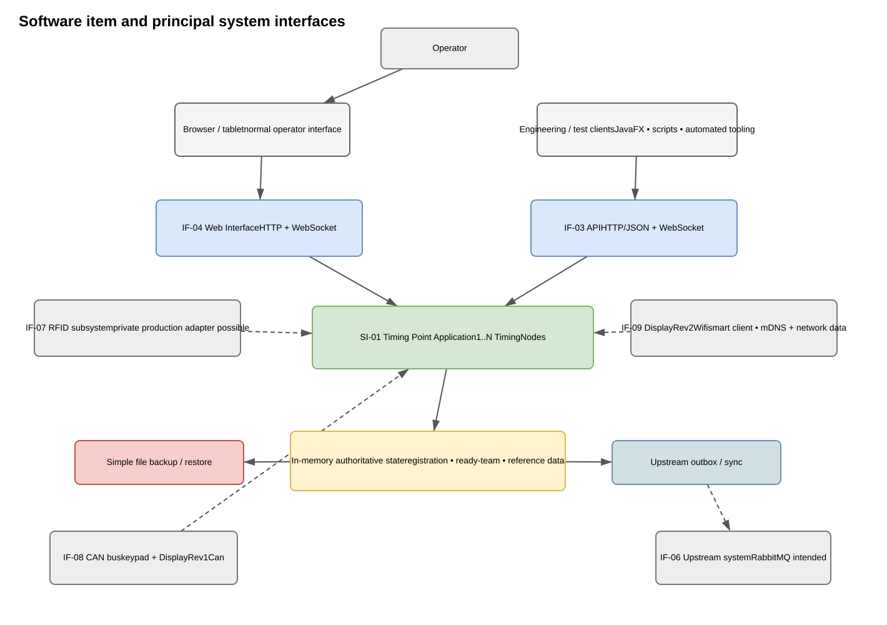
*Figure SYS-01 — Software items and principal system interfaces.*

### Software-item relationships

#### **Timing Point Application** (SI-01) ↔ **Desktop GUI Application** (SI-02)

The **Desktop GUI Application** (SI-02) is an IP network client of the **Timing Point Application** (SI-01). It presents operator status and control but does not access the application's memory, files or Java objects directly. The logical IF-03 relationship does not require a Wi-Fi router: a direct, same-host, point-to-point or normal LAN/Wi-Fi IP path may carry the interface.


#### **Timing Point Application** (SI-01) ↔ backend

The **Timing Point Application** (SI-01) exchanges race/reference data, timing records, status and reconciliation information with the upstream system through a system-owned semantic interface. SI-01 owns the semantic `TimingData` representation and `UpstreamProtocol` behaviour; concrete transport/session technology and deployment-specific wire routing remain implementation/integration concerns unless they change the external system contract.

#### **Timing Point Application** (SI-01) ↔ field devices

RFID, CAN, keypad, beeper and display equipment are external device boundaries of the **Timing Point Application** (SI-01). Device semantics belong in system/device interfaces; internal device/network-controller lifecycle, discovery, threads and processing pipelines belong in the **Timing Point Application** (SI-01) architecture/design.

The beeper is currently a transport-neutral device role; its concrete transport/interface allocation remains deferred rather than being assumed to be CAN.

The two display generations deliberately have different ownership. DisplayRev1Can is a passive CAN device actively driven by SI-01. DisplayRev2Wifi is a smart external client: SI-01 advertises a local data service, the display discovers and connects to it, and the display owns its own rendering and synchronisation behaviour.

### System interface catalogue

This catalogue identifies system-owned boundaries before all individual IDDs are mature. IDs are working identifiers but should remain stable once promoted.

| Interface | Parties | Current transport/direction | Purpose | Planned documentation |
| --- | --- | --- | --- | --- |
| **IF-01 Local Operator Console** | Operator ↔ SI-01 | local console/shell | Local version, status and operator commands | operator/application interface material |
| **IF-02 Remote Shell** | Operator/service tool ↔ SI-01 | remote terminal/shell, technology TBD | Remote status and commands using shared semantics | ISD candidate |
| **IF-03 API** | SI-02 / engineering & test clients ↔ SI-01 | HTTP/JSON + WebSocket over an available IP path | General remote query/control/diagnostics/test API; first slice is version/status/events | `32-03-ISD-application-control-status.md` candidate |
| **IF-04 Desktop Operator HMI** | Operator ↔ SI-02 | desktop GUI | Desktop screens, controls and operator feedback | GUI/HMI ISD candidate |
| **IF-05 TimingData Interchange** | SI-01 / engineering & test tools / compatible data consumers | append-only file / record interchange | Canonical timing-record semantics, identity, ordering, versioning and reference encoding | `32-05-ISD-timingdata-interchange.md` + `33-05-IDD-timingdata-interchange.md` |
| **IF-06 Backend Integration** | SI-01 ↔ Backend | transport implementation below semantic boundary | Race/reference-data sync, registrations, reconciliation/status | system ISD; proprietary wire/design details may remain private |
| **IF-07 RFID Integration** | SI-01 ↔ RFID subsystem | hardware/protocol adapter | RFID observations, lifecycle and health | device/semantic contract candidate |
| **IF-08 CAN Device Integration** | SI-01 ↔ CAN bus/devices | CAN | CAN discovery/state, DisplayRev1Can and keypad interaction | system/device ISD candidate |
| **IF-09 Smart Display V2** | DisplayRev2Wifi → SI-01 service | mDNS discovery + IP session; direct or LAN/Wi-Fi deployment | Discover SI-01 and consume timing/status/reference data; smart display owns render/sync | system ISD candidate |
| **IF-10 Test Control** | test/reference tooling ↔ public stubs | development-only | Inject device/network/fault behaviour through supported boundaries | SDE/SVP/test design |
| **IF-11 Application Configuration** | Deployment/configuration source → SI-01 | built-in profile/platform/mode defaults + explicit deployment overrides + secret references | Resolve deployed TimingNodes, I/O assets, presentation bindings and runtime composition inputs | `32-11-ISD-application-configuration.md` |

System-level ISDs own normative interface semantics. Software-item requirements reference those obligations rather than redefining the system contract independently. Optional IDDs describe concrete interface design where a separate design baseline is justified.

### Cross-software-item interaction principles

The following rules apply across software-item boundaries:

- operator and engineering clients should use shared application semantics rather than implement different business rules per client;
- network clients read state from and send commands to the **Timing Point Application** (SI-01); timing state remains in that application;
- loss of the **Desktop GUI Application** (SI-02) or an engineering/test client must not by itself stop local operation of the **Timing Point Application** (SI-01);
- IF-03 and IF-09 are endpoint-to-endpoint logical interfaces and must not make a physical Wi-Fi router an architectural prerequisite;
- development and automated integration verification may use loopback, same-host or direct IP connectivity while exercising the same system interface semantics;
- interface versioning and compatibility must be explicit once interfaces become stable contracts;
- transport-specific implementation detail should not leak into the semantic system interface unless that transport is itself part of the external contract;
- system status must distinguish local IP availability, configured network-infrastructure state, external reachability and backend/session health where those distinctions affect operator decisions.

### System deployment view

The principal device/interface relationships are a **software-system concern** because they show where the **Timing Point Application** (SI-01), the operator software items, external field devices and backend meet. The lines in this view are logical system-interface relationships: they deliberately do not force traffic through a router node.

<a id="fig-sys-02"></a>
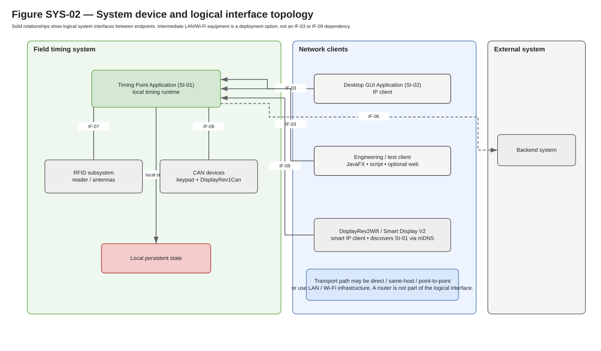
*Figure SYS-02 — System device and logical interface topology.*

Representative relationships are:

```text
Deployment/configuration source
  +-- IF-11 --> SI-01

Field host
  SI-01 Timing Point Application
    |
    +-- IF-07 --> RFID subsystem
    +-- IF-08 --> CAN devices / keypad / DisplayRev1Can
    +-- IF-05 --> canonical TimingData file/interchange

SI-02 Desktop GUI
  +-- IF-03 over available IP path --> SI-01

Engineering/test clients
  +-- IF-03 over available IP path --> SI-01

DisplayRev2Wifi / Smart Display V2
  +-- discovers SI-01 service through mDNS
  +-- IF-09 client session --> SI-01

Backend
  +-- IF-06 over configured external path --> SI-01
```

An available IP path may be direct/point-to-point, same-host or loopback during development/test, or may run over normal LAN/Wi-Fi infrastructure in a field deployment. A Wi-Fi router/access point is therefore **optional deployment infrastructure**, not part of the semantic definition of IF-03 or IF-09.

#### Connectivity and reachability state

Network health is not one boolean and should not be modeled as one mandatory chain. The system needs to expose separately observable states because they answer different operational questions.

<a id="fig-sys-03"></a>
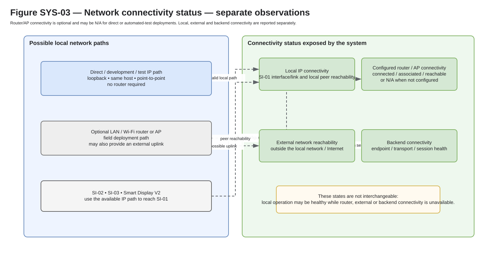
*Figure SYS-03 — Network connectivity status — separate observations.*

At minimum distinguish:

- **local IP connectivity** — network interface/link of the **Timing Point Application** (SI-01) and its ability to communicate with local peers;
- **configured router/AP connectivity** — whether the deployment is connected/associated with the configured local router or access point; this may legitimately be **N/A** for direct/development/test compositions;
- **external network reachability** — whether connectivity beyond the local network is available;
- **backend connectivity** — whether the configured backend endpoint/transport/session is healthy.

These states must not be conflated. For example, local timing and direct local clients may remain fully operational while the router, external uplink or backend is unavailable. Conversely, a configured field deployment may need to report that it has lost its expected router/AP even before external reachability is tested.

The exact process/thread topology, internal runtime cardinality, queueing model, service composition, connectivity probing mechanism and adapter implementation are intentionally outside this SSSD.

### Cross-system architectural constraints

#### State ownership and disconnected operation

The **Timing Point Application** (SI-01) keeps the local operational state. Losing a GUI/test client or external connection must not move that state elsewhere or make synchronisation appear healthy when it is not.

#### Public/private implementation boundary

System contracts used by public reference/core implementation code must allow private production implementations to plug in without public code depending on private source or proprietary identities.

Selected implementation families may be supplied by Java-8-compatible extension providers behind those stable contracts. The expected extension families are timing-data representation/codec, upstream protocol, antenna implementation, CAN protocol and display protocol. Extension discovery and provider selection are SI-01 implementation/composition concerns; they must not change the software-system interfaces or require proprietary source in the public repositories. Public/reference compositions must remain executable with synthetic/reference implementations so the public system can be built and verified independently.

#### Interface-first separation

Software-item interaction is defined in terms of system-owned semantics. Internal implementation choices such as RabbitMQ libraries, HTTP servers, logging frameworks, executors or file formats are owned by the relevant software-item architecture unless the choice becomes part of an external contract.

#### Deployment portability

The architecture must support constrained field deployment and normal Linux/Windows development/test environments without changing the software-item boundaries. Automated integration verification must be able to exercise network interfaces without provisioning a physical Wi-Fi router unless the test explicitly targets router/AP behaviour.

### Relationship to software-item architecture

The SSD for the **Timing Point Application** (SI-01) owns, among other things:

- layered application responsibilities;
- `TimingNode` software/domain decomposition, separate registration-hardware topology, and their configuration/data-source identity mapping;
- threading/concurrency and internal messaging;
- status architecture and lifecycle handling;
- persistence and restore strategy;
- logging/configuration/composition choices;
- Java/core/library decisions;
- RFID/CAN/display adapter architecture behind the system device interfaces;
- upstream transport implementation behind IF-06;
- resource-budget implications of those choices.

The SSD for the planned **Desktop GUI Application** (SI-02) owns its requirements/internal architecture while conforming to the API and applicable IDDs.

### Architecture review model

The project uses the 4+1 architectural view model as a review aid, not as a requirement for five documents. At system level, the SSSD primarily provides system context and deployment/relationship views. The software-item SSDs provide the coherent logical, process, development and deployment views of each item and reference selected use cases as scenarios.

Reference: `reference/README.md`.

### Open system-architecture questions

- final system interface ISD/IDD breakdown and ownership;
- authentication, authorisation and secure transport requirements across software-item boundaries;
- compatibility/versioning policy for IF-03 and IF-06;
- which device semantics require system-level IDDs versus software-item-only design;
- required behaviour when local IP, configured router/AP, external network or backend connectivity is unavailable;
- final system-level availability/recovery requirements.


---

## API Interface Specification (ISD)

**Source document:** [32-03-ISD-application-control-status.md](32-03-ISD-application-control-status.md)

Status: review candidate / AP-1 first-executable slice

System interface: **IF-03 — API**

### Purpose

This Interface Specification Document owns the general programmable remote contract between SI-01 and the planned SI-02 GUI, engineering/service tools and automated ST-1 black-box/integration tooling.

For AP-1 it defines only the first-executable subset needed to expose build/version identity, current status and status-change events. The interface is intentionally broader than "status": later supported remote control, test and diagnostic operations may extend IF-03 when their SIP increments require them.

A simple browser-based test client may consume IF-03 later, just like the current JavaFX engineering client. It is not currently a separate product interface.

### Inputs

IF-03 is a system-owned interface allocated by
`31-SSSD-software-system-specification-document.md`. Its detailed contract is
therefore downstream of that allocation and upstream of both participating software-item
specifications. Applicable system use cases supply operational intent.

The SI-01/GUI SSDs and the SVP may trace to this ISD; they are not inputs to it.

### Parties

```text
client side
  planned SI-02 GUI / engineering client
  headless ST-1 / integration test driver
  other supported remote tooling
        |
        | IF-03 API
        v
SI-01 Timing Point Application
```

SI-01 keeps the TimingNode/status state. Clients observe/query it and later submit permitted commands; cached responses do not move that state into the client.

### Transport baseline

The first-executable transport contract is:

- HTTP with JSON for request/response queries;
- WebSocket for live status/event delivery;
- API major version represented in the resource path as `/api/v1`;
- network boundary usable when SI-01 and the client run on different hosts;
- the same semantic application model may also be represented through local console/remote-shell adapters, but those transports are not owned by this ISD.

The contract must remain compatible with the current Java 8 SI-01 baseline and the selected runtime on the Raspberry Pi target. HTTP and WebSocket may use separate configured listeners/ports in the first executable; the resource paths and semantics remain one IF-03 contract.

### First-executable resources

```text
GET /api/v1/version
GET /api/v1/status
WS  /api/v1/events
```

Only `GET` is required for the two HTTP resources in this slice. Later application commands may add other methods/resources without changing the ownership principle.

### Common compatibility rules

- JSON member names defined by this first slice are stable within API major version `v1`.
- Clients shall tolerate additional/unknown JSON members so the status model can grow compatibly.
- A breaking representation/semantic change requires a new API major path such as `/api/v2` or an explicitly documented compatible migration mechanism.
- Unknown event types shall not corrupt client state; a client may ignore/log an event type it does not understand and can always re-query `/status`.
- UTF-8 is used for JSON text.
- timestamps in the public contract use ISO-8601 UTC text form;
- the API major version is carried by the `/api/v1` resource namespace and is not repeated in every JSON object; `/version` still reports `apiVersion` as build/interface identity.

### Build/version identity

The stable first-executable build identity is:

```json
{
  "application": "timing-application",
  "version": "<project-version>",
  "revision": "<source-revision>",
  "sourceRef": "<branch-tag-or-ref>",
  "buildOrigin": "local|github-actions",
  "dirty": false,
  "apiVersion": "1"
}
```

Field semantics:

- `application` — stable application identity for SI-01;
- `version` — project/application version from the produced build;
- `revision` — exact source revision used to produce the running artifact, normally the Git commit SHA;
- `sourceRef` — source branch, tag or CI ref associated with the build;
- `buildOrigin` — stable build-environment class such as `local` or `github-actions`;
- `dirty` — whether uncommitted source changes were present when the artifact was built;
- `apiVersion` — IF-03 major API version represented by this contract.

The embedded identity deliberately excludes wall-clock build time, CI run/build number,
actor/user and other per-run metadata. Those values would make otherwise identical build
inputs produce different artifacts merely because a build was repeated. `revision` remains the
exact source authority; `sourceRef` and `buildOrigin` provide the human diagnostic context
needed when testing an artifact. A `dirty=true` local build is explicitly not fully described
by its commit SHA alone.

### Current status response

The status resource is intentionally compact. Build identity is queried through
`/version`; status carries only current operational state.

> This is an external interface shape. It does not prescribe a Java class with
> the same structure or a class named `ApplicationStatusSnapshot`. The
> implementation may assemble this response from the application objects that
> exist when the HTTP/status adapter is implemented.

```json
{
  "nodes": [
    {
      "id": "<configured-timing-node-id>",
      "locationId": null,
      "state": "CLOSED"
    }
  ],
  "problems": []
}
```

The first executable does not expose a separate application lifecycle state in
`/status`. A successful query already establishes that the IF-03 service is
running; startup/shutdown process lifecycle remains an internal/runtime concern
for this slice.

Internally SI-01 may host 1..N `TimingSystem` aggregates, each with its own
`SystemStatus`, but `TimingSystemId` is deliberately not part of this external
IF-03 shape. The `nodes` array aggregates the configured TimingNodes.
`TimingNodeId` is application-wide unique and is represented as `id` in the
compact IF-03 node object, so node-specific resources can use
`/api/v1/node/{id}/...` without exposing an internal TimingSystem identifier.

In the Step-4 first-registration slice, `locationId` is either `null` while
no operational location is assigned or the positive current IF-05 `LocationId`
value. `state` is `CLOSED` or `OPEN`. A closed node may retain its last
selected location during the same runtime session; startup/recovery does not
invent a current operational location from historical TimingData.

Problem entries use:

```json
{
  "code": "<stable-machine-code>",
  "severity": "WARNING|ERROR",
  "message": "<human-readable-summary>"
}
```

Clients must not make business decisions by parsing the human-readable `message`; `code` and structured status fields are the machine-readable contract.

### First-executable semantic operations

#### IF03-OP-001 — Get build/version identity

HTTP mapping:

```text
GET /api/v1/version
```

Successful response:

- HTTP `200`;
- `application/json`;
- body is the build/version identity defined above.

Semantics:

- returns the authoritative application build/version identity;
- does not derive a separate client-specific version value;
- remains stable for the lifetime of one running application build;
- is equivalent in meaning to version identity shown by first-executable console/remote-shell views.

#### IF03-OP-002 — Get current status

HTTP mapping:

```text
GET /api/v1/status
```

Successful response:

- HTTP `200`;
- `application/json`;
- body contains the current TimingNode status using the schema above.

Later subsystem/device/backoffice fields may extend the model without changing the ownership principle.

#### IF03-OP-004 — Get public/engineering capabilities

HTTP mapping:

```text
GET /api/v1/capabilities
```

Successful response:

```json
{
  "capabilities": [
    {
      "id": "DIRECT_REGISTRATION_SIMULATION",
      "supported": true,
      "enabled": true
    }
  ]
}
```

Unknown capability IDs added within API v1 are ignored by clients that do not
understand them. The direct-registration engineering command below is available
only when `DIRECT_REGISTRATION_SIMULATION` is both supported and enabled.

#### IF03-OP-005 — Set current operational location

HTTP mapping:

```text
PUT /api/v1/node/{id}/location
```

Request:

```json
{
  "locationId": 24
}
```

The value uses the shared IF-05 `LocationId` representation. Concrete allowed
values remain event/profile/deployment policy outside IF-03.

Successful response is HTTP `200`:

```json
{
  "result": "UPDATED"
}
```

The operation is accepted only while the TimingNode is CLOSED. A successful
change is reflected by subsequent status queries and a `STATUS_CHANGED` event.

#### IF03-OP-006 — Open registration

HTTP mapping:

```text
POST /api/v1/node/{id}/open
```

The request has no semantic body. Successful HTTP `200` results are
`OPENED` or `ALREADY_OPEN`. OPEN without a configured current LocationId is
a domain conflict and does not change state.

#### IF03-OP-007 — Close registration

HTTP mapping:

```text
POST /api/v1/node/{id}/close
```

The request has no semantic body. Successful HTTP `200` results are
`CLOSED` or `ALREADY_CLOSED`. A successful state change is followed by a
`STATUS_CHANGED` event.

#### IF03-OP-008 — Simulate an automatic registration

This is an engineering capability, not a replacement RFID or manual-entry
interface. The short `auto-reg` resource name is a Step-4 review label; the
semantic injection boundary is the important contract decision.

HTTP mapping:

```text
POST /api/v1/dev/node/{id}/auto-reg
```

Request:

```json
{
  "id": "N001",
  "time": "2026-10-01T12:00:00.000000000Z"
}
```

The path `{id}` addresses the TimingNode. The request-body `id` is the
already-resolved shared `RegistrationId`; `N001` is only a short deterministic
example and does not define a required prefix or format. `time` is the accepted observation
time. SI-01 supplies source identity, current LocationId, next committed sequence
and recordedAt and executes the same accepted-registration operation used after
normal RFID interpretation/filtering.

Successful HTTP `200` response:

```json
{
  "seq": 1
}
```

The returned sequence identifies the newly committed record within the addressed
TimingNode. The committed record becomes visible through IF03-OP-009 and a
`TIMING_DATA_COMMITTED` event.

#### IF03-OP-009 — Query committed LogBook

The LogBook resource is node-addressed and bounded. A client does not need to
download the complete history merely to learn its size.

HTTP mappings:

```text
GET /api/v1/node/{id}/logbook
GET /api/v1/node/{id}/logbook?from=101&limit=100
GET /api/v1/node/{id}/logbook?last=100
```

Without query parameters the response is metadata only:

```json
{
  "count": 12457,
  "first": 1,
  "last": 12457
}
```

For an empty LogBook, `count` is `0` and `first`/`last` are `null`.

`from` is an inclusive committed source sequence. `limit` is the maximum
number of records returned. `last` requests the newest records while preserving
source-sequence order. `last` cannot be combined with `from` or `limit`.
The Step-4 v1 baseline limits `limit` and `last` to 1..1000.

A record-bearing response is:

```json
{
  "count": 12457,
  "next": 201,
  "records": []
}
```

`count` is the total committed record count at response time. `next` is the
next source sequence to request when more records are available, otherwise
`null`. Each `records` element uses the public IF-05 TimingData JSON field
semantics. Records are returned in committed source-sequence order; queued or
uncommitted work is never exposed as LogBook content.

#### IF03-OP-003 — Subscribe to status/event updates

WebSocket mapping:

```text
/api/v1/events
```

The first executable may expose this path on a dedicated configured WebSocket listener rather than the A06 HTTP listener. Clients therefore configure the WebSocket endpoint independently while the path and payload semantics remain stable.

After the WebSocket connection is established SI-01 shall immediately send a complete `STATUS_SNAPSHOT` event before normal change events are relied upon.

Event envelope:

```json
{
  "eventType": "STATUS_SNAPSHOT",
  "occurredAt": "<ISO-8601 UTC>",
  "payload": {}
}
```

Step-4 event types:

```text
STATUS_SNAPSHOT
STATUS_CHANGED
TIMING_DATA_COMMITTED
```

For `STATUS_SNAPSHOT`, `payload` contains the complete current status representation.

For `STATUS_CHANGED`, `payload` also contains a complete current status
representation. SI-01 emits this event only after an actual authoritative
location/lifecycle/status change; it shall not manufacture periodic or duplicate
changes merely to exercise the transport.

For `TIMING_DATA_COMMITTED`, `payload` is the committed public IF-05 TimingData
record. It is emitted only after durable local append and LogBook visibility.
Recovery does not replay old records as new live events.

WebSocket delivery order is sufficient within one connected session. The stable
TimingData record key, rather than a separate transient WebSocket sequence,
provides deduplication when history and live delivery overlap.

### Reconnect and resynchronisation

Reconnect semantics rebuild authoritative current state/LogBook gaps before the
client declares its view live:

1. client reconnects to `/api/v1/events`;
2. SI-01 sends a complete `STATUS_SNAPSHOT`; the client begins buffering later
   WebSocket events;
3. the client replaces its cached status from the snapshot;
4. for each selected/cached node, the client queries
   `GET /api/v1/node/{id}/logbook` and fetches only required bounded ranges,
   normally continuing from the last cached sequence;
5. the client applies buffered `STATUS_CHANGED` events in WebSocket order;
6. buffered `TIMING_DATA_COMMITTED` records already present in the rebuilt
   LogBook view are discarded by stable TimingData record key; later records are
   appended in source-sequence order;
7. only after this merge is complete does the client mark the view live.

No durable WebSocket replay across disconnected sessions is required. The
authoritative LogBook is the recovery source for committed TimingData missed
while disconnected.

### Error responses

HTTP failures use a JSON envelope:

```json
{
  "error": {
    "code": "<stable-machine-code>",
    "message": "<human-readable-summary>"
  }
}
```

Step-4 mapping:

| HTTP status | Stable example codes / meaning |
| --- | --- |
| `400` | `MALFORMED_REQUEST`, `INVALID_VALUE` |
| `403` | `CAPABILITY_NOT_ENABLED` |
| `404` | `NOT_FOUND`, `NODE_NOT_FOUND` |
| `405` | `METHOD_NOT_ALLOWED` |
| `409` | domain-state conflict such as `NO_LOCATION`, `NODE_NOT_CLOSED`, `NODE_NOT_OPEN` |
| `503` | `BUSY`, `UNAVAILABLE`, or expected commit dependency failure |
| `504` | `OUTCOME_UNKNOWN` after the caller-side operation guard timeout |
| `500` | unexpected internal interface failure |

A timeout response explicitly means that the accepted operation may still execute;
the transport shall not cancel already accepted TimingNode work. Before retrying a
state-changing command whose outcome is unknown, the client resynchronises current
status/history.

A normal reported problem represented by `/status` is not converted into HTTP
`500` merely because a problem entry is present.

### Network access and first-executable security policy

Authentication/authorisation is explicitly **deferred** for the first executable development baseline. This is a deliberate scope decision, not an assumption that the final product is unauthenticated.

Until a later security/interface increment defines authentication:

- the default IF-03 listen address shall be loopback/local-only;
- non-loopback binding must require explicit configuration;
- remote first-executable demonstrations shall run only on a trusted development/test network;
- deployment/prod exposure outside that controlled environment is out of scope;
- CORS/browser-origin policy is deferred until a browser-based client is actually needed.

This allows ST-1, engineering-client and later SI-02 development without prematurely inventing production security while preventing accidental default exposure.

### First-executable contract rules

<a id="IF03-REQ-001"></a>

**IF03-REQ-001 — Shared semantics**

HTTP/JSON and WebSocket representations shall map to the
shared SI-01 application/status semantics rather than
implement independent business/status state in the transport
adapter.

— — —

- **Type:** Interface Requirement
- **Status:** Review
- **Derived from:** [`SI01-REQ-022`](41-01-SSD-timing-application-specification-document.md#SI01-REQ-022), [`SI01-REQ-030`](41-01-SSD-timing-application-specification-document.md#SI01-REQ-030)
- **Satisfied by:** [`Api`](41-01-SSD-timing-application-specification-document.md#Api), [`CommandHandler`](41-01-SSD-timing-application-specification-document.md#CommandHandler)

---


<a id="IF03-REQ-002"></a>

**IF03-REQ-002 — Remote-host operation**

The interface shall support operation across a normal IP
network boundary when non-loopback access is explicitly
configured, so a client can run on a workstation while SI-01
runs on another host such as a Raspberry Pi.

— — —

- **Type:** Interface Requirement
- **Status:** Review
- **Derived from:** [`SI01-REQ-031`](41-01-SSD-timing-application-specification-document.md#SI01-REQ-031)
- **Satisfied by:** [`Api`](41-01-SSD-timing-application-specification-document.md#Api)

---


<a id="IF03-REQ-003"></a>

**IF03-REQ-003 — Version query**

The interface shall provide `GET /api/v1/version` representing `IF03-OP-001`.

— — —

- **Type:** Interface Requirement
- **Status:** Review
- **Derived from:** [`SI01-REQ-010`](41-01-SSD-timing-application-specification-document.md#SI01-REQ-010), [`SI01-REQ-011`](41-01-SSD-timing-application-specification-document.md#SI01-REQ-011)
- **Verified by:** [`VC-ST1-001`](61-01-VTS-timing-application-verification-test-specification.md#VC-ST1-001)

---


<a id="IF03-REQ-004"></a>

**IF03-REQ-004 — Status query**

The interface shall provide `GET /api/v1/status`
representing `IF03-OP-002`.

— — —

- **Type:** Interface Requirement
- **Status:** Review
- **Derived from:** [`SI01-REQ-020`](41-01-SSD-timing-application-specification-document.md#SI01-REQ-020), [`SI01-REQ-021`](41-01-SSD-timing-application-specification-document.md#SI01-REQ-021), [`SI01-REQ-022`](41-01-SSD-timing-application-specification-document.md#SI01-REQ-022)
- **Satisfied by:** [`Api`](41-01-SSD-timing-application-specification-document.md#Api), [`CommandHandler`](41-01-SSD-timing-application-specification-document.md#CommandHandler)
- **Verified by:** [`VC-ST1-001`](61-01-VTS-timing-application-verification-test-specification.md#VC-ST1-001)

---


<a id="IF03-REQ-005"></a>

**IF03-REQ-005 — Live status/event delivery**

The interface shall provide WebSocket `/api/v1/events` representing `IF03-OP-003` for the first executable.

— — —

- **Type:** Interface Requirement
- **Status:** Review
- **Derived from:** [`SI01-REQ-023`](41-01-SSD-timing-application-specification-document.md#SI01-REQ-023)
- **Verified by:** [`VC-ST1-001`](61-01-VTS-timing-application-verification-test-specification.md#VC-ST1-001)

---


<a id="IF03-REQ-006"></a>

**IF03-REQ-006 — Reconnect to current state**

A client that connects/reconnects shall receive a complete current status snapshot before relying on subsequent live events.

— — —

- **Type:** Interface Requirement
- **Status:** Review
- **Derived from:** [`SI01-REQ-023`](41-01-SSD-timing-application-specification-document.md#SI01-REQ-023)
- **Verified by:** [`VC-ST1-001`](61-01-VTS-timing-application-verification-test-specification.md#VC-ST1-001)

---


<a id="IF03-REQ-007"></a>

**IF03-REQ-007 — Machine-readable representation**

The HTTP query representation shall be machine-readable JSON suitable for SI-02, engineering clients and automated ST-1 verification.

— — —

- **Type:** Interface Requirement
- **Status:** Review
- **Derived from:** [`SI01-REQ-031`](41-01-SSD-timing-application-specification-document.md#SI01-REQ-031)

---


<a id="IF03-REQ-008"></a>

**IF03-REQ-008 — Explicit failure response**

Unsupported or invalid HTTP requests shall produce the explicit JSON failure outcome defined in this ISD rather than a successful response containing silently invalid data.

— — —

- **Type:** Interface Requirement
- **Status:** Review
- **Derived from:** [`SI01-REQ-031`](41-01-SSD-timing-application-specification-document.md#SI01-REQ-031)

---


<a id="IF03-REQ-009"></a>

**IF03-REQ-009 — Safe default listen scope**

Without explicit configuration the first-executable IF-03 service shall bind only to a local/loopback interface.

— — —

- **Type:** Interface Requirement
- **Status:** Review
- **Derived from:** [`SI01-REQ-032`](41-01-SSD-timing-application-specification-document.md#SI01-REQ-032)

---


<a id="IF03-REQ-010"></a>

**IF03-REQ-010 — Compatible extension**

Clients shall be able to ignore unknown response members/event types within API major version `v1`; breaking contract changes shall not silently redefine existing `v1` semantics.

— — —

- **Type:** Interface Requirement
- **Status:** Review
- **Derived from:** [`SI01-REQ-033`](41-01-SSD-timing-application-specification-document.md#SI01-REQ-033)

---


<a id="IF03-REQ-011"></a>

**IF03-REQ-011 — Step-4 location and lifecycle control**

IF-03 shall expose 1..N application-wide-unique TimingNode identities with current
optional LocationId and OPEN/CLOSED state and shall provide node-addressed
IF03-OP-005/006/007 location/open/close control using the shared SI-01
application/domain semantics.

— — —

- **Type:** Interface Requirement
- **Status:** Review
- **Derived from:** [`SI01-REQ-040`](41-01-SSD-timing-application-specification-document.md#SI01-REQ-040)
- **Verified by:** [`VC-ST1-002`](61-01-VTS-timing-application-verification-test-specification.md#VC-ST1-002)

---


<a id="IF03-REQ-012"></a>

**IF03-REQ-012 — Engineering capability discovery**

IF-03 shall provide IF03-OP-004 so the Engineering Client can determine whether
direct registration simulation is supported and enabled before presenting or
using that control.

— — —

- **Type:** Interface Requirement
- **Status:** Review
- **Derived from:** [`SI01-REQ-043`](41-01-SSD-timing-application-specification-document.md#SI01-REQ-043)
- **Verified by:** [`VC-ST1-002`](61-01-VTS-timing-application-verification-test-specification.md#VC-ST1-002)

---


<a id="IF03-REQ-013"></a>

**IF03-REQ-013 — Dev auto-reg control**

When the advertised capability is supported and enabled, IF-03 shall provide
IF03-OP-008 and pass only `id` plus `time` to the normal SI-01
accepted-registration operation.

— — —

- **Type:** Interface Requirement
- **Status:** Review
- **Derived from:** [`SI01-REQ-041`](41-01-SSD-timing-application-specification-document.md#SI01-REQ-041), [`SI01-REQ-043`](41-01-SSD-timing-application-specification-document.md#SI01-REQ-043)
- **Verified by:** [`VC-ST1-002`](61-01-VTS-timing-application-verification-test-specification.md#VC-ST1-002)

---


<a id="IF03-REQ-014"></a>

**IF03-REQ-014 — Committed LogBook query**

IF-03 shall provide IF03-OP-009 as a node-addressed LogBook metadata and bounded
range query in source-sequence order using public IF-05 field semantics.

— — —

- **Type:** Interface Requirement
- **Status:** Review
- **Derived from:** [`SI01-REQ-042`](41-01-SSD-timing-application-specification-document.md#SI01-REQ-042)
- **Verified by:** [`VC-ST1-002`](61-01-VTS-timing-application-verification-test-specification.md#VC-ST1-002)

---


<a id="IF03-REQ-015"></a>

**IF03-REQ-015 — Live committed TimingData delivery**

The IF-03 WebSocket event stream shall emit `TIMING_DATA_COMMITTED` only after
the corresponding TimingData record is committed and visible in the authoritative
LogBook.

— — —

- **Type:** Interface Requirement
- **Status:** Review
- **Derived from:** [`SI01-REQ-042`](41-01-SSD-timing-application-specification-document.md#SI01-REQ-042)
- **Verified by:** [`VC-ST1-002`](61-01-VTS-timing-application-verification-test-specification.md#VC-ST1-002)

---


<a id="IF03-REQ-016"></a>

**IF03-REQ-016 — Rebuild LogBook before live presentation**

A reconnecting client shall be able to combine the current status snapshot,
bounded authoritative LogBook ranges and buffered live events using stable
TimingData record keys before declaring its view live.

— — —

- **Type:** Interface Requirement
- **Status:** Review
- **Derived from:** [`SI01-REQ-044`](41-01-SSD-timing-application-specification-document.md#SI01-REQ-044)
- **Verified by:** [`VC-ST1-003`](61-01-VTS-timing-application-verification-test-specification.md#VC-ST1-003)

---


### Relationship to SI-01 SSD

Each IF-03 requirement owns its upstream SI-01 traceability through its
`derived_from` relation. That relation is authored once with the requirement and
the generated engineering reader/graph provides the inverse context back to IF-03.

The SI-01 SSD references this contract instead of duplicating transport-level
requirements.

### Verification references

IF-03 owns the transport contract and acceptance semantics above. Concrete
verification procedures are downstream and are specified in
`61-01-VTS-timing-application-verification-test-specification.md`.

Current ST-1 cases using IF-03 include:

- `VC-ST1-001` — query version/status, connect/reconnect the event stream and
  verify a complete current status snapshot through the running executable;
- `VC-ST1-002` — exercise the first-registration control/history/live flow
  through the running executable.

The VTS maps each case to the applicable SSD/ISD requirements. Execution status,
PASS/FAIL, logs and persisted test artifacts belong to generated verification
evidence rather than this ISD.

### Remote shell scope

The first executable may expose equivalent version/status semantics through a remote-shell adapter as required by the SIP, but AP-1 does **not** introduce a separate system ISD for that transport.

Reason:

- the public programmable contract needed by the planned SI-02 GUI, engineering tooling and ST-1 is IF-03;
- remote-shell technology is an implementation/support adapter concern at this stage;
- it must reuse the shared version/status application queries and must not own a separate status model.

If the remote shell later becomes a stable externally consumed system interface, it should receive an appropriate ISD then.

### Deferred interface scope

The following IF-03 capabilities are visible in later use cases/architecture but intentionally outside this AP-1 baseline:

- start procedure;
- RFID power/reinitialisation commands;
- ready-team add/remove;
- manual registration/penalty/revocation beyond the dev auto-reg path;
- reference-data administration;
- backoffice controls;
- detailed diagnostics/support export;
- production authentication/role-based authorisation;
- browser CORS/origin policy if a browser-based test/client tool is later added.

They should be added when their corresponding SIP capability approaches implementation.

### Remaining AP-1 implementation choices

The following are implementation/toolchain selections rather than unresolved interface semantics and may be chosen in the implementation repository/toolchain step:

- concrete Java HTTP/WebSocket library;
- concrete remote-shell library/technology;
- concrete JSON library;
- concrete configuration library;
- exact JDK/Maven/toolchain provisioning.

Changing one of these libraries must not silently change the contract defined above.


---

## TimingData Interchange Interface Specification (ISD)

**Source document:** [32-05-ISD-timingdata-interchange.md](32-05-ISD-timingdata-interchange.md)

Status: draft / Step 4 D03 TimingData interface

System interface: **IF-05 — TimingData Interchange**

### Purpose

This Interface Specification Document defines the normative TimingData
interchange contract.

It defines **what** every conforming TimingData representation must preserve:

- record identity and source ordering;
- Node ID, Location ID and Registration ID semantics;
- automatic and manual registration semantics;
- time semantics defined by record types;
- compatibility rules for the default/reference representation and alternative
  product/event-specific representations.

Concrete encoding choices for the current default/reference representation are
defined in `33-05-IDD-timingdata-interchange.md`.

IF-05 does not define Java classes, provider/factory APIs, worker threads,
storage classes or UI behaviour. Those are software-item design concerns.

The current slice does not define TimingNode OPEN/CLOSE as TimingData records and
does not enable registration revocation at runtime. A future design may add
revoke records without changing the identity/order principles defined here.

### Inputs

IF-05 is a system-owned interface allocated by
`31-SSSD-software-system-specification-document.md`.

Applicable system use cases provide the operational intent. Software-item
specifications and detailed designs consume this ISD and shall not redefine the
interface semantics independently.

### Interface scope

IF-05 owns:

- the semantic values carried by TimingData records;
- stable record identity;
- source ordering;
- registration identity and registration-family semantics;
- timestamp semantics;
- compatibility obligations across concrete representations;
- requirements on the public/default reference representation.

IF-05 does **not** own:

- RFID/tag decoding or source-resolution algorithms;
- TimingNode lifecycle implementation;
- sequence-allocation implementation;
- persistence classes or filesystem APIs;
- application queues/threads;
- query/read-model implementation;
- UI rendering;
- upstream transport/session mechanics;
- Java provider/factory/codec design.

### Common TimingData semantics

Every TimingData record has a small common envelope:

| Semantic value | Presence | Meaning |
| --- | --- | --- |
| Node ID | Always | identifies the TimingNode that owns the source stream |
| sequence number | Always | record number within that Node ID stream |
| Location ID | Always | location captured with the record |
| record type | Always | identifies how the remaining record data shall be interpreted |
| Registration ID | By record type | required by registration record types |
| time | By record type | time value defined by the selected record type |
| code | By record type | additional record-type-specific classification/meaning |

`By record type` does not mean optional when that record type is selected. For
example, Registration ID and time are required for a registration
record, but are not fields of a future OPEN/CLOSE or other unrelated record
type.

A committed record captures its Location ID. Later TimingNode reconfiguration
does not change that historical value.

Within a TimingSystem, the combination of Node ID and sequence number identifies
one committed TimingData record. Sequence numbers are local to one Node ID
stream; they are not one application-wide counter.

The default/reference development-v1 design maps the currently supported record
types to JSON in `33-05-IDD-timingdata-interchange.md`.

### Record identity and sequence

Sequence rules:

- numbering is scoped per Node ID;
- the authoritative local source stream advances by exactly one for each
  committed record;
- a new source stream starts at **1**;
- sequence number **0 is reserved**;
- changing Location ID does not reset the sequence;
- sequence is an ordering/traceability value, not a timestamp;
- a committed sequence number is never reused within the same Node ID stream;
- the sequence does not wrap;
- an authoritative complete local stream is contiguous;
- partial/imported/exported subsets may contain visible gaps, but records are not
  renumbered and such a subset shall not be presented as a complete contiguous
  authoritative stream.

How software allocates and durably commits the next sequence is outside IF-05.

### Registration semantics

IF-05 currently defines registration semantics for:

- **automatic registration** — a registration originating from the automatic
  observation path;
- **manual registration** — a registration initiated manually by an
  operator/tool.

A registration record carries a **Registration ID** and **time**.
These values are specific to registration records; they are not common
TimingData-envelope values.

Registration semantics shall support:

- adding a registration; and
- revoking a previously added registration.

A revocation is represented by a new TimingData record and does not modify the
original committed registration record. It refers to the registration being
withdrawn using the Registration ID and time associated with that registration.

Whether further disambiguation is needed when the same Registration ID/time
combination can occur more than once remains a draft/open interface decision.

The concrete representation of add/revoke, automatic/manual registration and
time-source metadata belongs to the IDD.

### Registration ID boundary

Registration ID is a provider-neutral value used by registration record
families. It is not required for TimingData record types that do not
represent a registration.

For registration records, the common semantic form is a non-empty string.
Event/profile-specific allowed values, number ranges, tag mappings and
participant/reference-data rules remain outside IF-05.

Registration ID is separate from record identity (Node ID + sequence number).

### Time

For the current registration record types, `time` represents the absolute
instant assigned to that registration.

The current interface direction is to preserve that instant across conforming
representations. The exact textual representation belongs to the IDD.

Other TimingData record types may give `time` a different defined meaning, or
may not use a time value at all. `time` is therefore record-type-dependent,
not part of the always-present envelope.

### Default/reference representation

The project provides one default/reference representation for development,
engineering/test tooling and compatible consumers. Its concrete JSON/JSON Lines
design is documented by `33-05-IDD-timingdata-interchange.md`.

The reference representation is a design of the IF-05 semantic model; its JSON
member names, line framing, version field and optional metadata are not common
TimingData-envelope values.

### Alternative representations

A product/event-specific implementation may use another concrete representation,
including a different text, fixed-field, binary or proprietary format.

Such a representation does not need to reuse the default filename extension,
record framing or member names. Its interface conformance is assessed against
the applicable IF-05 requirements and the semantics of the record types it
supports.

### IF-05 requirements

These requirements are still under development. Their per-requirement maturity
is shown by `status`: `D` = Draft, `R` = Review, `A` = Approved,
`O` = Obsolete.

Concrete JSON member names, JSON Lines framing, code arrays, optional metadata
and representation-version conventions belong to the IDD and are not IF-05
requirements by themselves.

<a id="IF05-REQ-001"></a>

**IF05-REQ-001 — Common TimingData envelope**

Every TimingData record shall identify its Node ID, sequence number, Location ID
and record type. Values required in addition to this common envelope shall be
defined by the record type.

— — —

- **Type:** Interface Requirement
- **Status:** Draft
- **Source for:** [`SI01-REQ-045`](41-01-SSD-timing-application-specification-document.md#SI01-REQ-045)

---


<a id="IF05-REQ-002"></a>

**IF05-REQ-002 — Record identity within a TimingSystem**

Within one Node ID stream, committed TimingData records shall have unique
sequence numbers. Within a TimingSystem, Node ID together with sequence number
shall uniquely identify a committed TimingData record.

— — —

- **Type:** Interface Requirement
- **Status:** Draft
- **Source for:** [`SI01-REQ-045`](41-01-SSD-timing-application-specification-document.md#SI01-REQ-045), [`SI01-REQ-047`](41-01-SSD-timing-application-specification-document.md#SI01-REQ-047)

---


<a id="IF05-REQ-003"></a>

**IF05-REQ-003 — Sequence progression**

For each Node ID stream, committed sequence numbers shall start at 1 and increase
by one for each subsequent committed TimingData record. Sequence number 0 shall
not identify a committed record.

— — —

- **Type:** Interface Requirement
- **Status:** Draft
- **Source for:** [`SI01-REQ-045`](41-01-SSD-timing-application-specification-document.md#SI01-REQ-045), [`SI01-REQ-047`](41-01-SSD-timing-application-specification-document.md#SI01-REQ-047)

---


<a id="IF05-REQ-004"></a>

**IF05-REQ-004 — Automatic and manual registration**

IF-05 registration records shall distinguish automatic registration from manual
registration.

— — —

- **Type:** Interface Requirement
- **Status:** Draft
- **Source for:** [`SI01-REQ-045`](41-01-SSD-timing-application-specification-document.md#SI01-REQ-045)

---


<a id="IF05-REQ-005"></a>

**IF05-REQ-005 — Registration record values**

An added or revoked registration record shall identify the Registration ID and
time of the registration to which it refers.

— — —

- **Type:** Interface Requirement
- **Status:** Draft
- **Source for:** [`SI01-REQ-045`](41-01-SSD-timing-application-specification-document.md#SI01-REQ-045)

---


<a id="IF05-REQ-006"></a>

**IF05-REQ-006 — Registration add and revoke**

IF-05 shall support adding a registration and revoking a previously added
registration. A revocation shall be represented by a new TimingData record and
shall refer to the registration being withdrawn using its Registration ID and
time; it shall not modify the original committed record.

— — —

- **Type:** Interface Requirement
- **Status:** Draft
- **Source for:** [`SI01-REQ-045`](41-01-SSD-timing-application-specification-document.md#SI01-REQ-045)

---


<a id="IF05-REQ-007"></a>

**IF05-REQ-007 — Committed record immutability**

A committed TimingData record shall not be modified or renumbered. A later
operation that changes the meaning of earlier data shall be represented by a new
TimingData record.

— — —

- **Type:** Interface Requirement
- **Status:** Draft
- **Source for:** [`SI01-REQ-045`](41-01-SSD-timing-application-specification-document.md#SI01-REQ-045), [`SI01-REQ-047`](41-01-SSD-timing-application-specification-document.md#SI01-REQ-047)

---


### Deferred from this first slice

- TimingNode OPEN/CLOSE TimingData representation;
- revoke disambiguation beyond Registration ID + time, if later needed;
- start-procedure record type and payload;
- penalty/correction record types and payloads;
- unknown-registration semantics;
- source/tag provenance fields;
- filename/directory policy, retention, rotation and filesystem-specific
  durability primitives;
- upstream transport/session/reconciliation semantics owned by IF-06;
- further IF-03 resources that create or inspect future record types.


---

## TimingData Interchange Interface Design Description (IDD)

**Source document:** [33-05-IDD-timingdata-interchange.md](33-05-IDD-timingdata-interchange.md)

Status: draft / development-v1 reference representation

System interface: **IF-05 — TimingData Interchange**

Implements: `32-05-ISD-timingdata-interchange.md`

### Purpose

This Interface Design Description defines the current **default/reference
development-v1 representation** of IF-05 TimingData.

The ISD owns the normative TimingData semantics and requirements. This IDD
describes how that contract is represented as compact JSON records in an
append-only JSON Lines file.

This document deliberately does not define Java classes, factories, providers,
threads, queues or storage implementation classes.

### Design overview

The reference design uses:

- one compact JSON object per TimingData record;
- one complete JSON object per JSON Lines record;
- one Node ID source stream per file;
- monotonically increasing `seqNr`;
- explicit record type in `recType`;
- compact semantic codes in `code`;
- absolute UTC timestamp text;
- per-record integer representation version `v`.

<a id="fig-if05-01"></a>
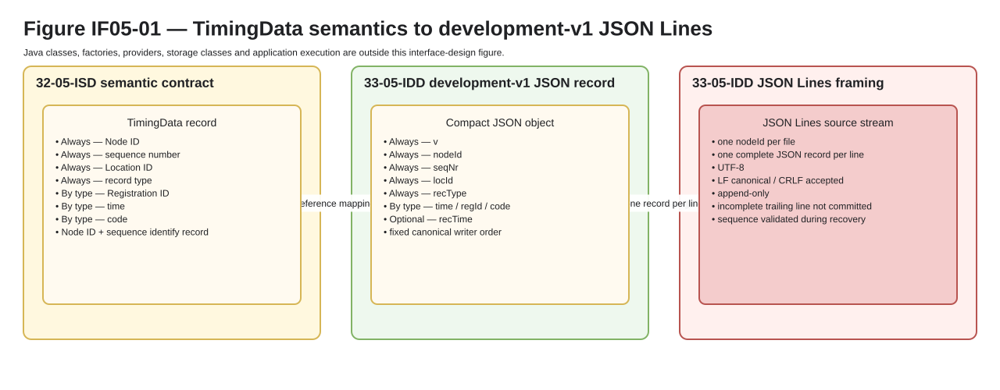

*Figure IF05-01 — IF-05 semantics mapped to development-v1 JSON and JSON Lines.*

### Semantic-to-JSON mapping

| Semantic value | Presence | v1 JSON member |
| --- | --- | --- |
| representation version | Always | `v` |
| Node ID | Always | `nodeId` |
| sequence number | Always | `seqNr` |
| Location ID | Always | `locId` |
| record type | Always | `recType` |
| time | By record type | `time` |
| Registration ID | By record type | `regId` |
| code | By record type | `code` |
| record creation time metadata | Optional | `recTime` |

The stable IF-05 record key `(Node ID, sequence number)` is represented by
`(nodeId, seqNr)`.

### Registration record mapping

#### AUTO_REG

Automatic registration add:

```text
recType = AUTO_REG
code    = [ADD]
```

The record type already carries the automatic-registration meaning, so `AUTO`
is not repeated in `code`.

Reserved future revoke mapping:

```text
recType = AUTO_REG
code    = [REV]
same regId
same time
```

#### MAN_REG

Manual registration using system-assigned time:

```text
recType = MAN_REG
code    = [ADD, AUTO]
```

Manual registration using operator-entered time:

```text
recType = MAN_REG
code    = [ADD, MAN]
```

Reserved future revoke mappings:

```text
[ADD, AUTO] -> [REV, AUTO]
[ADD, MAN]  -> [REV, MAN]
```

Canonical writer output places the action (`ADD` or future `REV`) first.
Array order is not semantic to a reader; the valid code combination is.
Duplicate, contradictory or unknown codes for a known record type are invalid.

A future revoke record repeats the original `regId` and `time`, receives a
new `seqNr` and `recTime`, and never rewrites the original record.

### Development-v1 record matrix

| Record type | Current add code | Required registration data | Reserved future revoke code |
| --- | --- | --- | --- |
| `AUTO_REG` | `["ADD"]` | `regId`, `time` | `["REV"]` |
| `MAN_REG` | `["ADD","AUTO"]` or `["ADD","MAN"]` | `regId`, `time` | `["REV","AUTO"]` or `["REV","MAN"]` |

### Development-v1 JSON contract

Known members use the following JSON types and validation rules.

| Member | JSON type | Presence | v1 design rule |
| --- | --- | --- | --- |
| `v` | integer | Always | exactly `1` for the current development format |
| `nodeId` | string | Always | non-empty Node ID |
| `seqNr` | integer | Always | `1..9007199254740991`; plain decimal; v1 reference-design limit |
| `locId` | integer | Always | positive Location ID representation |
| `recType` | string | Always | identifies the concrete v1 record type |
| `time` | string | By record type | required for `AUTO_REG` and `MAN_REG`; canonical time text |
| `regId` | string | By record type | required for `AUTO_REG` and `MAN_REG`; non-empty Registration ID |
| `code` | array of strings | By record type | required for `AUTO_REG` and `MAN_REG`; labels/codes valid for the selected `recType` |
| `recTime` | string | Optional | canonical record-creation time metadata when emitted |

Canonical writer member order:

```text
v
nodeId
seqNr
locId
recType
time
regId
code
recTime   # when present
```

Validation rules:

- every `Always` member is present and non-null;
- every `By record type` member required by the selected `recType` is present and non-null;
- `Optional` members such as `recTime` may be omitted;
- `nodeId` is not normalized, case-folded or derived by the reference reader/writer;
- `AUTO_REG` currently accepts exactly `["ADD"]`;
- `MAN_REG` currently accepts `ADD` plus exactly one of `AUTO` or `MAN`;
- readers may accept a valid `code` combination in another array order;
- canonical writer output always emits action first;
- `seqNr` remains authoritative source order; no chronological ordering is
  inferred from `time` or `recTime`.

### Timestamp encoding

Canonical development-v1 timestamp text for registration `time`, and for
optional `recTime` when present, is:

```text
YYYY-MM-DDTHH:mm:ss[.fraction]Z
```

Rules:

- literal `Z` represents UTC;
- fractional seconds are optional and contain **1 to 9 digits** when present;
- canonical writer output omits the fractional part for a whole second;
- unnecessary trailing fractional zeroes are removed;
- offsets such as `+02:00`, implicit local time and timezone names are not
  canonical v1 values.

Examples:

```text
2026-10-01T12:00:00Z
2026-10-02T10:57:43.444Z
2026-10-02T10:57:43.444123789Z
```

`recTime`, when present, is optional record-creation metadata. It is not a
durable-commit marker and is not part of the common IF-05 record envelope.

### JSON Lines file design

The default/reference development-v1 file uses UTF-8 JSON Lines (`.jsonl`) and
contains records from exactly one `nodeId` source stream.

Rules:

- encoding is UTF-8 without BOM;
- there is no file header, footer or comment syntax;
- `v` is carried by every record;
- one complete TimingData JSON object is written per physical line;
- all records in one file use the same `nodeId`;
- canonical writer line ending is **LF** (`0x0A`);
- a reader may accept **CRLF** (`0x0D 0x0A`);
- a line terminator completes the record boundary;
- valid JSON bytes at EOF without LF/CRLF are an incomplete trailing record and
  are not committed;
- blank lines are invalid input;
- every complete line is independently JSON-decodable;
- canonical writer output is compact single-line JSON;
- insignificant JSON whitespace and member ordering are not semantic to readers;
- committed records are append-only and are not rewritten;
- valid complete records before an incomplete trailing line remain readable;
- recovery/import validates Node ID and sequence ordering and reports gaps,
  duplicates or regressions explicitly.

The exact filename, directory mapping, rotation/retention policy and filesystem
durability primitive are outside IF-05. A different TimingData representation
does not have to use `.jsonl`.

### Reference JSON examples

Automatic registration:

```json
{"v":1,"nodeId":"Test","seqNr":1,"locId":24,"recType":"AUTO_REG","time":"2026-10-01T12:00:00Z","regId":"N0001","code":["ADD"],"recTime":"2026-10-02T10:57:43.444Z"}
```

Manual registration using system-assigned time:

```json
{"v":1,"nodeId":"Test","seqNr":2,"locId":24,"recType":"MAN_REG","time":"2026-10-01T12:00:05Z","regId":"N0002","code":["ADD","AUTO"],"recTime":"2026-10-02T10:57:45.1Z"}
```

Manual registration using operator-entered time:

```json
{"v":1,"nodeId":"Test","seqNr":3,"locId":24,"recType":"MAN_REG","time":"2026-10-01T11:59:58.25Z","regId":"N0003","code":["ADD","MAN"],"recTime":"2026-10-02T10:57:46Z"}
```

Reserved future revoke examples:

```json
{"v":1,"nodeId":"Test","seqNr":4,"locId":24,"recType":"AUTO_REG","time":"2026-10-01T12:00:00Z","regId":"N0001","code":["REV"],"recTime":"2026-10-02T11:05:12.123Z"}
{"v":1,"nodeId":"Test","seqNr":5,"locId":24,"recType":"MAN_REG","time":"2026-10-01T11:59:58.25Z","regId":"N0003","code":["REV","MAN"],"recTime":"2026-10-02T11:05:14Z"}
```

The Registration IDs above are synthetic test/example data. Four numeric digits
are used so examples remain convenient for later test sets containing up to
2000 teams; IF-05 does not impose that display convention on Registration ID.

### Compatibility and versioning design

Development v1 includes explicit per-record representation versioning through
an integer `v` member and uses the odd/even maturity convention below. Both are
design choices of this reference representation, not additional IF-05
requirements.

The default/reference representation uses integer format versions:

- **odd** values are development/unstable formats;
- **even** values are released/stable formats;
- current working format: `v = 1`;
- first frozen/released contract: expected `v = 2`;
- later incompatible development work starts at `v = 3`, then may freeze as
  `v = 4`;
- decimal/minor versions such as `1.1` are not used.

Within one supported baseline:

- a canonical writer emits only members defined by the version it implements;
- a reader tolerates additional JSON members when all required known fields
  remain valid;
- an unknown `recType` in an otherwise supported version is retained/reported
  as unsupported rather than reinterpreted as a known type;
- malformed JSON, missing required fields, invalid field types/values, invalid
  `code` combinations and sequence violations are explicit invalid-record
  conditions;
- an unsupported integer `v` is an explicit semantic-decoding compatibility
  failure;
- raw unsupported lines may be retained/exported but are not interpreted using
  another version's semantics;
- compatible additions do not silently change existing member/code meaning.

A stable even-numbered format is not silently redefined. Breaking work starts in
the next odd-numbered development format.

### ISD requirement realization

| ISD requirement | development-v1 design realization |
| --- | --- |
| IF05-REQ-001 | `nodeId`, `seqNr`, `locId` and `recType` form the common JSON envelope |
| IF05-REQ-002 | Node ID + `seqNr` identify a record when streams are combined |
| IF05-REQ-003 | `seqNr` starts at 1 and advances contiguously per Node ID source stream |
| IF05-REQ-004 | `recType` distinguishes `AUTO_REG` and `MAN_REG` |
| IF05-REQ-005 | registration records carry `regId` and `time` |
| IF05-REQ-006 | `code[]` represents ADD/REV while revoke repeats `regId` + `time` in a new record |
| IF05-REQ-007 | JSON Lines persistence is append-only; an existing committed record is not rewritten |

JSON Lines completion rules, unknown-member handling, integer `v`, the v1
`seqNr` limit, odd/even version-number convention and optional `recTime`
are concrete reference-design choices. They are intentionally not additional
IF-05 requirements.


---

## Application Configuration Interface Specification (ISD)

**Source document:** [32-11-ISD-application-configuration.md](32-11-ISD-application-configuration.md)

Status: review candidate / SIP Step-3 configuration baseline

System interface: **IF-11 — Application Configuration**

### Purpose

This Interface Specification Document defines the deployment/configuration contract consumed by SI-01. It describes how a deployment identifies internal TimingSystems and their TimingNodes, I/O assets, presentation bindings, runtime settings and secret references before application composition starts.

It deliberately does **not** define domain behaviour, a Java class hierarchy, a specific YAML library or production secret values.

### Inputs

IF-11 is a system-owned deployment/configuration interface allocated by
`31-SSSD-software-system-specification-document.md`. Applicable system use cases and
deployment constraints provide upstream intent. The SI-01 SSD consumes this contract;
its internal architecture and Java SDD are downstream and are not inputs to the ISD.

### Boundary

```text
deployment configuration
        |
        | IF-11
        v
SI-01 configuration loading
        |
        v
effective ApplicationConfig
        |
        v
validation
        |
        v
application composition
```

Build provenance is outside IF-11. `BuildIdentity` comes from the built application artifact and remains separate from deployment configuration.

### Effective configuration model

The logical **effective** configuration root is:

```text
ApplicationConfig
├── applicationId
├── timingSystems
│   └── <timingSystem>
│       ├── timingSystemId
│       ├── timingDataProvider
│       ├── upstreamProtocolProvider
│       └── timingNodes
├── io
│   ├── devices
│   │   └── antennaManager
│   │       └── antennas
│   ├── deviceNetworks
│   │   ├── can
│   │   └── network
│   ├── registrationRouting
│   ├── messaging
│   │   └── upstream
│   │       └── connectors
│   └── storage
│       └── timingData
│           └── path
├── presentation
├── logging
├── runtime
└── security
```

The structure is a contract for configuration ownership. It does not require one Java POJO for every node before a running slice needs it.

#### Application profile and baseline capabilities

A Timing Point Application may use a selected **application profile** as a
versioned default composition template. A profile can supply topology,
capability and compatibility defaults without introducing another domain model,
Java application subclass or software item.

This public baseline deliberately does not define concrete event/deployment
profile IDs, fixed TimingNode counts, device combinations or allowed LocationId
sets. Those details are added only when an explicit public requirement owns them;
private deployment profiles and compatibility mappings remain outside this
repository.

Explicit deployment configuration may override profile defaults where the
profile contract allows it. It must not bypass compatibility rules owned by the
selected profile.

Console, Remote Shell and API are baseline Timing Point Application capabilities,
not implicitly tied to one profile. Deployment configuration still controls
concrete listener/binding settings and may explicitly leave a network listener
unbound/disabled where appropriate.

Web remains a separate browser-facing capability whose per-TimingNode bindings
are composed when that capability is used.

#### Application identity

`ApplicationId` identifies the configured Timing Point Application instance.
It is a separate identity/type from `TimingNodeId`.

For the current single-TimingNode deployment style, the intended starting
convention is to configure the same string value for `ApplicationId` and the
single `TimingNodeId`. This equality is a deployment convention, not identity
aliasing: multi-TimingNode deployments may use one application id with several
different TimingNode ids.

Representative direction:

```text
applicationId: timing-node-01
```

#### TimingSystems and TimingNodes

The application composes 1..N internal `TimingSystem` contexts. Each
TimingSystem owns 1..N TimingNodes plus its own system-status/upstream-protocol
state. `TimingSystemId` is a local composition/simulation identity and is not
part of the upstream functional addressing contract.

Representative fields:

```text
timingSystems
  timing-system-01
    timingSystemId
    timingDataProvider: reference
    upstreamProtocolProvider: reference
    timingNodes
      timing-node-01
        timingNodeId
        locationId
```

Rules:

- `TimingSystemId` distinguishes hosted/simulated TimingSystem contexts locally;
- each TimingSystem contains 1..N TimingNodes;
- `TimingNodeId` identifies the logical TimingNode and remains application-wide unique in the current configuration baseline;
- `LocationId` identifies the configured physical/event location and is not derived from `TimingNodeId`;
- each configured `LocationId` must satisfy any compatibility constraint of the selected built-in application profile;
- presentation transport settings such as HTTP ports do not belong to the TimingNode;
- the internal TimingSystem grouping does not add a TimingSystem identifier to TimingData or upstream wire messages.

#### I/O

I/O configuration selects concrete external I/O implementations and their
TimingNode mappings.

Representative device configuration direction:

```text
io
  devices
    antennaManager
      antennas
        ANT1
          provider: simulated
          type: rfid
          timingNodes: [timing-node-01, timing-node-02]
        ANT2
          provider: simulated
          type: rfid
          timingNodes: [timing-node-02]

  deviceNetworks
    can
      enabled: true
      protocolProvider: reference

    network
      enabled: true
      displayProtocolProvider: reference
```

`AntennaManager` is the configured owner of the antenna set and may define 0..N antennas. `AntennaId` is distinct from
`TimingNodeId`. One antenna may intentionally map to 1..N TimingNodes; this
fan-out does not merge their state or sequence streams.

The `deviceNetworks.can` section configures the network owned by
`CanNetworkController`; exact bus/driver/discovery fields are added when that
implementation slice exists.

The `deviceNetworks.network` section configures `NetworkDeviceService`, the
bidirectional network-device boundary. Detailed service discovery,
listen/session and protocol-framing settings are added only when IF-09 becomes
concrete. IF-09 remains an IP/network interface and does not require a physical
Wi-Fi router or WLAN. Exact mDNS service naming and network application protocol
remain deferred rather than being invented in IF-11 now.

Concrete antenna configuration owns its driver/protocol/device settings. Its
`provider` value selects a registered `AntennaProvider`; `simulated` is the
built-in provider and therefore requires no external extension JAR. A separate
registration-asset identity is not part of the active software configuration
model.

Provider IDs are implementation-selection keys, not domain/device identities.
The same rule applies to configured TimingData, UpstreamProtocol, CAN-protocol
and display-protocol providers.

For `timingDataProvider`, `reference` selects the built-in implementation of
the canonical IF-05 representation. An alternate/private TimingData provider may
select another external representation/translator, but it still realises the
same IF-05 `TimingDataRecord` semantics; provider selection does not select a
different public record model.

Public examples use generic/reference provider IDs; private provider names and
protocol values remain outside this repository.

#### Upstream messaging

**Upstream** identifies the central/external system relationship from SI-01's
perspective; it does not define the direction of each message. The relationship
is bidirectional.

When upstream messaging is enabled, configuration associates each upstream
gateway/protocol context with exactly one internal `TimingSystem`. That context
may use 1..N connectors. Lower transport resources may later be shared when that
does not blur the semantic system boundary.

Representative direction:

```text
io
  messaging
    upstream
      gateways
        upstream-01
          timingSystem: timing-system-01
          connectors
            connector-01
              type: rabbitmq
              credentials: rabbitmq-main
            connector-02
              type: socket
```

The `timingSystem` reference is local composition information; it is not added
to the upstream protocol merely for routing. `UpstreamGateway` owns the
external transport/session boundary. The associated Domain `UpstreamProtocol`
handles system-level protocol semantics such as ping/synchronisation, while
`UpstreamMessageRouter` resolves TimingNode-targeted messages by
`TimingNodeId` to the corresponding bidirectional `UpstreamMessagePort`.

A connector owns transport resources such as RabbitMQ connections/channels or a
socket session. It does not own Domain/TimingNode selection or message
semantics. The router is upstream-specific and is not used as a generic internal
application message bus.

Storage settings remain under I/O because they configure external persistence.

#### Step-4 TimingData storage

The Step-4 single-TimingNode executable adds the first concrete storage setting:

```yaml
io:
  storage:
    timingData:
      path: data/timing-data.jsonl
```

`io.storage.timingData.path` identifies the authoritative append-only TimingData
file used by the current configured TimingNode. It is deployment/composition
configuration, not TimingNode domain state.

Rules:

- the path is required when the reference TimingData file store is composed;
- the path may be relative to the application working directory or absolute;
- the configured path selects the file location only; IF-05 and the Java
  persistence design own record encoding, append ordering, recovery and
  corruption handling;
- startup recovery opens/validates this file and rebuilds committed LogBook
  state before the TimingNode begins accepting operational work;
- public examples use generic local paths and do not disclose deployment paths;
- this first slice intentionally does not define a generalized per-node storage
  registry or multi-TimingNode file mapping. That topology is added when the
  multi-node runtime slice requires it.

The storage path does not contain a LocationId or RegistrationId policy. Those
identifier domains remain event/profile/reference-data concerns.

#### Presentation

Presentation configuration follows the same function-first ownership as the presentation architecture. Transport configuration is nested under the functional interface that owns it.

Representative direction:

```text
presentation
  web
    endpoints (1 per TimingNode)
      web-timing-node-01
        timingNodeId: timing-node-01
        bindAddress
        port
      ...
  api
    http
    webSocket
  remoteShell
```

The intended Web topology has exactly one configured Web binding for each
configured TimingNode. Each binding references a `TimingNodeId` and owns its
own bind address/port; a multi-TimingNode process therefore exposes 1..N Web
ports. Those listener settings remain Presentation configuration and do not
become fields of the TimingNode domain object.

A TimingNode therefore does not need to know that an HTTP listener, WebSocket, shell or external GUI/test client exists. Presentation interfaces map their requests to the application boundary.

The currently implemented A05-A07 subset is:

```yaml
presentation:
  remoteShell:
    bindAddress: 127.0.0.1
    port: 8023
  api:
    http:
      bindAddress: 127.0.0.1
      port: 8081
    webSocket:
      bindAddress: 127.0.0.1
      port: 8082
```

Remote Shell and API are baseline software capabilities. Their concrete network
bindings are deployment settings rather than profile choices. A deployment may
explicitly omit/disable a listener binding; when an API HTTP/WebSocket binding is
present it requires its `bindAddress` and `port`. The committed development
example uses loopback for all listeners. External GUI/test clients connect to the
API and do not require their own SI-01 presentation configuration section. These
settings configure presentation listeners and do not become TimingNode fields.

#### Logging

Logging is cross-cutting deployment configuration and is not TimingNode/domain state.
The A08 baseline configures a startup level, a retained file sink and an optional
engineering live-diagnostics listener.

Representative direction:

```yaml
logging:
  level: INFO
  file:
    path: logs
    rotateBytes: 1048576
    retainedFiles: 5
  live:
    bindAddress: 127.0.0.1
    port: 8030
```

Rules:

- `level` is the configured global startup level; the implementation accepts the
  semantic levels `TRACE`, `DEBUG`, `INFO`, `WARN` and `ERROR`;
- `file.path` identifies the directory used for retained operational text logs;
  the executable creates it when needed;
- each new runtime log file uses local wall-clock date/time in the filename,
  normally `yyyyMMdd-HHmmss.txt` (for example `20250514-101657.txt`);
- retained log records use `HH:mm:ss.SSS - [LEVEL] - message - [sourceClass.sourceMethod]`
  as the compact first-line format; exception stack traces follow when present;
- `rotateBytes` starts a new timestamped file when the current file reaches the configured size,
  and `retainedFiles` limits the number of timestamped files kept in the configured directory;
  both values must be positive;
- `live` is optional and owns its own bind address/listen port. The development
  example is loopback-only;
- an engineering client initiates the live connection to SI-01 and may query/set
  a temporary runtime log-level override on that diagnostics connection;
- runtime level overrides are process state only: they are not written back into
  IF-11 configuration and restart restores the configured `logging.level`;
- live log delivery is best effort and is not the durable log store;
- this diagnostics listener is separate from Presentation/IF-03 status/events;
  configuring it does not add fields to a TimingNode.

Per-package levels, persistent runtime overrides and general-purpose diagnostics
routing are deliberately outside the A08 baseline.

#### Runtime

Runtime configuration contains process/executor/queue settings that affect application execution but are not domain identity.

Exact fields remain capability-driven and should be added when the corresponding runtime behaviour exists.

#### Security and credentials

Committed configuration may state **which** credential is required, but not contain production secrets.

Example:

```text
rabbitmq
  host: rabbit.example
  port: 5672
  virtualHost: /timing
  username: timing-node
  passwordSecret: RABBITMQ_PASSWORD
```

The referenced secret value is resolved from environment/deployment secret storage at startup. The same principle applies later to HTTP authentication, upstream/backoffice credentials, certificates and similar sensitive values.

This baseline does not require a general `SecretProvider` hierarchy.

### Configuration sources and precedence

The application resolves configuration **from defaults toward explicit deployment
intent**. Explicit deployment values win over built-in default values, but they
do not override built-in profile compatibility constraints.

```text
selected built-in application profile defaults
        ↓
selected platform defaults
        ↓
selected operating-mode defaults
        ↓
explicit deployment application.yml overrides
        ↓
secret resolution
        ↓
effective ApplicationConfig
```

This is deliberately not arbitrary inheritance. The three default sources answer
orthogonal questions:

- **application profile** — what Timing Point topology/capabilities are normally
  composed for the selected deployment family;
- **platform** — the execution/deployment environment, such as Pi Zero or Windows;
- **operating mode** — how concrete adapters are realised, such as normal/real
  operation versus simulation.

A representative source layout may eventually be:

```text
built-in defaults/
  profile/
    <profile-id>.yml
  platform/
    pi-zero.yml
    windows.yml
  mode/
    normal.yml
    simulation.yml

config/
  application.yml       explicit deployment overrides
```

The default source files above are conceptual/versioned application resources;
their exact storage form is an implementation decision. The external IF-11
deployment contract remains independent of a particular YAML merge library.

General recursive inheritance, arbitrary include graphs, profile-to-profile
inheritance and Kubernetes-like overlay machinery are intentionally outside this
baseline.

### Application profile, platform and operating-mode semantics

The three selectors are intentionally independent:

- **application profile** selects topology/capability defaults;
- **platform** selects execution-environment defaults;
- **operating mode** selects how concrete adapters are realised, for example
  normal operation versus simulation.

Simulation changes concrete adapter/provider defaults while preserving the same
application/domain model:

```text
normal:     TimingNode -> configured Antenna provider
simulation: TimingNode -> built-in SimulatedAntenna
```

A profile may provide a topology skeleton/cardinality, capability defaults and
compatibility constraints. Deployment-specific externally meaningful identities
and locations must either be supplied explicitly or follow a separately
specified deterministic public rule; profile resolution must not invent
ambiguous functional identities.

The exact selector syntax and any concrete public profile set are deferred until
a real configuration consumer and its public requirements need them.

### Validation

SI-01 validates the complete effective configuration before normal application composition proceeds.

Validation includes, where applicable:

- missing/invalid `ApplicationId`;
- missing/invalid or duplicate internal `TimingSystemId` values;
- TimingSystems without at least one configured TimingNode;
- duplicate application-wide `TimingNodeId` values;
- a configured TimingNode `LocationId` that violates an explicitly defined compatibility rule of the selected application profile;
- references to unknown TimingSystems or TimingNodes;
- invalid/duplicate `AntennaId` values;
- empty or invalid antenna-routing targets;
- duplicate discovered provider IDs;
- unknown configured TimingData/UpstreamProtocol/Antenna/CAN/display provider IDs;
- provider/configuration combinations rejected by the selected provider;
- invalid CAN device-network settings when CAN is enabled;
- invalid network-device service settings when the network device service is enabled;
- duplicate/conflicting upstream connector identifiers;
- upstream message mappings/targets that reference unknown TimingNodes;
- conflicting presentation/logging listener bind address/port combinations;
- invalid logging level, file rotation/retention values or live-listener settings;
- unsupported adapter/driver types;
- missing required secret references or unresolved required secret values;
- invalid runtime values such as impossible queue/executor settings;
- missing/blank `io.storage.timingData.path` when the reference TimingData file
  store is part of the effective composition.

Configuration loading, configuration validation and application composition are distinct responsibilities even when the initial implementation keeps them small.

### Startup contract

Conceptually startup is:

```text
main()
  -> obtain BuildIdentity from the built artifact
  -> select built-in application profile / platform / operating-mode defaults
  -> apply explicit IF-11 deployment overrides
  -> resolve secrets
  -> produce effective ApplicationConfig
  -> discover built-in and configured external extension providers
  -> validate effective configuration, profile constraints and provider references
  -> configure executable runtime logging
  -> ApplicationBootstrap composes TimingApplication and selected implementations
  -> recover configured TimingData storage into the TimingNode LogBook
  -> start application lifecycle
```

The executable may use a dedicated `ApplicationConfigLoader` once real configuration loading/overlay behaviour exists. A class must not be introduced merely to mirror this document before it owns real behaviour.

Reusable application/runtime behaviour should be shared through composition. IF-11 does not define or require a `BaseApplication` inheritance hierarchy.

### Public/private boundary

Public configuration examples use synthetic identities and endpoints.

Real deployment identities, production topology, credentials, encryption keys, proprietary mappings, private provider names and private protocol values remain outside the public repositories. Public examples use only generic/reference provider IDs and synthetic configuration.

### Implemented configuration slices

Step 3 introduced only the configuration fields needed by the first executable:

- external configuration loading;
- stable application/TimingNode identity;
- first IF-03 presentation bindings;
- logging configuration and startup failure reporting.

Step 4 adds the first concrete storage consumer:

- `io.storage.timingData.path` for the authoritative append-only TimingData
  file used by the current single-TimingNode reference composition;
- storage recovery before operational work is accepted.

Hardware, upstream messaging, security and multi-node storage mapping remain
capability-driven later slices.

### Traceability

| IF-11 concern | SI-01 SSD requirement / architecture |
| --- | --- |
| external effective configuration | SI01-REQ-001 |
| built-in application-profile defaults + explicit deployment overrides | SI01-REQ-001 / configuration-composition architecture |
| configured TimingSystem/TimingNode composition | SI01-REQ-003 |
| presentation listen/binding settings | SI01-REQ-032 + IF-03 |
| TimingData storage path + startup recovery | SI01-REQ-042 + IF-05 / Java persistence design |
| deployment/composition separation | SI-01 SSD configuration/composition architecture |
| Java composition/type growth | SI-01 Java component SDD |


---

## Timing Application Specification Document (SSD)

**Source document:** [41-01-SSD-timing-application-specification-document.md](41-01-SSD-timing-application-specification-document.md)

Status: working/review baseline

Software item: **SI-01 — Timing Point Application**

This document combines the SI-01 requirements and architecture in one baseline.
Requirements keep their `SI01-REQ-...` identifiers. Detailed SDDs build on this
architecture instead of repeating it.

### Inputs

The SI-01 specification consumes the software-system allocation and the interface obligations that apply to SI-01:

- `31-SSSD-software-system-specification-document.md` for SI-01 allocation and software-system constraints;
- `32-03-ISD-application-control-status.md` for IF-03 obligations;
- `32-05-ISD-timingdata-interchange.md` for IF-05 TimingData obligations;
- `32-11-ISD-application-configuration.md` for IF-11 obligations;
- applicable parent/external-system inputs registered by `20-EXT-external-system-inputs.md` when an obligation is allocated directly to SI-01.

`30-UC-system-use-cases.md` provides operational traceability. If SI-01 behaviour later benefits from a separate software-item use-case decomposition, that may be added as an optional software-item use-case document and referenced here; its numbering range will be assigned when such documents are actually introduced, rather than reusing the SSD/SDD ranges.

`03-domain-baseline.md` supplies shared terminology/domain facts. It is supporting source knowledge rather than a substitute for a released requirement/interface baseline.

The **SIP is not an input** to this specification: it chooses when accepted capability is implemented. The **SDE** enables the engineering environment but is not product authority. The **SVP is not an input** either: it defines how accepted requirements and interfaces are verified. Focused SDDs are downstream design refinements of this SSD.

When documents are independently released, each released SSD shall identify the exact revision/version of its SSSD, applicable external inputs and ISD inputs. While this repository releases the local document set together, the repository release/tag/commit is the shared local baseline identifier.

### Document roles

Use this SSD for the **requirements and architecture** of SI-01: what the main
parts are responsible for, how they relate, and which constraints detailed
design must respect.

Implementation detail is split over focused SDDs:

| Document | What belongs there |
| --- | --- |
| `43-01-SDD-01-data-and-display-design.md` | internal data/runtime behaviour: LogBook recording, commit ordering, persistence/recovery algorithms, query isolation, prepare-team/reference/display data |
| `43-01-SDD-02-java-component-design.md` | concrete Java realisation: modules, packages, classes/interfaces, queue/executor/thread choices, provider discovery and dependency enforcement |
| `43-01-SDD-03-backoffice-transport-design.md` | concrete transport realisation below the system/upstream semantic boundary |
| applicable ISD | externally visible interface/file/protocol requirements/semantics; an SDD shall not redefine them |

An SDD may choose the concrete mechanism, as long as it still fits this SSD and
the applicable ISD. Keep class names, queue types, worker threads, file-recovery
steps and package layout out of the SSD unless they change the architecture.

### Software-item requirements

#### Requirement identifier convention

Requirements in this slice use:

```text
SI01-REQ-<number>
```

Identifiers in this review candidate are intended to remain stable. A later capability should add requirements without renumbering these merely for document neatness.

#### First-executable requirements

##### Process lifecycle and configuration

<a id="SI01-REQ-001"></a>

**SI01-REQ-001 — Start from external configuration**

SI-01 shall start using externally supplied configuration rather than requiring production/deployment values to be compiled into application code. The deployment/configuration contract is defined by IF-11.

— — —

- **Type:** Requirement
- **Status:** Review
- **Verified by:** [`VC-ST1-001`](61-01-VTS-timing-application-verification-test-specification.md#VC-ST1-001)

---


<a id="SI01-REQ-002"></a>

**SI01-REQ-002 — Clean process shutdown**

SI-01 shall support a controlled shutdown path that terminates the first-executable runtime without requiring forced process termination during normal operation/testing.

— — —

- **Type:** Requirement
- **Status:** Review
- **Verified by:** [`VC-ST1-001`](61-01-VTS-timing-application-verification-test-specification.md#VC-ST1-001)

---


<a id="SI01-REQ-003"></a>

**SI01-REQ-003 — Minimal TimingSystem / TimingNode composition**

The first executable shall support configuration of at least
one internal `TimingSystem` containing at least one
`TimingNode` with a stable `TimingNodeId` that can be
represented in application status.

— — —

- **Type:** Requirement
- **Status:** Review
- **Derived from:** [`UC-001`](30-UC-system-use-cases.md#UC-001), [`UC-014`](30-UC-system-use-cases.md#UC-014)
- **Satisfied by:** [`TimingNode`](41-01-SSD-timing-application-specification-document.md#TimingNode)
- **Verified by:** [`VC-ST1-001`](61-01-VTS-timing-application-verification-test-specification.md#VC-ST1-001)

---


IF-11 defines the internal TimingSystem/TimingNode configuration hierarchy and how a configured TimingNode is referenced from presentation and I/O configuration while keeping `TimingSystemId` internal and `TimingNodeId`, antenna identity and location identity distinct. Detailed operational RFID behaviour remains outside this first slice.

##### Build and version identity

<a id="SI01-REQ-010"></a>

**SI01-REQ-010 — Single application build identity**

A running SI-01 process shall expose one authoritative application build/version identity derived from the produced application artifact/build.

— — —

- **Type:** Requirement
- **Status:** Review
- **Source for:** [`IF03-REQ-003`](32-03-ISD-application-control-status.md#IF03-REQ-003)
- **Verified by:** [`VC-ST1-001`](61-01-VTS-timing-application-verification-test-specification.md#VC-ST1-001)

---


<a id="SI01-REQ-011"></a>

**SI01-REQ-011 — Consistent identity across interfaces**

The build/version identity exposed through supported first-executable operator/application interfaces shall represent the same underlying build identity rather than interface-specific copies.

— — —

- **Type:** Requirement
- **Status:** Review
- **Source for:** [`IF03-REQ-003`](32-03-ISD-application-control-status.md#IF03-REQ-003)

---


The public representation and required fields are defined by IF-03.

##### Status

<a id="SI01-REQ-020"></a>

**SI01-REQ-020 — Authoritative current status snapshot**

SI-01 shall maintain an authoritative current application
status model that is separate from log output.

— — —

- **Type:** Requirement
- **Status:** Review
- **Derived from:** [`UC-001`](30-UC-system-use-cases.md#UC-001), [`UC-008`](30-UC-system-use-cases.md#UC-008)
- **Source for:** [`IF03-REQ-004`](32-03-ISD-application-control-status.md#IF03-REQ-004)
- **Satisfied by:** [`TimingNode`](41-01-SSD-timing-application-specification-document.md#TimingNode)
- **Verified by:** [`VC-ST1-001`](61-01-VTS-timing-application-verification-test-specification.md#VC-ST1-001)

---


<a id="SI01-REQ-021"></a>

**SI01-REQ-021 — Minimum first-executable status content**

The first-executable status shall expose enough information
to determine at least:

- application/build identity;
- application state;
- configured `TimingNode` `TimingNodeId` value(s);
- the current minimal lifecycle state represented for those
  TimingNodes;
- explicit degraded/error information for first-executable
  configuration/startup failures that remain observable
  while the process can continue serving status.

— — —

- **Type:** Requirement
- **Status:** Review
- **Derived from:** [`UC-001`](30-UC-system-use-cases.md#UC-001), [`UC-008`](30-UC-system-use-cases.md#UC-008)
- **Source for:** [`IF03-REQ-004`](32-03-ISD-application-control-status.md#IF03-REQ-004)
- **Satisfied by:** [`TimingNode`](41-01-SSD-timing-application-specification-document.md#TimingNode)
- **Verified by:** [`VC-ST1-001`](61-01-VTS-timing-application-verification-test-specification.md#VC-ST1-001)

---


The concrete IF-03 contract/schema is defined by `32-03-ISD-application-control-status.md`.

<a id="SI01-REQ-022"></a>

**SI01-REQ-022 — Equivalent status semantics across first interfaces**

Local console, remote-shell and IF-03
application-control/status representations shall be derived
from the same application status semantics. A transport
adapter shall not maintain a separate authoritative status
model.

— — —

- **Type:** Requirement
- **Status:** Review
- **Derived from:** [`UC-008`](30-UC-system-use-cases.md#UC-008)
- **Source for:** [`IF03-REQ-001`](32-03-ISD-application-control-status.md#IF03-REQ-001), [`IF03-REQ-004`](32-03-ISD-application-control-status.md#IF03-REQ-004)
- **Satisfied by:** [`CommandHandler`](41-01-SSD-timing-application-specification-document.md#CommandHandler)

---


<a id="SI01-REQ-023"></a>

**SI01-REQ-023 — Status-change publication**

SI-01 shall publish first-executable status-change information through IF-03 WebSocket/event delivery from the same authoritative status model used for status queries.

— — —

- **Type:** Requirement
- **Status:** Review
- **Source for:** [`IF03-REQ-005`](32-03-ISD-application-control-status.md#IF03-REQ-005), [`IF03-REQ-006`](32-03-ISD-application-control-status.md#IF03-REQ-006)

---


On connection/reconnection the client shall be able to recover a complete authoritative snapshot according to the IF-03 contract.

##### Application boundary and testability

<a id="SI01-REQ-030"></a>

**SI01-REQ-030 — Shared application behaviour**

Transport-specific adapters shall invoke shared SI-01
application commands/queries rather than implementing
independent copies of version/status behaviour.

— — —

- **Type:** Requirement
- **Status:** Review
- **Source for:** [`IF03-REQ-001`](32-03-ISD-application-control-status.md#IF03-REQ-001)
- **Satisfied by:** [`CommandHandler`](41-01-SSD-timing-application-specification-document.md#CommandHandler)

---


<a id="SI01-REQ-031"></a>

**SI01-REQ-031 — Externally testable executable**

The produced SI-01 application shall support ST-1
verification as a separate running process through its
public application interface without direct test mutation of
internal application/domain state.

— — —

- **Type:** Requirement
- **Status:** Review
- **Source for:** [`IF03-REQ-002`](32-03-ISD-application-control-status.md#IF03-REQ-002), [`IF03-REQ-007`](32-03-ISD-application-control-status.md#IF03-REQ-007), [`IF03-REQ-008`](32-03-ISD-application-control-status.md#IF03-REQ-008)
- **Satisfied by:** [`Api`](41-01-SSD-timing-application-specification-document.md#Api), [`CommandHandler`](41-01-SSD-timing-application-specification-document.md#CommandHandler)
- **Verified by:** [`VC-ST1-001`](61-01-VTS-timing-application-verification-test-specification.md#VC-ST1-001)

---


<a id="SI01-REQ-032"></a>

**SI01-REQ-032 — Safe default network exposure**

The first-executable IF-03 service shall default to local/loopback-only access. Non-loopback listening shall require explicit configuration until a later security/interface baseline defines production exposure and authentication policy.

— — —

- **Type:** Requirement
- **Status:** Review
- **Source for:** [`IF03-REQ-009`](32-03-ISD-application-control-status.md#IF03-REQ-009)

---


<a id="SI01-REQ-033"></a>

**SI01-REQ-033 — Compatible first API evolution**

SI-01 shall implement IF-03 `v1` such that compatible additions can be made without requiring clients to understand every newly added JSON member or event type; breaking interface semantics shall not silently redefine the existing `v1` contract.

— — —

- **Type:** Requirement
- **Status:** Review
- **Source for:** [`IF03-REQ-010`](32-03-ISD-application-control-status.md#IF03-REQ-010)

---


##### Step-4 first-registration operation

<a id="SI01-REQ-040"></a>

**SI01-REQ-040 — Operational location and lifecycle**

SI-01 shall expose the current operational `LocationId` and `OPEN`/`CLOSED`
state, allow the location to be assigned or changed only while CLOSED, require a
valid current location before OPEN succeeds, and keep that location fixed while
OPEN.

— — —

- **Type:** Requirement
- **Status:** Review
- **Derived from:** [`UC-001`](30-UC-system-use-cases.md#UC-001), [`UC-002`](30-UC-system-use-cases.md#UC-002), [`UC-008`](30-UC-system-use-cases.md#UC-008), [`UC-009`](30-UC-system-use-cases.md#UC-009)
- **Source for:** [`IF03-REQ-011`](32-03-ISD-application-control-status.md#IF03-REQ-011)
- **Verified by:** [`VC-ST1-002`](61-01-VTS-timing-application-verification-test-specification.md#VC-ST1-002)

---


<a id="SI01-REQ-041"></a>

**SI01-REQ-041 — Accepted semantic registration operation**

SI-01 shall provide one application/domain operation for an already-accepted
semantic registration. The caller supplies the resolved `RegistrationId` and
accepted time; SI-01 supplies its own source identity, active `LocationId` and
next committed sequence before committing the TimingData value.

— — —

- **Type:** Requirement
- **Status:** Review
- **Derived from:** [`UC-003`](30-UC-system-use-cases.md#UC-003), [`UC-009`](30-UC-system-use-cases.md#UC-009)
- **Source for:** [`IF03-REQ-013`](32-03-ISD-application-control-status.md#IF03-REQ-013)
- **Verified by:** [`VC-ST1-002`](61-01-VTS-timing-application-verification-test-specification.md#VC-ST1-002)

---


<a id="SI01-REQ-042"></a>

**SI01-REQ-042 — Committed registration observability**

SI-01 shall make committed registration TimingData observable through current
history and live post-commit notification without exposing uncommitted records
as committed state.

— — —

- **Type:** Requirement
- **Status:** Review
- **Derived from:** [`UC-003`](30-UC-system-use-cases.md#UC-003), [`UC-009`](30-UC-system-use-cases.md#UC-009), [`UC-011`](30-UC-system-use-cases.md#UC-011)
- **Source for:** [`IF03-REQ-014`](32-03-ISD-application-control-status.md#IF03-REQ-014), [`IF03-REQ-015`](32-03-ISD-application-control-status.md#IF03-REQ-015)
- **Verified by:** [`VC-ST1-002`](61-01-VTS-timing-application-verification-test-specification.md#VC-ST1-002)

---


<a id="SI01-REQ-043"></a>

**SI01-REQ-043 — Capability-gated dev auto-reg**

The dev auto-reg control shall be usable only when
SI-01 advertises that the corresponding engineering capability is both supported
and enabled. This control enters at the accepted semantic registration boundary
and shall not let the client supply final TimingData, source sequence, active
LocationId or source identity.

— — —

- **Type:** Requirement
- **Status:** Review
- **Derived from:** [`UC-009`](30-UC-system-use-cases.md#UC-009)
- **Source for:** [`IF03-REQ-012`](32-03-ISD-application-control-status.md#IF03-REQ-012), [`IF03-REQ-013`](32-03-ISD-application-control-status.md#IF03-REQ-013)
- **Verified by:** [`VC-ST1-002`](61-01-VTS-timing-application-verification-test-specification.md#VC-ST1-002)

---


<a id="SI01-REQ-044"></a>

**SI01-REQ-044 — Reconnect rebuild before live presentation**

After IF-03 reconnect, an engineering/operator client shall be able to rebuild
current status and committed registration history before treating subsequent
updates as a live view. Duplicate TimingData observed through history plus live
delivery shall be identifiable by Node ID together with sequence number.

— — —

- **Type:** Requirement
- **Status:** Review
- **Derived from:** [`UC-009`](30-UC-system-use-cases.md#UC-009)
- **Source for:** [`IF03-REQ-016`](32-03-ISD-application-control-status.md#IF03-REQ-016)
- **Verified by:** [`VC-ST1-003`](61-01-VTS-timing-application-verification-test-specification.md#VC-ST1-003)

---


<a id="SI01-REQ-045"></a>

**SI01-REQ-045 — Reference TimingData representation support**

SI-01 shall support the current reference TimingData representation defined by
`33-05-IDD-timingdata-interchange.md` for local persistence and engineering
interchange. For every supported record type, encoding and decoding shall
preserve the applicable IF-05 semantic values.

— — —

- **Type:** Requirement
- **Status:** Draft
- **Derived from:** [`IF05-REQ-001`](32-05-ISD-timingdata-interchange.md#IF05-REQ-001), [`IF05-REQ-002`](32-05-ISD-timingdata-interchange.md#IF05-REQ-002), [`IF05-REQ-003`](32-05-ISD-timingdata-interchange.md#IF05-REQ-003), [`IF05-REQ-004`](32-05-ISD-timingdata-interchange.md#IF05-REQ-004), [`IF05-REQ-005`](32-05-ISD-timingdata-interchange.md#IF05-REQ-005), [`IF05-REQ-006`](32-05-ISD-timingdata-interchange.md#IF05-REQ-006), [`IF05-REQ-007`](32-05-ISD-timingdata-interchange.md#IF05-REQ-007), [`UC-011`](30-UC-system-use-cases.md#UC-011)

---


<a id="SI01-REQ-046"></a>

**SI01-REQ-046 — Write TimingData before commit completion**

SI-01 shall successfully write one complete TimingData record to the configured
local TimingData store before completing that TimingData commit. Only after
that write succeeds may SI-01 add the record to committed LogBook state,
publish a committed live event or report the commit as successful.

If the write fails or remains incomplete, the commit shall fail and the record
shall not be treated as committed.

— — —

- **Type:** Requirement
- **Status:** Draft
- **Derived from:** [`UC-003`](30-UC-system-use-cases.md#UC-003), [`UC-012`](30-UC-system-use-cases.md#UC-012)

---


<a id="SI01-REQ-047"></a>

**SI01-REQ-047 — Restore committed TimingData after restart**

On startup, SI-01 shall rebuild each configured TimingNode's committed TimingData
history from valid complete persisted records in sequence-number order before
accepting new TimingData commit work for that TimingNode. The next sequence
shall be 1 when no committed record exists, otherwise the last committed
sequence plus 1.

Recovery of committed TimingData shall not by itself restore the previous
operational Location ID or OPEN state.

— — —

- **Type:** Requirement
- **Status:** Draft
- **Derived from:** [`IF05-REQ-002`](32-05-ISD-timingdata-interchange.md#IF05-REQ-002), [`IF05-REQ-003`](32-05-ISD-timingdata-interchange.md#IF05-REQ-003), [`IF05-REQ-007`](32-05-ISD-timingdata-interchange.md#IF05-REQ-007), [`UC-013`](30-UC-system-use-cases.md#UC-013)
- **Verified by:** [`VC-ST1-002`](61-01-VTS-timing-application-verification-test-specification.md#VC-ST1-002)

---


<a id="SI01-REQ-048"></a>

**SI01-REQ-048 — Reject invalid TimingData recovery input**

When recovering the current reference representation, SI-01 shall not treat an
incomplete trailing record as committed. A malformed complete record,
unsupported representation version, Node ID mismatch, duplicate sequence,
sequence gap or sequence regression shall produce an explicit recovery failure
for that TimingNode rather than being silently skipped or renumbered.

— — —

- **Type:** Requirement
- **Status:** Draft
- **Derived from:** [`UC-013`](30-UC-system-use-cases.md#UC-013)

---


#### Step-4 lifecycle interpretation

The Step-4 first-registration slice extends the first executable with the first
real TimingNode operational state while preserving the existing application
lifecycle/status boundary.

Therefore:

- at least one configured TimingNode is represented;
- `LocationId` assignment and OPEN/CLOSE are operational TimingNode state
  transitions; they are not TimingData records in this Step-4 slice;
- a restarted TimingNode begins `CLOSED` with no current operational location;
- a `LocationId` can be assigned or changed while CLOSED;
- OPEN requires a current valid location;
- the current location cannot change while OPEN;
- an accepted semantic registration can commit only while OPEN;
- the first persisted TimingData record may therefore be registration sequence 1,
  provided a LocationId was assigned and the TimingNode was opened first;
- committed registration history and live post-commit updates are observable
  through IF-03;
- physical RFID observation/filtering remains a later input slice.

#### Explicitly deferred requirements

The following areas are intentionally not made concrete by this SSD slice:

- RFID power/read/filter/decryption behaviour before the accepted-registration boundary;
- TagId/TeamId/reference-data resolution and provider-specific identity mapping;
- ready-team/start/penalty behaviour;
- CAN/keypad/Display V1;
- smart Display V2;
- backup/export/retention policy and abrupt-power-loss guarantees beyond the local TimingData append/restart-recovery baseline;
- backoffice semantic/protocol behaviour;
- RabbitMQ-specific behaviour;
- target-image/update/rollback requirements beyond what the later Pi deployment increment needs;
- production authentication/authorisation and final security policy;
- browser-specific CORS/origin policy.

These areas remain in the use-case/working-specification baseline until a later planned increment promotes their requirements.

#### Traceability view

| Requirement | Upstream authority | Interface/design allocation | Planned verification |
| --- | --- | --- | --- |
| SI01-REQ-001/002 | UC-001; SSSD deployment/operability allocation | IF-11 + SI-01 composition/runtime | build/start/stop + ST-1 process control |
| SI01-REQ-003 | UC-001/014; SSSD software-item topology | IF-11 + SI-01 runtime composition | `VC-ST1-001` status inspection |
| SI01-REQ-010/011 | UC-008/009; SSSD IF-03 allocation | IF-01/02/03; shared query boundary | V2/V3 + `VC-ST1-001` |
| SI01-REQ-020/021/022 | UC-001/008/009; SSSD status/control allocation | Status service/model + IF-01/02/03 | V1/V2 + `VC-ST1-001` |
| SI01-REQ-023 | UC-008/009; IF-03 live-event obligation | IF-03 WebSocket/event adapter | V2/V3 + `VC-ST1-001` |
| SI01-REQ-030/031 | UC-008/009/014; SSSD interface/testability separation | shared application boundary | architecture/component checks + `VC-ST1-001` |
| SI01-REQ-032 | IF03-REQ-002/009 | API binding/configuration | configuration/interface verification |
| SI01-REQ-033 | IF03-REQ-010 | interface compatibility/evolution | contract/component verification |
| SI01-REQ-040 | UC-001/002/008/009 | TimingNode + IF-03 control/status | V1/V2 + Step-4 ST-1 |
| SI01-REQ-041/043 | UC-003/009 | TimingNode accepted-registration operation + IF-03 dev auto-reg control | V2 + `VC-ST1-002` |
| SI01-REQ-042/044 | UC-003/009/011 | LogBook/TimingData event + IF-03 bounded LogBook/WebSocket | V2/V3 + `VC-ST1-002` / `VC-ST1-003` |
| SI01-REQ-045 | UC-011 + IF05-REQ-001..007 + 33-05-IDD | reference TimingData codec/persistence boundary | codec/provider tests + persisted-file evidence |
| SI01-REQ-046 | UC-003/012 | local TimingData commit ordering | persistence/registration component tests |
| SI01-REQ-047 | UC-013 + IF05-REQ-002/003/007 | startup TimingData recovery | `VC-ST1-002` second-process run |
| SI01-REQ-048 | UC-013 + 33-05-IDD | reference-store recovery validation | codec/persistence recovery tests |

#### AP-1 decisions resolved by this baseline

The following are now fixed for the first-executable contract:

- build/version identity fields are owned by IF-03: `application`, `version`, `revision`, `sourceRef`, `buildOrigin`, `dirty`, `apiVersion`;
- minimal application status/lifecycle semantics are defined in IF-03 and the lifecycle interpretation above;
- IF-03 HTTP resources are `/api/v1/version` and `/api/v1/status`;
- IF-03 WebSocket endpoint is `/api/v1/events`;
- WebSocket connect/reconnect starts with a complete status snapshot;
- first-executable change events carry complete current status rather than a patch/replay protocol;
- explicit JSON error responses and initial HTTP status mapping are defined in the ISD;
- authentication/authorisation is explicitly deferred for the first executable while default network binding remains loopback-only;
- verification-case identifiers use `VC-<profile>-<number>` for the first baseline;
- no separate remote-shell ISD is required by AP-1 because that adapter reuses shared version/status semantics and is not yet a stable software-to-software contract.

#### Remaining implementation/toolchain choices

The following do **not** block this requirement baseline and belong in the implementation/toolchain increments:

- concrete Java HTTP/WebSocket library;
- concrete remote-shell implementation;
- JSON/configuration/logging libraries;
- Maven/JDK provisioning details;
- concrete code/package classes implementing the shared status model;
- exact mechanism used to cause the first deterministic status transition in `VC-ST1-001`.

A chosen implementation technology must satisfy this SSD and IF-03 rather than redefining them.

### Software-item architecture

#### Architecture drivers

The **Timing Point Application** (SI-01) architecture is driven by these concerns:

- run on the original Raspberry Pi Zero / Zero W target; actual runtime/resource constraints are established by measurement;
- remain usable on Linux/Windows development and test hosts;
- keep timing/domain state in the application;
- support 1..N internal TimingSystems, each with 1..N logical TimingNodes, without state leakage;
- preserve deterministic ordering of state-changing work;
- isolate external I/O concurrency from application/domain state mutation;
- preserve unambiguous time semantics across local time zones, daylight-saving transitions and wall-clock corrections;
- remain testable without production RFID, CAN, upstream/backoffice or proprietary implementations;
- expose one coherent command/query/status/event model to local and network presentation adapters;
- support local persistence/recovery and disconnected operation;
- keep the public reference/core implementation independent of private production source;
- allow selected concrete implementations to be supplied through a small Java-8-compatible provider/extension mechanism without making normal domain/application code plugin-aware;
- avoid reusable-core or extension complexity that is not justified by the application.

#### +1 scenarios used to validate the architecture

The existing use cases in `30-UC-system-use-cases.md` are the scenario source. The SSD should not create a second competing use-case catalogue.

Representative architecture-validation scenarios include:

1. start the **Timing Point Application** (SI-01), load configuration, expose version/status and shut down cleanly;
2. accept an operator command through local or network presentation and route it to the correct logical TimingNode;
3. accept a device observation from an external callback without allowing that callback thread to change application state directly;
4. persist accepted operational state and recover it after restart;
5. continue local operation while a GUI/test client or upstream connection is unavailable;
6. host several independent TimingSystems, each with one or more TimingNodes, in a development/simulation composition without state leakage;
7. substitute public stubs for production devices/transports while exercising the same application/domain paths;
8. capture and process observations correctly when local civil time crosses a daylight-saving transition or the operating-system wall clock is corrected forwards/backwards.

These scenarios are used to check the logical, process, development and deployment views below.

#### Logical view

##### Layered application architecture

The primary logical view is a responsibility/layer view. It describes semantic ownership and dependency direction; it does **not** prescribe one Maven artifact per layer.

<a id="Composition"></a>

**Composition — Composition**

`Composition` is the Runtime component that owns construction of the concrete
running SI-01 object graph from validated effective configuration. It selects
and constructs the required Presentation, I/O, Platform and Infrastructure
objects together with the reusable application/domain objects. Those objects
retain their own layer ownership; Runtime only knows how this executable is
assembled.

— — —

- **Type:** Architecture Element

---


<a id="Application"></a>

**Application — Application**

`Application` is the top-level reusable Runtime object for one running SI-01
composition. It owns the application lifecycle and references the currently
composed application/domain runtime state. It is deliberately shown in a
separate **Runtime** block rather than inside the Application layer: Runtime is
the running container/assembly context, not application/business behaviour.

— — —

- **Type:** Architecture Element

---


`Composition` constructs and starts `Application` from validated configuration and owns the startup/cleanup wiring for the selected concrete endpoints. Normal application/domain interactions do not route through `Composition` after startup. Presentation, I/O, Platform and Infrastructure objects keep their semantic layer ownership even though Runtime composition creates and coordinates them.

The compact software/domain ownership model is intentionally also kept as copyable text:

```text
Application
  +-- ApplicationId
  |
  +-- 1..N TimingSystem
        +-- TimingSystemId        internal composition/simulation identity
        +-- SystemStatus          complete current system overview
        +-- UpstreamMessagePort   system-level upstream messages
        +-- UpstreamProtocol
        |     +-- heartbeat / ping
        |     +-- synchronisation / reconciliation
        +-- TimeSource             absolute time / controllable test offset
        |
        +-- 1..N TimingNode
              +-- TimingNodeId   functional upstream/timing-data identity
              +-- LocationId
              +-- lifecycle / status
              +-- UpstreamMessagePort
              +-- TagProcessor
              +-- StageStartTimes
              +-- LogBook
              |     +-- 0..N TimingData
              +-- NextUpTeams
              +-- RaceData
              +-- StageTiming
              +-- uses / produces TimingData

Shared Domain contract:
  +-- TimingData
```

<a id="fig-si01-01"></a>
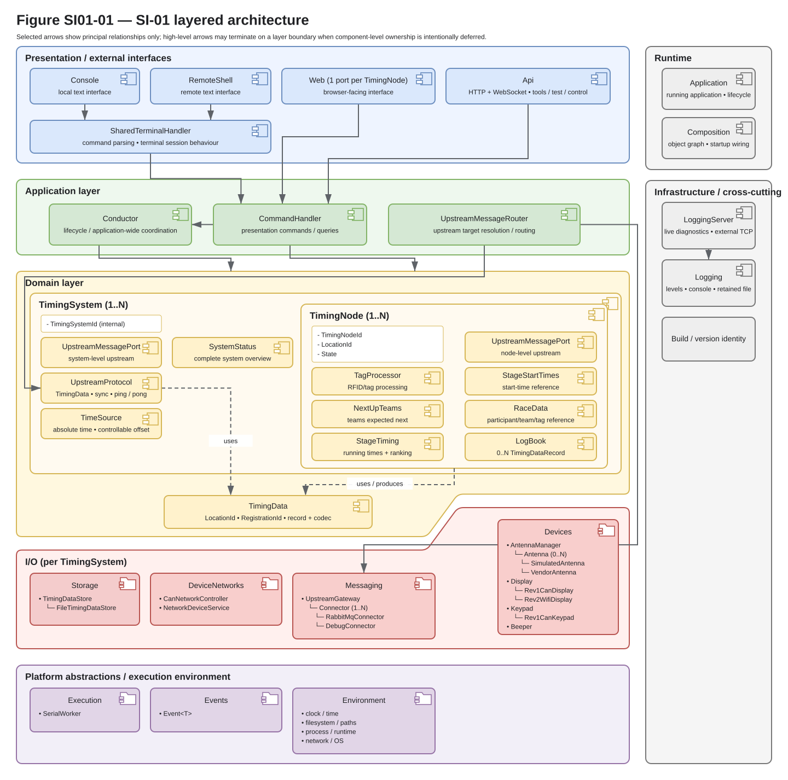
*Figure SI01-01 — SI-01 layered architecture.*

The source for this view is `docs/_diagrams/layered-architecture.yaml`.

In Figure SI01-01, `TimingSystem` and `TimingNode` are shown as UML-style
component/aggregate containers. They are the architecture identities themselves,
not UML class declarations. A small neutral inner property block lists the
important identity/state concepts owned by each aggregate, without its own title,
stereotype or component glyph; it therefore does not prescribe Java fields or a
concrete class shape. Geometric containment plus the `TimingNode (1..N)` label
expresses that one TimingSystem owns 1..N TimingNodes.

The Domain/I/O boundary is deliberately **shaped rather than a rigid horizontal
layer cake**. Domain has extra space below its contained components and yields
through a lower-right polygon cut-away. I/O uses a complementary polygon with a
raised right shoulder around Devices. A small visible gap remains between both
layer outlines, so neither responsibility appears to overlap the other. This
expresses architectural proximity/cohesion only; it does not permit Domain to
depend on concrete I/O.

##### Presentation

Presentation owns client-facing interfaces and their external representations. Its structure is **functional interface first, transport second**:

```text
presentation/
  interfaces/
    console/
    shell/
    web/
    api/        primary API transport/message classes
  common/
    terminal/         behaviour genuinely shared by console + shell
```

<a id="Api"></a>

**Api — API**

The **API** is the general programmable interface of
the **Timing Point Application** (SI-01) for remote
clients, engineering tools and headless
black-box/integration tests. A06/A07 implement only its
first version/status/event slice; later supported control
and diagnostic operations grow inside the same functional
interface.

— — —

- **Type:** Architecture Element
- **Satisfies:** [`IF03-REQ-001`](32-03-ISD-application-control-status.md#IF03-REQ-001), [`IF03-REQ-002`](32-03-ISD-application-control-status.md#IF03-REQ-002), [`IF03-REQ-004`](32-03-ISD-application-control-status.md#IF03-REQ-004), [`SI01-REQ-031`](41-01-SSD-timing-application-specification-document.md#SI01-REQ-031)

---


<a id="Web"></a>

**Web — Web**

**Web** is the browser-facing presentation interface of SI-01. Each configured
`TimingNode` has exactly one Web binding and therefore one configured Web
listener port. The binding targets that TimingNode; its bind address/port remains
Presentation configuration and is not a property of the TimingNode domain
aggregate. A multi-TimingNode process therefore exposes 1..N Web ports. Web may
reuse application queries/events and transport facilities, but it is not
collapsed into the API merely because both can use HTTP/WebSocket
technology.

— — —

- **Type:** Architecture Element

---


<a id="Console"></a>

**Console — Console**

`Console` is the local text presentation interface. It delegates common
terminal parsing/session behaviour to `SharedTerminalHandler` and reaches
application behaviour through the shared `CommandHandler`; it does not own
application/domain state.

— — —

- **Type:** Architecture Element

---


<a id="RemoteShell"></a>

**RemoteShell — RemoteShell**

`RemoteShell` is the remote text presentation interface. It shares terminal
session behaviour with Console through `SharedTerminalHandler` while remaining
a separate external interface and transport concern.

— — —

- **Type:** Architecture Element

---


<a id="SharedTerminalHandler"></a>

**SharedTerminalHandler — SharedTerminalHandler**

`SharedTerminalHandler` owns command parsing and terminal-session behaviour that
is genuinely shared by Console and RemoteShell. It converges those interfaces on
the same `CommandHandler` used by other presentation interfaces.

— — —

- **Type:** Architecture Element

---


`presentation.common` is reserved for behaviour genuinely shared across
presentation interfaces. Terminal behaviour shared by Console and RemoteShell
belongs under `presentation.common.terminal`. API HTTP, WebSocket and
wire-message mapping remain together at the `interfaces.api` component
package root while that implementation is still small; deeper transport/message
subpackages are introduced only when they contain a real cohesive decomposition.

Presentation converts external requests to application calls and application results to client representations. It does not own mutable application/domain state.

##### Application

The application responsibility coordinates use cases:

```text
application/
  Conductor
    lifecycle and application-wide coordination

  CommandHandler
    shared presentation command/query boundary

  UpstreamMessageRouter
    upstream-only application/domain target resolution and routing
```

<a id="Conductor"></a>

**Conductor — Conductor**

`Conductor` coordinates application-wide lifecycle and the 1..N active `TimingSystem` aggregates, including their TimingNodes.

— — —

- **Type:** Architecture Element

---


<a id="CommandHandler"></a>

**CommandHandler — CommandHandler**

`CommandHandler` is the shared entry point for presentation
requests. It may serve simple application reads such as
`version()`. Application-wide operations delegate to
`Conductor` where lifecycle or cross-node coordination is
required. When a presentation command or query targets a TimingNode, `CommandHandler` resolves the owning `TimingSystem` and target `TimingNode`, then calls that node's application/domain operation. The TimingNode owns the crossing of its serial execution boundary; presentation code does not submit directly to its queue or read its mutable state. Operations whose result depends on current TimingNode state return only after that operation has executed on the node's ordered path. `Conductor` is not a mandatory hop for TimingNode-scoped work.

— — —

- **Type:** Architecture Element
- **Satisfies:** [`IF03-REQ-001`](32-03-ISD-application-control-status.md#IF03-REQ-001), [`IF03-REQ-004`](32-03-ISD-application-control-status.md#IF03-REQ-004), [`SI01-REQ-022`](41-01-SSD-timing-application-specification-document.md#SI01-REQ-022), [`SI01-REQ-030`](41-01-SSD-timing-application-specification-document.md#SI01-REQ-030), [`SI01-REQ-031`](41-01-SSD-timing-application-specification-document.md#SI01-REQ-031)

---


Once code is executing for a TimingNode, normal direct Java calls are preferred;
do not introduce messages merely to preserve a layer diagram.

<a id="UpstreamMessageRouter"></a>

**UpstreamMessageRouter — UpstreamMessageRouter**

`UpstreamMessageRouter` owns target resolution for messages exchanged with the
upstream system at application scope. **Upstream** describes that external
system relationship, not the direction of an individual message; the exchange is
bidirectional. The upstream wire contract does not need to expose
`TimingSystemId`. Each configured upstream protocol/gateway context belongs
internally to one `TimingSystem`; node-scoped messages are routed functionally
by `TimingNodeId` to that system's addressed TimingNode. Protocol-level
messages such as ping/heartbeat can be handled by
`TimingSystem`/`UpstreamProtocol` without involving a TimingNode.

The router is deliberately **not** a generic application message bus or mediator
for normal collaboration between domain components.

— — —

- **Type:** Architecture Element

---


##### Domain

The domain owns timing semantics, per-TimingSystem system semantics and
TimingNode state. The main responsibilities are deliberately not represented as
one parent/child tree:

```text
TimingSystem (1..N per Application)
  TimingSystemId              internal only
  SystemStatus                complete current system overview
  UpstreamMessagePort         system-level upstream messages
  UpstreamProtocol
    TimingData transfer
    synchronisation / reconciliation
    ping / pong and other protocol messages
  TimeSource                   absolute time / controllable test offset
  1..N TimingNode
    TimingNodeId              functional protocol/data identity
    LocationId
    State
    UpstreamMessagePort       TimingNode-level upstream messages
    TagProcessor
    StageStartTimes
    LogBook
      0..N TimingData
    NextUpTeams
    RaceData
    StageTiming
    uses / produces TimingData

TimingData
  common semantic contracts
  configured concrete profile
  factory / codec / compatibility
```

`TimingSystem` is the parent logical domain aggregate. One `Application` hosts 1..N TimingSystems; each TimingSystem owns an internal `TimingSystemId`, a complete `SystemStatus` overview, a system-level `UpstreamMessagePort`, one `UpstreamProtocol` context, one `TimeSource` and 1..N TimingNodes. `TimingSystemId` exists to separate local runtime/simulation instances and is not assumed to be visible to the upstream peer. This lets one process simulate or host multiple independent timing systems without changing the functional TimingNode-oriented external contract.

`TimingNode` is the per-location domain aggregate inside one `TimingSystem`. It owns its
identity (`TimingNodeId` and `LocationId`), lifecycle/state and the per-node
components shown inside the TimingNode aggregate in Figure SI01-01.

A TimingNode is also the **active serialization and ownership boundary** for mutable per-node
state. State-dependent commands and consistency-sensitive reads enter one bounded serial
execution path and are processed in order. Code outside that boundary does not directly
read or mutate the node's lifecycle/location state or the mutable contents of its contained
`LogBook`, `NextUpTeams`, `StageStartTimes` and `RaceData` objects. Those objects remain
passive and do not receive their own workers. A short operation on the node lane may publish
an immutable snapshot/read view for longer work outside the lane. The LogBook keeps 0..N
committed immutable `TimingData` values and does not own a second worker or second timing-record
representation.

Both aggregate levels expose a bidirectional semantic `UpstreamMessagePort`.
The two roles share the same semantic concept but have distinct engineering
identities in Figure SI01-01 so interactive selection remains unambiguous.

<a id="SystemUpstreamMessagePort"></a>

**SystemUpstreamMessagePort — TimingSystem UpstreamMessagePort**

The TimingSystem-level `UpstreamMessagePort` receives and emits system-level
operations such as status/heartbeat and synchronisation control that do not
target one TimingNode. It does not own transport connections, connector
lifecycle or cross-aggregate target resolution.

— — —

- **Type:** Architecture Element

---


<a id="TimingNodeUpstreamMessagePort"></a>

**TimingNodeUpstreamMessagePort — TimingNode UpstreamMessagePort**

The TimingNode-level `UpstreamMessagePort` receives and emits node-scoped
operations after `UpstreamMessageRouter` has resolved the owning TimingSystem
and target `TimingNodeId`. It does not own transport connections or
cross-aggregate target resolution.

— — —

- **Type:** Architecture Element

---


<a id="TagProcessor"></a>

**TagProcessor — TagProcessor**

`TagProcessor` owns TimingNode-local processing of decoded tag observations and
the registration semantics needed by the TimingNode. It does not write files
from the antenna callback. State-changing registration work crosses the
TimingNode's bounded serial execution boundary and is completed by that node's
worker.

— — —

- **Type:** Architecture Element

---


<a id="StageStartTimes"></a>

**StageStartTimes — StageStartTimes**

`StageStartTimes` owns the stage-start reference values used by one TimingNode.

— — —

- **Type:** Architecture Element

---


<a id="NextUpTeams"></a>

**NextUpTeams — NextUpTeams**

`NextUpTeams` owns the ordered/expected teams that are next for one TimingNode.

— — —

- **Type:** Architecture Element

---


<a id="RaceData"></a>

**RaceData — RaceData**

`RaceData` owns participant, team and tag reference data needed by one
TimingNode's timing behaviour.

— — —

- **Type:** Architecture Element

---


<a id="StageTiming"></a>

**StageTiming — StageTiming**

`StageTiming` derives running-time and ranking results from the TimingNode's
accepted timing state and reference data.

— — —

- **Type:** Architecture Element

---


`LogBook` is passive state contained by one TimingNode and keeps that node's
committed timing history as 0..N immutable `TimingData` values. Concrete objects
may come from different compatible TimingData profiles; LogBook does not maintain
a second logbook-specific record representation.

`TimingData` is the SI-01/domain capability that realises the system-owned
IF-05 TimingData Interchange contract. IF-05 defines the common semantic
contracts, identity/ordering rules and compatibility obligations. A configured
TimingData profile supplies the concrete immutable TimingData classes plus the
matching factory and codec.

A `TimingDataProvider` supplies that coherent profile family. Its factory is
stateless and constructs concrete TimingData values from explicit construction
values; it does not own TimingNode lifecycle policy, sequence allocation,
persistence or event publication. The same common provider/API boundary is
reusable by SI-01 and engineering tools such as the JavaFX Engineering Client;
normal domain users remain unaware of provider discovery mechanics.

`UpstreamProtocol` is a Domain responsibility owned in the context of one `TimingSystem`. It uses `TimingData` for timing-record transfer and additionally defines semantic messages needed for synchronisation, reconciliation, heartbeat/ping and other upstream-system exchanges. It is therefore broader than the TimingData record format itself. Protocol-level activity that is not about one TimingNode stays here rather than leaking into each TimingNode. A concrete protocol implementation may be selected through an `UpstreamProtocolProvider`; the semantic boundary remains the same whether the implementation is built in or extension-provided.

`TimeSource` is the Domain-owned absolute-time source of one `TimingSystem`.
Production composition may delegate it to the platform wall clock; simulation
and tests can provide a controlled source with an independent offset or stepped
time. This keeps simulated clock behaviour scoped to the TimingSystem rather
than global to the Java process.

Detailed domain semantics belong in `03-domain-baseline.md`.

##### Reusable runtime mechanics

Reusable execution mechanics support the layered architecture but are not a
separate logical layer in Figure SI01-01:

```text
serial execution
lifecycle mechanics
scheduling
asynchronous completion
```

##### I/O

I/O contains adapters that move data between the application and the outside world. Figure SI01-01 shows one logical I/O layer, but the runtime composition is per `TimingSystem`: with 1..N TimingSystems, the corresponding Storage/Devices/Messaging/DeviceNetworks composition is instantiated 1..N times unless a lower-level implementation explicitly multiplexes a shared physical resource.

```text
io/
  Devices
    AntennaManager
      Antenna (0..N)
        SimulatedAntenna
    Display
      Rev1CanDisplay
      Rev2WifiDisplay
    Keypad
      Rev1CanKeypad
    Beeper

  DeviceNetworks
    CanNetworkController
    NetworkDeviceService

  Messaging
    UpstreamGateway
      Connector (1..N)
        RabbitMqConnector
        SocketConnector

  Storage
    file
    db
```

Presentation stays separate because it owns client-facing API/view semantics.
I/O owns the external boundary and its mapping to TimingNodes. In Figure SI01-01
Domain and I/O both use explicit polygon outlines. The I/O outline rises around
Devices, so Devices remains completely inside its owning layer while being drawn
beside the lower Domain area. The normal I/O band and its Storage, Messaging and
DeviceNetworks cards stay compact because they no longer need to inherit the
height required by Devices. The contained Storage, Devices, Messaging and
DeviceNetworks elements carry packaging-component notation where the
package-like ownership/decomposition semantics are meaningful. For compactness,
Figure SI01-01 shows their contained software components as an indented hierarchy
rather than as nested component boxes.

<a id="Storage"></a>

**Storage — Storage**

`Storage` owns generic lower-layer persistence mechanisms plus backup/restore mechanics. Storage contracts are independent of higher Application/Domain types. TimingData-specific encoding, identity/sequence validation and commit semantics remain above Storage; Runtime composition connects that semantic persistence component to the selected generic file/database mechanism.

— — —

- **Type:** Architecture Element

---


<a id="Devices"></a>

**Devices — Devices**

`Devices` groups the software components that represent external device roles in
SI-01. `AntennaManager` owns the configured 0..N `Antenna` components and the
coordination needed when multiple physical antennas form one registration input
path. `SimulatedAntenna` is the built-in reference/simulation implementation.
`Display`, `Keypad` and `Beeper` name software-facing device roles; their
concrete variants remain subordinate to this package/component boundary.

— — —

- **Type:** Architecture Element

---


<a id="DeviceNetworks"></a>

**DeviceNetworks — DeviceNetworks**

`DeviceNetworks` owns communication/network responsibilities used to reach
devices. `CanNetworkController` owns CAN-bus lifecycle, discovery/scanning,
online state and CAN-device communication. `NetworkDeviceService` owns the
bidirectional network-device boundary for smart/network-attached devices.

Service discovery, connection/session handling and protocol framing are
subordinate design concerns of `NetworkDeviceService`, not peer high-level
components. The boundary is not Wi-Fi specific and does not own smart-display
rendering/domain behaviour.

— — —

- **Type:** Architecture Element

---


<a id="Messaging"></a>

**Messaging — Messaging**

`Messaging` owns the external upstream transport/session package. When upstream
messaging is configured it contains one `UpstreamGateway`; the gateway uses
1..N connectors and concrete connectors own transport resources,
delivery/session mechanics and transport-specific addressing.

The semantic `UpstreamProtocol` remains in Domain. Messaging may transport an
encoded protocol representation without interpreting `TimingData` fields or
reimplementing synchronisation rules; after protocol decoding,
`UpstreamMessageRouter` owns application-level target resolution.

— — —

- **Type:** Architecture Element

---


#### Nested I/O component identities

The compact I/O cards in Figure SI01-01 keep their subordinate software
components as structured rows rather than expanding each component into a
separate box. The following rows are nevertheless stable architecture objects
and use the same engineering identity model as top-level diagram nodes.

<a id="AntennaManager"></a>

**AntennaManager — AntennaManager**

`AntennaManager` coordinates the configured 0..N Antenna components that form
one registration input path, including coordination across multiple physical
readers where required by the selected implementation.

— — —

- **Type:** Architecture Element

---


<a id="Antenna"></a>

**Antenna — Antenna**

`Antenna` is the software-facing RFID antenna/reader role consumed by
AntennaManager. Concrete vendor or simulated implementations remain behind this
role.

— — —

- **Type:** Architecture Element

---


<a id="SimulatedAntenna"></a>

**SimulatedAntenna — SimulatedAntenna**

`SimulatedAntenna` is the built-in controllable Antenna implementation used for
development, simulation and hardware-independent verification.

— — —

- **Type:** Architecture Element

---


<a id="VendorAntenna"></a>

**VendorAntenna — VendorAntenna**

`VendorAntenna` is the generic architecture role for an extension-provided
production Antenna implementation beside the built-in simulator. It establishes
that production/vendor implementations use the same Antenna contract and
AntennaProvider extension path; an actual vendor integration may receive a more
specific implementation name when selected.

— — —

- **Type:** Architecture Element

---


<a id="Display"></a>

**Display — Display**

`Display` is the software-facing output-device role for presenting timing
information without coupling Domain/Application behaviour to one physical
display generation or transport.

— — —

- **Type:** Architecture Element

---


<a id="Rev1CanDisplay"></a>

**Rev1CanDisplay — Rev1CanDisplay**

`Rev1CanDisplay` is the CAN-connected revision-1 implementation of the Display
role.

— — —

- **Type:** Architecture Element

---


<a id="Rev2WifiDisplay"></a>

**Rev2WifiDisplay — Rev2WifiDisplay**

`Rev2WifiDisplay` is the network-attached revision-2 implementation of the
Display role.

— — —

- **Type:** Architecture Element

---


<a id="Keypad"></a>

**Keypad — Keypad**

`Keypad` is the software-facing operator-input device role used for keypad
events without making the timing domain depend on a concrete bus implementation.

— — —

- **Type:** Architecture Element

---


<a id="Rev1CanKeypad"></a>

**Rev1CanKeypad — Rev1CanKeypad**

`Rev1CanKeypad` is the CAN-connected revision-1 implementation of the Keypad
role.

— — —

- **Type:** Architecture Element

---


<a id="Beeper"></a>

**Beeper — Beeper**

`Beeper` is the transport-neutral audible-feedback device role. A concrete
connection/implementation is selected only when required by deployment design.

— — —

- **Type:** Architecture Element

---


<a id="CanNetworkController"></a>

**CanNetworkController — CanNetworkController**

`CanNetworkController` owns CAN-bus lifecycle, discovery/scanning, online state
and CAN-device communication for the DeviceNetworks package.

— — —

- **Type:** Architecture Element

---


<a id="NetworkDeviceService"></a>

**NetworkDeviceService — NetworkDeviceService**

`NetworkDeviceService` owns the bidirectional boundary for
network-attached/smart devices, including data sent outward and device-originated
messages/events received inward.

— — —

- **Type:** Architecture Element

---


<a id="UpstreamGateway"></a>

**UpstreamGateway — UpstreamGateway**

`UpstreamGateway` is the Messaging-owned external upstream transport/session
boundary. It owns connector coordination but not UpstreamProtocol semantics.

— — —

- **Type:** Architecture Element

---


<a id="Connector"></a>

**Connector — Connector**

`Connector` is the transport/session role used 1..N times by UpstreamGateway.
Concrete connectors own transport resources, delivery/session mechanics and
transport-specific addressing.

— — —

- **Type:** Architecture Element

---


<a id="RabbitMqConnector"></a>

**RabbitMqConnector — RabbitMqConnector**

`RabbitMqConnector` is the RabbitMQ implementation of the Connector role for
production-shaped upstream messaging.

— — —

- **Type:** Architecture Element

---


<a id="DebugConnector"></a>

**DebugConnector — DebugConnector**

`DebugConnector` is the development/debug implementation of the Connector role.
It provides a production-semantics-preserving upstream transport path that an
independent engineering desktop/debug tool can use without becoming part of
SI-01 or bypassing UpstreamGateway/UpstreamProtocol. The concrete debug transport
and desktop-tool interaction are refined by downstream design rather than by
Figure SI01-01.

— — —

- **Type:** Architecture Element

---


##### Platform

Platform is the small technical foundation below the application, domain and I/O
responsibilities. It contains JDK-only reusable primitives and low-level
execution-environment abstractions:

```text
bounded serial execution (SerialWorker)
local typed events (Event<T>)
clock / time source
filesystem / path primitives
executors / threads
process / runtime information
network / OS primitives
```

A domain or I/O component may compose a Platform primitive such as
`SerialWorker` or `Event<T>`; the primitive itself remains unaware of
TimingNode, TimingData, presentation or external I/O semantics.

The layered view groups Platform into three small technical responsibilities:

<a id="PlatformExecution"></a>

**PlatformExecution — PlatformExecution**

`PlatformExecution` owns reusable execution primitives such as bounded serial
execution and the low-level executor/thread abstractions behind them. It does not
own TimingNode state or domain policy.

— — —

- **Type:** Architecture Element

---


<a id="PlatformEvents"></a>

**PlatformEvents — PlatformEvents**

`PlatformEvents` supplies the small typed local-event mechanism used for
post-fact notifications. Event instances remain owned by the component that
publishes them; Platform does not provide a central event bus.

— — —

- **Type:** Architecture Element

---


<a id="PlatformEnvironment"></a>

**PlatformEnvironment — PlatformEnvironment**

`PlatformEnvironment` groups low-level clock/time, filesystem/path,
process/runtime and network/OS abstractions. Concrete class and threading
behaviour belongs to SDD-02.

— — —

- **Type:** Architecture Element

---


##### Runtime and infrastructure

The right-hand side of the layered view separates two technical responsibilities:

- **Runtime** — the running `Application`, concrete `Composition` and lifecycle coordination;
- **Infrastructure / cross-cutting** — supporting technical facilities such as logging, diagnostics, build identity, configuration mapping and extension discovery.

##### Cross-cutting concerns

Cross-cutting technical concerns include logging, diagnostics, metrics and
build/version identity. In Java, `infra` is reserved for concrete cross-cutting
support such as `BuildIdentity`; it is not the I/O layer.

<a id="Logging"></a>

**Logging — Logging**

`Logging` is reusable runtime logging infrastructure owned by the core artifact. Reusable
application-core/domain code emits records through SLF4J; the default executable selects
`slf4j-jdk14 -> java.util.logging` and starts the core-provided logging composition.
Logging owns backend/sink lifecycle and the current global logging level; it does not own
application or domain state.

— — —

- **Type:** Architecture Element

---


<a id="LoggingServer"></a>

**LoggingServer — LoggingServer**

`LoggingServer` is the optional external engineering interface for live log records and
temporary global-level control. The engineering client initiates the connection. This
logging-specific TCP boundary is separate from the IF-03 API/status/event
interface and live delivery remains best effort.

— — —

- **Type:** Architecture Element

---


`Composition` belongs to Runtime because it contains concrete knowledge of the running application graph. Infrastructure remains supporting/cross-cutting: the default YAML loader maps deployment input to effective runtime configuration, logging and diagnostics provide technical services, and extension discovery supplies selected implementations. The executable supplies the configuration path rather than owning the parser. `LoggingServer` depends on the narrow `Logging` surface for level control/common formatting; `Logging` does not depend on or own `LoggingServer`.

#### Principal runtime abstractions

<a id="TimingSystem"></a>

**TimingSystem — TimingSystem**

A `TimingSystem` is an internal parent domain aggregate.
One **Timing Point Application** (SI-01) may host 1..N
TimingSystems, for example to run multiple independent
simulation contexts. Each TimingSystem owns a complete
`SystemStatus` overview, a system-level
`UpstreamMessagePort`, one `UpstreamProtocol` context, one
`TimeSource` and 1..N TimingNodes. Its internal `TimingSystemId` is not
assumed to be part of the upstream wire contract.

— — —

- **Type:** Architecture Element

---


<a id="SystemStatus"></a>

**SystemStatus — SystemStatus**

`SystemStatus` is a dedicated Domain component contained by one
`TimingSystem`. It owns the complete current operational overview of that
system, including TimingNode state plus semantic device, device-network,
storage, upstream-connectivity and synchronisation status. Concrete adapter
objects remain outside Domain and contribute status through typed semantic
inputs.

— — —

- **Type:** Architecture Element

---


<a id="TimingNode"></a>

**TimingNode — TimingNode**

A `TimingNode` is the independently addressed
operational/domain aggregate at one timing location. It
belongs to exactly one `TimingSystem` and is the active
serialization boundary for that node's mutable state.
Its contained state objects are passive; the upstream and
TimingData contracts remain centred on `TimingNodeId`.

— — —

- **Type:** Architecture Element
- **Satisfies:** [`SI01-REQ-003`](41-01-SSD-timing-application-specification-document.md#SI01-REQ-003), [`SI01-REQ-020`](41-01-SSD-timing-application-specification-document.md#SI01-REQ-020), [`SI01-REQ-021`](41-01-SSD-timing-application-specification-document.md#SI01-REQ-021)

---


<a id="LogBook"></a>

**LogBook — LogBook**

A `LogBook` is passive state contained by one TimingNode.
It holds that node's committed immutable `TimingData` values.
The current design does not introduce a second
logbook-specific timing-record representation.

— — —

- **Type:** Architecture Element

---


<a id="TimingData"></a>

**TimingData — TimingData**

`TimingData` is the shared Domain capability that realises
system-owned IF-05 inside SI-01. It exposes the typed
common `TimingData` semantic interfaces plus configured factory/codec services needed
by application code. Canonical record/file semantics and
compatibility remain defined by IF-05; Storage, Web and upstream
protocol code consume that contract without redefining it.

— — —

- **Type:** Architecture Element

---


<a id="UpstreamProtocol"></a>

**UpstreamProtocol — UpstreamProtocol**

Each TimingSystem owns one `UpstreamProtocol` context. It uses
TimingData for timing-record transfer and owns protocol-level
synchronisation, reconciliation and ping/heartbeat semantics so
those concerns do not leak into individual TimingNodes.

— — —

- **Type:** Architecture Element

---


<a id="TimeSource"></a>

**TimeSource — TimeSource**

`TimeSource` is owned by one `TimingSystem` and provides the absolute current
time used by that system's timing semantics. Production composition can delegate
to the platform wall clock; simulation/test composition can use a controlled
source with an independently programmable offset or stepped time. Multiple
TimingSystems in one process therefore do not have to share the same simulated
wall-clock view.

— — —

- **Type:** Architecture Element

---


The architecture deliberately uses **separate views** for software/domain decomposition, hardware/deployment topology and configuration/identity mapping. These views must not be collapsed into one ownership tree.

##### Software/domain decomposition

```text
Application
  +-- ApplicationId
  |
  +-- 1..N TimingSystem
        +-- TimingSystemId        internal composition/simulation identity
        +-- SystemStatus          complete current system overview
        +-- UpstreamMessagePort   system-level upstream messages
        +-- UpstreamProtocol
        |     +-- heartbeat / ping
        |     +-- synchronisation / reconciliation
        +-- TimeSource             absolute time / controllable test offset
        |
        +-- 1..N TimingNode
              +-- TimingNodeId   functional upstream/timing-data identity
              +-- LocationId
              +-- lifecycle / status
              +-- UpstreamMessagePort
              +-- TagProcessor
              +-- StageStartTimes
              +-- LogBook
              |     +-- 0..N TimingData
              +-- NextUpTeams
              +-- RaceData
              +-- StageTiming
              +-- uses / produces TimingData

Shared Domain contract:
  +-- TimingData
```

`ApplicationId` identifies the running Timing Point Application instance. `TimingSystemId` is an internal identity used only to distinguish 1..N hosted TimingSystem contexts. `TimingNodeId` remains the functional identity used by TimingData and upstream node addressing and scopes the node's registration sequence and synchronisation semantics. `LocationId` is the separately configured physical event location. The upstream contract therefore does not gain a TimingSystem identifier merely because one process can host multiple systems.

<a id="fig-si01-02"></a>
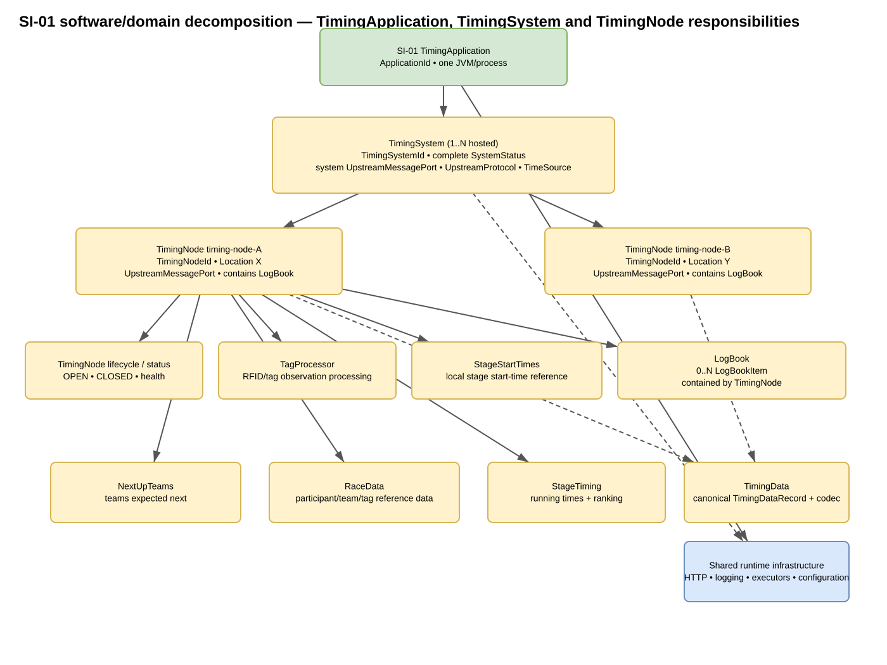
*Figure SI01-02 — SI-01 software/domain decomposition.*

The exact Java class/package boundaries may evolve as implementation evidence appears, but the `TimingNode` aggregate is the semantic owner of the operational TimingNode state. The physical registration asset is not a child component of this software tree.

##### Devices and device-network topology

The high-level I/O model separates device concepts from the communication
responsibilities that serve them:

```text
Devices
  +-- Antenna (0..N)
  +-- Rev1CanDisplay
  +-- Keypad
  +-- Beeper
  +-- Rev2WifiDisplay

Device Networks
  +-- CanNetworkController
  +-- NetworkDeviceService
```

An `Antenna` remains an I/O source with its own `AntennaId` and concrete
driver/connection settings. Grouping it under Devices does not change its
TimingNode routing semantics: one antenna may intentionally feed one or more
TimingNodes.

`CanNetworkController` represents the actively managed CAN network rather than
one particular CAN device. `NetworkDeviceService` represents the general
bidirectional service boundary for network-attached devices. It may support
outbound SI-01 data and inbound device requests/events without requiring the
device/domain object itself to know about sockets, discovery or transport
sessions.

The current smart-display direction remains client initiated: SI-01 makes its
service discoverable and Rev2WifiDisplay connects to it. The exact discovery,
listener/session and packet-framing design belongs below this high-level view.

##### Configuration, routing and identity mapping

Configuration connects identities without collapsing them:

```text
Application
    +-- ApplicationId

Devices
    +-- Antenna (0..N)
    |     +-- each Antenna -> 1..N TimingNodeId
    +-- Rev1CanDisplay
    +-- Keypad
    +-- Beeper
    +-- Rev2WifiDisplay

Device Networks
    +-- CanNetworkController
    +-- NetworkDeviceService

Messaging
    +-- UpstreamGateway
          +-- Connector (1..N)
                +-- RabbitMqConnector
                +-- DebugConnector

UpstreamMessageRouter
    +-- system-level message -> TimingSystem.UpstreamMessagePort
    +-- TimingNodeId -> TimingNode.UpstreamMessagePort
    +-- TimingSystemId remains internal composition context
```

<a id="fig-si01-03"></a>

*Figure SI01-03 — TimingNode, hardware and upstream-system messaging routing.*

`TimingNodeId` is the stable identity of a `TimingNode` and scopes its sequence, persistence and synchronisation semantics. `LocationId` and `AntennaId` are separate namespaces.

Configured antenna mappings associate each `AntennaId` with one or more TimingNodes. Fan-out is explicit: if one antenna feeds two TimingNodes, each target TimingNode processes the observation through its own serialized state boundary and keeps its own TimingNodeId-scoped sequence/state while the original `AntennaId` remains available as context.

CAN and smart-network controllers are not alternate presentation layers. They are
I/O/device-network responsibilities. A keypad, beeper or display may interact with or present information
to a human, but it is still an external device from SI-01's architecture
perspective.

`UpstreamGateway` is the I/O upstream-messaging boundary. It exchanges transport-neutral messages with its configured connectors but does not own protocol semantics. Each configured gateway/protocol context is associated internally with one `TimingSystem`. `UpstreamMessageRouter` routes system-level semantic operations to `TimingSystem.UpstreamMessagePort` and resolves TimingNode-targeted operations by `TimingNodeId` to `TimingNode.UpstreamMessagePort`; `UpstreamProtocol` owns protocol semantics such as ping, status exchange and synchronisation. No external `TimingSystemId` field is required.

Connectors do not route directly to Domain or TimingNodes and do not own domain
semantics. A connector-specific external name or routing key may participate in
boundary mapping, but it does not replace the stable functional `TimingNodeId`.
Internal `TimingSystemId` is local composition context rather than a new
upstream routing identity. One gateway may use multiple connectors and one
TimingNode may exchange messages through more than one connector via the gateway,
router and its bidirectional port. `RabbitMqConnector` represents the
production-shaped transport; `DebugConnector` provides an engineering/debug
transport to an external desktop/debug tool while preserving the same gateway
and protocol boundary.

`ApplicationId` remains a runtime/application identity and is not assumed to be an upstream protocol address. Protocol-level exchanges are scoped by the configured TimingSystem/gateway context; TimingNode-specific exchanges remain addressed by `TimingNodeId`.

Runtime-wide infrastructure may be shared where that does not leak mutable TimingNode state. Candidates include backing executors, logging infrastructure, HTTP server infrastructure, shared connector infrastructure, configuration loading and network monitoring.

Stable domain facts behind these views are maintained in `03-domain-baseline.md`; this SSD owns their software-architecture composition and execution implications.

#### Command, query and event model

All presentation transports should converge on one shared application model. The first Java implementation proves this with a deliberately small `CommandHandler.version()` query rather than a generic messaging framework; future request methods should be added only when a real client use case requires them.

```text
local console ----------------+
remote shell -----------------+
API HTTP/JSON ---------+--> typed command/query boundary --> application runtime
API WebSocket <---------+<--------------------------------------------+
future Web interface ----------+
```

Working rules:

- commands request state changes;
- a state-dependent command may wait for the domain result produced when that command reaches the TimingNode's ordered execution path;
- submission-only ingress is explicit: acceptance means only that bounded work was accepted for later processing;
- queries do not become alternate owners of state; consistency-sensitive reads run on the TimingNode's ordered path or use an immutable snapshot published from that path;
- events report facts/results that have occurred;
- queue admission, domain result and caller wait timeout are different outcomes and shall not be represented as though they mean the same thing;
- a caller timeout does not prove rejection or rollback of already accepted work; until state is queried or another result is observed, the final outcome is unknown to that caller;
- external protocol DTOs are mapped at the presentation/I/O boundary rather than used as the internal domain model;
- messages crossing thread/process boundaries should be immutable where practical;
- post-fact notifications may use a small typed `Event<T>` abstraction with explicit `subscribe` / `unsubscribe` / `emit`; commands and queries are not routed through that mechanism.

The event mechanism is deliberately local and simple. The generic `Event<T>`
mechanism is a small reusable Platform primitive; a producing component owns a concrete
event such as `newTimingDataEvent : Event<TimingData>` and interested listeners
subscribe directly to that event. There are no string topics, central event
dispatcher or global static bus. Emitting an event reports that a fact has
already occurred; it does not transfer ownership of TimingNode state.

#### Process view: ordering and concurrency

SI-01 receives work from several places at once: operator interfaces, devices,
timers and upstream connections. State changes for one `TimingNode` still have
to happen in a clear order.

Architecture rules:

- callbacks do not change TimingNode state directly;
- resolve the target TimingNode before state-dependent work enters its ordered path;
- code outside a TimingNode does not directly inspect or mutate that node's mutable state;
- two state changes for the same TimingNode do not run over each other;
- the TimingNode behaves as an active object: one bounded serial execution
  boundary owns state-dependent command ordering and consistency-sensitive reads;
- state-dependent validation is performed when the operation executes against the current ordered state, not from a stale pre-queue read;
- the contained LogBook, NextUpTeams, StageStartTimes and RaceData objects remain
  passive and do not each receive their own execution thread;
- short read operations may capture immutable snapshots for longer calculations outside the TimingNode lane;
- different TimingNodes may make progress at the same time;
- file writes must not hold up RFID/device/operator callbacks;
- a slow query or ranking calculation must not hold up LogBook commits;
- a slow network connection must not hold up a local commit;
- queues/resources are bounded and overload is visible instead of silently dropping work;
- during shutdown, stop new input first and give accepted work time to finish.

The primary latency risk is therefore **producer backpressure**, not whether every TimingNode operation is asynchronous. Device/RFID/TagProcessor ingress must use the submission-only path and return after bounded-queue admission; it does not wait for persistence or a domain result. Presentation/application callers may use a result-bearing command path when they need that result.

Short consistency-sensitive queries are allowed to occupy the TimingNode lane for a bounded period. The design does not require a copied snapshot as the default read mechanism. Read/query implementations may traverse contained state directly on the ordered lane, use a compact derived/indexed representation, or copy data only when measurement shows that the copy is the better trade-off. Longer ranking/formatting work must still avoid becoming a second writer or unboundedly holding up timing commits. Synchronous persistence may also occupy the lane initially, but its impact is controlled through bounded queues and observable queue/store latency.

Post-commit listeners are subject to the same rule: network/backpressure work must not execute synchronously on the TimingNode lane unless the adapter is proven to enqueue/buffer and return promptly.

The SSD only sets these rules. SDD-01 describes state ordering, persistence and
consumer visibility. SDD-02 chooses the Java queue/worker implementation. The
current direction is the Active Object pattern implemented by composition, not a
mandatory `TimingNode extends ActiveObject` class hierarchy.

External ingress still keeps its functional routing responsibilities:

- `CommandHandler` routes presentation commands/queries;
- configured device/antenna mappings resolve device observations to TimingNodes;
- `UpstreamMessageRouter` resolves system-level versus TimingNode-targeted
  upstream messages;
- scheduled work retains its owning target.

There is no central dispatcher through which commands and queries must pass. Components may expose local typed events such as `newTimingDataEvent` for post-fact notification; those events are not the owner or execution path for TimingNode state.

<a id="fig-si01-04"></a>
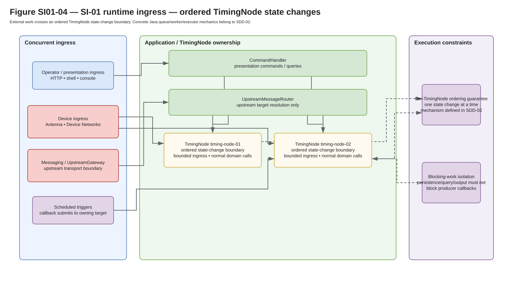
*Figure SI01-04 — Concurrent ingress resolves to ordered TimingNode state-change boundaries; concrete execution mechanics belong to detailed design.*

The source for this process view is
`docs/_diagrams/runtime-dispatch-process.yaml`.

#### Time and clock architecture

Time is an explicit architecture concern rather than an incidental use of `Date`, `Calendar`, `LocalDateTime`, Java/SQL timestamp classes or raw millisecond values throughout the codebase.

##### `TimingTimestamp` value

The **Timing Point Application** (SI-01) uses one dedicated immutable application/domain class named `TimingTimestamp` for externally meaningful **absolute event times** such as observations, accepted registrations and persisted/synchronised event timestamps. A race/stage start definition is not required to be an absolute timestamp: it may be supplied as local time-of-day without a date, or with an explicit date when that information is available.

Working semantics:

- `TimingTimestamp` represents an absolute point on a UTC-based time line;
- it does not contain an implicit local time zone or daylight-saving state;
- conversion to/from local civil time happens at explicit presentation/configuration/integration boundaries;
- its precision and external serialisation are explicit rather than inherited accidentally from a Java API or wire codec;
- domain/application APIs pass `TimingTimestamp` rather than arbitrary `long`, `Date`, generic Java timestamp classes or local-date/time values where an absolute event time is intended.

The dedicated class may internally delegate to a suitable Java primitive such as `Instant`, but its public semantic contract remains project-owned. Protocol-specific formatting/parsing and deployment-specific zone conversion belong in boundary adapters/codecs rather than in `TimingTimestamp` itself. Time-only race/start definitions are a separate domain/reference-data concept and shall not be forced into `TimingTimestamp` by inventing a date.

When a race/stage start is defined only by local time-of-day, elapsed-time calculation shall resolve that clock time against the accepted registration timestamp using the configured event/race time zone. The resolved start is the most recent valid occurrence of that time-of-day that is not after the registration. This deliberately supports one civil-day rollover: a start at `23:59:50` followed by a registration at `00:00:10` resolves to an elapsed time of 20 seconds rather than a negative value. If an explicit start date is supplied, that date is authoritative. A time-only definition cannot by itself distinguish elapsed durations of 24 hours or more; such cases require an explicit date or another higher-level race-day reference.

##### Time sources

Code that needs the current absolute time receives it through the Domain-level `TimeSource` owned by the relevant `TimingSystem`. Production composition can delegate that source to the operating-system wall clock; deterministic tests can supply a controlled source that can be advanced, stepped or given a per-system offset explicitly. This allows multiple TimingSystems hosted by one process to run against different simulated absolute times without changing TimingNode logic.

Elapsed durations, retry intervals, filtering windows, scheduling delays and timeout measurements should use a **monotonic time source** where their semantics are duration-based. On Java 8 this can be backed by `System.nanoTime()` behind a small platform abstraction. A monotonic mark is process-local and is not a persisted event timestamp.

The distinction is therefore:

```text
TimingTimestamp / wall-clock source
  absolute event time
  persistence / synchronisation / external semantics

monotonic time source
  elapsed duration
  timeout / retry / filtering windows
  process-local only

TimingNodeId + SequenceNumber
  stable stream ordering / gap detection
```

A source sequence is not derived from a timestamp. Two registrations may have equal timestamps, and a wall-clock correction may even make a later observation carry an earlier absolute timestamp; source ordering must remain recoverable from source sequence semantics.

##### Architecture risk — wall-clock discontinuity and local-time ambiguity

This is an explicit architecture risk because timing software can produce plausible but incorrect results when local civil time and elapsed time are conflated.

| Risk | Possible consequence | Architectural mitigation / open work |
| --- | --- | --- |
| daylight-saving transition repeats or skips local civil times | ambiguous/non-existent local timestamps and wrong ordering if local time is persisted directly | persist/use absolute `TimingTimestamp` for events; resolve time-only race/start definitions through an explicit event-zone rule and require more context where a local time is ambiguous/non-existent; add DST transition tests |
| NTP, manual correction or platform synchronisation steps wall clock backwards/forwards | negative/large elapsed differences; a later observation can have an earlier wall-clock timestamp | use monotonic time for durations; source sequence for ordering; expose/inject wall clock; define correction/health policy |
| clock offset/drift differs between the application and external systems | incorrect elapsed/race-time calculations or reconciliation disagreement | define clock synchronisation/offset acceptance requirements and verification before timing accuracy is accepted |
| restart loses monotonic origin | process-local duration marks cannot be compared across restart | never persist monotonic marks as event timestamps; restore from absolute `TimingTimestamp` plus domain/source state |

Daylight-saving time by itself does **not** change UTC/absolute time; the ambiguity appears when a local civil time is treated as if it were an absolute timestamp. Conversely, using an absolute `TimingTimestamp` does not make the operating-system clock monotonic: a wall-clock correction can still cause newly captured absolute timestamps to move backwards.

Before physical timing behaviour is accepted, the project must decide how an active timing system reacts to a material clock correction: whether it is merely diagnosed, blocks/marks the system degraded, records an audit event, or uses an explicit correction/offset mechanism. That policy needs requirements and verification evidence rather than being hidden inside the `TimingTimestamp` class.

#### Internal messaging direction

Internal messaging exists at asynchronous/ownership boundaries; it is **not** a requirement to turn ordinary in-lane Java calls into messages.

Working semantic categories are:

```text
state-dependent command
  request a state change
  caller may wait for the processed domain result

submission-only input
  request bounded admission for later processing
  admission is not the later domain result

consistency-sensitive query
  capture/read current TimingNode state on the ordered path

event
  report an observation, fact, completion or failure that has occurred
```

These are interaction semantics, not a requirement for public `Command` or `Query`
classes. The caller-facing TimingNode API may remain ordinary synchronous methods.
A Future/Promise is a suitable internal Active Object mechanism for connecting a
queued operation to a caller that waits for its result; that mechanism need not
appear in the public application/domain API.

Rules:

- use typed internal work only where work crosses an asynchronous or TimingNode execution boundary;
- resolve command/query targets explicitly; do not route commands or mutable-state access through events; local typed events are only for post-fact notification;
- once running in a TimingNode's serial execution lane, use normal direct Java calls;
- do not call a blocking public TimingNode operation recursively from that same lane;
- submit asynchronous I/O completion back to the owning TimingNode before changing its state;
- RabbitMQ is external I/O, not an in-process message bus.

SDD-01 illustrates the interaction cases. SDD-02 owns the concrete Java Future,
queue, timeout and worker mechanics.

#### Status and diagnostics architecture

Status is a first-class current-state model and is distinct from logging.

Status should allow presentation and diagnostics to observe application, timing-system and subsystem health without parsing log text. Representative areas include:

- application version / uptime / overall health;
- TimingNode lifecycle;
- registration asset/source state;
- TimingNode queue depth/high-water/overload health;
- RFID power/startup/protocol/heartbeat;
- CAN/device availability;
- persistence/backup state;
- race-data freshness;
- local clock/time-source health where relevant to timing validity;
- network/upstream connectivity;
- inbound/outbound synchronisation state.

Each `TimingSystem` contains its own dedicated Domain `SystemStatus` component. This is a complete current-state
overview of that TimingSystem, not an `OK`/error flag. It aggregates the
TimingSystem lifecycle and protocol state, its 1..N TimingNode statuses and the
semantic status of composed I/O relevant to operation: for example antenna
availability, whether a display is connected, keypad/beeper availability,
device-network health, storage availability, upstream connectivity and
synchronisation state. Domain owns the meaning of this overview; concrete CAN,
socket, vendor-device and persistence implementations remain in I/O and report
semantic status without leaking adapter classes into Domain.

`SystemStatus` does not bypass TimingNode ownership to inspect node internals.
A TimingNode supplies a semantic immutable status/result from its own ordered
state boundary; SystemStatus may retain/aggregate that representation together
with system/I/O health. An application-wide status response may therefore use
published node-status snapshots, or obtain a consistency-sensitive node status
through the normal TimingNode query operation when that stronger ordering is
required.

An application-facing status view may aggregate the 1..N TimingSystem statuses
and application/runtime problems into one response; that aggregation does not
move SystemStatus ownership back to the Application.

Status returned to a client is read-only from that client's point of view. The transport response does not define the internal Java class structure used to produce it.

Logging records diagnostic/history information; status represents current operational state. One must not be used as a substitute for the other.

#### Logging architecture

Logging is a SSD architecture-level cross-cutting technology decision because it affects almost every
component, operational diagnostics, footprint and engineering support.

The A08 baseline keeps application-core logging calls independent from the concrete runtime backend:

```text
application core / domain code
        |
        v
      SLF4J API
        |
        v
application-core infrastructure: Logging
        |
        +-- initial provider: slf4j-jdk14
                         |
                         v
                  java.util.logging
                     |
                     +-- ConsoleHandler
                     +-- TimestampedFileLogHandler
                     +-- LiveLogHandler
                              |
                              v
                       LoggingServer
                              ^
                              |
                    engineering client connects
```

Working decisions:

- reusable application-core code logs through the SLF4J API;
- `timing-point-core.jar` depends on `slf4j-api` only and must not impose a provider/backend on consumers;
- the executable composition selects exactly one provider;
- the initial Java-8/Pi-Zero application composition uses `slf4j-jdk14`, delegating SLF4J records to the JDK `java.util.logging` backend configured by the core-provided `Logging` infrastructure;
- `timing-point-core.jar` provides reusable `io.github.brainboxemb.eventtiming.timingpoint.infra.logging.Logging` and separate `io.github.brainboxemb.eventtiming.timingpoint.infra.loggingserver.LoggingServer` infrastructure; both use JDK JUL facilities and introduce no external backend dependency because JUL is part of the Java runtime;
- the startup configuration defines one global semantic log level; the A08 baseline uses the normal `TRACE / DEBUG / INFO / WARN / ERROR` vocabulary and maps it to the selected backend;
- `LoggingControl` owns the current global level and may apply a **temporary runtime override**. A runtime override is intentionally not written back to `application.yml` and resets to the configured level on restart;
- the durable operational sink is a human-readable rotating `TimestampedFileLogHandler` with configured size limit and retained generations; its wall-clock filename is for operator readability, not uniqueness, so stale/repeated Raspberry Pi startup time must never overwrite an existing log or cause retention to prune the active file;
- console logging remains available for local startup/development feedback;
- an optional `LoggingServer` is independently composed beside `Logging`, attaches its own live handler, accepts a connection initiated by the JavaFX engineering client and streams new log records through a dedicated diagnostics channel;
- the same diagnostics connection may query/change the temporary runtime log level; this control remains logging-specific rather than becoming a generic application command bus;
- live delivery is best effort: a missing, slow or disconnected engineering client must not block TimingNode/application execution, and live records need not be retained for later replay;
- the file sink is the retained source for historical operational logs; A08 does not add an in-memory log-history model or ring buffer;
- the live diagnostics channel is **separate from IF-03 `/api/v1/events`**. Log records are diagnostics, not application/domain status events;
- high-frequency observations should not automatically produce one INFO record per observation; detailed per-observation diagnostics belong at controlled diagnostic levels while current health/counters remain part of status/metrics;
- stable TimingNode/data-source/device/correlation identifiers should be represented consistently in diagnostic messages/context, without making logging context the owner of application state;
- logging is not the mechanism for application status, registration history, audit/domain records or upstream synchronisation state;
- Logback/reload4j or another backend is not part of the baseline unless later operational requirements justify it.

<a id="fig-si01-05"></a>
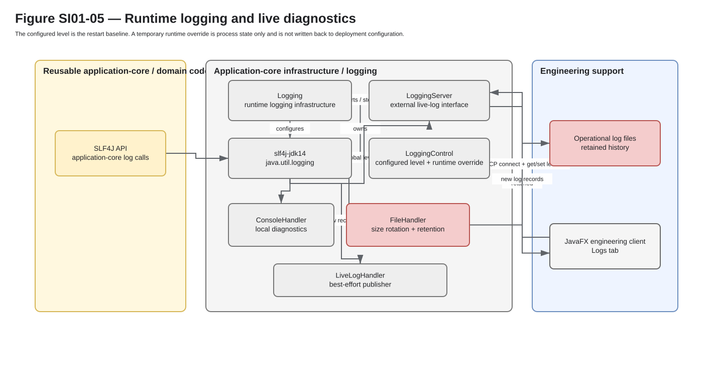
*Figure SI01-05 — Runtime logging, retained file sink and engineering live diagnostics.*

The exact default file size, retention count and production log level remain deployment choices
and must be measured on the target platform before being treated as accepted field defaults.
Per-package levels, persistent runtime overrides, JSON file logging and a general-purpose
diagnostics framework are outside A08.

SLF4J 2.0.x is compatible with the Java-8 baseline; the implementation repository should pin
the API/provider patch version together through Maven dependency management.

#### Configuration and composition architecture

Configuration describes deployment/composition rather than domain behaviour hard-coded in source. The concrete deployment/configuration contract is owned by **IF-11** in `32-11-ISD-application-configuration.md`.

The main configuration groups are:

```text
ApplicationConfig
├── applicationId
├── timingSystems
│   └── <timingSystem>
│       ├── timingSystemId
│       └── timingNodes
├── io
│   ├── devices
│   │   └── antennas
│   ├── deviceNetworks
│   │   ├── can
│   │   └── network
│   ├── registrationRouting
│   ├── messaging
│   │   └── upstream
│   │       └── connectors (1..N when UpstreamGateway is configured)
│   └── storage
├── presentation
├── logging
├── runtime
└── security
```

The identity boundaries are deliberate:

- the application owns a stable `ApplicationId`;
- the application composes 1..N internal `TimingSystem` contexts, each with an internal `TimingSystemId`;
- each TimingSystem owns 1..N TimingNodes;
- a `TimingNode` owns its stable functional `TimingNodeId` and configured `LocationId`;
- `TimingSystemId` is local composition/simulation identity and is not added to TimingData/upstream addressing;
- the high-level I/O model separates Devices from Device Networks;
- Devices names the functional device endpoints/concepts, including antennas, keypads, beepers, passive CAN devices and smart network devices;
- the application may compose 0..N configured antennas; each antenna has its own `AntennaId` and may map to 1..N `TimingNodeId` targets;
- Device Networks contains `CanNetworkController` for the actively managed CAN network and `NetworkDeviceService` for bidirectional network-device communication;
- when upstream messaging is configured for a TimingSystem, its protocol/gateway context uses 1..N connectors; multiple hosted TimingSystems keep those semantic contexts separate;
- connector-specific external names/routing identities do not replace `TimingNodeId`;
- presentation endpoints reference TimingNodes explicitly; an HTTP port, tablet or shell binding is not a property of the TimingNode domain object.

Deployment composition is intentionally small and default-driven:

```text
built-in application profile defaults
        +
platform defaults
        +
operating-mode defaults
        +
explicit deployment overrides
        +
resolved secret values
        =
effective ApplicationConfig
```

The selected **application profile** defines a topology/capability template for
the Timing Point Application. Concrete deployment profile IDs, TimingNode counts,
device combinations and compatibility mappings are not defined by this public
architecture unless an explicit public requirement owns them.

Profiles do not create different application/domain models. They resolve to the
same TimingSystem/TimingNode architecture and may be combined with platform and
operating-mode defaults plus explicit deployment configuration within the
profile's compatibility rules.

Platform and operating mode remain independent dimensions. Simulation may replace
concrete adapters while preserving the same TimingNode/domain implementation.

Console, Remote Shell and API form the baseline control/automation capability set
of the Timing Point Application and are not selected by the application profile.
Deployment configuration still controls concrete listener/binding settings. Web
remains a separate per-TimingNode browser-facing capability.

Startup follows distinct responsibilities:

```text
select defaults
  -> apply explicit deployment overrides
  -> resolve effective typed configuration
  -> validate references/settings
  -> runtime Composition composes the application
```

Profile/platform/mode resolution is configuration infrastructure. It is complete
before `Composition` receives the effective runtime `Config`; composition
does not contain profile-specific branches.

Build provenance remains separate from deployment configuration. `BuildIdentity` describes the built artifact; it is not loaded from IF-11 deployment settings. Core `EmbeddedBuildIdentityLoader` interprets the standard embedded provenance resource, while the concrete executable owns and filters that resource with its own application/build values. The embedded provenance contains stable build inputs/context — version, exact revision, source ref, build origin and dirty-state — but deliberately omits wall-clock build time, CI run identifiers and actor/user data. This keeps the artifact self-identifying for test/support work without introducing per-run variability solely from timestamp/run metadata.

Working rules:

- keep secrets/credentials out of committed configuration and store only secret references there;
- prefer explicit/manual composition initially rather than adding a dependency-injection framework without a demonstrated need;
- keep overlay rules deliberately limited rather than creating general inheritance/includes;
- use YAML as the current default IF-11 file syntax and keep its SnakeYAML parser/mapping inside application-core infrastructure; the logical IF-11 contract is not coupled to the SnakeYAML API;
- create Java configuration types only as real executable slices need them rather than mirroring the entire conceptual tree in advance.

#### Data and persistence architecture

Keep the data roles simple:

- `LogBook` is passive state and holds committed immutable `TimingData` values;
- `NextUpTeams`, `StageStartTimes` and `RaceData` are separate passive
  per-node state objects;
- the TimingNode worker is the single writer for those mutable per-node objects;
- each state type that needs persistence owns its semantic persistence rules above the lower Storage layer;
- `TimingDataPersistence` is the durable/recovery semantic boundary for committed timing data;
- lower Storage contracts remain generic and contain no TimingData/TimingNode semantics;
- future NextUpTeams/StageStartTimes/RaceData persistence follows the same dependency direction rather than adding Domain interfaces implemented by I/O;
- queries read consistent state without becoming another owner of it.

For example, StageStartTimes may be sent again when a TimingNode is opened after
a reboot, while the separately stored historical snapshots remain useful for
post-event analysis.

The first implementation can use simple local files; an embedded database is not
required. SDD-01 defines ordering, commit/visibility and the different persistence
roles. SDD-02 defines the Java worker and store boundaries.

Practical detailed-design work includes a half-written last TimingData record,
corrupt-file reporting, durable flush/fsync behaviour, file rotation and bounded
consumer reads. Analysis stores may use simpler append/snapshot formats because
they do not define the TimingData commit point.

#### Integration architecture

The **external device and network topology is owned by the SSSD**, because RFID/CAN devices, local LAN clients, displays and the upstream system are system-level deployment/interface relationships. This SSD starts at the **Timing Point Application** (SI-01) boundary and explains how the application realises those system interfaces internally through ports, adapters, callbacks, status handling and transport implementations.

##### Upstream messaging

Upstream messaging is a semantic system boundary, not a RabbitMQ API.
`UpstreamProtocol` in Domain defines the messages and state semantics exchanged
with the upstream system. It uses `TimingData` for timing-record payloads and
also owns synchronisation/reconciliation and system-level protocol messages such
as ping/pong.

`UpstreamGateway` and its 1..N connectors remain I/O responsibilities. They
carry the encoded protocol representation and own transport/session resources;
they do not become owners of TimingData fields or upstream protocol semantics.
`UpstreamMessageRouter` owns application-level target resolution after semantic
protocol decoding. A system-level operation is delivered through the owning
`TimingSystem.UpstreamMessagePort`; a TimingNode-targeted operation is resolved
by `TimingNodeId`, submitted through that TimingNode's serial boundary and
enters/leaves through `TimingNode.UpstreamMessagePort`. Protocol-level
operations such as heartbeat/status and synchronisation control therefore do
not need to be forced through a TimingNode.

```text
external upstream system
        |
        +--> RabbitMqConnector --+
        +--> DebugConnector -----+--> UpstreamGateway
                                      |
                                      | encoded UpstreamProtocol
                                      v
                               UpstreamProtocol
                                 /          \
                                /            +--> TimingData
                               v
                      UpstreamMessageRouter
                         |              |
                         v              +--> TimingNodeId
                   TimingSystem                |
              UpstreamMessagePort              v
               status / ping              TimingNode
                                       UpstreamMessagePort
```

Exact RabbitMQ connection/channel topology, routing keys and retry mechanics are
connector-level decisions. Product/deployment-specific upstream-system names and
private transport details remain outside the public architecture documentation.
Public protocol semantics and TimingData compatibility remain owned by Domain.

`TimingSystemId` and `ApplicationId` are not required on the upstream wire. `UpstreamMessageRouter` provides target resolution without becoming a generic internal message bus. Protocol messages that belong to the configured TimingSystem use its `UpstreamMessagePort` and `UpstreamProtocol`/`SystemStatus`; they do not need to be forced through a TimingNode.

##### RFID

RFID integration is an adapter boundary. Raw callbacks/protocol data do not directly mutate application state. The adapter is responsible for protocol/device interaction and turns accepted observations/health changes into typed application-facing messages.

Decoding must preserve the source/provider semantics required by the public input contract while proprietary encoding details stay behind the provider boundary. Source-specific mapping or policy must not be guessed by a generic adapter.

Power/startup/recovery lifecycle and filtering semantics are architectural concerns where they affect application behaviour; exact protocol commands, crypto/proprietary codecs and retry sequences remain implementation/private detail.

##### CAN, keypad, beeper and displays

`CanNetworkController` owns the active CAN network: bus lifecycle, discovery/scanning,
device online state and communication. CAN/device callbacks do not mutate
TimingNode state directly; accepted work crosses the normal application/serial
boundary.

`Rev1CanDisplay` is the passive CAN display generation. SI-01 owns the
display-specific `DisplayModel` for this path and actively translates that model
into CAN/device commands. The display does not own the ready-team/domain model.

`Rev2WifiDisplay` is deliberately different. It is a smart external client with
its own rendering and synchronisation behaviour. `NetworkDeviceService` provides the bidirectional network-device boundary.
In the current IF-09 design it makes the SI-01 data service discoverable and
accepts the session initiated by Rev2WifiDisplay. Rev2WifiDisplay owns
reconnect/resynchronisation behaviour. The concrete discovery/listener/session
mechanics are detailed below the high-level architecture rather than represented
as additional peer components.

SI-01 therefore publishes current timing/status/reference data to smart clients;
it does **not** drive Rev2WifiDisplay through the passive-display `DisplayModel`
and does not need to know how that smart display renders the data. Exact mDNS
service names and the application protocol (for example TCP/WebSocket) remain
deferred until IF-09 implementation needs them.

##### Connectivity

Status must distinguish at least local network reachability from external/upstream session health where those distinctions affect operator decisions. Temporary external connectivity loss must not silently invalidate otherwise available local operation.

#### Development view

##### Development boundaries

The development structure shall preserve the architecture dependency direction
without assuming that every architecture layer is a package or Maven artifact.

Architecture-level boundaries are:

- SI-01 has a reusable application-core implementation and a deployable
  executable application;
- the public IF-05 Java contract must be independently consumable by SI-01 and
  engineering/test tooling without depending on SI-01 internal Domain packages;
- dependencies normally follow the layer order downward; lower I/O code does not import Application/Domain types;
- higher layers may use generic lower-layer I/O contracts while Runtime composition selects concrete I/O implementations;
- public reference/core implementation code compiles and verifies without private
  production implementations.

The exact Maven reactor, artifact names, Java package layout, shared
`timing-data-api` placement and dependency checks are owned by SDD-02.

##### Public/private extension model

Private repositories may provide production device control, protocol implementations, deployment mappings and production data/codecs. Public core/reference implementation code defines supported contracts and must compile/test without those private implementations.

SI-01 uses one small **typed provider/extension mechanism** for implementation families that may cross the public/private boundary. The currently expected provider contracts are:

```text
TimingDataProvider
UpstreamProtocolProvider
AntennaProvider
CanProtocolProvider
DisplayProtocolProvider
```

The provider contracts are capability-specific; there is no generic domain-level
`Plugin` abstraction. Infrastructure extension-discovery support finds built-in and external providers at startup; `Composition` uses the resulting typed registry, validates configured provider IDs and then builds the normal runtime graph. Runtime/domain components receive normal typed
interfaces and never interact with class loaders or provider discovery.

Provider discovery/loading is a startup/composition responsibility. Provider IDs
must remain unambiguous and configuration errors must fail explicitly. The
concrete Java discovery/class-loading mechanism is detailed in SDD-02.

Built-in reference/simulation implementations remain part of the normal public
software where they are needed for development and verification. In particular,
`SimulatedAntenna` is always built in. Figure SI01-01 labels the generic
extension-provided alternative `VendorAntenna`; that label is illustrative, not
a fixed public implementation type. A deployment can select an
extension-provided implementation without changing the application/domain path
used by the built-in implementation. IF-11 owns provider selection in deployment
configuration; the concrete external-JAR packaging/search path remains a detailed
implementation concern.

#### Technology decision register

This table intentionally lives in the architecture section of this SSD because these choices shape the whole **Timing Point Application** (SI-01) architecture.

| Concern | Current direction | Status / next evidence |
| --- | --- | --- |
| Java baseline | Java SE 8 is the current SI-01 baseline | accepted for current implementation; verify the selected runtime on the Pi target |
| Extension mechanism | typed capability-specific provider contracts with startup composition; runtime/domain code remains provider-discovery agnostic | concrete Java discovery/loading is owned by SDD-02 |
| Build | Maven | accepted |
| Concurrency | TimingNode is an active object with one bounded serial execution boundary; contained state objects stay passive; callbacks, long queries and slow delivery remain outside that worker | SDD-02 uses composition for the first Java worker and keeps executor implementation replaceable |
| Internal messaging | typed immutable command/event/query objects only at async/ownership boundaries + explicit TimingNode mapping/routing at the owning boundary; no central generic dispatcher; direct calls inside a TimingNode task | architecture baseline selected; refine first consumer API signatures during implementation |
| Time model | dedicated `TimingTimestamp` + per-TimingSystem `TimeSource` for absolute time + separate monotonic duration source | IF-05 fixes canonical external timestamp serialization; controlled per-system offset/stepping supports simulation; clock synchronisation/correction policy remains to be completed |
| Dependency injection | explicit/manual composition initially | working direction; add framework only if complexity justifies it |
| Logging | SLF4J API in reusable application core; initial executable provider `slf4j-jdk14` / `java.util.logging` | architecture baseline selected; refine handlers/retention when runtime needs are known |
| Configuration | IF-11 effective `ApplicationConfig`: base + platform + optional profile + secret resolution | file syntax/library and first Java type set still open |
| Persistence | Domain-owned TimingDataPersistence over generic lower-layer storage; file/database mechanisms do not import Domain/Application types | ordering and visibility in SDD-01; Java storage/persistence split in SDD-02; record contract in IF-05 |
| API HTTP | JDK `HttpServer` for the first IF-03 request/response slice | A06 baseline selected; transport belongs to the API functional interface |
| API WebSocket | `org.java-websocket:Java-WebSocket:1.6.0` on a dedicated configured listener | A07 baseline selected; Java 8+, pure Java/NIO and existing SLF4J boundary; keep A06 JDK `HttpServer` unchanged |
| Remote shell | Java 8 JDK `ServerSocket`, line-oriented TCP, shared A04 command semantics | A05 development/service baseline selected; one active session, reconnect allowed; SSH/Telnet/authentication deferred |
| Upstream messaging | semantic ports + socket test adapter + RabbitMQ production-shaped adapter | architecture direction established; implementation detail deferred |
| Test doubles | public controllable stubs through the same supported ports | established direction |

Technology choices should fit the actual application and target. Pi compatibility is verified on real hardware; memory/thread footprint becomes a design concern only when measurements make it one.

#### Physical/deployment view

Representative **Timing Point Application** (SI-01) deployments are:

```text
Production field host
  Raspberry Pi Zero / Zero W
    one Timing Point Application process
      one or more TimingSystem aggregates
        each with 1..N TimingNodes
      local devices + local files
      optional network/upstream connectivity

Development/test host
  Linux or Windows
    same Timing Point Application core/application behaviour
    real or stub adapters
    may host multiple independent TimingSystems for simulation
```

The architecture should not require a different domain implementation for simulation. Different compositions select different adapters/topologies around the same application/domain behaviour. The system-level placement of the Timing Point Application relative to devices, operator clients, LAN/Wi-Fi and the upstream system is defined in the SSSD rather than duplicated here.

#### Testability and failure/recovery architecture


Testability is an architecture property. Application/domain code should where practical:

- avoid uncontrolled threads and global mutable state;
- receive absolute time through an injectable abstraction;
- receive duration/timeout measurements through a controllable monotonic abstraction where needed;
- include tests that step the wall clock forwards/backwards and cross representative DST/local-time transitions;
- exercise per-TimingNode ordering/non-overlap, independent-node progress and bounded-ingress overload behaviour deterministically;
- depend on semantic ports rather than concrete device/network libraries;
- keep protocol parsing in adapters;
- use deterministic handlers that can run synchronously in unit tests;
- expose observable status for degraded/failure conditions;
- avoid `Thread.sleep()` as a domain timing mechanism.

Failures should stay visible and should not silently lose timing history. Retry
counts, timeouts and the exact durability guarantee are detailed-design choices
once we have real implementation/measurement evidence.

Detailed verification strategy belongs in `60-SVP-software-verification-plan.md`.

#### Detailed-design documents

Keep this SSD at architecture level. Put implementation detail in the focused
SDDs below instead of repeating it here.

Current focused SDDs:

```text
43-01-SDD-01-data-and-display-design.md
  internal data/runtime algorithms:
  LogBook recording, TimingData persistence/recovery, query isolation,
  prepare-team/reference/display behaviour

43-01-SDD-02-java-component-design.md
  concrete Java realisation:
  Maven artifacts, packages, classes/interfaces, queue/thread/executor choices,
  provider discovery and dependency checks

43-01-SDD-03-backoffice-transport-design.md
  transport realisation below the upstream semantic boundary
```

IDDs define the external/file/API contracts. The SDDs use those contracts; they
do not define a second version of them.

#### Open architecture decisions

Only keep questions here if the answer could change the SI-01 architecture.
Implementation questions go in the relevant SDD.

Open architecture questions include:

- production authentication/authorisation and final network exposure policy;
- operational policy for material wall-clock corrections when it affects timing
  correctness or operator action;
- final upstream/backoffice semantic responsibilities as IF-06 is promoted;
- whether measured multi-TimingNode/Pi resource behaviour ever requires changing
  the current ordered-per-node responsibility model;
- any target-runtime limitation that forces a change to the Java-8/application
  architecture baseline.

Queue sizes, Java signatures, executor choice, fsync/atomic file operations,
rotation and LogBook indexes belong in SDD-01/SDD-02, not here.


---

## Desktop GUI Application Specification Document (SSD)

**Source document:** [41-02-SSD-gui-application-specification-document.md](41-02-SSD-gui-application-specification-document.md)

Status: working draft / non-authoritative

Software item: **SI-02 — Desktop GUI Application**

This SSD is intentionally architecture-heavy today because SI-02 implementation has not
started. Software-item requirements will be promoted into this same document as the GUI
capability approaches implementation; no separate requirements/architecture document pair is planned.

### Inputs

The SI-02 specification consumes:

- `31-SSSD-software-system-specification-document.md` for SI-02 allocation and software-system constraints;
- `32-03-ISD-application-control-status.md` for the SI-01/SI-02 API contract;
- applicable parent/external-system inputs registered by `20-EXT-external-system-inputs.md` where an obligation is allocated directly to SI-02;
- a future system-owned GUI/HMI ISD when that contract is defined.

`30-UC-system-use-cases.md` provides system-level operational traceability. A separate software-item use-case document is optional and should be introduced only if decomposing GUI-specific actor/goal behaviour makes the SSD clearer. Its document range is assigned when such documents are actually introduced.

The SIP may schedule SI-02 work but is not requirement/design authority.

### Software-item requirements status

No stable SI-02 requirement set has yet been promoted. The existing text below remains
the working specification/architecture direction until that requirement slice is ready.

### Software-item architecture

Software item: **Desktop GUI Application** (SI-02)

This Software Architecture Document describes the initial architecture direction for the planned desktop GUI. The GUI is a separate software item from the **Timing Point Application** (SI-01) and communicates with it through system-defined network interfaces.

### Purpose

The GUI provides an operator-facing desktop application for monitoring and controlling the timing application.

The GUI must be able to connect to a timing application running:

- locally during development;
- in a public reference/test application;
- remotely on a Raspberry Pi target;
- remotely on another Windows/Linux host where applicable.

It must not depend on in-process Java calls, internal runtime classes or direct access to timing-application files.

### Software-item relationship

```text
Software item 02
Desktop GUI Application
        |
        | system-defined application-control/status interface
        | HTTP/JSON + WebSocket are current architecture candidates
        v
Software item 01
Timing Point Application
        |
        +-- local development host
        +-- Raspberry Pi Zero target
        +-- Windows/Linux target
```

The transport and message contracts ultimately belong in a system-level ISD rather than being owned by either software item.

### Relationship to the current JavaFX test client

The current JavaFX test client is an engineering/manual-integration tool for IF-03. It is
**not** the first implementation of SI-02 and does not select the GUI toolkit, runtime or
packaging for SI-02.

### First increment

The first GUI increment should remain deliberately small and validate the software-item/interface boundary:

- configure/select a timing-application endpoint;
- connect/disconnect;
- query/display application version;
- show connection state;
- show central application status;
- show available `TimingSystem` status;
- show stale/disconnected state explicitly;
- reconnect cleanly after temporary network loss.

This is enough to verify that the GUI can operate against a timing application running on a Raspberry Pi before adding operational timing controls.

### Later operator capabilities

As system requirements and IDDs mature, the GUI may add:

- open/close a timing system;
- RFID power and reinitialisation controls;
- start procedure control;
- registration overview;
- manual registration;
- penalty registration/revocation;
- ready-team overview/control;
- device/network/backoffice status and diagnostics.

These operations are handled by the **Timing Point Application** (SI-01). The GUI sends commands and presents state; it does not duplicate timing-domain business rules.

### GUI ISD as system input

The graphical user interface should be treated as a **system-level interface** rather than allowing the implementation to invent screens ad hoc.

A system-level GUI ISD can define items such as:

- screen/navigation structure;
- information that must be visible;
- operator actions and control availability;
- status/state representations;
- warnings/errors/confirmation behaviour;
- update/staleness behaviour;
- terminology and identifiers;
- interaction flows for open/close/start/RFID recovery and later registration operations.

The future SSD for the **Desktop GUI Application** (SI-02) can reference the applicable GUI-ISD clauses as requirements instead of copying the interface definition into the software-item requirements.

### Software-to-software interface ISD

A separate system-level ISD should define the communication interface between the **Desktop GUI Application** (SI-02) and **Timing Point Application** (SI-01).

Current direction:

- HTTP/JSON for commands, queries and initial snapshots;
- WebSocket for live status/data events;
- explicit versioning/compatibility of the interface;
- connection/reconnection semantics;
- authentication/authorisation when defined;
- stale-data behaviour;
- errors/result semantics.

The same interface is also used by engineering/test tools. A small browser-based test client may consume it later without becoming another software item.

### Internal GUI layering

A possible GUI structure is:

```text
GUI bootstrap
    |
    +-- presentation / views
    |
    +-- presentation models / view models
    |
    +-- GUI application services
    |      connection state
    |      status subscriptions
    |      command execution
    |
    +-- timing-application client port
           |
           +-- HTTP/WebSocket implementation
           +-- fake/stub implementation for GUI tests
```

Views should depend on presentation/application models rather than directly on HTTP/WebSocket libraries. This allows most GUI behaviour to be unit tested without a live timing application.

### Testability

The GUI should support at least three test levels:

1. **unit tests** using a fake timing-application client;
2. **integration tests** against the public reference/test application;
3. **system tests** against a real timing application, including one running on a Raspberry Pi.

The fake client should be able to produce version/status changes, disconnects, stale state and command results deterministically.

### Technology choices still open

- desktop GUI toolkit/framework;
- packaging/distribution model;
- HTTP/WebSocket client library compatible with the selected GUI runtime;
- whether the GUI uses the same Java baseline as the **Timing Point Application** (SI-01) or can use a newer runtime;
- configuration storage for known endpoints;
- authentication/credential storage;
- update mechanism.

The Raspberry Pi Java-8 constraint applies to the headless timing application. It does **not automatically require** the desktop GUI to use Java 8; that should be a separate software-item decision.


---

## Java component, package and artifact detailed design

**Source document:** [43-01-SDD-02-java-component-design.md](43-01-SDD-02-java-component-design.md)

Status: working draft / focused detailed design

Software item: **SI-01 — Timing Point Application**

This SDD describes the **Java implementation** of the SI-01 design: Maven
modules, packages, classes/interfaces, composition, queues/threads and provider
loading.

The SSD says what the architecture must do. SDD-01 describes the LogBook/data
flow. IDDs such as IF-05 define external/file contracts. This document picks the
Java mechanisms that implement those decisions.

### Why this SDD exists

This detail is separate because module/package choices directly affect the Java
repository, dependencies and what can be reused by other applications.

The central rule is:

> **An architecture layer or Java package is not automatically a Maven artifact.**

Keep these concepts distinct:

1. **Architecture responsibility** — semantic ownership and dependency direction, defined by the SSD architecture.
2. **Java package** — cohesive source organisation and enforceable dependency discipline.
3. **Maven artifact** — reusable library or deployable application with a concrete consumer/lifecycle reason to exist.
4. **Application composition** — assembly of application-core code and selected implementations into an executable.
5. **Contract/port** — semantic boundary placed with the responsibility that owns its meaning.

A separate artifact is justified only by a real consumer, reuse, dependency, lifecycle, deployment, ownership, public/private, release or versioning boundary.

### Initial Maven reactor

The current reactor has two reusable artifacts plus one executable application.
The shared TimingData library artifact is justified by the independent SI-01 and
Engineering Client consumers. It intentionally remains one artifact containing the
semantic contracts, default/reference profile, codec and factory/provider; these
responsibilities are not split into separate API/default JARs:

```text
reactor/
├── pom.xml                    timing-point-parent
├── shared/
│   └── timing-data/
│       └── pom.xml            event-timing-data.jar
├── core/
│   └── pom.xml                timing-point-core.jar
└── app/
    └── pom.xml                timing-point-app.jar
```

Working coordinates:

```text
groupId: io.github.brainboxemb.eventtiming

parent:          timing-point-parent
TimingData:      event-timing-data
core:            timing-point-core
executable:      timing-point-app
```

The root POM only groups/configures the build; it is not a runtime component.

The `core/` Maven module is the reusable **application core of SI-01**. It contains
the main application, domain, presentation, I/O, infrastructure, runtime and
Platform implementation that is shared by executable compositions. The name
`core` is an artifact/source boundary only: it does **not** reintroduce a
separate Core architecture layer in Figure SI01-01. The executable `app/`
module stays deliberately thin and adds the launcher, concrete runtime-provider
selection and packaging needed to run that core.

The Maven `groupId` remains the **event-timing software-system/product-family** coordinate. SI-01 Java code is more specific: the reusable application core and default executable live under `io.github.brainboxemb.eventtiming.timingpoint`. `TimingPoint` names the local software/deployment role; it does **not** replace the internal `TimingNode` domain aggregate. One Timing Point Application process may host 1..N TimingSystems and therefore multiple TimingNodes.

### Package direction

The current Java structure should grow from real code, not from the architecture
diagram.

Likely top-level packages are:

```text
io.github.brainboxemb.eventtiming/timingpoint/
  application/
  domain/
  platform/
    execution/
    events/
    environment/
  presentation/
    interfaces/
      api/
      console/
      shell/
      web/
    common/
      terminal/
  io/
    devices/
      antenna/
      display/
      keypad/
      beeper/
    devicenetworks/
      can/
      network/
    messaging/
    storage/
  infra/
    config/
    logging/
    loggingserver/
  runtime/
    config/
```

Presentation subpackages are organised by **functional interface first**. Console, Remote Shell, Web and API are separate presentation interfaces. The intended Web topology is one configured Web endpoint/binding per TimingNode (1..N), each with its own presentation port and a `TimingNodeId` reference. HTTP/WebSocket are implementation transports inside a functional interface, not global presentation categories. The primary API classes stay directly at `presentation.interfaces.api` while that component is small; a one-class `http`, `websocket` or `messages` package would hide the component overview without adding a useful boundary. `presentation.common.terminal` contains only terminal handling genuinely shared by Console and Remote Shell; `presentation.common` is not a generic dumping ground.

These are source-organisation boundaries, not automatically Maven modules.

Use these rules:

- create a class only when current behaviour needs it;
- keep small enums with the object that owns them until reuse justifies a
  separate type;
- do not create marker classes to represent layers;
- place a type by what it means, not by which layer happens to call it;
- keep primary component/capability classes visible at that component package
  root so opening the package gives a useful architecture overview;
- do not introduce a subpackage merely to classify one class by transport,
  message shape or implementation role;
- use a deeper subpackage for a cohesive supporting family when it materially
  improves navigation, or when multiple real sub-capabilities need their own
  namespace;
- preserve Java encapsulation when choosing package boundaries: subpackages do
  not share package-private access, so do not split implementation helpers only
  to make a tree look tidy if that would force a wider API;
- use capability-oriented subpackages when a domain concept has a main object plus
  closely related value/supporting types; keep that small group together rather
  than introducing generic `helper`, `model` or single-type `identity`
  subpackages;
- reserve `platform` for small JDK-only reusable primitives and execution-environment abstractions, including bounded/serial execution and typed local events;
- reserve `infra` for concrete cross-cutting technical support such as `BuildIdentity`, logging, diagnostics and configuration/extension adapters;
- reserve `runtime` for concrete application composition, the running application container and lifecycle;
- use `io` for external hardware, messaging and storage adapters.

The shared TimingData artifact has its own package root:

```text
shared/timing-data/
  io.github.brainboxemb.eventtiming.timingdata/
    TimingData.java
      AutomaticRegistration
      ManualRegistration
      ManualTimeSource
      RecordKey
    LocationId.java
    RegistrationId.java
    TimingTimestamp.java
    TimingDataFactory.java
      Context
    TimingDataCodec.java
      CodecException
    TimingDataProvider.java
    defaultprofile/
      DefaultTimingDataFactory.java
      DefaultTimingDataCodec.java
      private automatic/manual default value implementations
```

`TimingDataFactory.Context` is the one immutable value-only construction context for
fields shared by every TimingData variant. Do not mirror the semantic type tree
with `AutomaticRegistrationContext`, `ManualRegistrationContext` or nested
per-variant context types.

For example, the first TimingNode implementation is grouped as:

```text
application/
  ApplicationId.java
  UpstreamMessageRouter.java       when upstream messaging is implemented

domain/
  system/
    TimingSystem.java                   parent aggregate for 1..N TimingNodes
    TimingSystemId.java                 internal composition/simulation identity
    SystemStatus.java                   complete current TimingSystem overview
    UpstreamMessagePort.java            system-level upstream messages
    TimeSource.java                     per-system absolute time / test control
  timing/
    TimingNode.java
    TimingNodeId.java
    UpstreamMessagePort.java            TimingNode-level upstream messages
    NextUpTeams.java                    passive per-node state
    NextUpTeamsStore.java               persistence port for next-up analysis history
    StageStartTimes.java                passive per-node reference state
    StageStartTimesStore.java           persistence port for start-time analysis history
    RaceData.java                       passive per-node reference state
    RaceDataStore.java                  persistence port for race/reference analysis history
  logbook/
    LogBook.java                        passive committed TimingData history
  timingdata/
    TimingDataPersistence.java          TimingData-specific persistence contract
    DefaultTimingDataPersistence.java   TimingData codec/identity/sequence mapping
  upstream/
    UpstreamProtocol.java               TimingData + sync/reconcile/ping semantics
    UpstreamProtocolProvider.java       typed extension provider contract

io/
  devices/
    antenna/
      Antenna.java                      stable antenna contract
      AntennaProvider.java              typed extension provider contract
      SimulatedAntenna.java             built-in reference/simulation implementation
    display/
      DisplayProtocolProvider.java      typed protocol-extension provider contract
      Rev1CanDisplay.java               passive CAN display support when implemented
    keypad/                        only when device-specific code justifies it
    beeper/                         transport-specific implementation only when justified

  devicenetworks/
    can/
      CanNetworkController.java    CAN lifecycle, discovery and device state
      CanProtocolProvider.java     typed protocol-extension provider contract
    network/
      NetworkDeviceService.java    bidirectional network-device boundary

  messaging/
    UpstreamGateway.java            when upstream messaging is implemented
    Connector.java                 only if multiple transports justify a shared contract
    rabbitmq/
      RabbitMqConnector.java
      DebugConnector.java                 engineering/debug connector when implemented
  storage/
    AppendOnlyRecordStore.java             generic opaque-record storage contract
    FileAppendOnlyRecordStore.java         LF framing • file append/recovery
    # later generic lower-layer storage mechanisms only as real needs appear

platform/
  execution/
    SerialWorker.java                     bounded one-at-a-time execution primitive
  events/
    Event.java                            owner-side typed emit primitive
    EventSource.java                      subscription-only consumer view
  environment/                            low-level environment adapters only when real types justify them
```

The names above record ownership/direction, not a requirement to create empty
types early. Lower layers expose generic contracts that do not import higher
layers. TimingData-specific persistence semantics stay in Domain and use the
generic `io.storage.AppendOnlyRecordStore`; the file implementation remains
completely unaware of TimingData, TimingNode and Domain types.
`SerialWorker` is a small reusable execution primitive under `platform.execution`,
composed into TimingNode rather than used as a Domain superclass. It has no
TimingNode or persistence semantics of its own.

`TimingNode` remains the visible Domain component boundary used by higher layers. It owns serialized access through `SerialWorker`, operation admission/timeout mapping and post-commit event publication. Package-private `TimingNodeLogic` contains the mutable node state and domain decisions: lifecycle, current `LocationId`, LogBook interaction and TimingData commit behaviour. `TimingNodeLogic` is an implementation detail of the TimingNode component, not a second architecture component.

A production `TimingNode` is always constructed as a complete capability. `TimingDataPersistence`, `TimingDataFactory` and `TimeSource` are required constructor dependencies; there is no lifecycle-only or partially configured production node. The only non-public construction seam exists for deterministic TimingNode execution-boundary tests and is documented as test-only in code.

`TimingNodeTypes` is only a Java source-code grouping for the public TimingNode status/result/exception value types. It has no runtime state, lifecycle or architectural responsibility and therefore does not appear as another component in Figure SI01-01.

The application `CommandHandler` is always composed with a complete
`TimingNode`; there is no status-only or partially configured production
handler. Presentation tests use complete test fixtures rather than adding a
second production construction mode.

Status-change detection is owned by the same serial boundary. A state-changing
command compares authoritative status before and after the domain operation on
that TimingNode lane. A real difference emits the TimingNode status event before
the result leaves the ordered command execution. `CommandHandler` maps that fact
to `ApplicationStatus`; it does not perform a second before/after query outside
the ordered boundary.

The visible component boundary uses typed commands and queries rather than mirroring every `TimingNodeLogic` method:

```java
TimingNodeTypes.OpenResult opened =
        node.invoke(TimingNodeCommands.open());

TimingNodeTypes.CommandAdmission admitted =
        node.submit(
                TimingNodeCommands.commitAutomaticRegistration(
                        registrationId,
                        observationTime));

TimingNodeTypes.Status status =
        node.query(TimingNodeQueries.status());
```

`invoke(command)` is the result-bearing path: presentation/application callers may wait for the processed domain result. `submit(command)` is the producer path: it returns only immediate bounded-queue admission and deliberately does not wait for the later domain result. RFID/TagProcessor-style ingress uses this form so a device callback cannot be held up by persistence, LogBook work or another queued TimingNode operation.

`query(query)` is the consistency-sensitive read path. Short reads run in the same ordering as commands. The ordering boundary is the required property; a copied LogBook snapshot is not. Query implementations should avoid routine list copies when direct bounded traversal on the node lane is cheaper, and may introduce compact derived/indexed state only when measurement justifies it. Typed command/query objects are local operation descriptions, not another component, central dispatcher or generic message bus.

The commit boundary is named `commitAutomaticRegistration(...)`. The fact that the observation already passed source-specific interpretation/filtering is a precondition, not the operation name. The manual counterpart is `commitManualRegistration(...)`; the IF-03 engineering route may keep its separate short `auto-reg` resource name. `ApplicationId`, internal `TimingSystemId` and functional
`TimingNodeId` are separate Java identities. `TimingSystemId` distinguishes
multiple hosted/simulated systems locally; it is not automatically serialized
into TimingData or exposed as an upstream address.

Each `TimingSystem` owns one Domain `TimeSource`. The production implementation
may delegate to a Platform wall-clock abstraction; tests/simulations may provide
a controllable implementation with a per-system offset or stepped time. The
Domain contract returns project-owned absolute `TimingTimestamp` values rather
than exposing a platform clock API directly. Monotonic duration/time-out sources
remain separate Platform/runtime concerns.

The I/O package structure is logical; executable composition is per
`TimingSystem`. Hosting 1..N TimingSystems therefore normally constructs 1..N
corresponding I/O compositions, each with its own configured Storage, Devices,
Messaging and DeviceNetworks objects. Explicit lower-level multiplexing may share
a physical resource, but the owning TimingSystem contexts stay separate.

`CanNetworkController` owns CAN-network lifecycle/discovery and CAN-device
communication. `NetworkDeviceService` owns the general bidirectional
network-device boundary. It may expose application data outward and accept
device-originated messages/events inward.

The high-level architecture deliberately stops there. Service discovery,
connection/listener/session handling and protocol framing are lower-level design
concerns below `NetworkDeviceService`. Likewise, a smart-display/domain handler
should not acquire socket, mDNS or transport knowledge merely because it is
reached through this service. The smart display remains an external client and
therefore does not require a `Rev2WifiDisplay` class inside SI-01 merely to
mirror the hardware name.

`TimingNode` contains its passive `LogBook` as part of the TimingNode
aggregate. LogBook keeps 0..N committed `TimingData` values. The current
design deliberately avoids a second logbook-specific record type because there
is no different domain shape that needs one.

`TimingData` remains the Domain capability/contract name and becomes the small
shared Java interface implemented by concrete profile values. The default profile
and validation/codec services realise the system-owned IF-05 contract. Concrete
storage, Web and messaging adapters may carry that record or its encoded form
without redefining field semantics.

`UpstreamProtocol` is a Domain capability owned by one `TimingSystem` and built partly on `TimingData`. It adds synchronization/reconciliation and protocol-level messages such as ping/pong so individual TimingNodes do not need to implement those concerns. `UpstreamGateway` owns the external transport boundary and uses 1..N concrete connectors. A connector such as `RabbitMqConnector` or `DebugConnector` owns transport/session mechanics, not TimingData or UpstreamProtocol semantics. `DebugConnector` is the engineering transport intended for an independent desktop/debug tool; that tool remains an external consumer rather than part of SI-01. `UpstreamMessageRouter` resolves semantic work inside the already selected TimingSystem context: system-level work uses `TimingSystem.UpstreamMessagePort`, while node-level work is resolved by `TimingNodeId` to `TimingNode.UpstreamMessagePort`. `TimingSystemId` is not required on the wire.

If the TimingNode capability later grows into several cohesive areas, deeper
packages such as `timing/registration` or `timing/stage` may become useful.
Do not create those packages before the corresponding code exists.

The Domain-level `SystemStatus` is a dedicated component contained by one `TimingSystem`. It is a semantic aggregate, not a wrapper around
concrete adapter objects and not merely an `OK` flag. It can represent current
TimingNode state together with operational I/O state such as antenna/display
connectivity, keypad/beeper availability, device-network health, storage,
upstream connectivity and synchronisation. Concrete I/O components expose or
publish semantic status inputs; `SystemStatus` must not depend on classes such
as `Rev1CanDisplay`, socket/session implementations or vendor antenna drivers.

TimingNode status reaches this aggregate as an immutable semantic snapshot/result
created through the TimingNode ownership boundary. `SystemStatus` does not call
into `LogBook`, lifecycle fields, location fields or other mutable TimingNode
internals directly.

An external interface response shape does not require an equally shaped internal Java object.
For example, the status JSON does not by itself require classes named
`ApplicationStatusSnapshot` or `ApplicationStatusModel`.

### Contract placement

Place contracts with the responsibility that owns their meaning:

```text
presentation
  functional client interfaces / transport mapping / wire messages

application
  commands, queries and application-level ports

domain
  domain model, semantic ports, per-TimingSystem TimeSource, TimingData representation/codec and UpstreamProtocol semantics

io
  hardware, messaging and storage adapters

infra
  concrete cross-cutting technical support, including logging, diagnostics,
  configuration mapping and extension discovery

runtime
  concrete application composition, top-level running application and lifecycle

platform
  small JDK-only reusable primitives and execution-environment abstractions,
  including serial execution and local typed events
```

Do not create one generic top-level `api` package merely to collect
interfaces.

### Internal dependency direction

```text
presentation --> application
application  --> domain / I/O / platform
domain       --> I/O / platform
io           --> platform / JDK
runtime      --> application / domain / presentation / I/O / infra / platform
infra        --> owned support contracts + platform / JDK / selected support libraries
platform     --> JDK and low-level environment only
```

The normal dependency direction follows the layer order and is intentionally
easy to read from imports. A lower layer does not import a higher layer merely
to implement one of its interfaces. Domain may depend on a generic I/O contract,
but not on a concrete I/O implementation; Runtime composition selects the
concrete implementation.

For example:

```text
TimingNodeLogic
  -> TimingDataPersistence
       -> AppendOnlyRecordStore
            <- FileAppendOnlyRecordStore selected by Runtime
```

`AppendOnlyRecordStore` contains only opaque-record storage semantics.
`DefaultTimingDataPersistence` owns TimingData codec, TimingNodeId and sequence
validation. This keeps `io.storage` independent from Domain.
Executable composition may depend on the complete supported application-core surface
and selected external libraries.

### Logging dependency placement

Logging follows the same library-versus-executable composition boundary.

```text
timing-point-core.jar
  -> slf4j-api only
  -> io.github.brainboxemb.eventtiming.timingpoint.infra.logging
       +-- Logging
       +-- LoggingConfig / LoggingLevel / LoggingFileConfig
       +-- LoggingControl
       +-- ConsoleHandler
       +-- TimestampedFileLogHandler + CompactLogFormatter
  -> io.github.brainboxemb.eventtiming.timingpoint.infra.loggingserver
       +-- LoggingServer
       +-- LoggingServerConfig
       +-- LiveLogHandler
       +-- client-initiated live diagnostics + temporary level control

timing-point-app.jar
  -> selects exactly one SLF4J provider
  -> initial provider: slf4j-jdk14
  -> delegates SLF4J records to java.util.logging
  -> starts/stops core-provided Logging
  -> independently starts/stops optional LoggingServer
```

Working rules:

- application-core code may compile against the SLF4J API but must not force a concrete provider/backend on consumers;
- provider-neutral deployment values stay component-owned: `LoggingConfig` contains `LoggingLevel` and `LoggingFileConfig`; optional `LoggingServerConfig` belongs to `LoggingServer`; runtime `Config` may reference both as composition data;
- the executable application chooses and configures the provider/backend before `runtime.Composition` starts normal application composition;
- the initial Java-8/Pi-Zero baseline uses `slf4j-jdk14` so the provider delegates to JDK `java.util.logging` without introducing Logback;
- concrete JUL backend/file lifecycle stays under `timingpoint.infra.logging`; the live diagnostics handler/socket lifecycle stays under `timingpoint.infra.loggingserver`; neither package defines domain/application contracts;
- `infra.logging` must not depend on `infra.loggingserver` or `runtime.config`; the thin executable starts the two infrastructure components separately before handing control to runtime composition. `infra.loggingserver` may depend on the narrow public `Logging` runtime surface for current level control and record formatting, but the logging component does not construct or own the server;
- `LoggingServerConfig` belongs to the `LoggingServer` component and carries its listener values (`bindAddress`, `port`); the default YAML loader maps the external `logging.live` syntax to that component-owned type;
- `LoggingLevel` is a logging-domain value rather than `LoggingConfig.Level`, so live level control does not depend on an umbrella configuration class;
- the core artifact owns that reusable implementation because it has no dependency on executable-specific YAML/resource loading and uses only JDK facilities plus component-owned logging configuration;
- `Logging` is the primary runtime logging infrastructure component and owns backend setup, console/file handler composition, record formatting and the current global-level control;
- `LoggingServer` is the separate externally reachable live-diagnostics component; it owns the live JUL handler plus logging-specific socket/protocol boundary, delegates temporary level changes to `Logging`, and is not a Presentation/IF-03 endpoint;
- the default retained file sink uses the local wall-clock start/rotation timestamp as a human-readable filename, normally `yyyyMMdd-HHmmss.txt`; this timestamp is not treated as a unique or monotonic session identity;
- Raspberry Pi startup must not assume that wall-clock time is already network-synchronised: the clock may repeat or move backwards across restarts, so retained log creation must use non-overwriting create semantics, add a collision suffix when necessary, and protect the active log from retention decisions regardless of timestamp ordering;
- retained text records use the compact operator-facing form `HH:mm:ss.SSS - [LEVEL] - message - [sourceClass.sourceMethod]`; exception stack traces follow the record line when present;
- `LoggingControl` owns the configured global level plus an optional temporary runtime override; applying an override changes the running logger threshold without mutating deployment configuration;
- the optional diagnostic listener is a logging-specific engineering facility. The test client initiates its TCP connection, log delivery is best effort, and network failure must not be allowed to block ordinary log publishers;
- the live diagnostics protocol is separate from the IF-03 status/event wire model;
- another executable/private consumer may select another compatible provider later without changing core/domain source;
- exactly one provider should be present in a runtime composition;
- provider/backend versions are pinned centrally by Maven dependency management rather than scattered through modules.

This keeps provider selection replaceable at the executable boundary while allowing the reusable
application core to provide the default JUL logging infrastructure and its configuration contract.

### Default executable application

`timing-point-app` is the first executable consumer of the application-core library.

Its executable package is deliberately thin:

```text
io.github.brainboxemb.eventtiming.timingpoint.app/
  Main.java
```

The application core owns the reusable SI-01 runtime and supporting infrastructure:

```text
io.github.brainboxemb.eventtiming/timingpoint/
  runtime/
    Application.java
    Composition.java
    Lifecycle.java
    config/
      Config.java
      Presentation.java
      Api.java
      YamlLoader.java
  infra/
    BuildIdentity.java
    EmbeddedBuildIdentityLoader.java
    logging/
      Logging.java
      LoggingConfig.java
      LoggingLevel.java
      LoggingFileConfig.java
      LoggingControl.java
      TimestampedFileLogHandler.java
      CompactLogFormatter.java
    loggingserver/
      LoggingServer.java
      LoggingServerConfig.java
      LiveLogHandler.java
```

`runtime/` owns knowledge of the concrete running application: `Application`, `Composition`, `Lifecycle` and the effective composition configuration. Figure SI01-01 shows this explicitly as the **Runtime** block. Runtime is not another business/domain layer; it is where the executable object graph is assembled and its lifecycle is coordinated.

The package namespace carries the context, so runtime class names stay short. There is no second bootstrap component and no `Application.Builder`: `Composition` constructs the current application graph directly. Presentation, I/O, Platform and Infrastructure objects keep their own architectural ownership even when runtime composition creates or starts them.

The executable artifact remains deliberately thin. Its launcher/input adapter stays under `...eventtiming.app`; reusable logging remains Infrastructure support. The IF-11 YAML mapper stays with `runtime.config` because it knows the concrete runtime configuration schema.

```text
timing-point-core.jar
  io.github.brainboxemb.eventtiming.timingpoint.infra/
    BuildIdentity.java
    EmbeddedBuildIdentityLoader.java

  io.github.brainboxemb.eventtiming.timingpoint.runtime/
    Application.java
    Composition.java
    Lifecycle.java
    config/
      Config.java
      Presentation.java
      Api.java
      YamlLoader.java

timing-point-app.jar
  io.github.brainboxemb.eventtiming.timingpoint.app/
    Main.java
```

`timing-point-core.jar` contains the JUL-based default logging infrastructure but still does **not** select an SLF4J provider. Provider selection remains an executable-composition concern: the default app contributes `slf4j-jdk14` at runtime, while another consumer may choose another compatible composition and omit the default `Logging` component.

The target executable startup/configuration flow is:

```text
main()
  -> core EmbeddedBuildIdentityLoader
       -> executable-provided filtered build resource
  -> configuration resolution
       -> selected built-in application-profile defaults
       -> selected platform defaults
       -> selected operating-mode defaults
       -> explicit IF-11 YAML deployment overrides
       -> secret resolution
       -> validated effective runtime Config
  -> Logging
       -> configure JUL level + console/file handlers
  -> optional LoggingServer
       -> attach live handler + diagnostics listener
       -> use Logging for current level / common formatting
  -> core runtime.Composition
       -> select/construct concrete presentation/I/O/platform/infra objects
       -> create reusable application/domain/runtime objects
       -> install/start presentation and shutdown handling
  -> runtime.Application
```

The current `runtime.config.YamlLoader` implements only the explicit
YAML subset already needed by the running application. Profile/platform/mode
resolution is the next configuration responsibility; the architecture does not
require a new public Java type for each source before that behaviour is
implemented.

`BuildIdentity` and runtime `Config` are different inputs. Build identity is artifact provenance; application configuration is deployment composition defined by IF-11. The executable embeds deterministic provenance fields (`application`, `version`, exact `revision`, `sourceRef`, `buildOrigin`, `dirty`, `apiVersion`). Wall-clock build time, CI run/build id and actor/user are not embedded because they are per-run metadata rather than stable build inputs/context.

Reusable application behaviour should not migrate into the executable merely because the architectural responsibility is called `application`. When a reusable application-core runtime object becomes justified by real shared behaviour, executables should **compose** that object rather than extend a `BaseApplication` hierarchy.

The application core uses one explicit runtime composition boundary. There is no builder layered on top of another bootstrap object. `runtime.Composition` constructs the current graph and returns/starts `runtime.Application`.

The default IF-11 file syntax is YAML and its parser/mapping stays beside the effective runtime configuration model. `runtime.config.YamlLoader` maps external YAML into `runtime.config.Config`; it is not a generic Infrastructure YAML utility. As profile support is implemented, configuration support resolves built-in profile/platform/mode defaults plus explicit deployment YAML before runtime composition starts.

The resolver responsibility must remain data/composition oriented:

- application profiles are data/default templates, not Java subclasses;
- do not introduce profile-specific Application subclasses or a
  profile-specific domain hierarchy;
- profile defaults may select topology/cardinality and capability defaults;
- platform defaults may select environment-specific values;
- operating-mode defaults may replace real providers with simulated providers;
- explicit IF-11 deployment values have highest non-secret precedence;
- `runtime.Composition` consumes only the resolved/validated runtime `Config` and contains no profile-name switches.

SnakeYAML is therefore an application-core implementation dependency; the IF-11 contract
remains independent of SnakeYAML APIs and another input adapter may construct the
same typed effective runtime `Config` without YAML.

Build-identity interpretation is reusable for the same reason. The application core owns
`BuildIdentity` and `EmbeddedBuildIdentityLoader`. The concrete executable still owns
the filtered `event-timing-build.properties` resource and build-time provenance injection,
because those values identify that executable artifact. The core loader only interprets
the classpath resource and has no dependency on `app.Main` or another app class.

The implemented presentation structure is:

```text
presentation/
  interfaces/
    console/
      LocalConsole
    shell/
      RemoteShellServer
    api/
      HttpEndpoint
      WebSocketEndpoint
      MessageWriter
  common/
    terminal/
      TerminalSession
```

Console and remote shell are separate presentation interfaces. They share only the
line-oriented command-session behaviour in `presentation.common.terminal`; both call
the same `CommandHandler` and shutdown callback.

Console, Remote Shell and API are baseline Timing Point Application capabilities.
Application profiles do not add/remove or redefine their command/status semantics.
Concrete network listener bindings remain deployment configuration, so a listener
may still be explicitly left unbound/disabled without creating another profile.

A06/A07 are the first slice of the functional **API**:

```text
HttpEndpoint
  +-- GET /api/v1/version
  +-- GET /api/v1/status
            \
             +--> CommandHandler.version() / status()
            /
WebSocketEndpoint
  +-- WS /api/v1/events
  +-- STATUS_SNAPSHOT on connect/reconnect
  +-- STATUS_CHANGED only for real status changes
```

`MessageWriter` owns the IF-03 wire/JSON representation shared by the Remote
API HTTP and WebSocket transports. It is not application/control logic and therefore
does not live in the application layer or in global presentation common code.

The local class names deliberately omit the `Api` prefix because the enclosing `presentation.interfaces.api` package already supplies that functional context. `Endpoint` is used rather than `Server` for the transport-facing classes; in particular, `HttpServer` is avoided because the implementation uses `com.sun.net.httpserver.HttpServer` internally.

The first WebSocket implementation uses `Java-WebSocket 1.6.0` in the reusable
application core and keeps the accepted A06 JDK HTTP server unchanged rather than replacing
both transports with a larger combined stack.

A browser-based engineering client, if added, should consume the API like any other external client. It does not require a separate SI-01 `presentation.web` package.

Manual inspection is provided by an independent development tool:

```text
test-client/
  TestClientApplication      plain Java launcher
          |
          v
  TestClientFxApplication    JavaFX development view
          |
          +-- ApiClient          HTTP/JSON client
          +-- ApiEventClient       Java 17 WebSocket client
          +-- RemoteShellClient          A05 raw TCP shell client
          |
          v
        SI-01
```

`test-client/` is a standalone Java-17 application and does not depend on
`timing-point-core` or `timing-point-app` implementation code. It may,
however, depend on the separately reusable `event-timing-data` artifact because
TimingData codec/provider reuse is now a real cross-executable requirement. This
preserves the external-client boundary while allowing SI-01 and the Engineering
Client to exercise the exact same public or proprietary TimingData translator.

The Engineering Client remains engineering support rather than the planned SI-02
GUI, and its JavaFX choice does not select the SI-02 GUI technology.

The shared presentation/application boundary remains small:
`CommandHandler.version()` returns build identity and
`CommandHandler.status()` obtains the current TimingNode status through the
TimingNode query/ownership boundary used by the current presentation adapters;
it does not assemble status by reading node-owned fields directly.

### TimingNode active-object execution and persistence

The Java design implements the **Active Object pattern** for each TimingNode,
but does not make `TimingNode` inherit from an `ActiveObject` base class.

The architectural rule is simple:

```text
TimingNode
  +-- one bounded serial execution boundary
  +-- one worker active at a time
  |
  +-- passive LogBook
  +-- passive NextUpTeams
  +-- passive StageStartTimes
  +-- passive RaceData
  |
  +-- per-type store ports
```

This gives one writer for all mutable per-node state and one clear ordering
between registration, lifecycle, next-up and reference-data changes.

#### Why composition instead of an ActiveObject base class

A reusable base class such as `TimingNode extends ActiveObject<Work>` is
possible, but it would couple the domain type to one threading mechanism.
Composition keeps that choice replaceable and lets the public TimingNode API stay
synchronous and domain-oriented.

For state-dependent operations the caller waits for the result produced on the
TimingNode lane. Queue admission and the processed operation result are represented
separately:

```java
final class TimingNode {
    private final TimingNodeLogic logic;
    private final SerialWorker serialWorker;

    <R> R invoke(TimingNodeCommand<R> command) {
        // admit + wait for the processed result
    }

    CommandAdmission submit(TimingNodeCommand<?> command) {
        // admit only; producer returns immediately
    }

    <R> R query(TimingNodeQuery<R> query) {
        // ordered consistency-sensitive read
    }
}

final class TimingNodeLogic {
    private Lifecycle lifecycle = Lifecycle.CLOSED;
    private LocationId locationId;
    private final LogBook logBook;

    OpenResult open() {
        // domain decision only; no queue/future/timeout mechanics here
    }
}
```

The visible `TimingNode` keeps execution mechanics around the component boundary, while `TimingNodeLogic` keeps the stateful domain behaviour readable. Queue admission and the processed domain result remain separate; moving the mutable logic out of the boundary does not make `TimingNodeLogic` externally addressable.

The public methods above are illustrative signatures, not a requirement to use
those exact result class names. The important split is:

```text
open / close / setLocation / consistency-sensitive query
    -> queued internally
    -> execute against current ordered TimingNode state
    -> caller receives processed domain result

device/callback ingress that is explicitly submission-only
    -> bounded queue admission result
    -> callback may continue immediately
    -> later processing has no synchronous caller waiting for its domain result
```

A queue-admission result is never used as a substitute for the domain result of
a state-dependent command.

The Future used to connect the queued work with a waiting caller is an internal
Active Object mechanism. It does not appear in the normal TimingNode
application/domain interface. In Java 8 a plain `Future<R>` is sufficient for
this first design; `CompletionStage` is not required by the current synchronous
caller contract.

Code already running on the TimingNode lane uses direct private/domain methods
such as `doOpen()` rather than calling the blocking public `open()` method
again. Re-entering a public blocking operation from the same serial lane would
wait on work that cannot run until the current work item finishes.

#### Operation results and execution failures

Keep domain outcomes separate from failures of the execution boundary.

For example:

```text
OpenResult
  OPENED
  ALREADY_OPEN
  NO_LOCATION

submission/execution failure
  queue full
  node stopping/unavailable
  unexpected internal failure

wait timeout
  caller stopped waiting
  operation may still be queued or executing
  final domain outcome is unknown to that caller
```

A domain rejection such as `NO_LOCATION` is a normal processed result. Queue
full or a stopping worker means the operation was not admitted and belongs to an
operation/execution exception rather than `OpenResult`.

A timeout is different again. It means only that the caller did not receive the
processed result within the configured guard time. TimingNode timeout handling
must not automatically cancel or interrupt an already accepted state change.
The caller must treat the final outcome as unknown and re-query/reconcile state
before assuming that the command did not happen.

The first implementation may expose a small TimingNode-specific exception family
rather than leaking `TimeoutException`, `ExecutionException` or
`InterruptedException` from `java.util.concurrent` through the domain API.
Keep that family small and add distinct exception types only where callers need
different recovery behaviour. Timeout is a useful distinct case because its
outcome semantics differ from definite submission rejection.

#### First SerialWorker implementation

The first implementation remains a small composed worker backed by one bounded
queue and one dedicated thread. Its public result types make the two result
moments explicit:

Project-owned SI-01 runtime threads use the diagnostic name form
`tp-<owner>-<role>[-<identity>]`. The prefix makes Timing Point Application
threads easy to separate from JDK, Maven/JGit and third-party library threads in
a debugger, profiler or thread dump. The owner abbreviations used by the current
runtime are `prl` (Presentation), `dml` (Domain), `inf` (Infrastructure) and
`run` (Runtime/composition).

Examples:

```text
tp-prl-console
tp-prl-api-http
tp-prl-remote-shell
tp-inf-live-log
tp-inf-live-log-writer
tp-run-shutdown
tp-dml-node-<NodeId>
```

Name a thread for the functional component that owns the work, not merely the
low-level helper that allocates the Java `Thread`. The TimingNode serial lane is
therefore `tp-dml-node-<NodeId>` even though `SerialWorker` is a Platform
primitive. The final suffix is the configured NodeId, not a worker/index number.
Threads owned by the JDK or external libraries keep their own names.

```java
final class SerialWorker implements AutoCloseable {
    enum AdmissionResult {
        ACCEPTED,
        FULL,
        NOT_RUNNING
    }

    static final class SubmitResult<R> {
        AdmissionResult admission();
        Future<R> futureResult();
    }

    <R> SubmitResult<R> submit(Callable<R> work) {
        // Non-blocking queue admission.
        // futureResult() exists only when admission() == ACCEPTED.
    }

    AdmissionResult offer(Runnable work) {
        // Submission-only producer path: queue admission is the only result.
    }
}
```

Usage rules:

- `AdmissionResult` answers only whether the bounded serial lane accepted the
  work item;
- `SubmitResult.futureResult()` is the Java `Future<R>` for the later
  processed result and is available only for accepted work;
- a successful `ACCEPTED` admission must never be interpreted as a successful
  domain operation;
- `offer(Runnable)` is reserved for producer paths that intentionally need no
  synchronous processed result;
- result-bearing TimingNode operations normally convert FULL/NOT_RUNNING into
  their small operation/execution failure model, then wait on the Future with
  the configured guard timeout.

The TimingNode wrapper exposes the same distinction semantically:

- `invoke(command)` uses the result-bearing `SerialWorker.submit(Callable)` path;
- `submit(command)` uses the admission-only `SerialWorker.offer(Runnable)` path;
- ordinary submission-only command failures occur after the producer has returned and therefore must be reported through diagnostics/status rather than silently disappearing;
- `query(query)` is result-bearing and normally uses the same ordered lane for consistency-sensitive reads.

The concrete internal queue/task implementation and shutdown-loop details may
change. The required behaviour is:

- queue capacity is visible and bounded;
- FIFO order is preserved for one TimingNode;
- at most one work item for that TimingNode executes at a time;
- state-dependent validation happens in that ordered execution context;
- result-bearing work has an internal Future that is completed by execution;
- submission-only ingress can observe definite queue admission without waiting
  for later domain processing;
- one ordinary work-item failure must not silently kill the worker;
- an unexpected failure is reported and completes a waiting operation as a
  technical failure; the worker may continue only when TimingNode state is known
  to remain consistent;
- shutdown stops new admission first and lets already accepted work drain within
  the controlled shutdown policy.

The worker starts only after the TimingNode has completed construction/recovery
and before the node is exposed for normal operation. During controlled shutdown,
new work is rejected before the worker drains accepted work and stops. An
operation waiting for a result may therefore complete normally during draining;
an operation that cannot be admitted because shutdown has started fails
immediately as unavailable.

Do **not** use `Executors.newSingleThreadExecutor()` for this boundary: its
normal work queue is unbounded and hides the overload behaviour we need to
control.

A `ThreadPoolExecutor` configured with one thread and an
`ArrayBlockingQueue` can implement the same semantics. It remains a valid
alternative, especially if several TimingNodes later share a small executor.
The first dedicated `SerialWorker` is chosen for transparency, not because the
JDK executor framework is unsuitable.

If the implementation later moves to a shared executor, these invariants remain:

```text
per TimingNode:
  FIFO order
  at most one work item executing
  bounded queued work
  visible overload
  Future result corresponds to execution on that ordered lane
```

#### TimingData commit

The queue does not contain a pre-numbered TimingData record. Sequence is chosen
on the worker immediately before persistence:

```java
private void processRegistration(RegistrationInput input) {
    long sequence = logBook.nextSequence();

    TimingDataFactory.Context context =
        timingDataContext(sequence, activeLocationId, input.effectiveTime(), timeSource.now());

    RegistrationId registrationId = raceData.resolveRegistrationId(input);

    TimingData data;
    if (input.isAutomatic()) {
        data = timingDataFactory.createAutomaticRegistration(context, registrationId);
    } else {
        data = timingDataFactory.createManualRegistration(
                context, registrationId, input.timeSource());
    }

    timingDataStore.append(data);    // durable before return
    logBook.add(data);               // committed domain state
    newTimingDataEvent.emit(data);
}
```

Only the TimingNode worker calls this commit path, so a producer lock around
sequence allocation is unnecessary.

`LogBook.nextSequence()` reads committed state and does not consume the value.
If append fails, LogBook is unchanged and retry uses the same next sequence. The
worker must not process a later timing record ahead of that failed record.

#### Passive LogBook and TimingNode-owned reads

`LogBook` has no worker thread. It stores immutable `TimingData` values,
but it is contained mutable TimingNode state rather than a globally readable
repository.

Code outside the TimingNode ownership boundary does not read the mutable
LogBook list directly. A consistency-sensitive query enters the TimingNode lane
and performs its bounded read in the same ordering as state changes.

The read representation is deliberately not fixed to a copied list. The current
Step-4 bounded IF-03 range/latest implementation traverses the owned LogBook
records directly on the TimingNode lane and builds only the final response
representation; no temporary LogBook `List` copy escapes the owner. Network
write/send remains outside the TimingNode lane.

For future range/latest/ranking-style access, prefer direct bounded traversal of
the owned records when that avoids unnecessary allocation and GC pressure. A query may
instead use compact derived/indexed state, reusable scratch storage or a copied
view when measurements show that approach is cheaper overall.

The important guarantees are:

- each consistency-sensitive read has a defined place in the same ordering as
  state changes;
- no external consumer retains a mutable collection owned by TimingNode;
- long or blocking I/O work does not execute on the TimingNode lane;
- read strategy is selected from measured CPU, allocation/GC and lane-occupancy
  behaviour rather than convenience alone.

A high-frequency status/read path may later use a worker-published immutable
snapshot when measurement justifies it. Such a published snapshot is an
explicit read model with known freshness semantics, not permission for callers
to read TimingNode-owned mutable objects directly.

#### Per-type stores

Use a separate persistence boundary for each state type whose history/snapshots
need to be kept:

| Store | First purpose | Commit role |
| --- | --- | --- |
| `TimingDataPersistence` | append/load canonical TimingData | durable append is required before LogBook visibility; source for LogBook rebuild |
| future per-type persistence components | preserve accepted analysis history/snapshots | do not make the lower storage layer own domain semantics |

The lower I/O layer exposes storage mechanics rather than domain-specific store
interfaces. The first implementation uses:

```text
Domain
  DefaultTimingDataPersistence
    - TimingDataCodec
    - TimingNodeId validation
    - sequence validation
           |
           v
I/O
  AppendOnlyRecordStore
           ^
           |
  FileAppendOnlyRecordStore
    - LF/CRLF framing
    - incomplete-tail repair
    - directory/file handling
    - FileChannel.force(true)
```

Runtime composition creates the file store and supplies it to
`DefaultTimingDataPersistence`. No class under `io.storage` imports a Domain
or Application class.

The TimingNode worker fixes the order in which state changes execute against the node-owned state. The
first implementation may call the small/infrequent analysis-store writes on the
same worker. If measurements show that one of those writes delays registrations,
the worker can hand an immutable snapshot to a bounded storage executor. Do not
add one thread per state object and do not introduce an unbounded background
queue.

For the first registration path, synchronous persistence on the node lane is an accepted design trade-off because producer callbacks do not wait for that work: they return after command admission. The remaining risk is queue growth and increased command latency when storage stalls. Measure store latency, queue high-water and registration burst behaviour before moving durability work off-lane; any later asynchronous persistence design must preserve the commit-before-LogBook/event ordering contract.

For example, a StageStartTimes update may be:

```text
TimingNode worker
  -> validate received snapshot
  -> replace StageStartTimes live state
  -> StageStartTimesStore.append(snapshot for analysis)
```

After a reboot, the live protocol can send the current StageStartTimes again
(for example as part of OPEN handling). The historical file is still retained
for analysis.

#### Simple typed events

Post-fact notifications use a small local `Event<T>` abstraction rather than a
central event bus. The reusable mechanism lives under `platform.events` because it
is a small JDK-only reusable primitive rather than domain semantics, external I/O
or concrete infrastructure.

Conceptually:

```java
interface EventSource<T> {
    boolean subscribe(Consumer<T> listener);
    boolean unsubscribe(Consumer<T> listener);
}

final class Event<T> implements EventSource<T> {
    DeliveryReport emit(T value);
}
```

A component owns the mutable `Event<T>` instance and is the only code that emits
the fact. Consumers receive an `EventSource<T>` subscription-only view, so they
subscribe directly without gaining permission to publish the event.

For TimingData the component owns:

```java
private final Event<TimingData> newTimingDataEvent = new Event<>();

public EventSource<TimingData> newTimingData() {
    return newTimingDataEvent;
}
```

The commit path is therefore:

```text
TimingNode serial lane
  -> persist TimingData
  -> update committed LogBook state
  -> newTimingDataEvent.emit(timingData)
       |
       +--> subscribed listener
       +--> subscribed listener
```

The first design has no central dispatcher or string/topic routing; listeners subscribe directly to the exposed event source they need.

The event says that new TimingData is now available. The fact that
`newTimingDataEvent` is emitted only after successful persistence and LogBook
update is part of the event contract; it does not need to be encoded in a longer
event name.

Listeners must not become alternate owners of TimingNode mutable state. Slow
network delivery or retry work must also not block the TimingNode serial lane;
a listener that needs such work hands the TimingData value to its own bounded
execution/delivery mechanism.

The `Event<T>` listener registry is thread-safe and uses snapshot iteration, so
subscribe/unsubscribe may race safely with delivery. Delivery itself is
synchronous on the emitting thread and `Event<T>` does not serialize concurrent
`emit(...)` calls. An owner that requires ordering or non-overlapping callbacks
must emit from its own ordered execution boundary. TimingNode status-change and
committed-TimingData events are therefore emitted from the TimingNode serial
lane.

This is part of the same ingress/latency risk analysis: a synchronous local listener is acceptable only when it is demonstrably short and non-blocking. A WebSocket or other transport adapter must enqueue/buffer its outbound work and return quickly, or introduce its own bounded delivery executor. The TimingNode lane is not a network backpressure mechanism.

If listener notification fails after the record is committed, that does not
roll back the TimingData commit. A consumer that needs reliable recovery uses
authoritative persisted/LogBook state and its own reconciliation/delivery
mechanism.

Other local events may use the same `Event<T>` abstraction when a real consumer
needs them. Do not introduce events merely to replace ordinary direct method
calls.

#### Multiple TimingNodes

The semantic requirement is one serial execution lane per TimingNode, not
permanently one operating-system thread per node.

For the first one-node application:

```text
1 TimingNode
  -> 1 SerialWorker
       -> 1 bounded queue
       -> 1 dedicated worker thread
  -> passive state objects
  -> store dependencies
```

If a later multi-node application shows that one thread per node is too
expensive, multiple SerialWorkers may share a small executor while preserving
the per-node invariants above.

#### Raspberry-Pi implementation rules

For the initial Pi-oriented runtime:

- keep each TimingNode work queue bounded;
- prefer explicit bounded queues over hidden/unbounded executor queues;
- keep contained domain state passive and single-writer where practical;
- keep concrete TimingData values immutable after creation;
- avoid routine LogBook list copies or deep copies when direct bounded traversal is sufficient;
- consider reusable scratch storage, compact indexes or incremental derived state only when measurement shows a clear benefit;
- move blocking network/retry work behind capability-specific output boundaries;
- add asynchronous analysis-store writing only when measurement justifies it;
- measure queue high-water, store latency, LogBook copy time, heap/GC behaviour
  and query latency before increasing concurrency.

### Shared TimingData library and concrete profiles

Both SI-01 and the Engineering Client need common TimingData contracts without
depending on the whole SI-01 application core. The shared artifact therefore
owns the semantic interfaces and value types that every supported TimingData
profile must implement; it does **not** require one concrete record class for all
profiles.

The first traced Java semantic model is intentionally small:

```text
shared/timing-data
  TimingData
    common TimingNodeId / sequence / LocationId / time access
    AutomaticRegistration
      RegistrationId
    ManualRegistration
      RegistrationId
      ManualTimeSource
    ManualTimeSource
    RecordKey
  LocationId
  RegistrationId
  TimingTimestamp
  TimingDataFactory
    Context
  TimingDataCodec
    CodecException
  TimingDataProvider

default profile
  DefaultTimingDataFactory
    private automatic/manual immutable implementations
  DefaultTimingDataCodec

test / product-specific profile
  DummyEventTimingDataFactory
    private profile-specific immutable implementations
  DummyEventTimingDataCodec
```

There is no intermediate public `RegistrationData` interface. Automatic and
manual registration are already the useful type-safe variants, so another level
would add hierarchy without giving callers a stronger contract.

`LocationId` and `RegistrationId` are standalone shared value types because
they are used at boundaries beyond one concrete TimingData subtype. They define
stable Java/IF-05 representations and only minimal structural validity. Concrete
event/profile/reference-data meaning and allowed values remain outside the shared
library.

Likewise, `TimingNodeStateData` and `RegistrationRevokedData` are not created
from old record-enum values. UC-002 still defers OPEN/CLOSE-as-TimingData and the
current use-case baseline does not require revocation. Add those semantic types
only after a promoted requirement justifies them.

The semantic interfaces are common. A configured profile supplies simple
immutable implementing classes:

```java
TimingData.AutomaticRegistration automatic =
        timingDataFactory.createAutomaticRegistration(context, registrationId);

TimingData.ManualRegistration manual =
        timingDataFactory.createManualRegistration(
                context, registrationId, TimingData.ManualTimeSource.OPERATOR_ENTERED);
```

The return types preserve variant type safety even when the configured provider
returns a different concrete implementation.

#### Stateless TimingData factory

`TimingDataFactory` is a stateless construction service. It does not validate
TimingNode lifecycle policy, allocate sequence numbers, resolve `TagId` or
`TeamId`, commit data, own a LogBook or publish events. Those responsibilities
stay with the TimingNode and its contained domain components.

Source/reference resolution happens before factory construction:

```text
TagId  -----> RaceData ----\
                         +--> RegistrationId
TeamId -----> RaceData ----/
```

The factory receives the already selected common construction values in one
generic context and only the extra values required by the requested variant:

```java
TimingData.AutomaticRegistration createAutomaticRegistration(
        TimingDataFactory.Context context,
        RegistrationId registrationId);

TimingData.ManualRegistration createManualRegistration(
        TimingDataFactory.Context context,
        RegistrationId registrationId,
        TimingData.ManualTimeSource timeSource);
```

```text
TimingDataFactory.Context
  timingNodeId
  sequenceNumber
  locationId
  effectiveTime
  recordedAt
```

For the current manual variant, `TimingData.ManualTimeSource` is constrained to
`SYSTEM_ASSIGNED` or `OPERATOR_ENTERED`. Automatic registration uses observed
time by definition, so callers do not pass an `origin` or `OBSERVED` flag
merely to restate the return type.

The context contains values only. It does not contain `TimingNode`, `LogBook`,
stores, services or other mutable collaborators.

The first implementation does not need an abstract TimingData base class.
Concrete immutable implementations may delegate to `TimingDataFactory.Context`.
Introduce a private/protected helper only when multiple real implementations show
enough repeated behaviour to justify it; such a helper remains implementation
reuse, not an additional public semantic layer.

#### Provider boundary

A `TimingDataProvider` supplies a coherent family:

```text
TimingDataProvider
  stable provider/profile id
  TimingDataFactory
  TimingDataCodec
```

The factory creates the concrete in-memory TimingData objects. The codec
encodes/decodes the same profile family.
The built-in default/reference codec uses Jackson's streaming API only; JSON Lines
record framing, durable append and incomplete-tail recovery remain store responsibilities. Provider discovery and configuration
remain bootstrap/infrastructure concerns.

The provider therefore does more than representation translation, but it still
does not own TimingNode business rules. It chooses the concrete TimingData
implementation and its representation while preserving the common semantic
contracts defined by IF-05.

Both the Java-8 SI-01 runtime and Java-17 Engineering Client can depend on
`event-timing-data`. The Engineering Client may inspect the common interfaces
without depending on SI-01 Domain classes. Profile-specific inspection can be
added only where a real consumer needs it.

The first implementation keeps the default/reference profile inside the shared
TimingData library while the design is still changing; do not create another
production Maven artifact solely to mirror the conceptual profile split. A dummy
event-specific implementation in tests is sufficient to prove that the common
contract does not accidentally depend on the default concrete classes. A
separate provider artifact becomes justified when a real independently deployed
profile exists.

This artifact contains no SI-01 runtime/application classes and no JavaFX code.
Its Java API must remain usable from both the Java-8 SI-01 baseline and the
Java-17 Engineering Client.

### Derived consumers

The application core is deliberately not tied to one executable topology. Plausible consumers include:

```text
single-system application
multi-system / simulation application
public reference/test application
private/product application
```

These are consumer possibilities, not modules to create now.

### Java 8 extension/provider mechanism

A concrete public/private extension requirement now exists, so provider discovery
is no longer merely a future possibility. Keep the mechanism narrow and
composition-oriented:

```text
runtime.Composition
  -> infra extension discovery support
       -> discover built-in providers
       -> discover external provider JARs
  -> ExtensionRegistry
       TimingDataProvider
       UpstreamProtocolProvider
       AntennaProvider
       CanProtocolProvider
       DisplayProtocolProvider
  -> validate configured provider IDs
  -> create normal typed implementations
  -> compose runtime.Application
```

For the Java 8 baseline, external discovery can use a dedicated `URLClassLoader`
plus standard `ServiceLoader` SPI metadata. Discovery happens during startup;
runtime hot reload/unload is deliberately out of scope. The provider registry
combines built-in and external providers and rejects duplicate provider IDs.

Provider contracts belong with the capability whose meaning they create;
class-loader/discovery mechanics belong under application-core Infrastructure support. Domain,
application and I/O runtime code must not depend on `URLClassLoader`,
`ServiceLoader` or a generic `Plugin` interface.

`SimulatedAntenna` and its provider are built into the public baseline and are
always available. External antenna JARs add alternative `AntennaProvider`
implementations. The same typed pattern is available for concrete TimingData,
UpstreamProtocol, CAN-protocol and display-protocol implementations where a
public/private or vendor boundary requires it.

IF-11 selects providers by stable provider ID. Missing providers, duplicate IDs
or an incompatible provider/configuration combination fail during validation or
startup rather than silently falling back to another implementation.

The exact external-JAR directory/layout, dependency isolation strategy and
whether the provider contracts eventually justify a separately versioned SPI
artifact remain implementation/evidence-driven decisions.

### Public/private composition

Expected private/product-specific areas may include:

- production RFID control/protocol details;
- product-specific I/O/protocol implementations;
- production asset/source inventory and mappings;
- production upstream/backoffice schemas/codecs where sensitive;
- deployment-specific composition/policies.

Prefer normal composition and constructor/factory injection. Do not introduce a subclass-based `BaseApplication` extension model. The provider mechanism above is the explicit runtime-extension boundary; do not generalise it into arbitrary plugin access from domain/application code.

### Possible future artifacts

Create future artifacts only when a real boundary requires them. Candidates might eventually include:

- RabbitMQ/messaging I/O;
- Linux/Raspberry-Pi platform support;
- public/private RFID/CAN I/O implementations;
- separately versioning `event-timing-data` if binary compatibility/release evidence later requires an independent release cycle;
- reusable test support.

Splitting later is preferred over speculative libraries, provided package/responsibility boundaries remain clean enough to extract.

### Architecture/dependency checks

Useful automated rules may include:

- presentation packages do not own or persist application state;
- domain services do not reference presentation or concrete I/O classes;
- platform packages do not depend on event-timing application/domain behaviour;
- wire/protocol classes stay with their presentation or I/O capability;
- semantic contracts are not moved into transport packages merely because transport code uses them;
- public code contains no real deployment mappings or proprietary values;
- domain/application/runtime components do not depend on extension class-loader mechanics;
- duplicate provider IDs and unknown configured provider IDs fail deterministically;
- the executable consumes `timing-point-core` rather than copying/forking application-core source;
- the core artifact does not carry a concrete SLF4J provider/backend transitively;
- an executable runtime contains exactly one intended SLF4J provider.

### Open detailed-design decisions

- exact package granularity after real application/domain classes exist;
- final package naming where capability-oriented packages prove clearer than layer names;
- exact reusable boundary between single-instance runtime mechanics and multi-system application orchestration;
- exact bounded TimingNode work-queue capacity and queue-full operational policy after Raspberry-Pi burst/latency measurement;
- exact guard timeout for synchronous TimingNode operations and how it is configured/exposed diagnostically;
- concrete immutable TimingNode read-view representation and compact LogBook indexing required by the first ranking/query implementation;
- exact external extension-JAR directory/layout and dependency-isolation policy;
- private Maven artifact publication/consumption mechanism;
- version alignment between public core/provider contracts and private implementations;
- which I/O capabilities eventually deserve independent artifacts;
- whether and when provider contracts deserve a dedicated independently versioned SPI artifact;
- exact field logging configuration/rotation/retention policy in the default executable.


---

## Data and display detailed design

**Source document:** [43-01-SDD-01-data-and-display-design.md](43-01-SDD-01-data-and-display-design.md)

Status: working draft / focused detailed design

Software item: **SI-01 — Timing Point Application**

This SDD explains **how the data flows inside SI-01**: how LogBook entries are
recorded, when a TimingData record is committed, how restart/recovery works, and
how queries, prepare-team data and display data use that state.

The SSD still defines the architecture. IF-05 still defines the TimingData
record/file format. SDD-02 chooses the concrete Java classes, queues and worker
threads.

The first version does **not** need an embedded database. Committed LogBook
entries are written as append-only IF-05 TimingData. After a restart, SI-01 can
read those records back and rebuild the LogBook. Other state, such as RaceData or
prepare-team state, can use its own simpler backup/sync mechanism.

Identifiers and known ranges come from `03-domain-baseline.md`. This SDD only
describes how SI-01 uses them.

### Design scope and data ownership

#### Two traceable information models

Two information flows must not be conflated:

1. **registration stream/ledger** — timing and operational entries that are synchronised as an ordered source stream;
2. **prepare-team registry history/state** — keypad/operator actions that prepare/remove teams and drive current display state.

Both need traceability and persistence, but they have different semantics and sequence scopes.

#### TimingNode source and location identity

Every `TimingNode` has a `TimingNodeId`. A registration fact also captures
the applicable configured `LocationId`.

`TimingNodeId`, `LocationId` and `AntennaId` are separate namespaces. I/O
configuration relates observations to TimingNodes; code must not infer one
identity from another.

The shared `LocationId` Java value type owns only the common positive numeric
representation. Concrete event/profile LocationId meaning, allowed sets and
source-to-node mappings are deployment/reference information and are not defined
by this public SDD.

#### LogBook and IF-05 TimingData

The runtime `LogBook` stores committed immutable `TimingData` values.
The current design does not add a second logbook-specific timing-data type.

That choice is deliberate. The old/reference software already treats one LBR
record as both the logged timing fact and the object consumers read. The new
design keeps that useful property while giving the file format a clear IF-05
contract.

The system-owned **IF-05 TimingData Interchange** contract is defined by
`32-05-ISD-timingdata-interchange.md`. It owns the common TimingData semantics, shared `LocationId` and
`RegistrationId` value representations, sequence/key semantics and compatibility
rules. The configured event/profile/reference model owns the concrete identifier
domains, while the configured TimingData profile owns its concrete classes and
matching representation/codec. The default/reference JSON + JSON Lines representation is described separately by `33-05-IDD-timingdata-interchange.md`.

The same immutable `TimingData` object can therefore be:

- appended by `TimingDataStore`;
- added to `LogBook` after that append is durable;
- read by runtime consumers;
- offered to downstream/upstream delivery.

A `TimingDataProvider` supplies the configured concrete TimingData factory and
codec. Different profiles may return different concrete classes while SI-01
continues to use the common TimingData interfaces.

#### Registration identity resolution

All participant registrations are committed with one shared `RegistrationId`
representation defined by IF-05. The concrete RegistrationId domain and meaning
may be event/profile-specific.

`TagId` and `TeamId` are resolved to that canonical value before the
definitive TimingData record is created:

```text
TagId  -----> RaceData/reference resolution ----\
                                                  +--> RegistrationId
TeamId -----> RaceData/reference resolution ----/
```

`TagId` belongs to the RFID/tag input path. `TeamId` belongs to the
team/reference-data/manual path. Only the resolved `RegistrationId` is passed
to the TimingData factory. The resolution may use current `RaceData` when
reference data is required.
Concrete source encoding, categories, ranges, allowed RegistrationId values and
mapping tables remain outside this public SDD. A provider may translate an
external representation; the active event/reference profile supplies the concrete
identity semantics while IF-05 keeps the shared boundary representation stable.

### TimingNode serial execution and timing-data commit

#### Active-object boundary

A `TimingNode` is the active serialization boundary for all mutable state that
belongs to one timing point. The contained state objects stay passive:

```text
TimingNode  <<active object>>
  +-- bounded serial work queue
  +-- one serial worker (first implementation)
  |
  +-- LogBook           passive, committed TimingData history
  +-- NextUpTeams       passive
  +-- StageStartTimes   passive
  +-- RaceData          passive
  +-- lifecycle/location state
  |
  +-- TimingDataStore
  +-- NextUpTeamsStore
  +-- StageStartTimesStore
  +-- RaceDataStore
```

The Active Object wording describes the behaviour, not a required Java base
class. SDD-02 uses composition for the first implementation.

Public/application calls stay ordinary methods. The TimingNode hides the
asynchronous hand-off used by its Active Object implementation.

For a state-dependent operation such as `setLocation(...)`, `open()`,
`close()` or a consistency-sensitive status query, the public call does not
report success merely because work entered the queue. The TimingNode queues an
internal work item, executes it later against the then-current ordered state and
returns the processed result to the caller. A Java implementation may connect
those two moments with an internal `Future`; that Future is not part of the
caller-facing domain API.

Submission-only ingress is a separate contract. A device callback may need only
to know whether bounded work was admitted so that the callback thread can
continue immediately. In that case `ACCEPTED` means only accepted for later
processing.

The contained state objects are passive but not globally readable. Lifecycle,
location, LogBook, NextUpTeams, StageStartTimes and RaceData are accessed through
the TimingNode ownership boundary. The single TimingNode worker gives one clear
order across registrations, reference-data updates and lifecycle changes. No
producer lock is required around sequence allocation because only this worker
performs the commit step.

#### TimingData commit and sequence

A producer may have completed work that belongs before the TimingNode boundary,
such as device decoding/filtering or translation into a semantic registration
request. That does not let the producer decide state-dependent TimingNode
conditions from outside the node.

When the work item reaches the serial lane, the TimingNode checks the current
state needed by that operation. Examples include whether the node is open, which
location is active and which current reference data is needed. Only then does the
worker create/commit the resulting TimingData.

For a caller that waits for a registration result, successful return therefore
means the registration operation has reached its defined commit/visibility point;
for submission-only device ingress there is no synchronous caller waiting for
that later result.

Only when the worker is ready to commit does it ask the LogBook for the next
sequence. Sequence is therefore not assigned when work is placed on the queue.

Conceptually:

```java
void processRegistration(RegistrationInput input) {
    long sequence = logBook.nextSequence();

    TimingDataFactory.Context context =
        timingDataContext(sequence, activeLocationId, input.effectiveTime(), timeSource.now());

    RegistrationId registrationId = raceData.resolveRegistrationId(input);

    TimingData data;
    if (input.isAutomatic()) {
        data = timingDataFactory.createAutomaticRegistration(context, registrationId);
    } else {
        data = timingDataFactory.createManualRegistration(
                context, registrationId, input.timeSource());
    }

    timingDataStore.append(data);     // returns after durable append
    logBook.add(data);                // consumer visibility point
    newTimingDataEvent.emit(data);
}
```

`LogBook.nextSequence()` is based on committed state:

```text
empty LogBook                  -> 1
last committed sequence = N    -> N + 1
```

Calling `nextSequence()` does not consume the number. If persistence fails,
the record is not added to LogBook and the next attempt still uses the same
sequence. A later work item may not overtake the failed timing-data commit.

The important ordering is:

```text
TimingNode worker
  -> choose next sequence
  -> build typed immutable registration TimingData through configured factory
  -> TimingDataStore.append(record)
  -> durable
  -> LogBook.add(record)            <-- committed domain state
  -> newTimingDataEvent.emit(record)
  -> subscribed listeners are notified
```

There is no direct producer-to-store path and no second TimingNode serial worker.

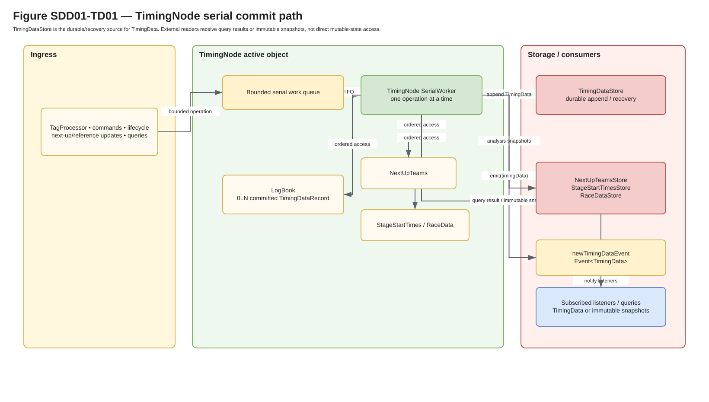

*Figure SDD01-TD01 — State-changing input enters the TimingNode serial boundary; the concrete TimingData value created by the configured factory becomes visible only after durable persistence.*

#### Other TimingNode state and per-type stores

Not every state type has the same durability semantics.

`TimingDataStore` is special: successful durable append is part of the timing
record commit. The LogBook is rebuilt from committed TimingData after restart.

`NextUpTeamsStore`, `StageStartTimesStore` and `RaceDataStore` serve a
different first purpose: preserve accepted state changes/snapshots for
post-event analysis. Their stored data lets engineers later answer questions
such as which teams were next-up or which stage-start times/reference data were
known when a timing decision was made.

Those files are not automatically the runtime source after reboot. For example,
StageStartTimes can be sent again when the node is opened. Keeping its historical
file is still valuable for later analysis.

All state changes are ordered by the TimingNode worker. The first implementation
may also perform these small/infrequent store writes on that worker. If target
measurements show an analysis-store write can delay registration unacceptably,
the immutable snapshot can later be handed to a bounded persistence executor.
That optimization must not change TimingNode state ordering and must not
introduce an unbounded hidden queue.

#### Query/consumer visibility

Consumers do not read mutable TimingNode-owned objects directly.

A consistency-sensitive query enters the TimingNode serial lane and captures the
state it needs at a defined point in the same ordering as state changes. If the
query requires expensive calculation, only the short snapshot step runs on the
lane; the calculation continues on the caller/query execution context after the
snapshot has been returned.

Conceptually:

```text
query caller
  -> TimingNode query
       -> ordered serial lane
       -> capture immutable/read-only state view
       -> return view/result
  -> optional long calculation outside lane
```

For LogBook history the first implementation may capture a shallow immutable
reference view because `TimingData` values are immutable. The exact
representation and allocation strategy belong to SDD-02 and measurement on the
target. A reusable internal buffer is acceptable only if callers cannot observe
it being mutated/reused after the query returns.

A query that is ordered before a new commit may legitimately see the earlier
state; a query ordered after that commit sees the new state. A separately
published immutable status/read snapshot may later serve high-frequency readers,
but it must have explicit freshness semantics and does not make the underlying
mutable state globally readable.

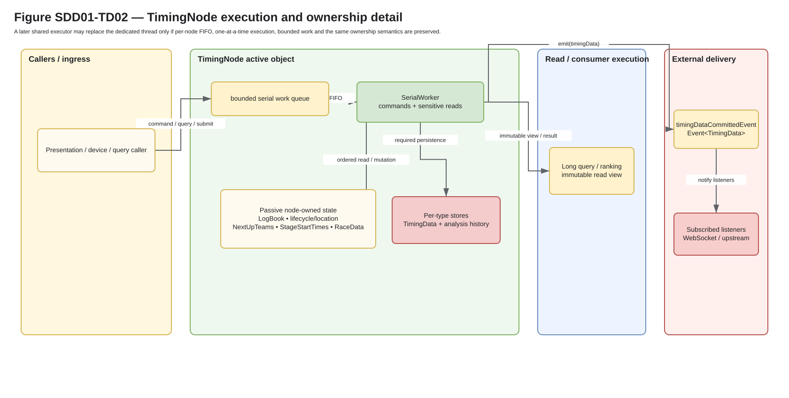

*Figure SDD01-TD02 — TimingNode refinement: one serial execution boundary owns mutable state; short reads return immutable views and `newTimingDataEvent` provides post-fact notification without exposing mutable state.*

#### Runtime flows

The sequence diagrams below show the different caller contracts explicitly.
They deliberately distinguish queue admission from the domain result produced
when work executes against current TimingNode state. SDD-02 owns the concrete
Java queue, Future and worker mechanism.

##### Automatic RFID registration

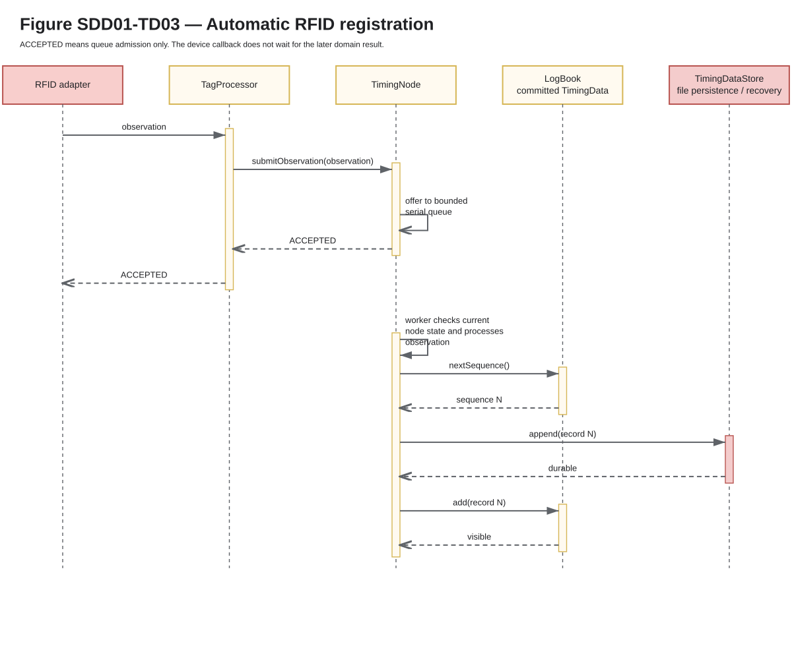

*Figure SDD01-TD03 — A device callback receives only bounded admission status and returns; later TimingNode processing uses current state and has no synchronous callback waiting for the domain result.*

##### Manual registration

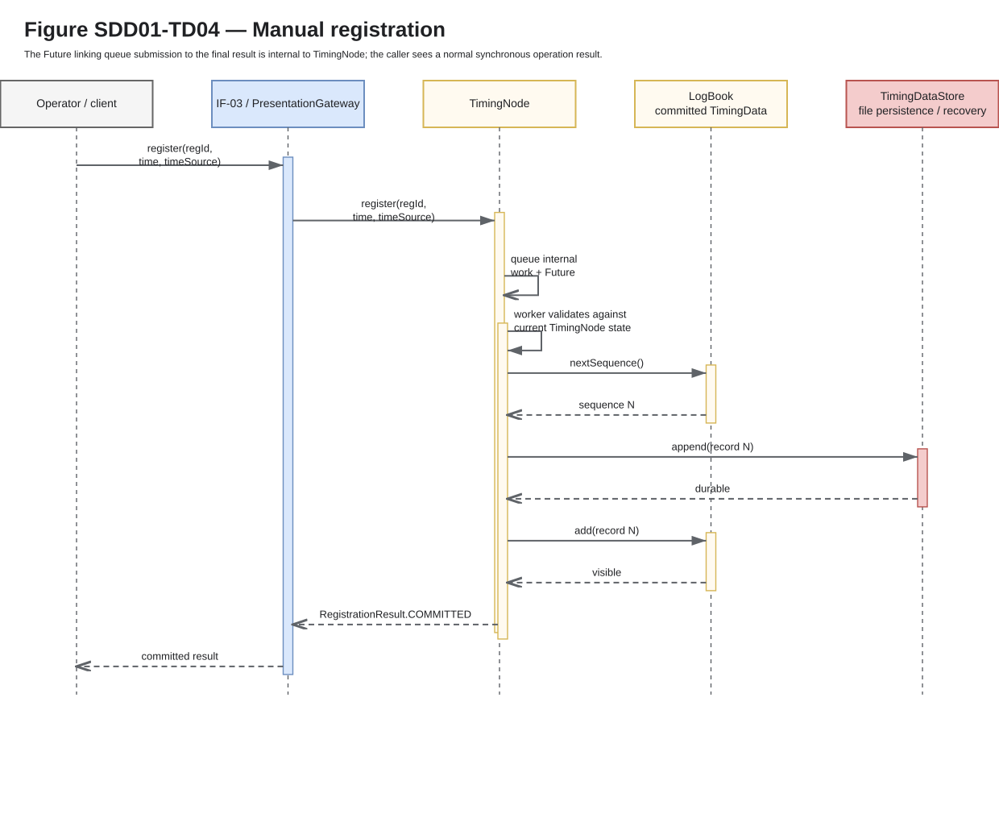

*Figure SDD01-TD04 — A presentation-driven registration call waits for its actual processed/committed result while the Future remains internal to TimingNode.*

##### Long query while registrations continue

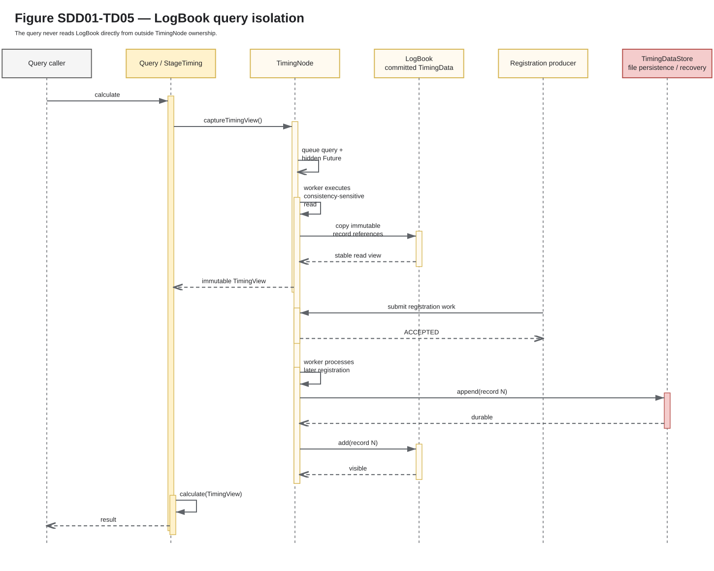

*Figure SDD01-TD05 — The query captures its read view on the TimingNode lane and performs longer calculation outside the lane; it does not read LogBook directly.*

##### Later producers

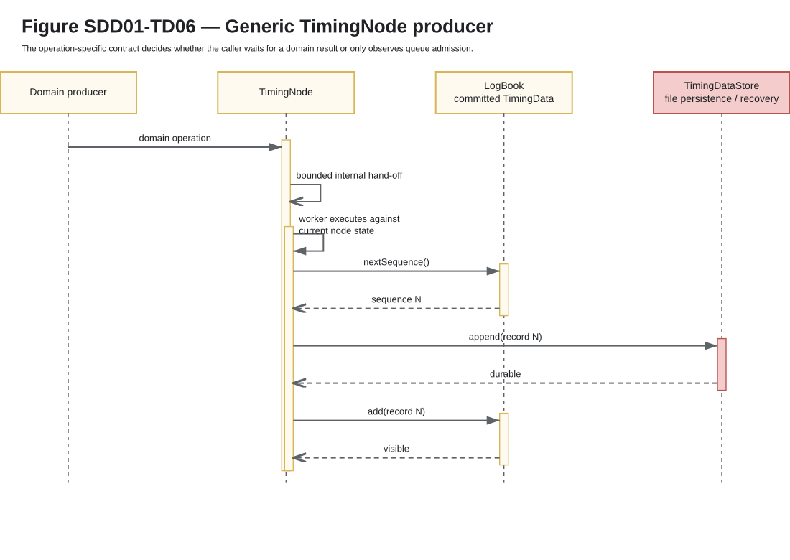

*Figure SDD01-TD06 — Later state-dependent operations use the same TimingNode ownership/ordering boundary; their caller contract must still state whether they wait for a result or are submission-only.*

##### State-dependent OPEN waits for its processed result

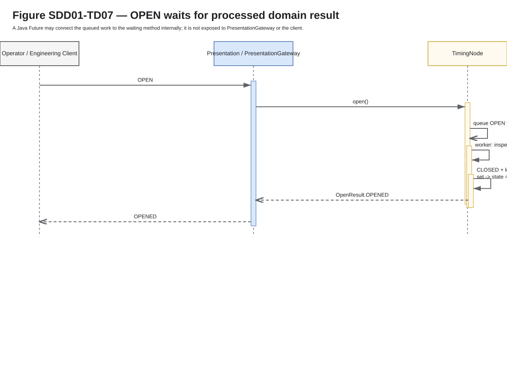

*Figure SDD01-TD07 — `open()` returns only after the queued operation has executed against current TimingNode state; the internal Future is not exposed to the caller.*

##### Concurrent OPEN and SET_LOCATION are ordered by the TimingNode

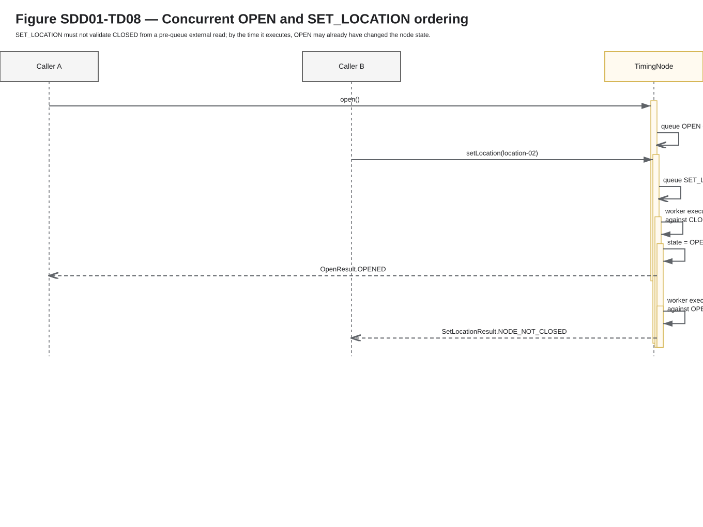

*Figure SDD01-TD08 — State-dependent validation happens when each operation reaches the serial lane, so SET_LOCATION cannot rely on an earlier external read of CLOSED state.*

##### Timeout means outcome unknown, not rollback

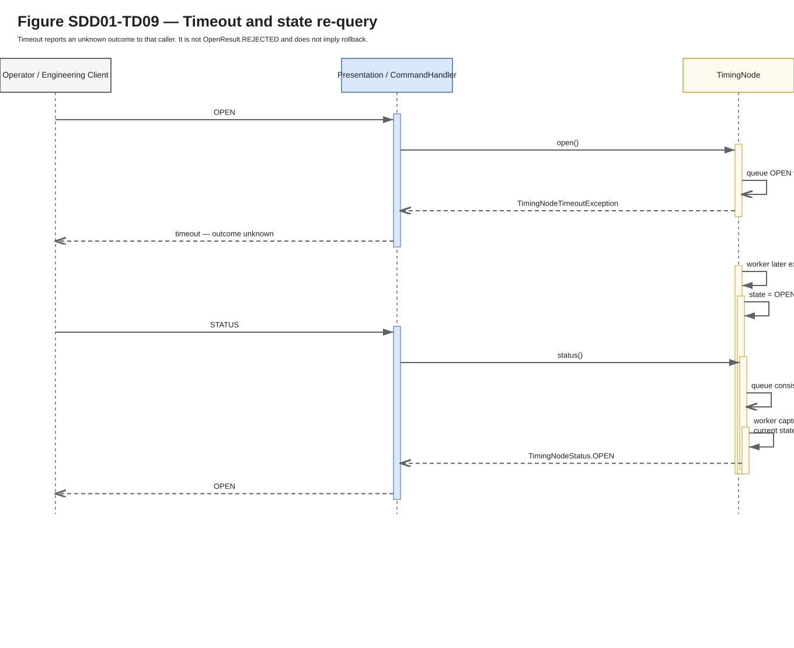

*Figure SDD01-TD09 — A caller timeout stops waiting but does not cancel already accepted work; the caller re-queries state before deciding what happened.*

##### Thread/ownership responsibilities

| Execution role | May block on | Must not do |
| --- | --- | --- |
| presentation caller waiting for a state-dependent result | bounded TimingNode operation wait | read/mutate TimingNode-owned state directly |
| device/callback ingress | short validation + bounded submission | wait for durable commit, run long domain work, read node state directly |
| TimingNode serial worker | ordered domain operation; required local persistence; short snapshot capture | client rendering, slow network retry, long ranking calculation |
| query caller/worker | long calculation on returned immutable view | retain a mutable internal buffer or bypass TimingNode ownership |
| signalling/upstream worker | its own delivery/retry policy | mutate TimingNode state directly or block TimingNode commit |

For the first one-node implementation, one dedicated worker is the simplest
mechanism. A later multi-node runtime may share executor threads only if each
TimingNode still processes at most one work item at a time, preserves FIFO order
and retains the same caller-visible operation semantics.

### TimingData persistence and recovery

This design implements `SI01-REQ-045..048` together with the applicable IF-05
semantics and the reference representation in
`33-05-IDD-timingdata-interchange.md`.

#### Recovering the next sequence

We do not need a separate sequence-counter file in the first implementation.
The TimingData file already tells us the last committed sequence:

```text
no committed records       -> nextSequence = 1
last committed sequence N  -> nextSequence = N + 1
```

At startup:

- read complete IF-05 records in order;
- check that the file belongs to one TimingNode;
- check that the committed sequence increases without duplicates or unexpected gaps;
- ignore/remove only a half-written final record that has no complete line ending;
- never reuse a committed `(TimingNodeId, SequenceNumber)`.

A half-written **last** record after power loss is recoverable: truncate back to
the last complete record and continue from there.

A corrupt **complete** record, duplicate sequence or gap is different. Do not
silently skip or renumber it. Stop recovery for that TimingNode and report the
problem so support/operator tooling can see it.

If we later add a cached sequence-counter file for faster startup, it is only a
cache. The committed TimingData file remains the source used to check/rebuild it.

#### Persistence roles

TimingData has the strongest rule:

- a TimingData record is committed only after writing its complete reference
  representation to the configured local store has completed successfully;
- only then is the same concrete `TimingData` value added to LogBook, published
  as a committed live event or returned as a successful commit result;
- the TimingData file is used to rebuild LogBook after restart.

Other per-node stores have a different first purpose:

- `NextUpTeamsStore` preserves accepted next-up state/history for analysis;
- `StageStartTimesStore` preserves accepted start-time snapshots for analysis;
- `RaceDataStore` preserves accepted reference-data snapshots/versions for
  analysis.

Those historical stores do not automatically restore live state after reboot.
The live protocol may resend the current data, for example when a TimingNode is
opened. Recovery semantics can be promoted later if an operational requirement
needs them.

The successful write above is the software commit boundary. The stronger
guarantee against sudden power loss depends on the concrete filesystem and flush
primitive and remains a target-specific design/verification point.

Implementation points to verify on the target Pi:

- what exact flush/fsync call provides the required power-loss durability level;
- what happens if power disappears halfway through the final line;
- whether truncating the incomplete tail is safe on the target filesystem;
- how a corrupt complete record is reported instead of silently ignored;
- file rotation/retention for TimingData and analysis stores;
- whether any non-critical store write needs asynchronous offload after
  measurement.

We do not need a database just to solve these cases.

#### Startup flow

The first startup flow is intentionally straightforward:

```text
start process
   |
   v
load configuration
   |
   v
open TimingData file for each configured TimingNode
   |
   v
read and validate complete IF-05 records
   |
   +--> half-written final line: truncate to last complete record + report
   |
   +--> corrupt complete record / duplicate / gap: recovery error, do not append
   |
   v
nextSequence = last committed sequence + 1
   |
   v
rebuild LogBook
   |
   v
load other saved/reference state
   |
   v
start interfaces/devices
   |
   v
connect/synchronise upstream when available
```

A new/empty TimingData file starts at sequence 1.

Rebuilding the LogBook does **not** automatically reopen a TimingNode. For
example, if the last historical state record says `OPEN`, a process restart must
not start accepting new observations merely because that old record exists. The
open/closed restart policy belongs to lifecycle/control requirements.

If prepare-team or reference-data backup is corrupt, report that explicitly too;
do not silently present the system as healthy.

### Prepare-team and reference data

#### Prepare-team registry

Keypad input indicates which teams should prepare at the timing node/exchange point. A keypad action is not itself a passage/start/penalty registration.

The keypad can:

```text
add team to prepare registry
remove team from prepare registry
```

Those actions must remain traceable so operator history is auditable and the registry can be recovered after restart.

Conceptually:

```text
PrepareTeamRegistry
  current teams to prepare: [456]

  internal traceable history:
    501  TEAM_ADDED     123
    502  TEAM_ADDED     456
    503  TEAM_REMOVED   123
```

The registry owns both:

- **current state** — which teams must currently prepare at the timing node/exchange point;
- **traceable history** — the keypad/operator add/remove mutations needed for audit and restore.

The history is an internal persistence/state aspect of the registry, not a separate architecture component.

Illustrative internal history record:

```java
final class PrepareTeamEvent {
    private long sequenceNumber;
    private TimingNodeId timingNodeId;
    private PrepareTeamEventType type; // ADDED / REMOVED
    private TeamNumber teamNumber;
    private Instant createdAt;
    private InputSource source;         // keypad / UI / API / test
}
```

The prepare-team history sequence is a separate design question from the `TimingNodeId`-scoped sequence. It may use its own internal registry sequence or later a broader operational-event sequence, but it must not accidentally consume/alter a `TimingNodeId` registration sequence unless requirements explicitly make a prepare-team action a registration-stream entry.

#### Reference-data synchronisation

Start-time and participant/reference mappings supplied by an external system may also need to be available locally.

The start-time semantic model must remain compatible with sources that define a race/stage start as **time-of-day only**. An optional date/race-day value may be carried when available, but consumers shall not require it. Accepted registration observations remain absolute `TimingTimestamp` values. For elapsed-time calculation, a time-only start is resolved in the configured event/race time zone to the most recent valid occurrence not after the registration timestamp, so a midnight crossing is handled as the next civil day rather than as a negative elapsed time.

The application maintains local in-memory repositories and synchronises accepted data from the backoffice.

A useful model is snapshot/version based:

```text
Backoffice
   |
   | ReferenceDataSnapshot(version, entries)
   v
Backoffice adapter
   |
   v
TimingSystem/application message queue
   |
   v
ReferenceDataService
   |
   +--> validate version/content
   +--> replace/update repositories
   +--> write simple backup file
   +--> publish status/data-changed event
```

Pseudocode:

```java
void handle(StartTimeSnapshotReceived message) {
    StartTimeSnapshot incoming = message.getSnapshot();

    if (!startTimeValidator.accept(incoming, startTimes.snapshot())) {
        status.referenceData().recordRejectedUpdate(incoming.getVersion());
        return;
    }

    startTimes.replace(incoming);
    referenceBackup.save(referenceData.snapshot());
    status.referenceData().recordStartTimesSynced(incoming.getVersion());
    displayService.referenceDataChanged();
}
```

The same pattern can be used for other participant/reference mappings. Full-snapshot versus delta updates, version identifiers and correction semantics still need requirements/ISD design.

#### Keypad behaviour

The CAN keypad can both add and remove team numbers from prepare-team registry.

Possible incoming messages:

```text
KeypadTeamAddRequested(teamNumber)
KeypadTeamRemoveRequested(teamNumber)
```

Both enter the normal serialized state-change path. The handler mutates `PrepareTeamRegistry`; the registry records the traceable mutation and updates its current set atomically from the application/domain point of view. The handler then rebuilds/publishes display data.

```java
void handle(KeypadTeamAddRequested command) {
    prepareTeams.add(
        command.getTeamNumber(),
        KEYPAD,
        clock.instant());

    backupCoordinator.prepareTeamsChanged(prepareTeams);
    displayService.prepareTeamsChanged(prepareTeams.currentTeams());
}
```

Removing a team follows the same path with `REMOVED`.

The application, not the keypad, remains authoritative for current prepare-team registry. Duplicate-add, remove-not-present, ordering and capacity behaviour need explicit requirements.

### Display data

#### Display model

Display data is derived from **current state**, not by forwarding keypad history directly.

```text
PrepareTeamRegistry         StageStartTimeRegistry
      |                          |
      +--------------------------+
      |                          |
      +----> DisplayModelBuilder <+
                    |
                    v
              DisplayModel
              /          \
             v            v
      V1 CAN adapter    V2 data session
```

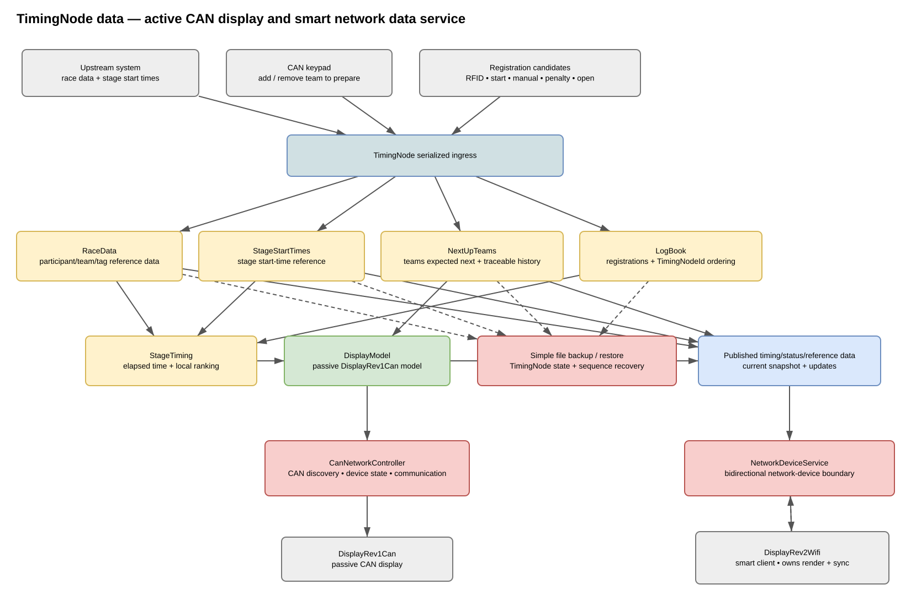

A conceptual model might contain:

```java
final class DisplayModel {
    private List<TeamDisplayData> prepareTeams;
    private Instant generatedAt;
    private long revision;
}

final class TeamDisplayData {
    private TeamNumber teamNumber;
    private StartTime startTime;
    private Duration elapsedTime;
    private LocalRank rank;
}
```

Fields are illustrative. The display ISD will ultimately define the system contract; a separate IDD is needed only if concrete design deserves its own baseline.

#### Display V1 — passive CAN display

Display V1 is relatively passive and must be actively driven by the timing application.

V1 does not reconstruct add/remove history. The application derives the **current prepare-team list** and writes the appropriate complete/current display state.

```java
void refreshV1() {
    DisplayModel current = displayModelService.current();
    canDisplayV1.apply(current);
}
```

Implications:

- `TEAM_ADDED` updates `PrepareTeamRegistry`, then triggers a refreshed current list;
- `TEAM_REMOVED` updates `PrepareTeamRegistry`, then triggers a refreshed current list;
- after discovery/reconnect/reset, send a full refresh from current state;
- a V1 reset does not destroy application prepare-team registry;
- status distinguishes discovered/reachable/last successfully updated.

#### Display V2 — smart Wi-Fi display

Display V2 is a smarter network client. The timing application communicates domain/display **data**, while V2 owns presentation/rendering behaviour.

Intended connection direction:

1. timing application advertises an mDNS service;
2. V2 discovers the service;
3. V2 connects to the timing application;
4. application sends current ready-team/reference/result data;
5. application and V2 keep data synchronised while connected.

The data can be represented as a revisioned snapshot/model even though V2 renders it differently from V1.

```java
void onDisplayV2Connected(DisplaySession session) {
    session.send(displayModelService.current());
}
```

A later optimisation may send deltas, but reconnect must always be recoverable through a complete current snapshot.

#### Registration versus ready-team display state

These flows remain separate:

```text
RFID / manual / lifecycle / later start / penalty logic
          |
          v
      TimingNode
   bounded serial work
          |
          v
    TimingData
          |
          +--> TimingDataStore (durable)
          +--> LogBook (visible after durable append)
          +--> StageTiming / ranking inputs
          +--> downstream integration

keypad/UI prepare/remove team
          |
          v
    PrepareTeamRegistry
      current state + internal history
          |
          +--> V1 current list
          +--> V2 synchronised data
```

A team can be ready for display without having produced a registration, and a registration can exist independently from whether that team is currently ready.

Later interactions (for example automatically removing a team after a successful start/passage) must be explicit domain requirements rather than accidental display side effects.

### Rules when implementing IF-05

The TimingData record/file contract is not re-specified here. SI-01 design shall
conform to **IF05-REQ-001..007** in
`32-05-ISD-timingdata-interchange.md`.

The following temporary design constraints cover only the internal realisation
needed around that interface:

#### TimingNode state and record pipeline

- **CAND-PIPE-001** — Each TimingNode shall provide one bounded serial execution
  boundary for its mutable per-node state. Contained state objects such as
  LogBook, NextUpTeams, StageStartTimes and RaceData shall remain passive.
- **CAND-PIPE-002** — Registration sequence shall be selected by the TimingNode
  worker immediately before commit, not when ingress work is queued.
- **CAND-PIPE-003** — A TimingData record shall become visible in LogBook only
  after `TimingDataStore` reports the complete append durable.
- **CAND-PIPE-004** — The LogBook shall hold the same canonical
  immutable `TimingData` values used by the TimingData persistence/interchange
  boundary; no second logbook-specific timing-record type is required.
- **CAND-PIPE-005** — Potentially long queries and network delivery/retry shall
  execute outside the TimingNode serial worker.
- **CAND-PIPE-006** — Consumers needing a stable LogBook view shall use a short
  read/copy operation and perform long calculations after releasing LogBook
  synchronization; implementations should avoid unnecessary per-query garbage.

#### Identity resolution before IF-05 commit

- **CAND-ID-001** — An automatic/tag registration shall resolve its `TagId`
  to the canonical IF-05 `RegistrationId` before the definitive TimingData
  value is created.
- **CAND-ID-002** — A manual/reference-data registration shall resolve its
  `TeamId` to the same canonical `RegistrationId` concept before TimingData
  creation.
- **CAND-ID-003** — Concrete source encodings, category/range rules and mapping
  tables shall stay behind their provider/reference-data boundary unless a public
  interface requirement explicitly promotes them.

#### Local data and per-type stores

- **CAND-DATA-001** — The initial implementation shall maintain committed
  LogBook state, next-up state and reference state in typed in-memory objects
  without requiring an external database engine.
- **CAND-DATA-002** — `TimingDataStore` shall be the durable/recovery source
  for committed TimingData.
- **CAND-DATA-003** — NextUpTeams, StageStartTimes and RaceData shall each use a
  type-specific store when their accepted state/snapshots are preserved for
  analysis; these stores shall not be treated as runtime recovery authority
  unless a requirement explicitly says so.
- **CAND-DATA-004** — TimingData recovery faults and analysis-store failures
  shall be visible in system status/diagnostics.
- **CAND-DATA-005** — The system shall track enough reference-data
  synchronisation metadata to determine whether local data is current/stale
  relative to the latest accepted update.

#### Ready-team/keypad data

- **CAND-READY-001** — The system shall maintain prepare-team registry logically separate from timing/registration records.
- **CAND-READY-002** — Adding or removing a team from prepare-team registry shall create a traceable persisted ready-team event.
- **CAND-READY-003** — Ready-team events shall be processed through the normal controlled state-change path.
- **CAND-READY-004** — Prepare-team registry state shall be recoverable after application restart from locally persisted information.
- **CAND-READY-005** — The keypad shall be able to request both addition and removal of a team number.

#### Displays

- **CAND-DISP-004** — The application shall derive display data from current timing/reference/prepare-team registry rather than requiring displays to reconstruct operational event history.
- **CAND-DISP-005** — Display V1 shall be actively controlled by the application and shall receive current ready-team display state/list after relevant changes or reconnect.
- **CAND-DISP-006** — Display V2 shall consume synchronised timing/ready-team/reference data from the application and shall own local presentation/rendering behaviour.
- **CAND-DISP-007** — When Display V2 connects or reconnects, the application shall be able to provide a complete current data snapshot independent of previously delivered incremental updates.
- **CAND-DISP-008** — Display data shall support a revision/version mechanism or equivalent means of detecting stale/missed state.

### Open questions

- What exact identifiers represent virtual registration systems?
- How are physical producers mapped to one or more `TimingNodeId` values in deployment configuration?
- What exact filesystem durability primitive/policy is required before a completed append is considered durable on each deployment platform?
- Which additional producer/domain paths should emit future IF-05 record families after their requirements are promoted?
- Should ready-team events use their own sequence stream or a broader operational event sequence?
- Should ready-team recovery use an append persistent file, a current-state snapshot, or both?
- How frequently may simple backup files be written without unnecessary SD-card wear?
- Should reference data use one combined backup snapshot or separate files per data set?
- Is start-time synchronisation always a full snapshot, or can the backoffice send deltas/corrections?
- What is the keypad protocol for distinguishing add versus remove?
- What should happen on duplicate add or removal of a team that is not ready?
- Is ready-team ordering significant and, if so, is it insertion order, start-time order, or another rule?
- How many teams can be ready concurrently?
- Should a successful start/passage automatically affect the prepare-team list, or must that always be an explicit action?
- Does V1 retain any useful state across reconnect/power interruption or must every connection be treated as blank/unknown?
- What exact data fields does V2 need, and which presentation decisions belong exclusively inside V2?


---

## Backoffice transport detailed design

**Source document:** [43-01-SDD-03-backoffice-transport-design.md](43-01-SDD-03-backoffice-transport-design.md)

Status: working draft / focused detailed design

Software item: **SI-01 — Timing Point Application**

This SDD explains **how the upstream connection is implemented**. The SSD still
defines SI-01's integration responsibilities, and IF-06/other IDDs define what is
visible on the external interface. This document does not create another protocol
definition.

Two transport implementations are planned:

- a lightweight **socket implementation** for automated loop/network system tests;
- a **RabbitMQ implementation** for production-shaped integration and deployment.

The application/domain model must not depend on RabbitMQ classes, socket classes, broker names, or the proprietary production message format.

Concrete production broker endpoint names, credentials, queue/exchange names, routing keys, external source IDs and message schemas are deployment/proprietary information and are intentionally excluded from this public repository.

Package/artifact placement follows `43-01-SDD-02-java-component-design.md`: a transport implementation can initially live under the application core's `io.messaging` capability and becomes a separate Maven library only when independent reuse, dependencies, lifecycle, ownership or release boundaries justify that split.

### Architectural goal

Backoffice target routing and transport are separate responsibilities:

```text
SystemStatus / TimingNode.UpstreamMessagePort
               ^
               |
      UpstreamMessageRouter
      upstream targets only
               |
               v
         Messaging (I/O)
          UpstreamGateway
               |
       +-------+-------+
       |               |
       v               v
 SocketConnector   RabbitMqConnector
       |               |
       v               v
 socket test peer  RabbitMQ broker
```

`UpstreamMessageRouter` is application behaviour scoped only to messages
exchanged with the external upstream system. **Upstream** identifies that
relationship and remains bidirectional; it is not a per-message direction.
`UpstreamGateway` and its connectors are I/O. Both transport
implementations preserve the same semantic addressing and feed the same
application router; neither transport owns application/TimingNode target
resolution. `TimingNode.UpstreamMessagePort` is bidirectional.

### Semantic upstream/backoffice boundary

The reusable application-core/domain side should work with semantic source-aware messages, not transport destinations.

Illustrative contracts:

```java
interface BackofficePublisherPort {
    void publish(RegistrationSourceKey source, BackofficeEnvelope message);
}

interface BackofficeInboundListener {
    void onMessage(RegistrationSourceKey source, BackofficeEnvelope message);
}
```

`BackofficeEnvelope` is a reusable/public semantic envelope or test representation. It must not force proprietary production serialization into the public application core.

These semantic contracts form the boundary between application `UpstreamMessageRouter` and I/O `Messaging`. Transport/session/wire types stay with `io.messaging`; domain objects do not depend on them.

The final system-level backoffice ISD can define the semantic obligations that both sides must fulfil. A separate IDD or private transport specification can define concrete encoding where required.

### Registration-source separation

Every configured `RegistrationSource` has its own logical inbound and outbound backoffice path.

Conceptually:

```text
source-01
  inbound semantic stream
  outbound semantic stream

source-02
  inbound semantic stream
  outbound semantic stream
```

This logical separation remains the same regardless of whether the selected transport is an in-memory stub, socket connection, or RabbitMQ.

### Transport selection and composition

Backoffice transport is selected through settings/application composition rather than compiled into domain code.

Pseudo-configuration:

```yaml
backoffice:
  transport: socket-test   # or rabbitmq
```

The executable application resolves this selection to a concrete communication implementation. A public reference/test application can use `socket-test` or a stub. A private/product application can select RabbitMQ plus private mappings/codecs where required.

This selection does not imply a separate Maven artifact for every transport. Initial implementations may coexist in the core library while their boundaries are being tested.

### Socket test transport

#### Purpose

The socket implementation provides a lightweight real communication boundary without requiring RabbitMQ or Docker.

It is intended for automated system tests that need to prove:

- SI-01 runs as a real process;
- source-aware messages cross a real TCP/socket boundary;
- inbound and outbound routing works for several sources;
- connect/disconnect/reconnect behaviour is observable;
- tests can run quickly and locally without production infrastructure.

It is not intended to define or expose the production backoffice protocol.

#### Test topology

```text
System test driver / backoffice simulator
             |
             | simple TCP socket
             v
SocketBackoffice
             |
             v
Backoffice semantic boundary
             |
             v
application-core domain/platform
```

One connection can multiplex several logical registration sources because every test message includes a generic source key.

#### Test framing

The exact framing remains an implementation choice. A simple public test protocol could use a length-prefixed or line-delimited synthetic envelope such as:

```text
sourceKey
messageType
payload
```

The socket test protocol must use only synthetic/public fields and must not copy proprietary production serialization.

The important contract is deterministic framing, source identity, reconnect behaviour and unambiguous message boundaries.

#### Socket-loop scenarios

Candidate scenarios include:

- connect a backoffice simulator to a real application process;
- inject source-01 and source-02 messages over one connection;
- verify they reach the correct source path;
- trigger application behaviour through the normal application interface;
- observe outbound source messages at the simulator;
- drop the socket and verify status/reconnect behaviour;
- reconnect and continue without changing committed registration-sequence identity;
- exercise one or multiple `TimingNode`/asset/source combinations according to the selected executable topology.

### RabbitMQ transport

RabbitMQ is a concrete communication implementation beneath the same semantic boundary.


#### RabbitMQ terminology

Receiving and sending are intentionally modelled differently:

- a consumer reads/delivers messages from a RabbitMQ **queue**;
- a publisher normally publishes to an **exchange** with a **routing key**;
- RabbitMQ routes that publication to one or more queues according to broker bindings.

The working source configuration is therefore:

```text
RabbitMqSourceMessagingConfig
  inboundQueue
  outboundExchange
  outboundRoutingKey
```

If production uses the default exchange or a direct-to-queue convention, the implementation can represent that through the same outbound-endpoint abstraction.

#### RabbitMQ connector topology

The application may compose 0..N `BackofficeConnector` instances. RabbitMQ is one concrete connector implementation:

```text
application
  +-- BackofficeConnector connector-01
  |     -> RabbitMqBackofficeConnector
  |     -> 1..N TimingNode/source bindings
  |
  +-- BackofficeConnector connector-02
        -> RabbitMqBackofficeConnector
        -> 1..N TimingNode/source bindings
```

A `RabbitMqBackofficeConnector` owns its broker connection/channel/consumer/publisher resources internally. Those mechanics are implementation detail, not a separate architectural manager component.

One connector may multiplex several source-specific queues/channels over one physical broker connection. Separate connectors may use different brokers, credentials or routing domains. A TimingNode may intentionally participate in more than one connector.

Within one connector, separate consumer and publisher connections remain an implementation option when fault isolation, channel/thread ownership, broker-client behaviour or measured Pi Zero evidence justifies it. That refinement must not change the semantic connector boundary.

#### RabbitMQ threading

RabbitMQ callbacks are external I/O callbacks and must not directly mutate timing-domain state.

```text
RabbitMQ consumer callback
      |
      v
RabbitMqConnector / UpstreamGateway
      |
      v
transport-neutral upstream message
      |
      v
UpstreamMessageRouter resolves ApplicationId / TimingNodeId
      |
      v
application target or TimingNode.UpstreamMessagePort
```

Each consumer must have controlled channel ownership. Arbitrary domain threads must not publish directly on shared RabbitMQ channels.

#### RabbitMQ source-specific settings

Pseudo-configuration only:

```yaml
backoffice:
  connectors:
    - id: connector-01
      type: rabbitmq
      host: ${BROKER_HOST}
      port: ${BROKER_PORT}
      virtualHost: ${BROKER_VHOST}
      credentials: external-secret-reference
      bindings:
        - timingNode: timing-node-01
          externalName: ${PRIVATE_TIMING_NODE_NAME}

      sources:
        - key: source-01
          externalId: ${PRIVATE_SOURCE_ID_01}
          timingNode: timing-node-01
          inboundQueue: ${PRIVATE_SOURCE_01_IN_QUEUE}
          outboundExchange: ${PRIVATE_SOURCE_01_OUT_EXCHANGE}
          outboundRoutingKey: ${PRIVATE_SOURCE_01_OUT_KEY}
        - key: source-02
          externalId: ${PRIVATE_SOURCE_ID_02}
          timingNode: timing-node-02
          inboundQueue: ${PRIVATE_SOURCE_02_IN_QUEUE}
          outboundExchange: ${PRIVATE_SOURCE_02_OUT_EXCHANGE}
          outboundRoutingKey: ${PRIVATE_SOURCE_02_OUT_KEY}
```

For two configured sources, two inbound consumers exist even if they share one physical RabbitMQ connection.

### Outbox and delivery

Local commitment and external transport are deliberately separated.

```text
RegistrationSource
  committed record
       |
       v
local outbox / sync state
       |
       v
BackofficePublisherPort
       |
       +--> SocketBackoffice
       |
       +--> RabbitMqBackoffice
```

A locally committed registration must not disappear because a transport is unavailable.

Working direction:

1. commit registration locally according to the final persistence rule;
2. represent it as pending in local outbox/synchronisation state;
3. selected transport attempts delivery;
4. transport acknowledgement/reconciliation advances pending state;
5. failure remains pending and visible through status.

The exact acknowledgement, retry, duplicate/idempotency and reconciliation rules belong to later requirements/ISD/IDD/detail design.

### Status model

Transport status and source status remain separately observable.

```text
BackofficeStatus
  selectedTransport
  connection/session state

  source-01
    inbound
      configured
      active
      lastMessage
    outbound
      pendingCount
      lastPublish
      lastFailure

  source-02
    ...
```

For RabbitMQ, connection status can additionally expose broker/authentication/recovery information. For socket testing, it can expose connected/disconnected peer state.

### Java package and future artifact placement

Working package direction inside the reusable application core:

```text
io.github.brainboxemb.eventtiming.domain.backoffice
    semantic backoffice contracts/state/outbox concepts

io.github.brainboxemb.eventtiming.comm.socket
    socket session/framing/test transport

io.github.brainboxemb.eventtiming.comm.rabbitmq
    RabbitMQ connection/channel/consumer/publisher implementation
```

This does **not** require three Maven libraries.

A future `event-timing-comm-rabbitmq` (or similarly named) artifact becomes useful when, for example:

- several applications need RabbitMQ independently;
- the RabbitMQ client dependency should be optional and excluded from non-RabbitMQ applications;
- lifecycle/release ownership needs an independent boundary;
- public/private implementation ownership requires extraction.

Until such evidence exists, clean package boundaries are sufficient and make later extraction straightforward.

### Public/private boundary

Public core/test code may define:

- transport-independent semantic ports;
- generic `RegistrationSourceKey`;
- generic/test `BackofficeEnvelope`;
- socket-test communication implementation/protocol;
- RabbitMQ connection/consumer infrastructure if proprietary production codec details remain separate;
- synthetic RabbitMQ topology for integration tests.

Private components/configuration may provide:

- actual external source-ID mappings;
- actual broker topology names;
- proprietary message schemas/codecs;
- authentication details;
- production-specific retry/reconciliation protocol details where sensitive.

### Automated system-test profiles

The transport abstraction supports progressively more realistic automated system tests.

#### ST-1 — Application behaviour

Goal: validate application behaviour through its public control/status interface while external dependencies are controlled stubs.

```text
System-test driver
      |
      | public application control/status interface
      v
real application process
      |
      +-- stub RFID/CAN/display
      +-- in-memory/stub backoffice port
```

This is the fastest system-level feedback loop and does not require a network backoffice service.

#### ST-2 — Socket loop/network

Goal: add a real communication/process boundary with minimal infrastructure.

```text
application test driver --> real application process
backoffice simulator <----> simple socket implementation
```

This profile verifies source multiplexing/routing, network session state, disconnect/reconnect and outbound/inbound semantics without RabbitMQ.

#### ST-3 — RabbitMQ integration

Goal: verify the production-shaped broker transport with a real disposable broker.

```text
system-test driver
      |
      +--> application interface
      |
      +--> RabbitMQ test broker (Docker Compose)
```

This verifies broker connection/channel/consumer behaviour, source-specific queues/routing, outbox recovery and broker restart scenarios.

These profiles complement unit/component tests and Pi Zero/hardware-in-the-loop verification; they do not replace them.

### Docker-based RabbitMQ test environment

RabbitMQ is a good candidate for a containerised integration dependency because it is a real external service with meaningful connection and recovery behaviour.

A future implementation/reference application can provide a small Compose environment:

```text
compose.yaml
  rabbitmq-test
```

The broker must use synthetic/public queue names and credentials.

Typical lifecycle:

```text
start RabbitMQ container
wait for health
start application
exercise several source consumers + publisher
stop/restart broker
verify consumer restoration + pending delivery
clean up
```

Docker remains optional for ST-1 and ST-2 so most behaviour can be tested without container startup cost.

### Candidate requirements

Temporary identifiers only.

- **CAND-BO-001** — SI-01 backoffice semantics shall be independent from the concrete communication transport.
- **CAND-BO-002** — The backoffice transport shall be selectable through external configuration/composition.
- **CAND-BO-003** — A lightweight socket transport shall be available for automated system/integration testing without requiring RabbitMQ.
- **CAND-BO-004** — The socket test protocol shall support multiple logical registration sources over a real communication boundary.
- **CAND-BO-005** — RabbitMQ shall support a source-specific inbound queue configuration for each configured registration source.
- **CAND-BO-006** — RabbitMQ shall support source-specific outbound routing configuration for each configured registration source.
- **CAND-BO-007** — Multiple RabbitMQ source consumers shall be able to share one physical broker connection.
- **CAND-BO-008** — External transport callbacks shall not directly mutate timing-domain state.
- **CAND-BO-009** — Transport connection status and per-source inbound/outbound status shall be observable independently.
- **CAND-BO-010** — Loss of external backoffice transport shall not discard locally committed registration data.
- **CAND-BO-011** — Reconnection shall restore configured source communication and resume pending outbound synchronisation.
- **CAND-BO-012** — Production broker/source topology, protocol details and credentials shall remain external/private configuration or implementation.
- **CAND-BO-013** — A disposable RabbitMQ broker shall be available for automated ST-3 integration tests.
- **CAND-BO-014** — SI-01 shall support zero or more configured backoffice connectors within one application composition.
- **CAND-BO-015** — A backoffice connector shall support bindings for one or more TimingNodes, and one TimingNode may be bound to more than one connector.
- **CAND-BO-016** — Connector-specific external names/routing identities shall not redefine the internal `TimingNodeId`.
- **CAND-BO-017** — Backoffice routing/fan-out shall remain separate from concrete connector transport/resource handling.

### Open questions

- What exact semantic messages belong in the public backoffice ISD?
- What minimal public socket-test framing should be used: length-prefixed binary, line-delimited JSON, or another simple representation?
- Should the socket implementation use one bidirectional connection or separate inbound/outbound sockets?
- Within one RabbitMqBackofficeConnector, is one physical connection sufficient, or should consumer and publisher traffic use separate connections?
- Are RabbitMQ queues/exchanges pre-provisioned or should the application declare/bind any topology?
- At what point does RabbitMQ deserve its own Maven library rather than a `comm` package inside the core artifact?
- What is the production acknowledgement/reconciliation protocol?
- Which outbound items require durable local outbox persistence versus rebuildable state?
- What publisher-confirm/retry policy is required?
- How are duplicates/redeliveries detected and handled?
- What broker/client settings are appropriate on the Raspberry Pi Zero memory/CPU budget?


---

## Software Development Environment (SDE)

**Source document:** [50-SDE-01-software-development-environment.md](50-SDE-01-software-development-environment.md)

Status: working draft / non-authoritative

This Software Development Environment document defines the **concrete engineering environment and repository conventions** used to develop, build, test, document and review the software system.

The SDE is project/software-system level and applies across software items and implementation repositories unless a repository documents a justified exception.

### Document boundary

The SDE is not the high-level development plan and it is not the detailed implementation sequence.

Use the documents as follows:

```text
SDP  why/how the project is developed at high level: strategy, phases, risks, resources, assumptions
SIP  what is implemented next: concrete steps, deliverables, demonstrations and exit evidence
SDE  where/how engineering work is performed: repositories, tooling, GitHub flow, CI, artifacts, local environments
SVP  verification strategy: levels, profiles, environments and evidence rules
VTS  concrete verification cases: setup, procedure and expected result
```

The SDE may define detailed mechanisms that support the SDP/SIP/SVP/VTS, but should not duplicate their planning or verification content.

### Purpose

The development environment should make work:

- reproducible;
- reviewable;
- traceable from issue through implementation and verification;
- usable by both human developers and AI agents;
- consistent across public and private repositories;
- suitable for generated documentation and build artifacts;
- easy to reconstruct on a new workstation or CI runner;
- simple enough for a small project without losing engineering discipline.

### Development hosts and execution environments

The high-level need for development/test hardware belongs in the SDP. This SDE defines how those environments are used once selected.

Expected environment classes are:

```text
Developer workstation
  primary interactive development
  initially Windows
  Java/Maven/Python/Git
  optional Docker/Compose

GitHub-hosted CI
  build/unit/system/integration automation where supported
  generated documentation/artifacts

Raspberry Pi Zero target
  SI-01 runtime
  selected compatible Java runtime
  target/runtime/HIL verification

Optional integration host
  broker/test services
  test drivers/simulators
  longer integration workloads
```

Exact host provisioning scripts and image tooling are introduced by the relevant SIP steps and implementation repositories.

### Primary development services and tools

Current baseline:

- **GitHub** — source control, issues, pull requests and review history;
- **GitHub Actions** — automated build, test, generated documentation and later image/deployment workflows;
- **Git** — source/version control;
- **Maven** — Java build/dependency-management baseline;
- **Java 8** — initial SI-01 language/API/runtime baseline;
- **Python** — lightweight project tooling/document generation where appropriate;
- **draw.io + generated SVG** — editable and GitHub-readable diagrams;
- **Docker / Docker Compose** — reproducible external integration services such as RabbitMQ where a real service materially improves verification.

Individual repositories may add tools, but system-wide additions should be deliberate and documented.

### Repository baseline

Every implementation or coordination repository is expected to contain at least:

```text
README.md
AGENTS.md
CHANGELOG.md
```

#### `README.md`

The human entry point. It should normally contain:

- repository purpose;
- relationship to the wider software system;
- build/run/test entry points or links;
- important document/navigation links;
- generated-output links where applicable.

#### `AGENTS.md`

Persistent repository-specific instructions for AI/coding agents, including:

- repository purpose and boundaries;
- sources of truth;
- workflow rules;
- files that must be read before work;
- public/private boundaries;
- build/test expectations;
- scope/plan discipline.

AI follows the same controlled engineering workflow as human development.

#### `CHANGELOG.md`

Records notable repository changes. It does not replace Git history, issue history or PR evidence.

### Repository content layout

Exact source trees differ by repository, but use predictable top-level locations where applicable.

Typical coordination/documentation repository:

```text
README.md
AGENTS.md
CHANGELOG.md
.github/
  workflows/
docs/
reference/
tools/
bld/                 local/generated build output; normally ignored in source
```

Typical Java implementation repository may evolve toward:

```text
README.md
AGENTS.md
CHANGELOG.md
.github/
  workflows/
docs/
<module>/
  src/main/...
  src/test/...
tools/
integration/         integration fixtures/config where useful
bld/ or target/      generated output, not hand-maintained source
pom.xml
```

Do not create directories merely to satisfy a template. Introduce them when the repository has content that belongs there.

#### Source versus generated versus reference material

Keep these categories distinct:

- **source** — hand-maintained code/config/documentation on normal branches;
- **generated output** — CI/build artifacts, generated documents/images/packages/images;
- **reference material** — preserved external/source documents used for research or traceability;
- **runtime/deployment data** — environment-specific configuration, secrets and mutable operational data; not normal public source.

Generated output should not be manually edited as if it were source.

### Documentation layout

The SDP owns the repository-wide document numbering convention. The SDE follows
that convention rather than maintaining a second category map.

For document families relevant to the engineering environment:

```text
32-<IF>-ISD       system-owned interface specifications; <IF> is the interface ID
33-<IF>-IDD       optional system-owned interface design descriptions; <IF> is the same interface ID
41-<SI>-SSD       software-item combined specification; <SI> is the software-item ID
43-<SI>-SDD-<N>   detailed design; final <N> sequences several SDDs in one SI scope
50-SDE-<N>        generic SDE family; <N> sequences documents because no scope ID applies
60-SVP            singular verification plan
```

Scope identifiers and document sequences are deliberately different concepts.
For example, `32-03-ISD` identifies the IF-03 specification and `33-05-IDD` the optional IF-05 design, while `50-SDE-02` identifies the
second document in the generic SDE family.

Established abbreviations include `SDP`, `SIP`, `SDE`, `SRD`, `SSSD`,
`SSD`, `SAD`, `SDD`, `ISD`, `IDD`, `SVP`, `VTS` and `UC`.

Software-item and interface identifiers remain stable across the document
families that use them.
### GitHub issue → branch → pull-request workflow

Normal development follows a PR-first workflow:

```text
issue / work item
      ↓
feature branch
      ↓
draft pull request
      ↓
implementation + discussion + tests + evidence
      ↓
ready-for-review
      ↓
merge
```

#### Issue/work-item creation

Use a GitHub issue when useful to reserve/identify work and provide a stable work number.

#### Feature branch

Create from the intended target branch using:

```text
feature/pr-<N>-<short-slug>
```

Do not perform normal work directly on `main`.

#### Draft PR as active work container

Create/promote the draft PR early. It carries:

- scope;
- change-specific design discussion;
- implementation commits;
- tests/results;
- generated evidence;
- deviations and deferred scope;
- review conversation.

Long-term planning documents should not become detailed activity logs when the PR can carry that evidence.

#### Review and merge

Before merge:

- required checks are green;
- generated outputs have been inspected where relevant;
- important evidence is recorded;
- documentation/changelog updates are included where required;
- deferred or unresolved scope is explicit.

### Branch protection direction

Expected default-branch policy:

- require pull requests for normal merges;
- prevent force pushes;
- restrict deletion;
- allow zero required approving reviewers where appropriate for a solo-maintainer project;
- require meaningful stable CI checks once available;
- delete merged feature branches where appropriate.

Do not introduce merge queues or similarly heavy process unless there is a concrete need.

### Generated-output branches

Build outputs may be published separately from source branches.

General pattern:

```text
source PR/branch
      |
      | CI
      v
dev/pr-<N>/<output-type>
      |
      | merged main
      v
prod/<output-type>
```

Current documentation example:

```text
dev/pr-<N>/docs
prod/docs
```

Rules:

- generated branches are build output;
- the normal source branch is authoritative;
- generated PR branches exist so human/AI reviewers can inspect the real generated result before merge;
- corresponding `dev/pr-N/...` branches should be removed when the PR closes;
- `prod/...` represents output generated from merged/default-branch source.

The same approach can later be used for target images/packages when it provides useful review/release separation.

### Generated documentation

Source documentation remains Markdown plus project-controlled diagram-generator source.

The generated documentation set may contain:

- complete GitHub-readable Markdown copies;
- local SVG assets;
- editable draw.io files;
- combined review books;
- source commit/provenance metadata.

Generated documents are for review/publication. Their source Markdown remains authoritative.

### AI-assisted development environment

AI is an engineering tool inside the repository process, not an alternative process.

Before substantial work an agent should:

1. read `AGENTS.md`;
2. use the shared `brainboxemb.meta/docs/20-20-new-session-handoff.md` when starting or transferring a session, then read the active local plan;
3. inspect the current open/draft PR;
4. inspect predecessor PR context when relevant;
5. identify the active SIP/AP scope;
6. work within that scope unless a plan correction is necessary.

An agent must not:

- bypass PR-first development;
- treat brainstorm material as approved requirements automatically;
- silently promote major architecture decisions;
- copy proprietary/private information into public source;
- edit generated branches as hand-maintained source;
- claim test/build/hardware evidence that was not actually produced.

### AI/session handoff environment

A new session should reconstruct current state from repository artifacts rather than requiring hidden conversation state.

The portfolio-wide session entrypoint is
`brainboxemb.meta/docs/20-20-new-session-handoff.md`. This repository does not
maintain a project-local handoff document: project-specific state belongs in the
sources below and in current GitHub evidence rather than in a duplicated handoff.

Preferred sources include:

```text
AGENTS.md
current open/draft PR
relevant predecessor PR
active SIP/AP material
requirements / architecture / ISDs / IDDs
README.md
CHANGELOG.md
```

Active implementation evidence belongs mainly in the PR. Persistent rules belong in `AGENTS.md`; development strategy belongs in the SDP; implementation ordering belongs in the SIP.

### Build and CI environment

Implementation repositories should introduce CI from the first useful increment.

Environment expectations include:

- Maven build/test entry points that also work locally;
- Java source/bytecode baseline enforced in build configuration;
- fast checks suitable for normal PRs;
- separate integration jobs where external services make tests slower;
- target/HIL workflows separated from hosted-runner-only tests;
- generated artifacts retained or published when they improve review/traceability;
- CI configuration kept in source under `.github/workflows/`.

Which behaviours belong to unit, ST-1, ST-2, ST-3 or ST-4 is defined by the SVP; the SDE only defines the environment mechanisms that make those profiles executable.

### Test-support environment

The engineering environment should support progressively more realistic verification without forcing every developer/test to require all infrastructure.

Expected mechanisms include:

- in-process/direct fakes for unit/component work;
- executable SI-01 plus external test driver for application/system testing;
- small manual test clients where they materially improve developer inspection of a public interface;
- lightweight native socket simulator for network-loop tests;
- Docker/Compose service fixtures for RabbitMQ-specific integration;
- real Pi Zero / hardware environment for target/HIL testing when relevant.

A manual test client may use a different desktop runtime/toolchain from SI-01 when that boundary is explicit. It must still consume the public interface
rather than internal SI-01 classes.

Do not make Docker a prerequisite for fast tests that do not need an external service.

### Containerized integration services

Docker/Compose is appropriate for real external dependencies with meaningful connection/protocol/recovery behaviour.

RabbitMQ is the first identified example.

Environment rules:

- synthetic/public test topology and credentials only;
- no real queue/source/deployment names or secrets;
- intentionally pinned image versions/tags;
- health/readiness checks;
- same basic environment usable locally and in GitHub Actions where practical;
- simple teardown/cleanup;
- restart/failure control where recovery is under test.

Concrete verification scenarios belong in the VTS; product design rationale remains in the applicable SDD. Neither belongs in this SDE.

### Raspberry Pi build/deployment environment

The exact Pi deployment approach is still open. When the Raspberry Pi SIP step starts,
begin with the simplest repeatable way to install and run SI-01 on the target.

Record the chosen OS/runtime and installation procedure. Add image generation, update
automation or rollback tooling only when it solves a demonstrated development or field
need. Detailed scripts/tool choices belong in the implementation repository.

### Public and private repository environment

Public/private separation must be enforceable by normal build structure:

- public implementation repositories build/test without private source;
- private implementations consume public APIs/artifacts;
- private Maven/repository credentials use secure CI/developer credential mechanisms;
- proprietary protocols and real deployment mappings remain private;
- public integration fixtures use synthetic identities;

### Secrets and configuration

Credentials, tokens, encryption keys and environment-specific secrets are not committed to source control.

Use GitHub environment/repository secrets and runtime configuration mechanisms appropriate to each target.

Public example configuration uses placeholders/synthetic values.

Exact application configuration semantics remain architecture/ISD/IDD/SDD concerns.

### Tooling reproducibility

Start with the simplest adequate reproducible mechanism:

- pinned/action-versioned CI actions;
- Maven for Java;
- Python standard library where sufficient;
- native/simple socket tooling where sufficient;
- Docker/Compose for meaningful external service dependencies;
- dedicated custom build containers only when they isolate a substantial toolchain or solve a real reproducibility problem.

Do not introduce a custom Docker image merely because a small script exists.

### Repository-specific extensions

Each repository may extend this SDE via its own `AGENTS.md`, README, workflows, build files and local development documentation.

Repository-specific rules may add constraints but should not silently weaken system-level traceability/workflow rules. Material deviations should be documented.

### Open SDE topics

Environment/convention decisions still to resolve include:

- exact developer-machine JDK provisioning;
- concrete Java runtime provisioning for the Pi target;
- Maven public/private artifact repository and credential setup;
- standard Java formatting/static-analysis toolchain;
- standard unit/integration-test libraries;
- reusable repository bootstrap/template conventions;
- exact ruleset/branch-protection template;
- release/version/artifact naming conventions;
- whether image-builder/update tooling is useful after the first Pi target proof;
- exact local integration-host setup if a separate host becomes necessary;
- whether generated documentation later also produces PDF/HTML.


---

## Java Build and Test Toolchain (SDE)

**Source document:** [50-SDE-02-java-build-test-toolchain.md](50-SDE-02-java-build-test-toolchain.md)

Status: working baseline / AP-2

This document refines the system-level Software Development Environment for Java repositories. It defines the **engineering toolchain roles, build/test matrix, artifact flow and reusable-tool boundary** needed before the first SI-01 implementation repository is bootstrapped.

It does not define SI-01 product behaviour. Product requirements remain in the SRD/SSD/ISD documents; architecture/design remains in SAD/IDD/SDD documents, and verification intent remains owned by the SVP.

### Why this document exists

A Java repository alone is not yet a reproducible engineering environment. Before creating the first implementation repository the project needs a deliberate answer to:

- which environments build and test Java code;
- which operating systems are verified;
- how Maven itself is provisioned;
- which JDK/API baseline is authoritative;
- which job produces the canonical application artifact;
- how that same artifact is exercised on other platforms;
- which parts are generic enough to reuse across future Java repositories;
- when a dedicated/self-hosted machine is actually justified.

This document exists because those decisions are cross-repository SDE policy rather than SI-01 application design.

### Engineering roles are not physical machines

The toolchain defines **roles/environments** first. One physical computer or hosted runner can fulfil more than one role.

Initial roles:

```text
Windows developer workstation
  interactive development and demonstrations
  local Maven Wrapper build/test
  local application execution

GitHub-hosted Linux CI
  canonical CI build
  compile + unit/component verification
  package canonical Java artifact
  provenance/build metadata
  fast system-test jobs when available

GitHub-hosted Windows CI
  Windows compatibility build/test
  Windows execution/smoke verification
  later ST-1 compatibility execution

Raspberry Pi Zero target
  target execution only after the target/deployment SIP increment
  ARMv6-compatible Java 8 runtime
  resource/ST-4/HIL evidence

Optional integration/test controller
  not required initially
  later Docker/RabbitMQ services
  longer-running tests
  target/HIL orchestration when hosted CI is insufficient
```

A separate physical build server or Java test server is therefore **not an initial requirement**.

### Initial platform matrix

| Environment | Build source? | Unit/component tests | Runs canonical artifact | Main purpose |
| --- | --- | --- | --- | --- |
| Windows developer workstation | yes | yes | yes | interactive development and stakeholder demo |
| GitHub Ubuntu runner | **yes — canonical** | **yes** | yes | authoritative CI build/package path |
| GitHub Windows runner | yes, compatibility | yes | **yes** | detect Windows-specific build/runtime problems |
| Original Raspberry Pi Zero / Zero W | no normal source build required | selected target tests | **yes** | target viability/resource/HIL evidence |
| Optional Linux integration host | optional | integration/system | yes | external services and longer test orchestration |

The matrix can grow only when there is evidence that another environment materially improves verification or deployment.

### Java baseline

The first SI-01 baseline remains **Java SE 8** because the original Raspberry Pi Zero / Zero W is mandatory.

Toolchain implications:

- the canonical compile runs with a Java 8 JDK, not merely a newer JDK configured with `source=8`;
- Maven compiler/source/target settings must enforce Java 8 bytecode/source compatibility;
- the CI job records the actual JDK vendor/version used;
- source code remains vendor-neutral at the Java SE/API boundary;
- the Pi may use a different ARMv6-capable Java 8 runtime vendor from hosted CI without changing the application artifact;
- Java 11 remains a later evidence-driven compatibility/upgrade checkpoint, not part of the first canonical build.

The exact hosted-CI JDK distribution and patch version should be pinned/configured in the reusable workflow when that workflow is implemented. The exact Pi runtime is selected by the target-image SIP increment after ARMv6 evidence.

### Maven Wrapper policy

Every Java consumer/implementation repository should carry the Maven Wrapper:

```text
mvnw
mvnw.cmd
.mvn/wrapper/...
```

Normal commands are therefore repository-owned:

```text
Linux/macOS/CI:
  ./mvnw verify

Windows:
  mvnw.cmd verify
```

This avoids requiring every workstation or runner to install an independently managed Maven version.

Rules:

- the wrapper pins the Maven distribution used by the repository;
- CI invokes the wrapper rather than a runner-global `mvn` installation;
- wrapper files are source-controlled and reviewed;
- changing Maven version is a deliberate repository/toolchain change;
- the JDK remains an environment prerequisite and is provisioned explicitly by CI/developer setup.

### Canonical build and artifact model

The normal Java application artifact should be platform-neutral where the code/dependencies permit it.

Preferred flow:

```text
source commit
    |
    v
GitHub Linux canonical build
  pinned JDK 8 policy
  Maven Wrapper
  ./mvnw verify
    |
    +--> test reports
    +--> build/provenance manifest
    +--> canonical Java artifact(s)
                 |
                 +--> Linux execution/smoke
                 +--> Windows execution/smoke
                 +--> later Pi Zero execution
```

The project should **not** produce a separate Windows JAR, Linux JAR and Pi JAR merely because those operating systems are different.

A platform-specific artifact is justified only when a genuine native/platform dependency makes it necessary. Such a dependency must remain behind an appropriate adapter/module boundary rather than silently making core Java code platform-specific.

### Canonical versus compatibility builds

Two related questions need evidence:

1. can the source build/test correctly on an environment?
2. can the **same produced artifact** execute on another supported environment?

The toolchain should eventually verify both.

Initial CI direction:

```text
linux-canonical
  checkout
  set up JDK 8
  ./mvnw verify
  collect reports
  create/upload canonical artifact
  record build metadata

windows-compatibility
  checkout
  set up JDK 8
  mvnw.cmd verify

windows-artifact-smoke (when runnable app exists)
  download canonical artifact from linux-canonical
  java -jar ...
  execute first public smoke/ST-1 check
```

A Linux artifact-smoke job may use the same canonical artifact as an additional packaging sanity check.

### Build provenance

A produced artifact should be traceable without relying on a developer's workstation memory.

The build/release evidence should record at least:

```text
repository
source commit SHA
source ref/tag where applicable
project/application version
build timestamp or reproducible-build epoch policy
JDK vendor/version
Maven version from Wrapper
workflow/toolchain version
OS/runner class used for canonical build
```

Where practical, the application should embed enough non-secret build identity to answer its public version query without reading CI logs.

Reproducible-JAR settings such as a controlled Maven build output timestamp should be considered when the first Maven reactor is created.

### Test execution responsibility

The toolchain executes tests; the SVP defines what the tests mean.

Initial allocation:

#### Linux canonical CI

- compile all modules;
- unit tests;
- deterministic component/module tests that need no platform-specific behaviour;
- architecture/dependency checks;
- package artifacts;
- later fast ST-1 tests where practical;
- publish reports/artifacts.

#### Windows compatibility CI

- compile/test with the same Java source/API baseline;
- catch path, shell, filesystem and process-launch differences;
- run the canonical application artifact once it exists;
- later run a compact ST-1 compatibility subset.

#### Raspberry Pi Zero

- do not use the Pi as the normal project build machine;
- run the already-produced canonical artifact;
- verify ARMv6 runtime compatibility;
- collect startup/RSS/CPU/thread/latency evidence;
- run selected target/ST-4 scenarios.

#### Optional integration host

Introduce only when needed for capabilities that are awkward or inappropriate on hosted runners, for example:

- long-running RabbitMQ/recovery tests;
- hardware access;
- Pi image deployment/orchestration;
- CAN/RFID/display HIL;
- multi-target endurance testing.

### Docker policy

Docker is **not** part of the basic Java compile/unit-test toolchain.

Use Docker/Compose when a real external service materially improves verification, for example RabbitMQ in ST-3.

This keeps:

```text
normal Java verify
  JDK + Maven Wrapper
```

independent from:

```text
integration service fixture
  Docker/Compose + RabbitMQ/etc.
```

### Reusable `tool.java-project` boundary

Working repository name:

```text
tool.java-project
```

The name is provisional until that repository is created.

The reusable tool repository should own **generic Java-project engineering behaviour**, not product behaviour.

Good candidates:

```text
.github/workflows/
  reusable-java-verify.yml
  reusable-java-artifact.yml
  later reusable-integration entrypoints

templates/ or examples/
  minimal consumer workflow
  Maven Wrapper/bootstrap guidance

scripts/ (only when a script is genuinely reused)
  build/provenance collection
  project/toolchain validation

docs/
  supported inputs/outputs
  versioning/release policy
  consumer migration notes
```

Potential later candidates, only after repeated need is proven:

- a reusable Maven parent/convention artifact;
- a Maven plugin for project-specific convention checks;
- shared test-support tooling that is not timing-domain-specific.

Do **not** put the following in `tool.java-project`:

- SI-01 module layout as a hard-coded product assumption;
- timing-domain requirements;
- RFID/CAN/display behaviour;
- proprietary/private protocols or credentials;
- real deployment identities;
- Raspberry Pi image content that is specific to SI-01;
- RabbitMQ topology that belongs to a product/integration contract.

### Relationship to existing reusable tooling pattern

The existing SCAD tooling separates reusable project workflow from its runtime/toolchain and from consumer projects. The Java toolchain should preserve the same responsibility discipline without copying implementation mechanisms blindly.

In particular:

- Java consumers should normally use versioned/released reusable workflows rather than depend on an unversioned branch;
- Maven Wrapper remains local to each Java repository;
- a Git submodule is **not** assumed to be the Java reuse mechanism;
- reusable CI should be referenced by an immutable commit or a deliberately managed release tag/version;
- consumer projects must still be buildable/testable locally without requiring the reusable GitHub workflow repository at runtime.

### Toolchain release/use direction

A reusable toolchain change should be testable before consumers adopt it.

Target model:

```text
tool.java-project change
       |
       v
its own CI + reference consumer tests
       |
       v
versioned release/tag
       |
       v
consumer workflow pins/adopts that version
```

Consumer updates can then be reviewed as normal dependency/tooling changes rather than silently changing every project when `main` moves.

### First consumer expectation

The eventual SI-01 implementation repository becomes the first real consumer and validation project.

A clean checkout should require no globally managed Maven installation:

```text
Windows developer
  JDK 8 + Git
  mvnw.cmd verify

Linux CI
  provision JDK 8
  ./mvnw verify

Windows CI
  provision JDK 8
  mvnw.cmd verify
```

Once the application artifact exists, the exact artifact produced by the canonical Linux build should also be run by the Windows compatibility job and later by the Pi target step.

### Dedicated build/test hardware decision

Initial decision: **do not create a dedicated self-hosted build server yet**.

Rationale:

- GitHub-hosted Linux and Windows runners cover the first cross-platform build/test need;
- the developer workstation provides interactive Windows evidence;
- the Pi Zero provides target evidence;
- a self-hosted machine introduces patching, credentials, runner security and availability work before it solves a demonstrated problem.

Revisit this decision when external services, HIL, endurance or target orchestration need a stable local controller.

### Initial deliverable boundary

Before the SI-01 implementation repository is bootstrapped, the engineering baseline should be able to answer:

1. What command builds/tests a clean Java checkout on Windows and Linux?
2. Which environment is the canonical artifact producer?
3. What Java/Maven versions/policies are recorded and controlled?
4. How are test reports and artifacts retained?
5. How do we prove the canonical artifact is portable to Windows and later the Pi?
6. Which workflow/tooling logic is generic and belongs in a reusable tool repository?
7. Which configuration remains consumer/product-specific?

The next implementation increment may create the reusable tool repository and a minimal reference/fixture consumer before SI-01 adopts it.

### Open AP-2 decisions

- exact JDK 8 distribution/version used on GitHub Linux/Windows runners;
- exact Maven Wrapper/Maven version to pin initially;
- exact reusable-workflow inputs/outputs;
- whether canonical artifact publication initially uses workflow artifacts only or also a package/release channel;
- naming/version policy for `tool.java-project` releases;
- whether a minimal generic reference consumer lives inside the tool repository or as a separate template/test repository;
- when repeated Maven configuration justifies a reusable parent/convention artifact;
- exact checks used to prove the canonical JAR remains platform-neutral.


---

## Engineering Client development and UI baseline

**Source document:** [50-SDE-03-engineering-client.md](50-SDE-03-engineering-client.md)

Status: working engineering baseline

Engineering tool: **Engineering Client**  
Implementation location: `test-client/` in `2026-010-02.java.timing-point-application`

### Purpose

The Engineering Client is the project's interactive development, integration and
diagnostic application for exercising the public boundaries of the **Timing Point
Application** (SI-01).

It is deliberately **not**:

- the planned **Desktop GUI Application** (SI-02);
- part of the Java-8 SI-01 runtime;
- an owner of timing/domain state;
- a shortcut that may mutate SI-01 internals directly.

The current implementation is a standalone Java-17/JavaFX Maven project. It remains
in the same implementation repository as SI-01 because its interface-inspection role
currently evolves together with SI-01. Repository co-location does not make it part of
the SI-01 software item.

### Document role

This SDE document owns the engineering-tool architecture, UI working baseline and
documentation/screenshot workflow. Product behaviour and public contracts remain owned
elsewhere:

- IF-03 API semantics are owned by `32-03-ISD-application-control-status.md`;
- IF-06 backend/upstream semantics will be owned by the applicable system ISD;
- SI-01 domain architecture remains owned by `41-01-SSD-timing-application-specification-document.md`;
- transport implementation belongs in the applicable SI-01 SDD;
- the Engineering Client implementation README owns concrete build/run instructions.

This document defines the Engineering Client UI/design baseline only. IF-03 routes,
payloads, capability semantics and failure codes remain authoritative in
`32-03-ISD-application-control-status.md`; this UI must conform to that contract
rather than redefine it.

### Repository and runtime boundary

Current placement:

```text
2026-010-02.java.timing-point-application/
├── core/            SI-01 reusable Java-8 application core
├── app/             SI-01 executable
├── system-test/     separate-process verification
├── shared/timing-data/ shared TimingData model + codec/provider SPI
└── test-client/     Engineering Client
                    standalone Java 17 + JavaFX application
                    may depend on event-timing-data only
                    no SI-01 core/app implementation dependency
```

For live SI-01 operation the Engineering Client communicates only through
supported external interfaces. It does not import `timing-point-core` or
`timing-point-app` implementation classes.

TimingData inspection/conversion is a separate engineering capability. The
Engineering Client may depend on the small shared `event-timing-data` artifact and
load the same compatible `TimingDataProvider` implementations that SI-01 can
use, without copying provider-specific decoding rules into client code.

Keeping it in the same repository is intentional while interface changes and
engineering-client changes normally belong to the same development increment. A
separate repository becomes useful only when evidence shows an independent release
cycle, independent ownership, substantial external reuse, or lower coordination cost
from splitting it.

### Component architecture

<a id="fig-sde03-01"></a>
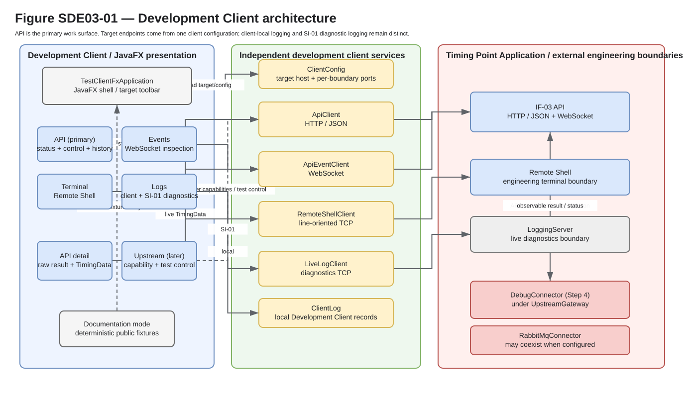
*Figure SDE03-01 — Engineering Client UI, independent client services and SI-01 engineering boundaries.*

The JavaFX event handlers remain presentation code. Network/protocol work is kept in
small independent client services so the UI does not become the owner of IF-03, shell or
logging protocol semantics.

The current principal services are:

| Service | SI-01 boundary | Role |
| --- | --- | --- |
| `ApiClient` | IF-03 HTTP/JSON | version/status queries and later supported commands/test control |
| `ApiEventClient` | IF-03 WebSocket | status/event snapshots and live event inspection |
| `RemoteShellClient` | Remote Shell | line-oriented engineering terminal |
| `LiveLogClient` | `LoggingServer` | live diagnostic records and temporary runtime log-level control |

The IF-03 HTTP and WebSocket client services share one process-wide JDK
`HttpClient` transport. Repeated UI actions may create short-lived request
objects, but they must not create a new JDK HTTP selector/worker thread group
for every operation.

The Engineering Client's own asynchronous request worker is named
`ec-request`. JDK-owned transport threads keep their native `HttpClient-*`
names; seeing one stable group is expected, while a new numbered group for
every UI action indicates accidental transport recreation.

Step 4 adds one narrowly scoped engineering capability through IF-03:
direct injection of an **already accepted semantic registration**. That control
enters the normal TimingNode registration operation after antenna/decoding/filtering.
When exercising a running SI-01 through IF-03, the Engineering Client does not
construct committed TimingData directly and does not choose the TimingNode-owned
source identity, active location or sequence.

For offline/import/export/compatibility inspection, the Engineering Client may
decode or encode TimingData through the shared TimingData API/provider boundary.
That capability does not make the client an owner of live SI-01 domain state.

Backend/upstream injection through a `DebugConnector` remains a useful later
engineering capability, but it is not required by this first registration slice.

### Current UI baseline

The current JavaFX window is 1180 x 790 pixels and contains five tabs.

#### Status

The Status tab currently provides:

- SI-01 HTTP endpoint selection;
- `Get Version` and `Get Status`;
- parsed application/build identity;
- a compact summary of the first reported TimingNode state;
- the complete raw JSON response.

The parsed values are an engineering convenience. The raw response remains visible so
interface changes and unexpected fields can be inspected without first changing the UI.

#### Events

The Events tab currently provides:

- WebSocket endpoint selection;
- explicit connect/disconnect state;
- latest event type and occurrence time;
- TimingNode list/selected node state from the event snapshot;
- retained-on-screen raw events for the current client session.

A reconnect is expected to recover a complete current snapshot according to IF-03.

#### Terminal

The Terminal tab is a small client for the project's line-oriented Remote Shell. It
contains explicit connection controls, a black monospace terminal area and a command
input field.

It is an engineering shell client, not an SSH/Telnet emulator.

#### Logs

The Logs tab connects to the separate `LoggingServer` diagnostics boundary. It shows
new log records and can query/change the temporary runtime-global logging level.

Live logs are not IF-03 application events and do not become TimingNode state merely
because they are visible in the same Engineering Client.

### Step-4 Timing UI baseline — first registration slice

#### Implementation alignment status

The Step-4 JavaFX implementation is aligned with the current D01 wireframes and
control/resynchronisation rules in this document. The implemented Timing view now:

- uses the selected TimingNode for node-addressed controls and LogBook reads;
- shows general **Last operation** feedback with the TimingNode controls;
- shows the current `DIRECT_REGISTRATION_SIMULATION` capability state next to
  the auto-reg controls;
- keeps cached values non-authoritative while disconnected, syncing or stale;
- buffers `STATUS_CHANGED` and `TIMING_DATA_COMMITTED` events received during
  resynchronisation, applies the HTTP status/LogBook baseline first, then applies
  the buffered events in delivery order before transitioning to **LIVE**;
- automatically starts resynchronisation after an `OUTCOME_UNKNOWN` result.

The three source YAML wireframes remain the Step-4 presentation/design baseline
published through the engineering portal. Pixel-for-pixel reproduction is not a
verification requirement; control availability, ownership, stale/live meaning
and resynchronisation ordering are the relevant design contract.

This documentation/UI baseline is still under project review. Review comments may
change the D01 proposal before the manual VC-ST1-003/V04 running-system check.

The **Timing** tab is the Step-4 working surface for one **selected** TimingNode.
It combines current authoritative node state, first-slice controls and committed
LogBook data without making the client an owner of domain state.

The user-facing **Sync view** action manually starts the same resynchronisation
used after reconnect. It does **not** rebuild or modify SI-01 domain data. It
reloads current status, capabilities and the bounded LogBook baseline into the
client, reconciles buffered live events and only then marks the view **LIVE**.

IF-03 already represents 1..N TimingNodes. The first Java runtime may still
compose only one node, in which case selection is implicit. The client design
must not bake that runtime limitation into its protocol model; when several
nodes are reported, the same Timing view is addressed to the selected node.

#### CLOSED without an operational location

<a id="fig-sde03-02"></a>
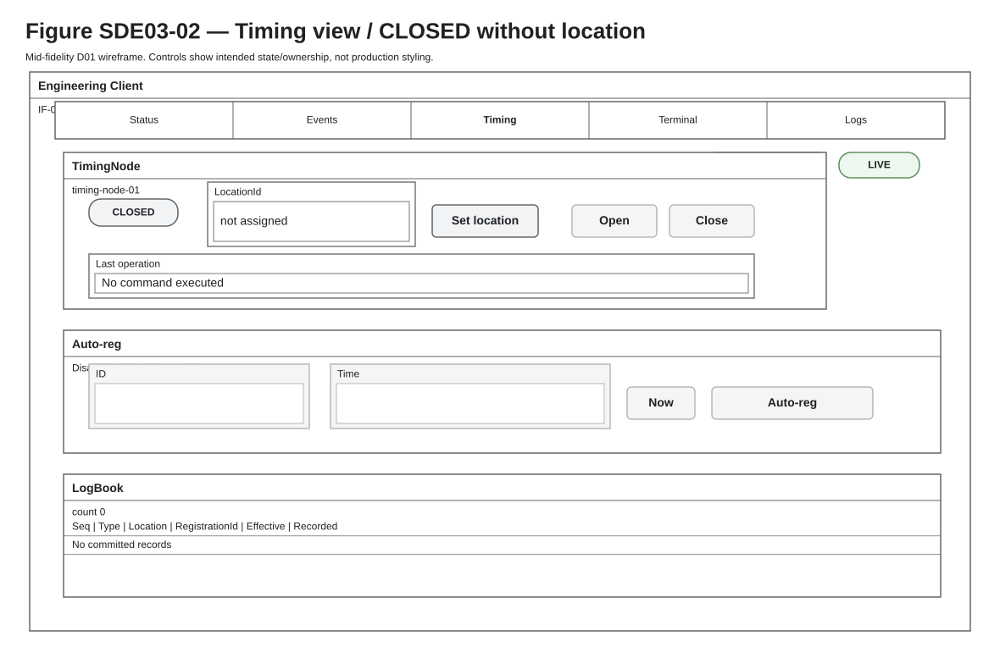
*Figure SDE03-02 — Timing view while CLOSED and no current LocationId is assigned.*

This is the initial operational state after startup/recovery. The user may enter
a valid event/profile LocationId and apply it. **Open** stays disabled until the
client has resynchronised status showing an assigned LocationId.

The auto-reg controls remain disabled while the node is CLOSED.

#### OPEN with LogBook records

<a id="fig-sde03-03"></a>
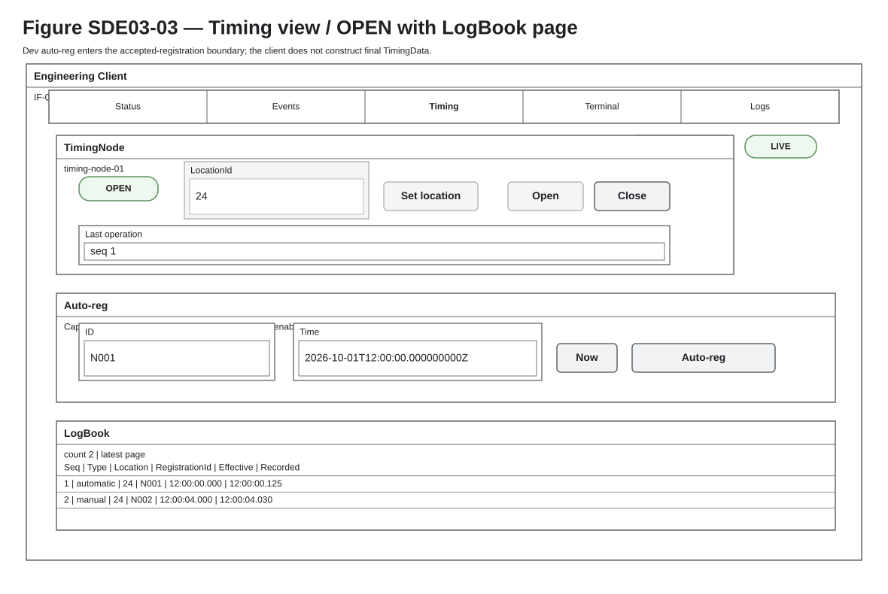
*Figure SDE03-03 — Timing view while OPEN with dev auto-reg simulation and a bounded LogBook page.*

While OPEN:

- LocationId is displayed read-only;
- changing LocationId is disabled;
- **Close** is enabled;
- dev auto-reg is enabled only when capability
  `DIRECT_REGISTRATION_SIMULATION` is both supported and enabled;
- the user supplies only `id` plus `time`;
- the optional **Now** action fills the `time` field from the client
  clock for convenience, while an explicit timestamp remains available for
  deterministic testing;
- successful commits appear in the history and through the live event stream.

The client never supplies TimingNodeId, source sequence, active LocationId or
`recordedAt` for dev auto-reg simulation.

#### SYNCING / stale state

<a id="fig-sde03-04"></a>
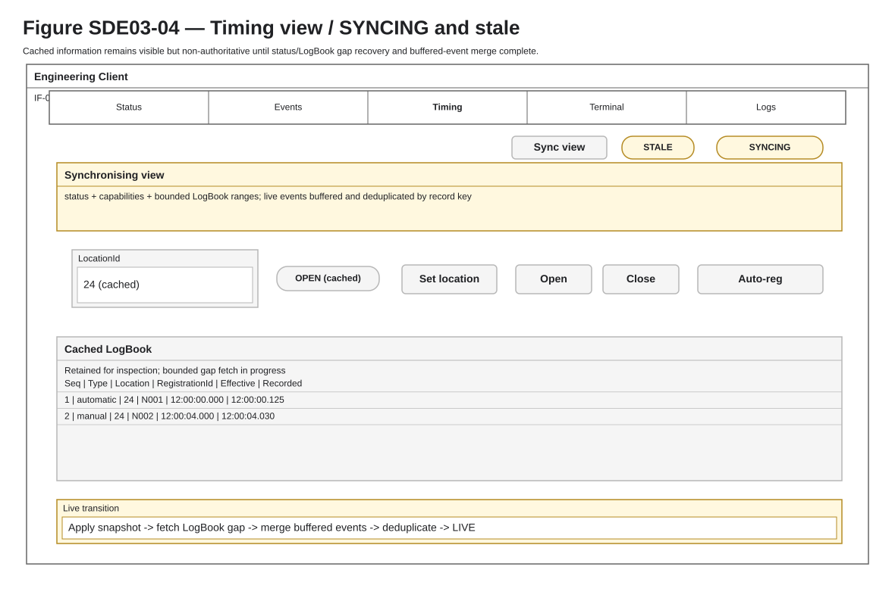
*Figure SDE03-04 — Cached Timing view while IF-03 state/LogBook gaps are being resynchronised after reconnect or **Sync view**.*

When the IF-03 live connection is lost, cached information remains visible for
diagnosis but is marked **STALE** and all state-changing controls are disabled.

Reconnect and manual **Sync view** handling follow the same D03 resynchronisation sequence:

1. connect the WebSocket and receive the complete status snapshot;
2. begin buffering later live events;
3. query LogBook metadata and fetch only the bounded ranges needed to close any gap;
4. apply buffered status changes in delivery order;
5. merge buffered TimingData events and discard records already present in
   the cached LogBook by stable TimingData record key;
6. only then transition the Timing tab to **LIVE** and re-enable controls.

A reconnect does not visually pretend that cached values are authoritative.

#### Control availability

| Client state | Set Location | Open | Close | Auto-reg |
| --- | --- | --- | --- | --- |
| disconnected / syncing / stale | disabled | disabled | disabled | disabled |
| LIVE + CLOSED + no LocationId | enabled | disabled | disabled | disabled |
| LIVE + CLOSED + LocationId assigned | enabled | enabled | disabled | disabled |
| LIVE + OPEN + simulation capability enabled | disabled | disabled | enabled | enabled |
| LIVE + OPEN + simulation capability unsupported/disabled | disabled | disabled | enabled | hidden or disabled with capability explanation |

The UI disables obviously invalid actions, but SI-01 remains authoritative.
A race or stale UI may still produce a domain conflict; the client displays the
processed result and refreshes authoritative state rather than assuming the local
button state was proof of domain acceptance.

#### Operation-result presentation

The Timing tab keeps **queue/transport execution** distinct from the **processed
domain result**:

- `UPDATED`, `OPENED`, `CLOSED` and idempotent results are shown as normal
  operation outcomes; successful dev auto-reg shows the returned `seq`;
- domain conflicts such as `NO_LOCATION`, `NODE_NOT_CLOSED` and
  `NODE_NOT_OPEN` are shown inline without treating them as application crashes;
- `BUSY` / `UNAVAILABLE` are shown as execution availability problems;
- `OUTCOME_UNKNOWN` marks the Timing view stale and triggers status/LogBook
  resynchronisation before a state-changing retry is offered;
- unexpected internal failures remain clearly distinct from expected domain
  rejections.

The **Last operation** area in the wireframe is intentionally compact. Detailed
raw response/error JSON remains available for engineering diagnosis.

#### LogBook presentation

The first table is a paged view of the selected TimingNode LogBook and shows
committed source order plus the fields most useful during Step-4 integration:

```text
sequence | variant/type | LocationId | RegistrationId | effectiveTime | recordedAt
```

The stable record key is `TimingNodeId + sequenceNumber`. Because the current
view already identifies one TimingNode, the table may omit the repeated
TimingNodeId column while retaining the complete key internally for merge and
deduplication.

Selecting a LogBook row may expose the complete public IF-05 JSON representation
in a detail/raw view. The table itself must not invent event-specific
RegistrationId or LocationId semantics beyond labels supplied by later
profile/reference-data features.

#### Documentation/demo fixtures

The three wireframes above define deterministic public synthetic states for D01
review. Later JavaFX documentation-mode screenshots should reproduce these same
states closely enough that differences are intentional UI implementation choices,
not accidental contract drift.


### Capability-driven engineering controls

The Engineering Client must not assume that dev auto-reg is
available in every SI-01 deployment. The running application advertises whether
that engineering capability is supported and enabled; otherwise the control is
disabled or absent.

For this first slice the engineering control is deliberately a **dev auto-reg** input. It is not antenna simulation and it is not an upstream
backend message. Broader DebugConnector/upstream simulation is deferred until a
later slice needs inbound backoffice behaviour such as start-time/reference-data
updates.

### Existing web-application compatibility

The accepted Step-4 IF-03/TimingData representation should still be compared with
the existing web application's current expectations for:

- status/snapshot structure;
- live event/update behaviour;
- identifiers;
- timing-data shape;
- reconnect/resynchronisation behaviour.

The purpose is not to make the legacy web application authoritative. The purpose is to
avoid gratuitous incompatibility where a clean public representation can be reused or
mapped simply. A later prototype should be able to connect the existing web application
with a thin compatibility layer where practical.

### Documentation/demo mode

UI screenshots should be reproducible evidence, not ad-hoc desktop captures.

The intended Engineering Client documentation mode uses deterministic **public synthetic
fixtures** to populate the UI without requiring a live backend, RabbitMQ broker, timing
hardware or proprietary data.

Rules:

- fixture data exists only for visual/documentation rendering and UI tests;
- fixture mode does not count as protocol or SI-01 integration verification;
- screenshots use fixed, documented window dimensions and deterministic fixture content;
- no secrets, production identities or private schemas appear in screenshots;
- generated screenshots are build/documentation output, not hand-edited source images.

This mode also gives reviewers a stable way to inspect planned UI states that are hard
to reproduce interactively, such as disconnected, degraded or multi-TimingNode views.

### CI screenshot direction

Automated JavaFX documentation screenshots remain a useful follow-up, but they
are **not a Step-4 V04 pass/fail gate**. For Step 4, the source YAML wireframes are
the maintained design evidence and V04 uses observed running-system behaviour.
A later deterministic screenshot pipeline may replace the wireframes with
implementation screenshots where that improves the engineering portal.

The target automated flow is:

```text
GitHub Actions / Linux
        |
        +-- JDK 17 + pinned JavaFX dependencies
        +-- virtual display (Xvfb when required by JavaFX toolkit)
        +-- start Engineering Client in documentation/demo mode
        +-- select a named deterministic view
        +-- render JavaFX scene/window snapshot to PNG
        +-- retain screenshot artifact
        +-- publish selected screenshots with generated documentation
```

Prefer an application-owned JavaFX snapshot hook over generic desktop mouse/keyboard
automation. The former is deterministic, knows when the scene has finished rendering and
does not depend on window-manager coordinates.

CI should initially prove one stable screenshot before multiplying the number of views.
Candidate generated views are:

1. Status / connection baseline;
2. Timing / CLOSED without LocationId;
3. Timing / OPEN with dev auto-reg and a bounded LogBook page;
4. Timing / SYNCING with stale cached data;
5. Logs/Terminal only where those screenshots materially improve user documentation.

The user manual may reference these generated screenshots once this pipeline exists.
A screenshot documents presentation; it does not replace textual requirements or
interface contracts.

### Test strategy

The Engineering Client remains independently testable:

- service/client classes are unit tested without JavaFX handlers;
- UI presentation can use deterministic fixture models;
- interface integration uses a real running SI-01 through its public interfaces;
- dev auto-reg enters SI-01 through IF-03 and the normal
  TimingNode registration operation, never through package-private/internal mutation;
- screenshot generation verifies stable rendering, not business correctness.

### Step-4 boundary

A03 implementation and the automated VC-ST1-002 black-box verification are
complete. The Engineering Client documentation/UI baseline is still under review.
After review comments are resolved, the remaining execution activity is
VC-ST1-003/V04: the manual running-system Engineering Client demo documented in
`test-client/STEP4-DEMO.md` and tracked by Java issue #127.

Step 4 uses the Engineering Client as the primary manual inspection application. It does
**not** add the optional lightweight browser/web test client.

The first Step-4 protocol documents must therefore be sufficient to support:

- the Engineering Client;
- headless black-box/system verification;
- straightforward compatibility with the existing web application where practical;
- later upstream/connector increments without changing the first committed TimingData identity semantics.


---

## Software Verification Plan (SVP)

**Source document:** [60-SVP-software-verification-plan.md](60-SVP-software-verification-plan.md)

Status: working draft / non-authoritative

This Software Verification Plan defines the initial verification strategy for the software system. It is introduced early so public interfaces, testability, fault handling and target execution can be checked as the software grows.

The SVP applies across software items unless a software-item-specific verification document later adds more detail.

### Verification objectives

Verification should provide evidence that:

- requirements and interface contracts are implemented correctly;
- software-item boundaries remain usable independently;
- domain behaviour is deterministic and unit-testable;
- application behaviour can be tested automatically through its public interface;
- real and stub/proprietary adapters conform to the same public contracts;
- backoffice semantics remain correct across stub, socket and RabbitMQ transports;
- faults and reconnect/recovery paths behave deliberately;
- local operation remains available where required during backoffice/network outages;
- multiple registration assets/sources remain isolated and correctly routed;
- SI-01 runs correctly on the intended Raspberry Pi Zero / Zero W target;
- public core/reference implementation code can be consumed by external reference and private integration projects;
- generated documentation and build artifacts are reproducible and reviewable.

### Traceability direction

The intended traceability chain follows the product-authority direction established in
the SDP:

```text
system use case / external interface obligation
             |
             v
            SSSD
             |
      +------+------+
      |             |
      v             v
system ISD        SSD requirement
      |             |
      +------> SSD architecture
                    |
                    v
               focused SDD
                    |
                    v
              implementation
                    |
                    v
          verification case + evidence
```

An ISD remains software-system-owned. A software-item requirement references the
applicable ISD obligation rather than duplicating its interface definition. An optional
IDD may describe concrete interface design but does not replace the ISD requirement source. The SVP and
verification cases are downstream coverage/evidence artifacts; they are deliberately not
normative inputs to the requirements they verify.

Verification identifiers and exact requirement-reference syntax are still to be refined.

### Verification levels

The `V*` levels describe **what scope is being verified**. Separate `ST-*` profiles below describe concrete automated system-test compositions.

#### V1 — Unit verification

Purpose: verify deterministic application/domain behaviour without external processes or real hardware.

Typical techniques:

- direct/synchronous execution instead of production thread scheduling;
- `FakeClock` rather than wall-clock waiting;
- in-memory repositories;
- fake/stub RFID, CAN, display and backoffice ports;
- deterministic state-machine and filtering tests;
- source-routing and sequence/traceability tests;
- restore/replay tests for local state.

Examples:

- first RFID observation does not automatically create a registration;
- `OPEN` / `CLOSED` transition rules;
- ready-team add/remove projection;
- registration-source sequence allocation;
- registration asset/source routing does not use hard-coded production IDs;
- penalty revocation references the original record;
- full Display V1 state is rebuilt from current ready-team state;
- Display V2 reconnect receives a complete current snapshot;
- status snapshots reflect subsystem state changes.

#### V2 — Component/module verification

Purpose: verify one concrete adapter or component against its contract while controlling the surrounding system.

Examples:

- file backup/restore adapter;
- HTTP/JSON adapter;
- WebSocket status/event stream;
- remote shell adapter;
- simple socket backoffice adapter and framing;
- CAN scanner with simulated CAN traffic;
- public stub devices;
- RabbitMQ adapter against a controlled broker fixture;
- proprietary RFID implementation in its private repository.

#### V3 — Interface verification

Purpose: verify system-level interface contracts/IDDs between software items or external systems.

Expected examples:

- local console returns the same application version/status model as other clients;
- remote shell returns the same version/status semantics;
- the current JavaFX engineering client and later Desktop GUI (SI-02) consume IF-03 across a real network boundary;
- an optional simple web test client may consume IF-03 if it becomes useful;
- backoffice semantic exchange through both socket-test and RabbitMQ adapters;
- Display V2 mDNS discovery and subsequent data/session protocol;
- CAN keypad/display interactions.

These tests should verify externally observable behaviour rather than internal class structure.

#### V4 — Integration/system verification

Purpose: verify multiple real components together with realistic process/network boundaries.

Candidate scenarios:

- SI-01 + test driver through the public application-control interface;
- SI-01 + simple socket backoffice simulator;
- SI-01 + RabbitMQ test broker with multiple configured source consumers/publishers;
- SI-01 + JavaFX engineering client over localhost;
- SI-01 + planned SI-02 GUI when that software item exists;
- SI-01 on Raspberry Pi + an external IF-03 client;
- stub RFID + real domain pipeline + local persistence;
- CAN scanner + keypad + Display V1 stub/real hardware;
- backoffice disconnect/reconnect with local outbox;
- restart/restore followed by synchronisation;
- multiple `TimingNode` objects, assets and source streams in one runtime;
- full-field simulation using synthetic identities against the same normal backoffice path.

#### V5 — Hardware-in-the-loop verification

Purpose: verify behaviour that cannot be adequately represented by normal automated test doubles.

Likely scope:

- original Raspberry Pi Zero runtime behaviour;
- RFID reader power/boot/reinitialisation;
- real RFID read/filter behaviour;
- real CAN bus/device discovery;
- Display V1 physical behaviour;
- Display V2 network discovery/session behaviour;
- power-cycle/restart recovery where practical.

Hardware tests should be separated from the fast normal pull-request path when they are slow, scarce, or environment-specific.

#### V6 — Target/runtime observations

Purpose: record enough real target behaviour to detect an actual problem rather than
assuming one in advance.

For the first Pi proof, simple observations are sufficient:

- startup time;
- memory use;
- idle and representative CPU use;
- thread count;
- basic API responsiveness.

Add more detailed measurements only when a feature or observed problem justifies them.
There are no numeric Pi resource budgets at this stage.

### Automated system-test profiles

The `ST-*` profiles provide a progressive set of reusable system-test compositions. A test case can exist at one or more profiles depending on the behaviour being verified.

#### ST-1 — Application behaviour profile


Purpose: fast automated verification of **application behaviour through the public application interface**.

Composition:

```text
System-test driver
      |
      | public application control/status interface
      v
SI-01 real application process
      |
      +-- stub RFID/CAN/display adapters
      +-- in-memory/stub backoffice adapter
      +-- test configuration
```

Characteristics:

- real SI-01 process and composition;
- no direct mutation of domain state from the test;
- test actions enter through the same public application interface intended for GUI/automation clients;
- external devices/backoffice can be deterministic stubs;
- no Docker required;
- suitable for frequent PR execution.

Typical cases:

- start application and query version/status;
- open/close a `TimingNode` through the public interface;
- inject stub RFID observations and verify registrations/status;
- add/remove ready-team values and verify display model/state;
- start procedure commands;
- verify several configured TimingNodes/sources behave independently;
- verify backup/restore and application restart at the observable interface level.

This is intended to become the **primary fast system-level regression layer**.

A manual development/test client may consume the same public interface for human
inspection, but it does not replace automated ST-1 evidence. The current A06 direction
uses a small JavaFX client for manual version/status inspection while automated tests
continue to own pass/fail verification.

##### ST-1 test specifications

Concrete ST-1 cases are specified in
`61-01-VTS-timing-application-verification-test-specification.md`.

The VTS owns each `VC-ST1-...` case purpose, setup, deterministic procedure and
expected result. The executable `system-test` module implements those cases against
the packaged SI-01 process through public interfaces only.

This SVP deliberately does not carry the current case procedure or current PASS/FAIL
state. Run identity, PASS/FAIL, process output, logs and other retained artifacts belong
to generated verification evidence.
#### ST-2 — Socket loop/network profile

Purpose: add a real process/network communication boundary for the backoffice while remaining lightweight.

Composition:

```text
Application test driver ----> SI-01 public application interface
                               |
                               +-- SocketBackofficeAdapter
                                         ^
                                         |
                                    simple TCP socket
                                         |
                               Backoffice test simulator
```

Characteristics:

- no RabbitMQ/Docker required;
- same source-aware semantic backoffice messages as other transports;
- simple public/synthetic test framing;
- one socket can multiplex several registration sources;
- suitable for reconnect/session/source-routing tests;
- still fast enough for normal automated integration testing.

Typical cases:

- several registration sources over one socket session;
- source identity preserved in both directions;
- socket loss reflected in status while local operation continues;
- reconnect and resume;
- outbound registrations observed by the simulator;
- inbound reference/control data delivered to the correct source/application path;
- full-field multi-TimingNode simulation without broker infrastructure.

#### ST-3 — RabbitMQ integration profile

Purpose: verify the production-shaped broker transport against a real RabbitMQ service.

Composition:

```text
Application test driver ----> SI-01 public application interface
                               |
                               +-- RabbitMqBackofficeAdapter
                                         |
                                         v
                                  RabbitMQ test broker
                                  (Docker Compose)
                                         ^
                                         |
                               broker-side test driver
```

Characteristics:

- disposable real RabbitMQ broker;
- synthetic/public queue/exchange/source topology;
- verifies connection/channel/consumer/publisher behaviour;
- verifies multiple source consumers on shared connection(s);
- exercises broker restart and outbox recovery;
- slower than ST-1/ST-2 and may run as integration CI.

Typical cases:

- one registration source inbound/outbound happy path;
- two or more sources sharing one broker connection;
- independent inbound consumers per source;
- source-specific outbound routing;
- broker outage while local registrations continue;
- pending outbound data retained during outage;
- reconnect restores all source consumers;
- broker restart does not alter committed registration sequence identity;
- malformed/unavailable/misconfigured broker resource handling.

#### ST-4 — Target/full-system profile

Purpose: run representative system tests on target hardware and/or with real external hardware/services.

Possible compositions include:

- SI-01 on original Raspberry Pi Zero with ST-1 application driver;
- Pi Zero + socket simulator to isolate target runtime/network behaviour;
- Pi Zero + RabbitMQ broker on another host;
- Pi Zero + real RFID/CAN/display hardware;
- engineering client and later SI-02 against the real target application.

ST-4 is generally slower/on-demand and can reuse test scenarios first proven at ST-1/ST-3.

### Raspberry Pi Zero baseline evidence

The original Raspberry Pi Zero / Zero W is an intended target for SI-01. The first representative executable should be run on real hardware using the selected runtime so target behaviour is known rather than guessed.

Useful first baseline:

```text
hardware model / RAM
OS image/version
Java runtime vendor/version
application commit/version
configuration profile
startup time
RSS after startup
RSS after representative workload
heap settings / observed heap use
thread count
idle CPU
representative workload CPU
configured TimingNode / asset / source counts
socket/RabbitMQ connection counts when enabled
RabbitMQ channel/consumer counts when enabled
version/status request latency
notes / anomalies
```

A later Java 11 evaluation must compare against the same or equivalent workload and hardware rather than only desktop benchmarks.

### RabbitMQ container integration environment

ST-3 uses a disposable real RabbitMQ broker, preferably through Docker Compose in the implementation/reference repository.

The broker fixture must use only synthetic/public test topology and credentials.

A normal test sequence should be automatable as:

```text
start RabbitMQ container
      |
      v
wait for broker health/readiness
      |
      v
start SI-01/reference application with synthetic multi-source configuration
      |
      v
exercise inbound + outbound messaging
      |
      v
stop/restart RabbitMQ
      |
      v
verify connection recovery + source consumer restoration + outbox resume
      |
      v
collect evidence and remove test environment
```

The same basic Compose definition should be usable locally and in GitHub Actions where practical.

Actual production queue names, source IDs, schemas and credentials are not public test data.

### Fault-injection verification

Failures should be verified deliberately rather than waiting for accidental occurrence.

Candidate injected conditions include:

- RFID power unavailable / boot failure / unresponsive reader;
- CAN device disappears;
- non-discoverable keypad remains silent;
- Display V1 reconnect/reset;
- Display V2 network disconnect/reconnect;
- local network loss;
- internet loss with local LAN still available;
- simple socket backoffice disconnect/reconnect;
- RabbitMQ/backoffice connection loss;
- individual registration-source consumer failure while broker remains connected;
- RabbitMQ broker restart;
- delayed or rejected reference-data update;
- file backup write failure;
- corrupt/missing restore data;
- application restart after traceable events;
- queue pressure/overload;
- GUI/client disconnect and stale status.

Stubs/test-control interfaces should inject faults through normal adapter boundaries rather than mutating domain state directly.

### CI execution classes

A likely CI split is:

```text
PR fast checks
  compile
  unit tests
  architecture/dependency checks
  ST-1 application behaviour tests
  selected fast component/interface tests

PR integration
  ST-2 socket loop/network tests
  reference-project consumer tests
  selected fault/reconnect scenarios

merge / selected PR / scheduled integration
  ST-3 RabbitMQ Docker/Compose integration tests
  high-source-count/full-field simulations

scheduled/on-demand
  long-running integration
  performance/resource regression where a suitable target exists

hardware pipeline
  ST-4 Pi Zero / RFID / CAN / display hardware-in-loop
```

The exact boundary between normal PR and merge-time ST-3 execution can be adjusted once runtime is known. Exact workflow names and triggers belong in implementation repositories and the SDE.

### Public/private verification model

The public application core must be verifiable without proprietary source or deployment identities.

Private implementations should use the same public contracts where applicable; detailed private-repository verification is added when such an implementation actually exists.

The public baseline should verify the Java-8 provider mechanism without requiring
private source. Verification should cover at least:

- built-in-provider discovery and selection;
- `SimulatedAntenna` availability with no external extension JARs;
- loading a synthetic external test provider through the same startup path intended for production extensions;
- typed conformance for TimingData, UpstreamProtocol, Antenna, CAN-protocol and display-protocol provider contracts as those contracts are implemented;
- deterministic failure for duplicate provider IDs, unknown configured provider IDs and incompatible provider configuration;
- proof that domain/application behaviour receives normal typed contracts and does not depend on extension-loader classes.

Production asset names, source IDs, broker mappings, proprietary message schemas, private provider names and credentials must not be copied into public verification fixtures.

### Generated evidence

Useful evidence may include:

- JUnit/Maven test reports;
- GitHub Actions run links;
- ST-1/ST-2/ST-3 scenario reports;
- integration logs;
- Docker/Compose service logs for integration failures;
- target/runtime measurement notes where useful;
- generated architecture/documentation review output;
- hardware-test notes or captured device logs;
- protocol/interface test reports where appropriate.

The active implementation PR should contain or link the detailed evidence for its scope. Long-term plans should only retain durable conclusions/baselines.

### Traceability status vocabulary

This is a vocabulary for future traceability tooling, not a current test-run status table.
Current execution state belongs to retained verification evidence. Requirements/cases may
eventually be summarised with states such as:

```text
not verified
verification planned
verification implemented
verified
failed / evidence not sufficient
verification impacted by change
```

The exact traceability tooling is still open. The VTS owns stable case definitions; executable tests and retained CI/PR evidence own actual execution results.

### Open verification topics

- requirement and verification-case identifier conventions;
- scenario identifier convention across ST-1/ST-4 profiles;
- whether any measured Pi behaviour warrants a numeric acceptance limit;
- standard test framework/version compatible with Java 8;
- architecture-test tooling compatible with the Java baseline;
- public test-driver API beyond the first `VC-ST1-001` HTTP/WebSocket/remote-terminal slice;
- exact simple socket framing for ST-2;
- Docker/Compose version/image-pinning conventions for ST-3;
- hardware-runner setup and how ST-4 is triggered;
- coverage expectations and whether line coverage is useful for this project;
- long-running/soak-test duration and acceptance criteria;
- timestamp precision/clock-synchronisation verification method;
- RFID filtering verification data sets;
- RabbitMQ production acknowledgement/reconciliation verification approach;
- how proprietary interface/protocol verification evidence is referenced without exposing private details in public repositories;
- release-level regression criteria.


---

## Timing Application Verification Test Specification (VTS)

**Source document:** [61-01-VTS-timing-application-verification-test-specification.md](61-01-VTS-timing-application-verification-test-specification.md)

Status: working / review baseline

Software item: **SI-01 — Timing Point Application**

### Purpose

This document specifies the concrete verification cases used to test SI-01.
It is downstream from product requirements, interface contracts and detailed
design. It does not create product behaviour.

The document roles are deliberately separate:

- `60-SVP-software-verification-plan.md` defines verification strategy, levels,
  ST profiles, environments and evidence rules;
- this VTS defines stable `VC-...` cases: purpose, setup, procedure and expected
  result;
- executable tests implement these cases in the implementation repository;
- generated/retained verification evidence records what revision was executed,
  PASS/FAIL and the produced logs/artifacts.

Current execution status is therefore **not** maintained in this document.

### Inputs and references

The cases below verify accepted behaviour from:

- `41-01-SSD-timing-application-specification-document.md`;
- applicable system-owned ISDs, especially
  `32-03-ISD-application-control-status.md`;
- `60-SVP-software-verification-plan.md` for the ST profile and evidence model.

The VTS may reference SDDs to understand test setup, but an SDD or VTS does not
become upstream product authority by being referenced here.

### Case identifier convention

Verification cases use:

```text
VC-<profile>-<number>
```

For example `VC-ST1-002` is case 002 in the ST-1 application-behaviour
profile.

Executable Java system-test classes use the same case identity in a
Java-identifier-safe form:

```text
VC-ST1-001  ->  VcSt1_001Test
VC-ST1-002  ->  VcSt1_002Test
```

The case ID is authoritative. The Java class name preserves that ID so the
mapping remains obvious in source trees and Surefire reports; descriptive
behaviour belongs in the VTS case title and test method name rather than in a
long generic class name.

### ST-1 — Application behaviour

ST-1 runs the packaged SI-01 application as a separate process and drives it
through public interfaces. The test driver must not mutate internal product Java
objects or depend on product implementation classes to obtain the pass/fail
result.

#### VC-ST1-001 — Query and resynchronise first-executable status

<a id="VC-ST1-001"></a>

**VC-ST1-001 — Query and resynchronise first-executable status**


— — —

- **Type:** Verification Case
- **Verifies:** [`IF03-REQ-003`](32-03-ISD-application-control-status.md#IF03-REQ-003), [`IF03-REQ-004`](32-03-ISD-application-control-status.md#IF03-REQ-004), [`IF03-REQ-005`](32-03-ISD-application-control-status.md#IF03-REQ-005), [`IF03-REQ-006`](32-03-ISD-application-control-status.md#IF03-REQ-006), [`SI01-REQ-001`](41-01-SSD-timing-application-specification-document.md#SI01-REQ-001), [`SI01-REQ-002`](41-01-SSD-timing-application-specification-document.md#SI01-REQ-002), [`SI01-REQ-003`](41-01-SSD-timing-application-specification-document.md#SI01-REQ-003), [`SI01-REQ-010`](41-01-SSD-timing-application-specification-document.md#SI01-REQ-010), [`SI01-REQ-020`](41-01-SSD-timing-application-specification-document.md#SI01-REQ-020), [`SI01-REQ-021`](41-01-SSD-timing-application-specification-document.md#SI01-REQ-021), [`SI01-REQ-031`](41-01-SSD-timing-application-specification-document.md#SI01-REQ-031)

---


**Executable test**

`system-test/.../VcSt1_001Test.java`

**Purpose**

Verify that the packaged application can start from external configuration,
expose its build/status state through IF-03, resynchronise a WebSocket client
after reconnect and shut down through the supported controlled path.

**Setup**

- packaged SI-01 application JAR;
- synthetic configuration with at least one TimingNode;
- loopback HTTP, WebSocket and controlled-shutdown endpoints;
- independent black-box test driver.

**Procedure**

1. Start SI-01 as a separate process with the synthetic configuration.
2. Wait for the configured IF-03 HTTP endpoint to become available.
3. Call `GET /api/v1/version` and verify the required build/version identity.
4. Call `GET /api/v1/status` and verify the configured TimingNode is present
   with its current state.
5. Connect to `/api/v1/events` and verify the first application message is a
   complete `STATUS_SNAPSHOT`.
6. Disconnect the WebSocket client.
7. Reconnect and verify a new complete `STATUS_SNAPSHOT` is received before
   later live events are relied upon.
8. Query status again and verify it is semantically consistent with the latest
   snapshot.
9. Shut SI-01 down through the supported controlled-shutdown path.

**Expected result**

- version and status are available through the running packaged application;
- connect/reconnect starts from a complete current status snapshot;
- the latest status query and reconnect snapshot describe the same current
  TimingNode state;
- the process exits cleanly without forced termination.

Adapter/component tests may cover additional event-path details that are not yet
observable through a supported black-box state-changing operation.

#### VC-ST1-002 — Control and observe first committed registration

<a id="VC-ST1-002"></a>

**VC-ST1-002 — Control and observe first committed registration**


— — —

- **Type:** Verification Case
- **Verifies:** [`IF03-REQ-011`](32-03-ISD-application-control-status.md#IF03-REQ-011), [`IF03-REQ-012`](32-03-ISD-application-control-status.md#IF03-REQ-012), [`IF03-REQ-013`](32-03-ISD-application-control-status.md#IF03-REQ-013), [`IF03-REQ-014`](32-03-ISD-application-control-status.md#IF03-REQ-014), [`IF03-REQ-015`](32-03-ISD-application-control-status.md#IF03-REQ-015), [`SI01-REQ-040`](41-01-SSD-timing-application-specification-document.md#SI01-REQ-040), [`SI01-REQ-041`](41-01-SSD-timing-application-specification-document.md#SI01-REQ-041), [`SI01-REQ-042`](41-01-SSD-timing-application-specification-document.md#SI01-REQ-042), [`SI01-REQ-043`](41-01-SSD-timing-application-specification-document.md#SI01-REQ-043), [`SI01-REQ-047`](41-01-SSD-timing-application-specification-document.md#SI01-REQ-047)

---


**Executable test**

`system-test/.../VcSt1_002Test.java`

**Purpose**

Verify the first public registration slice through a real SI-01 process:
operational LocationId/lifecycle control, capability-gated engineering
registration input, committed LogBook/history and live post-commit observation.

The second process run verifies the restart-recovery requirement
`SI01-REQ-047`. Invalid/corrupt/incomplete recovery cases from
`SI01-REQ-048` remain component-level persistence/codec verification rather
than being forced into this happy-path black-box case.

**Setup**

- packaged SI-01 application JAR;
- deterministic synthetic TimingNode configuration;
- direct registration simulation supported and enabled;
- persistent TimingData file shared by the two process runs;
- independent IF-03 black-box test driver.

**Procedure — run 1**

1. Start SI-01 and verify the TimingNode is `CLOSED` with no current LocationId.
2. Set synthetic LocationId `24` and verify the node remains `CLOSED`.
3. Request `OPEN` and verify the same LocationId remains active.
4. Attempt another location change and verify explicit `NODE_NOT_CLOSED`
   rejection.
5. Submit one node-addressed dev auto-reg request with deterministic `id` and
   observation `time`.
6. Verify the response returns sequence 1 and that the request did not supply
   source identity or active location.
7. Query LogBook metadata and verify one committed record with first/last
   sequence 1.
8. Fetch a bounded LogBook range and verify the sequence-1 record contains the
   active LocationId and supplied observation time.
9. Verify one `TIMING_DATA_COMMITTED` live event represents the same Node ID + sequence number.
10. Request `CLOSE` and verify `CLOSED`.
11. Disconnect and reconnect the WebSocket client.
12. Verify the new session starts with a current `STATUS_SNAPSHOT`, the
    committed LogBook record remains queryable and the old record is not emitted
    again as a new `TIMING_DATA_COMMITTED` event.
13. Shut the first SI-01 process down through the controlled path.

**Procedure — run 2 restart recovery**

1. Start a second SI-01 process with the same TimingData persistence file.
2. Verify the TimingNode starts `CLOSED` with no current operational LocationId.
3. Verify the LogBook still contains the original sequence-1 record with the
   same Node ID + sequence number.
4. Verify the WebSocket session starts with `STATUS_SNAPSHOT` and the recovered
   record is not emitted as a new `TIMING_DATA_COMMITTED` event.
5. Shut the second process down through the controlled path.

**Expected result**

- lifecycle rules gate registration correctly;
- SI-01, not the client, supplies the committed source/location/sequence context;
- one accepted registration becomes one committed history record and one live
  post-commit event;
- reconnect exposes current state/history without re-emitting the historical
  record as a new commit;
- the second process run rebuilds the committed record while operational state
  starts CLOSED/no-location.

#### VC-ST1-003 — Engineering Client reconnect/resynchronisation integration

<a id="VC-ST1-003"></a>

**VC-ST1-003 — Engineering Client reconnect/resynchronisation integration**


— — —

- **Type:** Verification Case
- **Verifies:** [`IF03-REQ-016`](32-03-ISD-application-control-status.md#IF03-REQ-016), [`SI01-REQ-044`](41-01-SSD-timing-application-specification-document.md#SI01-REQ-044)

---


**Purpose**

Verify through the real JavaFX Engineering Client that an external client can
resynchronise current status and bounded TimingData history after reconnect/restart,
buffer later live events during that synchronisation, merge history/live overlap
by the Node ID + sequence number and only then present the view as LIVE.

This manual case does not re-prove the server-side lifecycle, registration,
LogBook persistence or restart recovery already covered by `VC-ST1-002`.

**Setup**

- packaged SI-01 application started with the dedicated Step-4 demo
  configuration/storage;
- JavaFX Engineering Client started independently on Java 17;
- one deterministic registration `N0001` committed during the first run;
- public IF-03 plus the supported Remote Shell shutdown path only.

**Procedure**

1. Start SI-01 with empty Step-4 demo storage.
2. Connect the Engineering Client Timing view.
3. Verify the client shows a syncing/reconnecting state, keeps mutating controls
   disabled during synchronisation and becomes LIVE only after the baseline is ready.
4. Set Location ID 24, OPEN the TimingNode and commit deterministic auto-reg
   `N0001` at `2026-10-01T12:00:00Z`.
5. Verify the client shows sequence 1 in bounded LogBook/history and one matching
   live commit.
6. CLOSE, change Location ID to 25 and stop SI-01 through the supported Terminal
   control.
7. Restart SI-01 with the same demo TimingData file and reconnect the Engineering
   Client.
8. Verify the client resynchronises current status to CLOSED with no operational
   Location ID while sequence 1 / `N0001` remains in history.
9. Verify recovered history is not presented as a new live commit and that any
   history/live overlap is deduplicated by Node ID + sequence number.
10. Verify the client reaches LIVE only after the baseline plus buffered live
    events have been reconciled.
11. Shut SI-01 down cleanly.

**Expected result**

- reconnect/restart is visible as synchronisation rather than immediately LIVE;
- mutating controls remain disabled while the baseline is incomplete;
- history is resynchronised before LIVE presentation;
- buffered live events are applied after the baseline;
- duplicate history/live observations collapse to one record;
- recovered historical data is not presented as a new committed event;
- the running-system flow uses no private SI-01 state.

**Execution**

This is currently a manual verification case. The executable/checklist procedure
is maintained in the Java repository at `test-client/STEP4-DEMO.md`; run-specific
PASS/FAIL, revisions and supporting artifacts are retained with Java issue #127
rather than in this VTS.

### Evidence

A VTS case defines what must be exercised and observed; it does not say that a
particular revision has passed.

Retained evidence should identify at least:

- verification-case ID;
- tested source/build revision;
- PASS/FAIL;
- executable test report;
- captured process output where useful;
- produced persistence/log artifacts required to support the result.

The implementation repository and CI publication own those run-specific
artifacts.


---

## 70-01-SUM — Headless Timing Application

**Source document:** [70-01-SUM-headless-timing-application.md](70-01-SUM-headless-timing-application.md)

Status: working release-oriented user manual  
Software item: **SI-01 — Headless Timing Application**

### 1. Purpose, audience and applicability

This is a **technical software user manual**, not an end-user/operator manual for the
timing system.

Its intended audience is developers, integrators, testers and operations/support
engineers who need to obtain, build, configure, start, stop or diagnose SI-01. It does
not describe timing-event workflows for an operator or other product end user.

This manual records how an identified SI-01 software release is obtained, built,
configured, started and stopped. It also records the compatible development/runtime
baseline needed to reproduce that release.

The detailed development-environment documents remain authoritative for how tooling is
managed. This manual answers the technical release/user question: **which combination
belongs with this software version, and how do I run or work with it?**

A released row in the compatibility matrix is immutable historical guidance. The
current development row may change until it is promoted to a normal software release.

### 2. Compatibility matrix

| Software baseline | Java | Maven | Maven Wrapper | tool.git-project | tool.java-project | Windows / IDE status | Runtime/configuration |
| --- | --- | --- | --- | --- | --- | --- | --- |
| **v0.2.1** | Temurin 8.0.504+1 / Java SE 8 | 3.9.16 | 3.3.4 | v0.2.8 | v0.3.2 | Windows is the primary development host; NetBeans version is not pinned for this release | Short-lived executable baseline; no external application configuration required |
| **0.2.2-SNAPSHOT** — current development line, not a release | Temurin 8.0.504+1 / Java SE 8 | 3.9.16 | 3.3.4 | v0.2.8 | v0.3.2 | Windows/NetBeans A04 acceptance completed; record the verified NetBeans version before the next release | External `application.yml`; configured TimingNode; long-running process with graceful Ctrl+C/OS shutdown |

Exact immutable tooling commits are recorded in the implementation repository's
`docs/tooling-baseline.md`.

A tool or IDE version only belongs in a released compatibility row after the release
has actually been built/verified with that combination.

### 3. Obtain the software

For a released version, prefer the artifacts attached to the corresponding GitHub
release. Building from source should use the exact release tag when reproducibility is
important.

For source development:

```text
brainboxemb/2026-010-02.java.event-timing-framework
```

Normal clone/bootstrap does not require recursive submodule checkout; repository
bootstrap restores the pinned tooling.

### 4. Open and build on Windows

#### Command line

From the repository root:

```powershell
.\bootstrap.ps1
.\mvnw.cmd verify
```

Use the repository Maven Wrapper rather than a separately selected Maven installation
for the normal project build.

#### NetBeans

Open the repository root as a Maven project and select a Java 8 JDK matching the
release compatibility row.

The repository contains a committed root `nbactions.xml` for the SI-01 development
workflow. **Run Project** prepares the current reactor and starts the configured
`app/` executable with `config/application.yml`; **Debug Project** uses the same
configured application path and adds the NetBeans JPDA debugger.

The A04 Windows/NetBeans acceptance check has been completed. The exact NetBeans
version is not yet a released compatibility requirement; record the verified version
in this manual before the next software release.

### 5. Application configuration

#### v0.2.1

No external application configuration is required by the released v0.2.1 executable
baseline.

#### Current 0.2.3-SNAPSHOT development line

The current development application uses one external YAML file. The implemented slice
contains one TimingNode identity plus optional remote-terminal and HTTP listeners:

```yaml
timingNodeId: timing-node-01

presentation:
  remoteShell:
    bindAddress: 127.0.0.1
    port: 8023
  http:
    bindAddress: 127.0.0.1
    port: 8081
```

A synthetic development example is stored as:

```text
config/application.yml
```

Do not infer support for the complete future IF-11 configuration tree from this
development slice.

### 6. Start and stop

#### v0.2.1

After building the release tag:

```powershell
java -jar app\target\event-timing-app-0.2.1.jar
```

This baseline performs the short lifecycle used by that release and exits.

#### Current 0.2.2-SNAPSHOT development line

After building:

```powershell
java -jar app\target\timing-point-app-0.2.3-SNAPSHOT.jar config\application.yml
```

The configured application remains running. On a normal Windows/Linux foreground
terminal, **Ctrl+C** or the normal OS/JVM shutdown route closes the application through
its graceful lifecycle.

### 7. Build provenance

A built SI-01 artifact identifies itself without requiring a sidecar text/JSON file. The embedded
provenance includes application/version, exact Git revision, source ref, build origin and dirty-state.

Typical development output is expected to distinguish, for example:

```text
revision=c715455...
sourceRef=feature/pr-52-a04-local-console
buildOrigin=local
dirty=false
```

CI-built artifacts use a CI ref/origin instead. Wall-clock build time, CI run id and actor/user are
not embedded because they change per execution and are not required to identify the source context.

### 8. Local console

The local console is implemented on the current 0.2.2-SNAPSHOT development line. Its command set is:

```text
help
version
status
quit
exit
```

Do not list the local console as a released v0.2.1 capability. The command behaviour
and Windows/NetBeans development-host acceptance are complete on the current
0.2.2-SNAPSHOT line and can be promoted with the next accepted release.

### 9. Remote terminal

The current 0.2.2-SNAPSHOT line exposes the same text commands over a simple
line-oriented TCP connection. It uses the configured `presentation.remoteShell`
address and port.

This endpoint is not an SSH or Telnet protocol implementation. The first baseline
serves one active remote terminal session at a time; disconnecting ends only that
session and a later client may reconnect. `quit` / `exit` retain the local-console
meaning and request graceful SI-01 shutdown.

The committed example binds only to `127.0.0.1`. No authentication or encryption is
provided by this A05 development/service slice, so non-loopback exposure must be an
explicit controlled test/deployment choice.

### 10. HTTP / JSON

The A06 development line exposes the first IF-03 request/response resources on the
configured HTTP listener:

```text
GET /api/v1/version
GET /api/v1/status
```

The committed development configuration binds this listener to
`127.0.0.1:8081`. Responses are UTF-8 JSON and follow IF-03. The listener is
loopback-only in the example so remote exposure remains an explicit deployment choice.

### 11. JavaFX test client

A small desktop test client is available under `test-client/` for manual IF-03
inspection. It is engineering support rather than SI-02 and is deliberately outside
the Java-8 SI-01 Maven reactor.

Use a JDK 21 environment and run:

```powershell
.\mvnw.cmd -f test-client\pom.xml javafx:run
```

The default endpoint is `http://127.0.0.1:8081`. **Get Version** and **Get Status**
show selected parsed fields together with the raw JSON response. SI-01 itself continues
to use the Java-8 runtime/toolchain documented above.

### 12. Troubleshooting

#### Build uses the wrong Java version

Check the selected JDK against the compatibility matrix. The current software baseline
targets Java SE 8.

#### Tooling checkout does not match the software baseline

Run the repository bootstrap and compare the tooling revisions with
`docs/tooling-baseline.md` in the implementation repository/tag. Do not silently use a
newer tool release and assume it represents the original software baseline.

#### Current development configuration is rejected

Start from the synthetic `config/application.yml` in the matching source revision.
The current implementation deliberately rejects configuration fields that do not yet
have an implemented consumer.

#### NetBeans behaviour differs from command-line Maven

First verify the same revision with `.\mvnw.cmd verify`. Record the NetBeans/JDK
version used when the difference is investigated. A release compatibility claim should
only be added after that combination is verified.

### 13. Release maintenance

Before a normal SI-01 software release is accepted:

1. update this manual for the release candidate;
2. add or promote the release row in the compatibility matrix;
3. remove development-only wording that no longer applies;
4. verify the documented build/start/stop workflow against the release candidate;
5. record any required Java, Maven, tooling, IDE or configuration-format compatibility;
6. keep detailed engineering-tool policy in the SDE rather than duplicating it here.

This manual is part of the formal software-document set and should evolve with the
software release rather than as an unrelated after-the-fact note.


---
