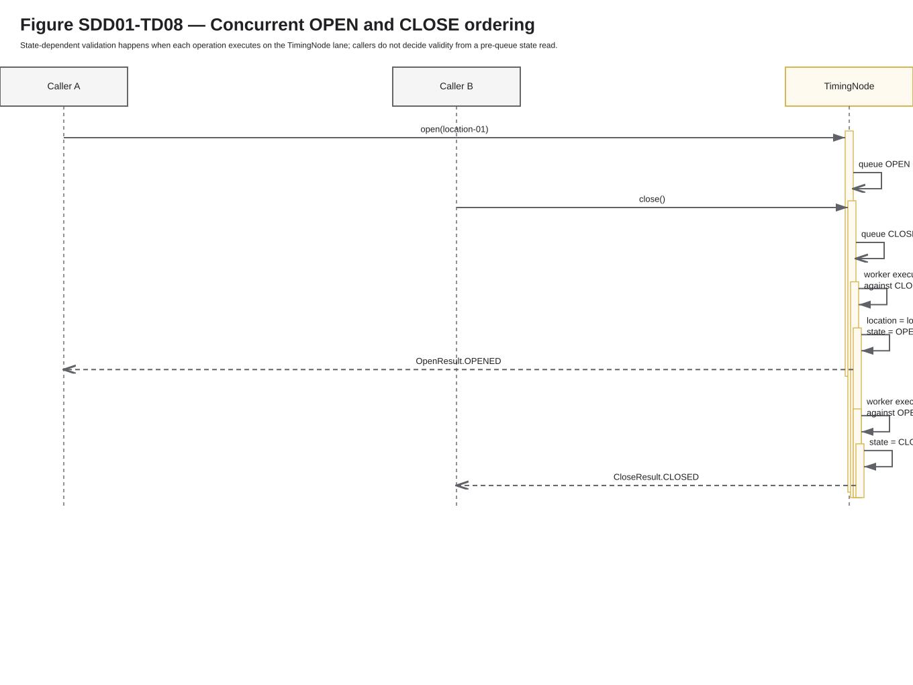

# Software engineering document set

Generated review/output book containing the current context, planning, specifications, interfaces, detailed design, verification and user guidance. The numbered source documents on the source branch remain authoritative.

## Contents

- [Domain baseline](03-domain-baseline.md)
- [Software Development Plan (SDP)](10-SDP-software-development-plan.md)
- [Software Implementation Plan (SIP)](11-SIP-software-implementation-plan.md)
- [External and Parent-System Inputs](20-EXT-external-system-inputs.md)
- [System use cases](30-UC-system-use-cases.md)
- [Software System Specification Document (SSSD)](31-SSSD-software-system-specification-document.md)
- [API Interface Specification (ISD)](32-03-ISD-application-control-status.md)
- [API HTTP/WebSocket Interface Design Description (IDD)](33-03-IDD-api-http-websocket.md)
- [Web Interface Specification (ISD)](32-04-ISD-web-interface.md)
- [TimingData Interchange Interface Specification (ISD)](32-05-ISD-timingdata-interchange.md)
- [TimingData Interchange Interface Design Description (IDD)](33-05-IDD-timingdata-interchange.md)
- [Application Configuration Interface Specification (ISD)](32-11-ISD-application-configuration.md)
- [Timing Application Specification Document (SSD)](41-01-SSD-timing-application-specification-document.md)
- [Engineering Desktop Client Specification Document (SSD)](41-02-SSD-gui-application-specification-document.md)
- [Java component, package and artifact detailed design](43-01-SDD-02-java-component-design.md)
- [Data and display detailed design](43-01-SDD-01-data-and-display-design.md)
- [Backoffice transport detailed design](43-01-SDD-03-backoffice-transport-design.md)
- [Software Development Environment (SDE)](50-SDE-01-software-development-environment.md)
- [Java Build and Test Toolchain (SDE)](50-SDE-02-java-build-test-toolchain.md)
- [Engineering Client development and UI baseline](50-SDE-03-development-client.md)
- [Runtime Characterization Environment (SDE)](50-SDE-04-runtime-characterization.md)
- [Software Verification Plan (SVP)](60-SVP-software-verification-plan.md)
- [Timing Application Verification Test Specification (VTS)](61-01-VTS-timing-application-verification-test-specification.md)
- [70-01-SUM — Headless Timing Application](70-01-SUM-headless-timing-application.md)

---

## Domain baseline

**Source document:** [03-domain-baseline.md](03-domain-baseline.md)

Status: working domain knowledge / non-authoritative requirements

This document captures stable domain facts and terminology supplied during the initial architecture work. It is intentionally separate from formal requirements: it records what the system domain looks like so later requirements, IDDs, architecture and code use the same concepts consistently.

Concrete production asset names, external registration-system IDs, source mappings and deployment inventories are intentionally **not** recorded in this public repository. They are deployment/proprietary information. Public documents describe the structure and semantics using generic identifiers only.

### TimingNodes, stages and locations

One running headless timing application must be able to host **1..N logical `TimingSystem` instances** at the same time. Each `TimingSystem` owns **1..N `TimingNode` instances**. This supports normal single-system deployment as well as simulation/test compositions that run multiple independent timing systems in one process.

The working software/domain term is `TimingNode` for one independently addressed logical timing aggregate at the **end of a stage**. A `TimingNode` is deployed or configured for a physical event `LocationId`; the software identity of the timing node and the physical location where it is used are separate concepts.

Conceptually, one timing application owns one or more independently addressed timingNodes:

```text
TimingApplication
  +-- ApplicationId
  |
  +-- 1..N TimingSystem
        +-- TimingSystemId        internal composition/simulation identity
        +-- Conductor             system-local operational coordination
        +-- SystemStatus          complete current system overview
        +-- UpstreamMessagePort   system-level upstream messages
        +-- UpstreamProtocol
        |     +-- heartbeat / ping
        |     +-- synchronisation / reconciliation
        +-- 1..N TimingNode
              +-- TimingNodeId
              +-- LocationId
              +-- lifecycle / status
              +-- UpstreamMessagePort
              +-- TagProcessor
              +-- StageStartTimes
              +-- LogBook
              |     +-- 0..N TimingData
              +-- NextUpTeams
              +-- RaceData
              +-- StageTiming
              +-- uses / produces TimingData

Shared Domain contracts:
  +-- EventData
  +-- TimingData
```

`ApplicationId`, internal `TimingSystemId`, `TimingNodeId` and `LocationId` are distinct concepts. `ApplicationId` identifies the running process/runtime. `TimingSystemId` is an internal composition/simulation identity used to distinguish multiple TimingSystem instances in one process; it is not part of the upstream functional addressing contract. `TimingNodeId` is the functional identity exposed to timing-data/upstream semantics, and `LocationId` identifies the physical event location where that node is configured or deployed.

Operational state such as `OPEN` / `CLOSED` belongs to the TimingNode software/domain concept. It is not the lifecycle of a physical registration box merely because that box is used by the timing node.

A `Stage` and a `TimingNode` are related but distinct concepts: a stage ends at a timing node. Stage-specific reference data such as start-time data may therefore be consumed by the timing node software without making the stage itself a hardware or runtime container.

The previous working name `TimingSystemInstance` was rejected as a name for an individual timing node because it mixed node semantics with runtime isolation. `TimingSystem` now has a distinct broader meaning: one logical timing-system aggregate that owns 1..N `TimingNode` instances.

### Timing-system, antenna and TimingNode identity

`ApplicationId`, `TimingSystemId`, `TimingNodeId`, `AntennaId` and `LocationId` are separate namespaces.

`TimingSystemId` identifies one logical `TimingSystem` inside a `TimingApplication` for internal composition, diagnostics and simulation isolation. The upstream system need not know that this grouping exists. `TimingNodeId` remains the functional identity of a node and scopes that node's registration sequence and synchronisation semantics. `LocationId` separately identifies the event location where the TimingNode is configured or deployed.

The I/O boundary owns antenna configuration and mapping:

```text
Antenna (0..N)
  +-- AntennaId
  +-- driver / device configuration

each Antenna
        -> 1..N TimingNodeId
```

An `Antenna` is the configured registration input. Reader/protocol/device
details belong to the concrete antenna implementation/configuration and are not
separate software identities unless implementation evidence later requires that
distinction. `SimulatedAntenna` is the built-in baseline implementation and is
always available for development/simulation. Other concrete antenna
implementations may be selected through the application extension/provider
mechanism without changing `AntennaId` or TimingNode semantics.

One antenna may intentionally feed more than one TimingNode. Each target
TimingNode keeps its own `TimingNodeId`, sequence and state; `AntennaId`
remains source/diagnostic context.

Known structural rules:

- `TimingNodeId` identifies the logical TimingNode;
- `AntennaId` identifies a configured antenna within the application;
- the application may compose 0..N antennas; configuration maps each `AntennaId` to its TimingNode targets;
- every TimingNode owns its own monotonic registration sequence and
  TimingNode-specific persistence/synchronisation state;
- multiple TimingNodes may share a physical antenna through explicit routing;
- concrete production antenna/device settings remain deployment information.

#### Antenna identifiers

The software needs a stable configuration identity for every antenna.

Public examples use simple synthetic names:

```text
ANT1
ANT2
ANT3
```

A future physical label may use the same `AntennaId`. Production antenna names
and device settings remain deployment data and should not be copied into this
public repository.

### Separate software, I/O and configuration views

The logical I/O layer is repeated as part of each `TimingSystem` runtime
composition. A process hosting 1..N TimingSystems therefore normally composes
1..N corresponding I/O sets (Storage, Devices, Messaging and DeviceNetworks).
A lower-level implementation may multiplex a shared physical resource when that
is explicitly designed, but that does not merge the TimingSystem ownership
contexts.


Do not express the complete system as one parent/child tree. The software/domain
decomposition and I/O/configuration routing answer different questions.

#### Software/domain view

```text
TimingApplication
  +-- ApplicationId
  |
  +-- 1..N TimingSystem
        +-- TimingSystemId        internal composition/simulation identity
        +-- Conductor             system-local operational coordination
        +-- SystemStatus          complete current system overview
        +-- UpstreamMessagePort   system-level upstream messages
        +-- UpstreamProtocol
        |     +-- heartbeat / ping
        |     +-- synchronisation / reconciliation
        +-- 1..N TimingNode
              +-- TimingNodeId
              +-- LocationId
              +-- lifecycle / status
              +-- UpstreamMessagePort
              +-- TagProcessor
              +-- StageStartTimes
              +-- LogBook
              |     +-- 0..N TimingData
              +-- NextUpTeams
              +-- RaceData
              +-- StageTiming
              +-- uses / produces TimingData

Shared Domain contract:
  +-- TimingData
```

The exact component/class boundaries remain design work. `TimingSystem` is the parent domain aggregate hosted 1..N times by the `TimingApplication`. Its `Conductor` is the first system-level coordinator: it owns the lifecycle of that system's 1..N `TimingNode` aggregates and derives one shared inventory demand from their states. It calls the associated `AntennaManager` directly to enable or disable inventory. TagObservation routing remains a separate Runtime connection; individual antenna controls are not implied.

Each `TimingSystem` contains its own dedicated Domain `SystemStatus` component, system-level
`UpstreamMessagePort`, `UpstreamProtocol` context and heartbeat/ping semantics. `SystemStatus` is the
complete current operational overview of that TimingSystem, not a single health
flag. It may include its TimingNode states, antenna/device availability, whether
a display is connected, keypad/beeper availability, device-network health,
storage state, upstream connectivity and synchronisation state. Concrete I/O
implementations report semantic status into this overview without becoming part
of the Domain model. Those semantics remain isolated per simulated/hosted system
rather than being application-global.

`PlatformEnvironment` is composed by Runtime and supplies the raw absolute wall
clock plus a monotonic elapsed-time source. Runtime may derive a shared timing
`TimeSource` from that wall clock and supply the same instance to Domain and I/O
components that must use one timing basis. The `TimeSource` type is not owned by
`TimingSystem` or `TimingNode`; its sharing scope is a composition decision.
A future TimingSystem composition can therefore give one corrected TimeSource to
all of its TimingNodes and timestamp-producing device/provider components without
creating another platform clock. Simulation can provide controlled equivalents
when deterministic time behaviour is required.

Each TimingNode contains one passive `LogBook`. The LogBook keeps the node's
committed timing history as 0..N immutable `TimingData` values. The same
semantic value that is persisted is also what runtime consumers read from the
LogBook; the current design does not add a second logbook-specific data type.

The system-owned IF-05 interface defines the common TimingData semantics and
the default/reference interchange profile. SI-01 consumes the common `TimingData`
interfaces while a configured provider supplies the concrete immutable classes,
stateless factory and matching codec. Storage, Web and upstream communication may
consume the common API without becoming alternative owners of IF-05 semantics.

A TimingNode is the active serialization boundary for its mutable per-node
state. Its contained `LogBook`, `NextUpTeams`, `StageStartTimes` and
`EventData` objects remain passive state holders. Concrete queue/thread choices
belong to detailed design.

`UpstreamProtocol` is a Domain protocol owned in the context of one
`TimingSystem`. It covers transfer of TimingData plus
synchronization/reconciliation and protocol-level handling such as ping/pong.
System-level semantic operations enter/leave through
`TimingSystem.UpstreamMessagePort`; node-level operations use the addressed
`TimingNode.UpstreamMessagePort`. The upstream peer can remain functionally
TimingNode-oriented; a ping does not require exposing `TimingSystemId`.
Transport/session mechanics remain I/O concerns.

#### I/O routing view

```text
Antenna (0..N)
  +-- each Antenna -> 1..N TimingNode

BackofficeConnector (0..N)
  +-- bindings <-> 1..N TimingNode
```

The same routing model supports real and simulated I/O without changing the
TimingNode domain model.

### Location and record context

Each physical event location has a unique numeric identifier:

```text
LocationId = configured physical event-location identity
```

A `TimingNode` is configured/deployed at a location, while its software identity remains separate from that location identity.

A `TimingData` value is associated with the functional timing-node identity and physical location:

```text
TimingNodeId
LocationId
```

The containing `TimingSystem` is local runtime/composition context and is not required to be serialized into TimingData.

This lets a logical timing node preserve one ordered stream while records still state where the registration occurred. Moving or reconfiguring a producing system must not silently redefine either namespace.

### Registration sequence

Every timing node registration stream has a monotonically increasing sequence number scoped by **`TimingNodeId`** in the TimingData/upstream contract.

Conceptually:

```text
TimingData key = (TimingNodeId, SequenceNumber)
```

The `LocationId` and `AntennaId` may provide useful context, but neither changes the sequence scope. When one process hosts multiple TimingSystems, local storage/composition keeps their runtime contexts separated without changing the functional TimingData key.

Generic example:

```text
timing-node-01:  1041, 1042, 1043, 1044, ...
timing-node-02:   551,  552,  553, ...
```

This allows receiving/upstream systems to reason about stream consistency independently for every source. For example, receiving `1041`, `1042`, `1044` from one source makes a missing `1043` detectable.

Important intended properties:

- committed sequence numbering starts at **1** for a new `TimingNodeId` stream;
- sequence number **0 is reserved** and shall never identify a normal committed TimingData value;
- the number is monotonic per `TimingNodeId`-scoped stream;
- a committed number must not be reused after restart/recovery;
- higher-level synchronisation can use it for ordering and gap/consistency detection;
- moving/changing location must not implicitly reset the timing node sequence;
- multiple `TimingNode` streams in one application keep independent sequence streams;
- the exact rules for allowed gaps, wraparound and sequence persistence still need formal requirements.

### Per-source persistence

Each `TimingNodeId`-scoped timing node registration stream has its **own registration file**.

The active application model may remain in memory, but registration persistence/recovery must preserve the timing node boundary so one `TimingNodeId`-scoped stream and its sequence state can be recovered and synchronised independently.

Conceptually:

```text
TimingNodeId timing-node-01
  in-memory ledger/state
  TimingNode-specific sequence
  TimingNode-specific registration file

TimingNodeId timing-node-02
  in-memory ledger/state
  TimingNode-specific sequence
  TimingNode-specific registration file
```

The exact file names, external IDs and deployment mappings are configuration/private data. The file format, append/snapshot policy, atomicity and durability rules still need detailed design and formal requirements.

### TimingData values

A `TimingData` value represents a committed fact in one `TimingNodeId`-scoped
ordered stream. The common envelope carries source identity, sequence, location
and time. Type-specific semantics are represented by the concrete TimingData
variant rather than by nullable fields in one universal in-memory record.

The currently promoted/required v1 fact is participant registration. UC-002
explicitly leaves OPEN/CLOSE-as-TimingData as a later interface/protocol
decision, and the current use-case baseline does not yet promote registration
revocation. Those may become TimingData variants later when a use case or
requirement actually owns them.

A working minimal envelope is therefore conceptually:

```text
TimingData
  timingNodeId
  locationId
  sequenceNumber
  effective time
  recorded time
  semantic variant data
```

Asset and antenna context may additionally be retained where useful for
diagnostics/audit, but the exact storage/wire schema is not yet fixed.

#### Participant registration semantics

The public TimingData model distinguishes **automatic** and **manual**
registrations as typed semantic variants. Both use the same common TimingData
envelope and sequence/key rules.

Three IDs have different meanings:

- `TagId` is the RFID/tag source identity;
- `TeamId` is the team/reference-data identity used by manual/domain input;
- `RegistrationId` is the canonical registration identity stored in committed
  TimingData.

Source identities are resolved before TimingData construction. Event-specific
source/reference relationships belong to `EventData`, a Domain capability
alongside `TimingData`.

```text
TagObservation
  TagId + RSSI + observed time
          |
          v
     TagProcessor
          |
          +--> EventData: TagId -> RegistrationId
          |
          v
registration passage keyed by RegistrationId
  - duplicate suppression
  - strongest-RSSI selection
  - quiet/max-duration timeout
  - per-TagId observation attribution
          |
          v
RegistrationId + selected observed time
          |
          v
TimingData
```

One registration may be associated with 1..N TagIds. `EventData` owns that
relationship and provides the reverse resolution needed by automatic timing:
`TagId -> RegistrationId`.

The antenna/provider boundary owns physical decoding/decryption, but the decoded
identity exposed to generic processing is the semantic `TagId`; provider-specific
bytes, framing and encryption are not part of EventData.

A manual registration starts from `TeamId` and may use EventData/reference data
to resolve the same canonical `RegistrationId` concept.

`RegistrationId` is not the TimingData record key. Record identity/order remains
`(TimingNodeId, SequenceNumber)`.

For manual registrations the semantic model may additionally record whether the
effective time was assigned by SI-01 or explicitly entered by the operator.
Automatic registration uses the accepted observed time by definition. A concrete
wire/profile representation may encode these facts with discriminators or compact
codes; those representation details do not require a universal Java record with
nullable fields.

### Time semantics

Recorded **event time** needs one unambiguous absolute-time meaning independent of how a local clock is displayed. Race/stage start reference data is different: an external definition may contain only a local time-of-day and no date.

The working dedicated absolute-event value name is `TimingTimestamp`. At domain boundaries it represents an absolute point on the time line rather than a local date/time with an implicit time zone. A time-only race/start definition remains a separate value and is resolved using the configured event/race time zone when an absolute registration is compared with it.

For a time-only start definition, SI-01 chooses the most recent valid occurrence of that local clock time that is not after the registration timestamp. This supports the normal midnight rollover without requiring the external definition to invent a date. Example: `23:59:50` start and `00:00:10` registration yields 20 seconds elapsed. If a start date is supplied, it is authoritative. Durations of 24 hours or more cannot be inferred uniquely from a time-only start and therefore require additional date/day context.

A timestamp is **not** the source-ordering mechanism. Registration timing node sequence numbers remain the stable ordering/consistency mechanism even if an operating-system wall clock is corrected forwards or backwards.

The SI-01 SAD owns the implementation architecture for `TimingTimestamp`, injectable clock/time sources, monotonic duration measurement and the risk created by wall-clock corrections.

### EventData and registration identity

`EventData` is the event-specific reference-data capability alongside
`TimingData`.

The two concepts have deliberately different roles:

```text
EventData
  = source/reference relationships for the event
  = TagId / TeamId / RegistrationId relationships
  = input-side identity resolution

TimingData
  = committed timing facts
  = canonical RegistrationId after source resolution
```

`RegistrationId` is the canonical registration identity stored on committed
TimingData. It remains separate from the source identities used to reach it and
from the TimingData record key `(TimingNodeId, SequenceNumber)`.

For RFID input, EventData supports at least:

```text
RegistrationId R-123
  <- TagId TAG-A
  <- TagId TAG-B
```

and therefore the processing lookup:

```text
TAG-A -> R-123
TAG-B -> R-123
```

The exact event-data source may be deterministic, loaded reference data or an
event-specific provider/import. That choice does not change TagProcessor
semantics.

#### Default/reference identity convention

The public default/reference EventData profile uses a deterministic identity
convention rather than a large normal-participant lookup table.

For a four-digit positive number `NNNN` (`0001` through `9999`):

```text
normal physical tags
  TT-A-NNNN-1
  TT-A-NNNN-2
        |
        +--> RT-A-NNNN --> TeamId NNNN

reserve physical tags
  TT-R-NNNN-1
  TT-R-NNNN-2
        |
        +--> RT-R-NNNN --> TeamId lookup
```

The trailing tag index identifies the physical member of one two-tag set; it is
not part of the logical RegistrationId. Therefore both `-1` and `-2` resolve
to the same registration.

For the default/reference profile:

- `TT-X-NNNN-1` and `TT-X-NNNN-2` resolve to `RT-X-NNNN` for `X=A` and `X=R`;
- `RT-A-NNNN` resolves directly to `TeamId NNNN`;
- `RT-R-NNNN` requires reserve-assignment reference data to resolve a TeamId;
- `0000` is invalid in both normal and reserve identifiers.

This convention belongs to the selected EventData profile. The generic
TimingData `RegistrationId` remains opaque and other EventData providers may
define different identifier semantics.

A live reserve assignment is mutable event/race state rather than part of the
physical tag identity. RaceData may therefore provide a current
`RT-R-NNNN <-> TeamId` override/lookup while EventData continues to own the
stable identifier convention.

#### Registration passage processing

TagProcessor resolves each decoded TagObservation to `RegistrationId` before
registration-level duplicate suppression and passage aggregation.

The passage key is `RegistrationId`, not `TagId`. This means observations
from multiple physical tags belonging to the same registration contribute to one
logical passage and one strongest-RSSI decision.

Within a pending passage, TagProcessor retains enough attribution to distinguish
the contributing TagIds. Conceptually:

```text
RegistrationId R-123
  TAG-A
    observation count
    strongest RSSI
    first/last observation
  TAG-B
    observation count
    strongest RSSI
    first/last observation

  selected observation
    TagId
    RSSI
    observed time
```

The accepted automatic registration still contains the canonical
`RegistrationId` and accepted observed time. Per-tag passage information is
diagnostic/engineering state; it is not a second TimingData record model and
need not be permanently persisted.

Duplicate suppression after successful TimingNode admission is also keyed by
`RegistrationId`. Therefore an accepted R-123 suppresses subsequent observations
from every TagId that EventData resolves to R-123 during the duplicate window.
Independent duplicate windows per physical tag are not required.

#### Engineering observability

TagProcessor shall make its processing behaviour inspectable through a read-only
diagnostic view suitable for engineering presentation. That view may expose,
for pending/recent passage state:

- RegistrationId;
- contributing TagIds;
- observation count per TagId;
- strongest RSSI per TagId and for the whole passage;
- selected TagId and selected observation time;
- first/last observation timing where useful;
- processing outcome such as pending, accepted or duplicate-suppressed where
  that state is retained.

This view explains processing decisions without becoming authoritative timing
state. TimingData/LogBook remains authoritative for committed registrations.

### Event reference data

`EventData` is a shared Domain contract parallel to `TimingData`. SI-01 and engineering tools consume the same common EventData API while an event-specific provider supplies the concrete profile.

A RegistrationId may have 1..N TagIds in the EventData profile. Event-specific Java implementations may be loaded at runtime through the typed provider/extension mechanism, analogous to TimingData providers.

`RaceData` remains TimingNode-local runtime/upstream data and may supplement or override profile relationships where live event state requires that.


EventData owns the stable event-profile relationship and identifier
translation rules. RaceData may contain live TimingNode-local additions or
overrides received from upstream, such as the current assignment of a reserve
RegistrationId to a TeamId. Resolution therefore has an explicit precedence
rule: live RaceData override where present, otherwise the selected EventData
profile.

Stage-start-time semantics remain separately owned by `StageStartTimes` unless
a later design deliberately folds them into EventData.

### Start-time reference data

Start times are supplied/synchronised from the backoffice and retained locally.

A start-time definition shall support at least a local time-of-day without a date. A source may additionally provide an explicit date/race-day context; SI-01 may retain that richer information. A date is therefore optional in the semantic input, not a prerequisite for elapsed-time calculation.

They support local calculations such as elapsed time and ranking without requiring every calculation to make a live backoffice request. When only time-of-day is known, elapsed-time calculation uses the midnight-rollover rule defined in the time model above.

### Full-field simulation

A single SI-01 application must be capable of running enough configured `TimingNode` objects to represent the complete field behaviour required for backoffice integration testing.

For this use case:

- each configured `TimingNode` remains separately addressable by its `TimingNodeId`;
- each configured producer uses its configured timing node identity/identities according to the deployment mapping;
- each `TimingNodeId` retains its configured logical identity and independent sequence stream;
- antennas/devices may be stubbed or simulated through the normal adapter contracts;
- registrations still follow the same normal queue, source-sequence, persistence and backoffice paths as production data;
- simulation must not require a special bypass around the application/domain model;
- public test scenarios use generic identities, while a private integration configuration may map to the actual production inventory/protocol IDs.

The Raspberry Pi Zero target and desktop/integration-test hosts may show different runtime behaviour. Measure that difference when representative software exists; do not invent target resource limits in the domain model.

### Public/private domain-data boundary

This repository can document structural facts and generic ranges required for reusable implementation design, but it must not become an inventory of the live/real deployment.

Keep the following outside the public repository unless deliberately approved for publication:

- concrete antenna/device IDs and their real mappings;
- exact production source-to-node assignments;
- exact production antenna/device topology;
- proprietary protocol field values;
- encryption keys or secrets.

Public examples should use names such as `timing-node-01`, `ANT1`, and `connector-01`.

### Traceability implications

The combination of timing node identity and monotonically increasing sequence is a domain-level consistency mechanism, not merely an implementation convenience.

Later requirements/design must therefore preserve at least:

```text
timing node identity
sequence order
registration-asset context where useful
containing total-system context
location association
antenna context where relevant
record type/payload
effective event time plus recordedAt metadata
TimingNode-specific persistence/recovery without sequence reuse
synchronisation/gap detection
```

Corrections/revocations remain traceable rather than silently rewriting earlier
records. The first public record/file model is now defined by IF-05; later record
families extend that contract only when their domain requirements are promoted.

### Open domain questions

- Can a `TimingNode` change `LocationId` during one operational session, or is location fixed until the timing node is closed/reconfigured?
- How are multiple TimingNodes represented in registration-routing rules when they share a physical producer?
- Sequence numbering starts at 1; 0 is reserved.
- Are sequence-number gaps allowed after failed/aborted persistence, provided numbers are never reused?
- What happens if the numeric sequence reaches its maximum representation?
- Which operational events besides `OPEN` must be part of a timing node registration stream (for example close/reinitialisation/configuration changes)?
- What exact data must an `OPEN` registration entry contain?
- Which TimingNode-specific synchronisation rules, if any, are required once the node identity is known?
- Which source-specific behaviours, if any, require public operational requirements rather than provider-private handling?


---

## Software Development Plan (SDP)

**Source document:** [10-SDP-software-development-plan.md](10-SDP-software-development-plan.md)

Status: working draft / non-authoritative


This document records the **current development direction**. It should stay short and
should distinguish decisions from things that still need discussion or evidence.

The SIP owns the implementation steps. The SDE owns the development/release environment.
The SVP owns verification strategy and profiles. Concrete SI-01 verification cases are
specified in the VTS; execution results belong to retained verification evidence.

### Current direction

The project currently centres on the **Timing Point Application** (SI-01):

- Java application with one or more `TimingNode` instances;
- external configuration;
- console, remote shell and a programmable API;
- timing/domain behaviour added incrementally;
- hardware and backoffice adapters added when their contracts become concrete;
- Windows as the convenient development host;
- Raspberry Pi Zero / Zero W as a target to run and verify on real hardware.

Normal operator interaction is provided through the SI-01-owned **IF-04 Web
Interface**.

The **Engineering Desktop Client (SI-02)** is the project's reusable desktop
application for development, integration, commissioning, diagnostics and system testing.
It uses supported public SI-01 interfaces such as IF-03 and has its own desktop
runtime/workbench, packaging and verification baseline.

### Development approach

#### Keep the next step concrete

Prefer a small runnable increment over a large future design. Each SIP step should say
why it exists, what it needs and what can be demonstrated when it is done.

#### Add architecture when it solves a real problem

Keep the important domain/application/I/O/presentation boundaries clear, but do not add
layers, services or product clients only because they might become useful later.

#### Measure before optimising

The Raspberry Pi target should be tested with representative software. We currently do
**not** assume that one Java timing application is too heavy for it.

CPU, memory, startup time and thread count are useful measurements. They become design
constraints only if measurements show a problem.

#### Keep interfaces independently testable

Console, shell, API and later GUI behaviour should use the same application
semantics where appropriate.

Engineering clients may use a different runtime or technology from SI-01. They should
still use public interfaces rather than internal SI-01 classes.

#### Automate repeatable work

Builds, tests, generated documentation and releases should be repeatable. Detailed Git,
CI and release rules live in the SDE/repository guidance rather than here.

### Broad phases

These are direction markers, not a fixed schedule.

#### A — Architecture and application-core baseline

Establish the useful domain/application boundaries and a buildable Java application core.

#### B — First useful Timing Point Application

Grow SI-01 on the development host: configuration, lifecycle, API, logging and
basic black-box testing.

#### C — Raspberry Pi target proof

Run the representative application on the Pi Zero/Zero W and learn what, if anything,
the target requires in deployment or runtime design.

#### D — Engineering Desktop Client

Develop SI-02 as a maintainable desktop workbench for API inspection, diagnostics,
simulation, commissioning and system testing. Normal operator use remains the IF-04 Web path.

#### E — Timing/domain behaviour

Implement registrations, StageStartTimes, NextUpTeams, RaceData, StageTiming and the
persistence/recovery needed by those capabilities.

#### F — Device and backoffice integration

Add representative RFID/CAN/display and backoffice behaviour as their interfaces become
concrete.

### Resources

Known or expected resources are modest:

- normal Windows development workstation;
- original Raspberry Pi Zero / Zero W when target work starts;
- representative RFID/CAN/display hardware when those integrations are implemented;
- a broker/backoffice test environment when backoffice integration starts.

A dedicated integration host is an option only if a real need appears.

### Open points

These should remain questions until we have a reason to decide them:

- target-platform choice, including Raspberry Pi availability and OTS versus custom hardware;
- whether local e-ink display, RTC and CAN belong on the target platform;
- exact Raspberry Pi/target OS, image and update approach;
- exact Java runtime on the Pi target;
- whether target measurements reveal any meaningful CPU/RAM/thread limitations;
- final technology/workbench and packaging baseline for the Engineering Desktop Client;
- whether any additional lightweight API test client is useful beyond the Engineering
  Client and the normal IF-04 Web interface;
- exact persistence format/strategy as domain state grows;
- exact device and backoffice transports where not already fixed by external systems;
- whether a separate integration host is worthwhile;
- whether there is ever a reason to move the SI-01 Java baseline beyond Java 8.

### Main risks

Only risks that can materially change the direction belong here.

| Risk / unknown | Current response |
| --- | --- |
| Target hardware availability or lifecycle blocks the preferred platform. | Keep software development hardware-independent; study Pi-class alternatives and OTS/custom options before procurement. |
| Pi/target deployment/runtime differs materially from development-host behaviour. | Run the representative application on selected real hardware and measure before changing architecture. |
| Timing/order/threading mistakes affect results. | Keep state changes controlled and verify timing/ordering behaviour deterministically. |
| Hardware behaviour differs from simulations. | Keep adapters replaceable and verify against representative hardware when available. |
| Backoffice details leak into application/domain APIs. | Keep application semantics separate from transport/proprietary mappings. |
| Part-time cadence loses context. | Keep steps small, demonstrable and documented at their actual decision points. |

### When to update this plan

Change the SDP when the **development direction** changes: target, major software item,
broad phase or project-level risk.

Ordinary task progress belongs in the SIP, issues and pull requests.

Document structure, numbering and reusable templates are defined in
`12-GPD-documentation-guide.md`.


---

## Software Implementation Plan (SIP)

**Source document:** [11-SIP-software-implementation-plan.md](11-SIP-software-implementation-plan.md)

Status: working draft / non-authoritative


### Purpose

This document explains **how the software is expected to grow from the current application core
into a usable timing system**. The roadmap is intended for two audiences:

- a software engineer should be able to understand why the next increment exists, its
  boundaries, dependencies and exit criteria;
- a project reviewer/manager should be able to see what value or uncertainty the step
  addresses, which resources can block it, and what can be demonstrated afterwards.

The SIP is the content source of truth for roadmap step content and activity identity.
Each activity ID/title shown on a detailed step card is declared in the matching SIP step.
The per-step YAML owns only current activity state, dependencies, estimates and compact
card notes. Detailed activity history, CI logs and release mechanics live in issues, pull
requests, SDE and generated evidence.

### Terms and abbreviations

- **SIP** — Software Implementation Plan
- **D..** — documentation/design activity
- **A..** — application activity
- **V..** — verification activity
- **T..** — tooling activity


### Relationship to other documents

The SDP defines the project-wide development strategy and document conventions. The SIP
uses accepted product/design baselines plus the current implementation state to plan the
implementation sequence. It does not define product requirements or interface semantics.
SDE documents define the engineering environment; SVP/VTS define verification strategy
and cases; issues, pull requests and generated evidence record execution of the plan.

### How to read a step

Each step uses the same small structure, but the text should carry useful information
rather than merely fill headings:

- **Purpose** explains why the step is in this position and which value/risk it addresses.
- **Goal** states the capability to add.
- **Scope** says what work belongs in the step.
- **Not in this step** is used where a boundary prevents accidental scope growth.
- **Needs** names real dependencies or resources that can gate the work.
- **Activities** assigns stable activity IDs/titles used by the detailed SIP card. The
  matching YAML may add status/dependencies/notes but may not rename or invent activities.
- **Result** is the short manager-facing outcome shown on the roadmap.
- **Demo** is the practical end demonstration.
- **Done** is the engineering exit criterion.

Activity IDs are **local to one SIP step**. The prefixes are used consistently on
the SIP detail cards:

- `T..` — tooling / engineering-environment activity;
- `D..` — documentation or design/decision activity;
- `A..` — application/product implementation or integration activity;
- `V..` — verification activity.

For example, Step 3 `V03` and Step 4 `V03` are different activities. A suffix such
as `D02W` may preserve an inserted follow-up without renumbering already referenced
step-local activities.

The roadmap estimates are focused project days. Each step may show its original estimate,
git-derived actual effort and current remaining estimate. These are independent planning
signals: original minus actual does not have to equal remaining. Future phase ends are
shown as concrete Monday boundaries for readability; the underlying cumulative forecast
is calculated before that display rounding. Forecast dates are planning aids, not
commitments.


### Why the roadmap is ordered this way

The roadmap deliberately adds one new source of uncertainty at a time.

1. **Steps 1-3 establish the engineering and application shell.** Later work can then be
   tested through a real running application instead of through isolated classes only.
2. **Steps 4-5 establish local registration behaviour without external systems or real
   timing hardware.** Step 4 proves the durable registration boundary. Step 5 moves the
   input boundary outward to a simulated antenna and measures the runtime behaviour that
   this introduces.
3. **Steps 6-7 expand engineering and external integration around that local core.**
   Step 6 matures the independent Engineering Desktop Client that exercises the public
   API; normal field/operator use remains the IF-04 Web path. Backoffice integration then
   adds reference data, source synchronisation, multi-node operation and derived timing.
4. **Steps 8-10 move the proven software onto the target and replace simulated devices with
   real ones.** Platform, deployment and device problems are kept separate where possible.
5. **Step 11 combines the proven pieces in a representative field setup.**

A step should not claim behaviour that depends on a later step. In particular, simulated
input is not the same as a complete simulated event: backoffice-supplied reference data,
multi-node field simulation and real device integration have their own later steps.

---

### Step 1 — Architecture baseline

Status: completed

#### Purpose

Create enough shared language and ownership before implementation starts. The objective
was not to finish the whole architecture, but to stop the first code changes from
silently deciding domain boundaries, software-item ownership and interface direction.

#### Goal

Define the first architecture baseline for the timing software.

#### Scope

- domain and TimingNode baseline;
- Timing Point Application boundary;
- initial interface catalogue;
- Java/Maven and verification direction.

#### Needs

- project/domain knowledge;
- architecture/document tooling.

#### Result

- First software architecture baseline.
- TimingNode and application ownership are clear.
- Implementation can start deliberately.

#### Demo

- Walk through the architecture diagrams.
- Explain TimingNode and application ownership.
- Show where the first executable fits.

#### Done

- architecture documents build and are reviewable;
- application-core implementation can start without inventing basic ownership;
- unresolved subjects remain explicit rather than being presented as decisions.

---

### Step 2 — Application core repository skeleton

Status: completed

#### Purpose

Move from architecture into executable software. A real repository, build and runnable
application provide the foundation on which every later domain, interface and device
increment can be verified.

#### Goal

Create the Java repository and prove that it builds and runs independently.

#### Scope

- Maven reactor with reusable application core and runnable application;
- Java baseline;
- build/version identity and logging baseline;
- unit tests and Linux/Windows CI;
- minimal application lifecycle.

#### Needs

- development workstation;
- GitHub CI.

#### Activities

| ID | Activity |
| --- | --- |
| `T01` | Java toolchain baseline |
| `T02` | Create tool.java-project |
| `T03` | Maven Wrapper fixture |
| `T04` | Pin Java 8 + Maven baseline |
| `T05` | Linux canonical CI |
| `T06` | Windows compatibility CI |
| `T07` | Canonical artifact + provenance |
| `T08` | Version reusable workflow |
| `A01` | Create SI-01 implementation repository |
| `A02` | Repository baseline files |
| `A03` | Maven reactor / artifact skeleton |
| `A04` | Package / responsibility boundaries |
| `A05` | Minimal runnable app lifecycle |
| `V01` | Generic fixture - Linux verify |
| `V02` | Generic fixture - Windows verify |
| `V03` | Canonical artifact smoke |
| `V04` | Clean-checkout consumer proof |
| `V05` | Architecture/dependency checks |
| `V06` | 0.1.0 release build / identity proof |

#### Result

- Application-core and runnable application artifacts.
- Clean Linux and Windows build/test.
- Traceable build identity and lifecycle.

#### Demo

- Build from a clean checkout.
- Produce both artifacts.
- Start, identify and stop the application.

#### Done

- clean bootstrap/build works;
- Linux and Windows verification are green;
- release `v0.1.0` is the accepted Step-2 baseline.

---

### Step 3 — Application and API foundation

Status: completed

#### Purpose

Turn the application core into a useful long-running application before adding timing-domain
complexity. This step establishes the application boundary that later simulation, GUI,
backoffice and hardware work can all use without reaching into SI-01 internals.

#### Goal

Build the first useful **Timing Point Application** (SI-01) on the development host.

#### Scope

- external application configuration with at least one TimingNode;
- shared command/query behaviour;
- local console and remote shell;
- API over HTTP/JSON and WebSocket;
- consistent version/status semantics;
- runtime file logging;
- black-box/application testing;
- JavaFX engineering client for manual API integration testing.

#### Not in this step

- real timing/domain behaviour beyond the minimum needed for the application shell;
- production timing hardware;
- major Engineering Desktop Client workbench restructuring beyond the initial JavaFX integration tool.

#### Needs

- Windows development workstation;
- built SI-01 artifacts;
- no Raspberry Pi or timing hardware.

#### Activities

| ID | Activity |
| --- | --- |
| `A01` | Shared application boundary + build identity |
| `A02` | Application configuration + minimal TimingNode |
| `A03` | Run until shutdown + graceful stop |
| `A04` | Local console |
| `A05` | Remote terminal / shell adapter |
| `A06` | API HTTP / JSON |
| `A07` | API WebSocket events |
| `A08` | Runtime logging + live diagnostics |
| `V01` | Shared behaviour + configuration unit tests |
| `V02` | Adapter equivalence checks |
| `V03` | ST-1 application behaviour black-box test |
| `V04` | Windows development-host execution proof |
| `V05` | Step-3 0.2.x release / identity proof |

#### Result

- SI-01 runs from external configuration.
- Public interfaces share application semantics.
- Black-box testing is repeatable.

#### Demo

- Start SI-01 from configuration.
- Inspect version/status through public interfaces.
- Inspect IF-03 with the JavaFX test client.

#### Done

- configuration drives application composition;
- initial presentation interfaces use shared application behaviour;
- ST-1 exercises the running application through public interfaces;
- runtime logging and Windows artifact execution are repeatable;
- the step closes on the next accepted `0.2.x` release.

---

### Step 4 — First registration-system slice

Status: completed

#### Purpose

Add the first real timing-domain behaviour only after the application/API shell is stable.
The main risk in this step is not RFID or backoffice integration; it is whether one
TimingNode can own lifecycle, identity, ordering and durable registration history without
those concerns leaking into clients or adapters.

Keeping the input deliberately simple makes that boundary testable before more sources of
failure are introduced.

#### Goal

Operate one TimingNode through a controlled registration flow using the public
application boundary.

#### Scope

- open a closed TimingNode with the requested `LocationId` as one ordered operation;
- close the TimingNode with explicit lifecycle rules;
- submit an already-accepted registration through an engineering input;
- let the TimingNode assign its own identity, location, sequence and recorded time;
- create immutable TimingData through the shared TimingData contract;
- append committed TimingData to local storage and rebuild the LogBook after restart;
- expose control, bounded history and live updates through IF-03;
- exercise the same public behaviour through the Development Client;
- verify the running application as a separate process.

#### Not in this step

- antenna observations, RFID decoding or filtering;
- TagId-to-registration resolution;
- StageStartTimes, StageTiming or ranking;
- multi-TimingNode operation;
- backoffice transport or reference-data synchronisation;
- production timing devices;
- the later Engineering Desktop Client workbench restructuring.

#### Needs

- the Step-3 application/API foundation;
- a deterministic engineering registration input;
- the reference TimingData codec/store;
- the Development Client as test tooling.

#### Activities

| ID | Activity |
| --- | --- |
| `D01` | Development Client architecture + UI baseline |
| `D02` | Review first-registration operational use cases |
| `D02W` | Translate private compatibility behaviour |
| `D03` | Establish first TimingData + public control contracts |
| `V01` | Define deterministic first-slice examples |
| `A01` | TimingNode location and lifecycle |
| `A02` | Direct registration + TimingData |
| `A03` | Development Client first-slice control |
| `V02` | First-slice domain verification |
| `V03` | Automated first-registration black-box verification |
| `V04` | Development Client running-system demo |

#### Result

- One TimingNode owns a durable, ordered registration stream.
- The same registration behaviour is available through the public API and Development Client.
- Restart rebuilds local registration history without inventing new records.

#### Demo

- Open the TimingNode with a LocationId and submit one accepted registration.
- Observe the committed record in history and as a live update.
- Close, restart and confirm that the committed history is recovered.

#### Done

- lifecycle and registration ownership rules have deterministic automated coverage;
- a registration cannot bypass TimingNode-owned identity, location, sequence or lifecycle;
- storage/recovery rebuilds the LogBook correctly;
- IF-03 exposes the required control, history and live update behaviour;
- a separate-process black-box test succeeds through IF-03;
- the Development Client can repeat the same flow without using private application state.

---

### Step 5 — Simulated antenna input and runtime behaviour

Status: completed

#### Purpose

Move the test input one boundary closer to the real system without adding physical RFID
hardware yet.

Step 4 starts after tag interpretation: its IF-03 development auto-reg operation injects
an already-accepted automatic registration directly at the semantic registration
boundary. It deliberately does **not** simulate AntennaManager, an antenna or
TagProcessor.

Step 5 starts at the antenna side. A built-in `SimulatedAntenna` can therefore exercise
tag observation, filtering/resolution and registration admission through the same software
path that a later real antenna adapter must use. A simulated-tag/profile layer can drive
that antenna with repeatable multi-observation passages without introducing another
direct TimingNode registration shortcut.

This is also the first useful point to measure queueing, allocation and sustained-input
behaviour. Those measurements should guide implementation choices before target-hardware
constraints and device drivers make failures harder to isolate.

#### Goal

Process repeatable simulated antenna input through one TimingNode using normal runtime,
domain and persistence paths.

#### Scope

- built-in `SimulatedAntenna` through the normal Antenna lifecycle/observation interface;
- deterministic synthetic tag observations carrying TagId, RSSI and accepted observation time;
- explicit separation between direct accepted-registration injection, antenna-level
  observation simulation and higher-level simulated-tag/profile scenarios;
- deterministic simulated-tag profiles that can use one or multiple EventData TagIds for
  one RegistrationId and emit realistic observation sequences through SimulatedAntenna;
- Development Client batch simulation by registration count, numeric range, ascending or
  seedable pseudo-random selection and interval between registration starts;
- `AntennaManager` lifecycle support for probe/hello-version, initialization,
  per-antenna inventory start/stop and normal shutdown, with optional power control;
- TagProcessor observation-burst aggregation, strongest-RSSI selection and duplicate suppression before registration admission;
- an injected TagId-to-RegistrationId mapper with a deterministic public transformation
  fixture; RaceData lookup is used only by concrete profiles that require it;
- define and implement TimingNode OPEN/CLOSE as committed TimingData in the same
  TimingNode-owned source stream as registrations;
- promote registration revoke/delete from reserved representation to supported
  TimingData/API behaviour, appending REV without rewriting the original registration;
- add normal manual-registration ADD through IF-03 with client-supplied effective time
  and explicit AUTO/MAN client time-selection classification;
- align the Development Client registration view with hundredth-second input/display and
  current-open-location versus All projection;
- the same TimingNode commit, TimingData, LogBook and persistence path proven in Step 4;
- runtime counters/markers needed to understand queue wait, processing and persistence;
- sustained/bursty input tests and basic allocation/GC observations;
- restart/recovery while using the simulated input path;
- prove the typed provider/bootstrap mechanism with built-in and synthetic external providers.

#### Not in this step

- production RFID hardware or proprietary reader protocols;
- backoffice delivery of RaceData or StageStartTimes;
- StageTiming, ranking or other results that need backoffice reference data;
- multi-TimingNode/full-field simulation;
- RabbitMQ or another production backoffice transport;
- product GUI work.

#### Needs

- the Step-4 registration boundary;
- deterministic synthetic tag-observation and registration-mapping fixtures;
- controllable simulated input;
- no target hardware and no private provider implementation.

#### Activities

| ID | Activity |
| --- | --- |
| `D01` | Runtime execution and measurement plan |
| `D02` | Define OPEN/CLOSE TimingData semantics and reference mapping |
| `D03` | Define registration revoke semantics and public contract |
| `D04` | Review simulated antenna/input architecture |
| `D05` | Define internal runtime-observability architecture |
| `D06` | Link SSD architecture Needs to detailed SDD design |
| `D07` | Clarify Presentation external ports in architecture diagram |
| `D08` | Define manual-registration API and timestamp precision |
| `D09` | Define simulation layers, simulated tags and profile control |
| `T01` | Runtime-characterization harness and evidence tooling |
| `A01` | Qualify/implement simulated antenna and tag-processing path |
| `A02` | Qualify/implement runtime markers and counters |
| `V01` | Single-node baseline load/burst characterization |
| `A03` | Measurement-driven allocation/data-access decision |
| `V02` | Sustained tag-observation load and stalled-downstream fairness/backpressure |
| `A04` | Commit OPEN/CLOSE through the normal TimingData path |
| `A05` | Commit registration revoke through the normal TimingData path |
| `A06` | Implement manual-registration API, precision policy and Development Client controls |
| `A07` | Implement simulated-tag profiles and Development Client batch simulation |
| `V03` | Restart and recovery with simulated input |
| `V04` | Provider bootstrap verification |
| `V05` | OPEN/CLOSE TimingData ordering, persistence and rejection verification |
| `V06` | Registration revoke/API/persistence verification (client UI evidence in Step 6 V01) |
| `V07` | Manual registration, timestamp precision and Development Client projection verification |
| `V08` | Simulated-tag profile and batch-driver verification |

#### D04 — Antenna input architecture decision

D04 fixes the boundary used by A01:

- an antenna emits immutable `TagObservation(TagId, RSSI, TimingTimestamp)` facts;
- antenna observations use the existing local `Event<T>/EventSource<T>` primitive;
- `AntennaManager` owns multi-antenna lifecycle, one-shot hello/version probing,
  initialize, per-antenna inventory state, shutdown/recovery and optional external
  power-control orchestration;
- `TagProcessor` owns observation-burst aggregation, strongest-RSSI selection, duplicate suppression and bounded
  TimingNode submission;
- shared `EventData` owns the stable event-profile TagId -> RegistrationId
  relationship; TagProcessor resolves observations through EventData before
  registration-keyed filtering. Alternate/private EventData providers may supply
  event-specific mapping semantics behind the same shared EventData contract;
- duplicate suppression uses monotonic elapsed time while the observation timestamp
  remains the registration effective time;
- `SimulatedAntenna` implements the same lifecycle and observation event boundary as a
  real provider.

The Java A01 implementation is aligned with this decision. It includes the
AntennaManager lifecycle/control boundary, application-owned subscription,
EventData-based TagId resolution, TagProcessor lifecycle, bounded shared-I/O
control, and the normal SimulatedAntenna -> AntennaManager -> TagProcessor ->
TimingNode -> TimingData/persistence/LogBook path. Normal Windows development
startup now composes one explicitly logged simulated antenna so this path is also
exercised by the normal executable. The remaining full IF-11 antenna
routing/deployment configuration is a separate configuration-completion track and
does not reopen the D04 runtime decision.

#### D01 — Runtime execution and measurement plan

D01 is the planning/decision gate for Step 5 runtime characterization. It defines the
**measurement work breakdown**: what must be learned, what engineering software is needed,
which product-design questions must be resolved before instrumentation is accepted, how
the measurements are executed, and where the resulting activities sit in the roadmap.

It does not itself choose final Java class names or an optimization.

##### Questions the characterization must answer

For one TimingNode on a development host, determine:

- where time is spent from accepted simulated input through bounded admission, queue wait,
  ordered processing, persistence/commit and relevant post-commit delivery;
- whether queue/resource use stays bounded and required work keeps making forward progress
  under ordinary, sustained and bursty input;
- how growing committed history affects the bounded query shapes exercised in this step;
- whether allocation/heap/GC or thread scheduling is material enough to justify changing
  the simple implementation;
- which findings should later be repeated on the selected target during Step 9.

Development-host results are the Step-5 engineering evidence. They are not product
limits and do not count as target-hardware evidence. Target execution, target JVM/runtime
configuration and target-specific tuning are deliberately owned by Step 9 after the
platform decision in Step 8. Multi-TimingNode scheduling remains outside Step 5.

##### Measurement architecture split

Use three deliberately different boundaries:

```text
product runtime
  minimal pull-based internal observability only
        |
        v
runtime-characterization harness
  deterministic workload + evidence collection
        |
        v
SVP/VTS characterization method/cases
  repeatability + comparison rules

separately:
system-test
  packaged process + supported public interfaces only
  black-box product verification
```

Do **not** add IF-03 metrics or simulation controls merely to support engineering
measurement. The formal `system-test` boundary remains black-box and continues to import
no product classes.

The dedicated engineering harness may depend on `timing-point-core` and compose the
reviewed simulated-input path directly. Its environment/tooling is defined in
`50-SDE-04-runtime-characterization.md`.

##### Product architecture decisions required before accepting A01/A02

D04 reviews the antenna/input design before A01 is accepted. It must decide the stable
observation boundary needed by both simulation and later real adapters, ownership of tag
interpretation/filtering/resolution, callback/threading expectations and which pieces are
test/reference fixtures rather than Domain concepts.

D05 defines the internal runtime-observability design before A02 is accepted. It must keep
engineering metrics out of TimingData and public interface semantics, decide where queue,
persistence and JVM observations live, and expose only a narrow pull-based diagnostic view
needed by the harness.

Java PR #230 (simulated-input classes) and PR #231 (runtime instrumentation) already exist
on main because implementation advanced before these review gates were made explicit.
They are therefore **prototypes/input to D04/D05 review**, not authority that those design
choices are accepted.

##### Engineering software

T01 creates the project-local runtime-characterization harness described by SDE-04:

- optional engineering Maven profile/module, not a product artifact;
- same pinned Java/Maven baseline as SI-01;
- deterministic simulated input/reference fixtures;
- real file-backed persistence for representative baseline runs;
- workload parameters for steady, burst and growing-history cases;
- on-demand JDK management observations (`ThreadMXBean`, memory and GC beans) where
  supported;
- machine-readable retained run summaries tied to source/build/environment identity.

External profilers/JFR/JMC-style tooling may investigate a specific result but are not
required baseline software until their tool/version/procedure is separately qualified.

##### Roadmap order

The runtime-characterization path is:

```text
D01 measurement plan
  |
  +--> D04 simulated-input architecture
  |      -> A01 qualify/implement input path
  |
  +--> D05 runtime-observability architecture
  |      -> A02 qualify/implement instrumentation
  |
  +--> T01 characterization harness/evidence tooling
           |
           +---------------------+
                                 v
                         V01 baseline measurement
                                 |
                                 v
                         A03 evidence-based decision
                                 |
                                 v
                         V02 fairness/backpressure
```

V01 is the development-host baseline and therefore precedes A03. It does not wait for
Raspberry Pi or other target hardware. A03 records whether direct traversal/ordinary
allocation and the existing execution model remain adequate, or which specific change has
evidence behind it. If A03 changes the design, rerun the affected V01 workload before
treating the decision as qualified.

V02 then covers sustained-ingress fairness and slow/stalled downstream delivery on the
development-host baseline. Existing Java issue #131 belongs to that backpressure work; it
is not implemented ahead of V01/A03 evidence unless the bounded-resource contract itself
already requires a correction. Representative V01/V02 cases are repeated later on the
selected target in Step 9; those target runs do not block Step-5 design decisions.

D02/A04/V05 (OPEN/CLOSE TimingData), D03/A05/V06 (registration revoke), D06
(SSD-to-SDD Needs traceability, meta issue #564) and D07 (Presentation interface-port
clarity, meta issue #567 / tool.eng-docs issue #100) are parallel Step-5 tracks and do
not need to wait for every runtime-characterization result, but their implementations
still require their own preceding contract/design decisions where applicable.

##### D01 exit

D01 is complete when the measurement questions, D04/D05 design gates, SDE-04 engineering
environment, T01 harness activity, development-host V01 evidence flow and A03-after-V01
dependency are reviewed as the Step-5 plan. Target-hardware repetitions are a Step-9
bring-up concern and are not part of D01/Step-5 closure. Completion of Java
instrumentation by itself is not D01 closure.

#### D06 — Architecture-to-detailed-design traceability

D06 is tracked by meta issue #564. It adds an explicit Sphinx-Needs relationship from
SSD `arch` objects to the corresponding detailed SDD design where such elaboration
exists. The relationship must be visible in the engineering Object Explorer with an
inverse link, use schema-validated source/target types and avoid replacing the existing
`satisfies` requirement relation or duplicating ordinary Markdown link lists.

#### D07 — Presentation external-port clarity

D07 is complete through meta issue #567 / PR #572 using the reusable component-port
notation released in `tool.eng-docs v0.10.0` from issue #100. Figure SI01-01 now
distinguishes the external interface of each in-process Presentation adapter from its
ordinary internal Application connection:

- API shows separate external `HTTP` and `WebSocket` ports;
- RemoteShell shows one external `TCP shell` port;
- Console shows one local-console interface port;
- Web, like API, shows separate external `HTTP` and `WebSocket` interface ports;
- SharedTerminalHandler and PresentationGateway have no external port;
- adapter-to-SharedTerminalHandler/PresentationGateway connections remain normal
  in-process relationships.

This prevents PresentationGateway from being mistaken for an external socket-facing
service merely because its name contains `Gateway`.

#### D08 — Manual registration and timestamp precision

D08 completes the registration-side presentation contract exposed by Development Client
review. IF-03 remains the general programmable SI-01 interface for remote clients,
engineering tools and headless black-box/integration tests. The dedicated Web interface
is a separate Presentation adapter; Web and API may invoke the same
PresentationGateway/TimingNodeProxy application operations without routing Web through
the API adapter.

Normal manual registration is therefore an IF-03 operation, not a development
simulation. For `MAN_REG` ADD the client supplies the effective registration time in
both cases: `AUTO` means the client selected/captured that time automatically and
`MAN` means the operator entered or edited it manually. SI-01 does not replace an
AUTO-classified client time with server current time.

The generic TimingTimestamp/codec contract keeps its existing precision range. The
reference producer narrows only timestamps SI-01 creates itself: newly created
`NODE_INFO` lifecycle effective time uses centisecond resolution and newly assigned
`recTime` uses millisecond resolution. Registration effective time remains timing
information supplied by its originating path; REV repeats the original time unchanged.

#### D09 — Simulation depth and tag profiles

Step 5 uses three distinct engineering input depths:

```text
direct dev auto-reg
  -> accepted automatic-registration boundary
  -> TimingNode

SimulatedAntenna observation
  -> AntennaManager
  -> TagProcessor
  -> TimingNode

simulated tag/profile
  -> timed TagObservation sequence
  -> SimulatedAntenna
  -> AntennaManager
  -> TagProcessor
  -> TimingNode
```

The first path is intentionally shallow and remains useful for focused IF-03,
TimingNode and TimingData tests. The second and third paths are the Step-5 antenna-side
simulation. A simulated tag/profile must publish observations through
`SimulatedAntenna`; it must not call TagProcessor or TimingNode directly.

Profiles reuse EventData relationships. When EventData maps two TagIds to the same
RegistrationId, a profile may emit observations from both tags and therefore exercise
passage aggregation, strongest-RSSI selection and registration-keyed duplicate
suppression. The first reusable profile set is:

- `simple` — minimal deterministic passage;
- `normal` — representative clean passage and, where available, two tags for one
  registration;
- `edge` — deterministic variants including very short/long passage shapes and one-tag
  versus two-tag registrations.

The profile owns relative observation timing/RSSI/tag-use inside one passage. A narrow
engineering control starts one profile passage for one resolved RegistrationId. The
Development Client owns batch orchestration above that control: count, numeric
RegistrationId range, ascending or seedable pseudo-random selection and interval between
passage starts. The batch interval is not an observation interval; it separates complete
registration scenarios.

#### A03 — Measurement-driven runtime decision

A03 uses the retained V01 development-host evidence rather than target-hardware results.

The three steady 20 registrations/s repetitions and the 1,000/9,999-record history
repetitions admitted and committed all measured registrations without queue-full. The
bounded latest-100 LogBook query remained about 0.96-1.16 ms from 120 through 10,119
total records and no GC collection occurred in the measured intervals. The deliberately
unpaced 100-observation burst instead reached the configured TimingNode queue high-water
of 32 and reproducibly admitted/committed 33 while rejecting 67 with explicit queue-full.

That evidence does not justify another runtime mechanism. Step 5 therefore keeps:

- ordinary allocation/new rather than object pooling;
- direct bounded LogBook traversal rather than copied snapshots/caches/indexes for the
  current query shape;
- the current serial execution model and ordinary JVM scheduling rather than role-specific
  thread-priority tuning;
- the existing bounded queue/admission behaviour, including visible overload rejection.

Heap growth with retained history remains something to observe on the selected target, but
does not by itself justify a Step-5 cache/pool redesign. Target-specific JVM/thread/stack
tuning belongs to Step 9.

V02 is complete through Java issue #334 / PR #335. The verification connected real
TimingNode committed-event production to a permanently buffered outbound transport,
confirmed the existing bounded-delivery policy disconnects that client at the configured
send bound, and then proved later registration commits and LogBook progress continue.
No extra application payload queue, batching, role-priority change or additional worker
was needed.

#### Result

Step 5 closes on SI-01, black-box and development-host evidence. GUI-specific
revoke/recovery behaviour is verified as part of Step 6 V01 using SI-02.

- Simulated antenna observations reach the normal registration path.
- Successful TimingNode OPEN/CLOSE transitions are represented in the normal committed
  TimingData source stream according to the Step-5 IF-05/IDD update.
- Registration revoke appends REV through the same committed source stream and leaves the
  original ADD history intact.
- Normal manual-registration ADD is available through IF-03 with client-supplied
  AUTO/MAN time-selection semantics while dev auto-reg remains simulation-only.
- Simulated-tag profiles drive the normal antenna path rather than direct registration.
- Sustained input can be measured without bypassing TimingNode ownership.
- Restart/recovery works with the same simulated input path used by automated tests.

#### Demo

- Open one TimingNode and show the committed OPEN TimingData record.
- Feed repeatable tag observations through `SimulatedAntenna` and show which observations
  become committed registrations.
- Add manual registrations using both client-selected current time and operator-entered
  time and show their MAN_REG AUTO/MAN classification.
- Run a short simulated-tag batch and show one representative two-tag passage reaching
  one automatic registration through SimulatedAntenna and TagProcessor.
- Revoke one registration through IF-03 and show durable ADD plus REV source
  history. The DELETED interpretation in SI-02 is verified
  separately in Step 6 V01.
- Close the TimingNode and show the CLOSE record in the same source sequence.
- Inspect the runtime counters, restart SI-01 and continue using the same simulated input
  configuration without sequence reuse.

#### Done

- simulated antenna input uses the same public adapter/domain boundary intended for real antennas;
- accepted observations reach the existing durable registration path without a test-only domain bypass;
- successful OPEN/CLOSE transitions commit according to the Step-5 IF-05/IDD semantics
  without a second lifecycle record owner;
- rejected lifecycle requests do not create unintended TimingData records, and idempotent
  behaviour follows the explicit D02 decision;
- revoke never rewrites/removes committed ADD records and follows the explicit D03
  rejection/idempotence rules through API, LogBook, live event and recovery paths;
- normal manual ADD preserves client-supplied effective time and AUTO/MAN selection
  semantics through API, TimingNode commit, LogBook and recovery;
- newly produced NODE_INFO time and recTime follow the D08 centisecond/millisecond
  producer policy without globally truncating registration effective timing;
- simulated-tag profiles exercise SimulatedAntenna, AntennaManager and TagProcessor rather
  than bypassing them, including the EventData multi-tag mapping case;
- Development Client batch generation is repeatable for ascending and seeded random
  selection and keeps passage-internal observation behaviour profile-owned;
- sustained/bursty input has repeatable measurements and does not starve required TimingNode work;
- recovery preserves lifecycle/registration records and sequence continuity;
- provider loading is verified with public built-in/synthetic implementations;
- Step-5 SSD architecture objects that have substantive SDD elaboration expose that
  detailed-design relationship in the Needs engineering graph;
- Figure SI01-01 distinguishes external Presentation ports from internal adapter-to-
  Application relationships, without giving PresentationGateway an external port.

---

### Step 6 — Engineering Desktop Client

Status: active

#### Purpose

Turn the existing Development Client into a maintainable Engineering Desktop Client
after SI-01 has stable state and registration behaviour worth inspecting.

This step does **not** introduce a second operator-facing desktop product. Normal
field/operator interaction is the browser-facing IF-04 Web Interface. The desktop client
serves development, integration, commissioning and diagnosis through supported public
boundaries such as IF-03.

The engineering risk here is different from Step 5: keep a richer desktop workbench,
protocol inspection and negative-path tooling maintainable without letting JavaFX event
handlers or docking infrastructure become owners of client/application behaviour.

#### Goal

Evolve the existing JavaFX Development Client into the project's full Engineering
Desktop Client while preserving its public-interface-only boundary to SI-01.

#### Scope

- select the Engineering Client GUI/runtime/workbench and packaging baseline;
- retain the existing public IF-03 HTTP/JSON + WebSocket client behaviour where it
  remains suitable;
- separate connection/synchronisation/command behaviour from JavaFX controls so GUI,
  later scripting and tests can use the same client/application services;
- keep explicit NOT SYNCED / SYNCING / LIVE / STALE behaviour;
- retain application/version, TimingNode status, Registrations, technical LogBook and
  raw-message inspection;
- retain engineering-only surfaces such as Device Log, Client Log, Remote Shell and
  capability-gated simulation;
- use an application-owned workbench composition so views do not depend directly on the
  selected docking framework;
- keep the architecture compatible with later named multi-system automation and embedded
  scripting without making scripting an implementation requirement for this step;
- define a reproducible desktop build/run/package path;
- continue using only supported public SI-01 boundaries for live operation.

#### Not in this step

- a separate restricted/safe desktop operator product;
- replacing the IF-04 Web operator interface;
- moving SI-01 timing/domain ownership into the client;
- implementing the future Lua scripting capability;
- making GUI layout or docking state part of the IF-03 contract.

#### Needs

- stable IF-03 behaviour from Steps 3-5;
- representative running SI-01 test data;
- Experiment 008 JavaFX/BentoFX workbench evidence;
- Step-5 SI-01/server revoke and persistence behaviour available as the system baseline;
- VC-ST1-003 real-running-client GUI verification assigned to Step-6 V01.

Step-6 V01 uses the Engineering Desktop Client itself for the complete GUI
revoke/recovery scenario; headless tests do not substitute for that evidence.

#### Activities

| ID | Activity |
| --- | --- |
| `D01` | Establish first SI-02 Engineering Client requirement slice |
| `D02` | Select Engineering Client desktop stack, client boundary and packaging |
| `A01` | Restructure the existing Engineering Client around the selected workbench/services |
| `V01` | Verify Engineering Client connection, sync/reconnect and representative workbench behaviour |

#### D01 — SI-02 Engineering Client requirement baseline

D01 establishes the first technology-independent SI-02 requirements in 41-02-SSD.
The slice covers public-interface-only operation, target selection, explicit
connection/synchronisation state, connected identity, TimingNode status, stale state,
baseline/history rebuild, committed registration presentation and explicit command
outcomes. These requirements trace to UC-009 and IF-03.

#### D02 — Engineering Client technology and packaging decision

D02 is complete. The selected Engineering Client baseline is:

- **Java 21** runtime;
- **JavaFX 21** desktop UI;
- **BentoFX 0.16.0** workbench;
- application-owned JavaFX CSS as the required styling layer, with Transit optional
  rather than architecture-critical;
- JDK `HttpClient` + JDK WebSocket and Jackson for IF-03 HTTP/JSON + live events;
- Maven build;
- self-contained Windows `jpackage` **app-image** as the first distribution target;
- classpath/non-JPMS initially.

Experiment 008 is retained evidence for the workbench decision. BentoFX is preferred to
SnapFX because the explicit workbench structure, smaller corrective adapter burden and
normal Maven Central dependency fit the Engineering Client better. Plain JavaFX remains a
fallback if docking later ceases to add useful engineering value.

No second .NET, Compose or desktop-web toolchain is introduced: the existing Java client,
its public-interface services and Experiment 008 already qualify the required desktop
behaviour, while another stack would duplicate protocol/client work without a demonstrated
benefit.

The existing JDK HTTP/WebSocket client approach remains because no current IF-03 gap
requires another transport library.

The first packaging step deliberately stops at a self-contained application image.
Installer/update machinery and JPMS are later decisions driven by concrete deployment or
maintainability needs rather than prerequisites for A01.

D02 also fixes the service boundary for future automation: connection/session state,
baseline synchronisation, live-event reconciliation, command execution and raw-message
context belong below JavaFX/docking presentation. A connected system is an instance-scoped
client context so later multi-system work does not require a new architecture. Future Lua
or another embedded scripting adapter may call those same services; scripting itself is
not a Step-6 implementation requirement.

#### A01 — SI-02 desktop restructuring

A01 is complete through Java issue #401 / PR #402.

The standalone `test-client` now implements the selected SI-02 baseline:

- Java 21 / JavaFX 21 with BentoFX 0.16.0;
- an instance-scoped `EngineeringSystemContext` for one connected SI-01 target;
- TimingNode / Registration / Simulation, Device Log, Terminal, Client Log,
  Registrations, LogBook and Raw Data / Events composed as real workbench panes;
- functional JavaFX panes kept independent from BentoFX-specific APIs;
- existing IF-03 synchronisation/reconnect, registration/revoke, simulation,
  Remote Shell and diagnostic-log behaviour retained;
- a Windows `jpackage` app-image built and checked in CI.

A01 provides the runnable client needed by V01. It does not itself constitute the
manual VC-ST1-003 GUI verification result.

#### Result

- SI-02 is defined as the maintainable Engineering Desktop Client software item.
- Normal operator interaction remains IF-04 Web.
- SI-02 remains independent from SI-01 implementation classes/files and keeps
  engineering behaviour behind public interfaces.
- The Java 21 / BentoFX workbench and Windows app-image path are implemented and
  CI-qualified; V01 remains the running-system GUI verification.

#### Demo

- Start the Engineering Client and connect it to a running SI-01.
- Show connection/synchronisation state, current TimingNode status, registrations,
  technical LogBook and selected raw data.
- Exercise one supported engineering command/simulation and inspect the result.
- Disconnect/reconnect and rebuild the authoritative view.
- Using SI-02, revoke through the trash action,
  confirm immutable ADD plus new REV and interpreted DELETED, restart SI-01,
  recover unchanged source history and confirm recovered events are not replayed
  as new live events.
- Show Device Log / Client Log / Remote Shell independently where available.

#### Done

- the Engineering Client uses only supported public SI-01 boundaries for live operation;
- connection/reconnect/stale-state behaviour retains useful automated coverage;
- the full VC-ST1-003 revoke/DELETED/restart/reconnect scenario has observed
  manual running-GUI evidence on SI-02, including log
  independence and SYNCING before LIVE;
- application/client services are not buried inside JavaFX event handlers;
- representative views are composed through the selected workbench without depending on
  docking APIs themselves;
- the selected desktop runtime/dependency/package path is reproducible;
- SI-02 requirements and architecture remain aligned with UC-009 and the public IF-03
  boundary without duplicating the normal IF-04 operator workflow.

---

### Step 7 — Backoffice and multi-node integration

Status: planned

#### Purpose

Add external reference data and source synchronisation while the whole setup can still run
on development machines.

This is the right point to add multi-TimingNode operation: independent node streams and
routing become important when reference data and committed timing data move between SI-01
and a backoffice test setup. It also provides the missing inputs for StageTiming. Doing
this before target/hardware bring-up keeps protocol, routing and reconciliation failures
separate from physical-device problems.

#### Goal

Run a representative multi-node SI-01 setup that exchanges reference/timing data with a
reproducible backoffice test environment.

#### Scope

- receive and apply synthetic/public RaceData and StageStartTimes;
- resolve RegistrationId to TeamID for interpreted/operator views where RaceData provides
  that relation, without changing committed TimingData identity;
- resolve the reference data needed for local timing calculations;
- add StageTiming/derived timing behaviour that depends on those references;
- send committed TimingData/results upstream as required by the promoted contract;
- host and address multiple independent TimingNodes in one process;
- keep node lifecycle, sequence, history and reference state isolated;
- exercise a representative multi-node test topology rather than a special simulation bypass;
- handle disconnect, reconnect and required reconciliation/recovery;
- select and test the concrete development transport(s), including RabbitMQ when that contract is ready;
- exercise the typed `UpstreamProtocol` provider boundary using public test implementations.

#### Needs

- Steps 4-6 local behaviour and public interfaces;
- backoffice semantic/interface information;
- synthetic/public reference data and identities;
- reproducible broker/socket test infrastructure where required.

#### Result

- Multiple TimingNodes keep independent state and ordered data streams.
- Reference data can be received and used for local derived timing and TeamID
  interpretation.
- Local registration continues through a backoffice outage and synchronisation can resume.

#### Demo

- Start a small multi-node SI-01 test setup and load reference/start-time data.
- Feed simulated registrations and inspect node-specific derived timing and outbound data.
- Interrupt the backoffice service, continue local work, reconnect and reconcile.

#### Done

- multi-node addressing and state isolation have repeatable automated coverage;
- reference-data application and derived timing use explicit domain ownership;
- outbound source identity/order remain intact across the selected transport;
- outage/reconnect behaviour is repeatable and does not stop required local registration;
- transport-specific details remain outside the generic domain contracts.

---

### Step 8 — Target platform decision

Status: planned

#### Purpose

Choose the physical target only after the main software flows and their runtime shape are
understood.

A Raspberry Pi Zero-class system is a working direction, not a decision that should force
the design without evidence. By this point the project can compare candidate hardware
against a real application, known interfaces and measured workload instead of against a
speculative feature list.

#### Goal

Select the target platform and identify what must be bought or built for target bring-up.

#### Scope

- candidate compute platform availability and lifecycle risk;
- supported OS and Java runtime;
- memory, storage, networking and power needs;
- RTC requirement and options;
- CAN controller/transceiver requirements;
- local display/keypad/beeper connection needs where applicable;
- GPIO/connectors and serviceability;
- off-the-shelf stack versus carrier/HAT/custom PCB;
- rough prototype BOM/assembly cost where a custom board solves a real problem.

#### Needs

- measured software/runtime behaviour from Step 5;
- known external/device needs from the preceding software work;
- current candidate-board/module information and prices.

#### Result

- One target-platform direction is selected with its main risks understood.
- Required prototype hardware and any custom-board need are explicit.
- Step 9 can start without reopening the basic platform choice.

#### Demo

- Compare the credible platform options against the known software/device needs.
- Show the selected hardware block diagram.
- Show the prototype parts/cost path and remaining platform risks.

#### Done

- target direction and rationale are recorded;
- required hardware/features and procurement risks are explicit;
- off-the-shelf versus custom-board choice is justified;
- the next target prototype can be ordered or assembled.

---

### Step 9 — Target bring-up and deployment proof

Status: planned

#### Purpose

Prove the software stack on the selected target before adding real timing devices.

Step 5 characterises software behaviour on a controlled development host. Step 9 answers a
different question: whether the selected target has enough real CPU, memory, storage and
runtime headroom, and whether deployment/restart can be made repeatable.

#### Goal

Run representative SI-01 on the selected target platform and operate/inspect it through
the supported external client interfaces.

#### Scope

- acquire/assemble and provision the selected target;
- choose and document a reproducible base-image/provisioning strategy: prefer a stock
  supported OS image plus scripted provisioning unless a custom generated image solves a
  concrete repeatability/deployment problem;
- if a generated image is justified, build and version the image recipe rather than
  keeping a hand-configured SD-card as the deployment baseline;
- install and pin the chosen OS packages and Java runtime;
- define the SI-01 filesystem layout, service account, configuration/persistence
  directories, logging locations and startup/service behaviour;
- provide repeatable deploy/update/start/stop/restart commands or automation;
- document clean-device setup from blank media through first successful SI-01 start,
  including network/remote-access prerequisites needed for development;
- deploy and start SI-01 and connect through the public API from the Engineering Client;
- repeat the representative Step-5 development-host characterization cases and relevant
  Step-7 workloads on the selected target;
- record startup, memory, CPU, GC, thread/stack, storage and restart observations;
- qualify target-specific JVM settings such as explicit stack-size tuning only where
  target evidence justifies them;
- decide which image/update/rollback automation is actually useful and keep speculative
  deployment machinery out of the baseline.

#### Needs

- Step-8 platform decision and prototype hardware;
- a representative SI-01 build and the Engineering Client used from a development/test workstation;
- the repeatable software workloads established earlier.

#### Result

- A blank/clean selected target can be provisioned repeatably from documented inputs.
- SI-01 runs repeatably on the selected target with a known OS/Java/deployment baseline.
- Target resource limits are based on measurements rather than desktop assumptions.
- The image/provisioning, deployment/start/restart and recovery paths are known before
  device integration begins.

#### Demo

- Start from the documented target image/provisioning baseline and bring up a clean target.
- Deploy/start SI-01 as the documented service/runtime.
- Connect the Engineering Client through IF-03 and run a representative
  simulated/reference-data workload.
- Show target measurements, persistence survival and a clean service/system restart.

#### Done

- target execution and restart are repeatable enough for continued development;
- a clean target can be recreated from the documented image/provisioning procedure;
- OS image, package/runtime and Java choices are recorded and reproducible;
- SI-01 install/config/persistence/logging/service layout is documented;
- representative Step-5 runtime evidence has been repeated on the selected target;
- important target limitations are backed by measurements;
- deployment/runtime tuning is based on observed need rather than workstation assumptions.

---

### Step 10 — Real timing-device integration

Status: planned

#### Purpose

Replace the simulated device edges with representative real hardware after the target and
software paths are already proven.

This keeps hardware/protocol faults local to adapters and electrical/device integration.
A real device should feed the same domain path that its simulated counterpart already
exercised; device integration must not create a second timing architecture.

#### Goal

Connect the required real timing devices to SI-01 on the selected target platform.

#### Scope

Refine the exact list from the Step-8 platform decision, including as required:

- RFID reader/antenna observations and device lifecycle;
- CAN and CAN-connected devices;
- local display behaviour;
- RTC;
- keypad and other local controls;
- device status, reconnect/reset and useful error reporting;
- extension-provided Antenna/CAN/display protocol implementations behind the public provider contracts;
- regression comparison with the equivalent simulated paths.

#### Needs

- target platform proven in Step 9;
- representative RFID/CAN/display/RTC hardware as applicable;
- device/protocol information;
- simulated scenarios retained as reference tests.

#### Result

- Real devices feed the same application/domain paths already proven with simulation.
- Device health and recovery are observable.
- Simulated tests remain usable as the fast regression baseline.

#### Demo

- Run a representative real-device registration/input flow.
- Observe the resulting state/data through supported public presentation paths,
  including IF-04 Web and/or the Engineering Client where useful for diagnosis.
- Disconnect or reset one device and demonstrate the supported recovery behaviour.

#### Done

- implemented adapters use normal application/domain contracts;
- representative real-device behaviour is verified;
- the equivalent simulated tests still pass;
- unsupported hardware behaviour is explicit rather than hidden in generic code.

---

### Step 11 — Integrated system and field proof

Status: planned

#### Purpose

Combine the pieces only after their main failure modes have been tested separately.

The purpose is not to invent another architecture or add speculative hardening. It is to
run a representative system long enough to expose integration, operational and recovery
problems that only appear when target hardware, real devices, operator Web presentation,
engineering diagnostics and backoffice are used together.

#### Goal

Demonstrate a representative timing system as one integrated setup and turn observed gaps
into concrete follow-up work.

#### Scope

- selected target platform and real timing devices;
- IF-04 browser/operator presentation plus the Engineering Client for diagnostics where useful;
- backoffice connection plus outage/reconnect behaviour;
- persistence and restart/service recovery;
- operational logging/diagnostics;
- representative longer-running timing session;
- recovery from selected external/device failures;
- record only hardening work exposed by the integrated proof.

#### Needs

- completed outputs of Steps 6-10;
- representative field/test setup;
- required integration services.

#### Result

- The representative integrated setup can run and recover from selected failures.
- Operators can observe the important system state through normal interfaces.
- Remaining hardening work is based on field/integration evidence.

#### Demo

- Run a representative timing session from input through GUI/backoffice.
- Interrupt one external dependency or device.
- Recover and finish the session without losing committed timing history.

#### Done

- the integrated scenario is repeatable;
- selected failure/recovery behaviour is visible and verified;
- unresolved operational work is recorded as specific follow-up items;
- a suitable software baseline/release is produced.

---

### Open / later possibilities

These remain options until an earlier step creates a concrete need:

- a small web client for exercising the API;
- more elaborate image/update/rollback automation;
- a dedicated integration host;
- additional extension families beyond the planned TimingData, UpstreamProtocol, Antenna, CAN-protocol and display-protocol provider boundaries;
- a later Java runtime baseline;
- additional custom electronics beyond what Step 8 justifies.

### Planning rules

- Do as much useful software work as possible before requiring scarce hardware.
- Do not make the number of roadmap steps determine the project duration.
- Estimates describe effort; planning reserve covers uncertainty and should affect the
  forecast horizon.
- Keep original estimate, git-derived actual and remaining estimate distinct; use their
  differences as re-estimation evidence rather than treating them as time-accounting sums.
- Show at least one concrete end date per phase. Future calculated ends round up to the
  next Monday for presentation only; do not feed that rounded date into later forecasts.
- Explain why a step exists and what uncertainty/value it addresses.
- Name real dependencies/resources before they can become blockers.
- Keep roadmap Result/Demo short; put explanation in Purpose/Scope/Needs.
- Keep planning changes on the per-step detail card, not on the broad roadmap.


---

## External and Parent-System Inputs

**Source document:** [20-EXT-external-system-inputs.md](20-EXT-external-system-inputs.md)

Status: working input baseline / traceability register


The event-timing software system described by this repository is a subsystem of a larger operational system. Requirements, interface contracts, protocols or standards may therefore be owned **outside the current software-system scope** and still be normative inputs to the SSSD or to an allocated software item.

This document records those upstream inputs without taking ownership of them.

### Purpose

Use this register to record:

- parent-system requirements allocated to this software system;
- externally owned IDDs or interface contracts;
- externally controlled protocols or standards;
- the exact version/revision/baseline that applies;
- the software-system interface, SSSD area or software item constrained by that input;
- whether the source is public, private/proprietary or otherwise externally controlled.

The external source remains the authority. A local entry must not silently rewrite, weaken or reinterpret the source contract.

### Scope and public/private boundary

This public repository may record a safe identifier, owner/scope, revision and applicability while the actual source document remains outside the repository. Do not copy proprietary protocol values, production identities, credentials, private topology or other restricted material merely to make this register self-contained.

Where an external input can be published safely, link/reference its exact controlled revision. Where it cannot, keep enough non-sensitive baseline identity to make the dependency reviewable by authorised project participants.

### Registered inputs

| Local reference | External owner / scope | External document or contract | Revision / baseline | Applies to | Notes |
| --- | --- | --- | --- | --- | --- |
| LEGACY-WEB | Private legacy-system input | Private legacy web/interface design baseline | Controlled private baseline | Legacy client/interface compatibility review | Private compatibility input only. Keep source identity, content and protocol detail outside the public repository. Record only abstract behavioural conclusions that are safe and necessary for the new-system design. It is not automatically normative for the new software system. |

### Terms and abbreviations

- **EXT** — External Inputs
- **SSSD** — Software System Specification Document
- **IDD** — Interface Design Description


### Relationship to other documents

```text
parent / surrounding system
        |
        +-- requirement allocation
        +-- externally owned IDD
        +-- protocol / standard
        |
        v
20-01 external-input register
        |
        +--> 30-UC system use cases where applicable
        +--> 31-SSSD
        +--> 40-<N>-SSD when an obligation is already allocated directly
```

System-owned interfaces are different: if the SSSD allocates and this project owns an interface contract, its ISD uses document family `32` with the stable interface ID as its second segment; current examples are `32-03-ISD` for IF-03 and `32-11-ISD` for IF-11. An optional concrete interface design may use family `33` as an IDD.

### Entry discipline

For publishable or unrestricted inputs, record the strongest stable identity
available: document identifier, title, owner, version/revision/date and immutable
reference where possible. If a newer external revision appears, review impact
deliberately rather than silently moving the baseline.

**Exception — `LEGACY-WEB`:** the public register intentionally holds only
the local generic identifier, a private-input category and a controlled-private
baseline designation. Do not add a source title, authors, institution, year,
source/repository location or other identifying metadata. Do not reproduce
private endpoints, message formats, structures or wire examples in public
documents, issues, PR text or normally reachable commit history. A separate
private review may yield only abstract functional compatibility conclusions;
the controlled source itself stays outside this repository.


---

## System use cases

**Source document:** [30-UC-system-use-cases.md](30-UC-system-use-cases.md)

Status: working draft / non-authoritative

### Purpose

This document captures use cases for the registration system as a whole: operators, registration cabinets, connected devices, external systems and engineering/test equipment.

Use cases describe actor goals and externally observable system behaviour. Relevant physical equipment and network assumptions belong here; software-item allocation, interface IDs, protocol design and internal classes belong downstream in the SSSD, ISDs and SSDs.

The public repository uses generic/synthetic identities. Real deployment asset names, external data-source IDs, broker topology and proprietary protocol details remain outside this repository.

### Terms and abbreviations

- **UC** — Use Case
- **SSSD** — Software System Specification Document
- **ISD** — Interface Specification Document
- **SI** — Software Item


### Relationship to other documents

System use cases describe the **registration system and its environment**, including relevant physical interaction and connectivity. The SSSD then specifies the software-system responsibilities and allocates software items and interfaces.

Relevant parent-system/external inputs are registered in `20-EXT-external-system-inputs.md`. Together with the domain baseline they can shape these system use cases and the SSSD.

```text
03 Domain baseline -----------+
                                 |
20-EXT External/parent inputs ----+--> 30-UC System use cases
                                              |
                                              v
                                         31-SSSD
                                              |
                                  allocates items/interfaces
                                              |
                              +---------------+---------------+
                              |                               |
                              v                               v
                    32-<IF> system ISDs             optional software-item UC
                              |                               |
                              +---------------+---------------+
                                              |
                                              v
                                         41-<SI>-SSD
                                              |
                                              v
                                         43-<SI>-SDD
```

A software-item use case is optional. It is appropriate when a system use case has been allocated across software items and describing one item's actor/goal behaviour separately makes the subsequent SSD clearer. It should reference the originating system use case and must not merely copy it.

A use case is not a test case. One use case may be realised by several requirements and verified by several unit, interface, system, fault-injection and hardware tests.

### Use-case format

Each use case should eventually contain:

```text
ID
Status (D — Draft, R — Review, A — Approved)
Name / goal
Primary actor(s)
Supporting actor(s)
Preconditions
Trigger
Main flow
Alternative / failure flows
Postconditions / observable result
Relevant physical equipment / operating environment, where important
```

The current catalogue starts lightweight and can be expanded as behaviour is reviewed. Each use case carries its own maturity status; this is separate from the document status. A use case does not assign software IF numbers, software items or requirements.

### Use-case catalogue

Use cases are grouped by their **operational purpose**, not by their ID number.
The catalogue is the overview; detailed scenarios follow in the same group order.
Existing IDs remain stable and are not renumbered when a use case moves group.

#### Normal operation

| ID | Status | Name | Primary actor | Goal |
| --- | --- | --- | --- | --- |
| UC-001 | D | Open a registration point | Operator | Open registration on the cabinet for a chosen location using an iPad. |
| UC-002 | D | Close a registration point | Operator | Close an open registration point using the iPad. |
| UC-003 | D | Register a participant through RFID | RFID subsystem | Record an accepted participant passage observed by the RFID system. |
| UC-021 | D | Manually register a participant using an iPad | Operator | Register a participant manually from the iPad browser. |
| UC-005 | D | Manage ready teams through keypad/operator input | Operator / keypad | Update the teams preparing next and show the result. |
| UC-006 | D | Drive a passive CAN display from current system state | Registration system | Show current prepare-team information on a passive display. |
| UC-007 | D | Provide data to a smart network display | Smart display | Connect and keep a smart network display up to date. |

#### Registration cabinet ↔ backoffice

| ID | Status | Name | Primary actor | Goal |
| --- | --- | --- | --- | --- |
| UC-010 | D | Synchronise reference data from backoffice | Backoffice | Supply reference data to registration cabinets. |
| UC-011 | D | Synchronise TimingNodeId-scoped data to backoffice | Registration cabinet / backoffice | Deliver recorded registrations to backoffice without losing their source order. |

#### Errors and recovery

| ID | Status | Name | Primary actor | Goal |
| --- | --- | --- | --- | --- |
| UC-004 | D | Recover or reinitialise RFID equipment | Operator / registration system | Restore RFID operation after an equipment failure. |
| UC-012 | D | Continue local operation during backoffice outage | Operator | Continue registering when backoffice is unreachable. |
| UC-013 | D | Restart and restore local state | Operator / platform | Recover recorded registrations after a cabinet restart. |
| UC-020 | D | Diagnose degraded TimingNode startup | Operator / platform | Identify and contain an error that prevents registration-point startup. |

#### Development, engineering and system testing

| ID | Status | Name | Primary actor | Goal |
| --- | --- | --- | --- | --- |
| UC-009 | D | Exercise the registration system through the Engineering Client | Engineer / tester | Connect and exercise the registration system using the Engineering Client. |
| UC-022 | D | Inspect registration state and history with the Engineering Client | Engineer / developer | Inspect operational state, errors and registration history. |
| UC-023 | D | Exercise registration controls with the Engineering Client | Developer / system tester | Exercise registration controls and observe results. |
| UC-024 | D | Simulate participant passage and device failure for verification | Developer / system tester | Simulate RFID passages, equipment errors and recovery. |
| UC-014 | D | Run multiple TimingNodes in one process | Engineer / tester | Operate multiple independent registration points for testing. |
| UC-015 | D | Simulate a complete field toward backoffice | System tester | Simulate a complete field with backoffice. |
| UC-016 | D | Replace real devices with controllable stubs | System tester | Replace physical devices with controllable test devices. |
| UC-017 | D | Use an alternative backoffice transport for loop testing | System tester | Exchange backoffice data with a simulator across a network connection. |
| UC-018 | D | Verify production-shaped messaging through RabbitMQ | System tester | Verify registration and recovery using a disposable message broker. |
| UC-019 | D | Handle provider-specific input classification | Input subsystem / operator | Preserve valid provider-supplied input classification. |

### Detailed use cases

#### Normal operation

<a id="UC-001"></a>

**UC-001 — Open a registration point**

**Goal:** allow the operator to open a registration cabinet for participant
registration at a chosen location.

**Primary actor:** operator.

**Preconditions:**

- the registration cabinet is powered on;
- the iPad is connected to the same local network as the registration cabinet;
- the operator knows the registration cabinet's IP address.

**Main flow:**

1. The operator opens a Web browser on the iPad and enters the IP address of the registration cabinet.
2. The cabinet presents the operator interface and its current registration state.
3. The operator sees that registration is `CLOSED`.
4. The operator enters the location at which participants will be registered.
5. The operator selects **Open**.
6. The registration cabinet accepts the location and opens registration for that location.
7. The interface confirms `OPEN` and shows the active location.

**Alternative/failure flows:**

- **Already open:** the operator connects to a cabinet that is already `OPEN`.
  The interface shows the existing location and `OPEN` state. Connecting does not
  change either; the operator can continue existing registration or close it (UC-002).
- **Cabinet unreachable:** the operator cannot load the interface and cannot
  confirm the current state.
- **Invalid location:** the cabinet rejects the requested location and remains
  `CLOSED`.
- **Software errors:** the cabinet software has detected errors. The operator
  sees the relevant errors and current state; opening is refused when an error
  prevents safe operation.
- **Open not confirmed or connection lost:** the operator does not assume
  registration is open until the resulting state can be confirmed. Reconnecting
  must show the cabinet's actual current state.

**Postcondition:** if opening succeeds, registration is `OPEN` for the selected
location. Closing the browser or losing the iPad connection does not itself
close registration.


— — —

- **Type:** Use Case
- **Status:** Draft
- **Specified by:** [`SI01-REQ-022`](41-01-SSD-timing-application-specification-document.md#SI01-REQ-022), [`SI01-REQ-023`](41-01-SSD-timing-application-specification-document.md#SI01-REQ-023), [`SI01-REQ-024`](41-01-SSD-timing-application-specification-document.md#SI01-REQ-024), [`SI01-REQ-025`](41-01-SSD-timing-application-specification-document.md#SI01-REQ-025), [`SI01-REQ-026`](41-01-SSD-timing-application-specification-document.md#SI01-REQ-026), [`SI01-REQ-040`](41-01-SSD-timing-application-specification-document.md#SI01-REQ-040), [`SI01-REQ-073`](41-01-SSD-timing-application-specification-document.md#SI01-REQ-073), [`SI01-REQ-074`](41-01-SSD-timing-application-specification-document.md#SI01-REQ-074)

---


<a id="UC-002"></a>

**UC-002 — Close a registration point**

**Goal:** allow the operator to close an open registration point so no new
participant registrations are accepted.

**Primary actor:** operator.

**Preconditions:**

- the operator can reach the registration cabinet through the iPad Web browser;
- registration is `OPEN`.

**Main flow:**

1. The operator sees the cabinet's current location and `OPEN` state.
2. The operator selects **Close**.
3. The registration cabinet stops accepting new registrations.
4. The interface confirms `CLOSED`.

**Alternative/failure flows:**

- **Software errors:** the cabinet reports detected errors and its current
  state. An error that prevents opening need not prevent safe closing.
- **Close unavailable or unsuccessful:** the interface reports the failure and
  must not falsely claim that the cabinet is `CLOSED`.
- **Connection lost or outcome unknown:** the operator reconnects to establish
  the current cabinet state rather than assuming the close succeeded.
- **Already closed:** the operator sees `CLOSED`; there is no open
  registration to close.

**Postcondition:** when closing succeeds, the cabinet is `CLOSED` and
previously accepted registrations remain retained. Disconnecting the iPad
does not itself change the cabinet state.


— — —

- **Type:** Use Case
- **Status:** Draft
- **Specified by:** [`SI01-REQ-022`](41-01-SSD-timing-application-specification-document.md#SI01-REQ-022), [`SI01-REQ-023`](41-01-SSD-timing-application-specification-document.md#SI01-REQ-023), [`SI01-REQ-024`](41-01-SSD-timing-application-specification-document.md#SI01-REQ-024), [`SI01-REQ-025`](41-01-SSD-timing-application-specification-document.md#SI01-REQ-025), [`SI01-REQ-026`](41-01-SSD-timing-application-specification-document.md#SI01-REQ-026), [`SI01-REQ-072`](41-01-SSD-timing-application-specification-document.md#SI01-REQ-072), [`SI01-REQ-073`](41-01-SSD-timing-application-specification-document.md#SI01-REQ-073)

---


<a id="UC-003"></a>

**UC-003 — Register a participant through RFID**

**Goal:** turn an accepted participant observation into one traceable registration
for the location that is currently open.

**Primary actor:** RFID subsystem.

**Preconditions:**

- registration is `OPEN`;
- a valid operational location is active.

**Main flow:**

1. The RFID subsystem observes a participant tag and captures the observation time.
2. The registration equipment checks whether the tag observation is a valid participant registration.
3. An accepted observation is registered at the open registration point.
4. The registration system associates the registration with its identity and current location.
5. The registration system records the registration and its observation time.
6. The registration retains the active location and accepted observation time even if the registration point is later closed or configured for another location.
7. The registration becomes visible in the registration history.
8. The registration remains available for later synchronisation with backoffice.


**Alternative/failure flows:**

- the observation is invalid or not accepted by filtering;
- an accepted-registration request arrives while registration is `CLOSED`;
- the semantic participant identity is invalid;
- the registration cannot be committed;
- outbound/backoffice synchronisation is unavailable after local commit.

**Observable result:** one accepted participant observation produces one committed
registration associated with the source and location that were active at the
time of acceptance.


— — —

- **Type:** Use Case
- **Status:** Draft
- **Specified by:** [`SI01-REQ-041`](41-01-SSD-timing-application-specification-document.md#SI01-REQ-041), [`SI01-REQ-042`](41-01-SSD-timing-application-specification-document.md#SI01-REQ-042), [`SI01-REQ-046`](41-01-SSD-timing-application-specification-document.md#SI01-REQ-046), [`SI01-REQ-050`](41-01-SSD-timing-application-specification-document.md#SI01-REQ-050), [`SI01-REQ-051`](41-01-SSD-timing-application-specification-document.md#SI01-REQ-051), [`SI01-REQ-052`](41-01-SSD-timing-application-specification-document.md#SI01-REQ-052), [`SI01-REQ-053`](41-01-SSD-timing-application-specification-document.md#SI01-REQ-053), [`SI01-REQ-054`](41-01-SSD-timing-application-specification-document.md#SI01-REQ-054)

---


<a id="UC-021"></a>

**UC-021 — Manually register a participant using an iPad**

**Goal:** allow an operator to record a participant's registration manually
using the iPad when an RFID observation is not available or not used.

**Primary actor:** operator.

**Preconditions:**

- the iPad is connected to the registration cabinet over the local network;
- the operator has opened the cabinet's Web interface;
- registration is `OPEN` for a location and the current location is visible.

**Main flow:**

1. The operator selects the manual registration action in the iPad interface.
2. The operator enters the participant's registration number.
3. The operator uses the time selected by the iPad or enters/corrects the registration time.
4. The operator confirms the manual registration.
5. The cabinet checks the input and records the participant, registration time and active location.
6. The interface confirms the result and shows the new registration in the history.

**Alternative/failure flows:**

- **Invalid participant or time:** the cabinet rejects the entry and shows the
  reason; no successful registration is reported.
- **Registration closed:** manual registration is unavailable or rejected when the
  cabinet is `CLOSED`.
- **Software errors:** the cabinet shows relevant detected errors; a failure
  preventing registration blocks the operation.
- **Saving fails:** the cabinet reports failure and does not show an unrecorded
  entry as a successful registration.
- **Connection lost / uncertain outcome:** the operator checks the current
  history after reconnecting before attempting the registration again, to avoid
  unintentionally registering the same action twice.

**Postcondition:** on success, the manual registration is retained for the
active location and is visible with its recorded time.


— — —

- **Type:** Use Case
- **Status:** Draft
- **Specified by:** [`SI01-REQ-041`](41-01-SSD-timing-application-specification-document.md#SI01-REQ-041), [`SI01-REQ-042`](41-01-SSD-timing-application-specification-document.md#SI01-REQ-042), [`SI01-REQ-046`](41-01-SSD-timing-application-specification-document.md#SI01-REQ-046), [`SI01-REQ-071`](41-01-SSD-timing-application-specification-document.md#SI01-REQ-071)

---


<a id="UC-005"></a>

**UC-005 — Manage ready teams through keypad/operator input**

**Goal:** maintain the current list of teams that must prepare at the timing node/exchange point while keeping keypad/operator add/remove history traceable.

**Primary actor:** keypad or operator client.

**Main flow:**

1. An operator enters or removes a team number using the keypad or another supported operator control.
2. The registration system updates its list of teams preparing next.
3. The change becomes visible on connected displays and operator views.
4. The system keeps the history needed to trace changes.

Any `NextUpTeams` change history required by the promoted requirements is separate from participant/timing `TimingData` streams.


— — —

- **Type:** Use Case
- **Status:** Draft
- **Specified by:** [`SI01-REQ-060`](41-01-SSD-timing-application-specification-document.md#SI01-REQ-060)

---


<a id="UC-006"></a>

**UC-006 — Drive a passive CAN display from current system state**

**Goal:** show the current teams preparing on the passive display.

**Primary actor:** registration system.

**Main flow:**

1. The registration cabinet is connected to the passive display.
2. When the list of teams preparing changes, the cabinet updates the display.
3. After a display reset or reconnection, the current information is shown again.
4. The display continues showing the current information supplied by the cabinet.


— — —

- **Type:** Use Case
- **Status:** Draft
- **Specified by:** [`SI01-REQ-061`](41-01-SSD-timing-application-specification-document.md#SI01-REQ-061)

---


<a id="UC-007"></a>

**UC-007 — Provide data to a smart network display**

**Goal:** let a smart network display show up-to-date registration and reference information.

**Primary actor:** smart display.

**Main flow:**

1. The smart display finds the available registration-system service on the network.
2. The display connects and receives the information needed to show current status and reference data.
3. The display presents the information using its own user interface.
4. After a network interruption, the display reconnects and refreshes its current information.


— — —

- **Type:** Use Case
- **Status:** Draft
- **Specified by:** [`SI01-REQ-062`](41-01-SSD-timing-application-specification-document.md#SI01-REQ-062)

---


#### Registration cabinet ↔ backoffice

<a id="UC-010"></a>

**UC-010 — Synchronise reference data from backoffice**

**Goal:** make required reference data available locally even when later backoffice connectivity is interrupted.

**Primary actor:** backoffice.

**Main flow:**

1. Backoffice sends updated start times or participant reference information to a registration point.
2. The registration system checks the update and whether it applies to that registration point.
3. A valid update becomes available for local registration and operator views.
4. The system reports when an update cannot be accepted.
5. Accepted information remains available during a later connection interruption.

**Alternative/failure flows:** unknown target, invalid or conflicting reference
update, or unavailable upstream transport. Message submission alone must not
be presented as proof that the target's reference state changed.


— — —

- **Type:** Use Case
- **Status:** Draft
- **Specified by:** [`SI01-REQ-063`](41-01-SSD-timing-application-specification-document.md#SI01-REQ-063)

---


<a id="UC-011"></a>

**UC-011 — Synchronise TimingNodeId-scoped data to backoffice**

**Goal:** send recorded registrations to backoffice in their correct source order and resume after interruptions.

**Primary actors:** SI-01 and backoffice.

**Main flow:**

1. The registration cabinet records participant registrations with their registration-point identity, location and order.
2. The cabinet sends records to backoffice in the correct order.
3. Backoffice receives the registrations and confirms receipt as supported.
4. After an interruption, the cabinet resumes delivery without duplicating or losing registrations.


— — —

- **Type:** Use Case
- **Status:** Draft
- **Specified by:** [`SI01-REQ-042`](41-01-SSD-timing-application-specification-document.md#SI01-REQ-042), [`SI01-REQ-045`](41-01-SSD-timing-application-specification-document.md#SI01-REQ-045), [`SI01-REQ-064`](41-01-SSD-timing-application-specification-document.md#SI01-REQ-064), [`SI01-REQ-065`](41-01-SSD-timing-application-specification-document.md#SI01-REQ-065)

---


#### Errors and recovery

<a id="UC-004"></a>

**UC-004 — Recover or reinitialise RFID equipment**

**Goal:** restore RFID registration after equipment startup or an antenna failure without restarting the registration cabinet or losing recorded registrations.

**Primary actor:** operator / registration system.

**Preconditions:**

- SI-01 is running and the configured antenna is still part of the active composition;
- the antenna may have failed an earlier self-test or runtime operation;
- committed TimingData is independent from antenna control state.

**Main flow:**

1. The registration cabinet reports that one RFID antenna is unavailable or has failed.
2. Registration is opened or the operator requests another start attempt.
3. The cabinet retries starting the affected antenna even if an earlier attempt failed.
4. On success, RFID registration is available again.
5. Previously recorded registrations and any unaffected antennas remain available.

**Alternative / failure flows:**

- if the new attempt fails, SI-01 records that failed attempt and leaves the antenna in a
  state from which a later explicit request can try again;
- SI-01 does not automatically loop retries solely because an attempt failed;
- repeated failures of one antenna do not prevent independent configured antennas from
  being operated or retried;
- invalid configuration or a deliberately disabled capability may reject the request
  because there is no valid antenna operation to perform.

**Observable result:** a failed antenna operation does not permanently disable the
antenna. A later inventory demand can start another attempt without restarting SI-01.


— — —

- **Type:** Use Case
- **Status:** Draft
- **Specified by:** [`SI01-REQ-052`](41-01-SSD-timing-application-specification-document.md#SI01-REQ-052), [`SI01-REQ-055`](41-01-SSD-timing-application-specification-document.md#SI01-REQ-055)

---


<a id="UC-012"></a>

**UC-012 — Continue local operation during backoffice outage**

**Goal:** allow registration to continue locally when the backoffice connection is unavailable, without losing accepted registrations.

**Primary actor:** operator / SI-01.

**Main flow:**

1. The registration cabinet loses communication with backoffice and reports the connection problem.
2. The operator continues local registration using the information already available.
3. The cabinet retains the registrations made while disconnected.
4. When connectivity returns, the cabinet sends the pending registrations without losing or reordering them.


— — —

- **Type:** Use Case
- **Status:** Draft
- **Specified by:** [`SI01-REQ-046`](41-01-SSD-timing-application-specification-document.md#SI01-REQ-046), [`SI01-REQ-051`](41-01-SSD-timing-application-specification-document.md#SI01-REQ-051), [`SI01-REQ-065`](41-01-SSD-timing-application-specification-document.md#SI01-REQ-065)

---


<a id="UC-013"></a>

**UC-013 — Restart and restore local state**

**Goal:** restore safe registration cabinet operation and previously recorded registrations after restart or power interruption.

**Primary actor:** platform/operator.

**Main flow:**

1. The registration cabinet restarts after shutdown or power interruption.
2. The cabinet restores previously recorded registrations and their ordering.
3. The cabinet does not assume registration is still OPEN or reuse the prior location.
4. The cabinet reports any information that could not be restored safely.
5. The operator sees whether the registration point is available and, when ready, may select a location and open it again (UC-001).
6. Pending backoffice synchronisation can resume after connectivity is restored.


— — —

- **Type:** Use Case
- **Status:** Draft
- **Specified by:** [`SI01-REQ-047`](41-01-SSD-timing-application-specification-document.md#SI01-REQ-047), [`SI01-REQ-048`](41-01-SSD-timing-application-specification-document.md#SI01-REQ-048)

---


<a id="UC-020"></a>

**UC-020 — Diagnose degraded TimingNode startup**

**Goal:** keep SI-01 reachable and diagnosable when one configured TimingNode cannot
complete local state recovery.

**Primary actor:** operator / platform.

**Preconditions:**

- application-level configuration is valid enough to construct the runtime and
  diagnostic presentation interfaces;
- one configured TimingNode encounters a contained startup/recovery failure.

**Main flow:**

1. SI-01 starts and validates application-level configuration.
2. A TimingNode detects that its recoverable local state cannot be restored safely,
   for example because persisted TimingData belongs to another TimingNodeId.
3. SI-01 keeps that TimingNode out of normal operation and marks it `ERROR`.
4. The application continues starting/running its diagnostic presentation interfaces.
5. Status identifies the affected TimingNode and exposes a machine-readable problem
   plus a human-readable diagnostic summary.
6. The operator can query status through the supported local/remote interfaces and
   determine why the TimingNode did not become operational.
7. Normal state-changing and registration operations for the errored TimingNode are
   rejected explicitly.
8. In a multi-TimingNode composition, independently healthy TimingNodes remain
   available unless an application-wide failure prevents safe operation.
9. The application can still be shut down through the supported controlled path.

**Alternative/failure flows:**

- invalid application-wide configuration or failure of mandatory application-wide
  infrastructure may still prevent the process from providing diagnostic interfaces;
- a later recovery/reinitialisation mechanism may move the TimingNode out of `ERROR`,
  but that mechanism is outside this initial containment use case.

**Observable result:** a node-local recovery problem does not turn into an opaque
process crash; the running application exposes the failed TimingNode and its diagnostic
problem through normal status interfaces.


— — —

- **Type:** Use Case
- **Status:** Draft
- **Specified by:** [`SI01-REQ-021`](41-01-SSD-timing-application-specification-document.md#SI01-REQ-021), [`SI01-REQ-024`](41-01-SSD-timing-application-specification-document.md#SI01-REQ-024), [`SI01-REQ-049`](41-01-SSD-timing-application-specification-document.md#SI01-REQ-049)

---


#### Development, engineering and system testing

<a id="UC-009"></a>

**UC-009 — Exercise the registration system through the Engineering Client**

**Goal:** provide the SI-02 Engineering Desktop Client for inspecting and exercising
public registration-system behaviour during development, integration, commissioning and system test.

**Primary actor:** developer, integration/commissioning engineer or system tester.

**Preconditions:** the registration system exposes the relevant public interfaces,
or the client can make their unavailability visible. Optional engineering controls
require an explicitly advertised **supported and enabled** capability.

**Main flow:**

1. The Engineering Client connects to the registration system through its public interfaces.
2. It shows build/version identity, connection state, the configured source identity, current `LocationId` if any, and `OPEN`/`CLOSED` state.
3. While registration is `CLOSED`, the developer may set or change the operational location through the public command boundary.
4. The developer may request `OPEN` and `CLOSE`; invalid lifecycle/location combinations remain explicit.
5. When direct-registration simulation is supported and enabled, the developer may submit an already-accepted semantic participant registration, with a deterministic observation time when supported.
6. The registration system applies the same registration operation used after normal antenna/filtering acceptance and supplies its own source identity, active location and next source sequence.
7. The client shows the command outcome separately from the resulting TimingData/history and live update.
8. On disconnect the client marks cached information stale. After reconnect it rebuilds current state and registration data before treating subsequent updates as live.
9. The Engineering Client is SI-02 and remains a client of SI-01; it does not become another owner of registration/domain state.

**Alternative/failure flows:**

- a required public interface is unavailable or the live update connection is lost;
- `OPEN` is requested without a valid location;
- a location change is requested while registration is `OPEN`;
- direct registration is requested while registration is `CLOSED`;
- the engineering capability is unsupported/disabled or semantic input is invalid;
- a command was submitted but its resulting state cannot yet be confirmed after connection loss.

**Observable result:** the Engineering Client can demonstrate
`location -> open -> accepted registration -> observable TimingData -> close`
through public boundaries without RFID hardware, filtering or a real backoffice.

A separate lightweight browser test client is not part of this slice. Broader
upstream/reference-data simulation is deferred to a later increment.


— — —

- **Type:** Use Case
- **Status:** Draft
- **Specified by:** [`IF03-REQ-003`](32-03-ISD-application-control-status.md#IF03-REQ-003), [`IF03-REQ-012`](32-03-ISD-application-control-status.md#IF03-REQ-012), [`IF03-REQ-013`](32-03-ISD-application-control-status.md#IF03-REQ-013), [`SI01-REQ-020`](41-01-SSD-timing-application-specification-document.md#SI01-REQ-020), [`SI01-REQ-021`](41-01-SSD-timing-application-specification-document.md#SI01-REQ-021), [`SI01-REQ-022`](41-01-SSD-timing-application-specification-document.md#SI01-REQ-022), [`SI01-REQ-023`](41-01-SSD-timing-application-specification-document.md#SI01-REQ-023), [`SI01-REQ-024`](41-01-SSD-timing-application-specification-document.md#SI01-REQ-024), [`SI01-REQ-025`](41-01-SSD-timing-application-specification-document.md#SI01-REQ-025), [`SI01-REQ-026`](41-01-SSD-timing-application-specification-document.md#SI01-REQ-026), [`SI01-REQ-040`](41-01-SSD-timing-application-specification-document.md#SI01-REQ-040), [`SI01-REQ-041`](41-01-SSD-timing-application-specification-document.md#SI01-REQ-041), [`SI01-REQ-042`](41-01-SSD-timing-application-specification-document.md#SI01-REQ-042), [`SI01-REQ-043`](41-01-SSD-timing-application-specification-document.md#SI01-REQ-043), [`SI01-REQ-044`](41-01-SSD-timing-application-specification-document.md#SI01-REQ-044), [`SI02-REQ-001`](41-02-SSD-gui-application-specification-document.md#SI02-REQ-001), [`SI02-REQ-002`](41-02-SSD-gui-application-specification-document.md#SI02-REQ-002), [`SI02-REQ-003`](41-02-SSD-gui-application-specification-document.md#SI02-REQ-003), [`SI02-REQ-004`](41-02-SSD-gui-application-specification-document.md#SI02-REQ-004), [`SI02-REQ-005`](41-02-SSD-gui-application-specification-document.md#SI02-REQ-005), [`SI02-REQ-006`](41-02-SSD-gui-application-specification-document.md#SI02-REQ-006), [`SI02-REQ-007`](41-02-SSD-gui-application-specification-document.md#SI02-REQ-007), [`SI02-REQ-008`](41-02-SSD-gui-application-specification-document.md#SI02-REQ-008)

---


<a id="UC-022"></a>

**UC-022 — Inspect registration state and history with the Engineering Client**

**Goal:** let an engineer inspect the operational state and recorded registrations of a running registration cabinet without changing its registration state.

**Primary actor:** engineer or developer.

**Preconditions:**

- the Engineering Client is available on a workstation;
- the workstation can reach the registration cabinet over the configured network;
- the engineer knows which cabinet to inspect.

**Main flow:**

1. The engineer selects the registration cabinet in the Engineering Client and connects.
2. The client shows which cabinet is connected and whether its information is current.
3. The engineer inspects the registration point's location, OPEN/CLOSED state and reported errors.
4. The engineer examines the recorded registration history and newly arriving registrations.
5. The engineer can distinguish previously recorded registrations from newly received ones.

**Alternative/failure flows:**

- the cabinet is unreachable or rejects the connection;
- the connection is lost and previously displayed data is marked not current;
- after reconnecting, the client retrieves current status and relevant history before showing a live view.

**Postcondition:** the engineer understands the reported state and registration history without changing the cabinet's operation.


— — —

- **Type:** Use Case
- **Status:** Draft
- **Specified by:** [`SI02-REQ-004`](41-02-SSD-gui-application-specification-document.md#SI02-REQ-004), [`SI02-REQ-005`](41-02-SSD-gui-application-specification-document.md#SI02-REQ-005), [`SI02-REQ-006`](41-02-SSD-gui-application-specification-document.md#SI02-REQ-006), [`SI02-REQ-007`](41-02-SSD-gui-application-specification-document.md#SI02-REQ-007)

---


<a id="UC-023"></a>

**UC-023 — Exercise registration controls with the Engineering Client**

**Goal:** let a developer or tester exercise registration-point controls and inspect their results without using an iPad.

**Primary actor:** developer, integration engineer or system tester.

**Preconditions:**

- the Engineering Client is connected to the intended registration cabinet;
- the necessary engineering controls are available;
- test operation is permitted for the selected cabinet.

**Main flow:**

1. The tester selects the intended registration point and inspects its current state.
2. When the point is CLOSED, the tester selects a location and requests Open.
3. The client reports whether the request succeeded and shows the resulting OPEN state and location.
4. The tester submits a supported test registration and inspects its committed history entry.
5. The tester requests Close and checks the resulting CLOSED state.
6. The tester checks the observed outcomes against the expected registration behaviour.

**Alternative/failure flows:**

- required controls are unsupported, unavailable or disabled;
- a request is rejected because the location or current operating state is invalid;
- the selected registration point is not the intended test target;
- after an uncertain command outcome or connection loss, the tester reconnects and observes current state/history before retrying.

**Postcondition:** the tester can demonstrate and inspect the registration sequence without relying on a browser-based operator session.


— — —

- **Type:** Use Case
- **Status:** Draft
- **Specified by:** [`SI02-REQ-008`](41-02-SSD-gui-application-specification-document.md#SI02-REQ-008)

---


<a id="UC-024"></a>

**UC-024 — Simulate participant passage and device failure for verification**

**Goal:** let a tester exercise realistic participant passages and equipment interruptions without needing physical RFID tags and devices.

**Primary actor:** developer or system tester.

**Preconditions:**

- a test registration cabinet is configured with supported simulation equipment;
- the selected registration point can be opened for test registration.

**Main flow:**

1. The tester opens the selected registration point for a test location.
2. The tester selects a participant and runs a supported simulated RFID passage.
3. The registration system processes the simulated observation through its normal registration behaviour.
4. The tester checks the resulting registration and recorded time using the Engineering Client.
5. The tester simulates a device interruption or error and observes how the registration system reports it.
6. The tester restores the simulated device and checks whether subsequent observations can be accepted.

**Alternative/failure flows:**

- the selected simulation capability is unavailable;
- the registration point is CLOSED or reports an error preventing acceptance;
- the simulated passage is filtered or rejected and no successful registration is reported;
- the device cannot recover and its failure remains visible.

**Postcondition:** the tester can assess registration and recovery behaviour using observable results rather than internal implementation state.


— — —

- **Type:** Use Case
- **Status:** Draft
- **Specified by:** [`SI01-REQ-066`](41-01-SSD-timing-application-specification-document.md#SI01-REQ-066), [`SI01-REQ-067`](41-01-SSD-timing-application-specification-document.md#SI01-REQ-067)

---


<a id="UC-014"></a>

**UC-014 — Run multiple TimingNodes in one process**

**Goal:** host multiple independently addressed TimingNodes
while preserving independent lifecycle, state and
`TimingNodeId`-scoped streams.

**Primary actor:** configuration/test/operator tooling.

**Main flow:**

1. An engineer configures multiple virtual registration points for one test setup.
2. Each registration point can be identified and operated independently.
3. Recorded registrations and operational state remain associated with the correct point.
4. An action addressed to one point does not change a different point.
5. The engineer can inspect each point separately.

**Observable result:** two synthetic TimingNodes have separately inspectable
lifecycle, reference/next-up state and independently ordered TimingData. Any
intentional fan-out from one observation to several streams is a separately
specified mapping rule, not accidental cross-instance sharing.


— — —

- **Type:** Use Case
- **Status:** Draft
- **Specified by:** [`SI01-REQ-003`](41-01-SSD-timing-application-specification-document.md#SI01-REQ-003)

---


<a id="UC-015"></a>

**UC-015 — Simulate a complete field toward backoffice**

**Goal:** exercise realistic multi-TimingNode/multi-source behaviour from one test application.

**Primary actor:** automated/system test tooling.

**Main flow:**

1. A system tester sets up a simulated field with multiple registration points and devices.
2. The test equipment simulates participant observations, equipment faults and communication interruptions.
3. The simulated registration points operate independently and send results to a backoffice test system.
4. The tester checks the recorded results, ordering, isolation, recovery and visible status.


— — —

- **Type:** Use Case
- **Status:** Draft
- **Specified by:** [`SI01-REQ-003`](41-01-SSD-timing-application-specification-document.md#SI01-REQ-003), [`SI01-REQ-031`](41-01-SSD-timing-application-specification-document.md#SI01-REQ-031), [`SI01-REQ-066`](41-01-SSD-timing-application-specification-document.md#SI01-REQ-066)

---


<a id="UC-016"></a>

**UC-016 — Replace real devices with controllable stubs**

**Goal:** make hardware-dependent application behaviour testable without duplicating business logic.

**Primary actor:** test tooling.

**Main flow:**

1. A tester starts the registration system with simulated devices in place of physical devices.
2. The tester simulates participant observations, connection losses, faults or recovery.
3. The registration system responds as it would to equivalent real-device events.
4. The tester observes the results using the normal available system controls and outputs.


— — —

- **Type:** Use Case
- **Status:** Draft
- **Specified by:** [`SI01-REQ-031`](41-01-SSD-timing-application-specification-document.md#SI01-REQ-031), [`SI01-REQ-067`](41-01-SSD-timing-application-specification-document.md#SI01-REQ-067)

---


<a id="UC-017"></a>

**UC-017 — Use an alternative backoffice transport for loop testing**

**Goal:** test real process/network communication and `TimingNodeId`-scoped stream routing without RabbitMQ.

**Primary actors:** backoffice simulator and test tooling.

**Main flow:**

1. A tester connects a backoffice simulator to a registration cabinet over an independent network connection.
2. The simulator exchanges registrations and reference updates with the cabinet.
3. Several registration points can be tested in the same setup.
4. The tester interrupts and restores communication and checks that registration data stays correct.
5. The test can be conducted without the production message broker.


— — —

- **Type:** Use Case
- **Status:** Draft
- **Specified by:** [`SI01-REQ-068`](41-01-SSD-timing-application-specification-document.md#SI01-REQ-068)

---


<a id="UC-018"></a>

**UC-018 — Verify production-shaped messaging through RabbitMQ**

**Goal:** verify broker/client lifecycle and source-specific messaging using a real disposable broker.

**Primary actors:** automated test tooling and SI-01 RabbitMQ adapter.

**Main flow:**

1. A system tester runs a disposable message broker for a representative backoffice connection.
2. The registration system exchanges test data with backoffice through the broker.
3. The tester verifies that data reaches the correct registration point and remains identifiable.
4. The broker is interrupted and restarted.
5. The tester checks reconnection and delivery of registrations recorded during the outage.


— — —

- **Type:** Use Case
- **Status:** Draft
- **Specified by:** [`SI01-REQ-069`](41-01-SSD-timing-application-specification-document.md#SI01-REQ-069)

---


<a id="UC-019"></a>

**UC-019 — Handle provider-specific input classification**

**Goal:** preserve a provider-declared semantic input classification when the
public application contract needs distinct processing, without publishing
provider-private source encoding or mapping rules.

**Primary actors:** input subsystem and operator.

**Preconditions:**

- the selected provider has decoded the private/source representation;
- any semantic classification exposed to the application is part of that
  provider's public contract.

**Main flow:**

1. The input adapter receives a decoded semantic observation from the selected provider.
2. Provider-private codes remain behind the provider boundary.
3. SI-01 preserves any public semantic classification required by application policy.
4. The normal TimingNode path validates and processes the resulting semantic input.
5. Any committed TimingData record uses only the public canonical TimingData fields.

**Behaviour still to define:**

- which provider-declared semantic classifications, if any, require distinct public application behaviour;
- which lifecycle/configuration policies apply to such classifications;
- what operator-visible diagnostics are required.

Concrete production encodings, private mapping tables and deployment-specific
categories are outside this public use case.


— — —

- **Type:** Use Case
- **Status:** Draft
- **Specified by:** [`SI01-REQ-070`](41-01-SSD-timing-application-specification-document.md#SI01-REQ-070)

---


### Cross-cutting alternative/failure scenarios

The following scenarios should be associated with applicable use cases rather than becoming isolated implementation details:

- RFID power/boot/heartbeat failure;
- invalid/decryption/filtering failure;
- missing/stale reference data;
- source-specific input rejected by the selected provider/policy;
- CAN device disappearance;
- passive display reset/reconnect;
- smart-display reconnect;
- local LAN versus internet versus backoffice loss;
- source persistence/backup failure;
- process restart after committed events;
- source sequence continuity/gap detection;
- operating-system wall-clock correction forwards or backwards while observations are being captured;
- local daylight-saving-time transition or other local-time ambiguity;
- queue pressure/backpressure;
- GUI/test-client disconnect/stale state;
- socket transport disconnect/reconnect;
- RabbitMQ broker/channel/consumer recovery.

### Traceability direction

When requirements are promoted, prefer explicit references such as:

```text
UC-003
  -> SYS-REG-xxx
  -> ISD-... where external behaviour applies
  -> SI01-REQ-...
  -> SDD registration/RFID/`TimingNodeId`-routing elements
  -> VC-... / ST-1, ST-2, ST-3, HIL evidence
```

This allows one operational goal to remain visible even when implementation responsibilities are distributed over several software items/components.

### Open use-case questions

- Which use cases are required during normal operation versus maintenance/service-only operation?
- What exact preconditions are required before a TimingNode may be opened?
- Which subsystem failures should block `OPEN`, and which should only mark the instance degraded?
- Which operational events besides `OPEN` must become registration-stream records?
- What operator roles/authorisation distinctions will exist for local, desktop and web clients?
- Which reference-data updates are automatically accepted versus requiring operator acknowledgement?
- What exact local behaviour is required if reference data is stale but backoffice is unavailable?
- Which configured mapping cases can intentionally create records in multiple virtual/`TimingNodeId`-scoped streams from one accepted RFID event?


---

## Software System Specification Document (SSSD)

**Source document:** [31-SSSD-software-system-specification-document.md](31-SSSD-software-system-specification-document.md)

Status: working draft / non-authoritative

### Purpose

This Software System Specification Document combines the current **software-system requirements baseline** with the **software-system architecture**. It defines the software items, their allocated responsibilities, system-owned interfaces, deployment relationships and constraints that apply across software-item boundaries.

It deliberately does **not** define the internal threading, messaging, persistence, package structure, device processing or implementation technology of the **Timing Point Application** (SI-01). Those concerns belong in the applicable software-item specification and, only where justified, a focused detailed-design document.

Stable working domain facts and terminology are consolidated in `03-domain-baseline.md` and should not be silently reinterpreted here.

### Terms and abbreviations

- **SSSD** — Software System Specification Document
- **SI** — Software Item
- **IF** — system interface
- **ISD** — Interface Specification Document
- **IDD** — Interface Design Description


### Relationship to other documents

The SSSD is derived from upstream system intent, not from software-item design, implementation planning or verification planning:

- `03-domain-baseline.md` for stable domain terminology and facts;
- `30-UC-system-use-cases.md` for externally meaningful behaviour within this software-system scope;
- `20-EXT-external-system-inputs.md` for the controlled register of applicable parent-system requirements, externally owned IDDs, protocols and standards;
- the exact externally owned source revisions identified by that register when they impose requirements or interface obligations on this software system.

The category-20 register does not replace an external authority. It records which external source/revision applies and where it constrains this system.

A system-owned ISD created from an interface allocation made by this SSSD is downstream of the SSSD. Once released, that ISD becomes a normative input to the software-item specification(s) that implement or consume the interface. A separate system-owned IDD may then elaborate concrete interface design for affected detailed design.

The SIP, SDE, software-item SSDs/SDDs and SVP may reference the SSSD, but they are not inputs to it merely because they discuss the same capability.

#### Document chain

The normal product-document authority direction is:

```text
parent / external system contracts
              |
              v
20-EXT external-input register
              |
domain --------+----> 30-UC system use cases
              |                 |
              +-----------------+
                                v
                         31-SSSD
                                |
                    allocates items/interfaces
                                |
                 +--------------+--------------+
                 |                             |
                 v                             v
      32-<IF> system-owned ISDs       optional software-item UC
                 |                             |
                 +--------------+--------------+
                                |
                                v
                         41-<SI>-SSD
                                |
                                v
                         43-<SI>-SDD-<N>
```

An externally imposed/parent-system contract may legitimately precede and constrain the SSSD and, where its allocation is already explicit, an affected SSD. An ISD first allocated and owned by this SSSD follows the SSSD and then becomes a normative input to the affected software-item SSDs. An optional IDD is downstream of that ISD.

Planning, engineering-environment and verification documents are separate control/evidence documents. They may schedule, enable or verify this specification but do not define its product requirements or architecture by document order.

The SSSD answers questions such as:

- which software-system requirements must be allocated;
- which software items exist and what each owns;
- how the software items communicate;
- which external systems/devices form system boundaries;
- where the software items execute;
- which architectural constraints must remain consistent across software items.

The software-item SSDs define the requirements and architecture of each software item.

### Software-system requirements baseline

The current migrated baseline records only obligations already present in the
pre-migration architecture/use-case model; it does not invent a new capability set merely because requirements
and architecture now share one document.

- The **Timing Point Application** (SI-01) keeps local timing/registration state.
- Local registration shall continue without a connected browser, engineering client or
  backoffice session when the RFID input, TimingNode and local TimingData store needed
  for that registration are operational.
- Normal operator interaction is provided through the SI-01-owned **IF-04 Web Interface**.
- The **Engineering Desktop Client (SI-02)** uses supported public interfaces such as
  IF-03 and does not become another owner of SI-01 state.
- Local timing/device operation shall not depend on a connected browser or engineering/test client.
- External devices and the upstream system are explicit software-system boundaries.
- Public/reference and private/proprietary implementations shall meet the same supported
  system contracts without requiring private source in public implementation code.
- Software-system interfaces shall remain independent of incidental deployment topology
  where the interface itself only requires an available IP/network path.

### Architecture drivers

The software-system architecture is driven by these system-level concerns:

- the **Timing Point Application** (SI-01) keeps the local timing/registration state and runs the timing/device functions;
- local registration is the primary runtime function; presentation, diagnostics and
  backoffice delivery are not required for a local TimingData commit;
- normal operator interaction uses the SI-01-owned IF-04 Web Interface;
- the **Engineering Desktop Client (SI-02)** uses IF-03 and other supported public
  engineering boundaries without becoming another owner of timing state;
- local timing/device operation must not depend on a connected browser or engineering/test client;
- external devices and upstream systems are explicit system interfaces rather than hidden implementation dependencies;
- public reference/core implementation code and private/proprietary implementations must meet common supported contracts without private source leaking into public code;
- deployments should support the intended field target and normal development/test hosts; target limits are measured rather than assumed;
- system interfaces and software-item ownership should remain stable even when internal implementation technology changes;
- IP-based system interfaces must not require a particular router or Wi-Fi topology merely to exercise the interface.

### Software-item register

Software-item identity is stated by the document and traceability metadata; the numeric segment in category 40/41 is a document sequence and does not encode the software-item number.

| Software item | Name | Current status | Primary responsibility | Expected deployment |
| --- | --- | --- | --- | --- |
| **SI-01** | Timing Point Application | working specification | Local timing/registration runtime, device integration, state, status, persistence, operator Web presentation and upstream synchronisation | Raspberry Pi Zero/Zero W; Linux/Windows development/test/runtime |
| **SI-02** | Engineering Desktop Client | working specification | Reusable engineering, commissioning and system-test desktop client for supported SI-01 public interfaces | Windows engineering/test workstation; other desktop hosts where qualified |

Normal browser/tablet operator interaction is provided by the direct SI-01 Web Interface
allocated as IF-04. SI-02 serves engineering, integration, commissioning, diagnostics and
system-test workflows rather than the normal operator workflow.

Application profiles are deployment/composition templates of **the same SI-01 Timing Point Application**. A profile may select different default topology/capabilities, but it is not a separate software item and does not create different TimingNode/domain semantics. Concrete deployment profile definitions are outside this public system baseline until an explicit public requirement owns them.

### System context

```text
                         Operator
                            |
                            v
                    Browser / tablet
                            |
                          IF-04
                            |
                            v
                    SI-01 Timing Point Application
                       ^                 ^
                       |                 |
                     IF-03            Backend
                       |             integration
                       |
              SI-02 Engineering
                Desktop Client
                       |
                       v
             field devices / local state
```

Browser sessions and SI-02 may disconnect without changing where timing state is kept:
it remains in the **Timing Point Application** (SI-01).

<a id="fig-sys-01"></a>

*Figure SYS-01 — Software items and principal system interfaces.*

### Software-item relationships

#### **Timing Point Application** (SI-01) ↔ browser/tablet operator

A browser or tablet-class browser operates SI-01 directly through **IF-04 Web
Interface**. This is the normal operator-facing path in the current architecture.
The current architecture allocates one Web binding per configured TimingNode.

#### **Timing Point Application** (SI-01) ↔ **Engineering Desktop Client** (SI-02)

SI-02 uses supported public boundaries such as **IF-03 API**. It may inspect
status/history, initiate supported commands and exercise explicitly advertised engineering
capabilities, but it does not access SI-01 process memory or private runtime state and does
not become another owner of timing/domain state. A direct, same-host, point-to-point or
normal LAN/Wi-Fi IP path may carry IF-03.

#### **Timing Point Application** (SI-01) ↔ backend

The **Timing Point Application** (SI-01) exchanges race/reference data, timing records, status and reconciliation information with the upstream system through a system-owned semantic interface. SI-01 owns the semantic `TimingData` representation and `UpstreamProtocol` behaviour; concrete transport/session technology and deployment-specific wire routing remain implementation/integration concerns unless they change the external system contract.

#### **Timing Point Application** (SI-01) ↔ field devices

RFID, CAN, keypad, beeper and display equipment are external device boundaries of the **Timing Point Application** (SI-01). Device semantics belong in system/device interfaces; internal device/network-controller lifecycle, discovery, threads and processing pipelines belong in the **Timing Point Application** (SI-01) architecture/design.

The beeper is currently a transport-neutral device role; its concrete transport/interface allocation remains deferred rather than being assumed to be CAN.

The two display generations deliberately have different ownership. DisplayRev1Can is a passive CAN device actively driven by SI-01. DisplayRev2Wifi is a smart external client: SI-01 advertises a local data service, the display discovers and connects to it, and the display owns its own rendering and synchronisation behaviour.

### System interface catalogue

This catalogue identifies system-owned boundaries before all individual IDDs are mature. IDs are working identifiers but should remain stable once promoted.

| Interface | Parties | Current transport/direction | Purpose | Planned documentation |
| --- | --- | --- | --- | --- |
| **IF-01 Local Operator Console** | Operator ↔ SI-01 | local console/shell | Local version, status and operator commands | operator/application interface material |
| **IF-02 Remote Shell** | Operator/service tool ↔ SI-01 | remote terminal/shell, technology TBD | Remote status and commands using shared semantics | ISD candidate |
| **IF-03 API** | SI-02 / automated test tooling ↔ SI-01 | machine-readable network API; current design HTTP/JSON + WebSocket | General remote query/control/diagnostics/test API | `32-03-ISD-application-control-status.md` + `33-03-IDD-api-http-websocket.md` |
| **IF-04 Web Interface** | Operator/browser ↔ SI-01 | browser-facing HTTP + WebSocket; one binding per TimingNode | Browser-based TimingNode status and control | `32-04-ISD-web-interface.md` |
| **IF-05 TimingData Interchange** | SI-01 / engineering & test tools / compatible data consumers | append-only file / record interchange | Canonical timing-record semantics, identity, ordering, versioning and reference encoding | `32-05-ISD-timingdata-interchange.md` + `33-05-IDD-timingdata-interchange.md` |
| **IF-06 Backend Integration** | SI-01 ↔ Backend | transport implementation below semantic boundary | Race/reference-data sync, registrations, reconciliation/status | system ISD; proprietary wire/design details may remain private |
| **IF-07 RFID Integration** | SI-01 ↔ RFID subsystem | hardware/protocol adapter | RFID observations, lifecycle and health | device/semantic contract candidate |
| **IF-08 CAN Device Integration** | SI-01 ↔ CAN bus/devices | CAN | CAN discovery/state, DisplayRev1Can and keypad interaction | system/device ISD candidate |
| **IF-09 Smart Display V2** | DisplayRev2Wifi → SI-01 service | mDNS discovery + IP session; direct or LAN/Wi-Fi deployment | Discover SI-01 and consume timing/status/reference data; smart display owns render/sync | system ISD candidate |
| **IF-10 Test Control** | test/reference tooling ↔ public stubs | development-only | Inject device/network/fault behaviour through supported boundaries | SDE/SVP/test design |
| **IF-11 Application Configuration** | Deployment/configuration source → SI-01 | built-in profile/platform/mode defaults + explicit deployment overrides + secret references | Resolve deployed TimingNodes, I/O assets, presentation bindings and runtime composition inputs | `32-11-ISD-application-configuration.md` |

System-level ISDs own normative interface semantics. Software-item requirements reference those obligations rather than redefining the system contract independently. Optional IDDs describe concrete interface design where a separate design baseline is justified.

### Cross-software-item interaction principles

The following rules apply across software-item boundaries:

- operator Web presentation and SI-02 should use shared application semantics rather than implement different business rules per interface;
- network clients read state from and send commands to the **Timing Point Application** (SI-01); timing state remains in that application;
- loss of a browser/operator session or SI-02 must not by itself stop local operation of the **Timing Point Application** (SI-01);
- IF-03, IF-04 and IF-09 shall not make a physical Wi-Fi router an architectural prerequisite where their selected transport only needs an available local/IP path;
- development and automated integration verification may use loopback, same-host or direct IP connectivity while exercising the same system interface semantics;
- interface versioning and compatibility must be explicit once interfaces become stable contracts;
- transport-specific implementation detail should not leak into the semantic system interface unless that transport is itself part of the external contract;
- system status must distinguish local IP availability, configured network-infrastructure state, external reachability and backend/session health where those distinctions affect operator decisions.

### System deployment view

The principal device/interface relationships are a **software-system concern** because they show where the **Timing Point Application** (SI-01), operator/browser presentation, engineering clients, external field devices and backend meet. The lines in this view are logical system-interface relationships: they deliberately do not force traffic through a router node.

<a id="fig-sys-02"></a>

*Figure SYS-02 — System device and logical interface topology.*

Representative relationships are:

```text
Deployment/configuration source
  +-- IF-11 --> SI-01

Field host
  SI-01 Timing Point Application
    |
    +-- IF-07 --> RFID subsystem
    +-- IF-08 --> CAN devices / keypad / DisplayRev1Can
    +-- IF-05 --> canonical TimingData file/interchange

SI-02 Engineering Desktop Client
  +-- IF-03 over available IP path --> SI-01

Browser / tablet operator
  +-- IF-04 Web Interface --> SI-01

DisplayRev2Wifi / Smart Display V2
  +-- discovers SI-01 service through mDNS
  +-- IF-09 client session --> SI-01

Backend
  +-- IF-06 over configured external path --> SI-01
```

An available IP path may be direct/point-to-point, same-host or loopback during development/test, or may run over normal LAN/Wi-Fi infrastructure in a field deployment. A Wi-Fi router/access point is therefore **optional deployment infrastructure**, not part of the semantic definition of IF-03, IF-04 or IF-09.

#### Connectivity and reachability state

Network health is not one boolean and should not be modeled as one mandatory chain. The system needs to expose separately observable states because they answer different operational questions.

<a id="fig-sys-03"></a>

*Figure SYS-03 — Network connectivity status — separate observations.*

At minimum distinguish:

- **local IP connectivity** — network interface/link of the **Timing Point Application** (SI-01) and its ability to communicate with local peers;
- **configured router/AP connectivity** — whether the deployment is connected/associated with the configured local router or access point; this may legitimately be **N/A** for direct/development/test compositions;
- **external network reachability** — whether connectivity beyond the local network is available;
- **backend connectivity** — whether the configured backend endpoint/transport/session is healthy.

These states must not be conflated. For example, local timing and direct local clients may remain fully operational while the router, external uplink or backend is unavailable. Conversely, a configured field deployment may need to report that it has lost its expected router/AP even before external reachability is tested.

The exact process/thread topology, internal runtime cardinality, queueing model, service composition, connectivity probing mechanism and adapter implementation are intentionally outside this SSSD.

### Cross-system architectural constraints

#### State ownership and disconnected operation

The **Timing Point Application** (SI-01) keeps the local operational state. Losing a GUI/test client or external connection must not move that state elsewhere or make synchronisation appear healthy when it is not.

#### Public/private implementation boundary

System contracts used by public reference/core implementation code must allow private production implementations to plug in without public code depending on private source or proprietary identities.

Selected implementation families may be supplied by Java-8-compatible extension providers behind those stable contracts. The expected extension families are timing-data representation/codec, upstream protocol, antenna implementation, CAN protocol and display protocol. Extension discovery and provider selection are SI-01 implementation/composition concerns; they must not change the software-system interfaces or require proprietary source in the public repositories. Public/reference compositions must remain executable with synthetic/reference implementations so the public system can be built and verified independently.

#### Interface-first separation

Software-item interaction is defined in terms of system-owned semantics. Internal implementation choices such as RabbitMQ libraries, HTTP servers, logging frameworks, executors or file formats are owned by the relevant software-item architecture unless the choice becomes part of an external contract.

#### Deployment portability

The architecture must support constrained field deployment and normal Linux/Windows development/test environments without changing the software-item boundaries. Automated integration verification must be able to exercise network interfaces without provisioning a physical Wi-Fi router unless the test explicitly targets router/AP behaviour.

### Software-item design boundary

The SSD for the **Timing Point Application** (SI-01) owns, among other things:

- layered application responsibilities;
- `TimingNode` software/domain decomposition, separate registration-hardware topology, and their configuration/data-source identity mapping;
- threading/concurrency and internal messaging;
- status architecture and lifecycle handling;
- persistence and restore strategy;
- logging/configuration/composition choices;
- Java/core/library decisions;
- RFID/CAN/display adapter architecture behind the system device interfaces;
- upstream transport implementation behind IF-06;
- resource-budget implications of those choices.

The SSD for the **Engineering Desktop Client (SI-02)** is
`41-02-SSD-gui-application-specification-document.md`. Its engineering environment and
working UI/client-service baseline are elaborated by
`50-SDE-03-development-client.md`.

### Architecture review model

The project uses the 4+1 architectural view model as a review aid, not as a requirement for five documents. At system level, the SSSD primarily provides system context and deployment/relationship views. The software-item SSDs provide the coherent logical, process, development and deployment views of each item and reference selected use cases as scenarios.

Reference: `reference/README.md`.

### Open system-architecture questions

- final system interface ISD/IDD breakdown and ownership;
- authentication, authorisation and secure transport requirements across software-item boundaries;
- compatibility/versioning policy for IF-03 and IF-06;
- which device semantics require system-level IDDs versus software-item-only design;
- required behaviour when local IP, configured router/AP, external network or backend connectivity is unavailable;
- final system-level availability/recovery requirements.


---

## API Interface Specification (ISD)

**Source document:** [32-03-ISD-application-control-status.md](32-03-ISD-application-control-status.md)

Status: review candidate

System interface: **IF-03 — API**


### Purpose

This Interface Specification Document defines the **semantic contract** between the
**Timing Point Application** (SI-01), the **Engineering Desktop Client (SI-02)** and
automated integration tooling.

The **API** is the general programmable interface of SI-01 for remote clients,
engineering tools and headless black-box/integration tests. Engineering-only
operations are identified explicitly; their presence does not make the API itself
an engineering-only interface.

IF-03 defines what clients can query, command and observe. It deliberately does not
define concrete HTTP resource paths, JSON member names, WebSocket envelope fields or
HTTP status-code mappings. The current development-v1 HTTP/JSON + WebSocket realization
is defined by `33-03-IDD-api-http-websocket.md`.

A browser/tablet operator interface served directly by SI-01 is a different system
interface: **IF-04 — Web Interface**.

### Terms and abbreviations

- **IF** — system interface
- **ISD** — Interface Specification Document
- **IDD** — Interface Design Description
- **OP** — Operation
- **SI** — Software Item


### Relationship to other documents

IF-03 is allocated by
`31-SSSD-software-system-specification-document.md` and implements the programmable
client/engineering intent described by the applicable system use cases, especially
UC-009. Normal browser/operator interaction is allocated separately to IF-04.

The affected software-item specifications and automated test tooling consume this interface
contract. They shall not independently redefine IF-03 semantics.

### Parties

```text
SI-02 Engineering Desktop Client / automated test tooling
                         |
                         | IF-03 API
                         v
              SI-01 Timing Point Application
```

SI-01 owns TimingNode state, committed TimingData and command acceptance. A client may
cache presentation state, but cached state is not the source of domain truth.

### Interface model

IF-03 has two semantic interaction styles:

- **request/response** for queries and commands;
- **live event delivery** for current-state and committed-data changes.

The concrete network transports and wire representation are design choices of the
current IF-03 realization and belong to the IDD.

TimingNode-specific operations address an application-wide-unique `TimingNodeId`.
A `TimingNodeId` is exactly one character: `A` through `Z` or `1` through `9`.
`TimingSystemId` remains internal to SI-01 and is not part of the public IF-03 model.

### Build/version identity

IF-03 exposes build identity with these semantic values:

- application identity;
- software version;
- exact source revision;
- source reference;
- build-origin class;
- dirty/modified-source indication;
- IF-03 major interface version.

The identity remains stable for one running application build. Repeating a build does
not require wall-clock build time, CI run number or actor identity to become part of the
product identity.

### Current status

The current status model exposes 1..N TimingNodes. For each node it provides:

- `TimingNodeId`;
- current operational `LocationId`, or no assigned location;
- operational state `CLOSED`, `OPEN` or `ERROR`.

`ERROR` means the TimingNode is not available for normal operational commands because
a contained node-local failure prevented safe operation. The first such case is startup
TimingData recovery failure.

Status can also expose machine-readable problem entries. A problem has a stable code,
severity and human-readable explanation. A TimingNode-scoped problem identifies the
affected TimingNode. Clients shall make decisions from the machine-readable state/code,
not by parsing human-readable problem text.

For the current recovery-containment baseline, a TimingData startup-recovery failure
uses problem code `TIMING_DATA_RECOVERY_FAILED` with severity `ERROR`.

A restarted TimingNode begins `CLOSED` with no current operational LocationId unless a
later requirement explicitly defines another recovery rule. Historical TimingData does
not by itself recreate live operational state.

### Operation identifiers

Operations use the identifier form `IF03-OP-<number>`, where **OP** means
**Operation**. The identifier names a stable semantic interface operation; it is
independent of a concrete HTTP route, message name or other wire representation.

### Semantic operations

#### IF03-OP-001 — Get build/version identity

Returns the build/version identity defined above.

#### IF03-OP-002 — Get current status

Returns the complete current IF-03 status model.

#### IF03-OP-003 — Subscribe to live application events

A newly connected or reconnected client first receives a complete current status snapshot
before relying on later change events.

The current semantic event set includes:

- current status snapshot;
- status changed;
- committed TimingData;
- configuration changed.

A configuration-change event is emitted only after the authoritative Runtime
`ApplicationConfiguration` tree accepted a new current value through the Application control boundary. It identifies the
affected configuration target and current value without exposing secret material.

A status-change event is emitted only after an actual authoritative status change.
Committed TimingData is exposed as a live event only after the record is committed and is
visible in the TimingNode LogBook. Recovery of an existing record does not present that
record as a new live commit.

#### IF03-OP-004 — Get public/engineering capabilities

Returns the supported/enabled state of optional IF-03 capabilities. Clients use this to
avoid assuming that an engineering or optional function exists merely because a client
knows how to display it.

The current capability set includes direct accepted-registration simulation.

#### IF03-OP-005 — Open registration at a location

Inputs:

- addressed `TimingNodeId`;
- requested `LocationId`.

For a `CLOSED` TimingNode, applying the requested LocationId and changing lifecycle to
`OPEN` are one application/domain operation. IF-03 has no separate Set Location
operation in the current baseline.

The operation therefore has one externally observable ordering point relative to other
state-changing operations on the same TimingNode. Another presentation client cannot
observe or insert a different location change between the LocationId selection and the
corresponding CLOSED-to-OPEN transition.

Successful semantic outcomes include:

- `OPENED`;
- `ALREADY_OPEN`.

The exact idempotency rule for an OPEN request that supplies a *different* LocationId
while the TimingNode is already `OPEN` remains an explicit interface review point.
Until that rule is fixed, clients shall not rely on such a request changing the active
LocationId.

IF-03 models LocationId selection and the CLOSED-to-OPEN transition as one semantic
operation. A device or transport architecture that separates those responsibilities does
not change this interface contract.

#### IF03-OP-006 — Close registration

Inputs:

- addressed `TimingNodeId`.

Successful semantic outcomes include:

- `CLOSED`;
- `ALREADY_CLOSED`.

A successful state change becomes visible through current status and live status-change
delivery.

#### IF03-OP-007 — Simulate an accepted automatic registration

This is an engineering capability, not the normal RFID input interface.

Inputs:

- addressed `TimingNodeId`;
- automatic-registration action;
- resolved `RegistrationId`;
- optional accepted `time` (explicit effective timestamp for replay).

The current engineering capability supports action `ADD`. Registration revoke is a
normal node-scoped operation defined separately by IF03-OP-011; it is not routed through
this engineering-only simulation endpoint.

If `time` is omitted, the owning TimingNode captures the effective registration
time from its TimingSystem's composed `TimeSource` when processing the command,
not from the presentation adapter clock. With an explicit `time`, that
timestamp is preserved as the effective registration time. The two modes are
distinguished in the LogBook audit metadata.

SI-01 supplies its own source identity, active LocationId, next source sequence and any
other TimingNode-owned commit context. The operation uses the same accepted-registration
commit path used after normal input interpretation/filtering. A real antenna
observation retains its observation time rather than substituting the node clock.

The operation is available only when its advertised capability is enabled.

#### IF03-OP-008 — Query committed LogBook

A client can:

- query LogBook metadata without downloading all records;
- request a bounded source-sequence range;
- request a bounded newest-record range.

Returned records use public IF-05 TimingData semantics and remain in committed
source-sequence order. Queued or uncommitted work is not LogBook content.

#### IF03-OP-009 — Get current application configuration

Returns a non-secret view of the effective startup configuration together with
current active values where runtime overrides are supported.

For a runtime-adjustable field the representation distinguishes at least:

- effective startup/configured value;
- current active value;
- whether a runtime override is currently active;
- whether the field is runtime-adjustable.

The current baseline includes TimingNode-local TagProcessor policy. Secret values
are not returned merely because a configuration reference exists.

#### IF03-OP-010 — Apply or clear a runtime configuration override

Inputs:

- configuration target;
- action `SET` or `CLEAR`;
- replacement value for `SET`.

A successful `SET` changes the active process value without rewriting IF-11
deployment configuration. `CLEAR` restores the effective startup/configured value.

The current TagProcessor baseline permits live override of:

- quiet timeout;
- maximum burst duration;
- duplicate window;
- sweep cadence.

Observation input-queue capacity is queryable but is not live-resizable in the
current implementation baseline. Attempting to override a startup-only field has
an explicit `RESTART_REQUIRED`/not-runtime-mutable outcome rather than silently
accepting a partial change.

Invalid values, unknown targets and unsupported runtime mutation expose explicit
failure outcomes.

#### IF03-OP-011 — Revoke registration

Inputs:

- addressed `TimingNodeId`;
- original registration family: automatic or manual;
- original `LocationId`;
- original `RegistrationId`;
- original registration `time`;
- for a manual registration, the original system-assigned or operator-entered
  time-source classification.

The operation requests one new append-only REV TimingData record. It does not delete
or rewrite the original ADD record. The REV repeats the original LocationId,
RegistrationId and time; a manual REV also repeats the original time-source
classification. SI-01 assigns the new source sequence and record-creation time.

The TimingNode commit/LogBook boundary treats this as bookkeeping. It does not search
or fold prior ADD/REV history to decide whether the requested revoke is meaningful or
already applied. A caller or higher application/business layer is responsible for
selecting the registration semantics supplied to this operation.

#### IF03-OP-012 — Add manual registration

Inputs:

- addressed `TimingNodeId`;
- resolved `RegistrationId`;
- effective registration `time`;
- client time-source classification `AUTO` or `MAN`.

This is a normal node-scoped registration operation, not a development simulation.
The client supplies the effective registration time in both cases. `AUTO` means
the client selected or captured that time automatically; `MAN` means an operator
entered or edited it manually.

The classification does not ask SI-01 to replace the supplied time with its own
clock. SI-01 validates the request against current TimingNode state, captures the
active LocationId, assigns the next source sequence and record-creation time, and
commits one `MAN_REG` ADD record through the normal TimingNode commit path.

#### IF03-OP-013 — Start simulated tag passage

Inputs:

- addressed `TimingNodeId`;
- resolved `RegistrationId`;
- simulation profile identifier.

This is an engineering operation and is available only when the corresponding
simulation capability is advertised and enabled. It starts one simulated
registration scenario **before** the TagProcessor boundary. The selected profile
publishes one or more TagObservation values through the configured
SimulatedAntenna, so normal AntennaManager, TagProcessor, TimingNode and TimingData
behaviour remains in the path.

The operation does not itself commit a registration and does not have the same
semantics as IF03-OP-007 direct accepted-registration simulation. The eventual
registration outcome remains observable through normal committed TimingData.

The initial profile identifiers are `simple`, `normal` and `edge`. Their
internal observation pattern is engineering simulation behaviour rather than
TimingData/domain semantics.

### Operation ordering and concurrency

Presentation clients may submit commands concurrently. IF-03 therefore requires
state-changing operations for one TimingNode to have a deterministic application-owned
order and to expose no partially applied compound operation.

In particular, IF03-OP-005 is one operation: LocationId selection and the
CLOSED-to-OPEN transition are not two independently interleavable presentation commands.

This requirement defines externally observable semantics. It does not prescribe a Java
mutex, worker class or thread implementation.

### Reconnect and resynchronisation

After a live connection is interrupted, a client rebuilds its view from SI-01 state rather
than assuming that its cache remained current.

A conforming client can:

1. obtain a complete current status snapshot;
2. query LogBook metadata/ranges for missed committed records;
3. combine the recovered baseline with later live events;
4. deduplicate overlapping committed records by stable TimingData record identity;
5. mark its view live only after that reconciliation is complete.

No durable replay of every transient live event is required while a client is disconnected.
Committed TimingData is recovered through the LogBook.

### Failure semantics

IF-03 distinguishes at least:

- malformed or invalid request;
- unsupported operation/resource;
- unknown TimingNode;
- capability not enabled;
- domain-state conflict;
- busy/unavailable processing;
- interrupted/failed processing;
- operation timeout with **outcome unknown**;
- unexpected internal interface failure.

A timeout does not imply that already accepted work was cancelled. Before blindly retrying
a state-changing operation whose outcome is unknown, a client resynchronises relevant
state/history.

Human-readable failure text is diagnostic. Stable machine-readable failure categories own
program behaviour.

### Compatibility

Within one compatible IF-03 major version:

- additions shall not silently change the meaning of existing semantic values or operations;
- clients shall be able to ignore additions they do not understand where the IDD marks them
  as compatible extensions;
- a breaking semantic change requires a new major interface version or an explicitly
  documented compatible migration.

Concrete version encoding and unknown-member/event handling belong to the IDD.

### Network exposure and security baseline

The first development realization is usable across a normal IP network path when remote
access is explicitly configured.

The current deployment baseline assumes a trusted closed network and does not require
application-level authentication or authorisation for IF-03.

- default development exposure remains local/loopback only;
- non-loopback exposure requires explicit configuration;
- remote operation is limited to the trusted deployment/development network.

### IF-03 requirements

<a id="IF03-REQ-001"></a>

**IF03-REQ-001 — Shared application semantics**


IF-03 operations and events shall use the shared SI-01 application/domain semantics
rather than implement independent business or lifecycle state in an interface adapter.

— — —

- **Type:** Interface Requirement
- **Status:** Review
- **Required by:** [`SI02-REQ-001`](41-02-SSD-gui-application-specification-document.md#SI02-REQ-001)
- **Realized by:** [`Api`](41-01-SSD-timing-application-specification-document.md#Api), [`PresentationGateway`](41-01-SSD-timing-application-specification-document.md#PresentationGateway)

---


<a id="IF03-REQ-002"></a>

**IF03-REQ-002 — Remote-host operation**


IF-03 shall support operation across a normal IP network boundary when non-loopback
access is explicitly configured.

— — —

- **Type:** Interface Requirement
- **Status:** Review
- **Required by:** [`SI02-REQ-002`](41-02-SSD-gui-application-specification-document.md#SI02-REQ-002)
- **Realized by:** [`Api`](41-01-SSD-timing-application-specification-document.md#Api)

---


<a id="IF03-REQ-003"></a>

**IF03-REQ-003 — Version query**

IF-03 shall provide IF03-OP-001.

— — —

- **Type:** Interface Requirement
- **Status:** Review
- **Specifies:** [`UC-009`](30-UC-system-use-cases.md#UC-009)
- **Required by:** [`SI02-REQ-003`](41-02-SSD-gui-application-specification-document.md#SI02-REQ-003)
- **Verified by:** [`VC-ST1-001`](61-01-VTS-timing-application-verification-test-specification.md#VC-ST1-001)

---


<a id="IF03-REQ-004"></a>

**IF03-REQ-004 — Status query**

IF-03 shall provide IF03-OP-002.

— — —

- **Type:** Interface Requirement
- **Status:** Review
- **Refines:** [`SI01-REQ-024`](41-01-SSD-timing-application-specification-document.md#SI01-REQ-024)
- **Required by:** [`SI02-REQ-004`](41-02-SSD-gui-application-specification-document.md#SI02-REQ-004)
- **Realized by:** [`Api`](41-01-SSD-timing-application-specification-document.md#Api), [`PresentationGateway`](41-01-SSD-timing-application-specification-document.md#PresentationGateway)
- **Verified by:** [`VC-ST1-001`](61-01-VTS-timing-application-verification-test-specification.md#VC-ST1-001), [`VC-ST1-004`](61-01-VTS-timing-application-verification-test-specification.md#VC-ST1-004)

---


<a id="IF03-REQ-005"></a>

**IF03-REQ-005 — Live status and committed-data delivery**

IF-03 shall provide IF03-OP-003.

— — —

- **Type:** Interface Requirement
- **Status:** Review
- **Refines:** [`SI01-REQ-023`](41-01-SSD-timing-application-specification-document.md#SI01-REQ-023)
- **Required by:** [`SI02-REQ-004`](41-02-SSD-gui-application-specification-document.md#SI02-REQ-004)
- **Verified by:** [`VC-ST1-001`](61-01-VTS-timing-application-verification-test-specification.md#VC-ST1-001)

---


<a id="IF03-REQ-006"></a>

**IF03-REQ-006 — Reconnect to current state**

A connecting or reconnecting client shall be able to establish complete current status
before relying on later live changes.

— — —

- **Type:** Interface Requirement
- **Status:** Review
- **Refines:** [`SI01-REQ-025`](41-01-SSD-timing-application-specification-document.md#SI01-REQ-025)
- **Required by:** [`SI02-REQ-005`](41-02-SSD-gui-application-specification-document.md#SI02-REQ-005), [`SI02-REQ-006`](41-02-SSD-gui-application-specification-document.md#SI02-REQ-006)
- **Verified by:** [`VC-ST1-001`](61-01-VTS-timing-application-verification-test-specification.md#VC-ST1-001), [`VC-ST1-004`](61-01-VTS-timing-application-verification-test-specification.md#VC-ST1-004)

---


<a id="IF03-REQ-007"></a>

**IF03-REQ-007 — Machine-readable API realization**


The IF-03 realization shall provide a machine-readable representation suitable for SI-02
and automated test tooling.

— — —

- **Type:** Interface Requirement
- **Status:** Review
- **Required by:** [`SI02-REQ-001`](41-02-SSD-gui-application-specification-document.md#SI02-REQ-001)

---


<a id="IF03-REQ-008"></a>

**IF03-REQ-008 — Explicit failure outcome**

Unsupported, invalid or rejected IF-03 operations shall expose an explicit failure outcome
rather than silently reporting success.

— — —

- **Type:** Interface Requirement
- **Status:** Review
- **Refines:** [`SI01-REQ-026`](41-01-SSD-timing-application-specification-document.md#SI01-REQ-026)
- **Required by:** [`SI02-REQ-008`](41-02-SSD-gui-application-specification-document.md#SI02-REQ-008)
- **Verified by:** [`VC-ST1-004`](61-01-VTS-timing-application-verification-test-specification.md#VC-ST1-004), [`VC-ST1-006`](61-01-VTS-timing-application-verification-test-specification.md#VC-ST1-006)

---


<a id="IF03-REQ-009"></a>

**IF03-REQ-009 — Safe default listen scope**


Without explicit remote-access configuration, the network realization of IF-03 shall be
local/loopback only.

— — —

- **Type:** Interface Requirement
- **Status:** Review
- **Required by:** [`SI02-REQ-002`](41-02-SSD-gui-application-specification-document.md#SI02-REQ-002)

---


<a id="IF03-REQ-010"></a>

**IF03-REQ-010 — Compatible extension**


Compatible additions within one IF-03 major version shall not silently redefine existing
operation or value semantics.

— — —

- **Type:** Interface Requirement
- **Status:** Review

---


<a id="IF03-REQ-011"></a>

**IF03-REQ-011 — TimingNode location and lifecycle control**

IF-03 shall expose application-wide-unique TimingNode identities with current optional
LocationId and OPEN/CLOSED state and shall provide IF03-OP-005/006. IF03-OP-005
shall carry the requested LocationId and represent location selection plus the
CLOSED-to-OPEN transition as one ordered TimingNode operation.

— — —

- **Type:** Interface Requirement
- **Status:** Review
- **Refines:** [`SI01-REQ-040`](41-01-SSD-timing-application-specification-document.md#SI01-REQ-040), [`SI01-REQ-072`](41-01-SSD-timing-application-specification-document.md#SI01-REQ-072)
- **Required by:** [`SI02-REQ-004`](41-02-SSD-gui-application-specification-document.md#SI02-REQ-004), [`SI02-REQ-008`](41-02-SSD-gui-application-specification-document.md#SI02-REQ-008)
- **Verified by:** [`VC-ST1-002`](61-01-VTS-timing-application-verification-test-specification.md#VC-ST1-002), [`VC-ST1-005`](61-01-VTS-timing-application-verification-test-specification.md#VC-ST1-005), [`VC-ST1-007`](61-01-VTS-timing-application-verification-test-specification.md#VC-ST1-007), [`VC-ST1-008`](61-01-VTS-timing-application-verification-test-specification.md#VC-ST1-008)

---


<a id="IF03-REQ-012"></a>

**IF03-REQ-012 — Engineering capability discovery**

IF-03 shall provide IF03-OP-004 so engineering clients can determine whether optional
engineering commands are supported and enabled.

— — —

- **Type:** Interface Requirement
- **Status:** Review
- **Specifies:** [`UC-009`](30-UC-system-use-cases.md#UC-009)
- **Verified by:** [`VC-ST1-002`](61-01-VTS-timing-application-verification-test-specification.md#VC-ST1-002)

---


<a id="IF03-REQ-013"></a>

**IF03-REQ-013 — Direct accepted-registration simulation**

When its advertised capability is enabled, IF-03 shall provide IF03-OP-007 using an
explicit supported automatic-registration action and resolved RegistrationId,
with optional effective time. If time is omitted, the addressed TimingNode shall
use its composed TimeSource when executing the registration command; if supplied,
the accepted time shall be used unchanged except for the profile's published
timestamp precision. TimingNode-owned commit context remains inside SI-01.

— — —

- **Type:** Interface Requirement
- **Status:** Review
- **Specifies:** [`UC-009`](30-UC-system-use-cases.md#UC-009)
- **Refines:** [`SI01-REQ-041`](41-01-SSD-timing-application-specification-document.md#SI01-REQ-041)
- **Verified by:** [`VC-ST1-002`](61-01-VTS-timing-application-verification-test-specification.md#VC-ST1-002), [`VC-ST1-007`](61-01-VTS-timing-application-verification-test-specification.md#VC-ST1-007), [`VC-ST1-008`](61-01-VTS-timing-application-verification-test-specification.md#VC-ST1-008)

---


<a id="IF03-REQ-014"></a>

**IF03-REQ-014 — Committed LogBook query**

IF-03 shall provide IF03-OP-008 as a node-addressed bounded LogBook query in committed
source-sequence order using public IF-05 semantics.

— — —

- **Type:** Interface Requirement
- **Status:** Review
- **Refines:** [`SI01-REQ-042`](41-01-SSD-timing-application-specification-document.md#SI01-REQ-042)
- **Required by:** [`SI02-REQ-006`](41-02-SSD-gui-application-specification-document.md#SI02-REQ-006), [`SI02-REQ-007`](41-02-SSD-gui-application-specification-document.md#SI02-REQ-007)
- **Verified by:** [`VC-ST1-002`](61-01-VTS-timing-application-verification-test-specification.md#VC-ST1-002), [`VC-ST1-005`](61-01-VTS-timing-application-verification-test-specification.md#VC-ST1-005), [`VC-ST1-006`](61-01-VTS-timing-application-verification-test-specification.md#VC-ST1-006), [`VC-ST1-007`](61-01-VTS-timing-application-verification-test-specification.md#VC-ST1-007), [`VC-ST1-008`](61-01-VTS-timing-application-verification-test-specification.md#VC-ST1-008)

---


<a id="IF03-REQ-015"></a>

**IF03-REQ-015 — Live committed TimingData delivery**

IF03-OP-003 shall expose a committed TimingData event only after the corresponding record
is committed and visible in the TimingNode LogBook.

— — —

- **Type:** Interface Requirement
- **Status:** Review
- **Refines:** [`SI01-REQ-042`](41-01-SSD-timing-application-specification-document.md#SI01-REQ-042)
- **Required by:** [`SI02-REQ-007`](41-02-SSD-gui-application-specification-document.md#SI02-REQ-007)
- **Verified by:** [`VC-ST1-002`](61-01-VTS-timing-application-verification-test-specification.md#VC-ST1-002), [`VC-ST1-005`](61-01-VTS-timing-application-verification-test-specification.md#VC-ST1-005), [`VC-ST1-006`](61-01-VTS-timing-application-verification-test-specification.md#VC-ST1-006), [`VC-ST1-007`](61-01-VTS-timing-application-verification-test-specification.md#VC-ST1-007), [`VC-ST1-008`](61-01-VTS-timing-application-verification-test-specification.md#VC-ST1-008)

---


<a id="IF03-REQ-016"></a>

**IF03-REQ-016 — Rebuild committed history before live presentation**

A reconnecting client shall be able to combine current status, bounded committed LogBook
history and later live events using stable TimingData record identity before declaring its
view live.

— — —

- **Type:** Interface Requirement
- **Status:** Review
- **Refines:** [`SI01-REQ-044`](41-01-SSD-timing-application-specification-document.md#SI01-REQ-044)
- **Required by:** [`SI02-REQ-006`](41-02-SSD-gui-application-specification-document.md#SI02-REQ-006)
- **Verified by:** [`VC-ST1-003`](61-01-VTS-timing-application-verification-test-specification.md#VC-ST1-003)

---


<a id="IF03-REQ-021"></a>

**IF03-REQ-021 — Bounded live-event delivery**


IF03-OP-003 shall not require unbounded server-side event accumulation to preserve a
slow client's live stream. When a client cannot keep up within the bounded live-delivery
capacity of the active realization, SI-01 may terminate that live connection. The client
shall recover through the normal reconnect/current-status and committed-LogBook recovery
semantics of IF03-REQ-006 and IF03-REQ-016.

— — —

- **Type:** Interface Requirement
- **Status:** Draft
- **Required by:** [`SI02-REQ-005`](41-02-SSD-gui-application-specification-document.md#SI02-REQ-005)

---


<a id="IF03-REQ-018"></a>

**IF03-REQ-018 — Runtime configuration query**

IF-03 shall provide IF03-OP-009 so an engineering/API client can distinguish the
effective startup/configured value from the current active value for supported
configuration fields without exposing secret values.

— — —

- **Type:** Interface Requirement
- **Status:** Draft
- **Depends on:** [`SI01-REQ-001`](41-01-SSD-timing-application-specification-document.md#SI01-REQ-001)

---


<a id="IF03-REQ-019"></a>

**IF03-REQ-019 — Runtime configuration override**

IF-03 shall provide IF03-OP-010 for explicitly runtime-adjustable configuration
fields. A runtime override shall change process state without rewriting IF-11
deployment configuration, shall be removable without restart, and shall reject
startup-only fields with an explicit restart-required/not-runtime-mutable outcome.

— — —

- **Type:** Interface Requirement
- **Status:** Draft
- **Depends on:** [`SI01-REQ-001`](41-01-SSD-timing-application-specification-document.md#SI01-REQ-001)

---


<a id="IF03-REQ-020"></a>

**IF03-REQ-020 — Runtime configuration change notification**

IF03-OP-003 shall expose a configuration-change event after the authoritative
running application configuration changes. The event shall identify the affected
configuration target and current active value while respecting configuration
redaction/secret rules.

— — —

- **Type:** Interface Requirement
- **Status:** Draft
- **Depends on:** [`SI01-REQ-001`](41-01-SSD-timing-application-specification-document.md#SI01-REQ-001)

---


<a id="IF03-REQ-022"></a>

**IF03-REQ-022 — Registration revoke**


IF-03 shall provide IF03-OP-011 as a node-scoped append-only registration revoke
operation using the original registration family, LocationId, RegistrationId, time
and, for manual registrations, time-source classification. The operation shall create
a new committed REV TimingData record and shall not delete or rewrite the original
ADD record.

— — —

- **Type:** Interface Requirement
- **Status:** Draft
- **Verified by:** [`VC-ST1-003`](61-01-VTS-timing-application-verification-test-specification.md#VC-ST1-003), [`VC-ST1-006`](61-01-VTS-timing-application-verification-test-specification.md#VC-ST1-006)

---


<a id="IF03-REQ-023"></a>

**IF03-REQ-023 — Manual registration add**


IF-03 shall provide IF03-OP-012 as a normal node-scoped manual-registration ADD
operation. The client shall supply RegistrationId, effective registration time and
whether that time was selected automatically by the client or entered/edited manually.
SI-01 shall preserve the supplied effective time when creating the MAN_REG record.

— — —

- **Type:** Interface Requirement
- **Status:** Draft
- **Refines:** [`SI01-REQ-071`](41-01-SSD-timing-application-specification-document.md#SI01-REQ-071)

---


<a id="IF03-REQ-024"></a>

**IF03-REQ-024 — Simulated tag passage control**


When the simulation capability is supported and enabled, IF-03 shall provide
IF03-OP-013 to start one simulated-tag profile for one resolved RegistrationId.
The operation shall enter before TagProcessor by publishing observations through
the configured SimulatedAntenna and shall not substitute direct TimingNode
registration injection for the simulated antenna path.

— — —

- **Type:** Interface Requirement
- **Status:** Draft

---


<a id="IF03-REQ-017"></a>

**IF03-REQ-017 — Degraded TimingNode status**

IF03-OP-002 and the complete status snapshot from IF03-OP-003 shall represent a
contained TimingNode startup failure using node state `ERROR` and a machine-readable
problem associated with the affected TimingNodeId.

A TimingData startup-recovery failure shall use problem code
`TIMING_DATA_RECOVERY_FAILED` with severity `ERROR`. Normal state-changing or
registration operations addressed to a TimingNode in `ERROR` shall return an explicit
failure outcome rather than being accepted as normal operation.

— — —

- **Type:** Interface Requirement
- **Status:** Draft
- **Refines:** [`SI01-REQ-024`](41-01-SSD-timing-application-specification-document.md#SI01-REQ-024), [`SI01-REQ-049`](41-01-SSD-timing-application-specification-document.md#SI01-REQ-049)
- **Required by:** [`SI02-REQ-004`](41-02-SSD-gui-application-specification-document.md#SI02-REQ-004)
- **Verified by:** [`VC-ST1-004`](61-01-VTS-timing-application-verification-test-specification.md#VC-ST1-004)

---


### Open points

- define the exact result when OPEN is requested with a different LocationId while
  the TimingNode is already OPEN.


---

## API HTTP/WebSocket Interface Design Description (IDD)

**Source document:** [33-03-IDD-api-http-websocket.md](33-03-IDD-api-http-websocket.md)

Status: draft / development-v1 realization

System interface: **IF-03 — API**


### Purpose

This Interface Design Description maps the semantic IF-03 operations to the current
HTTP/JSON + WebSocket development-v1 realization.

The ISD owns operation and state semantics. This document owns concrete wire design:
resource paths, HTTP methods, JSON member names, event envelopes, concrete result/error
strings and status-code mapping.

### Terms and abbreviations

- **IDD** — Interface Design Description
- **ISD** — Interface Specification Document
- **IF** — system interface
- **OP** — Operation defined by the ISD
- **HTTP** — Hypertext Transfer Protocol


### Relationship to other documents

This IDD implements the concrete development-v1 realization of
`32-03-ISD-application-control-status.md`. The ISD remains the semantic IF-03 contract;
this document defines how that contract is represented over HTTP/JSON and WebSocket.
Software-item design, implementation, clients and interface tests consume this design
where the concrete v1 representation matters.

### Transport baseline

The development-v1 realization uses:

- HTTP with UTF-8 JSON for request/response operations;
- WebSocket for live event delivery;
- API major version in the resource namespace `/api/v1`;
- separately configurable HTTP and WebSocket listeners/ports;
- normal IP networking, including loopback/same-host use during development.

The default development configuration binds locally/loopback unless remote access is
explicitly configured.

### Common JSON and compatibility rules

- JSON text is UTF-8.
- Clients tolerate additional unknown response members within compatible v1 extensions.
- Unknown live event types may be ignored/logged; clients can re-query current state.
- Existing member/result meaning is not silently changed within v1.
- Breaking changes require another major API namespace or an explicitly documented
  compatible migration.

### Resource summary

```text
GET  /api/v1/version
GET  /api/v1/status
GET  /api/v1/capabilities
GET  /api/v1/configuration

POST /api/v1/node/{id}/open
POST /api/v1/node/{id}/close
POST /api/v1/node/{id}/registration/manual
POST /api/v1/node/{id}/registration/revoke

GET  /api/v1/node/{id}/logbook
GET  /api/v1/node/{id}/logbook?from=...&limit=...
GET  /api/v1/node/{id}/logbook?last=...

POST /api/v1/dev/node/{id}/auto-reg
POST /api/v1/dev/node/{id}/simulation/registration
POST /api/v1/node/{id}/configuration/tag-processing

WS   /api/v1/events
```

The path `{id}` is the public TimingNodeId.

### IF03-OP-001 — Build/version identity

HTTP mapping:

```text
GET /api/v1/version
```

Successful response:

```json
{
  "application": "timing-application",
  "version": "<project-version>",
  "revision": "<source-revision>",
  "sourceRef": "<branch-tag-or-ref>",
  "buildOrigin": "local|github-actions",
  "dirty": false,
  "apiVersion": "1"
}
```

The response is HTTP `200` with `application/json; charset=utf-8`.

### IF03-OP-002 — Current status

HTTP mapping:

```text
GET /api/v1/status
```

Response shape:

```json
{
  "nodes": [
    {
      "id": "TN-01",
      "locationId": null,
      "state": "CLOSED"
    }
  ],
  "problems": []
}
```

`locationId` is `null` when no operational location is assigned. `state` is
`CLOSED`, `OPEN` or `ERROR`.

Problem entries use:

```json
{
  "code": "<stable-machine-code>",
  "severity": "WARNING|ERROR",
  "nodeId": "TN-01",
  "message": "<human-readable-summary>"
}
```

`nodeId` is present for a TimingNode-scoped problem and omitted for an
application-wide problem.

A contained TimingData recovery failure is represented for example as:

```json
{
  "nodes": [
    {
      "id": "TN-01",
      "locationId": null,
      "state": "ERROR"
    }
  ],
  "problems": [
    {
      "code": "TIMING_DATA_RECOVERY_FAILED",
      "severity": "ERROR",
      "nodeId": "TN-01",
      "message": "TimingData recovery failed for TN-01"
    }
  ]
}
```

The message is diagnostic text; clients use `state`, `code` and `nodeId` for
machine behaviour.

### IF03-OP-004 — Capabilities

HTTP mapping:

```text
GET /api/v1/capabilities
```

Current response shape:

```json
{
  "capabilities": [
    {
      "id": "DIRECT_REGISTRATION_SIMULATION",
      "supported": true,
      "enabled": true
    },
    {
      "id": "TAG_SCENARIO_SIMULATION",
      "supported": true,
      "enabled": true
    }
  ]
}
```

`TAG_SCENARIO_SIMULATION` is enabled only for a composition that provides the
simulated-tag control and a SimulatedAntenna source. Unknown capability IDs are
compatible additions.

### IF03-OP-005 — Open at a location

HTTP mapping:

```text
POST /api/v1/node/{id}/open
```

Request:

```json
{
  "locationId": 24
}
```

The request body is required. The server decodes `locationId` as the shared positive
LocationId value and invokes one application-level OPEN operation carrying that value.

Successful response:

```json
{
  "result": "OPENED"
}
```

An idempotent request may return:

```json
{
  "result": "ALREADY_OPEN"
}
```

The ISD intentionally leaves the exact result rule for `ALREADY_OPEN` with a different
requested LocationId open for review. This IDD shall not invent a second rule.

There is no separate v1 Set Location resource. The location body of the OPEN
request is the concrete mapping of the single `open(LocationId)` semantic operation;
assigning the requested LocationId and changing CLOSED to OPEN are processed as one
ordered node operation.

### IF03-OP-006 — Close

HTTP mapping:

```text
POST /api/v1/node/{id}/close
```

The request has no semantic body.

Successful result strings are:

- `CLOSED`;
- `ALREADY_CLOSED`.

### IF03-OP-007 — Direct accepted-registration simulation

HTTP mapping:

```text
POST /api/v1/dev/node/{id}/auto-reg
```

Request:

```json
{
  "id": "RT-A-0001"
}
```

The body `id` is the resolved public RegistrationId. It is not a tag value.

`time` is optional. If absent, the addressed TimingNode captures the effective
time using its TimingSystem's composed `TimeSource` **during command execution**.
For deterministic verification or replay, the client may instead provide:

```json
{
  "id": "RT-A-0001",
  "time": "2026-10-01T12:00:00Z"
}
```

The direct API path is recorded with short provenance `tagSrc: API`; the
effective time is recorded as `timeSrc: NODE` (implicit) or `timeSrc: API`
(explicit). These are LogBook metadata values and do not replace `time`.

Successful response:

```json
{
  "seq": 1
}
```

The operation is available only when
`DIRECT_REGISTRATION_SIMULATION` is supported and enabled.

This development operation represents the automatic-registration `ADD` action.
The presentation-facing application boundary receives the action together with
`registrationId` and optional `time`. It starts **after** antenna/tag interpretation and
therefore does not exercise SimulatedAntenna, AntennaManager or TagProcessor.
Registration REV uses IF03-OP-011 and is not inferred from this ADD-only
engineering request.

### IF03-OP-013 — Start simulated tag passage

HTTP mapping:

```text
POST /api/v1/dev/node/{id}/simulation/registration
```

Request:

```json
{
  "regId": "N0042",
  "profile": "normal"
}
```

`profile` is one of `simple`, `normal` or `edge`. The operation is
available only when `TAG_SCENARIO_SIMULATION` is supported and enabled.

A successful request means the scenario was accepted for simulated observation
generation; it does not mean a registration has already been committed:

```json
{
  "result": "ACCEPTED"
}
```

The server resolves the configured EventData tags for `regId` and lets the
selected profile publish its observation sequence through SimulatedAntenna. The
client does not supply raw TagObservation values for this operation and the HTTP
adapter does not call TagProcessor or TimingNode directly.

The selected profile owns the observation pattern inside one passage. Batch
orchestration such as count, RegistrationId range, ascending/random selection and
interval between passage starts belongs to the engineering client and is composed
from repeated IF03-OP-013 calls. A client that offers random order should make it
seedable so a run can be repeated.

### IF03-OP-011 — Registration revoke

HTTP mapping:

```text
POST /api/v1/node/{id}/registration/revoke
```

Automatic-registration request:

```json
{
  "recordType": "AUTO_REG",
  "locationId": 24,
  "regId": "N0001",
  "time": "2026-10-01T12:00:00Z"
}
```

Manual-registration request:

```json
{
  "recordType": "MAN_REG",
  "locationId": 24,
  "regId": "N0003",
  "time": "2026-10-01T11:59:58.25Z",
  "timeSource": "MAN"
}
```

For `MAN_REG`, `timeSource` is required and is exactly `AUTO` or `MAN`.
For `AUTO_REG`, `timeSource` is absent. The request values describe the
original registration; the server does not use a source-sequence reference.

The application maps the request to an append-only REV TimingData commit:

- `AUTO_REG` -> `code=["REV"]`;
- `MAN_REG` + `AUTO` -> `code=["REV","AUTO"]`;
- `MAN_REG` + `MAN` -> `code=["REV","MAN"]`.

Successful response:

```json
{
  "seq": 42
}
```

The returned sequence is the new REV record sequence. The HTTP adapter does not
search LogBook history to decide whether the supplied registration is currently
active/deleted; the application/business caller owns that interpretation.

### IF03-OP-012 — Manual registration add

HTTP mapping:

```text
POST /api/v1/node/{id}/registration/manual
```

Request:

```json
{
  "regId": "N0003",
  "time": "2026-10-01T11:59:58.25Z",
  "timeSource": "AUTO"
}
```

`timeSource` is required and is exactly `AUTO` or `MAN`. `AUTO` means the
client selected/captured the supplied effective time automatically. `MAN` means
an operator entered or edited the supplied effective time manually.

The client supplies `time` in both cases. The HTTP adapter does not replace an
`AUTO`-classified time with server current time. The application maps the request
to a normal manual-registration ADD operation; TimingNode captures the active
LocationId and assigns the committed sequence and record-creation time.

Successful response:

```json
{
  "seq": 43
}
```

The resulting IF-05 reference record is `MAN_REG` with `["ADD","AUTO"]` or
`["ADD","MAN"]` according to `timeSource`. Normal TimingNode state rules apply,
including rejection when the node is not open.

### IF03-OP-008 — LogBook query

Metadata:

```text
GET /api/v1/node/{id}/logbook
```

Response:

```json
{
  "count": 12457,
  "first": 1,
  "last": 12457
}
```

For an empty LogBook, `count` is `0` and `first`/`last` are `null`.

Bounded source range:

```text
GET /api/v1/node/{id}/logbook?from=101&limit=100
```

Newest bounded range:

```text
GET /api/v1/node/{id}/logbook?last=100
```

Record-bearing response:

```json
{
  "count": 12457,
  "next": 201,
  "records": []
}
```

`from` is inclusive. The development-v1 bound for `limit` and `last` is 1..1000.
`last` cannot be combined with `from` or `limit`.

Each record in `records` uses the public IF-05 reference representation defined by
`33-05-IDD-timingdata-interchange.md`.

### IF03-OP-009 — Current application configuration

HTTP mapping:

```text
GET /api/v1/configuration
```

The response is a non-secret view produced through the Application-layer
`ConfigurationControl` boundary. Presentation does not receive or mutate the
Runtime `ApplicationConfiguration` tree directly.

Development-v1 response shape:

```json
{
  "timingNodes": [
    {
      "id": "TN-01",
      "tagProcessing": {
        "startup": {
          "quietTimeoutMillis": 250,
          "maxBurstDurationMillis": 1000,
          "duplicateWindowMillis": 15000,
          "sweepCadenceMillis": 50,
          "observationQueueCapacity": 256
        },
        "current": {
          "quietTimeoutMillis": 250,
          "maxBurstDurationMillis": 1000,
          "duplicateWindowMillis": 15000,
          "sweepCadenceMillis": 50,
          "observationQueueCapacity": 256
        },
        "overridden": false,
        "runtimeMutable": {
          "quietTimeoutMillis": true,
          "maxBurstDurationMillis": true,
          "duplicateWindowMillis": true,
          "sweepCadenceMillis": true,
          "observationQueueCapacity": false
        }
      }
    }
  ]
}
```

`startup` is the effective startup value after compiled defaults and IF-11
startup overrides have been resolved. `current` is the value currently used by
the running process. When no runtime override is active the two values are equal.

The field-level `runtimeMutable` map is descriptive API metadata. It does not
grant mutation permission by itself; normal IF-03 listener/security rules still
apply.

### IF03-OP-010 — Runtime TagProcessor configuration override

HTTP mapping:

```text
POST /api/v1/node/{id}/configuration/tag-processing
```

The path `{id}` identifies the TimingNode whose Runtime configuration branch is
targeted. The HTTP adapter maps the request to Application
`ConfigurationControl`; it does not call TagProcessor or the Runtime tree
directly.

Set/replace request:

```json
{
  "action": "SET",
  "value": {
    "quietTimeoutMillis": 300,
    "sweepCadenceMillis": 75
  }
}
```

The `value` object is a **partial** TagProcessingPolicy representation. Omitted
members retain their current value when the server constructs one complete typed
candidate policy. The candidate is then validated/applied atomically. There is no
partial success: if one supplied value makes the complete candidate invalid or
restart-only, none of the supplied changes become active.

Clear request:

```json
{
  "action": "CLEAR"
}
```

`CLEAR` removes the complete runtime override for this TagProcessing policy and
restores its effective startup value. It does not rewrite IF-11 deployment
configuration.

The semantic response envelope is:

```json
{
  "result": "APPLIED",
  "tagProcessing": {
    "startup": {},
    "current": {},
    "overridden": true,
    "runtimeMutable": {}
  }
}
```

Stable result strings and HTTP mapping are:

| Result | HTTP | Meaning |
| --- | ---: | --- |
| `APPLIED` | `200` | authoritative current value changed |
| `NO_CHANGE` | `200` | request is valid but current value is unchanged |
| `INVALID` | `400` | candidate TagProcessingPolicy is invalid |
| `RESTART_REQUIRED` | `409` | candidate changes a startup-only field |

For `INVALID` and `RESTART_REQUIRED`, the returned `tagProcessing.current`
remains the authoritative pre-request value. This semantic result envelope is used
for a syntactically valid configuration-update request. Malformed JSON, unknown
members, unknown nodes and unsupported actions continue to use the common error
envelope.

Development-v1 live mutation supports the four timing/cadence fields. A changed
`observationQueueCapacity` yields `RESTART_REQUIRED` because it sizes the
already-composed bounded observation queue.

### IF03-OP-003 — Live events

WebSocket path:

```text
/api/v1/events
```

The current realization may use a dedicated configured WebSocket listener/port.

Event envelope:

```json
{
  "eventType": "STATUS_SNAPSHOT",
  "occurredAt": "2026-10-03T12:00:00Z",
  "payload": {}
}
```

Current event type strings:

```text
STATUS_SNAPSHOT
STATUS_CHANGED
TIMING_DATA_COMMITTED
CONFIGURATION_CHANGED
```

For `STATUS_SNAPSHOT` and `STATUS_CHANGED`, `payload` is the complete current status
shape from `GET /api/v1/status`.

For `TIMING_DATA_COMMITTED`, `payload` is one committed public IF-05 TimingData record.

For `CONFIGURATION_CHANGED`, `payload` identifies the changed runtime
configuration branch and contains its resulting current view:

```json
{
  "nodeId": "TN-01",
  "section": "tagProcessing",
  "configuration": {
    "startup": {},
    "current": {},
    "overridden": true,
    "runtimeMutable": {}
  }
}
```

The event is post-fact and is emitted only for an `APPLIED` configuration
change. `NO_CHANGE`, `INVALID` and `RESTART_REQUIRED` do not emit it.

After connection SI-01 sends `STATUS_SNAPSHOT` before the client relies on subsequent
change events.

#### Slow-client / outbound backlog policy

The development-v1 Java-WebSocket realization does not add a second unbounded
application event queue. Each connected client has one small transport-local counter that
tracks outbound event sends while Java-WebSocket still reports buffered data.

The current safety bound is **32 event sends without observing the connection's outbound
buffer fully drain**. The 33rd event is not added to the client backlog. SI-01 requests a
WebSocket close with code **1013 (Try Again Later)** and reason
`IF-03 outbound backlog limit reached`.

This is intentionally a conservative guard, not an exact measurement of the library's
internal queue depth. A fully drained connection resets the counter. No event listener
waits for socket drain, retries delivery or blocks a TimingNode/Application lane.

A disconnected client recovers through the normal reconnect sequence below:
`STATUS_SNAPSHOT` restores current status and bounded LogBook queries restore missed
committed TimingData. Transient live events are not durably replayed.

### Reconnect realization

The current client-side sequence is:

1. connect/reconnect to `/api/v1/events`;
2. receive `STATUS_SNAPSHOT`;
3. start buffering later live events during baseline recovery;
4. replace cached status from the snapshot;
5. query `GET /api/v1/configuration` for the current configuration baseline;
6. query `GET /api/v1/node/{id}/logbook` for metadata;
7. fetch required bounded LogBook ranges;
8. merge buffered `STATUS_CHANGED` and `CONFIGURATION_CHANGED` events in delivery order;
9. deduplicate buffered `TIMING_DATA_COMMITTED` records by stable TimingData record key;
10. mark the presentation view live.

No durable WebSocket replay is required across disconnected sessions.

### Error envelope

HTTP failures use:

```json
{
  "error": {
    "code": "<stable-machine-code>",
    "message": "<human-readable-summary>"
  }
}
```

Current status mapping:

| HTTP status | Stable code examples / meaning |
| --- | --- |
| `400` | `MALFORMED_REQUEST`, `INVALID_VALUE` |
| `403` | `CAPABILITY_NOT_ENABLED` |
| `404` | `NOT_FOUND`, `NODE_NOT_FOUND` |
| `405` | `METHOD_NOT_ALLOWED` |
| `409` | domain conflict such as `NODE_NOT_OPEN`, or semantic `RESTART_REQUIRED` for a valid configuration update |
| `503` | `BUSY`, `UNAVAILABLE`, `INTERRUPTED`, expected operation failure |
| `504` | `OUTCOME_UNKNOWN` |
| `500` | unexpected internal interface failure |

`OUTCOME_UNKNOWN` explicitly means that already accepted work may still complete.

### Request validation

Current v1 request parsing rules include:

- one JSON object where a JSON body is required;
- required members occur exactly once;
- unsupported request members are rejected rather than silently interpreted;
- node IDs are path-addressed;
- LocationId is a positive integer according to the shared LocationId contract;
- request bodies are bounded by the implementation;
- configuration SET bodies accept only the documented TagProcessingPolicy members;
- configuration CLEAR bodies do not accept a `value` object;
- manual-registration ADD requires `regId`, `time` and `timeSource`, with
  `timeSource` exactly `AUTO` or `MAN`;
- simulated-tag registration requires `regId` and `profile`, where `profile`
  is exactly `simple`, `normal` or `edge`;
- durations are represented as integral milliseconds and queue capacity as a positive integer;
- methods other than the mapping defined above return an explicit failure.

### Listener and exposure design

Development configuration may assign HTTP and WebSocket different ports. This does not
create separate semantic interfaces.

The default listener scope is loopback/local. A non-loopback bind is an explicit
deployment choice.

Authentication, role authorization and browser CORS/origin policy are not part of this
development-v1 design yet.

### ISD mapping

| ISD operation/requirement | Development-v1 design |
| --- | --- |
| IF03-OP-001 / IF03-REQ-003 | `GET /api/v1/version` |
| IF03-OP-002 / IF03-REQ-004 | `GET /api/v1/status` |
| IF03-OP-003 / IF03-REQ-005/006/015/016/021 | WebSocket `/api/v1/events` + bounded slow-client disconnect + LogBook recovery |
| IF03-OP-004 / IF03-REQ-012 | `GET /api/v1/capabilities` |
| IF03-OP-005 / IF03-REQ-011 | `POST /api/v1/node/{id}/open` with `locationId` |
| IF03-OP-006 | `POST /api/v1/node/{id}/close` |
| IF03-OP-007 / IF03-REQ-013 | `POST /api/v1/dev/node/{id}/auto-reg` |
| IF03-OP-008 / IF03-REQ-014 | bounded `/api/v1/node/{id}/logbook` resources |
| IF03-OP-009 / IF03-REQ-018 | `GET /api/v1/configuration` |
| IF03-OP-010 / IF03-REQ-019 | `POST /api/v1/node/{id}/configuration/tag-processing` |
| IF03-OP-011 / IF03-REQ-022 | `POST /api/v1/node/{id}/registration/revoke` |
| IF03-OP-012 / IF03-REQ-023 | `POST /api/v1/node/{id}/registration/manual` |
| IF03-OP-013 / IF03-REQ-024 | `POST /api/v1/dev/node/{id}/simulation/registration` |
| IF03-OP-003 / IF03-REQ-020 | `CONFIGURATION_CHANGED` on WebSocket `/api/v1/events` |

### Open design points

- exact `ALREADY_OPEN` behavior when the request carries a different LocationId;
- production authentication/authorization;
- browser-origin/CORS policy if browser software later consumes IF-03 directly;
- whether high-volume diagnostics belong on the normal event stream or a separate
  diagnostics subscription.


---

## Web Interface Specification (ISD)

**Source document:** [32-04-ISD-web-interface.md](32-04-ISD-web-interface.md)

Status: initial working baseline

System interface: **IF-04 — Web Interface**


### Purpose

This Interface Specification Document defines the semantic protocol between a
browser-based Web client and one configured **TimingNode** of the
**Timing Point Application** (SI-01).

The interface defines the state, commands, results and ordering that a conforming
Web client can use. It does not define page layout, widgets, styling or other GUI
design.

The current transport shape uses HTTP for request/response operations and
WebSocket for live browser updates. Concrete URL paths, HTTP methods, WebSocket
message/envelope details and payload member names belong in an optional IF-04
Interface Design Description when that realization is designed.

### Terms and abbreviations

- **IF** — system interface
- **ISD** — Interface Specification Document
- **IDD** — Interface Design Description
- **OP** — Operation
- **SI** — Software Item


### Relationship to other documents

IF-04 is allocated by
`31-SSSD-software-system-specification-document.md`.

The first baseline is driven mainly by:

- UC-001 — open a registration point from an iPad Web browser, including connecting to an already-open cabinet;
- UC-002 — close a registration point;
- UC-021 — manually register a participant through the iPad browser.

### Parties

```text
Browser-based Web client
          |
          | IF-04
          v
Timing Point Application (SI-01)
          |
          v
one configured TimingNode
```

SI-01 owns TimingNode state and command acceptance. The Web client does not own
or duplicate lifecycle business rules.

### Binding and addressing

Each configured TimingNode has one configured Web binding. The binding presents
two externally meaningful protocol surfaces: HTTP request/response and WebSocket
live updates. These are one Web-interface binding for the TimingNode; showing
them as two architecture ports does not require two different TCP port numbers.

The Web binding therefore identifies the TimingNode to which IF-04 commands and
queries apply. A normal IF-04 command does not need to carry a separate
TimingNodeId merely to select the node already identified by that binding.

The binding address/port is presentation configuration and is not part of the
TimingNode domain identity.

A process containing multiple TimingNodes may expose multiple IF-04 bindings.

### Operation identifiers

Operations use the identifier form `IF04-OP-<number>`, where **OP** means
**Operation**. The identifier names a stable semantic interface operation; it is
independent of a concrete HTTP route, message name or other wire representation.

### IF04-OP-001 — Get current TimingNode state

Returns the current state of the TimingNode associated with the Web binding.

The semantic state contains at least:

- TimingNodeId;
- current operational LocationId, or no assigned location;
- lifecycle state `CLOSED` or `OPEN`;
- explicit problem/error state where relevant to operation.

Returned state represents SI-01 application/domain state, not browser-local
presentation state.

### IF04-OP-002 — Open at a location

Input:

- requested `LocationId`.

For a CLOSED TimingNode, applying the requested LocationId and changing lifecycle
to OPEN are **one ordered application/domain operation**.

A conforming IF-04 client shall not implement normal OPEN as two independently
ordered protocol operations:

```text
set LocationId
open
```

Instead, OPEN carries the requested LocationId as part of the same command.

This ensures that another concurrently active presentation client cannot insert a
different location change between selecting the location and opening the
TimingNode.

Successful semantic outcomes include:

- `OPENED`;
- `ALREADY_OPEN`.

The exact result when an OPEN request supplies a different LocationId while the
TimingNode is already OPEN remains an open point.

### IF04-OP-003 — Close

Requests the TimingNode associated with the Web binding to change to CLOSED.

When the TimingNode is OPEN and CLOSE is accepted, the resulting state is `CLOSED`.

A CLOSE request while the TimingNode is already CLOSED has the explicit
`ALREADY_CLOSED` outcome and does not create a lifecycle transition or a new
lifecycle record. This matches the normal application-level close semantics
shared with other presentation interfaces.

A successful state change is visible through subsequent IF-04 state observation.

### IF04-OP-004 — Observe TimingNode state changes

Delivers live state changes for the TimingNode associated with the Web binding.

A Web client shall first establish a complete current-state baseline through
IF04-OP-001. Live delivery is not required to replay changes that occurred while
the client was disconnected. After loss and re-establishment of the live
connection, the client shall obtain a fresh IF04-OP-001 baseline before treating
later live changes as current.

### IF04-OP-005 — Add manual registration

The operator can add a manual participant registration while the bound
registration point is OPEN.

Inputs:

- participant RegistrationId;
- effective registration time, selected by the client or entered/edited by the operator;
- whether the client selected the time (`AUTO`) or the operator entered/edited it (`MAN`).

The registration uses the active location of the bound registration point.
The supplied effective time is preserved. On success the committed manual
registration is available in registration history. Invalid input, CLOSED state,
failed persistence or outcome-unknown conditions must not be shown as success.

This specifies the required Web-interface behaviour; a concrete iPad Web
realization and its controls are designed separately.

### IF04-OP-006 — Read committed registration history

Returns the committed registration history of the registration point associated
with the Web binding. A Web client can use this history to show confirmed
registrations and, after reconnecting, determine whether a prior manual
registration request with an uncertain outcome was committed before attempting
another registration.

The returned registration data is the authoritative history owned by SI-01;
the browser must not treat a submitted request alone as a committed record.

### Command ordering

Commands received through IF-04 may race with commands received through other
presentation paths.

State-changing work for one TimingNode shall therefore have one
application-owned order. IF-04 shall not expose a partially applied compound
operation.

In particular, IF04-OP-002 has one externally observable ordering point for the
requested LocationId plus the CLOSED-to-OPEN transition.

This specifies external behaviour. It does not prescribe a mutex, worker class or
thread implementation.

### Failure semantics

IF-04 distinguishes at least:

- invalid request value;
- command rejected by current domain state;
- unavailable or busy processing;
- failed processing;
- operation timeout with outcome unknown;
- unexpected internal failure.

A timeout does not mean already accepted work was cancelled. A client can query
current state before deciding whether to retry a state-changing command.

IF-04 requires success and rejection to be distinguishable. A concrete
compatibility mapping may expose less detailed failure information than SI-01
keeps internally. Human-readable text is diagnostic.

### Compatibility

The IF-04 semantic operations, state values and results form the stable contract.

A concrete Web realization may use a compatibility mapping for representation
details such as endpoint names, field names or field encodings/types. Such a
mapping shall preserve the IF-04 semantic meaning and command ordering defined by
this ISD.

Compatible extensions shall not silently change the meaning of existing IF-04
operations, state values or results. A breaking semantic change requires a new
interface version or an explicitly defined compatible migration.

Concrete endpoint names, payload fields, representation types and version
encoding belong to the IF-04 design/configuration layer rather than this ISD.

### IF-04 requirements

<a id="IF04-REQ-001"></a>

**IF04-REQ-001 — Per-TimingNode Web binding**


IF-04 shall support one configured Web binding per TimingNode. The binding shall
identify the TimingNode to which IF-04 operations apply without making the Web
endpoint part of TimingNode domain identity.

— — —

- **Type:** Interface Requirement
- **Status:** Draft

---


<a id="IF04-REQ-002"></a>

**IF04-REQ-002 — Current TimingNode state**

IF-04 shall expose the bound TimingNode identity, current operational LocationId
when assigned, OPEN/CLOSED lifecycle state and relevant explicit problem state.

— — —

- **Type:** Interface Requirement
- **Status:** Draft
- **Refines:** [`SI01-REQ-024`](41-01-SSD-timing-application-specification-document.md#SI01-REQ-024)

---


<a id="IF04-REQ-003"></a>

**IF04-REQ-003 — Open with LocationId**

IF-04 OPEN shall carry the requested LocationId and shall represent LocationId
selection plus the CLOSED-to-OPEN transition as one ordered TimingNode operation.

— — —

- **Type:** Interface Requirement
- **Status:** Draft
- **Refines:** [`SI01-REQ-040`](41-01-SSD-timing-application-specification-document.md#SI01-REQ-040)

---


<a id="IF04-REQ-004"></a>

**IF04-REQ-004 — Close operation**

IF-04 shall provide an explicit CLOSE operation for the bound TimingNode.

— — —

- **Type:** Interface Requirement
- **Status:** Draft
- **Refines:** [`SI01-REQ-072`](41-01-SSD-timing-application-specification-document.md#SI01-REQ-072)

---


<a id="IF04-REQ-005"></a>

**IF04-REQ-005 — Shared TimingNode semantics**

IF-04 shall use SI-01 TimingNode application/domain semantics rather than own a
separate lifecycle or LocationId state model.

— — —

- **Type:** Interface Requirement
- **Status:** Draft
- **Refines:** [`SI01-REQ-040`](41-01-SSD-timing-application-specification-document.md#SI01-REQ-040), [`SI01-REQ-072`](41-01-SSD-timing-application-specification-document.md#SI01-REQ-072)

---


<a id="IF04-REQ-006"></a>

**IF04-REQ-006 — Explicit failure outcome**

Invalid, rejected, unavailable and outcome-unknown operations shall be
distinguishable from successful operations. A concrete compatibility mapping may
reduce the available failure detail.

— — —

- **Type:** Interface Requirement
- **Status:** Draft
- **Refines:** [`SI01-REQ-026`](41-01-SSD-timing-application-specification-document.md#SI01-REQ-026)

---


<a id="IF04-REQ-007"></a>

**IF04-REQ-007 — Compatible Web realizations**


IF-04 shall allow concrete Web realizations to map endpoint names, field names
and representation types while preserving the semantic operations, values,
results and ordering defined by this ISD.

— — —

- **Type:** Interface Requirement
- **Status:** Draft

---


<a id="IF04-REQ-008"></a>

**IF04-REQ-008 — Current-state baseline after connect or reconnect**

On initial connection and after reconnect, IF-04 shall allow the Web client to
establish the complete current state of the bound TimingNode through IF04-OP-001
before treating later live changes as current.

— — —

- **Type:** Interface Requirement
- **Status:** Draft
- **Refines:** [`SI01-REQ-025`](41-01-SSD-timing-application-specification-document.md#SI01-REQ-025)

---


<a id="IF04-REQ-009"></a>

**IF04-REQ-009 — Live-state delivery and loss handling**

IF-04 shall provide IF04-OP-004 for live state-change delivery. When that live
connection is lost, a conforming Web client shall treat its previously displayed
state as non-current until a fresh IF04-OP-001 baseline has been established.

— — —

- **Type:** Interface Requirement
- **Status:** Draft
- **Refines:** [`SI01-REQ-023`](41-01-SSD-timing-application-specification-document.md#SI01-REQ-023)

---


<a id="IF04-REQ-010"></a>

**IF04-REQ-010 — Manual registration through Web interface**

IF-04 shall expose IF04-OP-005 for normal operator manual registration through
the Web client. The input shall preserve the effective registration time and
AUTO/MAN client time-selection semantics of the shared application operation.

— — —

- **Type:** Interface Requirement
- **Status:** Draft
- **Refines:** [`SI01-REQ-071`](41-01-SSD-timing-application-specification-document.md#SI01-REQ-071)

---


<a id="IF04-REQ-011"></a>

**IF04-REQ-011 — Local-network browser access**

When an IF-04 Web binding is configured for local-network operation, a browser
on the same reachable local network shall be able to address that binding using
the registration cabinet's configured IP endpoint, without requiring the operator
to select an internal TimingNode separately.

— — —

- **Type:** Interface Requirement
- **Status:** Draft

---


<a id="IF04-REQ-012"></a>

**IF04-REQ-012 — Query committed registration history**

IF-04 shall provide IF04-OP-006 to retrieve committed registration history
for the bound registration point. The Web client shall be able to use this
history to confirm previously recorded manual registrations after reconnecting,
including when the result of a submitted command was unknown.

— — —

- **Type:** Interface Requirement
- **Status:** Draft
- **Refines:** [`SI01-REQ-042`](41-01-SSD-timing-application-specification-document.md#SI01-REQ-042)

---


### Open points

- OPEN with a different LocationId while already OPEN;
- concrete default Web transport and payload design, including the live-update representation;
- compatibility-mapping mechanism for deployment-specific representation details.


---

## TimingData Interchange Interface Specification (ISD)

**Source document:** [32-05-ISD-timingdata-interchange.md](32-05-ISD-timingdata-interchange.md)

Status: draft

System interface: **IF-05 — TimingData Interchange**


### Purpose

This Interface Specification Document defines the normative TimingData
interchange contract.

It defines **what** every conforming TimingData representation must preserve:

- record identity and source ordering;
- Node ID, Location ID and Registration ID semantics;
- automatic and manual registration semantics;
- time semantics defined by record types;
- compatibility rules for the default/reference representation and alternative
  product/event-specific representations.

Concrete encoding choices for the current default/reference representation are
defined in `33-05-IDD-timingdata-interchange.md`.

IF-05 does not define Java classes, provider/factory APIs, worker threads,
storage classes or UI behaviour. Those are software-item design concerns.

IF-05 defines TimingNode OPEN/CLOSE lifecycle records in addition to registration
records. It also defines append-only registration revocation semantics. The
default/reference mapping is defined in the accompanying IDD.

### Terms and abbreviations

- **IF** — system interface
- **ISD** — Interface Specification Document
- **IDD** — Interface Design Description
- **TimingData** — committed interchange record model


### Relationship to other documents

IF-05 is a system-owned interface allocated by
`31-SSSD-software-system-specification-document.md`.

Applicable system use cases provide the operational intent. Software-item
specifications and detailed designs consume this ISD and shall not redefine the
interface semantics independently.

### Interface scope

IF-05 owns:

- the semantic values carried by TimingData records;
- stable record identity;
- source ordering;
- registration identity and registration-family semantics;
- timestamp semantics;
- compatibility obligations across concrete representations;
- requirements on the public/default reference representation.

IF-05 does **not** own:

- RFID/tag decoding or source-resolution algorithms;
- TimingNode lifecycle implementation;
- sequence-allocation implementation;
- persistence classes or filesystem APIs;
- application queues/threads;
- query/read-model implementation;
- UI rendering;
- upstream transport/session mechanics;
- Java provider/factory/codec design.

### Common TimingData semantics

Every TimingData record has a small common envelope:

| Semantic value | Presence | Meaning |
| --- | --- | --- |
| Node ID | Always | identifies the TimingNode that owns the source stream |
| sequence number | Always | record number within that Node ID stream |
| Location ID | Always | location captured with the record |
| record type | Always | identifies how the remaining record data shall be interpreted |
| Registration ID | By record type | required by registration record types |
| time | By record type | time value defined by the selected record type |
| code | By record type | additional record-type-specific classification/meaning |

`By record type` does not mean optional when that record type is selected. For
example, Registration ID and time are required for a registration
record, but are not fields of an OPEN/CLOSE lifecycle record or another unrelated
record type.

A committed record captures its Location ID. Later TimingNode reconfiguration
does not change that historical value.

Within a TimingSystem, the combination of Node ID and sequence number identifies
one committed TimingData record. Sequence numbers are local to one Node ID
stream; they are not one application-wide counter.

The default/reference development-v1 design maps the record types defined by that
reference profile to JSON in `33-05-IDD-timingdata-interchange.md`.

### Record identity and sequence

Sequence rules:

- numbering is scoped per Node ID;
- the authoritative local source stream advances by exactly one for each
  committed record;
- a new source stream starts at **1**;
- sequence number **0 is reserved**;
- changing Location ID does not reset the sequence;
- sequence is an ordering/traceability value, not a timestamp;
- a committed sequence number is never reused within the same Node ID stream;
- the sequence does not wrap;
- an authoritative complete local stream is contiguous;
- partial/imported/exported subsets may contain visible gaps, but records are not
  renumbered and such a subset shall not be presented as a complete contiguous
  authoritative stream.

How software allocates and durably commits the next sequence is outside IF-05.

### TimingNode lifecycle semantics

IF-05 defines lifecycle TimingData for the two actual TimingNode state
transitions in the current contract:

- **OPEN** — a successful `CLOSED -> OPEN` transition at the requested
  Location ID;
- **CLOSE** — a successful `OPEN -> CLOSED` transition for the currently
  active Location ID.

Each successful transition creates exactly one committed TimingData record in the
same Node ID source stream and therefore consumes the next sequence number in
source order with registrations and other TimingData.

Lifecycle-record values are:

- **Location ID** — for OPEN, the requested Location ID that becomes active; for
  CLOSE, the Location ID that was active immediately before the transition;
- **time** — the absolute instant assigned to the lifecycle transition when the
  ordered TimingNode operation is processed;
- **Registration ID** — not present;
- **code** — identifies the lifecycle transition as OPEN or CLOSE in the
  default/reference representation.

The lifecycle `time` is the effective transition time. It is distinct from
optional record-creation metadata such as the default/reference `recTime`.

A state-changing OPEN/CLOSE operation and its lifecycle TimingData commit form
one externally successful semantic operation. The transition shall not be
reported as successful, and the changed live state shall not be published as a
successful state change, unless the corresponding lifecycle TimingData record
has reached the normal committed-record visibility point.

No lifecycle TimingData is created for an operation that produces no lifecycle
transition. This includes `ALREADY_OPEN`, `ALREADY_CLOSED`, rejected input and
an operation that fails before the lifecycle record can be committed.

An OPEN request made while already OPEN does not create another OPEN lifecycle
record under the current contract, including the currently unresolved case where
the request carries a different Location ID. If a future interface contract
allows changing the active Location ID while remaining OPEN, that change requires
its own explicit TimingData semantics rather than being represented as a false
OPEN transition.

Lifecycle TimingData is historical source-stream data. Recovery of an earlier
OPEN/CLOSE record does not by itself restore live TimingNode lifecycle state
after process restart.

### Registration semantics

IF-05 defines registration semantics for:

- **automatic registration** — a registration originating from the automatic
  observation path;
- **manual registration** — a registration initiated manually by an
  operator/tool.

A registration record carries a **Registration ID** and **time**.
These values are specific to registration records; they are not common
TimingData-envelope values. The effective `time` remains required in every
committed registration, including when the caller of a direct simulation omitted
it and SI-01 supplied the node time.

For automatic registrations, an implementation may retain compact audit
provenance identifying whether the registration came from a direct API request
or an antenna observation and whether the effective time came from the caller,
the node TimeSource or that observation. The reference v1 fields are specified
in the IDD; legacy records without provenance retain unknown origin rather than
inventing a source during recovery.

For a manual registration, the time-source classification describes how the
presentation client obtained the effective registration time. `AUTO` means the
client selected or captured the time automatically; `MAN` means an operator
entered or edited it manually. Both classifications carry a client-supplied
registration time; neither classification means that SI-01 substitutes its own
clock time.

Registration semantics shall support:

- adding a registration; and
- revoking a previously added registration.

A revocation is represented by a new TimingData record and does not modify the
original committed registration record. The revocation record repeats the original Location ID, Registration ID and time
of the registration being withdrawn. Registration ID + time remain the semantic
registration reference; Location ID is repeated record context rather than an
additional matching key. A manual registration revocation also preserves whether
the original manual registration time was selected automatically by the client or
entered/edited manually by the operator.

The TimingData commit/LogBook boundary is bookkeeping. It does not search or fold
earlier ADD/REV history to decide whether a requested revocation is meaningful,
already applied or otherwise valid in business terms. The caller or a higher
processing/application layer owns that interpretation and supplies the semantic
registration values to commit. No sequence-reference field is required to express
the revocation.

The concrete representation of add/revoke, automatic/manual registration and
time-source metadata belongs to the IDD.

### Registration ID boundary

Registration ID is a provider-neutral value used by registration record
families. It is not required for TimingData record types that do not
represent a registration.

For registration records, the common semantic form is a non-empty string.
Event/profile-specific allowed values, number ranges, tag mappings and
participant/reference-data rules remain outside IF-05.

Registration ID is separate from record identity (Node ID + sequence number).

### Time

For the current registration record types, `time` represents the absolute
instant assigned to that registration. For TimingNode lifecycle records,
`time` represents the effective OPEN/CLOSE transition instant assigned while
that ordered lifecycle operation is processed.

The common IF-05 semantic value is therefore an absolute instant even when a
concrete representation does not carry an absolute timestamp literally. A
profile-specific representation may, for example, expose only local event
time-of-day such as `12:21:15`. In that case the profile/codec must already own
the deterministic translation context required to preserve the same instant in
both directions.

For a representation that omits date and/or offset information, that context
must define enough information to make translation unambiguous, including where
applicable:

- the event date or an explicit day-selection/day-rollover rule;
- the event time zone or fixed UTC offset;
- deterministic handling of daylight-saving gaps/overlaps or an explicit rule
  to reject ambiguous/non-existent local civil times.

A time-of-day-only representation cannot reversibly represent arbitrary
multi-day absolute instants by itself. Such a profile must therefore either be
scoped to one configured event date, carry some other profile-defined day
discriminator, or reject values outside its reversible scope. The codec must not
infer the missing date from the host clock, current day or UI state.

The exact external textual/binary representation belongs to the applicable IDD
or profile design. Sequence/source-order semantics remain independent of the
displayed or encoded clock-time representation.

Other TimingData record types may give `time` a different defined meaning, or
may not use a time value at all. `time` is therefore record-type-dependent,
not part of the always-present envelope.

### Default/reference representation

The project provides one default/reference representation for development,
engineering/test tooling and compatible consumers. Its concrete JSON/JSON Lines
design is documented by `33-05-IDD-timingdata-interchange.md`.

The reference representation is a design of the IF-05 semantic model; its JSON
member names, line framing, version field and optional metadata are not common
TimingData-envelope values.

### Alternative representations

A product/event-specific implementation may use another concrete representation,
including a different text, fixed-field, binary or proprietary format.

Such a representation does not need to reuse the default filename extension,
record framing or member names. Its interface conformance is assessed against
the applicable IF-05 requirements and the semantics of the record types it
supports.

### IF-05 requirements

These requirements are still under development. Their per-requirement maturity
is shown by `status`: `D` = Draft, `R` = Review, `A` = Approved,
`O` = Obsolete.

Concrete JSON member names, JSON Lines framing, code arrays, optional metadata
and representation-version conventions belong to the IDD and are not IF-05
requirements by themselves.

<a id="IF05-REQ-001"></a>

**IF05-REQ-001 — Common TimingData envelope**

Every TimingData record shall identify its Node ID, sequence number, Location ID
and record type. Values required in addition to this common envelope shall be
defined by the record type.

— — —

- **Type:** Interface Requirement
- **Status:** Draft
- **Required by:** [`SI01-REQ-045`](41-01-SSD-timing-application-specification-document.md#SI01-REQ-045)

---


<a id="IF05-REQ-002"></a>

**IF05-REQ-002 — Record identity within a TimingSystem**

Within one Node ID stream, committed TimingData records shall have unique
sequence numbers. Within a TimingSystem, Node ID together with sequence number
shall uniquely identify a committed TimingData record.

— — —

- **Type:** Interface Requirement
- **Status:** Draft
- **Required by:** [`SI01-REQ-045`](41-01-SSD-timing-application-specification-document.md#SI01-REQ-045), [`SI01-REQ-047`](41-01-SSD-timing-application-specification-document.md#SI01-REQ-047)
- **Verified by:** [`VC-ST1-005`](61-01-VTS-timing-application-verification-test-specification.md#VC-ST1-005), [`VC-ST1-006`](61-01-VTS-timing-application-verification-test-specification.md#VC-ST1-006)

---


<a id="IF05-REQ-003"></a>

**IF05-REQ-003 — Sequence progression**

For each Node ID stream, committed sequence numbers shall start at 1 and increase
by one for each subsequent committed TimingData record. Sequence number 0 shall
not identify a committed record.

— — —

- **Type:** Interface Requirement
- **Status:** Draft
- **Required by:** [`SI01-REQ-045`](41-01-SSD-timing-application-specification-document.md#SI01-REQ-045), [`SI01-REQ-047`](41-01-SSD-timing-application-specification-document.md#SI01-REQ-047)
- **Verified by:** [`VC-ST1-002`](61-01-VTS-timing-application-verification-test-specification.md#VC-ST1-002), [`VC-ST1-005`](61-01-VTS-timing-application-verification-test-specification.md#VC-ST1-005), [`VC-ST1-006`](61-01-VTS-timing-application-verification-test-specification.md#VC-ST1-006), [`VC-ST1-007`](61-01-VTS-timing-application-verification-test-specification.md#VC-ST1-007), [`VC-ST1-008`](61-01-VTS-timing-application-verification-test-specification.md#VC-ST1-008)

---


<a id="IF05-REQ-004"></a>

**IF05-REQ-004 — Automatic and manual registration**

IF-05 registration records shall distinguish automatic registration from manual
registration.

— — —

- **Type:** Interface Requirement
- **Status:** Draft
- **Required by:** [`SI01-REQ-045`](41-01-SSD-timing-application-specification-document.md#SI01-REQ-045)

---


<a id="IF05-REQ-005"></a>

**IF05-REQ-005 — Registration record values**

An added or revoked registration record shall identify the Registration ID and
time of the registration to which it refers.

— — —

- **Type:** Interface Requirement
- **Status:** Draft
- **Required by:** [`SI01-REQ-045`](41-01-SSD-timing-application-specification-document.md#SI01-REQ-045)
- **Verified by:** [`VC-ST1-006`](61-01-VTS-timing-application-verification-test-specification.md#VC-ST1-006)

---


<a id="IF05-REQ-006"></a>

**IF05-REQ-006 — Registration add and revoke**

IF-05 shall support adding a registration and revoking a previously added
registration. A revocation shall be represented by a new TimingData record,
shall repeat the Registration ID and time of the registration being withdrawn
and shall not modify the original committed record. A manual-registration
revocation shall preserve the original manual time-source classification.

— — —

- **Type:** Interface Requirement
- **Status:** Draft
- **Required by:** [`SI01-REQ-045`](41-01-SSD-timing-application-specification-document.md#SI01-REQ-045)
- **Verified by:** [`VC-ST1-003`](61-01-VTS-timing-application-verification-test-specification.md#VC-ST1-003), [`VC-ST1-006`](61-01-VTS-timing-application-verification-test-specification.md#VC-ST1-006)

---


<a id="IF05-REQ-007"></a>

**IF05-REQ-007 — Committed record immutability**

A committed TimingData record shall not be modified or renumbered. A later
operation that changes the meaning of earlier data shall be represented by a new
TimingData record.

— — —

- **Type:** Interface Requirement
- **Status:** Draft
- **Required by:** [`SI01-REQ-045`](41-01-SSD-timing-application-specification-document.md#SI01-REQ-045), [`SI01-REQ-047`](41-01-SSD-timing-application-specification-document.md#SI01-REQ-047)
- **Verified by:** [`VC-ST1-003`](61-01-VTS-timing-application-verification-test-specification.md#VC-ST1-003), [`VC-ST1-006`](61-01-VTS-timing-application-verification-test-specification.md#VC-ST1-006)

---


<a id="IF05-REQ-008"></a>

**IF05-REQ-008 — TimingNode lifecycle records**

A successful `CLOSED -> OPEN` TimingNode transition shall create one OPEN
lifecycle TimingData record, and a successful `OPEN -> CLOSED` transition
shall create one CLOSE lifecycle TimingData record in the same Node ID source
stream as other committed TimingData.

— — —

- **Type:** Interface Requirement
- **Status:** Draft
- **Verified by:** [`VC-ST1-002`](61-01-VTS-timing-application-verification-test-specification.md#VC-ST1-002), [`VC-ST1-003`](61-01-VTS-timing-application-verification-test-specification.md#VC-ST1-003), [`VC-ST1-005`](61-01-VTS-timing-application-verification-test-specification.md#VC-ST1-005), [`VC-ST1-007`](61-01-VTS-timing-application-verification-test-specification.md#VC-ST1-007), [`VC-ST1-008`](61-01-VTS-timing-application-verification-test-specification.md#VC-ST1-008)

---


<a id="IF05-REQ-009"></a>

**IF05-REQ-009 — Lifecycle transition values**

An OPEN/CLOSE lifecycle TimingData record shall identify the Location ID to which
the transition applies and the absolute effective time of that transition. An
OPEN record shall capture the Location ID becoming active; a CLOSE record shall
capture the Location ID that was active immediately before closing.

— — —

- **Type:** Interface Requirement
- **Status:** Draft
- **Verified by:** [`VC-ST1-002`](61-01-VTS-timing-application-verification-test-specification.md#VC-ST1-002), [`VC-ST1-005`](61-01-VTS-timing-application-verification-test-specification.md#VC-ST1-005), [`VC-ST1-007`](61-01-VTS-timing-application-verification-test-specification.md#VC-ST1-007), [`VC-ST1-008`](61-01-VTS-timing-application-verification-test-specification.md#VC-ST1-008)

---


<a id="IF05-REQ-010"></a>

**IF05-REQ-010 — No lifecycle record without transition**

A lifecycle operation that does not produce the corresponding TimingNode state
transition shall not create an OPEN/CLOSE TimingData record. This includes
idempotent/already-in-state outcomes and operations that are rejected or fail
before commit.

— — —

- **Type:** Interface Requirement
- **Status:** Draft
- **Verified by:** [`VC-ST1-005`](61-01-VTS-timing-application-verification-test-specification.md#VC-ST1-005)

---


### Open points

- start-procedure record type and payload.


---

## TimingData Interchange Interface Design Description (IDD)

**Source document:** [33-05-IDD-timingdata-interchange.md](33-05-IDD-timingdata-interchange.md)

Status: draft

Representation: **default/reference v1**

System interface: **IF-05 — TimingData Interchange**


### Purpose

This Interface Design Description defines the **default/reference v1
representation** of IF-05 TimingData.

The ISD owns the normative TimingData semantics and requirements. This IDD
defines their concrete JSON record and JSON Lines representation.

This document deliberately does not define Java classes, factories, providers,
threads, queues or storage implementation classes.

### Terms and abbreviations

- **IDD** — Interface Design Description
- **ISD** — Interface Specification Document
- **IF** — system interface
- **JSONL** — JSON Lines
- **TimingData** — committed interchange record model


### Relationship to other documents

This IDD implements the default/reference representation of
`32-05-ISD-timingdata-interchange.md`. The ISD remains the semantic IF-05 contract;
this document defines its JSON/JSON Lines representation. Software-item design,
reference codecs/stores and compatible consumers use this design without redefining
IF-05 semantics.

### Design overview

The reference design uses:

- one compact JSON object per TimingData record;
- one complete JSON object per JSON Lines record;
- one Node ID source stream per file;
- monotonically increasing `seqNr`;
- explicit record type in `recType`;
- compact semantic codes in `code`;
- absolute UTC timestamp text;
- per-record integer representation version `v`.

<a id="fig-if05-01"></a>


*Figure IF05-01 — IF-05 semantics mapped to v1 JSON and JSON Lines.*

### Semantic-to-JSON mapping

| Semantic value | Presence | v1 JSON member |
| --- | --- | --- |
| representation version | Always | `v` |
| Node ID | Always | `nodeId` |
| sequence number | Always | `seqNr` |
| Location ID | Always | `locId` |
| record type | Always | `recType` |
| time | By record type | `time` |
| Registration ID | By record type | `regId` |
| code | By record type | `code` |
| automatic registration origin | Optional, AUTO_REG only | `tagSrc` |
| automatic effective-time origin | Optional, AUTO_REG only | `timeSrc` |
| record creation time metadata | Optional | `recTime` |

The stable IF-05 record key `(Node ID, sequence number)` is represented by
`(nodeId, seqNr)`.

### Registration record mapping

#### AUTO_REG

Automatic registration add:

```text
recType = AUTO_REG
code    = [ADD]
```

The record type already carries the automatic-registration meaning, so `AUTO`
is not repeated in `code`.

Revoke mapping:

```text
recType = AUTO_REG
code    = [REV]
same regId
same time
```

#### Automatic registration audit provenance

For new default-profile `AUTO_REG` records, two short **optional** metadata
members identify the originating path and effective-time provenance:

| Member | Values | Meaning |
| --- | --- | --- |
| `tagSrc` | `API`, `ANT` | Direct engineering API, or antenna observation path (including a simulated antenna) |
| `timeSrc` | `API`, `NODE`, `OBS` | Explicit API timestamp, node's composed TimeSource, or observation-carried timestamp |

`API` with `NODE` describes a direct simulation that omitted `time`;
`API` with `API` describes an explicit API time; `ANT` with `OBS`
describes registration after an antenna observation. These are provenance
codes, **not** physical TagIds or an indication that the antenna was real
rather than simulated.

Both values are emitted together when provenance is known. Either both
must be present or both absent in a v1 record. Older v1 records without
these members remain valid and their provenance is unknown. The pair must
not appear in MAN_REG or NODE_INFO records. For AUTO_REG REV, metadata
describes the API revoke action; the effective `time` still refers to
the original registration as required by IF-05.

#### MAN_REG

Manual registration using client-selected time:

```text
recType = MAN_REG
code    = [ADD, AUTO]
```

Manual registration using operator-entered time:

```text
recType = MAN_REG
code    = [ADD, MAN]
```

Revoke mappings:

```text
[ADD, AUTO] -> [REV, AUTO]
[ADD, MAN]  -> [REV, MAN]
```

Canonical writer output places the action (`ADD` or `REV`) first.
Array order is not semantic to a reader; the valid code combination is.
Duplicate, contradictory or unknown codes for a known record type are invalid.

A revoke record repeats the original `locId`, `regId` and `time`, receives
a new `seqNr` and `recTime`, and never rewrites the original record. The
registration reference remains `regId + time`; repeated `locId` is record context. A `MAN_REG`
revoke also repeats the original `AUTO` or `MAN` subcode. Revoke does not
carry a sequence reference to the original ADD record.

### TimingNode lifecycle record mapping

The v1 reference representation uses one generic node-information
record type and carries the concrete lifecycle action in `code`:

```text
CLOSED -> OPEN
recType = NODE_INFO
code    = [OPEN]
time    = effective transition instant
locId   = location becoming active
```

```text
OPEN -> CLOSED
recType = NODE_INFO
code    = [CLOSE]
time    = effective transition instant
locId   = location active immediately before close
```

`NODE_INFO` lifecycle records do not carry `regId`. The `OPEN` or
`CLOSE` code contains the lifecycle meaning. `recTime`, when emitted,
remains optional record-creation metadata and does not replace lifecycle
`time`.

An idempotent/already-in-state lifecycle command or a command that fails before
commit produces no lifecycle JSON record.

### V1 record matrix

| Record type | Meaning | Required type-specific data | `code` |
| --- | --- | --- | --- |
| `AUTO_REG` | automatic registration | `regId`, `time` | `["ADD"]` or `["REV"]` |
| `MAN_REG` | manual registration | `regId`, `time` | `["ADD","AUTO"]`, `["ADD","MAN"]`, `["REV","AUTO"]` or `["REV","MAN"]` |
| `NODE_INFO` | TimingNode lifecycle information | `time` | `["OPEN"]` or `["CLOSE"]` |

### V1 JSON contract

Known members use the following JSON types and validation rules.

| Member | JSON type | Presence | v1 design rule |
| --- | --- | --- | --- |
| `v` | integer | Always | exactly `1` for the v1 format |
| `nodeId` | string | Always | non-empty Node ID |
| `seqNr` | integer | Always | `1..9007199254740991`; plain decimal; v1 reference-design limit |
| `locId` | integer | Always | positive Location ID representation |
| `recType` | string | Always | identifies the concrete v1 record type |
| `time` | string | By record type | required for `AUTO_REG`, `MAN_REG` and `NODE_INFO`; canonical UTC centisecond timestamp |
| `regId` | string | By record type | required for `AUTO_REG` and `MAN_REG`; absent for lifecycle records |
| `code` | array of strings | By record type | required for registration and `NODE_INFO` records |
| `tagSrc` | string | Optional, AUTO_REG only | `API` or `ANT`; accompanies `timeSrc` |
| `timeSrc` | string | Optional, AUTO_REG only | `API`, `NODE` or `OBS`; accompanies `tagSrc` |
| `recTime` | string | Optional | canonical UTC millisecond record-creation timestamp when emitted |

Canonical writer member order:

```text
v
nodeId
seqNr
locId
recType
time
regId
code
tagSrc    # when known, AUTO_REG only
timeSrc   # when known, AUTO_REG only
recTime   # when present
```

Validation rules:

- every `Always` member is present and non-null;
- every `By record type` member required by the selected `recType` is present and non-null;
- `Optional` members such as `recTime` may be omitted; on AUTO_REG, `tagSrc`
  and `timeSrc` must occur together if either occurs;
- `tagSrc`/`timeSrc` must be absent on MAN_REG and NODE_INFO records;
  unknown provenance code values are invalid;
- `nodeId` is not normalized, case-folded or derived by the reference reader/writer;
- the v1 `AUTO_REG` mapping accepts exactly `["ADD"]` or `["REV"]`;
- the v1 `MAN_REG` mapping accepts exactly one action (`ADD` or `REV`) plus exactly one of `AUTO` or `MAN`;
- `NODE_INFO` requires `time`, shall not contain `regId`, and accepts exactly one lifecycle code: `OPEN` or `CLOSE`;
- readers may accept a valid registration `code` combination in another array order;
- canonical writer output always emits action first;
- `seqNr` remains authoritative source order; no chronological ordering is
  inferred from `time` or `recTime`.

### Timestamp encoding

The v1 representation uses absolute UTC timestamps with field-specific fixed
precision.

| Member | Canonical form | Precision |
| --- | --- | --- |
| `time` | `YYYY-MM-DDTHH:mm:ss.SSZ` | centisecond, 10 ms |
| `recTime` | `YYYY-MM-DDTHH:mm:ss.SSSZ` | millisecond, 1 ms |

Rules:

- the literal `Z` represents UTC;
- `time` contains exactly two fractional digits;
- `recTime`, when present, contains exactly three fractional digits;
- trailing fractional zeroes are retained;
- offsets such as `+02:00`, implicit local time and timezone names are not
  canonical v1 values;
- a registration REV repeats the original registration `time` value;
- `recTime` is record-creation metadata and is not a durable-commit marker.

Examples:

```text
time    = 2026-10-01T12:00:00.00Z
time    = 2026-10-01T12:00:00.90Z
time    = 2026-10-01T12:00:00.25Z
recTime = 2026-10-02T10:57:43.444Z
recTime = 2026-10-02T10:57:45.100Z
```

A conforming v1 writer emits the canonical forms above. Broader input tolerance
for migration or recovery does not change the canonical v1 representation.

### JSON Lines file design

The default/reference v1 representation uses UTF-8 JSON Lines (`.jsonl`) and
contains records from exactly one `nodeId` source stream.

Rules:

- encoding is UTF-8 without BOM;
- there is no file header, footer or comment syntax;
- `v` is carried by every record;
- one complete TimingData JSON object is written per physical line;
- all records in one file use the same `nodeId`;
- canonical writer line ending is **LF** (`0x0A`);
- a reader may accept **CRLF** (`0x0D 0x0A`);
- a line terminator completes the record boundary;
- valid JSON bytes at EOF without LF/CRLF are an incomplete trailing record and
  are not committed;
- blank lines are invalid input;
- every complete line is independently JSON-decodable;
- canonical writer output is compact single-line JSON;
- insignificant JSON whitespace and member ordering are not semantic to readers;
- committed records are append-only and are not rewritten;
- valid complete records before an incomplete trailing line remain readable;
- recovery/import validates Node ID and sequence ordering and reports gaps,
  duplicates or regressions explicitly.

The exact filename, directory mapping, rotation/retention policy and filesystem
durability primitive are outside IF-05. A different TimingData representation
does not have to use `.jsonl`.

### Reference JSON examples

Automatic registration:

```json
{"v":1,"nodeId":"A","seqNr":1,"locId":24,"recType":"AUTO_REG","time":"2026-10-01T12:00:00.00Z","regId":"RT-A-0001","code":["ADD"],"tagSrc":"API","timeSrc":"API","recTime":"2026-10-02T10:57:43.444Z"}
```

Manual registration using client-selected time:

```json
{"v":1,"nodeId":"Test","seqNr":2,"locId":24,"recType":"MAN_REG","time":"2026-10-01T12:00:05.00Z","regId":"N0002","code":["ADD","AUTO"],"recTime":"2026-10-02T10:57:45.100Z"}
```

Manual registration using operator-entered time:

```json
{"v":1,"nodeId":"Test","seqNr":3,"locId":24,"recType":"MAN_REG","time":"2026-10-01T11:59:58.25Z","regId":"N0003","code":["ADD","MAN"],"recTime":"2026-10-02T10:57:46.000Z"}
```

Revoke examples:

```json
{"v":1,"nodeId":"Test","seqNr":4,"locId":24,"recType":"AUTO_REG","time":"2026-10-01T12:00:00.00Z","regId":"N0001","code":["REV"],"recTime":"2026-10-02T11:05:12.123Z"}
{"v":1,"nodeId":"Test","seqNr":5,"locId":24,"recType":"MAN_REG","time":"2026-10-01T11:59:58.25Z","regId":"N0003","code":["REV","MAN"],"recTime":"2026-10-02T11:05:14.000Z"}
```

The Registration IDs above are synthetic test/example data; IF-05 does not
impose their display convention. Historical examples without `tagSrc` and
`timeSrc` remain valid v1 records. A current direct simulation that
omitted API `time` would instead use `"tagSrc":"API","timeSrc":"NODE"`.


TimingNode lifecycle examples:

```json
{"v":1,"nodeId":"A","seqNr":6,"locId":24,"recType":"NODE_INFO","time":"2026-10-02T11:10:00.12Z","code":["OPEN"],"recTime":"2026-10-02T11:10:00.123Z"}
{"v":1,"nodeId":"A","seqNr":7,"locId":24,"recType":"NODE_INFO","time":"2026-10-02T12:05:30.25Z","code":["CLOSE"],"recTime":"2026-10-02T12:05:30.251Z"}
```

The examples show only successful state transitions. `ALREADY_OPEN`,
`ALREADY_CLOSED`, rejected and failed lifecycle commands do not produce a
reference record.

### Compatibility and versioning

The integer `v` member identifies the representation version. This document
defines `v = 1`.

A v1 writer:

- emits `v = 1`;
- emits only members defined by this representation;
- emits canonical member values and timestamp forms defined by this IDD.

A v1 reader:

- validates required known members and their value constraints;
- may ignore additional JSON members when all required known members remain
  valid;
- reports an unknown `recType` as unsupported rather than reinterpreting it;
- treats malformed JSON, missing required fields, invalid field types or values,
  invalid `code` combinations and sequence violations as invalid records;
- treats an unsupported `v` as a representation-version compatibility failure.

Raw unsupported records may be retained or exported, but they are not decoded
using another representation version's semantics.

### ISD requirement realization

| ISD requirement | v1 design realization |
| --- | --- |
| IF05-REQ-001 | `nodeId`, `seqNr`, `locId` and `recType` form the common JSON envelope |
| IF05-REQ-002 | Node ID + `seqNr` identify a record when streams are combined |
| IF05-REQ-003 | `seqNr` starts at 1 and advances contiguously per Node ID source stream |
| IF05-REQ-004 | `recType` distinguishes `AUTO_REG` and `MAN_REG` |
| IF05-REQ-005 | registration records carry `regId` and `time` |
| IF05-REQ-006 | `code[]` represents ADD/REV while revoke repeats `regId` + `time` in a new record |
| IF05-REQ-007 | JSON Lines persistence is append-only; an existing committed record is not rewritten |
| IF05-REQ-008 | `NODE_INFO` with `OPEN`/`CLOSE` code represents successful lifecycle transitions in the normal source stream |
| IF05-REQ-009 | `NODE_INFO` lifecycle records carry transition `locId`, `time` and `OPEN`/`CLOSE` code while omitting `regId` |
| IF05-REQ-010 | no lifecycle JSON record is written for no-op/already/rejected/failed transitions |

JSON Lines completion rules, unknown-member handling, integer `v`, the v1
`seqNr` limit and optional `recTime` are concrete representation-design
choices. They are intentionally not additional IF-05 requirements.


---

## Application Configuration Interface Specification (ISD)

**Source document:** [32-11-ISD-application-configuration.md](32-11-ISD-application-configuration.md)

Status: review candidate

System interface: **IF-11 — Application Configuration**


### Purpose

This Interface Specification Document defines the deployment/configuration contract consumed by SI-01. It describes how a deployment identifies internal TimingSystems and their TimingNodes, I/O assets, presentation bindings, runtime settings and secret references before application composition starts.

It deliberately does **not** define domain behaviour, a Java class hierarchy, a specific YAML library or production secret values.

### Terms and abbreviations

- **IF** — system interface
- **ISD** — Interface Specification Document
- **SI** — Software Item
- **ApplicationConfig** — effective resolved application configuration


### Relationship to other documents

IF-11 is a system-owned deployment/configuration interface allocated by
`31-SSSD-software-system-specification-document.md`. Applicable system use cases and
deployment constraints provide upstream intent. The SI-01 SSD consumes this contract;
its internal architecture and Java SDD are downstream and are not inputs to the ISD.

### Boundary

```text
deployment configuration
        |
        | IF-11
        v
SI-01 configuration loading
        |
        v
effective ApplicationConfig
        |
        v
validation
        |
        v
application composition
```

Build provenance is outside IF-11. `BuildIdentity` comes from the built application artifact and remains separate from deployment configuration.

### Source template parameters

The external YAML source may define a small `parameters` mapping for deployment-local
string constants. Parameters are resolved before the effective `ApplicationConfig` is
created, so template syntax never becomes runtime/domain state.

Example:

```yaml
parameters:
  ID: A

timingSystems:
  - systemId: "{ID}"
    timingNodes:
      - nodeId: "{ID}"
```

Rules:

- parameter names are non-blank identifiers and parameter values are YAML strings;
- a string scalar may reference a configured parameter as `{Name}`;
- parameter substitution is deterministic text replacement only: it does not evaluate
  expressions, execute code, load includes or introduce recursive inheritance;
- unknown or unresolved parameter references are configuration errors;
- topology uses ordered `timingSystems` and `timingNodes` YAML lists;
  each entry declares identity with `systemId` or `nodeId`,
  not by a deployment-local mapping key;
- `{NodeId}` and `{SystemId}` are reserved contextual placeholders. They are resolved only
  where the owning field defines that context, currently TimingData storage paths;
- after substitution, the normal field-specific IF-11 validation rules still apply.

For a single-system/single-node configuration, `ID: A` makes both
`timingSystems[].id: "{ID}"` and `timingNodes[].id: "{ID}"` resolve to `A`.
Multi-system deployments may define separate parameters or explicit IDs as needed.

### Effective configuration model

The logical **effective** configuration root is:

The outline uses the architectural **SystemId** and **NodeId** concepts.
In YAML, their corresponding declaration and reference fields are `systemId` and
`nodeId`.


```text
ApplicationConfig
├── applicationId
├── timingSystems
│   └── <timingSystem>
│       ├── SystemId
│       ├── eventDataProvider
│       ├── timingDataProvider
│       ├── upstreamProtocolProvider
│       └── timingNodes
│           └── <timingNode>
│               ├── NodeId
│               ├── locationId
│               └── tagProcessing
├── io
│   ├── devices
│   │   └── antennaManagers
│   │       └── <manager entry>
│   │           ├── SystemId reference
│   │           ├── antennas
│   │           └── inventoryGroup (optional)
│   ├── deviceNetworks
│   │   ├── can
│   │   └── network
│   ├── messaging
│   │   └── upstream
│   │       └── connectors
│   └── storage
│       └── timingData
│           ├── path (single-TimingNode shorthand)
│           └── nodes (multi-TimingNode mapping)
│               └── <storageBinding>
│                   ├── nodeId
│                   └── path
├── presentation
├── logging
├── runtime
└── security
```

The structure is a contract for configuration ownership. It does not require one Java POJO for every node before a running slice needs it.

#### Application profile and baseline capabilities

A Timing Point Application may use a selected **application profile** as a
versioned default composition template. A profile can supply topology,
capability and compatibility defaults without introducing another domain model,
Java application subclass or software item.

This public baseline deliberately does not define concrete event/deployment
profile IDs, fixed TimingNode counts, device combinations or allowed LocationId
sets. Those details are added only when an explicit public requirement owns them;
private deployment profiles and compatibility mappings remain outside this
repository.

Explicit deployment configuration may override profile defaults where the
profile contract allows it. It must not bypass compatibility rules owned by the
selected profile.

Console, Remote Shell and API are baseline Timing Point Application capabilities,
not implicitly tied to one profile. Deployment configuration still controls
concrete listener/binding settings and may explicitly leave a network listener
unbound/disabled where appropriate.

Web remains a separate browser-facing capability whose per-TimingNode bindings
are composed when that capability is used.

#### Application identity

`ApplicationId` identifies the configured Timing Point Application instance.
It is a separate identity/type from `NodeId`.

For the current single-TimingNode deployment style, the intended starting
convention is to configure the same string value for `ApplicationId` and the
single `NodeId`. This equality is a deployment convention, not identity
aliasing: multi-TimingNode deployments may use one application id with several
different TimingNode ids.

Representative direction:

```text
applicationId: timing-node-01
```

#### TimingSystems and TimingNodes

The application composes 1..N internal `TimingSystem` contexts. Each
TimingSystem owns 1..N TimingNodes plus its own system-status/upstream-protocol
state. `SystemId` is a local composition/simulation identity and is not
part of the upstream functional addressing contract.

Representative source:

```yaml
parameters:
  ID: A

timingSystems:
  - systemId: "{ID}"
    eventDataProvider: reference
    timingDataProvider: reference
    upstreamProtocolProvider: reference
    timingNodes:
      - nodeId: "{ID}"
        tagProcessing:
          quietTimeoutMillis: 250
          maxBurstDurationMillis: 1000
          duplicateWindowMillis: 15000
          sweepCadenceMillis: 50
          observationQueueCapacity: 256
```

The same structure naturally represents multiple systems and nodes:

```yaml
timingSystems:
  - systemId: 9
    timingNodes:
      - nodeId: A
      - nodeId: B
  - systemId: C
    timingNodes:
      - nodeId: C
```

Within `timingSystems`, the `systemId` field identifies its TimingSystem;
within `timingNodes`, `nodeId` identifies the TimingNode. This is explicit,
compact, and consistent with the architectural **SystemId** and **NodeId**
concepts. I/O and presentation references to those objects also use
`systemId` and `nodeId` respectively.

Rules:

- `timingSystems` and each nested `timingNodes` are non-empty YAML lists;
  their elements are YAML objects with explicit identity fields;
  mapping-based topology collections are not part of the IF-11 syntax;
- `SystemId` is one character `A`..`Z` or `1`..`9` and unique among
  all TimingSystems hosted by the application;
- a TimingSystem with **one TimingNode** uses exactly the **same ID** as that node
  (system `A` contains node `A`, system `B` contains node `B`);
- a TimingSystem with **multiple TimingNodes** uses a **different** ID that does
  not equal any TimingNode ID in the application (for now, system `9`
  containing nodes `A` and `B`); no `SID-` prefix is used;
- `SystemId` distinguishes hosted/simulated TimingSystem contexts locally;
- each TimingSystem contains 1..N TimingNodes;
- `NodeId` identifies the logical TimingNode, is exactly one character `A`..`Z` or `1`..`9`, and remains application-wide unique;
- `LocationId` identifies the configured physical/event location and is not derived from `NodeId`;
- each configured `LocationId` must satisfy any compatibility constraint of the selected built-in application profile;
- presentation transport settings such as HTTP ports do not belong to the TimingNode;
- the internal TimingSystem grouping does not add a TimingSystem identifier to TimingData or upstream wire messages.

#### TimingNode tag-processing policy

`tagProcessing` belongs to one configured TimingNode because it controls that
TimingNode's TagProcessor semantics and bounded observation ingress. It is not
antenna/I/O routing configuration.

The reusable implementation owns usable compiled defaults. A deployment therefore
does not need to repeat these values merely to start:

```yaml
tagProcessing:
  quietTimeoutMillis: 250
  maxBurstDurationMillis: 1000
  duplicateWindowMillis: 15000
  sweepCadenceMillis: 50
  observationQueueCapacity: 256
```

The values above are the public first-executable defaults. A selected application
profile/platform/mode or explicit deployment configuration may override them where
that source deliberately specializes the policy.

Validation rules are:

- `quietTimeoutMillis`, `maxBurstDurationMillis` and `sweepCadenceMillis`
  must be positive;
- `duplicateWindowMillis` may be zero but must not be negative;
- `observationQueueCapacity` must be positive.

IF-11 owns the **effective startup configuration** only. After startup, IF-03 may
apply a temporary runtime override to fields explicitly marked runtime-adjustable.
Such an override changes current process state; it does not rewrite IF-11 deployment
configuration. Restart resolves the startup value again from compiled defaults plus
the configured override sources.

The current runtime-mutability baseline is:

| Field | Live override | Reason |
| --- | --- | --- |
| `quietTimeoutMillis` | yes | policy evaluation can change on the TagProcessor lane |
| `maxBurstDurationMillis` | yes | policy evaluation can change on the TagProcessor lane |
| `duplicateWindowMillis` | yes | duplicate-window evaluation can change on the TagProcessor lane |
| `sweepCadenceMillis` | yes | housekeeping registration can be replaced on the TagProcessor lane |
| `observationQueueCapacity` | no | it sizes the owned bounded queue and currently requires restart/recomposition |

A runtime API query may expose both the effective startup value and the currently
active value. Secrets remain excluded/redacted according to their own interface
rules.

#### I/O

I/O configuration selects concrete external I/O implementations and their
TimingNode mappings.

Representative device configuration direction:

```text
io
  devices
    antennaManagers (list)
      - systemId: 9
        antennas (list)
          - id: 1
            provider: simulated
            type: rfid
            timingNodes: [A, B]
            power
              controlRef: antenna-power-1
              stabilizationMillis: 1000
          - id: 2
            provider: simulated
            type: rfid
            timingNodes: [B]
            power
              controlRef: antenna-power-2
              stabilizationMillis: 1000
        inventoryGroup
          members: [1, 2]
          intervalMillis: 500

  deviceNetworks
    can
      enabled: true
      protocolProvider: reference

    network
      enabled: true
      displayProtocolProvider: reference
```

`AntennaManager` is an optional I/O capability per TimingSystem. The
`antennaManagers` list makes that ownership explicit: each binding contains
one `systemId` reference, without requiring an artificial name such as `primary`. A TimingSystem may have zero or one manager binding. When present the
manager owns 1..N antennas and accepts one shared inventory demand: enabled while
any TimingNode of that system is OPEN, otherwise disabled. Internal multiplex
rotation is distinct from future individual antenna-control features.

`AntennaId` is exactly one digit `1`..`9` and is distinct from
`NodeId`. One antenna may intentionally map to 1..N TimingNodes within
the manager's referenced TimingSystem; this fan-out does not merge their state
or sequence streams.

Antenna installation fields have these semantics:

- `systemId` on the manager binding must reference one configured
  TimingSystem and may occur only once across manager bindings;
- `timingNodes` routes antenna observations to one or more TimingNodes that
  belong to that same TimingSystem; this mapping does not imply independently
  starting/stopping inventory per antenna;
- `power.controlRef` optionally references an installation-owned external power
  capability rather than reader/vendor protocol;
- `power.stabilizationMillis` defines how long SI-01 waits after external power-on
  before self-testing or initializing that antenna.

One AntennaManager may define **zero or one** `inventoryGroup`. When present:

- `members` identifies 2..N configured antennas that cannot inventory concurrently;
- `intervalMillis` is the rotation interval between configured group members;
- the public/reference two-antenna baseline is 500 ms;
- antennas not listed in the group may inventory independently.

Omitting `inventoryGroup` means no mutual-exclusion multiplexing is required. The
configuration contract deliberately does not define several independently named groups
until a concrete deployment requirement needs that capability.

Omitting `power` means the antenna/provider is responsible for any internal power
mechanism or is continuously powered.

Startup self-test is per antenna and is diagnostic. A failed self-test does not
permanently disable that antenna and does not prevent a later inventory attempt.
Failure of one antenna does not prevent independent operation or later attempts of
other antennas merely because they share one AntennaManager.

The `deviceNetworks.can` section configures the CAN network boundary. Exact
bus/driver/discovery fields belong to the concrete device-network design.

The `deviceNetworks.network` section configures the bidirectional network-device
boundary. Detailed service-discovery, session and protocol-framing design is
outside IF-11; this interface only owns the deployment values needed to compose
the selected network-device service.

Concrete antenna configuration owns its driver/protocol/device settings. Its
`provider` value selects a registered `AntennaProvider`; `simulated` is the
built-in provider and therefore requires no external extension JAR. A separate
registration-asset identity is not part of the active software configuration
model.

Provider IDs are implementation-selection keys, not domain/device identities.
The same rule applies to configured EventData, TimingData, UpstreamProtocol,
CAN-protocol and display-protocol providers.

For `eventDataProvider`, `reference` selects the built-in public/reference
EventData profile. Alternate/private providers may supply event-specific
TagId/RegistrationId semantics through the same shared EventData contract.

For `timingDataProvider`, `reference` selects the built-in implementation of
the canonical IF-05 representation. An alternate/private TimingData provider may
select another external representation/translator, but it still realises the
same IF-05 `TimingDataRecord` semantics; provider selection does not select a
different public record model.

Provider selection and provider-specific translation configuration are resolved
during bootstrap, before the codec is used by persistence or inspection code.
A provider whose external representation omits information carried by the common
semantic model must receive enough validated configuration to make the
translation reversible. For a local event-time-only representation this may
include an event date/day-selection rule plus an event time zone or fixed
offset. Those values are translation configuration, not TimingNode/domain state.

The configured codec is then a normal immutable translator instance. Runtime
callers pass only `TimingData` or encoded record bytes to `encode`/`decode`;
they do not pass deployment configuration, UI state or the current host date on
every record operation.

The common IF-11 contract does not prescribe one generic bag of provider
configuration keys. A concrete provider owns validation of the configuration it
requires, while bootstrap owns obtaining that configuration, selecting the
provider and failing before composition when the combination is invalid.

Public examples use generic/reference provider IDs; private provider names and
protocol values remain outside this repository.

#### Upstream messaging

**Upstream** identifies the central/external system relationship from SI-01's
perspective; it does not define the direction of each message. The relationship
is bidirectional.

When upstream messaging is enabled, configuration associates each upstream
gateway/protocol context with exactly one internal `TimingSystem`. That context
may use 1..N connectors. Lower transport resources may later be shared when that
does not blur the semantic system boundary.

Representative direction:

```text
io
  messaging
    upstream
      gateways
        upstream-01
          timingSystem: timing-system-01
          connectors
            connector-01
              type: rabbitmq
              credentials: rabbitmq-main
            connector-02
              type: socket
```

The `timingSystem` reference is local composition information; it is not added
to the upstream protocol merely for routing. `UpstreamGateway` owns the
external transport/session boundary. The associated Domain `UpstreamProtocol`
handles system-level protocol semantics such as ping/synchronisation, while
`UpstreamMessageRouter` resolves TimingNode-targeted messages by
`NodeId` to the corresponding bidirectional `UpstreamMessagePort`.

A connector owns transport resources such as RabbitMQ connections/channels or a
socket session. It does not own Domain/TimingNode selection or message
semantics. The router is upstream-specific and is not used as a generic internal
application message bus.

Storage settings remain under I/O because they configure external persistence.

#### TimingData storage

TimingData persistence remains an I/O/deployment concern. Each configured
TimingNode that uses the reference file store resolves to exactly one authoritative
append-only TimingData file.

A compact path template can resolve storage for one or more TimingNodes:

```yaml
io:
  storage:
    timingData:
      path: data/node-{NodeId}-logbook.jsonl
```

For a single TimingNode `A`, this resolves to `data/node-A-logbook.jsonl`.

For a multi-TimingNode composition, use explicit node bindings:

```yaml
io:
  storage:
    timingData:
      nodes:
        node-a:
          nodeId: A
          path: data/node_A_logbook.jsonl
        node-b:
          nodeId: B
          path: data/node_B_logbook.jsonl
```

The key below `nodes` is a deployment-local binding name only.
`nodeId` is the real application-wide TimingNode reference. The storage
binding does not become part of TimingNode domain state.

Rules:

- a literal `path` without contextual placeholders is the single-TimingNode shorthand
  and is valid only when the effective application composition contains exactly one
  TimingNode;
- a `path` containing `{NodeId}` and/or `{SystemId}` is resolved separately for
  every configured TimingNode and may therefore be used for multi-TimingNode composition;
- every expanded path must still be unique after normal filesystem normalization;
- `nodes` remains the explicit per-node alternative when different path shapes or
  additional deployment-specific bindings are required;
- `path` and `nodes` are mutually exclusive;
- every configured TimingNode using the reference file store must resolve to
  exactly one storage binding;
- every `nodes.*.nodeId` must reference a configured TimingNode and may
  occur only once in the storage mapping;
- two bindings must not resolve to the same normalized filesystem path;
- a path may be relative to the application working directory or absolute;
- the configured path selects the file location only; IF-05 and the Java
  persistence design own record encoding, append ordering, recovery and
  corruption handling;
- startup recovery opens/validates each resolved file and rebuilds that
  TimingNode's committed LogBook state before the TimingNode begins accepting
  operational work;
- public examples use generic local paths and do not disclose deployment paths;
- the reference/example filename convention is
  `node-<NodeId>-logbook.jsonl`, for example
  `node-A-logbook.jsonl`; the configured path remains authoritative.

Because `NodeId` is application-wide unique, the same storage mapping
works for one or multiple TimingSystems without adding `SystemId` to the
persistence binding.

The storage path does not contain a LocationId or RegistrationId policy. Those
identifier domains remain event/profile/reference-data concerns.

#### Presentation

Presentation configuration follows the same function-first ownership as the presentation architecture. Transport configuration is nested under the functional interface that owns it.

Representative direction:

```text
presentation
  web
    endpoints (1 per TimingNode)
      web-timing-node-01
        nodeId: A
        bindAddress
        port
      ...
  api
    http
    webSocket
  remoteShell
```

The intended Web topology has exactly one configured Web binding for each
configured TimingNode. Each binding references a `NodeId` and owns its
own bind address/port; a multi-TimingNode process therefore exposes 1..N Web
ports. Those listener settings remain Presentation configuration and do not
become fields of the TimingNode domain object.

A TimingNode therefore does not need to know that an HTTP listener, WebSocket, shell or external GUI/test client exists. Presentation interfaces map their requests to the application boundary.

The current executable subset is:

```yaml
presentation:
  remoteShell:
    bindAddress: 127.0.0.1
    port: 8023
  api:
    http:
      bindAddress: 127.0.0.1
      port: 8081
    webSocket:
      bindAddress: 127.0.0.1
      port: 8082
```

Remote Shell and API are baseline software capabilities. Their concrete network
bindings are deployment settings rather than profile choices. A deployment may
explicitly omit/disable a listener binding; when an API HTTP/WebSocket binding is
present it requires its `bindAddress` and `port`. The committed development
example uses loopback for all listeners. External GUI/test clients connect to the
API and do not require their own SI-01 presentation configuration section. These
settings configure presentation listeners and do not become TimingNode fields.

#### Logging

Logging is cross-cutting deployment configuration and is not TimingNode/domain state.
The logging configuration provides a startup level, a retained file sink and an optional
engineering live-diagnostics listener.

Representative direction:

```yaml
logging:
  level: INFO
  file:
    path: logs
    rotateBytes: 1048576
    retainedFiles: 5
  live:
    bindAddress: 127.0.0.1
    port: 8030
```

Rules:

- `level` is the configured global startup level; the implementation accepts the
  semantic levels `TRACE`, `DEBUG`, `INFO`, `WARN` and `ERROR`;
- `file.path` identifies the directory used for retained operational text logs;
  the executable creates it when needed;
- each new runtime log file uses local wall-clock date/time in the filename,
  normally `yyyyMMdd-HHmmss.txt` (for example `20250514-101657.txt`);
- retained log records use `HH:mm:ss.SSS - [LEVEL] - message - [sourceClass.sourceMethod]`
  as the compact first-line format; exception stack traces follow when present;
- `rotateBytes` starts a new timestamped file when the current file reaches the configured size,
  and `retainedFiles` limits the number of timestamped files kept in the configured directory;
  both values must be positive;
- `live` is optional and owns its own bind address/listen port. The development
  example is loopback-only;
- an engineering client initiates the live connection to SI-01 and may query/set
  a temporary runtime log-level override on that diagnostics connection;
- runtime level overrides are process state only: they are not written back into
  IF-11 configuration and restart restores the configured `logging.level`;
- live log delivery is best effort and is not the durable log store;
- this diagnostics listener is separate from Presentation/IF-03 status/events;
  configuring it does not add fields to a TimingNode.

Per-package levels, persistent runtime overrides and general-purpose diagnostics
routing are deliberately outside the A08 baseline.

#### Runtime

Runtime configuration contains process/executor/queue settings that affect application execution but are not domain identity.

Exact fields remain capability-driven and should be added when the corresponding runtime behaviour exists.

#### Security and credentials

Committed configuration may state **which** credential is required, but not contain production secrets.

Example:

```text
rabbitmq
  host: rabbit.example
  port: 5672
  virtualHost: /timing
  username: timing-node
  passwordSecret: RABBITMQ_PASSWORD
```

The referenced secret value is resolved from environment/deployment secret storage at startup. The same principle applies to upstream credentials, certificates and similar sensitive values.

This baseline does not require a general `SecretProvider` hierarchy.

### Configuration sources and precedence

Source template parameters are resolved within the explicit deployment YAML before that
source participates in effective-configuration validation. They are a convenience for
writing one source file, not an additional precedence layer and not a runtime override.

The application resolves configuration **from compiled defaults toward explicit
deployment intent**. Explicit deployment values win over lower-precedence defaults,
but they do not override built-in profile compatibility constraints.

```text
compiled component defaults
        ↓
selected built-in application profile defaults
        ↓
selected platform defaults
        ↓
selected operating-mode defaults
        ↓
explicit deployment application.yml overrides
        ↓
secret resolution
        ↓
effective startup ApplicationConfig
```

Runtime overrides are deliberately not another IF-11 source. They are temporary
process state applied after startup through the application-control interface.

This is deliberately not arbitrary inheritance. The compiled component defaults provide a complete usable baseline for settings
that do not require deployment-specific identity or topology. The three selected
default sources then answer orthogonal questions:

- **application profile** — what Timing Point topology/capabilities are normally
  composed for the selected deployment family;
- **platform** — the execution/deployment environment, such as Pi Zero or Windows;
- **operating mode** — how concrete adapters are realised, such as normal/real
  operation versus simulation.

A representative source layout may eventually be:

```text
built-in defaults/
  profile/
    <profile-id>.yml
  platform/
    pi-zero.yml
    windows.yml
  mode/
    normal.yml
    simulation.yml

config/
  application.yml       explicit deployment overrides
```

The default source files above are conceptual/versioned application resources;
their exact storage form is an implementation decision. The external IF-11
deployment contract remains independent of a particular YAML merge library.

General recursive inheritance, arbitrary include graphs, profile-to-profile
inheritance and Kubernetes-like overlay machinery are intentionally outside this
baseline.

### Application profile, platform and operating-mode semantics

The three selectors are intentionally independent:

- **application profile** selects topology/capability defaults;
- **platform** selects execution-environment defaults;
- **operating mode** selects how concrete adapters are realised, for example
  normal operation versus simulation.

Simulation changes concrete adapter/provider defaults while preserving the same
application/domain model:

```text
normal:     TimingNode -> configured Antenna provider
simulation: TimingNode -> built-in SimulatedAntenna
```

A profile may provide a topology skeleton/cardinality, capability defaults and
compatibility constraints. Deployment-specific externally meaningful identities
and locations must either be supplied explicitly or follow a separately
specified deterministic public rule; profile resolution must not invent
ambiguous functional identities.

The exact selector syntax and any concrete public profile set are not defined by
this semantic configuration contract.

### Validation

SI-01 validates the complete effective configuration before normal application composition proceeds.

Validation includes, where applicable:

- missing/invalid `ApplicationId`;
- invalid template parameter names or non-string parameter values;
- unknown or unresolved `{Parameter}` references;
- unresolved contextual `{NodeId}` / `{SystemId}` references outside fields that own
  those contexts;
- missing/invalid, non-compact, or duplicate internal `SystemId` values;
- one-node TimingSystems with IDs different from their NodeId;
- multi-node TimingSystems with IDs matching any configured NodeId;
- TimingSystems without at least one configured TimingNode;
- duplicate application-wide `NodeId` values;
- a configured TimingNode `LocationId` that violates an explicitly defined compatibility rule of the selected application profile;
- references to unknown TimingSystems or TimingNodes;
- AntennaManager bindings that reference an unknown TimingSystem;
- more than one AntennaManager binding for the same TimingSystem;
- invalid/duplicate `AntennaId` values;
- empty or invalid antenna-routing targets;
- antenna-routing targets that do not belong to the manager's referenced
  TimingSystem;
- duplicate discovered provider IDs;
- unknown configured TimingData/UpstreamProtocol/Antenna/CAN/display provider IDs;
- provider/configuration combinations rejected by the selected provider;
- invalid CAN device-network settings when CAN is enabled;
- invalid network-device service settings when the network device service is enabled;
- duplicate/conflicting upstream connector identifiers;
- upstream message mappings/targets that reference unknown TimingNodes;
- conflicting presentation/logging listener bind address/port combinations;
- invalid logging level, file rotation/retention values or live-listener settings;
- unsupported adapter/driver types;
- missing required secret references or unresolved required secret values;
- invalid runtime values such as impossible queue/executor settings;
- missing/blank TimingData storage paths when the reference file store is part
  of the effective composition;
- use of a literal single-node `io.storage.timingData.path` with more than one configured
  TimingNode, or a multi-node path template whose expansion is not unique;
- simultaneous use of `io.storage.timingData.path` and
  `io.storage.timingData.nodes`;
- missing, duplicate or unknown `nodeId` references in
  `io.storage.timingData.nodes`;
- duplicate normalized TimingData file paths across node storage bindings.

Configuration loading, configuration validation and application composition are distinct responsibilities even when the initial implementation keeps them small.

### Startup contract

Conceptually startup is:

```text
main()
  -> obtain BuildIdentity from the built artifact
  -> select built-in application profile / platform / operating-mode defaults
  -> apply explicit IF-11 deployment overrides
  -> resolve secrets
  -> produce effective ApplicationConfig
  -> discover built-in and configured external extension providers
  -> validate effective configuration, profile constraints and provider references
  -> configure executable runtime logging
  -> runtime TimingApplication.create(...) constructs and wires the application and selected implementations
  -> recover configured TimingData storage into the TimingNode LogBook
  -> start application lifecycle
```

The executable may use a dedicated `ApplicationConfigLoader` once real configuration loading/overlay behaviour exists. A class must not be introduced merely to mirror this document before it owns real behaviour.

Reusable application/runtime behaviour should be shared through composition. IF-11 does not define or require a `BaseApplication` inheritance hierarchy.

### Public/private boundary

Public configuration examples use synthetic identities and endpoints.

Real deployment identities, production topology, credentials, encryption keys, proprietary mappings, private provider names and private protocol values remain outside the public repositories. Public examples use only generic/reference provider IDs and synthetic configuration.

### Current baseline coverage

The current configuration contract includes:

- external configuration loading;
- stable application and TimingNode identity;
- presentation listener/binding settings;
- logging configuration;
- the reference TimingData storage path and startup recovery dependency.

Hardware-specific settings, upstream connector details and multi-node storage
mapping are included only where their configuration semantics are defined.

### Traceability

| IF-11 concern | SI-01 SSD requirement / architecture |
| --- | --- |
| external effective configuration | SI01-REQ-001 |
| built-in application-profile defaults + explicit deployment overrides | SI01-REQ-001 / configuration-composition architecture |
| configured TimingSystem/TimingNode composition | SI01-REQ-003 |
| presentation listen/binding settings | SI01-REQ-032 + IF-03 |
| TimingData storage path + startup recovery | SI01-REQ-042 + IF-05 / Java persistence design |
| deployment/composition separation | SI-01 SSD configuration/composition architecture |
| Java composition/type growth | SI-01 Java component SDD |


---

## Timing Application Specification Document (SSD)

**Source document:** [41-01-SSD-timing-application-specification-document.md](41-01-SSD-timing-application-specification-document.md)

Status: working/review baseline

Software item: **SI-01 — Timing Point Application**


### Purpose

This document combines the SI-01 requirements and architecture in one baseline.
Requirements keep their `SI01-REQ-...` identifiers. Detailed SDDs build on this
architecture instead of repeating it.

### Terms and abbreviations

- **SSD** — Software Specification Document
- **SI** — Software Item
- **SSSD** — Software System Specification Document
- **ISD** — Interface Specification Document
- **SDD** — Software Design Description


### Relationship to other documents

The SI-01 specification consumes the software-system allocation and the interface obligations that apply to SI-01:

- `31-SSSD-software-system-specification-document.md` for SI-01 allocation and software-system constraints;
- `32-03-ISD-application-control-status.md` for IF-03 obligations;
- `32-04-ISD-web-interface.md` for IF-04 Web interface obligations;
- `32-05-ISD-timingdata-interchange.md` for IF-05 TimingData obligations;
- `32-11-ISD-application-configuration.md` for IF-11 obligations;
- applicable parent/external-system inputs registered by `20-EXT-external-system-inputs.md` when an obligation is allocated directly to SI-01.

`30-UC-system-use-cases.md` provides operational traceability. If SI-01 behaviour later benefits from a separate software-item use-case decomposition, that may be added as an optional software-item use-case document and referenced here; its numbering range will be assigned when such documents are actually introduced, rather than reusing the SSD/SDD ranges.

`03-domain-baseline.md` supplies shared terminology/domain facts. It is supporting source knowledge rather than a substitute for a released requirement/interface baseline.

When documents are independently released, each released SSD shall identify the exact revision/version of its SSSD, applicable external inputs and ISD inputs. While this repository releases the local document set together, the repository release/tag/commit is the shared local baseline identifier.

### Design boundary

Use this SSD for the **requirements and architecture** of SI-01: what the main
parts are responsible for, how they relate, and which constraints detailed
design must respect.

Implementation detail is split over focused SDDs:

| Document | What belongs there |
| --- | --- |
| `43-01-SDD-01-data-and-display-design.md` | internal data/runtime behaviour: LogBook recording, commit ordering, persistence/recovery algorithms, query isolation, prepare-team/reference/display data |
| `43-01-SDD-02-java-component-design.md` | concrete Java realisation: modules, packages, classes/interfaces, queue/executor/thread choices, provider discovery and dependency enforcement |
| `43-01-SDD-03-backoffice-transport-design.md` | concrete transport realisation below the system/upstream semantic boundary |
| applicable ISD | externally visible interface/file/protocol requirements/semantics; an SDD shall not redefine them |

An SDD may choose the concrete mechanism, as long as it still fits this SSD and
the applicable ISD. Keep class names, queue types, worker threads, file-recovery
steps and package layout out of the SSD unless they change the architecture.

### Software-item requirements

#### Requirement identifier convention

Requirements in this slice use:

```text
SI01-REQ-<number>
```

Requirement identifiers in this document remain stable. Add new requirements under new identifiers; do not renumber existing requirements solely for document neatness.

#### Functional requirements

The functional requirements are grouped by externally observable registration
system behaviour, starting with the operator's OPEN and CLOSE operations.
Technical requirements follow and state cross-cutting software constraints.
Grouping is for navigation only: the stable requirement IDs and their authored
Need relationships define identity and traceability. Technical requirements
do not need an artificial use-case link when their authority is a software
configuration, interface or platform constraint.
##### Registration operation

<a id="SI01-REQ-040"></a>

**SI01-REQ-040 — Open registration point at a location**

An OPEN command for a CLOSED TimingNode shall include a valid `LocationId`.
When the command is accepted, SI-01 shall apply that LocationId and the
CLOSED-to-OPEN transition as one operation. The active LocationId shall remain
unchanged while the TimingNode is OPEN.

— — —

- **Type:** Requirement
- **Status:** Review
- **Specifies:** [`UC-001`](30-UC-system-use-cases.md#UC-001), [`UC-009`](30-UC-system-use-cases.md#UC-009)
- **Refined by:** [`IF03-REQ-011`](32-03-ISD-application-control-status.md#IF03-REQ-011), [`IF04-REQ-003`](32-04-ISD-web-interface.md#IF04-REQ-003), [`IF04-REQ-005`](32-04-ISD-web-interface.md#IF04-REQ-005), [`SI02-REQ-008`](41-02-SSD-gui-application-specification-document.md#SI02-REQ-008)
- **Required by:** [`SI01-REQ-026`](41-01-SSD-timing-application-specification-document.md#SI01-REQ-026)
- **Verified by:** [`VC-ST1-002`](61-01-VTS-timing-application-verification-test-specification.md#VC-ST1-002)

---


<a id="SI01-REQ-072"></a>

**SI01-REQ-072 — Close registration point**

For an OPEN TimingNode, SI-01 shall provide a CLOSE operation that stops the
acceptance of new participant registrations and changes its lifecycle to
`CLOSED` in the same ordered operation. SI-01 shall not report a successful
close transition unless the required lifecycle record is committed successfully.
Previously committed registrations shall remain unchanged. Detected
problems that still permit a safe controlled CLOSE shall not block the operation.
A close request that cannot be applied shall have an explicit non-success or
outcome-unknown result rather than being presented as `CLOSED` without confirmation.

— — —

- **Type:** Requirement
- **Status:** Draft
- **Specifies:** [`UC-002`](30-UC-system-use-cases.md#UC-002)
- **Refined by:** [`IF03-REQ-011`](32-03-ISD-application-control-status.md#IF03-REQ-011), [`IF04-REQ-004`](32-04-ISD-web-interface.md#IF04-REQ-004), [`IF04-REQ-005`](32-04-ISD-web-interface.md#IF04-REQ-005)
- **Depends on:** [`SI01-REQ-024`](41-01-SSD-timing-application-specification-document.md#SI01-REQ-024), [`SI01-REQ-046`](41-01-SSD-timing-application-specification-document.md#SI01-REQ-046)

---


<a id="SI01-REQ-074"></a>

**SI01-REQ-074 — Reject opening when operational errors are blocking**

When a detected operational error prevents safe registration at the selected
registration point, SI-01 shall reject an OPEN request and make the relevant
problem and resulting state observable. A non-blocking problem may be reported
without rejecting OPEN; the distinction shall follow the registration-point
operational policy rather than treating every diagnostic warning as blocking.
An unsuccessful OPEN shall not be reported as an OPEN transition.

— — —

- **Type:** Requirement
- **Status:** Draft
- **Specifies:** [`UC-001`](30-UC-system-use-cases.md#UC-001)
- **Depends on:** [`SI01-REQ-024`](41-01-SSD-timing-application-specification-document.md#SI01-REQ-024), [`SI01-REQ-049`](41-01-SSD-timing-application-specification-document.md#SI01-REQ-049), [`SI01-REQ-052`](41-01-SSD-timing-application-specification-document.md#SI01-REQ-052)

---


<a id="SI01-REQ-073"></a>

**SI01-REQ-073 — Registration lifecycle independent of operator sessions**

Connecting, disconnecting or reconnecting an operator Web client shall not by
itself open, close, or change the active location of a registration point.
SI-01 shall retain the authoritative lifecycle state independently of the
browser session and expose the actual current state after reconnection.

— — —

- **Type:** Requirement
- **Status:** Draft
- **Specifies:** [`UC-001`](30-UC-system-use-cases.md#UC-001), [`UC-002`](30-UC-system-use-cases.md#UC-002)
- **Depends on:** [`SI01-REQ-024`](41-01-SSD-timing-application-specification-document.md#SI01-REQ-024)

---


<a id="SI01-REQ-026"></a>

**SI01-REQ-026 — Lifecycle command outcome**

A lifecycle/location command accepted by SI-01 shall return an explicit semantic
outcome: applied, rejected/invalid, unavailable, or outcome unknown when the
request may have crossed a presentation boundary but current state cannot yet
confirm its effect. Command outcome shall remain distinct from the subsequently
observed TimingNode state.

— — —

- **Type:** Requirement
- **Status:** Review
- **Specifies:** [`UC-001`](30-UC-system-use-cases.md#UC-001), [`UC-002`](30-UC-system-use-cases.md#UC-002), [`UC-009`](30-UC-system-use-cases.md#UC-009)
- **Refined by:** [`IF03-REQ-008`](32-03-ISD-application-control-status.md#IF03-REQ-008), [`IF04-REQ-006`](32-04-ISD-web-interface.md#IF04-REQ-006), [`SI02-REQ-008`](41-02-SSD-gui-application-specification-document.md#SI02-REQ-008)
- **Depends on:** [`SI01-REQ-024`](41-01-SSD-timing-application-specification-document.md#SI01-REQ-024), [`SI01-REQ-040`](41-01-SSD-timing-application-specification-document.md#SI01-REQ-040)

---


##### Participant registration

<a id="SI01-REQ-041"></a>

**SI01-REQ-041 — Accepted registration commit semantics**

For an already-accepted registration, SI-01 shall commit TimingData using the
supplied supported registration action, resolved `RegistrationId` and accepted
`time`, together with the TimingNode's source identity, active `LocationId` and
next committed sequence. For automatic registration SI-01 shall support `ADD`
and shall reject actions whose TimingData semantics are not defined.

— — —

- **Type:** Requirement
- **Status:** Review
- **Specifies:** [`UC-003`](30-UC-system-use-cases.md#UC-003), [`UC-009`](30-UC-system-use-cases.md#UC-009), [`UC-021`](30-UC-system-use-cases.md#UC-021)
- **Refined by:** [`IF03-REQ-013`](32-03-ISD-application-control-status.md#IF03-REQ-013)
- **Required by:** [`SI01-REQ-071`](41-01-SSD-timing-application-specification-document.md#SI01-REQ-071)
- **Verified by:** [`VC-ST1-002`](61-01-VTS-timing-application-verification-test-specification.md#VC-ST1-002), [`VC-ST1-007`](61-01-VTS-timing-application-verification-test-specification.md#VC-ST1-007), [`VC-ST1-008`](61-01-VTS-timing-application-verification-test-specification.md#VC-ST1-008)

---


<a id="SI01-REQ-071"></a>

**SI01-REQ-071 — Operator manual registration**

For an OPEN TimingNode, SI-01 shall accept a normal manual registration with a
resolved RegistrationId, effective registration time and client-selected
AUTO/MAN time-source classification. SI-01 shall preserve that effective time,
use the currently active location and commit a manual-registration ADD through
the normal registration path. A closed TimingNode or invalid input shall not
produce a successful registration.

— — —

- **Type:** Requirement
- **Status:** Draft
- **Specifies:** [`UC-021`](30-UC-system-use-cases.md#UC-021)
- **Refined by:** [`IF03-REQ-023`](32-03-ISD-application-control-status.md#IF03-REQ-023), [`IF04-REQ-010`](32-04-ISD-web-interface.md#IF04-REQ-010)
- **Depends on:** [`SI01-REQ-041`](41-01-SSD-timing-application-specification-document.md#SI01-REQ-041), [`SI01-REQ-042`](41-01-SSD-timing-application-specification-document.md#SI01-REQ-042)

---


<a id="SI01-REQ-042"></a>

**SI01-REQ-042 — Committed registration observability**

SI-01 shall make committed registration TimingData observable through current
history and live post-commit notification without exposing uncommitted records
as committed state.

— — —

- **Type:** Requirement
- **Status:** Review
- **Specifies:** [`UC-003`](30-UC-system-use-cases.md#UC-003), [`UC-009`](30-UC-system-use-cases.md#UC-009), [`UC-011`](30-UC-system-use-cases.md#UC-011), [`UC-021`](30-UC-system-use-cases.md#UC-021)
- **Refined by:** [`IF03-REQ-014`](32-03-ISD-application-control-status.md#IF03-REQ-014), [`IF03-REQ-015`](32-03-ISD-application-control-status.md#IF03-REQ-015), [`IF04-REQ-012`](32-04-ISD-web-interface.md#IF04-REQ-012), [`SI02-REQ-007`](41-02-SSD-gui-application-specification-document.md#SI02-REQ-007)
- **Required by:** [`SI01-REQ-064`](41-01-SSD-timing-application-specification-document.md#SI01-REQ-064), [`SI01-REQ-071`](41-01-SSD-timing-application-specification-document.md#SI01-REQ-071)
- **Verified by:** [`VC-ST1-002`](61-01-VTS-timing-application-verification-test-specification.md#VC-ST1-002), [`VC-ST1-007`](61-01-VTS-timing-application-verification-test-specification.md#VC-ST1-007), [`VC-ST1-008`](61-01-VTS-timing-application-verification-test-specification.md#VC-ST1-008)

---


<a id="SI01-REQ-050"></a>

**SI01-REQ-050 — Use maximum-RSSI tag observation for registration**

SI-01 shall use the tag observation with the maximum RSSI as the registration observation
and shall finalize that selection after a configured timeout without a new observation.

— — —

- **Type:** Requirement
- **Status:** Draft
- **Specifies:** [`UC-003`](30-UC-system-use-cases.md#UC-003)

---


For this requirement, the registration time is the original timestamp of the selected
observation. The timeout closes the observation group; it does not replace the selected
maximum-RSSI observation with the last observation. A maximum group duration, equal-RSSI
tie handling and implementation scheduling belong to the detailed design.

This requirement does not introduce a minimum-RSSI rejection threshold.

<a id="SI01-REQ-051"></a>

**SI01-REQ-051 — Keep local registration independent from presentation, logging and backoffice delivery**

SI-01 shall not require presentation clients, diagnostic logging or backoffice
delivery for a local RFID registration to be accepted and committed. Failure or
unavailability of those functions shall not by itself stop an operational TimingNode
from accepting and committing local registrations.

— — —

- **Type:** Requirement
- **Status:** Draft
- **Specifies:** [`UC-003`](30-UC-system-use-cases.md#UC-003), [`UC-012`](30-UC-system-use-cases.md#UC-012)

---


<a id="SI01-REQ-053"></a>

**SI01-REQ-053 — Couple antenna operation to assigned TimingNode lifecycle**

Within each TimingSystem, SI-01 shall request inventory from its AntennaManager
while at least one of that system's TimingNodes is OPEN. It shall request inventory
to stop when none is OPEN. The manager applies this shared demand to its entire
antenna set, including internal multiplexing, power preparation and power-down.
A prior diagnostic self-test FAIL or inventory failure shall not suppress a
later new attempt.

Antenna-to-TimingNode observation routing remains separate from this
manager-wide inventory control. Individual antenna start/stop/cycle commands
are not part of the current interface.

— — —

- **Type:** Requirement
- **Status:** Draft
- **Specifies:** [`UC-003`](30-UC-system-use-cases.md#UC-003)
- **Realized by:** [`SystemConductor`](41-01-SSD-timing-application-specification-document.md#SystemConductor)

---


<a id="SI01-REQ-054"></a>

**SI01-REQ-054 — Multiplex mutually exclusive antenna inventory**

For antennas configured in the same inventory mutual-exclusion group, SI-01 shall
keep at most one group member inventorying at a time and shall rotate attempts using
the configured inventory interval.

If one member fails to prepare or start inventory, SI-01 shall record that failed
attempt and may continue with another group member. The failed member shall remain
eligible for a later explicit inventory attempt.

— — —

- **Type:** Requirement
- **Status:** Draft
- **Specifies:** [`UC-003`](30-UC-system-use-cases.md#UC-003)

---


<a id="SI01-REQ-070"></a>

**SI01-REQ-070 — Preserve public provider semantic classification**

When an input provider exposes a semantic classification as part of its public
contract, SI-01 shall preserve that classification through application policy
and normal TimingNode processing where required, while provider-private codes
and mapping tables remain behind the provider boundary.

— — —

- **Type:** Requirement
- **Status:** Draft
- **Specifies:** [`UC-019`](30-UC-system-use-cases.md#UC-019)

---


##### Operational status and client continuity

<a id="SI01-REQ-024"></a>

**SI01-REQ-024 — Current TimingNode operational state**

For each configured TimingNode, SI-01 shall provide a queryable current
operational state independently of presentation transport. That state shall
contain at least:

- the `NodeId`;
- the current operational `LocationId`, or no assigned location;
- lifecycle state `CLOSED` or `OPEN`;
- relevant explicit problem/error state.

— — —

- **Type:** Requirement
- **Status:** Review
- **Specifies:** [`UC-001`](30-UC-system-use-cases.md#UC-001), [`UC-002`](30-UC-system-use-cases.md#UC-002), [`UC-009`](30-UC-system-use-cases.md#UC-009), [`UC-020`](30-UC-system-use-cases.md#UC-020)
- **Refined by:** [`IF03-REQ-004`](32-03-ISD-application-control-status.md#IF03-REQ-004), [`IF03-REQ-017`](32-03-ISD-application-control-status.md#IF03-REQ-017), [`IF04-REQ-002`](32-04-ISD-web-interface.md#IF04-REQ-002), [`SI02-REQ-004`](41-02-SSD-gui-application-specification-document.md#SI02-REQ-004)
- **Required by:** [`SI01-REQ-021`](41-01-SSD-timing-application-specification-document.md#SI01-REQ-021), [`SI01-REQ-023`](41-01-SSD-timing-application-specification-document.md#SI01-REQ-023), [`SI01-REQ-025`](41-01-SSD-timing-application-specification-document.md#SI01-REQ-025), [`SI01-REQ-026`](41-01-SSD-timing-application-specification-document.md#SI01-REQ-026), [`SI01-REQ-072`](41-01-SSD-timing-application-specification-document.md#SI01-REQ-072), [`SI01-REQ-073`](41-01-SSD-timing-application-specification-document.md#SI01-REQ-073), [`SI01-REQ-074`](41-01-SSD-timing-application-specification-document.md#SI01-REQ-074)
- **Realized by:** [`TimingNode`](41-01-SSD-timing-application-specification-document.md#TimingNode)

---


<a id="SI01-REQ-020"></a>

**SI01-REQ-020 — Current application status snapshot**

SI-01 shall provide a queryable current application status snapshot independently
of diagnostic log output.

— — —

- **Type:** Requirement
- **Status:** Review
- **Specifies:** [`UC-009`](30-UC-system-use-cases.md#UC-009)
- **Realized by:** [`TimingNode`](41-01-SSD-timing-application-specification-document.md#TimingNode)
- **Verified by:** [`VC-ST1-001`](61-01-VTS-timing-application-verification-test-specification.md#VC-ST1-001)

---


<a id="SI01-REQ-021"></a>

**SI01-REQ-021 — Application status content**

The current application status snapshot shall contain at least:

- application/build identity;
- current application state;
- every configured `NodeId`;
- the current operational state of every configured TimingNode as defined by SI01-REQ-024;
- for each contained TimingNode configuration/startup failure, the affected
  `NodeId` and a machine-readable problem indication.

— — —

- **Type:** Requirement
- **Status:** Review
- **Specifies:** [`UC-009`](30-UC-system-use-cases.md#UC-009), [`UC-020`](30-UC-system-use-cases.md#UC-020)
- **Depends on:** [`SI01-REQ-024`](41-01-SSD-timing-application-specification-document.md#SI01-REQ-024)
- **Realized by:** [`TimingNode`](41-01-SSD-timing-application-specification-document.md#TimingNode)
- **Verified by:** [`VC-ST1-001`](61-01-VTS-timing-application-verification-test-specification.md#VC-ST1-001)

---


The IF-03 status semantics are defined by `32-03-ISD-application-control-status.md`; the current wire schema is defined by `33-03-IDD-api-http-websocket.md`.

<a id="SI01-REQ-023"></a>

**SI01-REQ-023 — TimingNode operational state-change publication**

When a value represented in a TimingNode's current operational state changes,
SI-01 shall make the corresponding state change available to supported
presentation interfaces that provide live-state delivery. The application owns
the semantic change; an individual interface owns only its transport-specific
delivery.

— — —

- **Type:** Requirement
- **Status:** Review
- **Specifies:** [`UC-001`](30-UC-system-use-cases.md#UC-001), [`UC-002`](30-UC-system-use-cases.md#UC-002), [`UC-009`](30-UC-system-use-cases.md#UC-009)
- **Refined by:** [`IF03-REQ-005`](32-03-ISD-application-control-status.md#IF03-REQ-005), [`IF04-REQ-009`](32-04-ISD-web-interface.md#IF04-REQ-009)
- **Depends on:** [`SI01-REQ-024`](41-01-SSD-timing-application-specification-document.md#SI01-REQ-024)
- **Required by:** [`SI01-REQ-025`](41-01-SSD-timing-application-specification-document.md#SI01-REQ-025)

---


<a id="SI01-REQ-025"></a>

**SI01-REQ-025 — Presentation current-state recovery**

After initial connection or reconnection, SI-01 shall allow a presentation
client to establish a complete current state before later live state changes are
treated as current. If that baseline cannot be established, the presentation
state shall remain explicitly non-current rather than presenting cached state as
live.

— — —

- **Type:** Requirement
- **Status:** Review
- **Specifies:** [`UC-001`](30-UC-system-use-cases.md#UC-001), [`UC-002`](30-UC-system-use-cases.md#UC-002), [`UC-009`](30-UC-system-use-cases.md#UC-009)
- **Refined by:** [`IF03-REQ-006`](32-03-ISD-application-control-status.md#IF03-REQ-006), [`IF04-REQ-008`](32-04-ISD-web-interface.md#IF04-REQ-008), [`SI02-REQ-005`](41-02-SSD-gui-application-specification-document.md#SI02-REQ-005), [`SI02-REQ-006`](41-02-SSD-gui-application-specification-document.md#SI02-REQ-006)
- **Depends on:** [`SI01-REQ-023`](41-01-SSD-timing-application-specification-document.md#SI01-REQ-023), [`SI01-REQ-024`](41-01-SSD-timing-application-specification-document.md#SI01-REQ-024)

---


<a id="SI01-REQ-044"></a>

**SI01-REQ-044 — Reconnect rebuild before live presentation**

After IF-03 reconnect, an engineering/operator client shall be able to rebuild
current status and committed registration history before treating subsequent
updates as a live view. Duplicate TimingData observed through history plus live
delivery shall be identifiable by Node ID together with sequence number.

— — —

- **Type:** Requirement
- **Status:** Review
- **Specifies:** [`UC-009`](30-UC-system-use-cases.md#UC-009)
- **Refined by:** [`IF03-REQ-016`](32-03-ISD-application-control-status.md#IF03-REQ-016)
- **Verified by:** [`VC-ST1-003`](61-01-VTS-timing-application-verification-test-specification.md#VC-ST1-003)

---


##### Ready teams

<a id="SI01-REQ-060"></a>

**SI01-REQ-060 — Traceable ready-team registry**

SI-01 shall maintain the current prepare-team registry separately from participant
TimingData. Accepted add/remove actions from keypad or operator input shall pass
through the normal controlled TimingNode state-change path and shall remain
traceable as ready-team history.

— — —

- **Type:** Requirement
- **Status:** Draft
- **Specifies:** [`UC-005`](30-UC-system-use-cases.md#UC-005)
- **Required by:** [`SI01-REQ-061`](41-01-SSD-timing-application-specification-document.md#SI01-REQ-061)

---


##### Display control

<a id="SI01-REQ-061"></a>

**SI01-REQ-061 — Drive passive CAN display from current application state**

For a configured passive CAN display, SI-01 shall derive the complete/current
display state from authoritative application state and actively refresh the
display after relevant state changes or device rediscovery. The passive display
shall not be required to reconstruct domain history.

— — —

- **Type:** Requirement
- **Status:** Draft
- **Specifies:** [`UC-006`](30-UC-system-use-cases.md#UC-006)
- **Depends on:** [`SI01-REQ-060`](41-01-SSD-timing-application-specification-document.md#SI01-REQ-060)

---


<a id="SI01-REQ-062"></a>

**SI01-REQ-062 — Provide synchronisable data to smart displays**

SI-01 shall make the current timing, ready-team and reference data required by a
configured smart display available through a network-facing application
boundary. A connecting or reconnecting smart display shall be able to obtain a
complete current snapshot before relying on later incremental changes; rendering
state remains owned by the smart display.

— — —

- **Type:** Requirement
- **Status:** Draft
- **Specifies:** [`UC-007`](30-UC-system-use-cases.md#UC-007)

---


##### Registration cabinet and backoffice

<a id="SI01-REQ-063"></a>

**SI01-REQ-063 — Apply TimingNode-scoped reference data from backoffice**

SI-01 shall accept decoded semantic reference-data updates from a configured
backoffice boundary, resolve the addressed TimingNode, validate the update and
apply it only to that TimingNode's owning reference state. Accepted/rejected
outcome and enough freshness/health state to diagnose synchronisation shall be
observable.

— — —

- **Type:** Requirement
- **Status:** Draft
- **Specifies:** [`UC-010`](30-UC-system-use-cases.md#UC-010)

---


<a id="SI01-REQ-064"></a>

**SI01-REQ-064 — Transport-independent outbound backoffice synchronisation**

SI-01 shall expose committed TimingNode-scoped outbound data to configured
backoffice connectors through transport-independent semantic messages while
preserving source identity and source ordering. Concrete connector routing shall
not redefine TimingNode identity or registration semantics.

— — —

- **Type:** Requirement
- **Status:** Draft
- **Specifies:** [`UC-011`](30-UC-system-use-cases.md#UC-011)
- **Depends on:** [`SI01-REQ-042`](41-01-SSD-timing-application-specification-document.md#SI01-REQ-042), [`SI01-REQ-045`](41-01-SSD-timing-application-specification-document.md#SI01-REQ-045)
- **Required by:** [`SI01-REQ-065`](41-01-SSD-timing-application-specification-document.md#SI01-REQ-065), [`SI01-REQ-068`](41-01-SSD-timing-application-specification-document.md#SI01-REQ-068), [`SI01-REQ-069`](41-01-SSD-timing-application-specification-document.md#SI01-REQ-069)

---


<a id="SI01-REQ-065"></a>

**SI01-REQ-065 — Preserve pending outbound work across backoffice outage**

Loss of a configured backoffice transport shall not discard locally committed
outbound work. After transport recovery, SI-01 shall resume pending
synchronisation without inventing or reusing committed source sequence identity.

— — —

- **Type:** Requirement
- **Status:** Draft
- **Specifies:** [`UC-011`](30-UC-system-use-cases.md#UC-011), [`UC-012`](30-UC-system-use-cases.md#UC-012)
- **Depends on:** [`SI01-REQ-064`](41-01-SSD-timing-application-specification-document.md#SI01-REQ-064)
- **Required by:** [`SI01-REQ-069`](41-01-SSD-timing-application-specification-document.md#SI01-REQ-069)

---


##### Errors and recovery

<a id="SI01-REQ-052"></a>

**SI01-REQ-052 — Contain and expose antenna startup and runtime failure**

At application startup SI-01 shall attempt one self-test for every configured antenna.
The PASS/FAIL result is diagnostic information only. A FAIL shall not by itself prevent
a later initialization or inventory attempt for that antenna.

Failure of one antenna operation shall not prevent independent operation or later
attempts of other configured antennas. The latest failed operation shall remain visible
in antenna status until a later attempt updates that status.

— — —

- **Type:** Requirement
- **Status:** Draft
- **Specifies:** [`UC-003`](30-UC-system-use-cases.md#UC-003), [`UC-004`](30-UC-system-use-cases.md#UC-004)
- **Required by:** [`SI01-REQ-074`](41-01-SSD-timing-application-specification-document.md#SI01-REQ-074)

---


<a id="SI01-REQ-055"></a>

**SI01-REQ-055 — Allow antenna recovery without process restart**

After a self-test, initialization or inventory attempt fails, SI-01 shall allow a
later inventory demand to start a new preparation and inventory attempt without
requiring SI-01 process restart.

A later inventory demand is created at least when:
- a mapped TimingNode changes from not requiring inventory to OPEN; or
- an operator/API operation explicitly requests another inventory/start attempt.

SI-01 shall not automatically loop retries solely because an attempt failed. A failed
attempt shall not be marked applied. A later demand shall not be rejected solely because
an earlier self-test or inventory attempt failed.

— — —

- **Type:** Requirement
- **Status:** Draft
- **Specifies:** [`UC-004`](30-UC-system-use-cases.md#UC-004)

---


<a id="SI01-REQ-047"></a>

**SI01-REQ-047 — Restore committed TimingData after restart**

On startup, SI-01 shall rebuild each configured TimingNode's committed TimingData
history from valid complete persisted records in sequence-number order before
accepting new TimingData commit work for that TimingNode. The next sequence
shall be 1 when no committed record exists, otherwise the last committed
sequence plus 1.

Recovery of committed TimingData shall not by itself restore the previous
operational Location ID or OPEN state.

— — —

- **Type:** Requirement
- **Status:** Draft
- **Specifies:** [`UC-013`](30-UC-system-use-cases.md#UC-013)
- **Depends on:** [`IF05-REQ-002`](32-05-ISD-timingdata-interchange.md#IF05-REQ-002), [`IF05-REQ-003`](32-05-ISD-timingdata-interchange.md#IF05-REQ-003), [`IF05-REQ-007`](32-05-ISD-timingdata-interchange.md#IF05-REQ-007)
- **Verified by:** [`VC-ST1-002`](61-01-VTS-timing-application-verification-test-specification.md#VC-ST1-002), [`VC-ST1-007`](61-01-VTS-timing-application-verification-test-specification.md#VC-ST1-007), [`VC-ST1-008`](61-01-VTS-timing-application-verification-test-specification.md#VC-ST1-008)

---


<a id="SI01-REQ-048"></a>

**SI01-REQ-048 — Reject invalid TimingData recovery input**

When recovering the reference TimingData representation, SI-01 shall not treat an
incomplete trailing record as committed. A malformed complete record,
unsupported representation version, Node ID mismatch, duplicate sequence,
sequence gap or sequence regression shall produce an explicit recovery failure
for that TimingNode rather than being silently skipped or renumbered.

— — —

- **Type:** Requirement
- **Status:** Draft
- **Specifies:** [`UC-013`](30-UC-system-use-cases.md#UC-013)
- **Verified by:** [`VC-ST1-004`](61-01-VTS-timing-application-verification-test-specification.md#VC-ST1-004)

---


<a id="SI01-REQ-049"></a>

**SI01-REQ-049 — Contain TimingNode recovery failure**

A failure while restoring or validating recoverable state for one configured
TimingNode shall not by itself prevent independently healthy TimingNodes or
diagnostic interfaces from starting and remaining available.

For the affected TimingNode, SI-01 shall:

- place the affected TimingNode in `ERROR` instead of presenting it as `CLOSED`
  or `OPEN`;
- reject normal state-changing and registration operations for that TimingNode;
- continue starting/running the application and its diagnostic presentation
  interfaces;
- keep independently healthy TimingNodes available in a multi-node composition; and
- expose the contained failure through the current application status snapshot.

— — —

- **Type:** Requirement
- **Status:** Draft
- **Specifies:** [`UC-020`](30-UC-system-use-cases.md#UC-020)
- **Refined by:** [`IF03-REQ-017`](32-03-ISD-application-control-status.md#IF03-REQ-017)
- **Required by:** [`SI01-REQ-074`](41-01-SSD-timing-application-specification-document.md#SI01-REQ-074)

---


##### Development, engineering and system testing

<a id="SI01-REQ-043"></a>

**SI01-REQ-043 — Gate development auto-registration by capability**

The development auto-registration control shall be usable only when SI-01
advertises the corresponding engineering capability as both supported and
enabled. The control shall inject an already-accepted automatic registration at
the registration boundary after antenna/tag processing. A client using this
control shall not supply final TimingData, source sequence, active `LocationId`
or source identity.

— — —

- **Type:** Requirement
- **Status:** Review
- **Specifies:** [`UC-009`](30-UC-system-use-cases.md#UC-009)
- **Verified by:** [`VC-ST1-002`](61-01-VTS-timing-application-verification-test-specification.md#VC-ST1-002)

---


<a id="SI01-REQ-031"></a>

**SI01-REQ-031 — Externally testable executable**

SI-01 shall support system verification while running as a separate process
through its public application interfaces, without requiring test-only mutation
of internal application or domain state.

— — —

- **Type:** Requirement
- **Status:** Review
- **Specifies:** [`UC-015`](30-UC-system-use-cases.md#UC-015), [`UC-016`](30-UC-system-use-cases.md#UC-016)
- **Required by:** [`SI01-REQ-066`](41-01-SSD-timing-application-specification-document.md#SI01-REQ-066), [`SI01-REQ-067`](41-01-SSD-timing-application-specification-document.md#SI01-REQ-067)
- **Realized by:** [`Api`](41-01-SSD-timing-application-specification-document.md#Api), [`PresentationGateway`](41-01-SSD-timing-application-specification-document.md#PresentationGateway)
- **Verified by:** [`VC-ST1-001`](61-01-VTS-timing-application-verification-test-specification.md#VC-ST1-001)

---


<a id="SI01-REQ-066"></a>

**SI01-REQ-066 — Simulate complete multi-node behaviour through normal application paths**

A simulation composition shall be able to host multiple TimingNodes, inject
synthetic device behaviour through normal adapter boundaries and exercise the
same TimingNode, persistence and backoffice paths as a production composition
without introducing a second domain/application implementation.

— — —

- **Type:** Requirement
- **Status:** Draft
- **Specifies:** [`UC-015`](30-UC-system-use-cases.md#UC-015), [`UC-024`](30-UC-system-use-cases.md#UC-024)
- **Depends on:** [`SI01-REQ-003`](41-01-SSD-timing-application-specification-document.md#SI01-REQ-003), [`SI01-REQ-031`](41-01-SSD-timing-application-specification-document.md#SI01-REQ-031)

---


<a id="SI01-REQ-067"></a>

**SI01-REQ-067 — Substitute controllable stubs through public contracts**

External hardware and transport adapters used by SI-01 shall be replaceable in a
test composition by controllable stubs that implement the same public contracts,
so injected reads, discovery, disconnects, faults and recovery traverse normal
application/domain paths.

— — —

- **Type:** Requirement
- **Status:** Draft
- **Specifies:** [`UC-016`](30-UC-system-use-cases.md#UC-016), [`UC-024`](30-UC-system-use-cases.md#UC-024)
- **Depends on:** [`SI01-REQ-031`](41-01-SSD-timing-application-specification-document.md#SI01-REQ-031)

---


<a id="SI01-REQ-068"></a>

**SI01-REQ-068 — Select alternative backoffice transport for loop testing**

Backoffice transport shall be selectable through external
configuration/composition. A lightweight real-process network transport shall be
usable for loop/integration testing of TimingNode-scoped semantic messaging
without requiring the production RabbitMQ connector.

— — —

- **Type:** Requirement
- **Status:** Draft
- **Specifies:** [`UC-017`](30-UC-system-use-cases.md#UC-017)
- **Depends on:** [`SI01-REQ-064`](41-01-SSD-timing-application-specification-document.md#SI01-REQ-064)

---


<a id="SI01-REQ-069"></a>

**SI01-REQ-069 — Verify production-shaped RabbitMQ connector behaviour**

The RabbitMQ backoffice connector shall support automated integration testing
against a disposable broker for source-specific inbound/outbound routing,
connection recovery, consumer restoration and resumed pending outbound delivery,
without embedding production credentials or private topology in the public test
fixture.

— — —

- **Type:** Requirement
- **Status:** Draft
- **Specifies:** [`UC-018`](30-UC-system-use-cases.md#UC-018)
- **Depends on:** [`SI01-REQ-064`](41-01-SSD-timing-application-specification-document.md#SI01-REQ-064), [`SI01-REQ-065`](41-01-SSD-timing-application-specification-document.md#SI01-REQ-065)

---


#### Technical requirements

##### Application process and configuration

<a id="SI01-REQ-001"></a>

**SI01-REQ-001 — Start from external configuration**

SI-01 shall start using externally supplied configuration rather than requiring production/deployment values to be compiled into application code. The deployment/configuration contract is defined by IF-11.

— — —

- **Type:** Requirement
- **Status:** Review
- **Required by:** [`IF03-REQ-018`](32-03-ISD-application-control-status.md#IF03-REQ-018), [`IF03-REQ-019`](32-03-ISD-application-control-status.md#IF03-REQ-019), [`IF03-REQ-020`](32-03-ISD-application-control-status.md#IF03-REQ-020)
- **Verified by:** [`VC-ST1-001`](61-01-VTS-timing-application-verification-test-specification.md#VC-ST1-001)

---


<a id="SI01-REQ-002"></a>

**SI01-REQ-002 — Clean process shutdown**

SI-01 shall provide a controlled shutdown operation that can terminate the running
application without requiring operating-system-level forced process termination.

— — —

- **Type:** Requirement
- **Status:** Review
- **Verified by:** [`VC-ST1-001`](61-01-VTS-timing-application-verification-test-specification.md#VC-ST1-001)

---


<a id="SI01-REQ-003"></a>

**SI01-REQ-003 — Configured TimingNode availability**

SI-01 shall support configuration of one or more `TimingNode` instances, each
identified by a stable `NodeId`.

— — —

- **Type:** Requirement
- **Status:** Review
- **Specifies:** [`UC-014`](30-UC-system-use-cases.md#UC-014), [`UC-015`](30-UC-system-use-cases.md#UC-015)
- **Required by:** [`SI01-REQ-066`](41-01-SSD-timing-application-specification-document.md#SI01-REQ-066)
- **Realized by:** [`TimingNode`](41-01-SSD-timing-application-specification-document.md#TimingNode)
- **Verified by:** [`VC-ST1-001`](61-01-VTS-timing-application-verification-test-specification.md#VC-ST1-001), [`VC-ST1-007`](61-01-VTS-timing-application-verification-test-specification.md#VC-ST1-007), [`VC-ST1-008`](61-01-VTS-timing-application-verification-test-specification.md#VC-ST1-008)

---


IF-11 defines the internal TimingSystem/TimingNode configuration hierarchy and how a configured TimingNode is referenced from presentation and I/O configuration while keeping `SystemId` internal and `NodeId`, antenna identity and location identity distinct. Detailed operational RFID behaviour is owned by its functional requirements and device/input design rather than by the configuration contract.

##### Build and version identity

<a id="SI01-REQ-010"></a>

**SI01-REQ-010 — Single application build identity**

A running SI-01 process shall expose one build/version identity that identifies
the application artifact being executed.

— — —

- **Type:** Requirement
- **Status:** Review
- **Verified by:** [`VC-ST1-001`](61-01-VTS-timing-application-verification-test-specification.md#VC-ST1-001)

---


<a id="SI01-REQ-011"></a>

**SI01-REQ-011 — Consistent identity across interfaces**

Every supported SI-01 interface that exposes build/version identity shall report
the same build identity for the same running process.

— — —

- **Type:** Requirement
- **Status:** Review

---


The semantic build identity is defined by IF-03. The current v1 wire fields are defined by `33-03-IDD-api-http-websocket.md`.

##### Persistence and data integrity

<a id="SI01-REQ-045"></a>

**SI01-REQ-045 — Reference TimingData representation support**

SI-01 shall support the reference TimingData representation defined by
`33-05-IDD-timingdata-interchange.md` for local persistence and engineering
interchange. For every supported record type, encoding and decoding shall
preserve the applicable IF-05 semantic values.

— — —

- **Type:** Requirement
- **Status:** Draft
- **Specifies:** [`UC-011`](30-UC-system-use-cases.md#UC-011)
- **Depends on:** [`IF05-REQ-001`](32-05-ISD-timingdata-interchange.md#IF05-REQ-001), [`IF05-REQ-002`](32-05-ISD-timingdata-interchange.md#IF05-REQ-002), [`IF05-REQ-003`](32-05-ISD-timingdata-interchange.md#IF05-REQ-003), [`IF05-REQ-004`](32-05-ISD-timingdata-interchange.md#IF05-REQ-004), [`IF05-REQ-005`](32-05-ISD-timingdata-interchange.md#IF05-REQ-005), [`IF05-REQ-006`](32-05-ISD-timingdata-interchange.md#IF05-REQ-006), [`IF05-REQ-007`](32-05-ISD-timingdata-interchange.md#IF05-REQ-007)
- **Required by:** [`SI01-REQ-064`](41-01-SSD-timing-application-specification-document.md#SI01-REQ-064)

---


<a id="SI01-REQ-046"></a>

**SI01-REQ-046 — Write TimingData before commit completion**

SI-01 shall successfully write one complete TimingData record to the configured
local TimingData store before completing that TimingData commit. Only after
that write succeeds may SI-01 add the record to committed LogBook state,
publish a committed live event or report the commit as successful.

If the write fails or remains incomplete, the commit shall fail and the record
shall not be treated as committed.

— — —

- **Type:** Requirement
- **Status:** Draft
- **Specifies:** [`UC-003`](30-UC-system-use-cases.md#UC-003), [`UC-012`](30-UC-system-use-cases.md#UC-012), [`UC-021`](30-UC-system-use-cases.md#UC-021)
- **Required by:** [`SI01-REQ-072`](41-01-SSD-timing-application-specification-document.md#SI01-REQ-072)
- **Verified by:** [`VC-ST1-007`](61-01-VTS-timing-application-verification-test-specification.md#VC-ST1-007), [`VC-ST1-008`](61-01-VTS-timing-application-verification-test-specification.md#VC-ST1-008)

---


##### Transport semantics, network exposure and compatibility

<a id="SI01-REQ-022"></a>

**SI01-REQ-022 — Equivalent status semantics across interfaces**

For each application-status value exposed by more than one supported SI-01
interface, those interfaces shall report the same semantic value for the same
running application state. Transport-specific encoding may differ.

— — —

- **Type:** Requirement
- **Status:** Review
- **Specifies:** [`UC-001`](30-UC-system-use-cases.md#UC-001), [`UC-002`](30-UC-system-use-cases.md#UC-002), [`UC-009`](30-UC-system-use-cases.md#UC-009)
- **Realized by:** [`PresentationGateway`](41-01-SSD-timing-application-specification-document.md#PresentationGateway)

---


<a id="SI01-REQ-030"></a>

**SI01-REQ-030 — Equivalent command/query semantics across transports**

For an SI-01 command or query exposed through more than one transport, the
transport used shall not change its defined preconditions, effects, result
semantics or failure semantics.

— — —

- **Type:** Requirement
- **Status:** Review
- **Realized by:** [`PresentationGateway`](41-01-SSD-timing-application-specification-document.md#PresentationGateway)

---


<a id="SI01-REQ-032"></a>

**SI01-REQ-032 — Safe default network exposure**

Each IF-03 listener shall bind only to loopback interfaces by default. Binding
an IF-03 listener to a non-loopback interface shall require explicit
configuration.

— — —

- **Type:** Requirement
- **Status:** Review

---


<a id="SI01-REQ-033"></a>

**SI01-REQ-033 — Compatible IF-03 evolution**

Compatible IF-03 additions shall preserve the meaning of existing operations and
values. A change that breaks existing IF-03 semantics shall use a new major
interface version or a separately specified migration contract.

— — —

- **Type:** Requirement
- **Status:** Review

---


#### Lifecycle interpretation

The first registration baseline uses the following TimingNode lifecycle semantics:

- at least one configured TimingNode is represented;
- a TimingNode that cannot safely complete contained startup recovery is represented
  as `ERROR` and does not accept normal operational commands;
- explicit LocationId assignment is allowed only while CLOSED;
- normal OPEN carries the requested valid LocationId and applies that LocationId
  together with the CLOSED-to-OPEN transition as one ordered operation;
- a restarted TimingNode begins CLOSED with no current operational location;
- the current location cannot change while OPEN;
- an accepted semantic registration can commit only while OPEN;
- committed registration history and live post-commit updates are observable
  through the applicable presentation interface;
- physical RFID observation/filtering is outside the accepted-registration
  application operation.

#### Traceability view

| Requirement | Upstream authority | Interface/design allocation |
| --- | --- | --- |
| SI01-REQ-001/002 | SSSD deployment/operability allocation | IF-11 + SI-01 composition/runtime |
| SI01-REQ-003 | UC-014/015; SSSD software-item topology | IF-11 + SI-01 runtime composition |
| SI01-REQ-010/011 | UC-009; SSSD IF-03 allocation | IF-01/02/03; shared query boundary |
| SI01-REQ-020/021/022 | UC-001/009/020; SSSD application-status allocation | Status service/model + IF-01/02/03 |
| SI01-REQ-023/024/025/026 | UC-001/002/009/020; shared presentation-state and lifecycle-result semantics | TimingNode current-state model + presentation adapters |
| SI01-REQ-030/031 | UC-009/014/015/016; SSSD interface/testability separation | shared application boundary |
| SI01-REQ-032 | IF03-REQ-002/009 | API binding/configuration |
| SI01-REQ-033 | IF03-REQ-010 | interface compatibility/evolution |
| SI01-REQ-040/072/073/074 | UC-001/002/009 | OPEN/CLOSE state transitions, session independence and blocking-error policy |
| SI01-REQ-041/043 | UC-003/009 | TimingNode accepted-registration operation + IF-03 engineering control |
| SI01-REQ-042/044 | UC-003/009/011 | LogBook/TimingData event + IF-03 bounded history/event delivery |
| SI01-REQ-045 | UC-011 + IF05-REQ-001..007 + 33-05-IDD | reference TimingData codec/persistence boundary |
| SI01-REQ-046 | UC-003/012 | local TimingData commit ordering |
| SI01-REQ-047 | UC-013 + IF05-REQ-002/003/007 | startup TimingData recovery |
| SI01-REQ-048 | UC-013 + 33-05-IDD | reference-store recovery validation |
| SI01-REQ-049 | UC-020 + SI01-REQ-021/022 + IF03-REQ-017 | degraded TimingNode containment + diagnostic status |
| SI01-REQ-050 | UC-003 | RFID passage aggregation + strongest-observation selection |
| SI01-REQ-051 | UC-003/012 | local registration independent from presentation, diagnostic logging and backoffice delivery |
| SI01-REQ-052 | UC-003/004 | per-antenna startup/runtime failure containment + observable antenna status |
| SI01-REQ-053 | UC-003 + IF-11 antenna mapping | TimingNode-driven antenna inventory/power lifecycle |
| SI01-REQ-054 | UC-003 + IF-11 antenna manager policy | mutually exclusive antenna inventory scheduling |
| SI01-REQ-055 | UC-004 | retry/recovery of antenna operation without process restart |
| SI01-REQ-060 | UC-005 | ready-team state/history + keypad/operator input |
| SI01-REQ-061 | UC-006 | passive CAN display adapter |
| SI01-REQ-062 | UC-007 | smart-display network boundary |
| SI01-REQ-063 | UC-010 | backoffice reference-data ingress |
| SI01-REQ-064/065 | UC-011/012 | transport-independent backoffice sync + outage recovery |
| SI01-REQ-066 | UC-015 | simulation composition through production paths |
| SI01-REQ-067 | UC-016 | public-contract test stubs |
| SI01-REQ-068 | UC-017 | alternative network backoffice transport |
| SI01-REQ-069 | UC-018 | RabbitMQ integration verification |
| SI01-REQ-070 | UC-019 | provider semantic-classification boundary |

### Software-item architecture

#### Architecture drivers

The **Timing Point Application** (SI-01) architecture is driven by these concerns:

- run on the original Raspberry Pi Zero / Zero W target; actual runtime/resource constraints are established by measurement;
- remain usable on Linux/Windows development and test hosts;
- keep timing/domain state in the application;
- support 1..N internal TimingSystems, each with 1..N logical TimingNodes, without state leakage;
- preserve deterministic ordering of state-changing work;
- isolate external I/O concurrency from application/domain state mutation;
- keep the local registration work from antenna observation through TagProcessor,
  TimingNode queue admission, the required TimingData write and LogBook commit
  independent from presentation, diagnostic logging and backoffice delivery;
- preserve unambiguous time semantics across local time zones, daylight-saving transitions and wall-clock corrections;
- remain testable without production RFID, CAN, upstream/backoffice or proprietary implementations;
- expose one coherent command/query/status/event model to local and network presentation adapters;
- support local persistence/recovery and disconnected operation;
- keep the public reference/core implementation independent of private production source;
- allow selected concrete implementations to be supplied through a small Java-8-compatible provider/extension mechanism without making normal domain/application code plugin-aware;
- avoid reusable-core or extension complexity that is not justified by the application.

#### +1 scenarios used to validate the architecture

The existing use cases in `30-UC-system-use-cases.md` are the scenario source. The SSD should not create a second competing use-case catalogue.

Representative architecture-validation scenarios include:

1. start the **Timing Point Application** (SI-01), load configuration, expose version/status and shut down cleanly;
2. accept an operator command through local or network presentation and route it to the correct logical TimingNode;
3. accept a device observation from an external callback without allowing that callback thread to change application state directly;
4. persist accepted operational state and recover it after restart;
5. continue local operation while a GUI/test client or upstream connection is unavailable;
6. host several independent TimingSystems, each with one or more TimingNodes, in a development/simulation composition without state leakage;
7. substitute public stubs for production devices/transports while exercising the same application/domain paths;
8. capture and process observations correctly when local civil time crosses a daylight-saving transition or the operating-system wall clock is corrected forwards/backwards.

These scenarios are used to check the logical, process, development and deployment views below.

#### Logical view

##### Layered application architecture

The primary logical view is a responsibility/layer view. It describes semantic ownership and dependency direction; it does **not** prescribe one Maven artifact per layer.

<a id="TimingApplicationRuntime"></a>

**TimingApplicationRuntime — TimingApplicationRuntime**

`TimingApplicationRuntime` is the top-level Runtime composition and lifecycle
owner for one running SI-01 process. It constructs and owns the concrete object
graph from validated effective configuration, including the Domain, I/O,
Application, Platform and Presentation runtime parts. Composition is behaviour
of this runtime object, not a separate architectural component.

— — —

- **Type:** Architecture Element
- **Elaborated by:** [`DD-ExecutableComposition`](43-01-SDD-02-java-component-design.md#DD-ExecutableComposition)

---


<a id="SimulationRuntime"></a>

**SimulationRuntime — SimulationRuntime**

`SimulationRuntime` is the optional Runtime composition entry for simulated
installations and scenarios. It selects simulation-specific inputs but reuses
the same TimingApplicationRuntime, Application, Domain and I/O processing path;
it is not a second application architecture.

— — —

- **Type:** Architecture Element

---


<a id="PresentationRuntime"></a>

**PresentationRuntime — PresentationRuntime**

`PresentationRuntime` is the Runtime-owned child that contains the concrete
presentation adapters and their lifecycle. It activates after the core
Domain/I/O/Application graph is ready and deactivates before those dependencies
are torn down.

— — —

- **Type:** Architecture Element
- **Elaborated by:** [`DD-ExecutableComposition`](43-01-SDD-02-java-component-design.md#DD-ExecutableComposition)

---


<a id="RuntimeExecutors"></a>

**RuntimeExecutors — RuntimeExecutors**

`RuntimeExecutors` owns the physical execution resources used by the logical
component lanes. It owns worker lifecycle but not Domain/Application semantics.

— — —

- **Type:** Architecture Element
- **Elaborated by:** [`DD-RuntimeExecution`](43-01-SDD-02-java-component-design.md#DD-RuntimeExecution), [`DD-RuntimeWorkAndMeasurements`](43-01-SDD-02-java-component-design.md#DD-RuntimeWorkAndMeasurements)

---


<a id="RuntimeTimeSources"></a>

**RuntimeTimeSources — RuntimeTimeSources**

`RuntimeTimeSources` composes semantic timing `TimeSource` instances from the
raw platform wall-clock basis. It does not decide TimingSystem/TimingNode ownership;
the composition root decides which components share one returned source.

— — —

- **Type:** Architecture Element
- **Elaborated by:** [`DD-TimingTimeComposition`](43-01-SDD-02-java-component-design.md#DD-TimingTimeComposition)

---


The executable has one visible composition flow. From validated configuration it proceeds in a deliberately simple order:

```text
resolve effective configuration
  -> create PlatformEnvironment
  -> construct Runtime resources
  -> construct Domain, I/O, Application and Presentation objects
  -> wire cross-component relationships
  -> Runtime execution resources start
  -> Application Conductor activates the application core
       AntennaManager
       TimingSystem Conductor(s)
         TimingNode(s)
  -> Presentation activates
```

Construction itself must not start physical application worker threads or install hidden cross-component behaviour. Runtime constructs and wires the object graph and owns the physical execution resources. The Application `Conductor` owns activation order and rollback for the major application components. It activates the `AntennaManager` before the Domain TimingSystem `Conductor`, so the system Conductor can apply its initial inventory decision after its TimingNodes are active. Deactivation uses the reverse order. Concrete Presentation adapters are composed by Runtime and activate after the coordinated application core. Normal application/domain interactions do not route through Runtime after activation.

The compact software/domain ownership model is intentionally also kept as copyable text:

```text
Application
  +-- ApplicationId
  +-- Conductor                 application lifecycle / activation order
  |
  +-- 1..N TimingSystem
        +-- SystemId        internal composition/simulation identity
        +-- Conductor             system-local coordination / inventory
        +-- SystemStatus          complete current system overview
        +-- UpstreamMessagePort   system-level upstream messages
        +-- UpstreamProtocol
        |     +-- heartbeat / ping
        |     +-- synchronisation / reconciliation
        +-- 1..N TimingNode
              +-- NodeId   functional upstream/timing-data identity
              +-- LocationId
              +-- lifecycle / status
              +-- UpstreamMessagePort
              +-- TagProcessor
              +-- StageStartTimes
              +-- LogBook
              |     +-- 0..N TimingData
              +-- NextUpTeams
              +-- RaceData
              +-- StageTiming
              +-- uses / produces TimingData

Shared Domain contracts:
  +-- EventData
  +-- TimingData
```

<a id="fig-si01-01"></a>

*Figure SI01-01 — SI-01 layered architecture.*

The source for this view is `docs/_diagrams/layered-architecture.yaml`.

In Figure SI01-01, `TimingSystem` and `TimingNode` are shown as UML-style
component/aggregate containers. They are the architecture identities themselves,
not UML class declarations. A small neutral inner property block lists the
important identity/state concepts owned by each aggregate, without its own title,
stereotype or component glyph; it therefore does not prescribe Java fields or a
concrete class shape. Geometric containment plus the `TimingNode (1..N)` label
expresses that one TimingSystem owns 1..N TimingNodes.

The Domain/I/O boundary is deliberately **shaped rather than a rigid horizontal
layer cake**. Domain has extra space below its contained components and yields
through a lower-right polygon cut-away. I/O uses a complementary polygon with a
raised right shoulder around Devices. A small visible gap remains between both
layer outlines, so neither responsibility appears to overlap the other. This expresses architectural proximity/cohesion only. Domain may call an I/O
component directly when the domain behaviour genuinely depends on that component;
for example, the TimingSystem `Conductor` calls its `AntennaManager` to change
the shared inventory state.

##### Presentation

Presentation owns client-facing interfaces and their external representations. Its structure is **functional interface first, transport second**:

```text
presentation/
  interfaces/
    console/
    shell/
    web/
    api/        primary API transport/message classes
  common/
    terminal/         behaviour genuinely shared by console + shell
```

In Figure SI01-01, a small port glyph on the outer edge of a Presentation
component denotes an externally visible interface of that **in-process SI-01
adapter**. Distinct externally meaningful endpoints are shown separately. Both Web and
API expose separate HTTP and WebSocket interface ports on their owning Presentation
component. These are architectural interface ports and do not by themselves imply that
HTTP and WebSocket must use different TCP port numbers. The lines from
Presentation components down toward `SharedTerminalHandler` or
`PresentationGateway` are ordinary in-process relationships, not sockets between
separate processes. `PresentationGateway` is an internal Application-layer component
and therefore has no external interface port.

<a id="Api"></a>

**Api — API**

The **API** is the general programmable interface of
the **Timing Point Application** (SI-01) for remote
clients, engineering tools and headless
black-box/integration tests. A06/A07 implement only its
first version/status/event slice; later supported control
and diagnostic operations grow inside the same functional
interface.

— — —

- **Type:** Architecture Element
- **Realizes:** [`IF03-REQ-001`](32-03-ISD-application-control-status.md#IF03-REQ-001), [`IF03-REQ-002`](32-03-ISD-application-control-status.md#IF03-REQ-002), [`IF03-REQ-004`](32-03-ISD-application-control-status.md#IF03-REQ-004), [`SI01-REQ-031`](41-01-SSD-timing-application-specification-document.md#SI01-REQ-031)
- **Elaborated by:** [`DD-ExecutableComposition`](43-01-SDD-02-java-component-design.md#DD-ExecutableComposition)

---


<a id="Web"></a>

**Web — Web**

**Web** is the browser-facing presentation interface of SI-01. Each configured
`TimingNode` has exactly one Web binding. That binding exposes an HTTP
request/response interface and a WebSocket live-update interface, shown as two
ports on the same Web component in Figure SI01-01. The binding targets that
TimingNode; concrete bind address/port settings remain Presentation configuration
and are not properties of the TimingNode domain aggregate. A multi-TimingNode
process therefore exposes 1..N Web bindings, each with the same HTTP + WebSocket
interface shape. Web may reuse application queries/events and transport
facilities, but it remains a separate browser-facing interface rather than being
collapsed into API.

— — —

- **Type:** Architecture Element

---


<a id="Console"></a>

**Console — Console**

`Console` is the local text presentation interface. It delegates common
terminal parsing/session behaviour to `SharedTerminalHandler` and reaches
application behaviour through the shared `PresentationGateway`; it does not own
application/domain state.

— — —

- **Type:** Architecture Element
- **Elaborated by:** [`DD-ExecutableComposition`](43-01-SDD-02-java-component-design.md#DD-ExecutableComposition)

---


<a id="RemoteShell"></a>

**RemoteShell — RemoteShell**

`RemoteShell` is the remote text presentation interface. It shares terminal
session behaviour with Console through `SharedTerminalHandler` while remaining
a separate external interface and transport concern.

— — —

- **Type:** Architecture Element
- **Elaborated by:** [`DD-ExecutableComposition`](43-01-SDD-02-java-component-design.md#DD-ExecutableComposition)

---


<a id="SharedTerminalHandler"></a>

**SharedTerminalHandler — SharedTerminalHandler**

`SharedTerminalHandler` owns command parsing and terminal-session behaviour that
is genuinely shared by Console and RemoteShell. It converges those interfaces on
the same `PresentationGateway` used by other presentation interfaces.

— — —

- **Type:** Architecture Element
- **Elaborated by:** [`DD-ExecutableComposition`](43-01-SDD-02-java-component-design.md#DD-ExecutableComposition)

---


`presentation.common` is reserved for behaviour genuinely shared across
presentation interfaces. Terminal behaviour shared by Console and RemoteShell
belongs under `presentation.common.terminal`. API HTTP, WebSocket and
wire-message mapping remain together at the `interfaces.api` component
package root while that implementation is still small; deeper transport/message
subpackages are introduced only when they contain a real cohesive decomposition.

Presentation converts external requests to application calls and application results to client representations. It does not own mutable application/domain state.

##### Application

The application responsibility coordinates use cases:

```text
application/
  ApplicationConductor
    application component lifecycle / activation order

  PresentationGateway
    shared presentation-facing application gateway

  TimingNodeProxy
    node-scoped presentation-facing application boundary

  ConfigurationControl
    configuration query/update use-cases

  UpstreamMessageRouter
    upstream-only application/domain target resolution and routing
```

<a id="ApplicationConductor"></a>

**ApplicationConductor — Application Conductor**

`application.ApplicationConductor` owns activation order, rollback and reverse
deactivation of the major application components. In the current composition it
activates `AntennaManager` before the TimingSystem `Conductor`; the latter then
activates the TimingNodes in its own TimingSystem. The Application Conductor does
not decide inventory state or process tag observations.

— — —

- **Type:** Architecture Element

---


<a id="ConfigurationControl"></a>

**ConfigurationControl — Configuration control**

`ConfigurationControl` is the Application-layer use-case boundary for reading
running configuration and requesting validated runtime overrides. Presentation
interfaces call this boundary rather than mutating the Runtime configuration tree
or generic configuration values directly.

— — —

- **Type:** Architecture Element
- **Elaborated by:** [`DD-RunningConfiguration`](43-01-SDD-02-java-component-design.md#DD-RunningConfiguration)

---


<a id="PresentationGateway"></a>

**PresentationGateway — PresentationGateway**

`PresentationGateway` is the shared entry point for presentation
requests. It is owned by the Application layer; `Presentation` in the name identifies
the adjacent side whose traffic the gateway mediates, not the layer that owns it.
This uses the same directional naming principle as `UpstreamGateway`, while the two
remain separate responsibilities: `PresentationGateway` is transport-independent
application access and `UpstreamGateway` owns external upstream transport/integration.
The gateway exposes application-wide information such as `version()` and capabilities.
Application-wide component lifecycle is coordinated by `application.ApplicationConductor`.
Node-scoped work is exposed through `TimingNodeProxy`, so operations such as
`open(...)` belong to a selected TimingNode. The TimingSystem `Conductor` is
not a mandatory hop for normal node commands.

— — —

- **Type:** Architecture Element
- **Realizes:** [`IF03-REQ-001`](32-03-ISD-application-control-status.md#IF03-REQ-001), [`IF03-REQ-004`](32-03-ISD-application-control-status.md#IF03-REQ-004), [`SI01-REQ-022`](41-01-SSD-timing-application-specification-document.md#SI01-REQ-022), [`SI01-REQ-030`](41-01-SSD-timing-application-specification-document.md#SI01-REQ-030), [`SI01-REQ-031`](41-01-SSD-timing-application-specification-document.md#SI01-REQ-031)
- **Elaborated by:** [`DD-PresentationAccess`](43-01-SDD-02-java-component-design.md#DD-PresentationAccess)

---


<a id="TimingNodeProxy"></a>

**TimingNodeProxy — TimingNodeProxy**

`TimingNodeProxy` is the Application-layer boundary object for one addressed
`TimingNode`. The architectural multiplicity is therefore **1..N TimingNodeProxy
instances per application composition: one proxy per composed TimingNode**. The default
executable composition currently instantiates one TimingNode and therefore one proxy;
multi-node composition does not change the boundary shape. Each proxy exposes presentation-facing
node status, commands, bounded LogBook queries and post-fact events while keeping the
Domain `TimingNode` itself behind the Application boundary.

The proxy does not own mutable TimingNode state. It maps presentation intent to the
TimingNode's typed ordered operations and maps node status to the node-scoped,
presentation-facing `TimingNodeStatus`. Normal OPEN is `open(LocationId)`; there is no separate
Set Location presentation operation. Automatic registration uses
`applyAutomaticRegistration(action, registrationId, time)`; the implemented action set
contains `ADD`, while any additional action requires its own defined TimingData semantics.

— — —

- **Type:** Architecture Element
- **Elaborated by:** [`DD-PresentationAccess`](43-01-SDD-02-java-component-design.md#DD-PresentationAccess)

---


Once code is executing for a TimingNode, normal direct Java calls are preferred;
do not introduce messages merely to preserve a layer diagram.

<a id="UpstreamMessageRouter"></a>

**UpstreamMessageRouter — UpstreamMessageRouter**

`UpstreamMessageRouter` owns target resolution for messages exchanged with the
upstream system at application scope. **Upstream** describes that external
system relationship, not the direction of an individual message; the exchange is
bidirectional. The upstream wire contract does not need to expose
`SystemId`. Each configured upstream protocol/gateway context belongs
internally to one `TimingSystem`; node-scoped messages are routed functionally
by `NodeId` to that system's addressed TimingNode. Protocol-level
messages such as ping/heartbeat can be handled by
`TimingSystem`/`UpstreamProtocol` without involving a TimingNode.

The router is deliberately **not** a generic application message bus or mediator
for normal collaboration between domain components.

— — —

- **Type:** Architecture Element
- **Elaborated by:** [`DD-DomainIntegration`](43-01-SDD-02-java-component-design.md#DD-DomainIntegration)

---


##### Domain

The domain owns timing semantics, per-TimingSystem system semantics and
TimingNode state. The main responsibilities are deliberately not represented as
one parent/child tree:

```text
TimingSystem (1..N per Application)
  SystemId              internal only
  Conductor                   first system coordinator; TimingNodes + inventory
  SystemStatus                complete current system overview
  UpstreamMessagePort         system-level upstream messages
  UpstreamProtocol
    TimingData transfer
    synchronisation / reconciliation
    ping / pong and other protocol messages
  1..N TimingNode
    NodeId              functional protocol/data identity
    LocationId
    State
    UpstreamMessagePort       TimingNode-level upstream messages
    TagProcessor
    StageStartTimes
    LogBook
      0..N TimingData
    NextUpTeams
    EventData
    StageTiming
    uses / produces TimingData

TimingData
  common semantic contracts
  configured concrete profile
  factory / codec / compatibility
```

`TimingSystem` is the parent logical domain aggregate. One Timing Point Application hosts 1..N TimingSystems; each TimingSystem owns an internal `SystemId`, one `Conductor`, a complete `SystemStatus` overview, a system-level `UpstreamMessagePort`, one `UpstreamProtocol` context and 1..N TimingNodes. `SystemId` exists to separate local runtime/simulation instances and is not assumed to be visible to the upstream peer. This lets one process simulate or host multiple independent timing systems without changing the functional TimingNode-oriented external contract.

<a id="SystemConductor"></a>

**SystemConductor — TimingSystem Conductor**

One `domain.system.Conductor` belongs to each TimingSystem. It is the first
system-level coordinator and owns the lifecycle of that system's 1..N
`TimingNode` components. It reads their OPEN/CLOSED/ERROR states and calls the
associated `AntennaManager` directly: inventory is enabled while at least one
TimingNode is OPEN and disabled when none is OPEN. The Conductor does not perform
antenna power, self-test, initialization or multiplexing and does not route
TagObservation events.

Its control style is **event-triggered reconciliation**. A relevant state-change
notification wakes the Conductor; the reconciliation reads authoritative current
state, derives the required system intent and asks the owning device component to
converge on that intent. The notification is a trigger, not a control-history item
that must be replayed.

— — —

- **Type:** Architecture Element
- **Realizes:** [`SI01-REQ-053`](41-01-SSD-timing-application-specification-document.md#SI01-REQ-053)
- **Elaborated by:** [`DD-CooperativeExecution`](43-01-SDD-02-java-component-design.md#DD-CooperativeExecution)

---


`TimingNode` is the per-location domain aggregate inside one `TimingSystem`. It owns its
identity (`NodeId` and `LocationId`), lifecycle/state and the per-node
components shown inside the TimingNode aggregate in Figure SI01-01.

A TimingNode is also the **active serialization and ownership boundary** for mutable per-node
state. State-dependent commands and reads that require exact ordering enter one bounded
serial execution path and are processed in order. Current-state observation may instead use
an immutable snapshot safely published by that owned path after completed transitions. Code
outside the boundary does not directly read or mutate lifecycle/location state or the mutable
contents of its contained `LogBook`, `NextUpTeams`, `StageStartTimes` and `RaceData`
objects. Those objects remain passive and do not receive their own workers. The LogBook keeps
0..N committed immutable `TimingData` values and does not own a second worker or second
timing-record representation.

Both aggregate levels expose a bidirectional semantic `UpstreamMessagePort`.
The two roles share the same semantic concept but have distinct engineering
identities in Figure SI01-01 so interactive selection remains unambiguous.

<a id="SystemUpstreamMessagePort"></a>

**SystemUpstreamMessagePort — TimingSystem UpstreamMessagePort**

The TimingSystem-level `UpstreamMessagePort` receives and emits system-level
operations such as status/heartbeat and synchronisation control that do not
target one TimingNode. It does not own transport connections, connector
lifecycle or cross-aggregate target resolution.

— — —

- **Type:** Architecture Element
- **Elaborated by:** [`DD-DomainIntegration`](43-01-SDD-02-java-component-design.md#DD-DomainIntegration)

---


<a id="TimingNodeUpstreamMessagePort"></a>

**TimingNodeUpstreamMessagePort — TimingNode UpstreamMessagePort**

The TimingNode-level `UpstreamMessagePort` receives and emits node-scoped
operations after `UpstreamMessageRouter` has resolved the owning TimingSystem
and target `NodeId`. It does not own transport connections or
cross-aggregate target resolution.

— — —

- **Type:** Architecture Element
- **Elaborated by:** [`DD-DomainIntegration`](43-01-SDD-02-java-component-design.md#DD-DomainIntegration)

---


<a id="TagProcessor"></a>

**TagProcessor — TagProcessor**

`TagProcessor` owns TimingNode-local processing of decoded tag observations and
the registration semantics needed by the TimingNode. It resolves the semantic
TagId through EventData before registration-level duplicate suppression and
passage aggregation. Passage state is keyed by RegistrationId while preserving
per-TagId attribution for diagnostics/engineering inspection. It does not write
files from the antenna callback. State-changing registration work crosses the
TimingNode's bounded serial execution boundary and is completed by that node's
worker.

— — —

- **Type:** Architecture Element
- **Elaborated by:** [`DD-EventTagProcessing`](43-01-SDD-02-java-component-design.md#DD-EventTagProcessing), [`DD-RuntimeWorkAndMeasurements`](43-01-SDD-02-java-component-design.md#DD-RuntimeWorkAndMeasurements)

---


<a id="StageStartTimes"></a>

**StageStartTimes — StageStartTimes**

`StageStartTimes` owns the stage-start reference values used by one TimingNode.

— — —

- **Type:** Architecture Element

---


<a id="NextUpTeams"></a>

**NextUpTeams — NextUpTeams**

`NextUpTeams` owns the ordered/expected teams that are next for one TimingNode.

— — —

- **Type:** Architecture Element

---


<a id="RaceData"></a>

**RaceData — RaceData**

`RaceData` is passive TimingNode-local runtime race data. It may be updated
from upstream during an event and may contain live/temporary information such
as reserve-tag mappings. It remains ordered with other TimingNode state through
the owning TimingNode execution boundary.

— — —

- **Type:** Architecture Element

---


<a id="EventData"></a>

**EventData — EventData**

`EventData` is a shared Domain capability parallel to `TimingData`. A
configured EventData profile defines stable event-specific source/reference
semantics, including the 1..N relationship between `RegistrationId` and
`TagId`. SI-01 and engineering tools consume the common contract while an
event-specific typed provider/profile library supplies the concrete profile.
That provider may be discovered and loaded at Runtime through the same typed
extension architecture used for TimingData providers, without coupling the
EventData and TimingData provider families to each other. `RaceData` remains
separate TimingNode-local runtime/upstream race state.

— — —

- **Type:** Architecture Element
- **Elaborated by:** [`DD-EventTagProcessing`](43-01-SDD-02-java-component-design.md#DD-EventTagProcessing), [`DD-ExtensionAndComposition`](43-01-SDD-02-java-component-design.md#DD-ExtensionAndComposition)

---


<a id="StageTiming"></a>

**StageTiming — StageTiming**

`StageTiming` derives running-time and ranking results from the TimingNode's
accepted timing state and reference data.

— — —

- **Type:** Architecture Element

---


`LogBook` is passive state contained by one TimingNode and keeps that node's
committed timing history as 0..N immutable `TimingData` values. Concrete objects
may come from different compatible TimingData profiles; LogBook does not maintain
a second logbook-specific record representation.

`EventData` is a separate SI-01/domain capability alongside `TimingData`.
EventData owns event-specific source/reference relationships; TimingData owns
committed timing facts. One RegistrationId may map from multiple TagIds. The
antenna/provider layer performs physical decoding/decryption but exposes a
semantic TagId to generic processing.

`TimingData` is the SI-01/domain capability that realises the system-owned
IF-05 TimingData Interchange contract. IF-05 defines the common semantic
contracts, identity/ordering rules and compatibility obligations. A configured
TimingData profile supplies the concrete immutable TimingData classes plus the
matching factory and codec.

A `TimingDataProvider` supplies that coherent profile family. Its factory is
stateless and constructs concrete TimingData values from explicit construction
values; it does not own TimingNode lifecycle policy, sequence allocation,
persistence or event publication. The same common provider/API boundary is
reusable by SI-01 and engineering tools such as the JavaFX Development Client;
normal domain users remain unaware of provider discovery mechanics.

`UpstreamProtocol` is a Domain responsibility owned in the context of one `TimingSystem`. It uses `TimingData` for timing-record transfer and additionally defines semantic messages needed for synchronisation, reconciliation, heartbeat/ping and other upstream-system exchanges. It is therefore broader than the TimingData record format itself. Protocol-level activity that is not about one TimingNode stays here rather than leaking into each TimingNode. A concrete protocol implementation may be selected through an `UpstreamProtocolProvider`; the semantic boundary remains the same whether the implementation is built in or extension-provided.

`PlatformEnvironment` supplies the process/runtime environment capabilities used by
SI-01: a raw absolute wall-clock `Clock`, a `MonotonicClock` for elapsed-time
semantics and a normalized `OperatingSystem` identity used by Runtime composition.
Runtime composes the timing `TimeSource` from the wall-clock basis and decides which
Domain and I/O components share that source. The TimeSource contract itself is not tied
to TimingSystem or TimingNode. Platform-specific defaults use the normalized
operating-system identity rather than scattered JVM property checks.

Detailed domain semantics belong in `03-domain-baseline.md`.

##### Runtime execution model

Execution mechanics support the layered architecture but are not a separate
logical layer in Figure SI01-01. Runtime owns the physical execution resources;
the functional components own their logical ordering/serialization boundaries.
Execution identity therefore belongs to the component whose work is being ordered,
not to the physical worker that happens to execute one turn.

The architecture distinguishes a **logical serial lane** from a **physical
worker**:

```text
logical lane
  = component-local ordering, admission and queue state

physical worker
  = Runtime-owned thread/executor resource that executes work from one or more lanes
```

A Timing Point Application may contain multiple TimingNodes without allocating
one physical worker per node. Each TimingNode keeps an independent bounded
serial lane so its mutable state remains ordered and isolated, while all
TimingNode lanes use one shared physical TimingNode worker by default.

Each TimingNode-local TagProcessor likewise owns its own logical scheduled
serial lane, while all TagProcessor lanes share one physical TagProcessor
worker by default.

Each TimingSystem `Conductor` owns a logical serial coordination lane.
Its state reconciliation never runs synchronously on the thread emitting a
TimingNode state event. Different system-Conductor lanes may share one
Runtime-owned coordination worker. The Application `Conductor` performs
lifecycle ordering and does not need its own coordination lane.

AntennaManager owns one serial scheduled I/O lane. Self-test, initialize,
power-control transitions, start/stop inventory and multiplex switching/rotation
all enter that same logical lane; the lane runs on one Runtime-owned I/O-role
worker. There is no separate initialization worker and no separate switching
worker in the baseline. Elapsed-time waits such as power stabilization are
scheduled continuations on that same lane, so the physical I/O worker is released
while time passes.

The baseline execution topology is therefore:

```text
Domain
  TimingNode 1 ─ serial lane ─┐
  TimingNode 2 ─ serial lane ─┼─> one shared TimingNode worker
  TimingNode N ─ serial lane ─┘

  TagProcessor 1 ─ scheduled serial lane ─┐
  TagProcessor 2 ─ scheduled serial lane ─┼─> one shared TagProcessor worker
  TagProcessor N ─ scheduled serial lane ─┘

Domain
  system Conductor 1 ─ serial lane ─┐
  system Conductor N ─ serial lane ─┴─> one shared coordination worker

I/O
  AntennaManager ─ scheduled serial lane ─> one shared I/O worker
```

The default is **one physical worker per functional role**, not one worker per
component instance and not one worker per CPU core.

This minimal topology applies to both known deployment classes:

- the simple one-antenna Timing Point Application on Raspberry Pi Zero;
- the larger Raspberry Pi 3 Model B deployment, including the known
  two-antenna configuration that multiplexes inventory at 500 ms.

The Raspberry Pi 3 having more CPU cores does not by itself justify more
physical workers. Likewise, configuring multiple TimingNodes or multiple
antennas does not automatically increase worker count. In the known two-antenna
baseline, AntennaManager deliberately inventories only one multiplex-group
member at a time, so an additional I/O worker is not assumed to provide useful
antenna parallelism.

Additional physical parallelism is a measurement-driven refinement. V01 runtime
characterization must demonstrate a concrete contention, latency or throughput
problem before a role receives more physical workers. Any such change must
preserve the component-local serial-lane semantics above.

Platform provides reusable execution mechanics for components that need more
than direct lane admission. In particular, bounded result waiting, timeout/cancellation
propagation and delayed continuation are treated as shared execution concerns rather than
being reimplemented independently by each I/O/Application component.

Higher-level cooperative task handling is optional. A component that only needs direct
serial admission/ordering continues to use its execution lane directly. TimingNode and
TagProcessor therefore remain direct lane users in the baseline.

The TimingSystem `Conductor` uses cooperative turns on its serial lane to
coalesce multiple TimingNode change signals into one system-level
reconciliation. No scheduled lane is necessary for this rule; AntennaManager
owns timed work.

Runtime worker items are deliberately bounded. A worker item must not occupy a
physical worker merely to wait for time to pass. Delays such as antenna power
stabilization are represented as scheduled continuation work on the owning
logical lane:

```text
power on
  -> return worker
  -> scheduled continuation after stabilization delay
  -> self-test / initialize
```

External I/O may require bounded waiting for one device/protocol operation, but a
shared worker must not be monopolized by an unbounded wait, polling loop or sleep.
A provider that needs long-lived blocking behaviour must expose that behaviour
through an execution design that does not stall unrelated work on the shared
role worker.

TimingNode is a different kind of execution boundary: one admitted Domain item is
normally processed to its semantic completion before the next item on that
TimingNode lane. That may include short in-process state work, LogBook/persistence
commit and publication of the resulting immutable event. TimingNode work must not,
however, sleep for elapsed time or wait on external hardware/network activity.

The one-worker I/O baseline is therefore not justified by an assumption that
device calls are free or instantaneous. It is justified by the intended quality
of worker items: short/bounded provider operations plus scheduled continuations
for elapsed-time waits. Additional I/O workers remain a V01 evidence-based
decision if independent I/O lanes later contend on genuinely blocking operations.

Thread priorities are not part of correctness. The baseline uses normal/default
JVM priority for all Runtime-owned workers; priority tuning requires measurement
evidence and target-platform requalification.

The concrete Java realization of these rules belongs in SDD-02. That design may
use types such as `SerialExecutor`, `SerialScheduledExecutor`,
`ThreadPoolExecutor` and `ScheduledThreadPoolExecutor`, but those Java types
are implementation mechanisms rather than the architecture identity of the
execution model.

##### I/O

I/O contains adapters that move data between the application and the outside world. Figure SI01-01 shows one logical I/O layer, but the runtime composition is per `TimingSystem`: with 1..N TimingSystems, the corresponding Storage/Devices/Messaging/DeviceNetworks composition is instantiated 1..N times unless a lower-level implementation explicitly multiplexes a shared physical resource.

```text
io/
  Devices
    AntennaManager
      Antenna (0..N)
        SimulatedAntenna
    PowerDevice (0..N)
      SimulatedPowerDevice
    Display
      Rev1CanDisplay
      Rev2WifiDisplay
    Keypad
      Rev1CanKeypad
    Beeper

  DeviceNetworks
    CanNetworkController
    NetworkDeviceService

  Messaging
    UpstreamGateway
      Connector (1..N)
        RabbitMqConnector
        SocketConnector

  Storage
    file
    db
```

Presentation stays separate because it owns client-facing API/view semantics.
I/O owns the external boundary and its mapping to TimingNodes. In Figure SI01-01
Domain and I/O both use explicit polygon outlines. The I/O outline rises around
Devices, so Devices remains completely inside its owning layer while being drawn
beside the lower Domain area. The normal I/O band and its Storage, Messaging and
DeviceNetworks cards stay compact because they no longer need to inherit the
height required by Devices. The contained Storage, Devices, Messaging and
DeviceNetworks elements carry packaging-component notation where the
package-like ownership/decomposition semantics are meaningful. For compactness,
Figure SI01-01 shows their contained software components as an indented hierarchy
rather than as nested component boxes.

<a id="Storage"></a>

**Storage — Storage**

`Storage` owns generic lower-layer persistence mechanisms plus backup/restore mechanics. Storage contracts are independent of higher Application/Domain types. TimingData-specific encoding, identity/sequence validation and commit semantics remain above Storage; Runtime composition connects that semantic persistence component to the selected generic file/database mechanism.

— — —

- **Type:** Architecture Element

---


<a id="Devices"></a>

**Devices — Devices**

`Devices` groups the software components that represent external device roles in
SI-01. A TimingSystem may be configured without RFID antennas. When one or more
antennas are configured, one `AntennaManager` coordinates that 1..N `Antenna`
set for the TimingSystem. Optional `PowerDevice` capabilities represent generic
installation-owned external power channels used by AntennaManager; they are peers of
the antenna/provider role rather than hidden vendor-driver behaviour.
`SimulatedAntenna` and `SimulatedPowerDevice` are the built-in
reference/simulation implementations.
`Display`, `Keypad` and `Beeper` name software-facing device roles; their
concrete variants remain subordinate to this package/component boundary.

— — —

- **Type:** Architecture Element

---


<a id="DeviceNetworks"></a>

**DeviceNetworks — DeviceNetworks**

`DeviceNetworks` owns communication/network responsibilities used to reach
devices. `CanNetworkController` owns CAN-bus lifecycle, discovery/scanning,
online state and CAN-device communication. `NetworkDeviceService` owns the
bidirectional network-device boundary for smart/network-attached devices.

Service discovery, connection/session handling and protocol framing are
subordinate design concerns of `NetworkDeviceService`, not peer high-level
components. The boundary is not Wi-Fi specific and does not own smart-display
rendering/domain behaviour.

— — —

- **Type:** Architecture Element

---


<a id="Messaging"></a>

**Messaging — Messaging**

`Messaging` owns the external upstream transport/session package. When upstream
messaging is configured it contains one `UpstreamGateway`; the gateway uses
1..N connectors and concrete connectors own transport resources,
delivery/session mechanics and transport-specific addressing.

The semantic `UpstreamProtocol` remains in Domain. Messaging may transport an
encoded protocol representation without interpreting `TimingData` fields or
reimplementing synchronisation rules; after protocol decoding,
`UpstreamMessageRouter` owns application-level target resolution.

— — —

- **Type:** Architecture Element

---


#### Nested I/O component identities

The compact I/O cards in Figure SI01-01 keep their subordinate software
components as structured rows rather than expanding each component into a
separate box. The following rows are nevertheless stable architecture objects
and use the same engineering identity model as top-level diagram nodes.

<a id="AntennaManager"></a>

**AntennaManager — AntennaManager**

`AntennaManager` coordinates 1..N configured Antenna components for one
TimingSystem. If that TimingSystem has no configured antenna, no AntennaManager
is required.

— — —

- **Type:** Architecture Element
- **Elaborated by:** [`DD-AntennaRuntime`](43-01-SDD-02-java-component-design.md#DD-AntennaRuntime)

---


<a id="Antenna"></a>

**Antenna — Antenna**

`Antenna` is the software-facing RFID antenna/reader role consumed by
AntennaManager. Concrete vendor or simulated implementations remain behind this
role.

— — —

- **Type:** Architecture Element
- **Elaborated by:** [`DD-AntennaRuntime`](43-01-SDD-02-java-component-design.md#DD-AntennaRuntime)

---


<a id="PowerDevice"></a>

**PowerDevice — PowerDevice**

`PowerDevice` is the optional generic software-facing I/O capability for an
installation-owned external power channel. AntennaManager may use one to order
power-on, stabilization and power-off around self-test and normal operation. It remains
separate from `Antenna` because a relay, GPIO-controlled supply or other power device
is not part of the antenna vendor protocol and may be reusable for other device roles.

— — —

- **Type:** Architecture Element
- **Elaborated by:** [`DD-AntennaRuntime`](43-01-SDD-02-java-component-design.md#DD-AntennaRuntime)

---


<a id="SimulatedPowerDevice"></a>

**SimulatedPowerDevice — SimulatedPowerDevice**

`SimulatedPowerDevice` is the deterministic built-in implementation used with
`SimulatedAntenna` to verify powered/unpowered state, stabilization sequencing and
power-cycle behaviour without physical relay or reader hardware.

— — —

- **Type:** Architecture Element
- **Elaborated by:** [`DD-AntennaRuntime`](43-01-SDD-02-java-component-design.md#DD-AntennaRuntime)

---


<a id="SimulatedAntenna"></a>

**SimulatedAntenna — SimulatedAntenna**

`SimulatedAntenna` is the built-in controllable Antenna implementation used for
development, simulation and hardware-independent verification.

— — —

- **Type:** Architecture Element
- **Elaborated by:** [`DD-AntennaRuntime`](43-01-SDD-02-java-component-design.md#DD-AntennaRuntime)

---


<a id="VendorAntenna"></a>

**VendorAntenna — VendorAntenna**

`VendorAntenna` is the generic architecture role for an extension-provided
production Antenna implementation beside the built-in simulator. It establishes
that production/vendor implementations use the same Antenna contract and
AntennaProvider extension path; an actual vendor integration may receive a more
specific implementation name when selected.

— — —

- **Type:** Architecture Element

---


<a id="Display"></a>

**Display — Display**

`Display` is the software-facing output-device role for presenting timing
information without coupling Domain/Application behaviour to one physical
display generation or transport.

— — —

- **Type:** Architecture Element

---


<a id="Rev1CanDisplay"></a>

**Rev1CanDisplay — Rev1CanDisplay**

`Rev1CanDisplay` is the CAN-connected revision-1 implementation of the Display
role.

— — —

- **Type:** Architecture Element

---


<a id="Rev2WifiDisplay"></a>

**Rev2WifiDisplay — Rev2WifiDisplay**

`Rev2WifiDisplay` is the network-attached revision-2 implementation of the
Display role.

— — —

- **Type:** Architecture Element

---


<a id="Keypad"></a>

**Keypad — Keypad**

`Keypad` is the software-facing operator-input device role used for keypad
events without making the timing domain depend on a concrete bus implementation.

— — —

- **Type:** Architecture Element

---


<a id="Rev1CanKeypad"></a>

**Rev1CanKeypad — Rev1CanKeypad**

`Rev1CanKeypad` is the CAN-connected revision-1 implementation of the Keypad
role.

— — —

- **Type:** Architecture Element

---


<a id="Beeper"></a>

**Beeper — Beeper**

`Beeper` is the transport-neutral audible-feedback device role. A concrete
connection/implementation is selected only when required by deployment design.

— — —

- **Type:** Architecture Element

---


<a id="CanNetworkController"></a>

**CanNetworkController — CanNetworkController**

`CanNetworkController` owns CAN-bus lifecycle, discovery/scanning, online state
and CAN-device communication for the DeviceNetworks package.

— — —

- **Type:** Architecture Element
- **Elaborated by:** [`DD-IOComposition`](43-01-SDD-02-java-component-design.md#DD-IOComposition)

---


<a id="NetworkDeviceService"></a>

**NetworkDeviceService — NetworkDeviceService**

`NetworkDeviceService` owns the bidirectional boundary for
network-attached/smart devices, including data sent outward and device-originated
messages/events received inward.

— — —

- **Type:** Architecture Element
- **Elaborated by:** [`DD-IOComposition`](43-01-SDD-02-java-component-design.md#DD-IOComposition)

---


<a id="UpstreamGateway"></a>

**UpstreamGateway — UpstreamGateway**

`UpstreamGateway` is the Messaging-owned external upstream transport/session
boundary. It owns connector coordination but not UpstreamProtocol semantics.

— — —

- **Type:** Architecture Element
- **Elaborated by:** [`DD-DomainIntegration`](43-01-SDD-02-java-component-design.md#DD-DomainIntegration)

---


<a id="Connector"></a>

**Connector — Connector**

`Connector` is the transport/session role used 1..N times by UpstreamGateway.
Concrete connectors own transport resources, delivery/session mechanics and
transport-specific addressing.

— — —

- **Type:** Architecture Element

---


<a id="RabbitMqConnector"></a>

**RabbitMqConnector — RabbitMqConnector**

`RabbitMqConnector` is the RabbitMQ implementation of the Connector role for
production-shaped upstream messaging.

— — —

- **Type:** Architecture Element

---


<a id="DebugConnector"></a>

**DebugConnector — DebugConnector**

`DebugConnector` is the development/debug implementation of the Connector role.
It provides a production-semantics-preserving upstream transport path that an
independent engineering desktop/debug tool can use without becoming part of
SI-01 or bypassing UpstreamGateway/UpstreamProtocol. The concrete debug transport
and desktop-tool interaction are refined by downstream design rather than by
Figure SI01-01.

— — —

- **Type:** Architecture Element

---


##### Platform

Platform is the small technical foundation below the application, domain and I/O
responsibilities. It contains JDK-only reusable primitives and low-level
execution-environment abstractions:

```text
bounded serial execution (SerialExecutor / SerialScheduledExecutor)
cooperative task execution (SerialTaskRunner / ScheduledTaskRunner)
coalesced component-task wake control (CooperativeTaskController)
local typed events (Event<T> / EventSource<T>)
absolute wall clock (Clock)
elapsed-time source (MonotonicClock)
normalized platform family (OperatingSystem)
```

A component may compose Platform execution primitives such as `SerialExecutor`,
`SerialScheduledExecutor`, `SerialTaskRunner`, `ScheduledTaskRunner` or
`CooperativeTaskController`, or local-event primitives such as `Event<T>`.
The primitives themselves remain unaware of TimingNode, TimingData, presentation
or external I/O semantics.

The layered view groups Platform into three small technical responsibilities:

<a id="PlatformExecution"></a>

**PlatformExecution — PlatformExecution**

`PlatformExecution` owns the reusable bounded serial execution primitives
`SerialExecutor` and `SerialScheduledExecutor`. Cooperative tasks may run on an
existing ordinary serial lane through `SerialTaskRunner` or on a scheduled serial
lane through `ScheduledTaskRunner` when delayed continuation is required.
`CooperativeTaskController` provides generic wake/coalescing control for a component
control task without owning that component's application/domain/device state.
These mechanisms own no TimingNode state or domain policy.

— — —

- **Type:** Architecture Element
- **Elaborated by:** [`DD-CooperativeExecution`](43-01-SDD-02-java-component-design.md#DD-CooperativeExecution), [`DD-RuntimeExecution`](43-01-SDD-02-java-component-design.md#DD-RuntimeExecution), [`DD-RuntimeWorkAndMeasurements`](43-01-SDD-02-java-component-design.md#DD-RuntimeWorkAndMeasurements)

---


<a id="SerialExecutor"></a>

**SerialExecutor — SerialExecutor**

`SerialExecutor` is one bounded logical serial lane on an ordinary Runtime-owned
worker. It provides ordered admission/execution without owning component semantics.

— — —

- **Type:** Architecture Element
- **Elaborated by:** [`DD-RuntimeExecution`](43-01-SDD-02-java-component-design.md#DD-RuntimeExecution)

---


<a id="SerialScheduledExecutor"></a>

**SerialScheduledExecutor — SerialScheduledExecutor**

`SerialScheduledExecutor` is the scheduled counterpart of `SerialExecutor`.
It preserves one serial logical lane while allowing delayed admission without sleeping
the physical worker.

— — —

- **Type:** Architecture Element
- **Elaborated by:** [`DD-RuntimeExecution`](43-01-SDD-02-java-component-design.md#DD-RuntimeExecution)

---


<a id="SerialTaskRunner"></a>

**SerialTaskRunner — SerialTaskRunner**

`SerialTaskRunner` runs cooperative task turns on an existing `SerialExecutor`.
It supports yield/re-admission through `AGAIN` and completion through `DONE`,
without adding elapsed-time scheduling.

— — —

- **Type:** Architecture Element
- **Elaborated by:** [`DD-CooperativeExecution`](43-01-SDD-02-java-component-design.md#DD-CooperativeExecution)

---


<a id="ScheduledTaskRunner"></a>

**ScheduledTaskRunner — ScheduledTaskRunner**

`ScheduledTaskRunner` runs cooperative task turns on an existing
`SerialScheduledExecutor`, including delayed `AFTER` continuation and bounded
task completion waiting/cancellation.

— — —

- **Type:** Architecture Element
- **Elaborated by:** [`DD-CooperativeExecution`](43-01-SDD-02-java-component-design.md#DD-CooperativeExecution)

---


<a id="CooperativeTaskController"></a>

**CooperativeTaskController — CooperativeTaskController**

`CooperativeTaskController` coalesces wake-ups for one long-lived cooperative
control task. It owns only run/wake scheduling state; component state remains with
the controlled task.

— — —

- **Type:** Architecture Element
- **Elaborated by:** [`DD-CooperativeExecution`](43-01-SDD-02-java-component-design.md#DD-CooperativeExecution)

---


<a id="PlatformEvents"></a>

**PlatformEvents — PlatformEvents**

`PlatformEvents` supplies the small typed `Event<T>` / `EventSource<T>` local-event mechanism used for
post-fact notifications. Event instances remain owned by the component that
publishes them; Platform does not provide a central event bus.

— — —

- **Type:** Architecture Element
- **Elaborated by:** [`DD-TimingNodeExecution`](43-01-SDD-02-java-component-design.md#DD-TimingNodeExecution)

---


<a id="Event"></a>

**Event — Event**

`Event<T>` is the owned typed local publisher used for synchronous post-fact
notification within the process.

— — —

- **Type:** Architecture Element
- **Elaborated by:** [`DD-TimingNodeExecution`](43-01-SDD-02-java-component-design.md#DD-TimingNodeExecution)

---


<a id="EventSource"></a>

**EventSource — EventSource**

`EventSource<T>` is the subscription-only view exposed by an event owner so
consumers cannot publish through the source reference.

— — —

- **Type:** Architecture Element
- **Elaborated by:** [`DD-TimingNodeExecution`](43-01-SDD-02-java-component-design.md#DD-TimingNodeExecution)

---


<a id="PlatformEnvironment"></a>

**PlatformEnvironment — PlatformEnvironment**

`PlatformEnvironment` is the small process/platform boundary composed by Runtime.
It provides the raw absolute wall-clock `Clock`, the `MonotonicClock` used for
elapsed time, timeouts, filtering windows and metrics, and a normalized
`OperatingSystem` family for platform-dependent Runtime composition defaults.
It is deliberately not a general service locator for filesystem, networking or
other OS facilities.

— — —

- **Type:** Architecture Element
- **Elaborated by:** [`DD-TimingTimeComposition`](43-01-SDD-02-java-component-design.md#DD-TimingTimeComposition)

---


<a id="MonotonicClock"></a>

**MonotonicClock — MonotonicClock**

`MonotonicClock` supplies process-local elapsed time for delays, timeouts,
filtering windows and metrics. It is never used as a persisted/event timestamp.

— — —

- **Type:** Architecture Element

---


<a id="OperatingSystem"></a>

**OperatingSystem — OperatingSystem**

`OperatingSystem` is the normalized platform-family identity used by Runtime
when selecting platform-dependent composition defaults.

— — —

- **Type:** Architecture Element

---


<a id="PlatformTime"></a>

**PlatformTime — PlatformTime**

`PlatformTime` groups the shared absolute timing-time capability below Domain
and I/O. Runtime selects/composes the concrete source; this grouping owns no
TimingSystem, TimingNode or device state.

— — —

- **Type:** Architecture Element
- **Elaborated by:** [`DD-TimingTimeComposition`](43-01-SDD-02-java-component-design.md#DD-TimingTimeComposition)

---


<a id="TimeSource"></a>

**TimeSource — TimeSource**

`TimeSource` is the shared lower-level capability for semantic absolute timing time.
It exposes an absolute `Instant` without importing TimingData/domain types. Domain and
I/O components consume it when they must use the same timing basis.
The type itself has no TimingSystem/TimingNode ownership; Runtime composition chooses
which components receive the same instance.

— — —

- **Type:** Architecture Element
- **Elaborated by:** [`DD-TimingTimeComposition`](43-01-SDD-02-java-component-design.md#DD-TimingTimeComposition)

---


<a id="ClockTimeSource"></a>

**ClockTimeSource — ClockTimeSource**

`ClockTimeSource` is the baseline `TimeSource` implementation backed by the raw
`PlatformEnvironment` wall clock. It applies no timing correction itself.

— — —

- **Type:** Architecture Element
- **Elaborated by:** [`DD-TimingTimeComposition`](43-01-SDD-02-java-component-design.md#DD-TimingTimeComposition)

---


##### Runtime and infrastructure

The right-hand side of the layered view separates two technical responsibilities:

- **Runtime** — `TimingApplicationRuntime` as the top-level composition/lifecycle owner, its child `PresentationRuntime`, Runtime-owned physical execution resources and the concrete running configuration tree;
- **Infrastructure / cross-cutting** — supporting technical facilities such as logging, diagnostics, build identity, typed configuration mechanics, configuration mapping and extension discovery.

<a id="ApplicationConfiguration"></a>

**ApplicationConfiguration — Application configuration**

`ApplicationConfiguration` is the concrete Runtime configuration tree for the
currently composed SI-01 process. It contains typed branches such as per-TimingNode
configuration and references Infrastructure configuration values, but it does not
own external YAML parsing or presentation-facing control use-cases.

— — —

- **Type:** Architecture Element
- **Elaborated by:** [`DD-RunningConfiguration`](43-01-SDD-02-java-component-design.md#DD-RunningConfiguration)

---


<a id="Configuration"></a>

**Configuration — Typed configuration values**

`Configuration<T>` represents the reusable Infrastructure responsibility for
typed startup/current values, validated runtime override state and post-change
notification. These mechanics contain no knowledge of TimingNode, TagProcessor,
IF-11 paths or IF-03 routes.

— — —

- **Type:** Architecture Element
- **Elaborated by:** [`DD-RunningConfiguration`](43-01-SDD-02-java-component-design.md#DD-RunningConfiguration)

---


##### Cross-cutting concerns

Cross-cutting technical concerns include logging, diagnostics, metrics and
build/version identity. In Java, `infra` is reserved for concrete cross-cutting
support such as `BuildIdentity`; it is not the I/O layer.

<a id="Logging"></a>

**Logging — Logging**

`Logging` is reusable runtime logging infrastructure owned by the core artifact. Reusable
application-core/domain code emits records through SLF4J; the default executable selects
`slf4j-jdk14 -> java.util.logging` and starts the core-provided logging composition.
Logging owns backend/sink lifecycle and the current global logging level; it does not own
application or domain state.

— — —

- **Type:** Architecture Element
- **Elaborated by:** [`DD-LoggingRuntime`](43-01-SDD-02-java-component-design.md#DD-LoggingRuntime)

---


<a id="LoggingServer"></a>

**LoggingServer — LoggingServer**

`LoggingServer` is the optional external engineering interface for live log records and
temporary global-level control. The engineering client initiates the connection. This
logging-specific TCP boundary is separate from the IF-03 API/status/event
interface and live delivery remains best effort.

— — —

- **Type:** Architecture Element
- **Elaborated by:** [`DD-LoggingRuntime`](43-01-SDD-02-java-component-design.md#DD-LoggingRuntime)

---


`TimingApplicationRuntime` owns concrete knowledge of the running application graph. Infrastructure remains supporting/cross-cutting: the default YAML loader maps deployment input to effective runtime configuration, logging and diagnostics provide technical services, and extension discovery supplies selected implementations. The executable supplies the configuration path rather than owning the parser. `LoggingServer` depends on the narrow `Logging` surface for level control/common formatting; `Logging` does not depend on or own `LoggingServer`.

#### Principal runtime abstractions

<a id="TimingSystem"></a>

**TimingSystem — TimingSystem**

A `TimingSystem` is an internal parent domain aggregate.
One **Timing Point Application** (SI-01) may host 1..N
TimingSystems, for example to run multiple independent
simulation contexts. Each TimingSystem owns a complete
`SystemStatus` overview, a system-level
`UpstreamMessagePort`, one `UpstreamProtocol` context and 1..N TimingNodes. Its internal `SystemId` is not
assumed to be part of the upstream wire contract.

— — —

- **Type:** Architecture Element
- **Elaborated by:** [`DD-DomainIntegration`](43-01-SDD-02-java-component-design.md#DD-DomainIntegration), [`DD-IOComposition`](43-01-SDD-02-java-component-design.md#DD-IOComposition)

---


<a id="SystemStatus"></a>

**SystemStatus — SystemStatus**

`SystemStatus` is a dedicated Domain component contained by one
`TimingSystem`. It owns the complete current operational overview of that
system, including TimingNode state plus semantic device, device-network,
storage, upstream-connectivity and synchronisation status. Concrete adapter
objects remain outside Domain and contribute status through typed semantic
inputs.

— — —

- **Type:** Architecture Element
- **Elaborated by:** [`DD-DomainIntegration`](43-01-SDD-02-java-component-design.md#DD-DomainIntegration)

---


<a id="TimingNode"></a>

**TimingNode — TimingNode**

A `TimingNode` is the independently addressed
operational/domain aggregate at one timing location. It
belongs to exactly one `TimingSystem` and is the active
serialization boundary for that node's mutable state.
Its contained state objects are passive; the upstream and
TimingData contracts remain centred on `NodeId`.

— — —

- **Type:** Architecture Element
- **Realizes:** [`SI01-REQ-003`](41-01-SSD-timing-application-specification-document.md#SI01-REQ-003), [`SI01-REQ-020`](41-01-SSD-timing-application-specification-document.md#SI01-REQ-020), [`SI01-REQ-021`](41-01-SSD-timing-application-specification-document.md#SI01-REQ-021), [`SI01-REQ-024`](41-01-SSD-timing-application-specification-document.md#SI01-REQ-024)
- **Elaborated by:** [`DD-RuntimeWorkAndMeasurements`](43-01-SDD-02-java-component-design.md#DD-RuntimeWorkAndMeasurements), [`DD-TimingNodeExecution`](43-01-SDD-02-java-component-design.md#DD-TimingNodeExecution)

---


<a id="LogBook"></a>

**LogBook — LogBook**

A `LogBook` is passive state contained by one TimingNode.
It holds that node's committed immutable `TimingData` values.
The current design does not introduce a second
logbook-specific timing-record representation.

— — —

- **Type:** Architecture Element
- **Elaborated by:** [`DD-TimingNodeExecution`](43-01-SDD-02-java-component-design.md#DD-TimingNodeExecution)

---


<a id="TimingData"></a>

**TimingData — TimingData**

`TimingData` is the shared Domain capability that realises
system-owned IF-05 inside SI-01. It exposes the typed
common `TimingData` semantic interfaces plus configured factory/codec services needed
by application code. Canonical record/file semantics and
compatibility remain defined by IF-05; Storage, Web and upstream
protocol code consume that contract without redefining it.

— — —

- **Type:** Architecture Element
- **Elaborated by:** [`DD-ExtensionAndComposition`](43-01-SDD-02-java-component-design.md#DD-ExtensionAndComposition), [`DD-TimingDataProfiles`](43-01-SDD-02-java-component-design.md#DD-TimingDataProfiles)

---


<a id="UpstreamProtocol"></a>

**UpstreamProtocol — UpstreamProtocol**

Each TimingSystem owns one `UpstreamProtocol` context. It uses
TimingData for timing-record transfer and owns protocol-level
synchronisation, reconciliation and ping/heartbeat semantics so
those concerns do not leak into individual TimingNodes.

— — —

- **Type:** Architecture Element
- **Elaborated by:** [`DD-DomainIntegration`](43-01-SDD-02-java-component-design.md#DD-DomainIntegration)

---


The architecture deliberately uses **separate views** for software/domain decomposition, hardware/deployment topology and configuration/identity mapping. These views must not be collapsed into one ownership tree.

##### Software/domain decomposition

```text
Application
  +-- ApplicationId
  +-- Conductor                 application lifecycle / activation order
  |
  +-- 1..N TimingSystem
        +-- SystemId        internal composition/simulation identity
        +-- Conductor             system-local coordination / inventory
        +-- SystemStatus          complete current system overview
        +-- UpstreamMessagePort   system-level upstream messages
        +-- UpstreamProtocol
        |     +-- heartbeat / ping
        |     +-- synchronisation / reconciliation
        +-- 1..N TimingNode
              +-- NodeId   functional upstream/timing-data identity
              +-- LocationId
              +-- lifecycle / status
              +-- UpstreamMessagePort
              +-- TagProcessor
              +-- StageStartTimes
              +-- LogBook
              |     +-- 0..N TimingData
              +-- NextUpTeams
              +-- RaceData
              +-- StageTiming
              +-- uses / produces TimingData

Shared Domain contract:
  +-- TimingData
```

`ApplicationId` identifies the running Timing Point Application instance. `SystemId` is an internal identity used only to distinguish 1..N hosted TimingSystem contexts. `NodeId` remains the functional identity used by TimingData and upstream node addressing and scopes the node's registration sequence and synchronisation semantics. `LocationId` is the separately configured physical event location. The upstream contract therefore does not gain a TimingSystem identifier merely because one process can host multiple systems.

<a id="fig-si01-02"></a>

*Figure SI01-02 — SI-01 software/domain decomposition.*

The exact Java class/package boundaries may evolve as implementation evidence appears, but the `TimingNode` aggregate is the semantic owner of the operational TimingNode state. The physical registration asset is not a child component of this software tree.

##### Devices and device-network topology

The high-level I/O model separates device concepts from the communication
responsibilities that serve them:

```text
Devices
  +-- Antenna (0..N)
  +-- Rev1CanDisplay
  +-- Keypad
  +-- Beeper
  +-- Rev2WifiDisplay

Device Networks
  +-- CanNetworkController
  +-- NetworkDeviceService
```

An `Antenna` remains an I/O source with its own `AntennaId` and concrete
driver/connection settings. Grouping it under Devices does not change its
TimingNode routing semantics: one antenna may intentionally feed one or more
TimingNodes.

`CanNetworkController` represents the actively managed CAN network rather than
one particular CAN device. `NetworkDeviceService` represents the general
bidirectional service boundary for network-attached devices. It may support
outbound SI-01 data and inbound device requests/events without requiring the
device/domain object itself to know about sockets, discovery or transport
sessions.

The current smart-display direction remains client initiated: SI-01 makes its
service discoverable and Rev2WifiDisplay connects to it. The exact discovery,
listener/session and packet-framing design belongs below this high-level view.

##### Configuration, routing and identity mapping

Configuration connects identities without collapsing them:

```text
Application
    +-- ApplicationId

Devices
    +-- Antenna (0..N)
    |     +-- each Antenna -> 1..N NodeId
    +-- Rev1CanDisplay
    +-- Keypad
    +-- Beeper
    +-- Rev2WifiDisplay

Device Networks
    +-- CanNetworkController
    +-- NetworkDeviceService

Messaging
    +-- UpstreamGateway
          +-- Connector (1..N)
                +-- RabbitMqConnector
                +-- DebugConnector

UpstreamMessageRouter
    +-- system-level message -> TimingSystem.UpstreamMessagePort
    +-- NodeId -> TimingNode.UpstreamMessagePort
    +-- SystemId remains internal composition context
```

<a id="fig-si01-03"></a>

*Figure SI01-03 — TimingNode, hardware and upstream-system messaging routing.*

`NodeId` is the stable identity of a `TimingNode`, uses exactly one character `A`..`Z` or `1`..`9`, and scopes its sequence, persistence and synchronisation semantics. `LocationId` is a separate namespace. `AntennaId` is also separate and uses one digit `1`..`9`.

Configured antenna mappings associate each `AntennaId` with one or more TimingNodes. Fan-out is explicit: if one antenna feeds two TimingNodes, each target TimingNode processes the observation through its own serialized state boundary and keeps its own NodeId-scoped sequence/state while the original `AntennaId` remains available as context.

CAN and smart-network controllers are not alternate presentation layers. They are
I/O/device-network responsibilities. A keypad, beeper or display may interact with or present information
to a human, but it is still an external device from SI-01's architecture
perspective.

`UpstreamGateway` is the I/O upstream-messaging boundary. It exchanges transport-neutral messages with its configured connectors but does not own protocol semantics. Each configured gateway/protocol context is associated internally with one `TimingSystem`. `UpstreamMessageRouter` routes system-level semantic operations to `TimingSystem.UpstreamMessagePort` and resolves TimingNode-targeted operations by `NodeId` to `TimingNode.UpstreamMessagePort`; `UpstreamProtocol` owns protocol semantics such as ping, status exchange and synchronisation. No external `SystemId` field is required.

Connectors do not route directly to Domain or TimingNodes and do not own domain
semantics. A connector-specific external name or routing key may participate in
boundary mapping, but it does not replace the stable functional `NodeId`.
Internal `SystemId` is local composition context rather than a new
upstream routing identity. One gateway may use multiple connectors and one
TimingNode may exchange messages through more than one connector via the gateway,
router and its bidirectional port. `RabbitMqConnector` represents the
production-shaped transport; `DebugConnector` provides an engineering/debug
transport to an external desktop/debug tool while preserving the same gateway
and protocol boundary.

`ApplicationId` remains a runtime/application identity and is not assumed to be an upstream protocol address. Protocol-level exchanges are scoped by the configured TimingSystem/gateway context; TimingNode-specific exchanges remain addressed by `NodeId`.

Runtime-wide infrastructure may be shared where that does not leak mutable TimingNode state. The Java baseline shares physical execution workers by functional role while each TimingNode keeps its own bounded serial command lane and node-local TagProcessor state. Logging infrastructure, HTTP server infrastructure, connector infrastructure, configuration loading and network monitoring may likewise be shared where their semantics remain isolated.

Stable domain facts behind these views are maintained in `03-domain-baseline.md`; this SSD owns their software-architecture composition and execution implications.

#### Command, query and event model

All presentation transports converge on one shared application model. The Java design uses a deliberately small `PresentationGateway.version()` query rather than a generic messaging framework; request methods are added only when a concrete client use case requires them.

```text
local console ----------------+
remote shell -----------------+
API HTTP/JSON ---------+--> typed command/query boundary --> application runtime
API WebSocket <---------+<--------------------------------------------+
optional Web interface --------+
```

Working rules:

- commands request state changes;
- a state-dependent command may wait for the domain result produced when that command reaches the TimingNode's ordered execution path;
- submission-only ingress is explicit: acceptance means only that bounded work was accepted for later processing;
- queries do not become alternate owners of state; current observation may use an immutable published snapshot, while reads that require sequencing run on the TimingNode's ordered path;
- events report facts/results that have occurred;
- queue admission, domain result and caller wait timeout are different outcomes and shall not be represented as though they mean the same thing;
- a caller timeout does not prove rejection or rollback of already accepted work; until state is queried or another result is observed, the final outcome is unknown to that caller;
- external protocol DTOs are mapped at the presentation/I/O boundary rather than used as the internal domain model;
- messages crossing thread/process boundaries should be immutable where practical;
- post-fact notifications may use a small typed `Event<T>` abstraction with explicit `subscribe` / `unsubscribe` / `emit`; commands and queries are not routed through that mechanism.

The event mechanism is deliberately local and simple. The generic `Event<T>`
mechanism is a small reusable Platform primitive; a producing component owns a concrete
event such as `timingDataCommittedEvent : Event<TimingData>` and interested listeners
subscribe directly to that event. There are no string topics, central event
dispatcher or global static bus. Emitting an event reports that a fact has
already occurred; it does not transfer ownership of TimingNode state.

#### Process view: ordering and concurrency

SI-01 receives work from several places at once: operator interfaces, devices,
timers and upstream connections. State changes for one `TimingNode` still have
to happen in a clear order.

Architecture rules:

- callbacks do not change TimingNode state directly;
- resolve the target TimingNode before state-dependent work enters its ordered path;
- code outside a TimingNode does not directly inspect or mutate that node's mutable state;
- two state changes for the same TimingNode do not run over each other;
- the TimingNode behaves as an active object: one bounded serial execution
  boundary owns state-dependent command ordering and ORDERED reads, and publishes
  immutable current-state snapshots for CURRENT observation;
- state-dependent validation is performed when the operation executes against the current ordered state, not from a stale pre-queue read;
- the contained LogBook, NextUpTeams, StageStartTimes and EventData objects remain
  passive and do not each receive their own execution thread;
- short read operations may capture immutable snapshots for longer calculations outside the TimingNode lane;
- different TimingNodes may make progress at the same time;
- file writes must not hold up RFID/device/operator callbacks;
- a slow query or ranking calculation must not hold up LogBook commits;
- a slow network connection must not hold up a local commit;
- queues/resources are bounded and overload is visible instead of silently dropping work;
- during shutdown, stop new input first and give accepted work time to finish.

The primary latency risk is therefore **producer backpressure**, not whether every TimingNode operation is asynchronous. Device/RFID/TagProcessor ingress must use the submission-only path and return after bounded-queue admission; it does not wait for persistence or a domain result. Presentation/application callers may use a result-bearing command path when they need that result.

ORDERED queries are allowed to occupy the TimingNode lane for a bounded period when exact sequencing with mutations is required. CURRENT queries may instead read a safely published immutable representation without entering that lane. Mutable LogBook traversal remains ordered. Read/query implementations may use direct bounded traversal, compact derived/indexed state or immutable snapshots according to the required consistency and measured cost. Longer ranking/formatting work must still avoid becoming a second writer or unboundedly holding up timing commits. Synchronous persistence may occupy the lane; its impact is controlled through bounded queues and observable queue/store latency.

Post-commit listeners are subject to the same rule: network/backpressure work must not execute synchronously on the TimingNode lane unless the adapter is proven to enqueue/buffer and return promptly.

The SSD only sets these rules. SDD-01 describes state ordering, persistence and
consumer visibility. SDD-02 chooses the Java queue/worker implementation. The
current direction is the Active Object pattern implemented by composition, not a
mandatory `TimingNode extends ActiveObject` class hierarchy.

External ingress still keeps its functional routing responsibilities:

- `PresentationGateway` exposes application-wide presentation metadata/capabilities and node proxies;
- `TimingNodeProxy` exposes node-scoped presentation operations, reads and events;
- configured device/antenna mappings resolve device observations to TimingNodes;
- `UpstreamMessageRouter` resolves system-level versus TimingNode-targeted
  upstream messages;
- scheduled work retains its owning target.

There is no central dispatcher through which commands and queries must pass. Components may expose local typed events such as `timingDataCommittedEvent` for post-fact notification; those events are not the owner or execution path for TimingNode state.

<a id="fig-si01-04"></a>

*Figure SI01-04 — Concurrent ingress resolves to ordered TimingNode state-change boundaries; concrete execution mechanics belong to detailed design.*

The source for this process view is
`docs/_diagrams/runtime-dispatch-process.yaml`.

#### Time and clock architecture

Time is an explicit architecture concern rather than an incidental use of `Date`, `Calendar`, `LocalDateTime`, Java/SQL timestamp classes or raw millisecond values throughout the codebase.

##### `TimingTimestamp` value

The **Timing Point Application** (SI-01) uses one dedicated immutable application/domain class named `TimingTimestamp` for externally meaningful **absolute event times** such as observations, accepted registrations and persisted/synchronised event timestamps. A race/stage start definition is not required to be an absolute timestamp: it may be supplied as local time-of-day without a date, or with an explicit date when that information is available.

Working semantics:

- `TimingTimestamp` represents an absolute point on a UTC-based time line;
- it does not contain an implicit local time zone or daylight-saving state;
- conversion to/from local civil time happens at explicit presentation/configuration/integration boundaries;
- its precision and external serialisation are explicit rather than inherited accidentally from a Java API or wire codec;
- domain/application APIs pass `TimingTimestamp` rather than arbitrary `long`, `Date`, generic Java timestamp classes or local-date/time values where an absolute event time is intended.

The dedicated class may internally delegate to a suitable Java primitive such as `Instant`, but its public semantic contract remains project-owned. Protocol-specific formatting/parsing and deployment-specific zone conversion belong in boundary adapters/codecs rather than in `TimingTimestamp` itself. Time-only race/start definitions are a separate domain/reference-data concept and shall not be forced into `TimingTimestamp` by inventing a date.

When a race/stage start is defined only by local time-of-day, elapsed-time calculation shall resolve that clock time against the accepted registration timestamp using the configured event/race time zone. The resolved start is the most recent valid occurrence of that time-of-day that is not after the registration. This deliberately supports one civil-day rollover: a start at `23:59:50` followed by a registration at `00:00:10` resolves to an elapsed time of 20 seconds rather than a negative value. If an explicit start date is supplied, that date is authoritative. A time-only definition cannot by itself distinguish elapsed durations of 24 hours or more; such cases require an explicit date or another higher-level race-day reference.

##### Time sources

SI-01 separates the raw process/platform clocks from the timing-time source used
by timing components.

```text
PlatformEnvironment
  Clock
    raw absolute wall-clock basis
        |
        v
  Runtime composition
        |
        +--> TimeSource
        |      shared absolute timing basis
        |      observation/event timestamps
        |      recordedAt / persistence semantics
        |
        +--> MonotonicClock
               elapsed time only
               filtering windows
               scheduling delays
               timeouts / metrics
```

`TimeSource` is a lower-level timing capability usable by both Domain and I/O.
Its Java type does not encode whether one instance belongs to one TimingNode,
one future TimingSystem or another composition scope. Runtime decides that
sharing explicitly. When multiple TimingNodes and their devices must use the
same programmed/corrected time basis, Runtime supplies the same TimeSource
instance to those components.

The current baseline `ClockTimeSource` simply exposes corrected absolute `Instant`
values derived from `PlatformEnvironment.clock()`. A consuming Domain/I/O semantic
boundary converts that instant to `TimingTimestamp` when the timing-data model requires it. A later synchronization/correction design may
replace it with a TimeSource that applies a programmable correction without
changing consumers. That correction is not applied to `MonotonicClock`.

The raw wall clock may be controlled by simulation composition when a
deterministic scenario requires it. Monotonic values are process-local and are
never persisted as event timestamps. Device/provider code that must attach a
timestamp at the earliest accepted decoded-observation point uses the composed
TimeSource rather than bypassing it through the raw platform Clock, unless the
device supplies its own trustworthy source timestamp.


##### Architecture risk — wall-clock discontinuity and local-time ambiguity

This is an explicit architecture risk because timing software can produce plausible but incorrect results when local civil time and elapsed time are conflated.

| Risk | Possible consequence | Architectural mitigation / open work |
| --- | --- | --- |
| daylight-saving transition repeats or skips local civil times | ambiguous/non-existent local timestamps and wrong ordering if local time is persisted directly | persist/use absolute `TimingTimestamp` for events; resolve time-only race/start definitions through an explicit event-zone rule and require more context where a local time is ambiguous/non-existent; add DST transition tests |
| NTP, manual correction or platform synchronisation steps wall clock backwards/forwards | negative/large elapsed differences; a later observation can have an earlier wall-clock timestamp | use monotonic time for durations; source sequence for ordering; expose/inject wall clock; define correction/health policy |
| clock offset/drift differs between the application and external systems | incorrect elapsed/race-time calculations or reconciliation disagreement | define clock synchronisation/offset acceptance requirements and verification before timing accuracy is accepted |
| restart loses monotonic origin | process-local duration marks cannot be compared across restart | never persist monotonic marks as event timestamps; restore from absolute `TimingTimestamp` plus domain/source state |

Daylight-saving time by itself does **not** change UTC/absolute time; the ambiguity appears when a local civil time is treated as if it were an absolute timestamp. Conversely, using an absolute `TimingTimestamp` does not make the operating-system clock monotonic: a wall-clock correction can still cause newly captured absolute timestamps to move backwards.

Before physical timing behaviour is accepted, the project must decide how an active timing system reacts to a material clock correction: whether it is merely diagnosed, blocks/marks the system degraded, records an audit event, or uses an explicit correction/offset mechanism. That policy needs requirements and verification evidence rather than being hidden inside the `TimingTimestamp` class.

#### Internal messaging direction

Internal messaging exists at asynchronous/ownership boundaries; it is **not** a requirement to turn ordinary in-lane Java calls into messages.

Working semantic categories are:

```text
state-dependent command
  request a state change
  caller may wait for the processed domain result

submission-only input
  request bounded admission for later processing
  admission is not the later domain result

current-state query
  read a safely published immutable representation of completed state

ordered query
  read state on the TimingNode serial path after earlier accepted work

event
  report an observation, fact, completion or failure that has occurred
```

These are interaction semantics, not a requirement for public `Command` or `Query`
classes. The caller-facing TimingNode API may remain ordinary synchronous methods.
A Future/Promise is a suitable internal Active Object mechanism for connecting a
queued operation to a caller that waits for its result; that mechanism need not
appear in the public application/domain API.

Rules:

- use typed internal work only where work crosses an asynchronous or TimingNode execution boundary;
- resolve command/query targets explicitly; do not route commands or mutable-state access through events; local typed events are only for post-fact notification;
- once running in a TimingNode's serial execution lane, use normal direct Java calls;
- do not call a blocking public TimingNode operation recursively from that same lane;
- submit asynchronous I/O completion back to the owning TimingNode before changing its state;
- RabbitMQ is external I/O, not an in-process message bus.

SDD-01 illustrates the interaction cases. SDD-02 owns the concrete Java Future,
queue, timeout and worker mechanics.

#### Status and diagnostics architecture

Status is a first-class current-state model and is distinct from logging.

Status should allow presentation and diagnostics to observe application, timing-system and subsystem health without parsing log text. Representative areas include:

- application version / uptime / overall health;
- TimingNode lifecycle;
- registration asset/source state;
- TimingNode queue depth/high-water/overload health;
- RFID power/startup/protocol/heartbeat;
- CAN/device availability;
- persistence/backup state;
- race-data freshness;
- local clock/time-source health where relevant to timing validity;
- network/upstream connectivity;
- inbound/outbound synchronisation state.

Each `TimingSystem` contains its own dedicated Domain `SystemStatus` component. This is a complete current-state
overview of that TimingSystem, not an `OK`/error flag. It aggregates the
TimingSystem lifecycle and protocol state, its 1..N TimingNode statuses and the
semantic status of composed I/O relevant to operation: for example antenna
availability, whether a display is connected, keypad/beeper availability,
device-network health, storage availability, upstream connectivity and
synchronisation state. Domain owns the meaning of this overview; concrete CAN,
socket, vendor-device and persistence implementations remain in I/O and report
semantic status without leaking adapter classes into Domain.

`SystemStatus` does not bypass TimingNode ownership to inspect node internals.
A TimingNode supplies semantic immutable status published from its owned ordered
state boundary; SystemStatus may retain/aggregate that representation together
with system/I/O health. An application-wide status response may therefore use
published CURRENT node status, or deliberately request an ORDERED node status
when sequencing behind earlier accepted work is required.

An application-facing status view may aggregate the 1..N TimingSystem statuses
and application/runtime problems into one response; that aggregation does not
move SystemStatus ownership back to the Application.

Status returned to a client is read-only from that client's point of view. The transport response does not define the internal Java class structure used to produce it.

Logging records diagnostic/history information; status represents current operational state. One must not be used as a substitute for the other.

#### Logging architecture

Logging is a SSD architecture-level cross-cutting technology decision because it affects almost every
component, operational diagnostics, footprint and engineering support.

The A08 baseline keeps application-core logging calls independent from the concrete runtime backend:

```text
application core / domain code
        |
        v
      SLF4J API
        |
        v
application-core infrastructure: Logging
        |
        +-- initial provider: slf4j-jdk14
                         |
                         v
                  java.util.logging
                     |
                     +-- ConsoleHandler
                     +-- TimestampedFileLogHandler
                     +-- LiveLogHandler
                              |
                              v
                       LoggingServer
                              ^
                              |
                    engineering client connects
```

Working decisions:

- reusable application-core code logs through the SLF4J API;
- `timing-point-core.jar` depends on `slf4j-api` only and must not impose a provider/backend on consumers;
- the executable composition selects exactly one provider;
- the initial Java-8/Pi-Zero application composition uses `slf4j-jdk14`, delegating SLF4J records to the JDK `java.util.logging` backend configured by the core-provided `Logging` infrastructure;
- `timing-point-core.jar` provides reusable `io.github.brainboxemb.eventtiming.timingpoint.infra.logging.Logging` and separate `io.github.brainboxemb.eventtiming.timingpoint.infra.loggingserver.LoggingServer` infrastructure; both use JDK JUL facilities and introduce no external backend dependency because JUL is part of the Java runtime;
- the startup configuration defines one global semantic log level; the A08 baseline uses the normal `TRACE / DEBUG / INFO / WARN / ERROR` vocabulary and maps it to the selected backend;
- `LoggingControl` owns the current global level and may apply a **temporary runtime override**. A runtime override is intentionally not written back to `application.yml` and resets to the configured level on restart;
- the durable operational sink is a human-readable rotating `TimestampedFileLogHandler` with configured size limit and retained generations; its wall-clock filename is for operator readability, not uniqueness, so stale/repeated Raspberry Pi startup time must never overwrite an existing log or cause retention to prune the active file;
- console logging remains available for local startup/development feedback;
- an optional `LoggingServer` is independently composed beside `Logging`, attaches its own live handler, accepts a connection initiated by the JavaFX engineering client and streams new log records through a dedicated diagnostics channel;
- the diagnostics connection may query/change the temporary runtime log level;
- Local Console and Remote Shell expose the same logging-specific control with `log` and `log T|D|I|W|E`, where the letters mean TRACE, DEBUG, INFO, WARN and ERROR;
- runtime log-level control remains logging-specific rather than becoming a generic application command bus;
- live delivery is best effort: a missing, slow or disconnected engineering client must not block TimingNode/application execution, and live records need not be retained for later replay;
- the file sink is the retained source for historical operational logs; A08 does not add an in-memory log-history model or ring buffer;
- the live diagnostics channel is **separate from IF-03 `/api/v1/events`**. Log records are diagnostics, not application/domain status events;
- high-frequency observations should not automatically produce one INFO record per observation; detailed per-observation diagnostics belong at controlled diagnostic levels while current health/counters remain part of status/metrics;
- stable TimingNode/data-source/device/correlation identifiers should be represented consistently in diagnostic messages/context, without making logging context the owner of application state;
- logging is not the mechanism for application status, registration history, audit/domain records or upstream synchronisation state;
- Logback/reload4j or another backend is not part of the baseline unless later operational requirements justify it.

<a id="fig-si01-05"></a>

*Figure SI01-05 — Runtime logging, retained file sink and engineering live diagnostics.*

The exact default file size, retention count and production log level remain deployment choices
and must be measured on the target platform before being treated as accepted field defaults.
Per-package levels, persistent runtime overrides, JSON file logging and a general-purpose
diagnostics framework are outside A08.

SLF4J 2.0.x is compatible with the Java-8 baseline; the implementation repository should pin
the API/provider patch version together through Maven dependency management.

#### Configuration and composition architecture

Configuration describes deployment/composition rather than domain behaviour hard-coded in source. The concrete deployment/configuration contract is owned by **IF-11** in `32-11-ISD-application-configuration.md`.

The main configuration groups are:

```text
ApplicationConfig
├── applicationId
├── timingSystems
│   └── <timingSystem>
│       ├── timingSystemId
│       └── timingNodes
├── io
│   ├── devices
│   │   └── antennas
│   ├── deviceNetworks
│   │   ├── can
│   │   └── network
│   ├── registrationRouting
│   ├── messaging
│   │   └── upstream
│   │       └── connectors (1..N when UpstreamGateway is configured)
│   └── storage
├── presentation
├── logging
├── runtime
└── security
```

The identity boundaries are deliberate:

- the application owns a stable `ApplicationId`;
- the application composes 1..N internal `TimingSystem` contexts, each with an internal `SystemId`;
- each TimingSystem owns 1..N TimingNodes;
- a `TimingNode` owns its stable functional `NodeId` and configured `LocationId`;
- `SystemId` is local composition/simulation identity and is not added to TimingData/upstream addressing;
- the high-level I/O model separates Devices from Device Networks;
- Devices names the functional device endpoints/concepts, including antennas, keypads, beepers, passive CAN devices and smart network devices;
- the application may compose 0..N configured antennas; each antenna has its own `AntennaId` and may map to 1..N `NodeId` targets;
- Device Networks contains `CanNetworkController` for the actively managed CAN network and `NetworkDeviceService` for bidirectional network-device communication;
- when upstream messaging is configured for a TimingSystem, its protocol/gateway context uses 1..N connectors; multiple hosted TimingSystems keep those semantic contexts separate;
- connector-specific external names/routing identities do not replace `NodeId`;
- presentation endpoints reference TimingNodes explicitly; an HTTP port, tablet or shell binding is not a property of the TimingNode domain object.

Deployment composition is intentionally small and default-driven:

```text
built-in application profile defaults
        +
platform defaults
        +
operating-mode defaults
        +
explicit deployment overrides
        +
resolved secret values
        =
effective ApplicationConfig
```

The selected **application profile** defines a topology/capability template for
the Timing Point Application. Concrete deployment profile IDs, TimingNode counts,
device combinations and compatibility mappings are not defined by this public
architecture unless an explicit public requirement owns them.

Profiles do not create different application/domain models. They resolve to the
same TimingSystem/TimingNode architecture and may be combined with platform and
operating-mode defaults plus explicit deployment configuration within the
profile's compatibility rules.

Platform and operating mode remain independent dimensions. Simulation may replace
concrete adapters while preserving the same TimingNode/domain implementation.

Console, Remote Shell and API form the baseline control/automation capability set
of the Timing Point Application and are not selected by the application profile.
Deployment configuration still controls concrete listener/binding settings. Web
remains a separate per-TimingNode browser-facing capability.

Startup follows distinct responsibilities:

```text
select defaults
  -> apply explicit deployment overrides
  -> resolve effective typed configuration
  -> validate references/settings
  -> runtime Composition composes the application
```

Profile/platform/mode resolution is configuration infrastructure. It is complete
before `Composition` receives the effective runtime `Config`; composition
does not contain profile-specific branches.

Build provenance remains separate from deployment configuration. `BuildIdentity` describes the built artifact; it is not loaded from IF-11 deployment settings. Core `EmbeddedBuildIdentityLoader` interprets the standard embedded provenance resource, while the concrete executable owns and filters that resource with its own application/build values. The embedded provenance contains stable build inputs/context — version, exact revision, source ref, build origin and dirty-state — but deliberately omits wall-clock build time, CI run identifiers and actor/user data. This keeps the artifact self-identifying for test/support work without introducing per-run variability solely from timestamp/run metadata.

Working rules:

- keep secrets/credentials out of committed configuration and store only secret references there;
- prefer explicit/manual composition rather than adding a dependency-injection framework without a demonstrated need;
- keep overlay rules deliberately limited rather than creating general inheritance/includes;
- use YAML as the current default IF-11 file syntax and keep its SnakeYAML parser/mapping inside application-core infrastructure; the logical IF-11 contract is not coupled to the SnakeYAML API;
- create Java configuration types only as real executable slices need them rather than mirroring the entire conceptual tree in advance.

#### Data and persistence architecture

Keep the data roles simple:

- `LogBook` is passive state and holds committed immutable `TimingData` values;
- `NextUpTeams`, `StageStartTimes` and `EventData` are separate passive
  per-node state objects;
- the TimingNode worker is the single writer for those mutable per-node objects;
- each state type that needs persistence owns its semantic persistence rules above the lower Storage layer;
- `TimingDataPersistence` is the durable/recovery semantic boundary for committed timing data;
- lower Storage contracts remain generic and contain no TimingData/TimingNode semantics;
- when NextUpTeams, StageStartTimes or EventData require persistence, that persistence follows the same dependency direction rather than adding Domain interfaces implemented by I/O;
- queries read consistent state without becoming another owner of it.

For example, StageStartTimes may be sent again when a TimingNode is opened after
a reboot, while the separately stored historical snapshots remain useful for
post-event analysis.

The persistence architecture permits simple local files and does not require an
embedded database. SDD-01 defines ordering, commit/visibility and the different persistence
roles. SDD-02 defines the Java worker and store boundaries.

Practical detailed-design work includes a half-written last TimingData record,
corrupt-file reporting, durable flush/fsync behaviour, file rotation and bounded
consumer reads. Analysis stores may use simpler append/snapshot formats because
they do not define the TimingData commit point.

#### Integration architecture

The **external device and network topology is owned by the SSSD**, because RFID/CAN devices, local LAN clients, displays and the upstream system are system-level deployment/interface relationships. This SSD starts at the **Timing Point Application** (SI-01) boundary and explains how the application realises those system interfaces internally through ports, adapters, callbacks, status handling and transport implementations.

##### Upstream messaging

Upstream messaging is a semantic system boundary, not a RabbitMQ API.
`UpstreamProtocol` in Domain defines the messages and state semantics exchanged
with the upstream system. It uses `TimingData` for timing-record payloads and
also owns synchronisation/reconciliation and system-level protocol messages such
as ping/pong.

`UpstreamGateway` and its 1..N connectors remain I/O responsibilities. They
carry the encoded protocol representation and own transport/session resources;
they do not become owners of TimingData fields or upstream protocol semantics.
`UpstreamMessageRouter` owns application-level target resolution after semantic
protocol decoding. A system-level operation is delivered through the owning
`TimingSystem.UpstreamMessagePort`; a TimingNode-targeted operation is resolved
by `NodeId`, submitted through that TimingNode's serial boundary and
enters/leaves through `TimingNode.UpstreamMessagePort`. Protocol-level
operations such as heartbeat/status and synchronisation control therefore do
not need to be forced through a TimingNode.

```text
external upstream system
        |
        +--> RabbitMqConnector --+
        +--> DebugConnector -----+--> UpstreamGateway
                                      |
                                      | encoded UpstreamProtocol
                                      v
                               UpstreamProtocol
                                 /          \
                                /            +--> TimingData
                               v
                      UpstreamMessageRouter
                         |              |
                         v              +--> NodeId
                   TimingSystem                |
              UpstreamMessagePort              v
               status / ping              TimingNode
                                       UpstreamMessagePort
```

Exact RabbitMQ connection/channel topology, routing keys and retry mechanics are
connector-level decisions. Product/deployment-specific upstream-system names and
private transport details remain outside the public architecture documentation.
Public protocol semantics and TimingData compatibility remain owned by Domain.

`SystemId` and `ApplicationId` are not required on the upstream wire. `UpstreamMessageRouter` provides target resolution without becoming a generic internal message bus. Protocol messages that belong to the configured TimingSystem use its `UpstreamMessagePort` and `UpstreamProtocol`/`SystemStatus`; they do not need to be forced through a TimingNode.

##### RFID

RFID integration is an adapter boundary. Raw vendor callbacks/protocol frames do not
directly mutate application state. A concrete antenna provider owns protocol/device
interaction and emits decoded observations through the common antenna capability.

The stable decoded observation contains at least:

```text
TagObservation
  TagId
  RSSI
  TimingTimestamp
```

The timestamp is attached at the earliest accepted point at which SI-01 can identify the
observation as a decoded tag observation. When a provider exposes a trustworthy source
timestamp that can be mapped to the SI-01 time model, the adapter may use it; otherwise the
adapter uses the Runtime-composed TimeSource at the observation boundary. Timestamp
assignment is not delayed until registration commit.

An antenna publishes observations through the normal local typed event mechanism. The
antenna owns `Event<TagObservation>`; consumers receive only the
`EventSource<TagObservation>` view. Delivery is synchronous on the provider/device
callback thread, so downstream processing must remain short and must not wait for
TimingData persistence.

Antenna operation has a lifecycle around observation delivery. An
`AntennaManager` owns one or more configured antenna instances and coordinates:

- optional power switching where the deployment provides it;
- open/startup and initialization;
- a one-shot startup self-test that can power/open the antenna, perform a
  hello/identity/version check and close it again without starting normal inventory;
- inventory start/stop per antenna so multiple configured antennas can be controlled
  independently;
- normal shutdown and recovery/reinitialization.

Concrete vendor commands, framing, crypto/proprietary codecs and retry sequences remain
inside the provider/private implementation. A provider may hide device-specific power
control behind its antenna implementation, or runtime composition may provide an optional
power-control capability to the manager; external power switching is not required of every
antenna.

Antenna lifecycle/device-control calls are separate from observation delivery. One AntennaManager belongs to one TimingSystem and owns ordered control state
for its configured antennas. Self-test, power, initialize, inventory start/stop and shutdown
are submitted as bounded control work so potentially blocking device I/O does not run on
a TimingNode lane or on a presentation callback. Application startup may wait for a
result-bearing manager operation because readiness depends on that outcome.

The Java realization should use a shared bounded I/O `ExecutorService` rather than a
dedicated thread per AntennaManager or per antenna. Per-manager ordering is a logical
serialization constraint layered on that executor; it does not imply permanent thread
ownership. Other device/network capabilities may use the same bounded I/O execution
facility where their blocking characteristics fit the same policy, while retaining their
own state/ordering ownership.

Observation delivery does not run on the manager control lane. Concrete providers emit
`TagObservation` from their device/library callback context through the synchronous local
event. TagProcessor therefore executes only short thread-safe filtering/mapping/admission
work on that callback thread and returns after bounded TimingNode submission.

Raw TagObservation retention is optional non-critical diagnostic persistence. When enabled,
it subscribes to the same observation event but only performs a bounded non-blocking handoff
from the provider callback. File/storage I/O executes later on the shared bounded I/O
executor. Queue saturation or diagnostic-store failure must not block or reject the normal
registration path; it is reported through diagnostics/counters and may drop raw diagnostic
observations according to the configured retention policy.

This is deliberately different from TimingData/LogBook persistence. TimingData durability
is part of the committed-domain-record contract and remains ordered with commit before
LogBook visibility. A raw observation log is not TimingData, is not used to rebuild LogBook and does not
participate in registration commit success.

After decoding, generic SI-01 tag processing is distinct from vendor protocol handling.
Repeated reads of one physical passage are first aggregated as one observation burst.

```text
Antenna Event<TagObservation>
          |
          v
   observation burst per TagId
     - update strongest RSSI/timestamp
     - close after configured quiet time
     - force close at configured maximum burst duration
          |
          v
      TagProcessor
        - choose strongest observation/timestamp
        - TagId -> RegistrationId mapping
        - registration duplicate suppression
          |
          v
      TimingNode bounded submission
```

The absence of a new observation is significant: once no observation for that TagId has
arrived during the configured quiet timeout, the open burst is closed and its selected
candidate continues immediately to filtering/mapping/admission. Registration therefore
does not depend on a later tag callback arriving.

A maximum burst duration prevents a continuously visible tag from postponing processing
indefinitely. When that maximum expires, the current burst is closed even if observations
continue. A subsequent observation may open a new burst, while the longer
registration-duplicate window prevents an already accepted RegistrationId from being
registered again too soon.

Burst aggregation and registration duplicate suppression solve different problems.
Low-strength reads remain part of the burst because the purpose is to find the strongest
observation of the passage, not to register as quickly as possible.

The selected event timestamp is the timestamp of the observation with the highest RSSI in
the closed burst. That strongest observation is used as the best available approximation
of the participant being closest to the antenna, giving a more uniform registration point
than the first/last read of a variable RF read zone. For equal maximum RSSI, the first
observation at that maximum is kept.

D04 does **not** define a minimum-RSSI rejection threshold. If later evidence shows that
signal-strength rejection is needed, that is a separate requirement/design decision and
must not be inferred from the presence of RSSI in TagObservation.

Burst deadlines and the registration duplicate window use monotonic elapsed time.
Their durations are configuration/profile decisions. The processor must remain safe
when observations from multiple antennas arrive concurrently and must not add an unbounded
worker merely to serialize them.

`TagId -> RegistrationId` resolution is owned by `EventData`. One RegistrationId
may be associated with multiple TagIds; TagProcessor resolves the semantic TagId
before RegistrationId-keyed duplicate suppression and passage aggregation.

Source/provider-specific decoding and mapping policy must not be guessed by a generic
adapter. Built-in `SimulatedAntenna` uses the same lifecycle, observation event and
TagProcessor path as a real provider and does not call TimingNode/TimingData through a
test-only bypass.

##### CAN, keypad, beeper and displays

`CanNetworkController` owns the active CAN network: bus lifecycle, discovery/scanning,
device online state and communication. CAN/device callbacks do not mutate
TimingNode state directly; accepted work crosses the normal application/serial
boundary.

`Rev1CanDisplay` is the passive CAN display generation. SI-01 owns the
display-specific `DisplayModel` for this path and actively translates that model
into CAN/device commands. The display does not own the ready-team/domain model.

`Rev2WifiDisplay` is deliberately different. It is a smart external client with
its own rendering and synchronisation behaviour. `NetworkDeviceService` provides the bidirectional network-device boundary.
In the current IF-09 design it makes the SI-01 data service discoverable and
accepts the session initiated by Rev2WifiDisplay. Rev2WifiDisplay owns
reconnect/resynchronisation behaviour. The concrete discovery/listener/session
mechanics are detailed below the high-level architecture rather than represented
as additional peer components.

SI-01 therefore publishes current timing/status/reference data to smart clients;
it does **not** drive Rev2WifiDisplay through the passive-display `DisplayModel`
and does not need to know how that smart display renders the data. Exact mDNS
service names and the application protocol (for example TCP/WebSocket) remain
deferred until IF-09 implementation needs them.

##### Connectivity

Status must distinguish at least local network reachability from external/upstream session health where those distinctions affect operator decisions. Temporary external connectivity loss must not silently invalidate otherwise available local operation.

#### Development view

##### Development boundaries

The development structure shall preserve the architecture dependency direction
without assuming that every architecture layer is a package or Maven artifact.

Architecture-level boundaries are:

- SI-01 has a reusable application-core implementation and a deployable
  executable application;
- the public IF-05 Java contract must be independently consumable by SI-01 and
  engineering/test tooling without depending on SI-01 internal Domain packages;
- dependencies normally follow the layer order downward; I/O code does not import Application or Domain merely to reverse a dependency;
- Domain may call a concrete I/O component when the design requires that relationship; for example, `domain.system.Conductor` calls `AntennaManager` for manager-wide inventory control;
- public reference/core implementation code compiles and verifies without private
  production implementations.

The exact Maven reactor, artifact names, Java package layout, shared
`timing-data-api` placement and dependency checks are owned by SDD-02.

##### Public/private extension model

Private repositories may provide production device control, protocol implementations, deployment mappings and production data/codecs. Public core/reference implementation code defines supported contracts and must compile/test without those private implementations.

SI-01 uses one small **typed provider/extension mechanism** for implementation families that may cross the public/private boundary. The currently expected provider contracts are:

```text
TimingDataProvider
UpstreamProtocolProvider
AntennaProvider
CanProtocolProvider
DisplayProtocolProvider
```

The provider contracts are capability-specific; there is no generic domain-level
`Plugin` abstraction. Infrastructure extension-discovery support finds built-in and external providers at startup; `Composition` uses the resulting typed registry, validates configured provider IDs and then builds the normal runtime graph. Runtime/domain components receive normal typed
interfaces and never interact with class loaders or provider discovery.

Provider discovery/loading is a startup/composition responsibility. Provider IDs
must remain unambiguous and configuration errors must fail explicitly. The
concrete Java discovery/class-loading mechanism is detailed in SDD-02.

Built-in reference/simulation implementations remain part of the normal public
software where they are needed for development and verification. In particular,
`SimulatedAntenna` is always built in. Figure SI01-01 labels the generic
extension-provided alternative `VendorAntenna`; that label is illustrative, not
a fixed public implementation type. A deployment can select an
extension-provided implementation without changing the application/domain path
used by the built-in implementation. IF-11 owns provider selection in deployment
configuration; the concrete external-JAR packaging/search path remains a detailed
implementation concern.

#### Runtime execution and target-resource architecture

SI-01 is designed for constrained Raspberry Pi-class targets as well as development
hosts. Runtime resource rules therefore apply across component boundaries rather than
belonging to one Java helper class:

- keep each TimingNode work queue bounded;
- prefer explicit bounded queues over hidden or unbounded executor queues;
- keep contained Domain state passive and single-writer where practical;
- keep concrete TimingData values immutable after creation;
- avoid routine LogBook list copies or deep copies when direct bounded traversal is
  sufficient;
- introduce reusable scratch storage, compact indexes or incremental derived state only
  when measurement demonstrates a concrete benefit;
- keep blocking network/retry work behind capability-specific output boundaries rather
  than on the TimingNode execution lane;
- move analysis-store writes off the TimingNode lane only when measurement shows that
  synchronous writes cause unacceptable delay;
- measure queue high-water, storage latency, LogBook/query cost, heap/GC behaviour and
  scheduling/CPU effects before increasing concurrency or adding runtime complexity.

These are software-item architecture constraints, not a prescription for one particular
Java executor implementation. SDD-02 defines the current Java realization of the
TimingNode execution lane; the verification/environment documents define how runtime
characterization evidence is collected.

#### Technology decision register

This table intentionally lives in the architecture section of this SSD because these choices shape the whole **Timing Point Application** (SI-01) architecture.

| Concern | Current direction | Current rationale / open point |
| --- | --- | --- |
| Java baseline | Java SE 8 is the current SI-01 baseline | architecture baseline; verify the selected runtime on the Pi target |
| Extension mechanism | typed capability-specific provider contracts with startup composition; runtime/domain code remains provider-discovery agnostic | concrete Java discovery/loading is owned by SDD-02 |
| Build | Maven | accepted |
| Concurrency | TimingNode is an active object with one bounded serial execution boundary for mutation/ORDERED reads plus safely published immutable CURRENT state; contained state objects stay passive; callbacks, long calculations and slow delivery remain outside that lane | SDD-02 uses composition and keeps the executor implementation replaceable |
| Internal messaging | typed immutable command/event/query objects only at async/ownership boundaries + explicit TimingNode mapping/routing at the owning boundary; no central generic dispatcher; direct calls inside a TimingNode task | architecture baseline; add/refine consumer API signatures only for concrete needs |
| Time model | dedicated `TimingTimestamp`; raw `PlatformEnvironment.Clock`; Runtime-composed shared `TimeSource`; separate `MonotonicClock` | IF-05 fixes canonical external timestamp serialization; RuntimeTimeSources selects the timing source implementation/sharing scope; synchronization/correction policy remains to be completed |
| Dependency injection | explicit/manual composition | add a framework only if measured/maintainability complexity justifies it |
| Logging | SLF4J API in reusable application core; default executable provider `slf4j-jdk14` / `java.util.logging` | handlers/retention remain configuration and operational concerns |
| Configuration | IF-11 effective `ApplicationConfig`: base + platform + optional profile + secret resolution; YAML/SnakeYAML is the default Java input realization | profile/platform/mode resolution is architecturally defined but not yet fully implemented |
| Persistence | Domain-owned TimingDataPersistence over generic lower-layer storage; file/database mechanisms do not import Domain/Application types | ordering and visibility in SDD-01; Java storage/persistence split in SDD-02; record contract in IF-05 |
| API HTTP | JDK `HttpServer` for IF-03 request/response | selected transport; belongs to the API functional interface |
| API WebSocket | `org.java-websocket:Java-WebSocket:1.6.0` on a dedicated configured listener | selected transport; Java 8+, pure Java/NIO and existing SLF4J boundary; keep the HTTP transport separate |
| Remote shell | Java 8 JDK `ServerSocket`, line-oriented TCP, shared command semantics | development/service interface with one active session and reconnect; SSH/Telnet/authentication are outside the current public design |
| Upstream messaging | semantic ports + socket test adapter + RabbitMQ production-shaped adapter | architecture direction established; implementation detail deferred |
| Test doubles | public controllable stubs through the same supported ports | established direction |

Technology choices should fit the actual application and target. Pi compatibility is verified on real hardware; memory/thread footprint becomes a design concern only when measurements make it one.

#### Physical/deployment view

Representative **Timing Point Application** (SI-01) deployments are:

```text
Production field host
  Raspberry Pi Zero / Zero W
    one Timing Point Application process
      one or more TimingSystem aggregates
        each with 1..N TimingNodes
      local devices + local files
      optional network/upstream connectivity

Development/test host
  Linux or Windows
    same Timing Point Application core/application behaviour
    real or stub adapters
    may host multiple independent TimingSystems for simulation
```

The architecture should not require a different domain implementation for simulation. Different compositions select different adapters/topologies around the same application/domain behaviour. The system-level placement of the Timing Point Application relative to devices, operator clients, LAN/Wi-Fi and the upstream system is defined in the SSSD rather than duplicated here.

#### Testability and failure/recovery architecture


Testability is an architecture property. Application/domain code should where practical:

- avoid uncontrolled threads and global mutable state;
- receive absolute time through an injectable abstraction;
- receive duration/timeout measurements through a controllable monotonic abstraction where needed;
- include tests that step the wall clock forwards/backwards and cross representative DST/local-time transitions;
- exercise per-TimingNode ordering/non-overlap, fair progress between node-local lanes on shared role workers, and bounded-ingress overload behaviour deterministically;
- depend on semantic ports rather than concrete device/network libraries;
- keep protocol parsing in adapters;
- use deterministic handlers that can run synchronously in unit tests;
- expose observable status for degraded/failure conditions;
- avoid `Thread.sleep()` as a domain timing mechanism.

Failures should stay visible and should not silently lose timing history. Retry
counts, timeouts and the exact durability guarantee are detailed-design choices
once we have real implementation/measurement evidence.


#### Detailed-design documents

Keep this SSD at architecture level. Put implementation detail in the focused
SDDs below instead of repeating it here.

Current focused SDDs:

```text
43-01-SDD-01-data-and-display-design.md
  internal data/runtime algorithms:
  LogBook recording, TimingData persistence/recovery, query isolation,
  prepare-team/reference/display behaviour

43-01-SDD-02-java-component-design.md
  concrete Java realisation:
  Maven artifacts, packages, classes/interfaces, queue/thread/executor choices,
  provider discovery and dependency checks

43-01-SDD-03-backoffice-transport-design.md
  transport realisation below the upstream semantic boundary
```

IDDs define the external/file/API contracts. The SDDs use those contracts; they
do not define a second version of them.

#### Open architecture decisions

Only keep questions here if the answer could change the SI-01 architecture.
Implementation questions go in the relevant SDD.

Open architecture questions include:

- operational policy for material wall-clock corrections when it affects timing
  correctness or operator action;
- final upstream/backoffice semantic responsibilities as IF-06 is promoted;
- whether measured multi-TimingNode/Pi resource behaviour ever requires changing
  the current ordered-per-node responsibility model;
- any target-runtime limitation that forces a change to the Java-8/application
  architecture baseline.

Queue sizes, Java signatures, executor choice, fsync/atomic file operations,
rotation and LogBook indexes belong in SDD-01/SDD-02, not here.


---

## Engineering Desktop Client Specification Document (SSD)

**Source document:** [41-02-SSD-gui-application-specification-document.md](41-02-SSD-gui-application-specification-document.md)

Status: working draft / non-authoritative

Software item: **SI-02 — Engineering Desktop Client**

### Purpose

This SSD defines the current requirements and architecture direction for the
**Engineering Desktop Client (SI-02)**.

SI-02 is a reusable desktop software item for development, integration,
commissioning, diagnostics and system testing. It is intended to be packaged and
used by multiple people rather than serving as a disposable local test utility.

Normal field/operator interaction remains the SI-01-owned **IF-04 Web Interface**.
SI-02 is therefore not the normal operator GUI.

### Relationship to other documents

SI-02 consumes:

- `31-SSSD-software-system-specification-document.md` for software-item allocation;
- `30-UC-system-use-cases.md`, especially UC-009;
- `32-03-ISD-application-control-status.md` for IF-03 semantics;
- `33-03-IDD-api-http-websocket.md` for the current HTTP/JSON + WebSocket realization;
- applicable external inputs registered by `20-EXT-external-system-inputs.md`.

`50-SDE-03-development-client.md` records the selected desktop technology,
workbench and detailed working UI/client-service baseline. The SIP schedules the
work. Neither document replaces this software-item specification.

### Software-item role

SI-02 has its own requirements, architecture baseline, build/runtime/package,
version identity and verification activities.

It may be used:

- by developers while building SI-01 and its integrations;
- by engineers during commissioning and diagnostics;
- by system testers as the real desktop client in running-system verification;
- later by scripted engineering workflows through the same client/application services.

SI-02 does not own TimingNode or TimingData domain state. SI-01 remains
authoritative and SI-02 uses supported external interfaces.

### Software-item requirements

The initial SI-02 requirements are Draft and trace to UC-009.

<a id="SI02-REQ-001"></a>

**SI02-REQ-001 — Use only supported public SI-01 boundaries**

For live engineering, integration, commissioning and system-test operation,
SI-02 shall communicate with SI-01 through supported public interfaces. SI-02
shall not require direct access to SI-01 process memory, internal Java
classes/objects or private runtime files.

— — —

- **Type:** Requirement
- **Status:** Draft
- **Specifies:** [`UC-009`](30-UC-system-use-cases.md#UC-009)
- **Depends on:** [`IF03-REQ-001`](32-03-ISD-application-control-status.md#IF03-REQ-001), [`IF03-REQ-007`](32-03-ISD-application-control-status.md#IF03-REQ-007)

---


<a id="SI02-REQ-002"></a>

**SI02-REQ-002 — Select target and expose connection state**

SI-02 shall allow the user or test setup to select or configure the SI-01
target and shall visibly distinguish disconnected, synchronising and usable
live state. A view that has not completed synchronisation shall not be
presented as live.

— — —

- **Type:** Requirement
- **Status:** Draft
- **Specifies:** [`UC-009`](30-UC-system-use-cases.md#UC-009)
- **Depends on:** [`IF03-REQ-002`](32-03-ISD-application-control-status.md#IF03-REQ-002), [`IF03-REQ-009`](32-03-ISD-application-control-status.md#IF03-REQ-009)

---


<a id="SI02-REQ-003"></a>

**SI02-REQ-003 — Show connected application identity**

After connecting to SI-01, SI-02 shall obtain and display the connected
application/version identity provided through IF-03.

— — —

- **Type:** Requirement
- **Status:** Draft
- **Specifies:** [`UC-009`](30-UC-system-use-cases.md#UC-009)
- **Depends on:** [`IF03-REQ-003`](32-03-ISD-application-control-status.md#IF03-REQ-003)

---


<a id="SI02-REQ-004"></a>

**SI02-REQ-004 — Present current TimingNode operational status**

For each TimingNode exposed through IF-03, SI-02 shall present its identity,
optional operational LocationId, lifecycle state and explicit problem state
when present. The displayed state shall come from SI-01 rather than from an
SI-02-owned lifecycle model.

— — —

- **Type:** Requirement
- **Status:** Draft
- **Specifies:** [`UC-009`](30-UC-system-use-cases.md#UC-009), [`UC-022`](30-UC-system-use-cases.md#UC-022)
- **Refines:** [`SI01-REQ-024`](41-01-SSD-timing-application-specification-document.md#SI01-REQ-024)
- **Depends on:** [`IF03-REQ-004`](32-03-ISD-application-control-status.md#IF03-REQ-004), [`IF03-REQ-005`](32-03-ISD-application-control-status.md#IF03-REQ-005), [`IF03-REQ-011`](32-03-ISD-application-control-status.md#IF03-REQ-011), [`IF03-REQ-017`](32-03-ISD-application-control-status.md#IF03-REQ-017)

---


<a id="SI02-REQ-005"></a>

**SI02-REQ-005 — Mark disconnected cached state as stale**

When the live IF-03 connection is lost, SI-02 shall make clear that previously
displayed status/history is stale or disconnected and shall not present cached
information as current live state.

— — —

- **Type:** Requirement
- **Status:** Draft
- **Specifies:** [`UC-009`](30-UC-system-use-cases.md#UC-009), [`UC-022`](30-UC-system-use-cases.md#UC-022)
- **Refines:** [`SI01-REQ-025`](41-01-SSD-timing-application-specification-document.md#SI01-REQ-025)
- **Depends on:** [`IF03-REQ-006`](32-03-ISD-application-control-status.md#IF03-REQ-006), [`IF03-REQ-021`](32-03-ISD-application-control-status.md#IF03-REQ-021)

---


<a id="SI02-REQ-006"></a>

**SI02-REQ-006 — Rebuild baseline before declaring the view live**

After initial connection or reconnect, SI-02 shall rebuild current status and
the committed history required for its view before declaring that view live.
Where baseline history and later live delivery overlap, SI-02 shall use stable
source identity to avoid presenting the same committed record twice.

— — —

- **Type:** Requirement
- **Status:** Draft
- **Specifies:** [`UC-009`](30-UC-system-use-cases.md#UC-009), [`UC-022`](30-UC-system-use-cases.md#UC-022)
- **Refines:** [`SI01-REQ-025`](41-01-SSD-timing-application-specification-document.md#SI01-REQ-025)
- **Depends on:** [`IF03-REQ-006`](32-03-ISD-application-control-status.md#IF03-REQ-006), [`IF03-REQ-014`](32-03-ISD-application-control-status.md#IF03-REQ-014), [`IF03-REQ-016`](32-03-ISD-application-control-status.md#IF03-REQ-016)

---


<a id="SI02-REQ-007"></a>

**SI02-REQ-007 — Present committed registration history and live updates**

SI-02 shall present committed registration history and later committed updates
delivered through IF-03. It shall not present an uncommitted command/request
result as committed TimingData.

— — —

- **Type:** Requirement
- **Status:** Draft
- **Specifies:** [`UC-009`](30-UC-system-use-cases.md#UC-009), [`UC-022`](30-UC-system-use-cases.md#UC-022)
- **Refines:** [`SI01-REQ-042`](41-01-SSD-timing-application-specification-document.md#SI01-REQ-042)
- **Depends on:** [`IF03-REQ-014`](32-03-ISD-application-control-status.md#IF03-REQ-014), [`IF03-REQ-015`](32-03-ISD-application-control-status.md#IF03-REQ-015)

---


<a id="SI02-REQ-008"></a>

**SI02-REQ-008 — Execute engineering controls with explicit outcome**

SI-02 shall support the IF-03 lifecycle and engineering operations made
available to the client and shall present operation outcome separately from
resulting observed state. If connectivity is lost after submission but before
the outcome can be confirmed, SI-02 shall keep that outcome visibly unknown
until resynchronisation establishes current state.

— — —

- **Type:** Requirement
- **Status:** Draft
- **Specifies:** [`UC-009`](30-UC-system-use-cases.md#UC-009), [`UC-023`](30-UC-system-use-cases.md#UC-023)
- **Refines:** [`SI01-REQ-026`](41-01-SSD-timing-application-specification-document.md#SI01-REQ-026), [`SI01-REQ-040`](41-01-SSD-timing-application-specification-document.md#SI01-REQ-040)
- **Depends on:** [`IF03-REQ-008`](32-03-ISD-application-control-status.md#IF03-REQ-008), [`IF03-REQ-011`](32-03-ISD-application-control-status.md#IF03-REQ-011)

---


### Software-item architecture

The principal boundary is:

```text
JavaFX / BentoFX views ----+
                           |
future scripting ----------+--> SI-02 client/application services --> IF-03 --> SI-01
                           |
tests / fakes -------------+
```

Connection/session lifecycle, baseline synchronisation, live-event buffering
and reconciliation, command execution, raw-message context and target/system
state belong below JavaFX controls and docking objects.

A connected timing system is represented as an **instance-scoped client
context**, not global UI state. The first workbench may still present one
primary system.

### Selected desktop baseline

| Concern | Selected baseline |
| --- | --- |
| Runtime | Java 21 |
| UI | JavaFX 21 |
| Workbench | BentoFX 0.16.0 |
| Styling | application-owned JavaFX CSS |
| Optional theme layer | Transit where useful; not architecture-critical |
| HTTP/JSON | JDK `java.net.http.HttpClient` |
| WebSocket | JDK `java.net.http.WebSocket` |
| JSON | Jackson |
| Build | Maven |
| First Windows distribution | self-contained `jpackage` application image |
| Module model | classpath/non-JPMS initially |

Installer/update machinery and JPMS are later decisions driven by actual need.

### Deployment and repository boundary

SI-02 runs on engineering, commissioning and system-test workstations. It may
connect to SI-01 on the same host, a development machine or a field target.

The implementation may remain co-located with SI-01 in the current Java
repository while the two evolve together. Repository co-location does not
remove the SI-02 software-item boundary.

### Relationship to IF-04 Web

**IF-04 Web Interface** remains the normal browser/tablet operator interface
exposed by SI-01.

SI-02 may expose richer engineering-only capabilities such as raw protocol
inspection, negative-path controls, simulation, Remote Shell, device logs and
client logs.

### Verification and system-test role

SI-02 shall support:

1. unit tests of client/application services using fakes;
2. deterministic presentation/view-model tests;
3. integration tests against public SI-01 interfaces;
4. running-system tests using the real packaged SI-02 where GUI behaviour is
   part of the evidence.

Step 6 V01 uses the real SI-02 for the revoke/DELETED/restart/reconnect GUI
scenario. Headless verification does not replace that UI evidence.

### Future scripting

Later embedded scripting may drive the same SI-02 client/application services
as the GUI. Scripts shall not need to automate JavaFX controls. Scripting is a
separate later capability.


---

## Java component, package and artifact detailed design

**Source document:** [43-01-SDD-02-java-component-design.md](43-01-SDD-02-java-component-design.md)

Status: working draft / focused detailed design

Software item: **SI-01 — Timing Point Application**

### Purpose

This SDD describes the **Java implementation** of the SI-01 design: Maven
modules, packages, classes/interfaces, composition, queues/threads and provider
loading.

### Terms and abbreviations

- **SDD** — Software Design Description
- **SSD** — Software Specification Document
- **SI** — Software Item
- **JAR** — Java archive
- **Maven** — Java build and dependency tool


### Relationship to other documents

This SDD refines the SI-01 SSD and SDD-01 into concrete Java structure. Applicable
ISDs/IDDs remain the external contract; this document selects Java mechanisms that
realise those decisions. The Java implementation and component tests are downstream.

`44-01-GPD-java-design-rules.md` collects recurring non-normative Java implementation
and review checks derived from this design. It supports code review but does not override
this SDD or introduce product behaviour.

The SSD says what the architecture must do. SDD-01 describes the LogBook/data
flow. IDDs such as IF-05 define external/file contracts. This document picks the
Java mechanisms that implement those decisions.

### Why this SDD exists

This detail is separate because module/package choices directly affect the Java
repository, dependencies and what can be reused by other applications.

The central rule is:

> **An architecture layer or Java package is not automatically a Maven artifact.**

Keep these concepts distinct:

1. **Architecture responsibility** — semantic ownership and dependency direction, defined by the SSD architecture.
2. **Java package** — cohesive source organisation and enforceable dependency discipline.
3. **Maven artifact** — reusable library or deployable application with a concrete consumer/lifecycle reason to exist.
4. **Application composition** — assembly of application-core code and selected implementations into an executable.
5. **Contract/port** — semantic boundary placed with the responsibility that owns its meaning.

A separate artifact is justified only by a real consumer, reuse, dependency, lifecycle, deployment, ownership, public/private, release or versioning boundary.

### Maven reactor

The current reactor has two reusable artifacts plus one executable application.
The shared TimingData library artifact is justified by the independent SI-01 and
Development Client consumers. It intentionally remains one artifact containing the
semantic contracts, default/reference profile, codec and factory/provider; these
responsibilities are not split into separate API/default JARs:

```text
reactor/
├── pom.xml                    timing-point-parent
├── shared/
│   └── timing-data/
│       └── pom.xml            event-timing-data.jar
├── core/
│   └── pom.xml                timing-point-core.jar
└── app/
    └── pom.xml                timing-point-app.jar
```

Working coordinates:

```text
groupId: io.github.brainboxemb.eventtiming

parent:          timing-point-parent
TimingData:      event-timing-data
core:            timing-point-core
executable:      timing-point-app
```

The root POM only groups/configures the build; it is not a runtime component.

The `core/` Maven module is the reusable **application core of SI-01**. It contains
the main application, domain, presentation, I/O, infrastructure, runtime and
Platform implementation that is shared by executable compositions. The name
`core` is an artifact/source boundary only: it does **not** reintroduce a
separate Core architecture layer in Figure SI01-01. The executable `app/`
module stays deliberately thin and adds the launcher, concrete runtime-provider
selection and packaging needed to run that core.

The Maven `groupId` remains the **event-timing software-system/product-family** coordinate. SI-01 Java code is more specific: the reusable application core and default executable live under `io.github.brainboxemb.eventtiming.timingpoint`. `TimingPoint` names the local software/deployment role; it does **not** replace the internal `TimingNode` domain aggregate. One Timing Point Application process may host 1..N TimingSystems and therefore multiple TimingNodes.

### Package direction

The current Java structure should grow from real code, not from the architecture
diagram.

Likely top-level packages are:

```text
io.github.brainboxemb.eventtiming/timingpoint/
  application/
  domain/
  platform/
    execution/
    events/
    environment/
  presentation/
    interfaces/
      api/
      console/
      shell/
      web/
    common/
      terminal/
  io/
    devices/
      antenna/
      display/
      keypad/
      beeper/
    devicenetworks/
      can/
      network/
    messaging/
    storage/
  infra/
    configuration/
    logging/
    loggingserver/
  runtime/
    config/
```

Presentation subpackages are organised by **functional interface first**. Console, Remote Shell, Web and API are separate presentation interfaces. The intended Web topology is one configured Web endpoint/binding per TimingNode (1..N), each with its own presentation port and a `TimingNodeId` reference. HTTP/WebSocket are implementation transports inside a functional interface, not global presentation categories. The primary API classes stay directly at `presentation.interfaces.api` while that component is small; a one-class `http`, `websocket` or `messages` package would hide the component overview without adding a useful boundary. `presentation.common.terminal` contains only terminal handling genuinely shared by Console and Remote Shell; `presentation.common` is not a generic dumping ground.

These are source-organisation boundaries, not automatically Maven modules.

Use these rules:

- create a class only when current behaviour needs it;
- keep small enums with the object that owns them until reuse justifies a
  separate type;
- do not create marker classes to represent layers;
- place a type by what it means, not by which layer happens to call it;
- keep primary component/capability classes visible at that component package
  root so opening the package gives a useful architecture overview;
- do not introduce a subpackage merely to classify one class by transport,
  message shape or implementation role;
- use a deeper subpackage for a cohesive supporting family when it materially
  improves navigation, or when multiple real sub-capabilities need their own
  namespace;
- preserve Java encapsulation when choosing package boundaries: subpackages do
  not share package-private access, so do not split implementation helpers only
  to make a tree look tidy if that would force a wider API;
- use capability-oriented subpackages when a domain concept has a main object plus
  closely related value/supporting types; keep that small group together rather
  than introducing generic `helper`, `model` or single-type `identity`
  subpackages;
- reserve `platform` for small JDK-only reusable primitives and execution-environment abstractions, including bounded/serial execution and typed local events;
- reserve `infra` for concrete cross-cutting technical support such as `BuildIdentity`, logging, diagnostics and configuration/extension adapters;
- reserve `runtime` for concrete application composition, the running application container and lifecycle;
- use `io` for external hardware, messaging and storage adapters.

The shared EventData artifact has its own package root:

```text
shared/event-data/
  io.github.brainboxemb.eventtiming.eventdata/
    EventData.java
    TagId.java
    TeamId.java
    EventDataProvider.java
    defaultprofile/
      DefaultEventData.java
      DefaultEventDataProvider.java
```

The common EventData API is intentionally independent of SI-01 runtime classes
and JavaFX so both the Timing Point Application and engineering tools can consume
the same event-profile semantics. Event-specific provider JARs may supply
alternative EventData profiles through the normal typed extension mechanism.
Runtime discovery treats `EventDataProvider` as a typed provider family parallel
to `TimingDataProvider`; neither provider API depends on the other. `RaceData`
remains a separate TimingNode-local mutable/runtime data source and is not part
of the shared EventData artifact.

The shared TimingData artifact has its own package root:

```text
shared/timing-data/
  io.github.brainboxemb.eventtiming.timingdata/
    TimingData.java
      AutomaticRegistration
      ManualRegistration
      ManualTimeSource
      RecordKey
    LocationId.java
    RegistrationId.java
    TimingTimestamp.java
    TimingDataFactory.java
      Context
    TimingDataCodec.java
      CodecException
    TimingDataProvider.java
    defaultprofile/
      DefaultTimingDataFactory.java
      DefaultTimingDataCodec.java
      private automatic/manual default value implementations
```

`TimingDataFactory.Context` is the one immutable value-only construction context for
fields shared by every TimingData variant. Do not mirror the semantic type tree
with `AutomaticRegistrationContext`, `ManualRegistrationContext` or nested
per-variant context types.

The TimingNode implementation is grouped as:

```text
application/
  ApplicationId.java
  ApplicationConductor.java        application lifecycle / activation order
  UpstreamMessageRouter.java       when upstream messaging is implemented
  ConfigurationControl.java        configuration query/update use-cases
infra/
  lifecycle/
    AbstractConductor.java          reusable TimingSystem-coordinator lifecycle template
    ComponentLifecycleManager.java  application/system activation and rollback mechanics
  property/
    SourceProperty.java             passive current value associated with one source object
    DerivedProperty.java            passive current value calculated from source properties
  extension/
    ExtensionRegistry.java          typed provider discovery/selection
  configuration/
    ReadOnlyConfiguration.java     startup/current value + change observation
    DynamicConfiguration.java      validated runtime override/clear primitive
    ConfigurationChange.java       immutable typed change notification
    ConfigurationUpdateResult.java APPLIED/NO_CHANGE/INVALID/RESTART_REQUIRED

runtime/
  configuration/
    ApplicationConfiguration.java  concrete running configuration tree
    TimingNodeConfiguration.java   node-local runtime configuration branch

domain/
  system/
    TimingSystem.java                   parent aggregate for 1..N TimingNodes
    TimingSystemId.java                 internal composition/simulation identity
    SystemConductor.java                first system coordinator; node lifecycle + inventory
    PropertyRegistry.java               ordered per-node SourceProperty registration/lookup
    SystemStatus.java                   complete current TimingSystem overview
    UpstreamMessagePort.java            system-level upstream messages
  node/
    TimingNode.java
    TimingNodeId.java
    UpstreamMessagePort.java          TimingNode-level upstream messages
    NextUpTeams.java                  passive per-node state
    NextUpTeamsStore.java             persistence port for next-up analysis history
    StageStartTimes.java              passive per-node reference state
    StageStartTimesStore.java         persistence port for start-time analysis history
    TagProcessor.java                 node-local registration-passage processing
    TagProcessingPolicy.java          compiled defaults + active tag-processing policy
  logbook/
    LogBook.java                        passive committed TimingData history
  timingdata/
    TimingDataPersistence.java          TimingData-specific persistence contract
    DefaultTimingDataPersistence.java   TimingData codec/identity/sequence mapping
  upstream/
    UpstreamProtocol.java               TimingData + sync/ping semantics
    UpstreamProtocolProvider.java       typed extension provider contract

io/
  devices/
    antenna/
      AntennaId.java                    configured software identity of one antenna
      AntennaInfo.java                  self-test identity/version result
      TagObservation.java               EventData TagId + RSSI + TimingTimestamp fact
      model/
        Antenna.java                    device/provider lifecycle + observation contract
        SimulatedAntenna.java           built-in reference/simulation implementation
      manager/
        AntennaManager.java             lifecycle/status + control state machine
        AntennaSet.java                 composition-time antenna set + multiplex configuration
        ManagedAntenna.java             direct one-antenna operations + runtime status
        AntennaManagerTypes.java        manager/status value types
        task/
          SelfTestTask.java             complete startup self-test round
          InventoryTask.java            enable/disable/multiplex inventory state machine
          AntennaShutdownTask.java      cooperative device shutdown
          AntennaTaskResult.java        task completion success/failure value
    power/
      PowerDevice.java                  external power-device contract
      SimulatedPowerDevice.java         deterministic simulated power device
    display/
      DisplayProtocolProvider.java      typed protocol-extension provider contract
      Rev1CanDisplay.java               passive CAN display support when implemented
    keypad/                        only when device-specific code justifies it
    beeper/                         transport-specific implementation only when justified

  devicenetworks/
    can/
      CanNetworkController.java    CAN lifecycle, discovery and device state
      CanProtocolProvider.java     typed protocol-extension provider contract
    network/
      NetworkDeviceService.java    bidirectional network-device boundary

  messaging/
    UpstreamGateway.java            when upstream messaging is implemented
    Connector.java                 only if multiple transports justify a shared contract
    rabbitmq/
      RabbitMqConnector.java
      DebugConnector.java                 engineering/debug connector when implemented
  storage/
    AppendOnlyRecordStore.java             generic opaque-record storage contract
    FileAppendOnlyRecordStore.java         LF framing • file append/recovery
    # generic lower-layer storage mechanisms only as real needs appear

platform/
  execution/
    SerialExecutor.java                    bounded serial lane + lifecycle
    SerialExecutorMetrics.java             lane-local queue/execution measurements
    SerialScheduledExecutor.java           serial lane + delayed/fixed-delay scheduling
    SerialScheduledExecutorMetrics.java    scheduled-lane measurements
    CooperativeTaskRunner.java             cooperative task-runner contract
    SerialTaskRunner.java                  cooperative turns on SerialExecutor
    ScheduledTaskRunner.java               cooperative turns + delayed/result handling
    CooperativeTaskController.java         wake/coalescing for component state machines
    AbstractTask.java                      reusable child-task execution lifecycle
    CooperativeTask.java                   one-step state-machine task contract
    TaskStep.java                          AGAIN / AFTER / DONE continuation decision
  events/
    Event.java                            owner-side typed emit primitive
    EventSource.java                      subscription-only consumer view
  environment/
    PlatformEnvironment.java              raw wall-clock + monotonic-clock + OS boundary
    MonotonicClock.java                   elapsed-time source
    SystemMonotonicClock.java             JVM monotonic implementation
  time/
    TimeSource.java                       shared absolute Instant source contract
    ClockTimeSource.java                  wall-clock-backed baseline implementation
  metrics/
    RuntimeObservation.java               explicit on-demand JVM/GC/thread observation
```

The names above record ownership/direction, not a requirement to create empty
types early. Lower layers expose generic contracts that do not import higher
layers. TimingData-specific persistence semantics stay in Domain and use the
generic `io.storage.AppendOnlyRecordStore`; the file implementation remains
completely unaware of TimingData, TimingNode and Domain types.
The SI-01 SSD defines the execution topology and ownership rules: component-local
logical serial lanes, one shared physical worker per functional role by default, separate
Application/I/O execution boundaries, and measurement-driven physical parallelism.

The Java realization uses `SerialExecutor` for the TimingNode lane. Each TimingNode
receives a distinct instance with its own bounded `ArrayBlockingQueue`, admission state
and lane-local metrics. All instances use the Runtime-owned single-worker
`ThreadPoolExecutor` for the TimingNode role.

`SerialScheduledExecutor` realizes the TagProcessor scheduled serial lane. Each
TagProcessor receives a distinct logical lane, while all such lanes use the Runtime-owned
single-worker `ScheduledThreadPoolExecutor` for the TagProcessor role. Scheduled
housekeeping and immediate work therefore preserve node-local ordering without creating a
thread per processor.

Runtime creates a logical `SerialExecutor` per TimingSystem `Conductor`
over a shared coordination worker and a `SerialScheduledExecutor` per
AntennaManager over the shared scheduled I/O worker.

The lane classes receive their backing JDK executor as an external dependency; they never
create, configure or shut down the physical worker themselves. Closing a logical lane
therefore never shuts down a shared worker. Runtime retains physical-worker lifecycle
ownership.

The current Java baseline uses one physical worker for each of these Runtime roles:

```text
TimingNode     -> ThreadPoolExecutor(1)
TagProcessor   -> ScheduledThreadPoolExecutor(1)
System coordination -> ThreadPoolExecutor(1)
shared I/O     -> ScheduledThreadPoolExecutor(1)
```

This worker count realizes the SSD baseline for both Raspberry Pi Zero and Raspberry Pi 3
Model B deployments. It is not derived from available CPU-core count. V01 measurement
evidence is required before increasing a role's physical worker count.

All Runtime-owned workers use the normal JVM priority. Tests that need asynchronous
execution create and own their test worker separately, while deterministic package-local
seams may use direct execution.

These project types exist to realize the SSD execution model; they are not justification
for reimplementing JDK executor internals.

#### Cooperative task execution

<a id="DD-CooperativeExecution"></a>

**DD-CooperativeExecution — Cooperative execution and TimingSystem coordination**

Detailed Java design for cooperative task runners/controllers and the
TimingSystem-scoped coordination pattern used by `domain.system.SystemConductor`.

Both coordinator components are labeled **Conductor** in the architecture diagram, each within its owning layer: Application and Domain/TimingSystem. Their Java implementations are `application.ApplicationConductor` and `domain.system.SystemConductor`, respectively.

Some component operations consist of several ordered steps. Some of those steps only
need to yield the owning serial lane; others must also wait for elapsed time. Running the
complete operation in one executor callback would either monopolise the lane or require
blocking sleeps. Spreading the same control flow over ad-hoc callbacks or
`CompletableFuture` chains would instead make the component's state machine implicit and
duplicate wake/coalescing, cancellation and failure mechanics.

The Java design therefore uses a small **cooperative task** model on top of the existing
serial lanes. The component/task remains the owner of its state machine. Platform execution
code owns only admission and continuation:

```text
                    CooperativeTask
                          |
                          | runStep()
                          v
                       TaskStep
                    /      |      \
                 AGAIN   AFTER(t)  DONE
                   |        |        |
                   |        |        +--> run complete
                   |        |
                   |        +--> scheduled continuation
                   |
                   +--> re-admit at back of serial lane
```

A cooperative task is a small state machine. One call executes one logical step and returns
a `TaskStep` describing what should happen next:

```java
interface CooperativeTask {
    TaskStep runStep();
}

TaskStep.again();
TaskStep.after(Duration delay);
TaskStep.done();
```

`AGAIN` is a deliberate yield point. It does **not** call the task recursively and does
not execute the next state in the same callback. The runner re-admits the task at the back
of the same bounded serial queue so already admitted work gets an opportunity to run first.

`AFTER(delay)` additionally needs scheduled execution. It releases the physical worker and
represents the wait only as a timer registration before the next task step is admitted.
Multi-step tasks must therefore not use `Thread.sleep()` to model stabilization, retry
waits or other deliberate delays.

Two runner forms realize the same task contract:

```text
SerialExecutor
    |
    +-- SerialTaskRunner
            AGAIN / DONE

SerialScheduledExecutor
    |
    +-- ScheduledTaskRunner
            AGAIN / AFTER(delay) / DONE
```

A component must not receive a scheduled lane merely because it uses the cooperative task
model. If the state machine only needs short serial turns, `SerialTaskRunner` uses the
component's existing `SerialExecutor`. `ScheduledTaskRunner` is reserved for operations
that actually need delayed continuation or its bounded result/timeout support.

For long-lived component control state machines, external events and child-task completion
signals are treated as **wake-ups**, not as places to execute transition logic.
`CooperativeTaskController` owns only the generic scheduling facts:

```text
event/request/completion
        |
        v
      wake()
        |
        +-- no run active ----> start one cooperative run
        |
        +-- run active -------> remember one pending wake

run completes
        |
        +-- wake pending -----> start one fresh current-state run
        |
        +-- otherwise --------> idle
```

Any number of wake-ups while one run is active therefore coalesce into one later pass. The
component's `runStep()` reads current state again; it does not replay stale
event payloads. Scheduling state such as "run active" and "wake pending" is kept out of the
component's application/device state.

The responsibilities are deliberately separated:

```text
CooperativeTask
  component/operation-specific state machine
  application/domain/device decisions
  no executor ownership

TaskStep
  next execution decision only:
  AGAIN / AFTER(delay) / DONE

CooperativeTaskController
  wake/coalescing lifecycle for a long-lived state machine
  no application/domain/device decisions

SerialTaskRunner
  cooperative turns on an existing SerialExecutor
  no elapsed-time scheduling

ScheduledTaskRunner
  cooperative turns on an existing SerialScheduledExecutor
  delayed continuation
  bounded result waiting/cancellation/failure mapping

SerialExecutor / SerialScheduledExecutor
  bounded ordered logical lane
  queue/admission mechanics

Runtime
  physical worker creation, role assignment and lifecycle
```

A single task step should be short and bounded where the underlying API permits that. A
blocking provider call may still occupy the worker for the duration of that call; the
cooperative model does not pretend that a synchronous provider API is asynchronous. If a
provider exposes explicit start/poll or start/completion semantics, those belong in
separate task states so the lane can be released between them.

The first concrete consumer is antenna control. `AntennaManager` is itself a cooperative
control state machine. Startup self-test and inventory work are child tasks. External
inventory requests and child-task completions only wake the manager; manager
`runStep()` decides the next transition from current state. The generic controller owns
wake coalescing rather than `AntennaManager` maintaining local
`stateMachineRunning/stateMachineWakePending` flags.

`InventoryTask` drives the requested inventory state to the applied device state and owns
power preparation, direct-antenna start/stop and multiplex rotation. A representative enable path is:

```text
InventoryTask
  POWER_ON
      |
      +-- AFTER(powerStabilization)
      v
  INITIALIZE
      |
      +-- AGAIN
      v
  START_DIRECT / START_GROUP
      |
      +-- AFTER(inventoryInterval) when multiplexing
      v
  SWITCH / DONE
```

Each TimingSystem `Conductor` uses `SerialTaskRunner` and
`CooperativeTaskController` for event-triggered reconciliation. Per-node
current state is represented by small passive `SourceProperty` values.
`TimingNode.statusChangedEvent(Status)` is emitted after an authoritative
TimingNode transition. The synchronous callback validates the source, wakes the
existing control task and returns; it does not update SourceProperties, query
another lane or execute inventory control on the emitting thread. The later
control run rereads CURRENT TimingNode status before deriving behaviour.

A passive `DerivedProperty<Boolean>` represents the system-wide
`inventoryRequired` fact calculated from all node SourceProperties. The
Conductor recalculates that value in its control run and applies it to the
AntennaManager. Manager-wide inventory is needed while any node is OPEN, and
not needed otherwise. A DerivedProperty may depend on more than one
SourceProperty; it owns no scheduling, queue, retry or lifecycle behaviour.

Every Conductor control run synchronizes the per-node SourceProperties from a
CURRENT status query before deriving or applying inventory state:

```java
node.query(TimingNodeQueries.status(), ReadConsistency.CURRENT);
```

CURRENT status reads use the safely published immutable TimingNode snapshot and
therefore do not enter the TimingNode serial lane or have a result-bearing query
timeout. Status events only wake the existing CooperativeTaskController; repeated
events may coalesce because the later control run rereads current published state.

The manager's `Setting<Boolean>` distinguishes idempotent unchanged-state
requests from explicit retry attempts. The TimingSystem `Conductor` does not
require another property scheduler or a multiphase state machine for this rule.

The cooperative model is deliberately optional. A component that only needs one short
ordered action continues to submit that action directly to its serial lane. TimingNode and
TagProcessor are not wrapped in a cooperative state-machine abstraction merely for
uniformity. Introduce the model when it makes ownership, sequencing or elapsed-time waits
clearer.

A concrete antenna/provider implementation may itself use the same cooperative-task pattern
when its protocol requires multiple commands, waits, retries or readiness checks. That
device state machine remains inside the antenna implementation rather than being copied into
`AntennaManager`. A device-specific logical lane may be backed by the same Runtime-owned
shared I/O worker when ordering/isolation requires a separate lane without another physical
thread. Parent/manager code must observe such child work asynchronously; it must never block
a shared worker waiting for work that still needs that worker (or the same serial lane) to
run.

This cooperative model is an implementation technique for the SSD requirement to use
component-local ordered execution with a small, measurement-driven number of physical
workers. It does not change component ownership or add parallel execution within one serial
lane.


— — —

- **Type:** Detailed Design
- **Elaborates:** [`CooperativeTaskController`](41-01-SSD-timing-application-specification-document.md#CooperativeTaskController), [`PlatformExecution`](41-01-SSD-timing-application-specification-document.md#PlatformExecution), [`ScheduledTaskRunner`](41-01-SSD-timing-application-specification-document.md#ScheduledTaskRunner), [`SerialTaskRunner`](41-01-SSD-timing-application-specification-document.md#SerialTaskRunner), [`SystemConductor`](41-01-SSD-timing-application-specification-document.md#SystemConductor)

---


#### EventData and TagProcessor realization

<a id="DD-EventTagProcessing"></a>

**DD-EventTagProcessing — EventData and TagProcessor realization**

Detailed Java realization of EventData-backed tag resolution, TagProcessor
filtering/passage state and the boundary into TimingNode registration work.

The Java design consumes the shared `event-data` capability beside the shared
TimingData capability. `EventData` owns the stable event-profile identity
relationships needed to resolve TagId, RegistrationId and TeamId. The top-level
`TimingApplicationRuntime.create(...)` API does not accept loose tag or team
mapper dependencies.

The default/reference profile performs normal identity translation
algorithmically rather than materialising thousands of map entries:

- `TT-A-NNNN-1` and `TT-A-NNNN-2` resolve to `RT-A-NNNN`;
- `TT-R-NNNN-1` and `TT-R-NNNN-2` resolve to `RT-R-NNNN`;
- `RT-A-NNNN` resolves to TeamId `NNNN`;
- reserve `RT-R-NNNN` resolves to TeamId only when reserve-assignment data is
  available;
- `NNNN` is `0001` through `9999`; `0000` is invalid.

The generic EventData API continues to expose semantic values rather than making
TagProcessor understand this concrete string format. The intended shared API shape is:

```text
RegistrationId registrationIdFor(TagId tagId)
List<TagId> tagIdsFor(RegistrationId registrationId)
TeamId teamIdFor(RegistrationId registrationId)
RegistrationId registrationIdFor(TeamId teamId)
```

A missing stable mapping is represented explicitly by the API contract. In the
default/reference profile, normal RegistrationId/TeamId conversion is
algorithmic while reserve RegistrationId/TeamId conversion has no stable
EventData answer until assignment data exists. Runtime resolution may layer a
RaceData override on top of EventData without changing TagProcessor's TagId to
RegistrationId responsibility.

The provider/antenna implementation may decode or decrypt proprietary source
bytes, but after that boundary generic code uses the shared `eventdata.TagId`.
`TagObservation` therefore carries TagId, RSSI and TimingTimestamp.

TagProcessor resolves each observation through EventData and keeps its
`TagObservationFilter` keyed by RegistrationId. The existing registration-keyed
filtering model is retained rather than creating independent per-tag filters.

The burst/passsage state is extended with per-TagId statistics and the selected
observation identity. A package-level immutable diagnostic snapshot exposes this
state read-only for Presentation/engineering use. The snapshot is diagnostic;
it is not persisted as TimingData and cannot mutate TagProcessor state.

The duplicate filter remains keyed by RegistrationId. Once TimingNode accepts a
registration, every TagId resolving to that RegistrationId is suppressed by the
same duplicate window.

RaceData remains a separate TimingNode-local runtime source. It may receive
upstream updates such as reserve-tag mappings during the event. Resolution code
may therefore combine the selected EventData profile with RaceData overrides,
but EventData remains the owner of stable event-profile semantics and RaceData
remains the owner of live per-node state.

`TimingNode` remains the visible Domain component boundary used by higher layers. It owns
serialized access through the injected `SerialExecutor`, operation admission/timeout
mapping and post-commit event publication. It also creates and owns its node-local
`TagProcessor` child from injected EventData/configuration and the Runtime-supplied
`SerialScheduledExecutor`. Package-private `TimingNodeLogic` contains the mutable node
state and domain decisions: lifecycle, current `LocationId`, LogBook interaction and
TimingData commit behaviour. `TimingNodeLogic` is an implementation detail of the
TimingNode component, not a second architecture component.

A production `TimingNode` is always constructed as a complete capability.
`TimingDataPersistence`, `TimingDataFactory`, the injected absolute-time supplier,
EventData/tag-processing configuration and both execution lanes are constructor dependencies; there is no
lifecycle-only or partially configured production node. The only non-public construction
seam exists for deterministic TimingNode execution-boundary tests and is documented as
test-only in code.

TimingNode publishes one immutable current `Status` snapshot as an explicit read model.
The snapshot is unavailable before activation recovery completes. Activation clears previous
readiness, performs recovery (including contained recovery failure -> operational `ERROR`),
completes child activation and then publishes the first snapshot with safe cross-thread
visibility. Deactivation makes CURRENT status unavailable; reactivation publishes a fresh
snapshot after recovery.

One typed query boundary exposes two explicit consistency modes:

```text
CURRENT
  latest safely published completed snapshot; no lane admission/wait/timeout

ORDERED
  execute on the TimingNode serial lane after earlier accepted node work
```

The existing one-argument `query(query)` remains ORDERED. A caller chooses CURRENT only
when the query definition supports it. Status supports CURRENT and ORDERED; TimingData
count and bounded LogBook range/latest reads remain ORDERED only.

State-changing commands still execute on the TimingNode serial lane. After a command
completes its domain mutation, TimingNode builds and publishes the immutable after-Status
before emitting `statusChangedEvent(after)` when the effective status changed. A CURRENT
status reader therefore observes only completed published transitions.

The LogBook remains mutable TimingNode-owned state and does not become directly readable.
A result-bearing ORDERED `invoke(...)` or `query(...)` from inside the same TimingNode
serial lane must fail immediately as reentrant instead of queueing work behind itself and
later timing out. CURRENT reads do not enter the lane. This protects synchronous LogBook
visitors in particular; visitors remain bounded by their requested limit, short/non-blocking
and must not re-enter the same TimingNode with ORDERED result-bearing work.

`TimingNodeTypes` is only a Java source-code grouping for the public TimingNode status/result/exception value types. It has no runtime state, lifecycle or architectural responsibility and therefore does not appear as another component in Figure SI01-01.


— — —

- **Type:** Detailed Design
- **Elaborates:** [`EventData`](41-01-SSD-timing-application-specification-document.md#EventData), [`TagProcessor`](41-01-SSD-timing-application-specification-document.md#TagProcessor)

---


<a id="DD-PresentationAccess"></a>

**DD-PresentationAccess — Presentation-facing application access**

Detailed Application-layer design for PresentationGateway and its node-scoped
TimingNodeProxy boundary. Presentation transports remain outside this boundary.
The application `PresentationGateway` is composed with the complete set of
currently composed `TimingNode` instances. It creates one
`TimingNodeProxy` per node, indexes those proxies by application-wide
`NodeId`, and does not expose a separate single-node production mode.
Presentation tests use complete test fixtures rather than a second construction
path.

`PresentationGateway` is an Application-layer component named for the adjacent
Presentation side whose traffic it mediates. Gateway names describe the side of
the architectural boundary, not the owning package/layer. `PresentationGateway`
is entirely in-process: external Console, shell, Web and API endpoints terminate
at their Presentation adapters, and only those adapters carry external port
notation in Figure SI01-01. `UpstreamGateway` follows the same directional naming
principle on the I/O/upstream boundary, but owns external transport/integration
rather than presentation-facing application operations.

Node-scoped presentation access is exposed through `TimingNodeProxy`.
`PresentationGateway` owns application-wide presentation information such as
build identity and capabilities; a proxy gives an adapter explicit TimingNode
context for node status, commands, queries and events. The architectural composition
contains **one TimingNodeProxy per composed TimingNode (1..N)**. The default executable currently has one because the executable still composes one TimingNode. A proxy is
an Application-layer boundary object, not a second owner of TimingNode state.

Status-change detection remains owned by the TimingNode serial boundary. A
state-changing command compares authoritative status before and after the domain
operation on that TimingNode lane. A real difference emits the TimingNode status
event before the result leaves ordered command execution. `TimingNodeProxy` maps
that fact to the node-scoped Application-layer `TimingNodeStatus`; it does not perform a second before/after query
outside the ordered boundary.

The visible Domain component boundary uses typed commands and queries rather than
mirroring every `TimingNodeLogic` method:

```java
TimingNodeTypes.OpenResult opened =
        node.invoke(TimingNodeCommands.open(locationId));

TimingNodeTypes.CommandAdmission admitted =
        node.offer(
                TimingNodeCommands.addAutomaticRegistration(
                        registrationId,
                        time));

TimingNodeTypes.Status currentStatus =
        node.query(
                TimingNodeQueries.status(),
                TimingNodeQuery.ReadConsistency.CURRENT);

TimingNodeTypes.Status orderedStatus =
        node.query(
                TimingNodeQueries.status(),
                TimingNodeQuery.ReadConsistency.ORDERED);
```

Presentation adapters use the node-scoped Application boundary:

```java
TimingNodeProxy node =
        presentationGateway.timingNode(nodeId);

node.open(locationId);
node.applyAutomaticRegistration(
        AutomaticRegistrationAction.ADD,
        registrationId,
        time);
node.statusChangedEvent().subscribe(statusListener);
node.timingDataCommittedEvent().subscribe(timingDataListener);
```

`invoke(command)` is the result-bearing path: presentation/application callers may
wait for the processed domain result. `offer(command)` is the producer path: it
returns only immediate bounded-queue admission and deliberately does not wait for
the later domain result. RFID/TagProcessor-style ingress uses this form so a device
callback cannot be held up by persistence, LogBook work or another queued TimingNode
operation.

`query(query, consistency)` makes the read contract explicit. CURRENT returns a safely
published immutable read model without entering the node lane; ORDERED executes after
earlier accepted node work on that lane. The one-argument `query(query)` preserves ORDERED
semantics. Query definitions declare supported consistency modes, so mutable LogBook reads
cannot accidentally be requested as CURRENT. Result-bearing same-lane ORDERED reentrancy is
invalid and fails immediately rather than waiting for its own lane. Typed command/query
objects are local operation descriptions, not another component, central dispatcher or
generic message bus.

The presentation-facing automatic-registration boundary is
`applyAutomaticRegistration(action, registrationId, time)`. The action is explicit
because an automatic-registration record can express more than one semantic
action; the current implemented action set contains only `ADD` until REV semantics
are defined. The Domain command for that implemented action is
`addAutomaticRegistration(...)`. The short IF-03 engineering resource name
`auto-reg` remains a transport concern.

`ApplicationId`, internal `TimingSystemId` and functional
`TimingNodeId` are separate Java identities. `TimingSystemId` distinguishes
multiple hosted/simulated systems locally; it is not automatically serialized
into TimingData or exposed as an upstream address.


— — —

- **Type:** Detailed Design
- **Elaborates:** [`PresentationGateway`](41-01-SSD-timing-application-specification-document.md#PresentationGateway), [`TimingNodeProxy`](41-01-SSD-timing-application-specification-document.md#TimingNodeProxy)

---


<a id="DD-TimingTimeComposition"></a>

**DD-TimingTimeComposition — Timing-time composition**

Detailed composition of raw platform time and the shared semantic TimeSource
used by Domain and I/O timestamp producers.
The raw absolute wall clock and monotonic elapsed-time source come from
`PlatformEnvironment`. Runtime composes a `platform.time.TimeSource` from the
absolute Clock and passes that timing source to components that attach or record
event time. TimeSource returns `Instant`, keeping Platform independent of the
TimingData/domain value model. The current baseline implementation is `ClockTimeSource`;
tests and simulation may inject controlled equivalents.

TimeSource ownership is deliberately not encoded as TimingSystem or TimingNode
API. Composition decides its sharing scope. The current single-node Runtime has
one source; a later TimingSystem composition may pass one shared source to all
TimingNodes and timestamp-producing I/O providers in that system. This preserves
one corrected timing basis without creating another raw platform clock.


— — —

- **Type:** Detailed Design
- **Elaborates:** [`ClockTimeSource`](41-01-SSD-timing-application-specification-document.md#ClockTimeSource), [`PlatformEnvironment`](41-01-SSD-timing-application-specification-document.md#PlatformEnvironment), [`PlatformTime`](41-01-SSD-timing-application-specification-document.md#PlatformTime), [`RuntimeTimeSources`](41-01-SSD-timing-application-specification-document.md#RuntimeTimeSources), [`TimeSource`](41-01-SSD-timing-application-specification-document.md#TimeSource)

---


<a id="DD-IOComposition"></a>

**DD-IOComposition — I/O composition and network-device boundary**

Detailed composition of per-TimingSystem I/O ownership and the
CanNetworkController / NetworkDeviceService boundary.

The I/O package structure is logical; executable composition is per
`TimingSystem`. Hosting 1..N TimingSystems therefore normally constructs 1..N
corresponding I/O compositions, each with its own configured Storage, Devices,
Messaging and DeviceNetworks objects. Explicit lower-level multiplexing may share
a physical resource, but the owning TimingSystem contexts stay separate.

`CanNetworkController` owns CAN-network lifecycle/discovery and CAN-device
communication. `NetworkDeviceService` owns the general bidirectional
network-device boundary. It may expose application data outward and accept
device-originated messages/events inward.

The high-level architecture deliberately stops there. Service discovery,
connection/listener/session handling and protocol framing are lower-level design
concerns below `NetworkDeviceService`. Likewise, a smart-display/domain handler
should not acquire socket, mDNS or transport knowledge merely because it is
reached through this service. The smart display remains an external client and
therefore does not require a `Rev2WifiDisplay` class inside SI-01 merely to
mirror the hardware name.


— — —

- **Type:** Detailed Design
- **Elaborates:** [`CanNetworkController`](41-01-SSD-timing-application-specification-document.md#CanNetworkController), [`NetworkDeviceService`](41-01-SSD-timing-application-specification-document.md#NetworkDeviceService), [`TimingSystem`](41-01-SSD-timing-application-specification-document.md#TimingSystem)

---


<a id="DD-DomainIntegration"></a>

**DD-DomainIntegration — Domain data, upstream and system-status composition**

Detailed Domain composition for LogBook/TimingData ownership, UpstreamProtocol
routing boundaries and SystemStatus aggregation.

`TimingNode` contains its passive `LogBook` as part of the TimingNode
aggregate. LogBook keeps 0..N committed `TimingData` values. The current
design deliberately avoids a second logbook-specific record type because there
is no different domain shape that needs one.

`TimingData` remains the Domain capability/contract name and becomes the small
shared Java interface implemented by concrete profile values. The default profile
and validation/codec services realise the system-owned IF-05 contract. Concrete
storage, Web and messaging adapters may carry that record or its encoded form
without redefining field semantics.

`UpstreamProtocol` is a Domain capability owned by one `TimingSystem` and built partly on `TimingData`. It adds synchronization and protocol-level messages such as ping/pong so individual TimingNodes do not need to implement those concerns. `UpstreamGateway` owns the external transport boundary and uses 1..N concrete connectors. A connector such as `RabbitMqConnector` or `DebugConnector` owns transport/session mechanics, not TimingData or UpstreamProtocol semantics. `DebugConnector` is the engineering transport intended for an independent desktop/debug tool; that tool remains an external consumer rather than part of SI-01. `UpstreamMessageRouter` resolves semantic work inside the already selected TimingSystem context: system-level work uses `TimingSystem.UpstreamMessagePort`, while node-level work is resolved by `TimingNodeId` to `TimingNode.UpstreamMessagePort`. `TimingSystemId` is not required on the wire.

If the TimingNode capability grows into several cohesive areas, deeper
packages such as `timing/registration` or `timing/stage` may become useful.
Do not create those packages before the corresponding code exists.

The Domain-level `SystemStatus` is a dedicated component contained by one `TimingSystem`. It is a semantic aggregate, not a wrapper around
concrete adapter objects and not merely an `OK` flag. It can represent current
TimingNode state together with operational I/O state such as antenna/display
connectivity, keypad/beeper availability, device-network health, storage,
upstream connectivity and synchronisation. Concrete I/O components expose or
publish semantic status inputs; `SystemStatus` must not depend on classes such
as `Rev1CanDisplay`, socket/session implementations or vendor antenna drivers.

TimingNode status reaches this aggregate as an immutable semantic snapshot/result
created through the TimingNode ownership boundary. `SystemStatus` does not call
into `LogBook`, lifecycle fields, location fields or other mutable TimingNode
internals directly.

An external interface response shape does not require an equally shaped internal Java object.
For example, the status JSON does not by itself require classes named
`TimingNodeStatusSnapshot` or `TimingNodeStatusModel`.


— — —

- **Type:** Detailed Design
- **Elaborates:** [`SystemStatus`](41-01-SSD-timing-application-specification-document.md#SystemStatus), [`SystemUpstreamMessagePort`](41-01-SSD-timing-application-specification-document.md#SystemUpstreamMessagePort), [`TimingNodeUpstreamMessagePort`](41-01-SSD-timing-application-specification-document.md#TimingNodeUpstreamMessagePort), [`TimingSystem`](41-01-SSD-timing-application-specification-document.md#TimingSystem), [`UpstreamGateway`](41-01-SSD-timing-application-specification-document.md#UpstreamGateway), [`UpstreamMessageRouter`](41-01-SSD-timing-application-specification-document.md#UpstreamMessageRouter), [`UpstreamProtocol`](41-01-SSD-timing-application-specification-document.md#UpstreamProtocol)

---


### Contract placement

<a id="DD-DependencyPlacement"></a>

**DD-DependencyPlacement — Contract and internal dependency placement**

Detailed placement rules for semantic contracts, implementation dependencies
and the allowed direction between SI-01 packages.

Place contracts with the responsibility that owns their meaning:

```text
presentation
  functional client interfaces / transport mapping / wire messages

application
  commands, queries, application-level ports and authoritative running
  configuration semantics

domain
  domain model, semantic ports, TimingData representation/codec and UpstreamProtocol semantics

io
  hardware, messaging and storage adapters

infra
  concrete cross-cutting technical support, including logging, diagnostics,
  configuration mapping and extension discovery

runtime
  concrete application composition, top-level running application and lifecycle

platform
  small JDK-only reusable primitives and execution-environment abstractions,
  including serial execution and local typed events
```

Do not create one generic top-level `api` package merely to collect
interfaces.

### Internal dependency direction

```text
presentation --> application
application  --> domain / I/O / platform
domain       --> I/O / shared infra support / platform
io           --> platform / JDK
runtime      --> application / domain / presentation / I/O / infra / platform
infra        --> owned support contracts + platform / JDK / selected support libraries
platform     --> JDK and low-level environment only
```

The normal dependency direction follows the layer order and is intentionally
easy to read from imports. I/O code does not import Application or Domain merely
to reverse a dependency. Domain may call an I/O component directly when the
domain behaviour requires it. In the current design,
`domain.system.SystemConductor` calls its associated `AntennaManager` directly for
manager-wide inventory control.

For example:

```text
TimingNodeLogic
  -> TimingDataPersistence
       -> AppendOnlyRecordStore
            <- FileAppendOnlyRecordStore selected by Runtime
```

`AppendOnlyRecordStore` contains only opaque-record storage semantics.
`DefaultTimingDataPersistence` owns TimingData codec, TimingNodeId and sequence
validation. This keeps `io.storage` independent from Domain.
Executable composition may depend on the complete supported application-core surface
and selected external libraries.


— — —

- **Type:** Detailed Design

---


### Logging dependency placement

<a id="DD-LoggingRuntime"></a>

**DD-LoggingRuntime — Runtime logging infrastructure**

Detailed Java design for reusable Logging ownership, retained/live sinks,
LoggingServer and runtime logging-level control.

Logging follows the same library-versus-executable composition boundary.

```text
timing-point-core.jar
  -> slf4j-api only
  -> io.github.brainboxemb.eventtiming.timingpoint.infra.logging
       +-- Logging
       +-- LoggingConfig / LoggingLevel / LoggingFileConfig
       +-- LoggingControl
       +-- ConsoleHandler
       +-- TimestampedFileLogHandler + CompactLogFormatter
  -> io.github.brainboxemb.eventtiming.timingpoint.infra.loggingserver
       +-- LoggingServer
       +-- LoggingServerConfig
       +-- LiveLogHandler
       +-- client-initiated live diagnostics + temporary level control

timing-point-app.jar
  -> selects exactly one SLF4J provider
  -> default provider: slf4j-jdk14
  -> delegates SLF4J records to java.util.logging
  -> starts/stops core-provided Logging
  -> independently starts/stops optional LoggingServer
```

Working rules:

- application-core code may compile against the SLF4J API but must not force a concrete provider/backend on consumers;
- provider-neutral deployment values stay component-owned: `LoggingConfig` contains `LoggingLevel` and `LoggingFileConfig`; optional `LoggingServerConfig` belongs to `LoggingServer`; runtime `Config` may reference both as composition data;
- the executable application chooses and configures the provider/backend before `runtime.TimingApplicationRuntime.create(...)` starts normal application composition;
- the default Java-8 application uses `slf4j-jdk14` so the provider delegates to JDK `java.util.logging` without introducing Logback;
- concrete JUL backend/file lifecycle stays under `timingpoint.infra.logging`; the live diagnostics handler/socket lifecycle stays under `timingpoint.infra.loggingserver`; neither package defines domain/application contracts;
- `infra.logging` must not depend on `infra.loggingserver` or `runtime.config`; the thin executable starts the two infrastructure components separately before handing control to runtime composition. `infra.loggingserver` may depend on the narrow public `Logging` runtime surface for current level control and record formatting, but the logging component does not construct or own the server;
- `LoggingServerConfig` belongs to the `LoggingServer` component and carries its listener values (`bindAddress`, `port`); the default YAML loader maps the external `logging.live` syntax to that component-owned type;
- `LoggingLevel` is a logging-domain value rather than `LoggingConfig.Level`, so live level control does not depend on an umbrella configuration class;
- the core artifact owns that reusable implementation because it has no dependency on executable-specific YAML/resource loading and uses only JDK facilities plus component-owned logging configuration;
- `Logging` is the primary runtime logging infrastructure component and owns backend setup, console/file handler composition, record formatting and the current global-level control;
- `LoggingServer` is the separate externally reachable live-diagnostics component; it owns the live JUL handler plus logging-specific socket/protocol boundary, delegates temporary level changes to `Logging`, and is not a Presentation/IF-03 endpoint;
- the default retained file sink uses the local wall-clock start/rotation timestamp as a human-readable filename, normally `yyyyMMdd-HHmmss.txt`; this timestamp is not treated as a unique or monotonic session identity;
- Raspberry Pi startup must not assume that wall-clock time is already network-synchronised: the clock may repeat or move backwards across restarts, so retained log creation must use non-overwriting create semantics, add a collision suffix when necessary, and protect the active log from retention decisions regardless of timestamp ordering;
- retained text records use the compact operator-facing form `HH:mm:ss.SSS - [LEVEL] - message - [sourceClass.sourceMethod]`; exception stack traces follow the record line when present;
- `LoggingControl` owns the configured global level plus an optional temporary runtime override; applying an override changes the running logger threshold without mutating deployment configuration;
- the optional diagnostic listener is a logging-specific engineering facility. The test client initiates its TCP connection, log delivery is best effort, and network failure must not be allowed to block ordinary log publishers;
- the live diagnostics protocol is separate from the IF-03 status/event wire model;
- another executable/private consumer may select another compatible provider without changing core/domain source;
- exactly one provider should be present in a runtime composition;
- provider/backend versions are pinned centrally by Maven dependency management rather than scattered through modules.

This keeps provider selection replaceable at the executable boundary while allowing the reusable
application core to provide the default JUL logging infrastructure and its configuration contract.


— — —

- **Type:** Detailed Design
- **Elaborates:** [`Logging`](41-01-SSD-timing-application-specification-document.md#Logging), [`LoggingServer`](41-01-SSD-timing-application-specification-document.md#LoggingServer)

---


### Default executable application

<a id="DD-ExecutableComposition"></a>

**DD-ExecutableComposition — Executable and presentation composition**

Detailed Java composition/lifecycle design for TimingApplicationRuntime,
SimulationRuntime, PresentationRuntime and the built-in Console, RemoteShell and API adapters.

`timing-point-app` is the executable consumer of the application-core library.

Its executable package is deliberately thin:

```text
io.github.brainboxemb.eventtiming.timingpoint.app/
  Main.java
```

The application core owns the reusable SI-01 runtime and supporting infrastructure:

```text
io.github.brainboxemb.eventtiming/timingpoint/
  runtime/
    Lifecycle.java
    TimingApplicationRuntime.java
    RuntimeExecutors.java
    RuntimeTimeSources.java
    simulation/
      SimulationRuntime.java
      SimulatedTagScenarioRunner.java
    config/
      Config.java
      Presentation.java
      Api.java
      YamlLoader.java
  infra/
    BuildIdentity.java
    EmbeddedBuildIdentityLoader.java
    logging/
      Logging.java
      LoggingConfig.java
      LoggingLevel.java
      LoggingFileConfig.java
      LoggingControl.java
      TimestampedFileLogHandler.java
      CompactLogFormatter.java
    loggingserver/
      LoggingServer.java
      LoggingServerConfig.java
      LiveLogHandler.java
```

`runtime/` owns knowledge of the concrete running application through
`TimingApplicationRuntime`, execution-resource construction and the effective composition
configuration. Figure SI01-01 shows this explicitly as the **Runtime** block.
Runtime is not another business/domain layer; it is where the executable object graph is
assembled.

The executable composition must remain readable as one linear construct-wire-start flow.
The Runtime composition root constructs 1..N TimingSystem contexts from
validated effective configuration. Each contains 1..N TimingNodes, one
`domain.system.SystemConductor` and its associated I/O composition. The Java Runtime
materializes the configured TimingSystems and TimingNodes directly; no
placeholder `TimingSystem` domain class is required for composition.

```text
validated effective configuration
  -> PlatformEnvironment / Runtime time / shared executors
  -> construct TimingNodes, AntennaManager and system Conductor
  -> construct one application.ApplicationConductor
  -> for each TimingSystem:
       -> registerTimingSystem(AntennaManager, domain.system.SystemConductor)
  -> wire node status signals to the system Conductor
  -> wire antenna observations directly to configured TagProcessors
  -> start physical workers
  -> application.ApplicationConductor.activate()
       -> AntennaManager.activate()
       -> domain.system.SystemConductor.activate()
            -> TimingNode(s).activate()
            -> start system coordination lane
            -> wake first control run
  -> PresentationRuntime.activate()

system control run (the first run also establishes initial SourceProperty values):
  -> read CURRENT status of every active TimingNode
  -> populate/update per-node SourceProperties
  -> derive inventoryRequired from all source properties
  -> apply inventory state to AntennaManager
```

Runtime owns construction, wiring and physical worker lifetime. The
`ApplicationConductor` owns activation order, rollback and reverse deactivation
of the major application components. Runtime registers every composed
TimingSystem with it before activation; the class does not assume one
TimingSystem. The TimingSystem `Conductor` owns the lifecycle
of its TimingNodes and the system-level inventory decision.

The TimingSystem `Conductor` holds the associated `AntennaManager` directly.
There is no separate inventory-control interface. Runtime resolves the IF-11
`io.devices.antennaManagers` binding by `timingSystemId`; at most one manager
is composed for each TimingSystem. It may read manager status or request
manager-wide inventory as system behaviour requires; the manager still owns
antenna power, self-test, initialization, multiplexing, recovery and shutdown
mechanics.

The TimingSystem `Conductor` uses its own logical serial lane with
`SerialTaskRunner`; system-Conductor lanes may share one physical worker. The
`ApplicationConductor` only orders lifecycle and does not need a coordination
lane. SystemConductor activation itself does not block on property acquisition:
after its child TimingNodes and coordination lane are active, its activation
hook wakes the first normal reconciliation run. Component ACTIVE and "initial
state reconciliation completed" are therefore distinct facts. If CURRENT state
is unexpectedly unavailable, that is a system-control failure and is never
silently interpreted as CLOSED; there is no cross-lane result timeout in this
read path.

Tag events and individual antenna commands do not pass through either
Conductor. Runtime wires each configured antenna observation directly to the
TagProcessors named by that antenna's `timingNodes` mapping. Those targets must
belong to the manager's referenced TimingSystem; one antenna may fan out to
multiple nodes in that system.

```java
antennaManager.tagObservedEvent(antennaId)
    .subscribe(timingNode.tagProcessor()::onTagObserved);
```

For semantic local events, accessor names describe the fact that happened and end in
`Event`, matching existing names such as `statusChangedEvent()` and
`timingDataCommittedEvent()`. The antenna APIs therefore use
`tagObservedEvent()` / `tagObservedEvent(AntennaId)`; a plural collection-like name such
as `observations()` is not used for an `EventSource`. `TagObservation` remains the
immutable event value and does not need an `AntennaId` field merely for routing because
the configured source identity is already known at the subscription point.

`runtime.simulation.SimulationRuntime` is an explicit simulator composition entry point.
It selects simulated installations/mappings through the same `TimingApplicationRuntime.create(...)`
path; it
does not introduce a simulated domain path or bypass TagProcessor/TimingNode.

The running application's configuration is not the same object as the startup YAML/runtime mapper DTO. Runtime owns the concrete `ApplicationConfiguration` tree because that tree describes the composed executable and its current effective settings. Infrastructure owns the reusable typed configuration-value mechanics. the Application layer owns the configuration query/update use-cases over that runtime tree and exposes only a narrow control interface toward Presentation. Domain, Presentation and I/O consumers do not receive writable access to the runtime tree merely because they need one configured value.

The executable artifact remains deliberately thin. Its launcher/input adapter stays under `...eventtiming.app`; reusable logging remains Infrastructure support. Main selects the config file, supplies process console streams and installs the JVM shutdown hook, but does not construct or order concrete Presentation adapters. Runtime composition owns `PresentationRuntime`, which creates the configured HTTP/WebSocket/remote-shell/local-console adapters and participates in normal activate/deactivate ordering. The IF-11 YAML mapper stays with `runtime.config` because it knows the concrete runtime configuration schema.

```text
timing-point-core.jar
  io.github.brainboxemb.eventtiming.timingpoint.infra/
    BuildIdentity.java
    EmbeddedBuildIdentityLoader.java
    configuration/
      ReadOnlyConfiguration.java
      DynamicConfiguration.java
      ConfigurationChange.java
      ConfigurationUpdateResult.java
      DefaultDynamicConfiguration.java
      FixedConfiguration.java

  io.github.brainboxemb.eventtiming.timingpoint.application/
    ApplicationConductor.java
    ConfigurationControl.java

  io.github.brainboxemb.eventtiming.timingpoint.domain.system/
    SystemConductor.java
    PropertyRegistry.java

  io.github.brainboxemb.eventtiming.timingpoint.runtime/
    TimingApplicationRuntime.java
    RuntimeExecutors.java
    RuntimeTimeSources.java
    PresentationRuntime.java
    ShutdownSignal.java
    simulation/
      SimulationRuntime.java
      SimulatedTagScenarioRunner.java
    configuration/
      ApplicationConfiguration.java
      TimingNodeConfiguration.java
    config/
      Config.java
      Presentation.java
      Api.java
      YamlLoader.java

timing-point-app.jar
  io.github.brainboxemb.eventtiming.timingpoint.app/
    Main.java
```

`timing-point-core.jar` contains the JUL-based default logging infrastructure but still does **not** select an SLF4J provider. Provider selection remains an executable-composition concern: the default app contributes `slf4j-jdk14` at runtime, while another consumer may choose another compatible composition and omit the default `Logging` component.

The executable startup/configuration flow is:

```text
main()
  -> core EmbeddedBuildIdentityLoader
       -> executable-provided filtered build resource
  -> configuration resolution
       -> selected built-in application-profile defaults
       -> selected platform defaults
       -> selected operating-mode defaults
       -> explicit IF-11 YAML deployment overrides
       -> secret resolution
       -> validated effective startup runtime Config
  -> core runtime configuration-tree resolution
       -> compiled component defaults
       -> apply resolved IF-11 startup overrides
       -> create runtime ApplicationConfiguration tree
  -> Logging
       -> configure JUL level + console/file handlers
  -> optional LoggingServer
       -> attach live handler + diagnostics listener
       -> use Logging for current level / common formatting
  -> core runtime.TimingApplicationRuntime.create(...)
       -> create PlatformEnvironment
       -> create RuntimeExecutors and RuntimeTimeSources
       -> create one TimeSource for the current timing context
       -> construct reusable application/domain/I/O objects
       -> construct and wire each domain.system.SystemConductor
       -> construct application.ApplicationConductor for application lifecycle
       -> construct configured PresentationRuntime adapters
       -> return composed TimingApplicationRuntime
  -> TimingApplicationRuntime.activate()
       -> RuntimeExecutors.start()
       -> application.ApplicationConductor.activate()
            -> AntennaManager.activate()
            -> domain.system.SystemConductor.activate()
                 -> TimingNode(s).activate()
                 -> initialize node-state tracking
       -> PresentationRuntime.activate()
  -> executable waits for shutdown request and owns JVM shutdown-hook handling
```

The current `runtime.config.YamlLoader` implements only the explicit
YAML subset already needed by the running application. `runtime.config.Config`
is a startup/composition input and is not the authoritative mutable configuration
object of the running process. Profile/platform/mode
resolution is part of the configuration architecture but is not yet implemented; the architecture does not
require a new public Java type for each source before that behaviour is
implemented.

`BuildIdentity` and runtime `Config` are different inputs. Build identity is artifact provenance; application configuration is deployment composition defined by IF-11. The executable embeds deterministic provenance fields (`application`, `version`, exact `revision`, `sourceRef`, `buildOrigin`, `dirty`, `apiVersion`). Wall-clock build time, CI run/build id and actor/user are not embedded because they are per-run metadata rather than stable build inputs/context.

Reusable application behaviour should not migrate into the executable merely because the architectural responsibility is called `application`. When a reusable application-core runtime object becomes justified by real shared behaviour, executables should **compose** that object rather than extend a `BaseApplication` hierarchy.

The application core uses one explicit runtime composition boundary. There is no builder layered on top of another bootstrap object. `runtime.TimingApplicationRuntime.create(...)` constructs and wires the current graph. Runtime owns composition, physical execution resources and outer Presentation lifecycle. `application.ApplicationConductor` owns application-component lifecycle order. Each `domain.system.SystemConductor` owns the TimingNodes and coordinated operational behaviour of one TimingSystem.


— — —

- **Type:** Detailed Design
- **Elaborates:** [`Api`](41-01-SSD-timing-application-specification-document.md#Api), [`Console`](41-01-SSD-timing-application-specification-document.md#Console), [`PresentationRuntime`](41-01-SSD-timing-application-specification-document.md#PresentationRuntime), [`RemoteShell`](41-01-SSD-timing-application-specification-document.md#RemoteShell), [`SharedTerminalHandler`](41-01-SSD-timing-application-specification-document.md#SharedTerminalHandler), [`TimingApplicationRuntime`](41-01-SSD-timing-application-specification-document.md#TimingApplicationRuntime)

---


#### Running configuration model

<a id="DD-RunningConfiguration"></a>

**DD-RunningConfiguration — Running configuration model**

Detailed design for ApplicationConfiguration, reusable typed Configuration
values and presentation-facing ConfigurationControl use-cases.

The configuration design has three deliberately separate ownership levels:

```text
Infrastructure
  typed configuration-value mechanics

Runtime
  concrete ApplicationConfiguration tree for this executable

Application
  query/update use-cases over that tree
```

Infrastructure provides the reusable value contracts. They contain no knowledge of
TimingNode, TagProcessor, YAML paths or API routes:

```java
interface ReadOnlyConfiguration<T> {
    T startupValue();
    T currentValue();
    boolean overridden();
    EventSource<ConfigurationChange<T>> changes();
}

interface DynamicConfiguration<T> extends ReadOnlyConfiguration<T> {
    ConfigurationUpdateResult override(T value);
    ConfigurationUpdateResult clearOverride();
}
```

A successful update replaces one immutable typed value atomically and emits one
typed `ConfigurationChange<T>`. Validation happens before replacement. `NO_CHANGE`
does not emit a change. `INVALID` and `RESTART_REQUIRED` leave the current value
unchanged.

Runtime owns `ApplicationConfiguration` and its concrete branches such as
`TimingNodeConfiguration`. This is the authoritative configuration tree of the
currently composed process. It is not a generic key/value map and it is not the
external IF-11/YAML DTO.

IF-11 TimingData storage is resolved during Runtime configuration/composition.
The single-TimingNode `io.storage.timingData.path` shorthand expands to one
node binding; the multi-node `io.storage.timingData.nodes` form resolves each
application-wide `NodeId` to exactly one validated filesystem path before
TimingNode persistence is constructed. Runtime passes the resolved target to the
existing persistence implementation; this does not introduce a generic storage
registry or make storage part of TimingNode domain state.

Application owns `ConfigurationControl`: the use-case boundary for querying current
configuration and requesting runtime changes. Runtime composition supplies the
node-scoped `DynamicConfiguration<TagProcessingPolicy>` views when constructing this
control; Presentation never receives those Infrastructure objects or the concrete
`ApplicationConfiguration` tree directly.

`ConfigurationControl` returns Presentation-safe startup/current policy projections,
runtime-mutability metadata and semantic `APPLIED`, `NO_CHANGE`, `INVALID` or
`RESTART_REQUIRED` update outcomes. Partial TagProcessing SET requests are serialized
by this control and are built from the current effective policy, so omitted fields retain
the value from the preceding accepted update rather than reverting to startup defaults.
An applied change emits one post-fact application `Change` event; no-change, invalid
and restart-required requests do not emit that event.

Normal components receive only the narrow Infrastructure read-only view they need.
For TagProcessor that value is immutable `TagProcessingPolicy`. A runtime update
that changes `observationQueueCapacity` is rejected atomically as
`RESTART_REQUIRED`; the dynamic duration/cadence subset is not partially applied.
TagProcessor reads `currentValue()` when making policy decisions. Its change
subscription is used only for mechanics that need explicit re-registration, such
as replacing the fixed-delay housekeeping cadence.

Runtime composition creates the concrete configuration tree from compiled component
defaults plus resolved IF-11 startup overrides. Clearing a runtime override restores
the resolved startup value; restart reconstructs the tree from those startup sources.

The default IF-11 file syntax is YAML and its parser/mapping stays beside the effective runtime configuration model. `runtime.config.YamlLoader` maps external YAML into `runtime.config.Config`; it is not a generic Infrastructure YAML utility. As profile support is implemented, configuration support resolves built-in profile/platform/mode defaults plus explicit deployment YAML before runtime composition starts.

The resolver responsibility must remain data/composition oriented:

- application profiles are data/default templates, not Java subclasses;
- do not introduce profile-specific Application subclasses or a
  profile-specific domain hierarchy;
- profile defaults may select topology/cardinality and capability defaults;
- platform defaults may select environment-specific values;
- operating-mode defaults may replace real providers with simulated providers;
- explicit IF-11 deployment values have highest non-secret precedence;
- `runtime.TimingApplicationRuntime.create(...)` consumes only the resolved/validated runtime `Config` and contains no profile-name switches.

SnakeYAML is therefore an application-core implementation dependency; the IF-11 contract
remains independent of SnakeYAML APIs and another input adapter may construct the
same typed effective runtime `Config` without YAML.

Build-identity interpretation is reusable for the same reason. The application core owns
`BuildIdentity` and `EmbeddedBuildIdentityLoader`. The concrete executable still owns
the filtered `event-timing-build.properties` resource and build-time provenance injection,
because those values identify that executable artifact. The core loader only interprets
the classpath resource and has no dependency on `app.Main` or another app class.

The implemented presentation structure is:

```text
presentation/
  interfaces/
    console/
      LocalConsole
    shell/
      RemoteShellServer
    api/
      HttpEndpoint
      WebSocketEndpoint
      WebSocketOutboundDelivery
      MessageWriter
  common/
    terminal/
      TerminalSession
```

Console and remote shell are separate presentation interfaces. They share the
line-oriented command parsing and text presentation in
`presentation.common.terminal.TerminalSession`; both call the same
`PresentationGateway` application boundary and shutdown callback. The current shared
terminal command baseline is:

```text
help
version
status
node [id]
open <locationId>
close
auto-reg <registrationId> <time>
config
config tag-processing set <field=value>...
config tag-processing clear
log
log T|D|I|W|E
quit
exit
```

These are Presentation commands, not a second Domain/Application semantic contract.
Each terminal session has one selected TimingNode. `node [id]` shows or changes
that selection; `open`, `close` and `auto-reg` delegate to the selected
`TimingNodeProxy`. Configuration
commands delegate to `ConfigurationControl`. `log` reads/changes the temporary
global log level through `LoggingLevelControl`; the single-letter forms map to
TRACE, DEBUG, INFO, WARN and ERROR. LocalConsole and RemoteShell therefore
cannot drift into separate implementations of node or configuration behaviour.

Console, Remote Shell and API are baseline Timing Point Application capabilities.
Application profiles do not add/remove or redefine their command/status semantics.
Concrete network listener bindings remain deployment configuration, so a listener
may still be explicitly left unbound/disabled without creating another profile.

The functional **API** currently contains:

```text
HttpEndpoint
  +-- GET  /api/v1/version
  +-- GET  /api/v1/status
  +-- GET  /api/v1/configuration
  +-- POST /api/v1/node/{nodeId}/configuration/tag-processing
                    |
                    +--> PresentationGateway
                           +--> TimingNodeProxy
                           +--> ConfigurationControl

WebSocketEndpoint
  +-- WS /api/v1/events
  +-- STATUS_SNAPSHOT on connect/reconnect
  +-- STATUS_CHANGED only for real status changes
  +-- TIMING_DATA_COMMITTED after committed TimingData
  +-- CONFIGURATION_CHANGED only after an applied runtime configuration change
```

`MessageWriter` owns the IF-03 wire/JSON representation shared by the Remote
API HTTP and WebSocket transports. It is not application/control logic and therefore
does not live in the application layer or in global presentation common code.

The local class names deliberately omit the `Api` prefix because the enclosing `presentation.interfaces.api` package already supplies that functional context. `Endpoint` is used rather than `Server` for the transport-facing classes; in particular, `HttpServer` is avoided because the implementation uses `com.sun.net.httpserver.HttpServer` internally.

The WebSocket transport uses `Java-WebSocket 1.6.0` in the reusable
application core and keeps the JDK HTTP transport unchanged rather than replacing
both transports with a larger combined stack.

`WebSocketOutboundDelivery` owns only per-client transport backlog bookkeeping.
`WebSocketEndpoint` still owns connection/event semantics. The delivery helper does not
buffer event values itself: it counts sends while the Java-WebSocket connection still
reports buffered data. After 32 such sends without an observed full drain, it refuses the
next event and requests close code 1013. This bounds application-driven growth of the
library's otherwise unbounded outbound queue without blocking, retrying or moving
backpressure onto TimingNode. Reconnect recovery uses `STATUS_SNAPSHOT` plus LogBook queries.

`WebSocketEndpoint` keeps the complete current TimingNode status needed for
`STATUS_SNAPSHOT` and `STATUS_CHANGED`. When Presentation starts, it reads
the current status of every composed `TimingNodeProxy` once and stores the
result by `NodeId`. A later node-status event replaces only that node's cached
entry and broadcasts the complete cached status. The event callback does not
query TimingNodes, so it does not wait on another TimingNode serial lane.

A browser-based engineering client, if added, should consume the API like any other external client. It does not require a separate SI-01 `presentation.web` package.

Manual inspection is provided by an independent development tool:

```text
test-client/
  TestClientApplication      plain Java launcher
          |
          v
  TestClientFxApplication    JavaFX development view
          |
          +-- ApiClient          HTTP/JSON client
          +-- ApiEventClient       Java 17 WebSocket client
          +-- RemoteShellClient          A05 raw TCP shell client
          |
          v
        SI-01
```

`test-client/` is a standalone Java-17 application and does not depend on
`timing-point-core` or `timing-point-app` implementation code. It may,
however, depend on the separately reusable `event-timing-data` artifact because
TimingData codec/provider reuse is now a real cross-executable requirement. This
preserves the external-client boundary while allowing SI-01 and the Development
Client to exercise the exact same public or proprietary TimingData translator.

The Development Client remains development/test support rather than a product
software item. Its desktop/runtime/workbench choices are owned by the
Engineering Client environment and do not change SI-01 design authority.

The shared Presentation-facing application boundary remains small:
`PresentationGateway.version()` returns build identity,
`PresentationGateway.timingNode(nodeId)` resolves one node-scoped
`TimingNodeProxy`, `PresentationGateway.timingNodes()` exposes the composed
proxy set for application-wide status/event wiring, and
`PresentationGateway.configuration()` returns the application-owned
`ConfigurationControl`. A simulation-capable engineering composition may additionally
provide the optional Application-layer `SimulationControl`; normal production
composition does not gain a simulated-device dependency merely because IF-03 can expose
engineering operations. The proxy obtains current node status through the TimingNode
query/ownership boundary; the configuration control operates on Runtime-supplied typed
configuration views. Presentation adapters therefore do not read node-owned fields or
the concrete Runtime configuration tree directly.


— — —

- **Type:** Detailed Design
- **Elaborates:** [`ApplicationConfiguration`](41-01-SSD-timing-application-specification-document.md#ApplicationConfiguration), [`Configuration`](41-01-SSD-timing-application-specification-document.md#Configuration), [`ConfigurationControl`](41-01-SSD-timing-application-specification-document.md#ConfigurationControl)

---


### Antenna input and tag-processing implementation

<a id="DD-AntennaRuntime"></a>

**DD-AntennaRuntime — Antenna runtime and device control**

Detailed Java design for AntennaManager, Antenna implementations, optional
PowerDevice control, inventory lifecycle and SimulatedAntenna behaviour.

The Java antenna boundary separates device lifecycle from decoded observation processing.

#### Antenna and manager

`Antenna` represents one configured logical antenna/device capability. It owns the
decoded observation event and provider-specific device/session mechanics needed for
startup self-test, initialization and inventory control.

The application-facing and device-facing lifecycle words are kept distinct. TimingNode
uses `OPEN` / `CLOSED`; antenna/provider cleanup uses `shutdown()` rather than
`close()` so device cleanup is not confused with TimingNode state.

Illustrative provider shape:

```java
interface Antenna {
    AntennaInfo selfTest();

    void initialize();

    void startInventory();

    void stopInventory();

    boolean inventoryRunning();

    void shutdown();

    EventSource<TagObservation> tagObservedEvent();
}
```

`selfTest()` is the startup device check and has PASS/FAIL semantics at manager level.
It may return decoded identity/version information for diagnostics, but SI-01 does not
model a parallel antenna status model merely to represent startup progress.
`initialize()` prepares the provider for normal use. `startInventory()` and
`stopInventory()` control observation delivery. `shutdown()` releases provider
resources and remains valid when initialization did not complete successfully.

##### Coordination ownership

TimingSystem behaviour and I/O device mechanics are separate:

```text
application.ApplicationConductor
      |
      +--> AntennaManager lifecycle
      |
      +--> domain.system.SystemConductor lifecycle
              |
              +--> TimingNode lifecycle (1..N)
              |
              +--> node states -> shared inventory demand
                            |
                            v
                      AntennaManager
                      inventory / device mechanics
      |
      +--> AntennaSet
      |       +--> ManagedAntenna(s)
      |               +--> Antenna
      |               +--> optional PowerDevice
      |
      +--> reusable SelfTestTask
      +--> reusable InventoryTask
      +--> reusable AntennaShutdownTask
```

`domain.system.SystemConductor` calls its associated `AntennaManager` directly.
It requests manager-wide inventory while any TimingNode in that system is OPEN.
It does not issue device-mechanism commands such as power-on, initialize,
power-cycle or antenna switching. `application.ApplicationConductor` owns the lifecycle
ordering between the AntennaManager and the system Conductor.

`AntennaManager` is the single controller for the configured 1..N antenna capability of
one TimingSystem. It owns lifecycle/status, the requested/applied inventory setting and
one explicit manager control state machine. It owns the three reusable task objects
directly. The physical multi-step sequences live in those task classes under `manager/task`.
The task classes work directly on manager-owned `ManagedAntenna` objects; there is no
second task-facing antenna interface.

The manager uses a small `Setting<Boolean>` for inventory intent:

```text
requestedValue
appliedValue
changePending = requestedValue != appliedValue
```

`Setting` owns no executor, lifecycle, retry policy or device action.
`AntennaManager` calls `markApplied(value)` only after the corresponding task has
completed successfully. A
newer request may therefore arrive while an older transition is executing; once the older
transition completes, `changePending` still exposes whether another transition is needed.

Device objects and configuration remain separate concepts. `Antenna` and
`PowerDevice` are device objects. `AntennaSet` is the composition-time collection that
binds those device objects to stable `AntennaId` values and stores the optional external
power stabilization value. Multiplex membership and switch interval are configured once at
set level. There is deliberately no per-antenna `AntennaInstallation` value.

Activating `AntennaManager` starts one reusable `SelfTestTask` for the complete antenna
set. The manager does not contain the per-antenna self-test sequence and does not wait for
provider I/O. The task performs one physical action per turn, releases the shared worker
during real stabilization waits and publishes one completion event when the complete round
finishes. Presentation startup can therefore continue while self-test is in progress.

##### Temporary Windows development default

Until the normal runtime mapper composes the full IF-11 antenna configuration, the Windows
development platform uses one explicit fallback so AntennaManager is exercised by the
normal executable:

```text
PlatformEnvironment = WINDOWS
and no explicit antenna composition available yet
        |
        v
1 -> built-in SimulatedAntenna
        + optional SimulatedPowerDevice
        |
        v
normal AntennaManager
        |
        v
asynchronous self-test + inventory intent
```

This fallback is a development/platform default, not a silent physical-reader substitute.
Startup logging must state clearly that the Windows default selected a simulated antenna
and that no physical RFID reader is in use. On non-Windows platforms, no antenna
configuration continues to mean no AntennaManager.

Operating-system identity is exposed once through `PlatformEnvironment`; Runtime and
Application code must not scatter direct `System.getProperty("os.name")` checks.

Explicit IF-11 antenna configuration takes precedence as soon as that mapper/composition
path is implemented. The fallback does not redefine the IF-11 antenna schema or provider
selection rules.

##### Startup self-test

Startup self-test is one manager-owned cooperative task:

```text
AntennaManager.activate()
        |
        v
SelfTestTask

for each ManagedAntenna:
    POWER_ON
       |
       +-- AFTER(stabilization)
       v
    provider selfTest
       |
       +-- AGAIN
       v
    POWER_OFF
       |
       v
next antenna

round complete
       |
       v
selfTestCompletedEvent(result)
       |
       v
AntennaManager

self-test round complete -> manager ready for later control
individual PASS/FAIL results remain diagnostic
```

The configured stabilization interval is an actual physical wait and therefore uses
`AFTER(delay)`. The task owns the round and its execution handle. `AntennaManager`
subscribes once to the task completion event; it does not keep the task Future or duplicate
the per-antenna progress state. The current provider call may still be synchronous within
one task turn. A future provider may use callbacks, bounded polling or its own internal
execution without changing the manager contract.

Startup self-test result and normal operating state remain separate. The antenna operation
state is limited to the lifecycle needed for normal control:

```text
INACTIVE -> PREPARING -> READY -> INVENTORY
                              |
                              +--> stop -> READY

shutdown -> INACTIVE
```

After a successful self-test with external power removed, the antenna is therefore
self-test PASS + `INACTIVE`, not artificially `READY`.

##### TimingNode-driven inventory actions

SI01-REQ-053 uses one system-scoped inventory demand:

```text
TimingNode A/B/... statusChangedEvent(Status)
       |
       v
wake domain.system.SystemConductor control task
       |
       v
read CURRENT Status for all nodes -> update SourceProperties
       |
       v
DerivedProperty<Boolean> inventoryRequired = any node OPEN
       |
       +--> true  -> manager-wide inventory enabled
       |    false -> manager-wide inventory disabled
       v
AntennaManager.setInventoryEnabled(...)
       |
       v
InventoryTask -> managed antennas / optional power
```

`setInventoryEnabled(boolean)` is idempotent for unchanged state.
Explicit `requestEnableInventory()` / `requestDisableInventory()`
calls are separate retry attempts. AntennaManager owns all physical
mechanics: self-test, power, initialization, multiplexing and shutdown.
Runtime separately wires antenna observations to configured TimingNode
TagProcessors. Per-antenna commands and individual cycling are future
roadmap features; internal multiplex rotation already works.

##### Failure and recovery ownership

While inventory remains required, a runtime device failure does not change the application
intent. AntennaManager owns any recovery/reinitialization process needed to restore the
requested state:

```text
inventory enable remains requested
        |
        v
runtime antenna/provider failure
        |
        v
AntennaManager records failure
        |
        +--> stop/clean up failed operation
        +--> optional power cycle
        +--> stabilization / self-test or readiness check as required
        +--> reinitialize
        +--> resume inventory when usable
```

Conductor does not micromanage that recovery sequence and does not need to resend the same
OPEN-derived intent after every provider failure. The exact automatic retry trigger,
retry limit, delay/backoff and terminal-failure policy remain an open detailed-design
decision and must be tied to an explicit requirement before implementation adds that
policy.

##### Execution and delayed device work

AntennaManager owns one project `SerialScheduledExecutor` logical control lane on the
Runtime-owned scheduled I/O-role worker. One `ScheduledTaskRunner` executes all three
manager-owned reusable tasks. This does not add physical threads.

```text
          Runtime-owned shared scheduled I/O worker
                         |
                         v
               SerialScheduledExecutor
                 AntennaManager lane
                         |
                         v
               ScheduledTaskRunner
                  /       |       \
                 v        v        v
          SelfTestTask InventoryTask ShutdownTask
                 \        |        /
                  \       v       /
                   -> ManagedAntenna(s)
                         |
                         +--> Antenna
                         +--> optional PowerDevice
```

Each cooperative task executes one logical step per turn and returns `AGAIN`,
`AFTER(delay)` or `DONE`. `AGAIN` is a yield back to the queue. `AFTER(delay)`
uses a timer registration and does not occupy the physical worker while waiting.
Antenna-specific code must not rebuild these mechanics with ad-hoc
`CompletableFuture.thenCompose(...)` chains.

For antenna control, one task turn corresponds to at most one direct physical device
action. `AntennaManager` owns one reusable self-test task, one reusable inventory task and
one reusable shutdown task directly.

Representative state machines are:

```text
SelfTestTask
  POWER_ON -> AFTER(stabilization) -> SELF_TEST -> POWER_OFF -> next antenna -> event

InventoryTask
  requested OFF:
    STOP_INVENTORY -> POWER_OFF -> applied=false

  requested ON:
    POWER_ON -> AFTER(stabilization) -> INITIALIZE -> START_INVENTORY
    -> applied=true

  multiplex while requested ON:
    WAIT(interval) -> STOP_CURRENT -> START_NEXT -> WAIT(interval)
```

The inventory task re-reads the requested `Setting<Boolean>` on each turn. A changed
request therefore changes the next direction of the same long-lived state machine rather
than causing a second inventory controller or a new enable/disable task object to be
constructed.

A synchronous provider method such as `selfTest()`, `initialize()`,
`startInventory()` or `stopInventory()` still occupies the worker for the duration of
that call. Cooperative scheduling cannot make a blocking provider API non-blocking. A real
provider must therefore either use bounded device/protocol I/O for such a step or expose
staged readiness/completion mechanics that its own cooperative state machine can use.

The generic manager runner does not justify a second timeout thread merely to interrupt an
unknown future provider implementation. Exact provider-operation timeout/cancellation
semantics are deferred until a real antenna provider establishes what its serial/network
API can guarantee. Whatever mechanism is chosen must not block the shared worker waiting
for work that still needs that same worker or serial lane to execute.

A concrete antenna/provider implementation may itself use cooperative tasks when one
device operation consists of multiple protocol commands, waits, retries or readiness
checks. If isolation requires a device-specific logical lane, that lane may still use the
same Runtime-owned physical I/O worker. This preserves ordering/isolation without creating
one operating-system thread per antenna.

Concrete `Antenna` construction is passive. Creating and wiring a provider object must
not start inventory or hidden background activity.

##### External power

External power switching is optional and modelled as a separate `PowerDevice`.
Composition may bind an antenna to a power device plus a stabilization duration. The
manager task can then order power-on before self-test/initialize, yield for stabilization,
and power-off when the antenna is no longer required.

`PowerDevice` remains separate from `Antenna`. A physical reader may be powered through
a relay board, GPIO-controlled supply or another installation component unrelated to the
reader vendor protocol. A provider that owns its power mechanism internally may omit the
external device.

##### Multiplex switching

One AntennaManager supports zero or one inventory mutual-exclusion group. Antennas outside
that group operate independently. The group contains 2..N configured antennas that may
not inventory simultaneously.

SI01-REQ-054 requires only this behaviour:

```text
inventory group required
        |
        v
start first available member

every configured interval:
        current member inventory OFF
                    |
                    v
        next healthy member inventory ON
                    |
                    +--> failed/unavailable member: skip
```

At most one healthy group member inventories at a time. A failed member is skipped without
stopping healthy members.

The switch is fail-safe when stopping the currently active member fails. Because that
reader may still be inventorying, `AntennaSwitchTask` must **not** start another group
member. The failed stop is recorded on the current antenna and normal
recovery/diagnostics handle the fault; mutual exclusion takes priority over continuing
round-robin rotation.

There is deliberately no separate switching controller. `AntennaSwitchTask` owns the
small amount of switch-local state: phase, current/next selection and interval wait. It is
one reusable state-machine object owned directly by `AntennaManager` and reset
before a new switching run.

The task does not own startup self-test, power preparation, antenna initialization,
manager-wide status, requested/applied inventory state or generic scheduling mechanics.
Those remain with their existing owners.

The public/reference baseline remains the known two-antenna group with a 500 ms interval.
The number of configured antennas does not by itself justify more physical I/O workers;
V01 runtime characterization remains the authority for increasing physical parallelism.

The built-in `SimulatedAntenna` path models the same lifecycle contract. Simulation
includes explicit powered/unpowered state when paired with simulated power control,
initialization/inventory preconditions and controllable self-test/initialize/start failures so
startup containment, recovery design and multiplex behaviour can be verified without
hardware.

#### TagObservation and local event delivery

`TagObservation` is an immutable decoded input fact:

```java
final class TagObservation {
    TagId tagId();
    int rssi();
    TimingTimestamp observedAt();
}
```

The antenna/provider implementation owns vendor bytes, framing, encryption and
decryption. Once that work is complete, the generic observation carries the
semantic `domain.eventdata.TagId`. RSSI is the decoded/normalized signal
strength used by TagProcessor policy.

The timestamp is attached at the earliest accepted decoded-observation point. It
becomes the automatic registration effective time when that observation is selected
as the strongest observation of the resolved RegistrationId passage and the
TimingNode command is admitted.

Each antenna owns:

```java
private final Event<TagObservation> observationEvent = new Event<>();

public EventSource<TagObservation> tagObservedEvent() {
    return observationEvent;
}
```

Provider callbacks perform only bounded observation ingress. EventData resolution,
duplicate suppression, passage filtering, diagnostics and TimingNode admission run
on the TagProcessor serial scheduled lane.

#### Optional raw-observation persistence

Raw tag-observation logging is a separate non-critical consumer of
`EventSource<TagObservation>`. It does not sit inline between Antenna and TagProcessor.

The Java shape is a bounded asynchronous sink:

```text
Antenna Event<TagObservation>
       |
       +--> TagProcessor ----------------------> TimingNode.offer(...)
       |
       +--> RawTagObservationSink
              |
              +-- bounded local buffer
              +-- non-blocking offer on callback thread
              |
              v
        shared bounded I/O ExecutorService
              |
              v
        append/rotate diagnostic observation store
```

Do not submit one unbounded executor task per observation. The sink owns a bounded buffer
and schedules/drains work through the shared executor so a burst of raw observations
cannot fill the executor queue with arbitrary numbers of tiny persistence tasks.

Required behaviour:

- observation callback performs only a bounded/non-blocking buffer offer;
- one sink keeps at most one drain job queued or running; new observations go only into
  that sink's bounded local buffer;
- a drain job processes a bounded batch before returning to the shared I/O executor;
- stored records preserve the immutable observation values exactly enough for diagnostics;
- queue-full/drop count is observable;
- storage/write failures are observable;
- diagnostic logging failure does not change TagProcessor admission or TimingData commit;
- shutdown performs a bounded drain according to the configured diagnostic-retention
  policy and then closes the store;
- raw observation files are explicitly non-authoritative and may be rotated/retained
  independently from TimingData.

A concrete sink may bind source/antenna identity from the subscription/composition context
when that is needed for diagnostics; D04 does not require source identity to be added to
the generic TagObservation value merely for logging.

#### Tag processing

The node-local tag-processing path is:

```text
TagProcessor
  -> EventData.registrationIdFor(TagId)
  -> RegistrationDuplicateFilter
  -> TagObservationFilter
       keyed by RegistrationId
       retains per-TagId passage attribution
  -> TimingNode.offer(...)
```

`TagProcessor.onTagObserved(...)` is the Antenna EventSource callback. It only
attempts bounded admission of the immutable observation and returns. Mapping,
filtering and diagnostics do not run on the provider callback thread.

On the TagProcessor lane, EventData first resolves the semantic `TagId` to a
`RegistrationId`. Unmapped observations are counted and discarded. Duplicate
suppression is then checked by RegistrationId. Only registrations that still need
processing enter passage aggregation.

One participant/registration may have multiple physical tags. The passage filter
therefore remains keyed by RegistrationId:

```text
TAG-A -> R-123 --+
                  +--> one R-123 passage
TAG-B -> R-123 --+
```

It does **not** maintain independent passage or duplicate windows per tag.

##### Registration passage state

A high-rate reader may report many observations during one physical passage. Keep
one small mutable passage state per active RegistrationId. In addition to expiry
and strongest-observation state, retain compact per-tag attribution:

```text
PassageState R-123
  firstSeenNanos
  lastSeenNanos

  TAG-A
    observationCount
    strongestRssi
    first/last observed time

  TAG-B
    observationCount
    strongestRssi
    first/last observed time

  selected
    TagId
    strongestRssi
    observedAt
```

The implementation need not retain every TagObservation. Per-tag counters/extrema
are sufficient for the baseline diagnostic requirement.

A passage closes when either condition becomes true:

```text
now - lastSeen >= quietTimeout
OR
now - firstSeen >= maxBurstDuration
```

The selected candidate is the strongest observation over the complete
RegistrationId passage, regardless of which associated TagId produced it. Equal
RSSI keeps the earlier selected observation unless later requirements define
another rule.

The selected observation's original TimingTimestamp becomes the automatic
registration effective time.

##### Duplicate suppression and admission

The filtering order is:

```text
TagObservation(TagId, RSSI, observedAt)
  |
  +--> EventData.registrationIdFor(TagId)
          |
          +--> no RegistrationId ----------------------> unmapped
          |
          +--> RegistrationDuplicateFilter ------------> duplicate
          |
          +--> TagObservationFilter
                  keyed by RegistrationId
                  per-TagId attribution
                  strongest observation
                  |
                  +--> TimingNode.offer(addAutomaticRegistration)
                          |
                          +--> ACCEPTED -> record duplicate window
                          +--> FULL     -> do not suppress retry
                          +--> NOT_RUNNING -> do not suppress retry
```

Record duplicate-window state only after `TimingNode.offer(...)` returns
`ACCEPTED`. Once R-123 is suppressed, observations from TAG-A and TAG-B are both
suppressed because EventData resolves both to the same RegistrationId.

##### Engineering diagnostic view

TagProcessor exposes an immutable read-only diagnostic snapshot of pending/recent
passage processing. It is intended for engineering presentation and may contain:

- RegistrationId;
- contributing TagIds;
- observation count per TagId;
- strongest RSSI per TagId;
- selected TagId, RSSI and observed time;
- first/last observation timing;
- processing state/outcome where retained.

The snapshot is not TimingData, is not authoritative commit state and does not
allow mutation of TagProcessor. It may be sampled/published through the normal
Presentation path without making the engineering client part of timing processing.

##### Execution and housekeeping

TagProcessor still owns one bounded observation input queue and one logical
`SerialScheduledExecutor` lane. All TagProcessor lanes share the Runtime-owned
TagProcessor worker. Observation draining, policy changes, passage expiry and
duplicate cleanup use that same lane.

Housekeeping uses monotonic elapsed time and remains scheduled only while timed
processing state exists. No timer/scheduled task is created per observation and
no dedicated thread is created per TagProcessor.

The processor constructor receives EventData rather than a loose mapper:

```java
TagProcessor(
    TimingNode timingNode,
    EventData eventData,
    TagProcessingPolicy policy,
    MonotonicClock monotonicClock,
    TagProcessingMetrics counters,
    SerialScheduledExecutor executor)
```

`TimingApplicationRuntime.create(...)` does not expose a separate tag-to-registration
mapper parameter. Normal and simulated compositions construct/use EventData and then use
the same TagProcessor path.

`TagProcessingPolicy` continues to own quiet timeout, maximum passage duration,
registration duplicate window, sweep cadence and bounded observation-input queue
capacity. Runtime policy replacement remains serialized onto the TagProcessor lane.

#### SimulatedAntenna

`SimulatedAntenna` implements the same lifecycle and observation contract. It can be
probed/initialized, inventory can be enabled/disabled and deterministic
`TagObservation` values can be emitted only while inventory is active.

It owns no TimingNode, mapper, filter or persistence shortcut. Its only test/simulation
specific capability is deterministic control of the decoded observations it publishes.

#### Simulated tag scenarios

The simulated antenna remains deliberately passive. Behaviour such as repeated reads,
one-versus-two-tag passages, RSSI shape and passage duration belongs to a separate
engineering simulation layer rather than to `SimulatedAntenna` itself.

The Application-facing engineering boundary is:

```text
SimulationControl
  startRegistration(registrationId, profileId)
```

`SimulationControl` is optional and capability-gated. Runtime supplies it only when the
composition has a controllable `SimulatedAntenna`. The API adapter calls this narrow
boundary; it never receives the SimulatedAntenna object and never calls TagProcessor or
TimingNode directly.

The Runtime implementation, named `SimulatedTagScenarioRunner`, owns:

- the selected `SimulatedAntenna`;
- the same immutable `EventData` used by TagProcessor;
- a shared `TimeSource` for observation timestamps;
- one bounded scheduled execution capability supplied by Runtime.

For one request it resolves `EventData.tagIdsFor(registrationId)`, chooses the requested
profile and emits that profile's TagObservation sequence through the simulated antenna.
No second TagId-to-RegistrationId mapping is introduced. A missing registration mapping,
inactive simulated antenna or unavailable profile is an explicit rejected simulation
request.

Delayed observations use the shared scheduled-execution mechanism and release the physical
worker between observations; profile delays must not be implemented with sleeps on the
shared I/O worker. Multiple accepted scenarios may therefore interleave according to
their scheduled observation times while still using bounded Runtime-owned execution.

Initial built-in profile ids are:

- `simple` — one minimal deterministic passage, using the first mapped tag;
- `normal` — a representative clean passage and both mapped tags when at least two are
  available;
- `edge` — a deterministic edge-shape family including short, long and single-tag
  behaviour. The selected edge shape is derived deterministically from the requested
  RegistrationId so the same request is repeatable.

Exact RSSI values, observation counts and relative offsets are implementation/test-fixture
data, not Domain or IF-05 semantics. Tests assert the intended shape and resulting
TagProcessor behaviour without promoting those fixture numbers into product requirements.

For normal standalone development, the public synthetic EventData provider id
`simulation` reuses the default/reference identifier convention for normal
registrations `RT-A-0001` through `RT-A-2000`. Each registration resolves from
the matching physical pair `TT-A-NNNN-1` and `TT-A-NNNN-2`. This keeps
simulation behaviour representative without introducing a second synthetic
identity grammar. Reserve scenarios may use `RT-R-NNNN` only when the required
TeamId assignment is supplied by the scenario/reference data.

The Development Client composes batches from the single-scenario IF-03 operation. Batch
state stays client-side: count, numeric range, ascending versus seedable pseudo-random
selection and interval between registration starts. The interval is deliberately outside
the profile: the profile owns observation timing **inside** one passage.


— — —

- **Type:** Detailed Design
- **Elaborates:** [`Antenna`](41-01-SSD-timing-application-specification-document.md#Antenna), [`AntennaManager`](41-01-SSD-timing-application-specification-document.md#AntennaManager), [`PowerDevice`](41-01-SSD-timing-application-specification-document.md#PowerDevice), [`SimulatedAntenna`](41-01-SSD-timing-application-specification-document.md#SimulatedAntenna), [`SimulatedPowerDevice`](41-01-SSD-timing-application-specification-document.md#SimulatedPowerDevice)

---


### Registration work and other runtime work

<a id="DD-RuntimeWorkAndMeasurements"></a>

**DD-RuntimeWorkAndMeasurements — Registration workload and runtime measurement**

Detailed execution-budget and measurement design for registration work,
background/runtime work, counters, snapshots and engineering access.

The normal automatic-registration flow is:

```text
antenna/provider callback
  -> Event<TagObservation>
  -> TagProcessor
  -> TimingNode.offer(...)
  -> TimingNode worker
  -> TimingDataPersistence.append(...)
  -> LogBook.add(...)
  -> timingDataCommittedEvent.emit(...)
```

The first four steps must stay short and must not write files, send network data or wait
for presentation/backoffice work. `TimingNode.offer(...)` is the fire-and-forget boundary:
it performs only bounded queue admission and returns to TagProcessor without executing or
waiting for the TimingNode command. The lower-priority TimingNode lane processes accepted
work independently afterwards.

The TimingNode worker is allowed to wait for the required
`TimingDataPersistence.append(...)` call because that local durable write is part of the
TimingData commit. After the record has been written and added to LogBook, short local
post-commit listeners may run synchronously on the TimingNode worker.

A post-commit listener that needs socket I/O, retry, backoffice delivery or another
potentially slow operation must hand that work to its own bounded delivery mechanism and
return. Synchronous `Event<T>` delivery is therefore allowed; Step-5 measurements check
whether listener execution time materially increases TimingNode queue wait or queue
high-water.

Raw antenna-observation logging is diagnostic work. It uses its own bounded buffer and
does not sit between TagProcessor and `TimingNode.offer(...)`. Losing raw diagnostic
records does not change whether a TimingData registration is accepted or committed.

### Internal runtime measurements

Runtime measurements are engineering data used to characterize the running Java design.
They are not TimingData, TimingNode domain state, application status or presentation/API
data.

The registration path records only small primitive counters and monotonic durations at
the component where the work happens. Reading measurements is a separate pull operation.
A read may allocate an immutable snapshot because it is not performed for every
observation or registration.

Three snapshot groups are used:

```text
TimingNodeRuntimeSnapshot
  queue depth / high-water
  admitted / full / not-running / completed work
  total + maximum queue wait
  total + maximum serial execution time
  TimingData append attempts / failures
  total + maximum append time
  committed TimingData count
  post-commit event deliveries / listener failures
  total + maximum post-commit event delivery time

TagProcessingMetrics.Snapshot
  received observations
  observation-input queue full / processor-not-running ingress
  closed observation bursts
  mapped / unmapped observations
  registration duplicates
  TimingNode admitted / full / not-running results

JvmRuntimeSnapshot
  heap used
  live thread count
  GC collection count
  GC collection time
  shared role-worker CPU time when the JVM exposes it
```

The exact Java value classes may group fields for readability, but these three meanings
must remain separate. A JVM/process snapshot is not a TimingNode snapshot, and
tag-processing counts are not TimingNode queue counts.

#### Counter ownership

The component that performs the work owns the hot-path counter update:

- `SerialExecutorMetrics` owns lane-local queue admission, queue depth/high-water,
  queue wait and execution duration; callers read those values through an immutable
  `SerialExecutorMetrics.Snapshot`. `SerialExecutor` records the execution facts but
  does not embed the diagnostics model in the executor class. Because every physical worker
  is externally owned, lane snapshots do not claim its CPU time; the existing lane CPU-time
  field reports unavailable (`-1`);
- the TimingNode commit path owns TimingData append/commit and post-commit event-delivery
  counters;
- `TagProcessingMetrics` owns observation, burst, mapping, duplicate and
  TimingNode-admission counters for `domain.node.processing` and exposes them through an
  immutable `TagProcessingMetrics.Snapshot`;
- `SerialScheduledExecutorMetrics` owns lane-local measurements such as accepted
  immediate work, scheduled registrations/cancellations, executed work, runtime failures
  and queue depth. `SerialScheduledExecutor` records those facts but remains focused on
  execution/lifecycle. The metrics class does not mirror TagProcessor's observation-input
  queue and does not attribute the externally owned worker's CPU time to one processor
  lane; its lane CPU-time field likewise reports unavailable (`-1`);
- physical role-worker identity/CPU time and JVM/process values are read on demand from the
  supported JDK management APIs.

Do not copy these counters into a second continuously updated model merely to make them
easier to display.

#### Engineering access boundary

The current one-TimingNode characterization uses one explicit Java reader:

```text
domain/node/processing/
  TagProcessingMetrics
    -> TagProcessingMetrics.Snapshot

runtime/measurement/
  RuntimeMeasurementReader
  TimingNodeRuntimeSnapshot
  JvmRuntimeSnapshot
```

`RuntimeMeasurementReader` is constructed only by engineering-harness composition. It
reads the component-owned counters and creates/returns the immutable snapshots above. The
tag-processing snapshot is the existing `TagProcessingMetrics.Snapshot`; D05 does not
add a second wrapper with the same fields.

Its visible read shape is:

```java
TimingNodeRuntimeSnapshot timingNode();
TagProcessingMetrics.Snapshot tagProcessing();
JvmRuntimeSnapshot jvm();
```

The normal public Domain component contract does not expose runtime measurements:

```text
TimingNode
  invoke(...)
  offer(...)
  query(...)
  statusChangedEvent()
  timingDataCommittedEvent()

  X runtimeMetrics()
```

`TimingNodeTypes` therefore contains Domain/result/status types only; an engineering
runtime snapshot is not a `TimingNodeTypes` member.

`RuntimeMeasurementReader` is not exposed through `PresentationGateway`, IF-03, the
local console or the remote shell merely for characterization. T01 obtains it from
engineering-harness composition that already depends directly on `timing-point-core`.

A02 may realize the reader's internal connection to TimingNode-owned counters with
package-private readers or composition-retained measurement handles. For tag processing,
composition may retain the same `TagProcessingMetrics` instance that it passes to
`TagProcessor`. That mechanical
choice must not add a public measurement method back to `TimingNode`, must not add
measurement types to `TimingNodeTypes`, and must not make the reader a second owner of
runtime state.

#### Snapshot semantics

A snapshot is diagnostic, not transactional. Each field must be safe to read while the
application runs, but fields do not have to represent one globally locked instant. The
measurement path must not pause registration merely to make all counters change
atomically together.

Counter and duration totals are cumulative for the lifetime of their owning component.
The harness calculates workload deltas from a before/after pair instead of resetting
product counters between runs. Current queue depth is a gauge; queue high-water is a
lifetime maximum for that component instance.

Unsupported JVM measurements use an explicit unavailable value in the engineering
snapshot. Measurement unavailability or snapshot creation failure must not change
registration admission or TimingData commit behaviour.

No continuous measurement thread is introduced. Timer/scheduler work used for
TagProcessor burst expiry is unrelated to runtime measurement.


— — —

- **Type:** Detailed Design
- **Elaborates:** [`PlatformExecution`](41-01-SSD-timing-application-specification-document.md#PlatformExecution), [`RuntimeExecutors`](41-01-SSD-timing-application-specification-document.md#RuntimeExecutors), [`TagProcessor`](41-01-SSD-timing-application-specification-document.md#TagProcessor), [`TimingNode`](41-01-SSD-timing-application-specification-document.md#TimingNode)

---


### Runtime thread ownership and naming

<a id="DD-RuntimeExecution"></a>

**DD-RuntimeExecution — Runtime execution model**

Detailed Java design for Runtime-owned physical workers and the bounded
SerialExecutor / SerialScheduledExecutor logical-lane realization.

Project-owned SI-01 runtime threads use the diagnostic name form
`tp-<owner>-<role>[-<qualifier>]`. The prefix makes Timing Point Application threads easy
to separate from JDK, Maven/JGit and third-party library threads in a debugger, profiler or
thread dump. The owner abbreviations used by the current runtime are `prl` (Presentation),
`dml` (Domain), `io` (shared device/network I/O executor), `inf` (Infrastructure) and
`run` (Runtime/composition).

Examples:

```text
tp-prl-console
tp-prl-api-http
tp-prl-remote-shell
tp-inf-live-log
tp-inf-live-log-writer
tp-run-shutdown
tp-io-shared-<index>
tp-dml-node-worker
tp-dml-tagproc-worker
```

Physical worker names describe the shared executor role, not one logical object that happens
to submit work. A `TimingNodeId` therefore does **not** appear in the TimingNode or
TagProcessor worker-thread name: one worker services the lanes for multiple nodes over its
lifetime. Node identity remains available in lane/component diagnostics and metrics.

Threads owned by the JDK or external libraries keep their own names.

#### Thread priority and execution roles

The execution design keeps latency-sensitive work on separate **role workers**, while
each configured node retains its own logical serial lane:

```text
shared TagProcessor role worker
  -> serial TagProcessor lane per TimingNode
  -> highest registration-ingress latency class candidate

shared TimingNode role worker
  -> bounded serial TimingNode lane per TimingNode
  -> medium registration/command latency class candidate

shared background/application execution
  -> lower-priority candidate for non-critical periodic/data-processing work
```

The third category is an execution resource for active background/application work; it is
not a reason to turn passive Domain objects into threaded objects. Blocking device/I/O work
also remains on its separate bounded I/O executor.

Step 5 still starts with normal/default Java thread priority for all roles. D04 defines
functional separation and makes later role-specific tuning possible, but does not assign
numeric Java priority values.

V01 measures queue wait, execution latency, CPU/thread behaviour and fairness. The current
reference stress workload is **20 registrations per second for the whole SI-01 application**.
That target is aggregate across all configured TimingNodes: adding a second node does not
turn it into 40 registrations/s. Multi-node characterization should vary the distribution
of that same total load (for example 20/0 and 10/10) to expose unfair scheduling or queue
growth without silently multiplying the hardware requirement.

If evidence shows useful separation under load, role-specific priorities may then be tested,
for example TagProcessor above TimingNode and background work below it. The exact values must
be qualified on both the development host and the Raspberry Pi target.

Correct registration behaviour, ordering and overload handling must never depend on Java
thread priority. Java priority is only a scheduler hint and may behave differently between
JVM/OS combinations.


— — —

- **Type:** Detailed Design
- **Elaborates:** [`PlatformExecution`](41-01-SSD-timing-application-specification-document.md#PlatformExecution), [`RuntimeExecutors`](41-01-SSD-timing-application-specification-document.md#RuntimeExecutors), [`SerialExecutor`](41-01-SSD-timing-application-specification-document.md#SerialExecutor), [`SerialScheduledExecutor`](41-01-SSD-timing-application-specification-document.md#SerialScheduledExecutor)

---


### TimingNode active-object execution and persistence

<a id="DD-TimingNodeExecution"></a>

**DD-TimingNodeExecution — TimingNode execution, LogBook and local events**

Detailed design for TimingNode ordered execution, durable TimingData commit,
passive LogBook reads and the local Event/EventSource publication boundary.

The Java design implements the **Active Object pattern** for each TimingNode,
but does not make `TimingNode` inherit from an `ActiveObject` base class.

The architectural rule is simple:

```text
TimingNode
  +-- one bounded serial execution boundary
  +-- at most one work item active on that lane
  +-- physical TimingNode worker shared with other node lanes
  |
  +-- passive LogBook
  +-- passive NextUpTeams
  +-- passive StageStartTimes
  +-- passive RaceData
  |
  +-- per-type store ports
```

This gives one writer for all mutable per-node state and one clear ordering
between registration, lifecycle, next-up and reference-data changes.

#### Why composition instead of an ActiveObject base class

A reusable base class such as `TimingNode extends ActiveObject<Work>` is
possible, but it would couple the domain type to one threading mechanism.
Composition keeps that choice replaceable and lets the public TimingNode API stay
synchronous and domain-oriented.

For state-dependent operations the caller waits for the result produced on the
TimingNode lane. Queue admission and the processed operation result are represented
separately:

```java
final class TimingNode {
    private final TimingNodeLogic logic;
    private final SerialExecutor serialLane;

    <R> R invoke(TimingNodeCommand<R> command) {
        // admit + wait for the processed result
    }

    CommandAdmission offer(TimingNodeCommand<?> command) {
        // bounded admission only; producer returns immediately
    }

    <R> R query(TimingNodeQuery<R> query) {
        // ordered consistency-sensitive read
    }
}

final class TimingNodeLogic {
    private State state = State.CLOSED;
    private LocationId locationId;
    private final LogBook logBook;

    OpenResult open(LocationId locationId) {
        // apply requested location + OPEN as one domain operation
    }
}
```

The visible `TimingNode` keeps execution mechanics around the component boundary, while `TimingNodeLogic` keeps the stateful domain behaviour readable. Queue admission and the processed domain result remain separate; moving the mutable logic out of the boundary does not make `TimingNodeLogic` externally addressable.

The public methods above are illustrative signatures, not a requirement to use
those exact result class names. The important split is:

```text
open(locationId) / close / consistency-sensitive query
    -> queued internally
    -> execute against current ordered TimingNode state
    -> caller receives processed domain result

device/callback ingress that is explicitly offer-only
    -> bounded queue admission result
    -> callback may continue immediately
    -> later processing has no synchronous caller waiting for its domain result
```

A queue-admission result is never used as a substitute for the domain result of
a state-dependent command.

The Future used to connect the queued work with a waiting caller is an internal
Active Object mechanism. It does not appear in the normal TimingNode
application/domain interface. The current synchronous caller contract needs only an internal plain
`Future<R>`; `CompletionStage` is not required.

Code already running on the TimingNode lane uses direct private/domain methods
such as `doOpen()` rather than calling the blocking public `open()` method
again. Re-entering a public blocking operation from the same serial lane would
wait on work that cannot run until the current work item finishes.

#### Operation results and execution failures

Keep domain outcomes separate from failures of the execution boundary.

For example:

```text
OpenResult
  OPENED
  ALREADY_OPEN
  NO_LOCATION

submission/execution failure
  queue full
  node stopping/unavailable
  unexpected internal failure

wait timeout
  caller stopped waiting
  operation may still be queued or executing
  final domain outcome is unknown to that caller
```

A domain rejection such as `NO_LOCATION` is a normal processed result. Queue
full or a stopping worker means the operation was not admitted and belongs to an
operation/execution exception rather than `OpenResult`.

A timeout is different again. It means only that the caller did not receive the
processed result within the configured guard time. TimingNode timeout handling
must not automatically cancel or interrupt an already accepted state change.
The caller must treat the final outcome as unknown and re-query the current state
before assuming that the command did not happen.

TimingNode uses a small operation/execution exception model rather than leaking
`TimeoutException`, `ExecutionException` or `InterruptedException` from
`java.util.concurrent` through the domain API.
Keep that family small and add distinct exception types only where callers need
different recovery behaviour. Timeout is a useful distinct case because its
outcome semantics differ from definite submission rejection.

#### SerialExecutor design

`SerialExecutor` preserves TimingNode execution semantics while separating the logical
bounded lane from the physical worker.

The production baseline is:

```text
Runtime TimingNode role executor
  ThreadPoolExecutor
    corePoolSize = 1
    maximumPoolSize = 1
    physical thread = tp-dml-node-worker

TimingNode A SerialExecutor lane
  bounded ArrayBlockingQueue
  at most one drain token scheduled

TimingNode B SerialExecutor lane
  bounded ArrayBlockingQueue
  at most one drain token scheduled
```

Only one lane item is processed per drain token. If another node already has a drain token
waiting on the shared role executor, it gets an opportunity to run before a busy lane
resubmits its next item. This provides fairness at task boundaries without pretending that a
single-core Raspberry Pi gains CPU capacity from one Java worker per TimingNode.

The role executor queue does not buffer registration workload directly. At most one drain
token per active lane is scheduled there; workload/backpressure remains in each bounded
lane-local `ArrayBlockingQueue`. The lane always runs on an externally supplied
`Executor`; production supplies the shared role executor and tests own any worker they
create.

Do **not** replace the lane-local bounded queue with
`Executors.newSingleThreadExecutor()` or another unbounded workload queue; that would hide
overload behaviour.

The project API keeps the two result moments explicit:

```java
final class SerialExecutor implements AutoCloseable {
    enum AdmissionResult {
        ACCEPTED,
        FULL,
        NOT_RUNNING
    }

    static final class SubmitResult<R> {
        AdmissionResult admission();
        Future<R> futureResult();
    }

    <R> SubmitResult<R> submit(Callable<R> work) {
        // Non-blocking bounded admission.
        // futureResult() exists only when admission() == ACCEPTED.
    }

    AdmissionResult offer(Runnable work) {
        // Admission-only fire-and-forget producer path.
    }
}
```

Usage rules:

- `AdmissionResult` answers only whether the bounded serial lane accepted the work item;
- `SubmitResult.futureResult()` represents the later processed result and is available only
  for accepted work;
- `ACCEPTED` is never interpreted as successful domain processing;
- `offer(Runnable)` is for producer paths that intentionally do not wait for a result;
- TimingNode `invoke(...)` and consistency-sensitive `query(...)` use the result-bearing
  path;
- TimingNode `offer(...)` uses the admission-only path.

The JDK executor rejection path is translated into the project `FULL / NOT_RUNNING`
semantics; `RejectedExecutionException` does not leak into normal TimingNode callers.

The required behaviour remains:

- queue capacity is visible and bounded per TimingNode lane;
- FIFO order is preserved for one TimingNode;
- at most one work item from one lane executes at a time;
- different node lanes share the role worker and make progress at task boundaries;
- state-dependent validation happens on the ordered node-local lane;
- result-bearing work has an internal Future;
- offer-only ingress observes definite queue admission without waiting;
- one ordinary work-item failure does not terminate the lane;
- an unexpected fatal lane failure is observable and does not shut down sibling lanes or the
  shared role worker;
- closing one lane stops new admission and drains its accepted work without closing the
  externally owned role executor;
- a fatal lane failure likewise never shuts down that executor;
- Runtime shuts down the shared role executor only after component lanes have stopped.

The TimingNode remains the owner of this execution lane. `SerialExecutor` is a Platform
primitive and contains no TimingNode/domain/persistence logic.

Execution measurements are owned by the separate `SerialExecutorMetrics` class in the same
Platform execution package. `SerialExecutor` only records lifecycle/admission/execution facts
into that object and exposes it through `metrics()`. Hot-path updates remain
primitive/low-allocation; an explicit `metrics().snapshot()` call creates the immutable
engineering view. Keeping the metrics implementation in a separate source file prevents the
executor's queue/lifecycle logic from being obscured by diagnostic state while still keeping
the metrics component-owned rather than introducing a second runtime model.

#### SerialScheduledExecutor design

`SerialScheduledExecutor` is a separate Platform primitive for active objects that need one
serial lane plus delayed/periodic work. It is not a subclass of `SerialExecutor`.

Production Runtime owns one shared single-worker `ScheduledThreadPoolExecutor` for the
TagProcessor role. Each TagProcessor gets a logical `SerialScheduledExecutor` lane backed by
that worker. The lane provides:

- immediate serial execution for coalesced processing/control work;
- fixed-delay housekeeping serialized with that immediate work;
- cancellation of scheduled work;
- lane-local lifecycle/diagnostic state.

A periodic trigger does not execute TagProcessor state concurrently with immediate work: it
enters the same logical serial lane, and the next fixed-delay trigger is registered after
that lane execution completes. Closing or faulting one lane never shuts down the shared
TagProcessor role executor.

For Java 8 the shared scheduled worker enables `setRemoveOnCancelPolicy(true)` so cancelled
periodic triggers are removed promptly from the delayed queue. `SerialScheduledExecutor`
always receives an externally owned `ScheduledExecutorService`; tests that need a real
scheduler create and shut down that scheduler outside the lane.

TagProcessor owns its `ArrayBlockingQueue<TagObservation>` separately. Only coalesced queue
drain work, policy-control work and housekeeping enter its scheduled serial lane; there is no
executor task per observation.

`SerialScheduledExecutor` follows the same observability shape as `SerialExecutor`, with
measurement state in the separate `SerialScheduledExecutorMetrics` class.
`metrics().snapshot()` returns an immutable lane snapshot. These executor metrics describe
only work accepted and executed by the scheduled lane; observation ingress/drop metrics stay
owned by `TagProcessingMetrics`.

The execution types intentionally differ because their workloads differ:

```text
TimingNode
  -> SerialExecutor
       bounded command work queue
       result-bearing and admission-only commands

TagProcessor
  -> bounded TagObservation input queue
  -> SerialScheduledExecutor
       coalesced queue draining
       scheduled housekeeping
```

Both are JDK-backed baselines. `SerialScheduledExecutor` reuses a `SerialExecutor`
internally as its logical serialization lane; this does not add another physical worker.
The small lane-drain adapter exists only to preserve per-node bounded ordering on shared JDK
role workers; it does not replace JDK thread coordination or scheduling. More complex
worker-pool behaviour remains an optimization option only after V01 demonstrates a need.

#### TimingData commit

The queue does not contain a pre-numbered TimingData record. Sequence is chosen
on the worker immediately before persistence:

```java
private void processRegistration(RegistrationInput input) {
    long sequence = logBook.nextSequence();

    TimingDataFactory.Context context =
        timingDataContext(sequence, activeLocationId, input.effectiveTime(), timeSource.now());

    RegistrationId registrationId = raceData.resolveRegistrationId(input);

    TimingData data;
    if (input.isAutomatic()) {
        data = timingDataFactory.createAutomaticRegistration(context, registrationId);
    } else {
        data = timingDataFactory.createManualRegistration(
                context, registrationId, input.timeSource());
    }

    timingDataStore.append(data);    // durable before return
    logBook.add(data);               // committed domain state
    timingDataCommittedEvent.emit(data);
}
```

Only the TimingNode worker calls this commit path, so a producer lock around
sequence allocation is unnecessary.

`LogBook.nextSequence()` reads committed state and does not consume the value.
If append fails, LogBook is unchanged and retry uses the same next sequence. The
worker must not process a later timing record ahead of that failed record.

#### Passive LogBook and TimingNode-owned reads

`LogBook` has no worker thread. It stores immutable `TimingData` values,
but it is contained mutable TimingNode state rather than a globally readable
repository.

Code outside the TimingNode ownership boundary does not read the mutable
LogBook list directly. A consistency-sensitive query enters the TimingNode lane
and performs its bounded read in the same ordering as state changes.

The read representation is deliberately not fixed to a copied list. Bounded
IF-03 range/latest queries traverse the owned LogBook records on the TimingNode
lane and build only the final response representation; no temporary LogBook
`List` copy escapes the owner. Network
write/send remains outside the TimingNode lane.

For range/latest/ranking-style access, prefer direct bounded traversal of the
owned records when that avoids unnecessary allocation and GC pressure. A query may
instead use compact derived/indexed state, reusable scratch storage or a copied
view when measurements show that approach is cheaper overall.

The important guarantees are:

- each consistency-sensitive read has a defined place in the same ordering as
  state changes;
- no external consumer retains a mutable collection owned by TimingNode;
- long or blocking I/O work does not execute on the TimingNode lane;
- read strategy is selected from measured CPU, allocation/GC and lane-occupancy
  behaviour rather than convenience alone.

TimingNode Status supports an explicit CURRENT query backed by a safely published immutable
snapshot because it is current state, not a mutable LogBook traversal. The same status query
also supports ORDERED when a caller deliberately needs a read after earlier accepted node
work. Publication occurs after activation recovery and completed command transitions, before
the corresponding status event. This read model does not permit direct access to
TimingNodeLogic or LogBook mutable state.

#### Per-type stores

Use a separate persistence boundary for each state type whose history/snapshots
need to be kept:

| Store | Purpose | Commit role |
| --- | --- | --- |
| `TimingDataPersistence` | append/load canonical TimingData | durable append is required before LogBook visibility; source for LogBook rebuild |
| per-type persistence components | preserve accepted analysis history/snapshots | do not make the lower storage layer own domain semantics |

The lower I/O layer exposes storage mechanics rather than domain-specific store
interfaces. The current Java persistence split is:

```text
Domain
  DefaultTimingDataPersistence
    - TimingDataCodec
    - TimingNodeId validation
    - sequence validation
           |
           v
I/O
  AppendOnlyRecordStore
           ^
           |
  FileAppendOnlyRecordStore
    - LF/CRLF framing
    - incomplete-tail repair
    - directory/file handling
    - FileChannel.force(true)
```

Runtime composition creates the file store and supplies it to
`DefaultTimingDataPersistence`. No class under `io.storage` imports a Domain
or Application class.

The TimingNode worker fixes the order in which state changes execute against the node-owned state. The
current design may call the small/infrequent analysis-store writes on the
same worker. If measurements show that one of those writes delays registrations,
the worker can hand an immutable snapshot to a bounded storage executor. Do not
add one thread per state object and do not introduce an unbounded background
queue.

For the registration path, synchronous persistence on the node lane remains the baseline:
producer callbacks return after command admission, while the shared TimingNode role worker
performs the durable append before LogBook/event visibility. Because that physical worker is
shared, a long `FileChannel.force(true)` can temporarily delay other TimingNode lanes as
well. That is an explicit trade-off for the resource-constrained baseline, not an assumption
that nodes execute in parallel.

Characterize store latency, per-lane queue high-water and fairness under the aggregate
20 registrations/s application workload before moving durability work off the shared node
worker. If the reference Raspberry Pi cannot meet the workload because durable storage
stalls the role worker, the next design step is a bounded durability mechanism that preserves
commit-before-LogBook/event ordering; it is not to multiply the stress target per node.

For example, a StageStartTimes update may be:

```text
TimingNode worker
  -> validate received snapshot
  -> replace StageStartTimes live state
  -> StageStartTimesStore.append(snapshot for analysis)
```

After a reboot, the live protocol can send the current StageStartTimes again
(for example as part of OPEN handling). The historical file is still retained
for analysis.

#### Simple typed events

Local typed facts/notifications use the small `Event<T>` abstraction rather than a
central event bus. Examples include decoded antenna observations, post-commit TimingData,
TimingNode status changes and configuration changes. The reusable mechanism lives under
`platform.events` because it is a small JDK-only primitive rather than domain semantics,
external I/O or concrete infrastructure.

Conceptually:

```java
interface EventSource<T> {
    boolean subscribe(Consumer<T> listener);
}

final class Event<T> implements EventSource<T> {
    DeliveryReport emit(T value);
}
```

A component owns the mutable `Event<T>` instance and is the only code allowed to emit the
fact. Consumers receive an `EventSource<T>` view, so they can wire a listener without
gaining publication rights.

Event wiring is part of application composition:

```text
Runtime.create(...)
  -> construct components
  -> subscribe EventSource listeners
  -> wiring complete

Runtime.activate()
  -> components/workers become active
  -> runtime uses emit(...)
  -> no dynamic subscribe/unsubscribe rewiring
```

The event graph is therefore fixed before activation. `subscribe(...)` is a
composition-time operation and `EventSource` deliberately exposes no `unsubscribe(...)`
in the baseline. If a future requirement genuinely needs dynamic connection lifecycle,
that requirement must define its ownership and concurrency semantics rather than silently
turning every local event into a runtime-mutable graph.

`EventSource<T>` always has 0..N notification semantics. Callers do not choose a
single-listener or multi-listener event type. The implementation may optimize storage for
the common case:

```text
0 listeners  -> null / no listener container
1 listener   -> Consumer<T> directly
2+ listeners -> immutable Consumer[] in subscription order
```

That 0/1/N representation is only an allocation/memory optimization. It does not change the
public 0..N semantics.

For committed TimingData the component owns an explicitly named post-fact event:

```java
private final Event<TimingData> timingDataCommittedEvent = new Event<>();

public EventSource<TimingData> timingDataCommittedEvent() {
    return timingDataCommittedEvent;
}
```

The commit path is therefore:

```text
TimingNode serial lane
  -> persist TimingData
  -> update committed LogBook state
  -> timingDataCommittedEvent.emit(timingData)
       |
       +--> subscribed listener
       +--> subscribed listener
```

Delivery is synchronous on the emitting thread and `Event<T>` does not serialize
concurrent `emit(...)` calls. The completed listener graph is read-only during runtime.
An owner that requires ordered/non-overlapping callbacks emits from its own ordered
execution boundary; TimingNode status and committed-TimingData events therefore originate
from the TimingNode serial lane.

Ordinary listener RuntimeExceptions are isolated and reported in the delivery report so
one failing listener does not prevent later listeners from seeing the fact. Fatal Errors
are not swallowed.

Listeners must not become alternate owners of component mutable state. A listener must
also remain short and non-blocking. Slow network delivery, retry or persistence work hands
the immutable value to its own bounded mechanism and returns. A WebSocket or transport
adapter therefore never uses the TimingNode lane as its backpressure mechanism.

If listener notification fails after a TimingData record is committed, that does not roll
back the commit. A consumer that needs reliable recovery uses authoritative
persisted/LogBook state and its own recovery/delivery mechanism.

Passive SourceProperty/DerivedProperty state uses ordinary owner-controlled updates; those
objects do not own an event scheduler or source reread mechanism. For current-state
reconciliation, a source event may wake the owning control task, while the task itself
rereads the authoritative CURRENT representation and updates SourceProperties before
deriving behaviour.

Use `onXxx(...)` for listener/handler methods, for example
`onTimingNodeStatusChanged(Status status)`. Do not introduce a parallel callback
registration API such as `onChange(Consumer<T>)`, `addListener(...)` or
`setCallback(...)` when `EventSource.subscribe(...)` expresses the notification.

Other local events may use the same abstraction when a real consumer needs them. Do not
introduce events merely to replace an ordinary direct method call to one owned component.

#### Multiple TimingNodes

The semantic requirement is one serial execution lane per TimingNode, not
permanently one operating-system thread per node.

The current realization is:

```text
1 TimingNode
  -> 1 SerialExecutor
       -> ThreadPoolExecutor(1 thread)
       -> bounded ArrayBlockingQueue
  -> passive state objects
  -> store dependencies
```

The semantic requirement remains one serial lane per TimingNode, not one particular executor
implementation forever. If later multi-node evidence shows that one JDK worker per node is
too expensive, a shared execution implementation may be evaluated only if it preserves the
same per-node ordering, bounded-admission and result semantics.

The cross-cutting bounded-resource, single-writer, immutability and
measurement-before-concurrency rules are owned by the SI-01 SSD. This SDD specifies the
Java realization only where a concrete component boundary requires it.


— — —

- **Type:** Detailed Design
- **Elaborates:** [`Event`](41-01-SSD-timing-application-specification-document.md#Event), [`EventSource`](41-01-SSD-timing-application-specification-document.md#EventSource), [`LogBook`](41-01-SSD-timing-application-specification-document.md#LogBook), [`PlatformEvents`](41-01-SSD-timing-application-specification-document.md#PlatformEvents), [`TimingNode`](41-01-SSD-timing-application-specification-document.md#TimingNode)

---


### Shared TimingData library and concrete profiles

<a id="DD-TimingDataProfiles"></a>

**DD-TimingDataProfiles — TimingData shared contract and profiles**

Detailed Java design for the shared TimingData API, default profile,
factory/codec boundary and typed provider mechanism.

Both SI-01 and the Development Client need common TimingData contracts without
depending on the whole SI-01 application core. The shared artifact therefore
owns the semantic interfaces and value types that every supported TimingData
profile must implement; it does **not** require one concrete record class for all
profiles.

The traced Java semantic model is intentionally small:

```text
shared/timing-data
  TimingData
    common TimingNodeId / sequence / LocationId / time access
    AutomaticRegistration
      RegistrationId
    ManualRegistration
      RegistrationId
      ManualTimeSource
    ManualTimeSource
    RecordKey
  LocationId
  RegistrationId
  TimingTimestamp
  TimingDataFactory
    Context
  TimingDataCodec
    CodecException
  TimingDataProvider

default profile
  DefaultTimingDataFactory
    private automatic/manual immutable implementations
  DefaultTimingDataCodec

test / product-specific profile
  DummyEventTimingDataFactory
    private profile-specific immutable implementations
  DummyEventTimingDataCodec
```

There is no intermediate public `RegistrationData` interface. Automatic and
manual registration are already the useful type-safe variants, so another level
would add hierarchy without giving callers a stronger contract.

`LocationId` and `RegistrationId` are standalone shared value types because
they are used at boundaries beyond one concrete TimingData subtype. They define
stable Java/IF-05 representations and only minimal structural validity. Concrete
event/profile/reference-data meaning and allowed values remain outside the shared
library.

Likewise, `TimingNodeStateData` and `RegistrationRevokedData` are not created
from old record-enum values. UC-002 still defers OPEN/CLOSE-as-TimingData and the
current use-case baseline does not require revocation. Add those semantic types
only after a promoted requirement justifies them.

The semantic interfaces are common. A configured profile supplies simple
immutable implementing classes:

```java
TimingData.AutomaticRegistration automatic =
        timingDataFactory.createAutomaticRegistration(context, registrationId);

TimingData.ManualRegistration manual =
        timingDataFactory.createManualRegistration(
                context, registrationId, TimingData.ManualTimeSource.OPERATOR_ENTERED);
```

The return types preserve variant type safety even when the configured provider
returns a different concrete implementation.

#### Stateless TimingData factory

`TimingDataFactory` is a stateless construction service. It does not validate
TimingNode state policy, allocate sequence numbers, resolve `TagId` or
`TeamId`, commit data, own a LogBook or publish events. Those responsibilities
stay with the TimingNode and its contained domain components.

Source/reference resolution happens before TimingData factory construction. Stable event-profile relationships come from EventData while live per-node overrides may come from RaceData:

```text
TagId  ------> EventData --------\
                 + RaceData ------+--> RegistrationId
TeamId ---------------------------/
```

The factory receives the already selected common construction values in one
generic context and only the extra values required by the requested variant:

```java
TimingData.AutomaticRegistration createAutomaticRegistration(
        TimingDataFactory.Context context,
        RegistrationId registrationId);

TimingData.ManualRegistration createManualRegistration(
        TimingDataFactory.Context context,
        RegistrationId registrationId,
        TimingData.ManualTimeSource timeSource);
```

```text
TimingDataFactory.Context
  timingNodeId
  sequenceNumber
  locationId
  effectiveTime
  recordedAt
```

For the current manual variant, `TimingData.ManualTimeSource` is constrained to
`SYSTEM_ASSIGNED` or `OPERATOR_ENTERED`. Automatic registration uses observed
time by definition, so callers do not pass an `origin` or `OBSERVED` flag
merely to restate the return type.

The context contains values only. It does not contain `TimingNode`, `LogBook`,
stores, services or other mutable collaborators.

The design does not use an abstract TimingData base class.
Concrete immutable implementations may delegate to `TimingDataFactory.Context`.
Introduce a private/protected helper only when multiple real implementations show
enough repeated behaviour to justify it; such a helper remains implementation
reuse, not an additional public semantic layer.

#### Provider boundary

A `TimingDataProvider` supplies a coherent family:

```text
TimingDataProvider
  stable provider/profile id
  TimingDataFactory
  TimingDataCodec
```

The factory creates the concrete in-memory TimingData objects. The codec
encodes/decodes the same profile family.
The built-in default/reference codec uses Jackson's streaming API only; JSON Lines
record framing, durable append and incomplete-tail recovery remain store responsibilities.
Provider discovery and configuration remain bootstrap/infrastructure concerns.

A `TimingDataCodec` is a **configured translator instance**. Its per-record API
remains deliberately small:

```java
byte[] encode(TimingData data)
TimingData decode(byte[] encodedRecord)
```

Do not add event date, time zone, deployment configuration or UI context to those
method calls. A provider that needs translation context receives and validates it
at provider/codec creation time, and the returned codec captures the resolved
immutable values it needs.

For example, a profile that serializes registration time as local time-of-day
may capture an event-date/day-selection rule and a `ZoneId` or fixed
`ZoneOffset`. If the profile cannot resolve a local time uniquely (for example
a daylight-saving overlap) or cannot represent the semantic instant within its
configured day scope, encode/decode fails according to that profile rather than
guessing from the host clock.

This translation context is distinct from `TimingDataFactory.Context`.
`TimingDataFactory.Context` contains semantic values of one record; provider
configuration explains how those values are represented externally.

The current `TimingDataProvider.createCodec()` shape does not force a
configuration mechanism by itself. When generic provider discovery/configuration
is implemented, bootstrap must construct or configure the provider before asking
it for a codec. If implementation evidence requires a typed provider
creation/configuration object, that type belongs at the provider/bootstrap
boundary, not in `TimingDataCodec.encode/decode`.

The provider therefore does more than representation translation, but it still
does not own TimingNode business rules. It chooses the concrete TimingData
implementation and its representation while preserving the common semantic
contracts defined by IF-05.

Both the Java-8 SI-01 runtime and Java-17 Development Client can depend on
`event-timing-data`. The Development Client may inspect the common interfaces
without depending on SI-01 Domain classes. Profile-specific inspection can be
added only where a real consumer needs it.

The current design keeps the default/reference profile inside the shared
TimingData library while the design is still changing; do not create another
production Maven artifact solely to mirror the conceptual profile split. A dummy
event-specific implementation in tests is sufficient to prove that the common
contract does not accidentally depend on the default concrete classes. A
separate provider artifact becomes justified when a real independently deployed
profile exists.

This artifact contains no SI-01 runtime/application classes and no JavaFX code.
Its Java API must remain usable from both the Java-8 SI-01 baseline and the
Java-17 Development Client.


— — —

- **Type:** Detailed Design
- **Elaborates:** [`TimingData`](41-01-SSD-timing-application-specification-document.md#TimingData)

---


### Derived consumers

<a id="DD-ExtensionAndComposition"></a>

**DD-ExtensionAndComposition — Extension and product composition**

Detailed design for supported consumer topologies, Java-8 provider discovery,
public/private composition, artifact extraction and dependency checks.

The application core is deliberately not tied to one executable topology. Plausible consumers include:

```text
single-system application
multi-system / simulation application
public reference/test application
private/product application
```

These are consumer possibilities, not modules to create now.

### Java 8 extension/provider mechanism

A concrete public/private extension requirement now exists, so provider discovery
is no longer merely an optional capability. Keep the mechanism narrow and
composition-oriented.

The first V04 implementation slice covers only `EventDataProvider` and
`TimingDataProvider`:

```text
IF-11 provider ids
        |
        v
runtime.TimingApplicationRuntime.create(...)
        |
        v
infra.extension.ExtensionRegistry
        |
        +--> built-in EventDataProvider("reference")
        +--> built-in TimingDataProvider("reference")
        +--> ServiceLoader external EventDataProvider(s)
        +--> ServiceLoader external TimingDataProvider(s)
        |
        v
resolve configured ids
        |
        +--> EventData
        +--> TimingDataFactory + TimingDataCodec
        |
        v
normal application composition
```

`infra.extension.ExtensionRegistry` owns only typed provider registration,
duplicate-id detection, discovery from a supplied `ClassLoader` and lookup by
stable provider ID. It is not a generic `Plugin` API and it does not know
TimingNode/Application behaviour.

The public built-in EventData and TimingData providers both use the IF-11 stable
ID `reference`. TimingData therefore has a concrete
`DefaultTimingDataProvider` beside the existing default factory/codec.

For the Java 8 baseline, an external provider JAR uses normal
`META-INF/services` metadata. A caller may create a dedicated
`URLClassLoader` for one or more provider JARs and pass that loader to
`ExtensionRegistry`; the registry then uses standard `ServiceLoader`.
The registry does not choose a filesystem extension directory, scan arbitrary
folders, own hot reload/unload or own class-loader lifecycle. The exact
external-JAR directory/layout and dependency-isolation policy therefore remain
separate/open deployment decisions.

Each configured TimingSystem carries its own `eventDataProvider` and
`timingDataProvider` selections. The reference IDs remain the compiled/default
profile values when a deployment does not override them. Runtime resolves both
provider IDs per TimingSystem before creating that system's TimingData
persistence or TimingNodes. Unknown configured IDs and duplicate discovered IDs
within one provider family fail before normal composition rather than silently
falling back.

A synthetic V04 test creates an external provider JAR and a dedicated
`URLClassLoader` to prove that `ServiceLoader` discovery works outside the
built-in class set.

Provider contracts belong with the capability whose meaning they create;
class-loader/discovery mechanics belong under application-core Infrastructure
support. Domain, Application and I/O component code must not depend on
`URLClassLoader`, `ServiceLoader` or a generic extension interface.

Later slices may register typed `UpstreamProtocolProvider`,
`AntennaProvider`, `CanProtocolProvider` and
`DisplayProtocolProvider` families in the same registry pattern when those
capabilities are implemented. They are intentionally not created as empty
families in the first EventData/TimingData slice.

IF-11 selects providers by stable provider ID. Missing providers, duplicate IDs
or an incompatible provider/configuration combination fail during validation or
startup rather than silently falling back to another implementation.

Whether the provider contracts eventually justify a separately versioned SPI
artifact remains implementation/evidence-driven.

### Public/private composition

Expected private/product-specific areas may include:

- production RFID control/protocol details;
- product-specific I/O/protocol implementations;
- production asset/source inventory and mappings;
- production upstream/backoffice schemas/codecs where sensitive;
- deployment-specific composition/policies.

Prefer normal composition and constructor/factory injection. Do not introduce a subclass-based `BaseApplication` extension model. The provider mechanism above is the explicit runtime-extension boundary; do not generalise it into arbitrary plugin access from domain/application code.

### Artifact extraction criteria

Create additional artifacts only when a real boundary requires them. Candidate extractions include:

- RabbitMQ/messaging I/O;
- Linux/Raspberry-Pi platform support;
- public/private RFID/CAN I/O implementations;
- separately versioning `event-timing-data` if binary compatibility/release evidence requires an independent release cycle;
- reusable test support.

Extraction is preferred over speculative libraries: keep package/responsibility boundaries clean enough that a proven boundary can be split without redesign.

### Architecture/dependency checks

Useful automated rules may include:

- presentation packages do not own or persist application state;
- Domain does not depend on Presentation; Domain-to-I/O dependencies must be explicit design relationships, such as `domain.system.SystemConductor -> AntennaManager`;
- platform packages do not depend on event-timing application/domain behaviour;
- wire/protocol classes stay with their presentation or I/O capability;
- semantic contracts are not moved into transport packages merely because transport code uses them;
- public code contains no real deployment mappings or proprietary values;
- domain/application/runtime components do not depend on extension class-loader mechanics;
- duplicate provider IDs and unknown configured provider IDs fail deterministically;
- the executable consumes `timing-point-core` rather than copying/forking application-core source;
- the core artifact does not carry a concrete SLF4J provider/backend transitively;
- an executable runtime contains exactly one intended SLF4J provider.


— — —

- **Type:** Detailed Design
- **Elaborates:** [`EventData`](41-01-SSD-timing-application-specification-document.md#EventData), [`TimingData`](41-01-SSD-timing-application-specification-document.md#TimingData)

---


### Open detailed-design decisions

- exact package granularity after real application/domain classes exist;
- final package naming where capability-oriented packages prove clearer than layer names;
- exact reusable boundary between single-instance runtime mechanics and multi-system application orchestration;
- exact bounded TimingNode work-queue capacity and queue-full operational policy after Raspberry-Pi burst/latency measurement;
- exact guard timeout for synchronous TimingNode operations and how it is configured/exposed diagnostically;
- compact LogBook indexing required by future ranking/query implementation when measurement justifies it;
- exact antenna automatic-recovery trigger, retry/backoff, retry-limit and terminal-failure policy;
- exact external extension-JAR directory/layout and dependency-isolation policy;
- private Maven artifact publication/consumption mechanism;
- version alignment between public core/provider contracts and private implementations;
- which I/O capabilities eventually deserve independent artifacts;
- whether and when provider contracts deserve a dedicated independently versioned SPI artifact;
- exact field logging configuration/rotation/retention policy in the default executable.


---

## Data and display detailed design

**Source document:** [43-01-SDD-01-data-and-display-design.md](43-01-SDD-01-data-and-display-design.md)

Status: working draft / focused detailed design

Software item: **SI-01 — Timing Point Application**

### Purpose

This SDD explains **how the data flows inside SI-01**: how LogBook entries are
recorded, when a TimingData record is committed, how restart/recovery works, and
how queries, prepare-team data and display data use that state.

### Terms and abbreviations

- **SDD** — Software Design Description
- **SSD** — Software Specification Document
- **SI** — Software Item
- **IF-05** — TimingData Interchange


### Relationship to other documents

This SDD refines the SI-01 SSD for internal data/runtime behaviour. It consumes the
SI-01 architecture and applicable interface contracts, especially IF-05. SDD-02 then
maps this design to concrete Java components, packages, queues and threads.

The SSD still defines the architecture. IF-05 still defines the TimingData
record/file format. SDD-02 chooses the concrete Java classes, queues and worker
threads.

The first version does **not** need an embedded database. Committed LogBook
entries are written as append-only IF-05 TimingData. After a restart, SI-01 can
read those records back and rebuild the LogBook. Other state, such as RaceData or
prepare-team state, can use its own simpler backup/sync mechanism.

Identifiers and known ranges come from `03-domain-baseline.md`. This SDD only
describes how SI-01 uses them.

### Design scope and data ownership

#### Two traceable information models

Two information flows must not be conflated:

1. **registration stream/ledger** — timing and operational entries that are synchronised as an ordered source stream;
2. **prepare-team registry history/state** — keypad/operator actions that prepare/remove teams and drive current display state.

Both need traceability and persistence, but they have different semantics and sequence scopes.

#### TimingNode source and location identity

Every `TimingNode` has a `TimingNodeId`. A registration fact also captures
the applicable configured `LocationId`.

`TimingNodeId`, `LocationId` and `AntennaId` are separate namespaces. I/O
configuration relates observations to TimingNodes; code must not infer one
identity from another.

The shared `LocationId` Java value type owns only the common positive numeric
representation. Concrete event/profile LocationId meaning, allowed sets and
source-to-node mappings are deployment/reference information and are not defined
by this public SDD.

#### LogBook and IF-05 TimingData

The runtime `LogBook` stores committed immutable `TimingData` values.
The current design does not add a second logbook-specific timing-data type.

That choice is deliberate. The old/reference software already treats one LBR
record as both the logged timing fact and the object consumers read. The new
design keeps that useful property while giving the file format a clear IF-05
contract.

The system-owned **IF-05 TimingData Interchange** contract is defined by
`32-05-ISD-timingdata-interchange.md`. It owns the common TimingData semantics, shared `LocationId` and
`RegistrationId` value representations, sequence/key semantics and compatibility
rules. The configured event/profile/reference model owns the concrete identifier
domains, while the configured TimingData profile owns its concrete classes and
matching representation/codec. The default/reference JSON + JSON Lines representation is described separately by `33-05-IDD-timingdata-interchange.md`.

The same immutable `TimingData` object can therefore be:

- appended by `TimingDataStore`;
- added to `LogBook` after that append is durable;
- read by runtime consumers;
- offered to downstream/upstream delivery.

A `TimingDataProvider` supplies the configured concrete TimingData factory and
codec. Different profiles may return different concrete classes while SI-01
continues to use the common TimingData interfaces.

#### Registration identity resolution

All participant registrations are committed with one shared `RegistrationId`
representation defined by IF-05. The concrete RegistrationId domain and meaning
may be event/profile-specific.

The automatic and manual source paths share the canonical RegistrationId boundary but do
not require the same resolver:

```text
TagObservation
  TagId + RSSI + time
        |
        v
   TagProcessor
        |
        v
TagRegistrationMapper -------------------------\
                                                +--> RegistrationId
TeamId -> team/reference resolution -----------/
```

`TagId` belongs to the RFID/tag input path. `TeamId` belongs to the
team/reference-data/manual path. Only the resolved `RegistrationId` is passed
to the TimingData factory.

The tag mapper is an EventData/profile policy boundary. It may perform a
deterministic transformation, provider/profile-specific conversion or a
RaceData/reference-data lookup. A lookup table is not the generic design.

The public default/reference EventData profile uses a deterministic convention.
For a four-digit positive number NNNN from 0001 through 9999, TagIds
`TT-A-NNNN-1` and `TT-A-NNNN-2` both resolve to RegistrationId
`RT-A-NNNN`, which resolves directly to TeamId `NNNN`. Reserve TagIds
`TT-R-NNNN-1` and `TT-R-NNNN-2` both resolve to RegistrationId
`RT-R-NNNN`; that reserve RegistrationId requires reserve-assignment reference
data to resolve a TeamId. The numeric value 0000 is invalid.

The final tag suffix identifies the physical member of a two-tag set and is not
part of the logical RegistrationId. Live RaceData reserve assignments may
override stable EventData reference relationships where applicable.

This convention belongs to the default/reference EventData profile. Other
providers may define different TagId, RegistrationId and TeamId semantics. The
generic IF-05 RegistrationId therefore remains opaque outside the selected
profile.

### TimingNode serial execution and timing-data commit

#### Active-object boundary

A `TimingNode` is the active serialization boundary for all mutable state that
belongs to one timing point. The contained state objects stay passive:

```text
TimingNode  <<active object>>
  +-- bounded serial work queue
  +-- one serial worker
  |
  +-- LogBook           passive, committed TimingData history
  +-- NextUpTeams       passive
  +-- StageStartTimes   passive
  +-- RaceData          passive
  +-- lifecycle/location state
  |
  +-- TimingDataStore
  +-- NextUpTeamsStore
  +-- StageStartTimesStore
  +-- RaceDataStore
```

The Active Object wording describes the behaviour, not a required Java base
class. SDD-02 uses composition for this execution boundary.

Public/application calls stay ordinary methods. The TimingNode hides the
asynchronous hand-off used by its Active Object implementation.

For a state-dependent operation such as `open(locationId)`, `close()` or a
consistency-sensitive status query, the public call does not
report success merely because work entered the queue. The TimingNode queues an
internal work item, executes it later against the then-current ordered state and
returns the processed result to the caller. A Java implementation may connect
those two moments with an internal `Future`; that Future is not part of the
caller-facing domain API.

Submission-only ingress is a separate contract. A device callback may need only
to know whether bounded work was admitted so that the callback thread can
continue immediately. In that case `ACCEPTED` means only accepted for later
processing.

The contained state objects are passive but not globally readable. Lifecycle,
location, LogBook, NextUpTeams, StageStartTimes and RaceData are accessed through
the TimingNode ownership boundary. The single TimingNode worker gives one clear
order across registrations, reference-data updates and lifecycle changes. No
producer lock is required around sequence allocation because only this worker
performs the commit step.

#### TimingData commit and sequence

A producer may have completed work that belongs before the TimingNode boundary,
such as device decoding/filtering or translation into a semantic registration
request. That does not let the producer decide state-dependent TimingNode
conditions from outside the node.

When the work item reaches the serial lane, the TimingNode checks the current
state needed by that operation. Examples include whether the node is open, which
location is active and which current reference data is needed. Only then does the
worker create/commit the resulting TimingData.

For a caller that waits for a registration result, successful return therefore
means the registration operation has reached its defined commit/visibility point;
for submission-only device ingress there is no synchronous caller waiting for
that later result.


OPEN/CLOSE lifecycle TimingData follows the same ownership and commit boundary.
For a real `CLOSED -> OPEN` transition, the TimingNode worker captures the
requested Location ID and lifecycle effective time and prepares the OPEN record.
For `OPEN -> CLOSED`, it captures the currently active Location ID before the
state change and prepares the CLOSE record.

The lifecycle command is one ordered operation from the caller's perspective:
required TimingData persistence succeeds before the operation is exposed as a
successful state change. After durable append, the worker updates the in-memory
lifecycle/location state and normal committed history/live-event views in one
serial turn. A persistence failure therefore does not produce a successful
`OPENED`/`CLOSED` result or a successful status-change notification.

`ALREADY_OPEN`, `ALREADY_CLOSED` and rejected/failed lifecycle operations
do not allocate/commit a lifecycle record. There is no second lifecycle-event
store or lifecycle-specific sequence owner.

Manual registration ADD uses the same TimingNode-owned commit path. The
Presentation/Application caller supplies the resolved RegistrationId, effective
registration time and AUTO/MAN time-source classification. AUTO means the client
selected/captured that time automatically; MAN means the operator entered or edited it.
TimingNode does not substitute server current time for an AUTO-classified manual
registration.

Registration REV uses the same append-only commit path. The caller supplies the
registration family plus the Registration ID and original effective time; for a
manual registration it also supplies the original AUTO/MAN time-source
classification. TimingNode assigns only the new record sequence/recorded-at
context and commits the resulting REV record.

TimingNode-generated timestamp precision is narrower than the generic TimingTimestamp
range where higher precision adds no meaning: new NODE_INFO effective times use
centisecond resolution and newly assigned record-creation time uses millisecond
resolution. Registration effective time remains supplied timing information and is not
globally truncated by the TimingData model.

LogBook and this commit boundary are bookkeeping, not the owner of interpreted
registration business state. They do not search prior history to decide whether
an ADD is currently active, whether a matching REV already exists or whether a
requested revoke is meaningful. Higher processing/application logic may interpret
ADD/REV history and decide what operation to request.

Only when the worker is ready to commit does it ask the LogBook for the next
sequence. Sequence is therefore not assigned when work is placed on the queue.

Conceptually:

```java
void processRegistration(RegistrationInput input) {
    long sequence = logBook.nextSequence();

    TimingDataFactory.Context context =
        timingDataContext(sequence, activeLocationId, input.effectiveTime(), timeSource.now());

    RegistrationId registrationId = raceData.resolveRegistrationId(input);

    TimingData data;
    if (input.isAutomatic()) {
        data = timingDataFactory.createAutomaticRegistration(context, registrationId);
    } else {
        data = timingDataFactory.createManualRegistration(
                context, registrationId, input.timeSource());
    }

    timingDataStore.append(data);     // returns after durable append
    logBook.add(data);                // consumer visibility point
    timingDataCommittedEvent.emit(data);
}
```

`LogBook.nextSequence()` is based on committed state:

```text
empty LogBook                  -> 1
last committed sequence = N    -> N + 1
```

Calling `nextSequence()` does not consume the number. If persistence fails,
the record is not added to LogBook and the next attempt still uses the same
sequence. A later work item may not overtake the failed timing-data commit.

The important ordering is:

```text
TimingNode worker
  -> choose next sequence
  -> build typed immutable registration TimingData through configured factory
  -> TimingDataStore.append(record)
  -> durable
  -> LogBook.add(record)            <-- committed domain state
  -> timingDataCommittedEvent.emit(record)
  -> subscribed listeners are notified
```

There is no direct producer-to-store path and no second TimingNode serial worker.


*Figure SDD01-TD01 — State-changing input enters the TimingNode serial boundary; the concrete TimingData value created by the configured factory becomes visible only after durable persistence.*

#### Other TimingNode state and per-type stores

Not every state type has the same durability semantics.

`TimingDataStore` is special: successful durable append is part of the timing
record commit. The LogBook is rebuilt from committed TimingData after restart.

`NextUpTeamsStore`, `StageStartTimesStore` and `RaceDataStore` serve a
different purpose: preserve accepted state changes/snapshots for
post-event analysis. Their stored data lets engineers later answer questions
such as which teams were next-up or which stage-start times/reference data were
known when a timing decision was made.

Those files are not automatically the runtime source after reboot. For example,
StageStartTimes can be sent again when the node is opened. Keeping its historical
file is still valuable for later analysis.

All state changes are ordered by the TimingNode serial lane. Small/infrequent
analysis-store writes may execute during a turn on that lane. If measurements
show that such a write delays registration unacceptably, the immutable snapshot
may instead be handed to a bounded persistence executor.
That optimization must not change TimingNode state ordering and must not
introduce an unbounded hidden queue.

#### Query/consumer visibility

Consumers do not read mutable TimingNode-owned objects directly.

An ORDERED query enters the TimingNode serial lane and reads/captures state at a
defined point in the same ordering as state changes. If that read requires expensive
calculation, only the short ordered capture/traversal step runs on the lane; longer
calculation continues outside it.

A CURRENT query may instead read a safely published immutable representation of
completed TimingNode state without entering the lane. CURRENT is therefore not a
weaker implementation of ORDERED: it answers a different question and may legitimately
precede work that has been accepted but has not completed yet.

Conceptually:

```text
CURRENT query
  -> published immutable completed state

ORDERED query
  -> TimingNode serial lane
       -> read/capture state after earlier accepted work
       -> return view/result
  -> optional long calculation outside lane
```

For LogBook history, the read strategy may use direct bounded traversal or a
shallow immutable reference view because `TimingData` values are immutable.
The exact representation and allocation strategy belong to SDD-02 and
measurement evidence. A reusable internal buffer is acceptable only if callers cannot observe
it being mutated/reused after the query returns.

An ORDERED query before a new commit may legitimately see the earlier state;
an ORDERED query after that commit sees the new state. A CURRENT status query
returns the latest safely published completed state at the time of the read and
does not wait for merely accepted work. Neither form makes the underlying mutable
state globally readable.


*Figure SDD01-TD02 — TimingNode refinement: one serial execution boundary owns mutable state; short reads return immutable views and `timingDataCommittedEvent` provides post-fact notification without exposing mutable state.*

#### Runtime flows

The sequence diagrams below show the different caller contracts explicitly.
They deliberately distinguish queue admission from the domain result produced
when work executes against current TimingNode state. SDD-02 owns the concrete
Java queue, Future and worker mechanism.

##### Automatic RFID registration


*Figure SDD01-TD03 — A device callback receives only bounded admission status and returns; later TimingNode processing uses current state and has no synchronous callback waiting for the domain result.*

##### Manual registration


*Figure SDD01-TD04 — A presentation-driven registration call waits for its actual processed/committed result while the Future remains internal to TimingNode.*

##### Long query while registrations continue


*Figure SDD01-TD05 — The query captures its read view on the TimingNode lane and performs longer calculation outside the lane; it does not read LogBook directly.*

##### Additional producer paths


*Figure SDD01-TD06 — Additional state-dependent operations use the same TimingNode ownership/ordering boundary; their caller contract must still state whether they wait for a result or are submission-only.*

##### State-dependent OPEN waits for its processed result


*Figure SDD01-TD07 — `open(locationId)` returns only after the queued operation has executed against current TimingNode state; the internal Future is not exposed to the caller.*

##### Concurrent OPEN and CLOSE are ordered by the TimingNode



*Figure SDD01-TD08 — State-dependent validation happens when each operation reaches the serial lane; callers do not decide validity from a pre-queue state read.*

##### Timeout means outcome unknown, not rollback


*Figure SDD01-TD09 — A caller timeout stops waiting but does not cancel already accepted work; the caller re-queries state before deciding what happened.*

##### Thread/ownership responsibilities

| Execution role | May block on | Must not do |
| --- | --- | --- |
| presentation caller waiting for a state-dependent result | bounded TimingNode operation wait | read/mutate TimingNode-owned state directly |
| device/callback ingress | short validation + bounded submission | wait for durable commit, run long domain work, read node state directly |
| TimingNode serial-lane turn | ordered domain operation; required local persistence; short ordered read/capture | client rendering, slow network retry, long ranking calculation |
| query caller/worker | long calculation on returned immutable view | retain a mutable internal buffer or bypass TimingNode ownership |
| signalling/upstream worker | its own delivery/retry policy | mutate TimingNode state directly or block TimingNode commit |

One logical serial lane per TimingNode is the current execution design. Physical
worker threads may be shared across TimingNode lanes; the current Java baseline
does so by default. Each node must still process at most one lane item at a time,
preserve its FIFO ordering and retain the same caller-visible operation semantics.

### TimingData persistence and recovery

This design implements `SI01-REQ-045..048` together with the applicable IF-05
semantics and the reference representation in
`33-05-IDD-timingdata-interchange.md`.

#### Recovering the next sequence

No separate sequence-counter file is required.
The TimingData file already tells us the last committed sequence:

```text
no committed records       -> nextSequence = 1
last committed sequence N  -> nextSequence = N + 1
```

At startup:

- read complete IF-05 records in order;
- check that the file belongs to one TimingNode;
- check that the committed sequence increases without duplicates or unexpected gaps;
- ignore/remove only a half-written final record that has no complete line ending;
- never reuse a committed `(TimingNodeId, SequenceNumber)`.

A half-written **last** record after power loss is recoverable: truncate back to
the last complete record and continue from there.

A corrupt **complete** record, duplicate sequence or gap is different. Do not
silently skip or renumber it. Stop recovery for that TimingNode and report the
problem so support/operator tooling can see it.

If a cached sequence-counter file is introduced for faster startup, it is only a
cache. The committed TimingData file remains the source used to check/rebuild it.

#### Persistence roles

TimingData has the strongest rule:

- a TimingData record is committed only after writing its complete reference
  representation to the configured local store has completed successfully;
- only then is the same concrete `TimingData` value added to LogBook, published
  as a committed live event or returned as a successful commit result;
- the TimingData file is used to rebuild LogBook after restart.

Other per-node stores have a different purpose:

- `NextUpTeamsStore` preserves accepted next-up state/history for analysis;
- `StageStartTimesStore` preserves accepted start-time snapshots for analysis;
- `RaceDataStore` preserves accepted reference-data snapshots/versions for
  analysis.

Those historical stores do not automatically restore live state after reboot.
The live protocol may resend the current data, for example when a TimingNode is
opened. Those stores do not restore live state unless an operational requirement
explicitly defines such recovery semantics.

The successful write above is the software commit boundary. The stronger
guarantee against sudden power loss depends on the concrete filesystem and flush
primitive and remains a target-specific design/verification point.

Implementation points to verify on the target Pi:

- what exact flush/fsync call provides the required power-loss durability level;
- what happens if power disappears halfway through the final line;
- whether truncating the incomplete tail is safe on the target filesystem;
- how a corrupt complete record is reported instead of silently ignored;
- file rotation/retention for TimingData and analysis stores;
- whether any non-critical store write needs asynchronous offload after
  measurement.

We do not need a database just to solve these cases.

#### Startup flow

The first startup flow is intentionally straightforward:

```text
start process
   |
   v
load configuration
   |
   v
open TimingData file for each configured TimingNode
   |
   v
read and validate complete IF-05 records
   |
   +--> half-written final line: truncate to last complete record + report
   |
   +--> corrupt complete record / duplicate / gap: recovery error, do not append
   |
   v
nextSequence = last committed sequence + 1
   |
   v
rebuild LogBook
   |
   v
load other saved/reference state
   |
   v
start interfaces/devices
   |
   v
connect/synchronise upstream when available
```

A new/empty TimingData file starts at sequence 1.

Rebuilding the LogBook does **not** automatically reopen a TimingNode. For
example, if the last historical state record says `OPEN`, a process restart must
not start accepting new observations merely because that old record exists. The
open/closed restart policy belongs to lifecycle/control requirements.

If prepare-team or reference-data backup is corrupt, report that explicitly too;
do not silently present the system as healthy.

### Prepare-team and reference data

#### Prepare-team registry

Keypad input indicates which teams should prepare at the timing node/exchange point. A keypad action is not itself a passage/start/penalty registration.

The keypad can:

```text
add team to prepare registry
remove team from prepare registry
```

Those actions must remain traceable so operator history is auditable and the registry can be recovered after restart.

Conceptually:

```text
PrepareTeamRegistry
  current teams to prepare: [456]

  internal traceable history:
    501  TEAM_ADDED     123
    502  TEAM_ADDED     456
    503  TEAM_REMOVED   123
```

The registry owns both:

- **current state** — which teams must currently prepare at the timing node/exchange point;
- **traceable history** — the keypad/operator add/remove mutations needed for audit and restore.

The history is an internal persistence/state aspect of the registry, not a separate architecture component.

Illustrative internal history record:

```java
final class PrepareTeamEvent {
    private long sequenceNumber;
    private TimingNodeId timingNodeId;
    private PrepareTeamEventType type; // ADDED / REMOVED
    private TeamNumber teamNumber;
    private Instant createdAt;
    private InputSource source;         // keypad / UI / API / test
}
```

The prepare-team history sequence is a separate design question from the `TimingNodeId`-scoped sequence. It may use its own internal registry sequence or later a broader operational-event sequence, but it must not accidentally consume/alter a `TimingNodeId` registration sequence unless requirements explicitly make a prepare-team action a registration-stream entry.

#### Reference-data synchronisation

Start-time and participant/reference mappings supplied by an external system may also need to be available locally.

The start-time semantic model must remain compatible with sources that define a race/stage start as **time-of-day only**. An optional date/race-day value may be carried when available, but consumers shall not require it. Accepted registration observations remain absolute `TimingTimestamp` values. For elapsed-time calculation, a time-only start is resolved in the configured event/race time zone to the most recent valid occurrence not after the registration timestamp, so a midnight crossing is handled as the next civil day rather than as a negative elapsed time.

The application maintains local in-memory repositories and synchronises accepted data from the backoffice.

A useful model is snapshot/version based:

```text
Backoffice
   |
   | ReferenceDataSnapshot(version, entries)
   v
Backoffice adapter
   |
   v
TimingSystem/application message queue
   |
   v
ReferenceDataService
   |
   +--> validate version/content
   +--> replace/update repositories
   +--> write simple backup file
   +--> publish status/data-changed event
```

Pseudocode:

```java
void handle(StartTimeSnapshotReceived message) {
    StartTimeSnapshot incoming = message.getSnapshot();

    if (!startTimeValidator.accept(incoming, startTimes.snapshot())) {
        status.referenceData().recordRejectedUpdate(incoming.getVersion());
        return;
    }

    startTimes.replace(incoming);
    referenceBackup.save(referenceData.snapshot());
    status.referenceData().recordStartTimesSynced(incoming.getVersion());
    displayService.referenceDataChanged();
}
```

The same pattern can be used for other participant/reference mappings. Full-snapshot versus delta updates, version identifiers and correction semantics still need requirements/ISD design.

#### Keypad behaviour

The CAN keypad can both add and remove team numbers from prepare-team registry.

Possible incoming messages:

```text
KeypadTeamAddRequested(teamNumber)
KeypadTeamRemoveRequested(teamNumber)
```

Both enter the normal serialized state-change path. The handler mutates `PrepareTeamRegistry`; the registry records the traceable mutation and updates its current set atomically from the application/domain point of view. The handler then rebuilds/publishes display data.

```java
void handle(KeypadTeamAddRequested command) {
    prepareTeams.add(
        command.getTeamNumber(),
        KEYPAD,
        clock.instant());

    backupCoordinator.prepareTeamsChanged(prepareTeams);
    displayService.prepareTeamsChanged(prepareTeams.currentTeams());
}
```

Removing a team follows the same path with `REMOVED`.

The application, not the keypad, remains authoritative for current prepare-team registry. Duplicate-add, remove-not-present, ordering and capacity behaviour need explicit requirements.

### Display data

#### Display model

Display data is derived from **current state**, not by forwarding keypad history directly.

```text
PrepareTeamRegistry         StageStartTimeRegistry
      |                          |
      +--------------------------+
      |                          |
      +----> DisplayModelBuilder <+
                    |
                    v
              DisplayModel
              /          \
             v            v
      V1 CAN adapter    V2 data session
```


A conceptual model might contain:

```java
final class DisplayModel {
    private List<TeamDisplayData> prepareTeams;
    private Instant generatedAt;
    private long revision;
}

final class TeamDisplayData {
    private TeamNumber teamNumber;
    private StartTime startTime;
    private Duration elapsedTime;
    private LocalRank rank;
}
```

Fields are illustrative. The display ISD will ultimately define the system contract; a separate IDD is needed only if concrete design deserves its own baseline.

#### Display V1 — passive CAN display

Display V1 is relatively passive and must be actively driven by the timing application.

V1 does not reconstruct add/remove history. The application derives the **current prepare-team list** and writes the appropriate complete/current display state.

```java
void refreshV1() {
    DisplayModel current = displayModelService.current();
    canDisplayV1.apply(current);
}
```

Implications:

- `TEAM_ADDED` updates `PrepareTeamRegistry`, then triggers a refreshed current list;
- `TEAM_REMOVED` updates `PrepareTeamRegistry`, then triggers a refreshed current list;
- after discovery/reconnect/reset, send a full refresh from current state;
- a V1 reset does not destroy application prepare-team registry;
- status distinguishes discovered/reachable/last successfully updated.

#### Display V2 — smart Wi-Fi display

Display V2 is a smarter network client. The timing application communicates domain/display **data**, while V2 owns presentation/rendering behaviour.

Intended connection direction:

1. timing application advertises an mDNS service;
2. V2 discovers the service;
3. V2 connects to the timing application;
4. application sends current ready-team/reference/result data;
5. application and V2 keep data synchronised while connected.

The data can be represented as a revisioned snapshot/model even though V2 renders it differently from V1.

```java
void onDisplayV2Connected(DisplaySession session) {
    session.send(displayModelService.current());
}
```

Delta delivery is an allowed optimisation, but reconnect must always be recoverable through a complete current snapshot.

#### Registration versus ready-team display state

These flows remain separate:

```text
RFID / manual / lifecycle / start / penalty logic
          |
          v
      TimingNode
   bounded serial work
          |
          v
    TimingData
          |
          +--> TimingDataStore (durable)
          +--> LogBook (visible after durable append)
          +--> StageTiming / ranking inputs
          +--> downstream integration

keypad/UI prepare/remove team
          |
          v
    PrepareTeamRegistry
      current state + internal history
          |
          +--> V1 current list
          +--> V2 synchronised data
```

A team can be ready for display without having produced a registration, and a registration can exist independently from whether that team is currently ready.

Later interactions (for example automatically removing a team after a successful start/passage) must be explicit domain requirements rather than accidental display side effects.

### Rules when implementing IF-05

The TimingData record/file contract is not re-specified here. SI-01 design shall
conform to **IF05-REQ-001..007** in
`32-05-ISD-timingdata-interchange.md`.

The following temporary design constraints cover only the internal realisation
needed around that interface:

#### TimingNode state and record pipeline

- **CAND-PIPE-001** — Each TimingNode shall provide one bounded serial execution
  boundary for its mutable per-node state. Contained state objects such as
  LogBook, NextUpTeams, StageStartTimes and RaceData shall remain passive.
- **CAND-PIPE-002** — Registration sequence shall be selected by the TimingNode
  worker immediately before commit, not when ingress work is queued.
- **CAND-PIPE-003** — A TimingData record shall become visible in LogBook only
  after `TimingDataStore` reports the complete append durable.
- **CAND-PIPE-004** — The LogBook shall hold the same canonical
  immutable `TimingData` values used by the TimingData persistence/interchange
  boundary; no second logbook-specific timing-record type is required.
- **CAND-PIPE-005** — Potentially long queries and network delivery/retry shall
  execute outside the TimingNode serial worker.
- **CAND-PIPE-006** — Consumers needing a stable LogBook view shall use a short
  read/copy operation and perform long calculations after releasing LogBook
  synchronization; implementations should avoid unnecessary per-query garbage.

#### Identity resolution before IF-05 commit

- **CAND-ID-001** — An automatic/tag registration shall resolve its `TagId`
  to the canonical IF-05 `RegistrationId` before the definitive TimingData
  value is created.
- **CAND-ID-002** — A manual/reference-data registration shall resolve its
  `TeamId` to the same canonical `RegistrationId` concept before TimingData
  creation.
- **CAND-ID-003** — Concrete source encodings, category/range rules and mapping
  tables shall stay behind their provider/reference-data boundary unless a public
  interface requirement explicitly promotes them.

#### Local data and per-type stores

- **CAND-DATA-001** — The initial implementation shall maintain committed
  LogBook state, next-up state and reference state in typed in-memory objects
  without requiring an external database engine.
- **CAND-DATA-002** — `TimingDataStore` shall be the durable/recovery source
  for committed TimingData.
- **CAND-DATA-003** — NextUpTeams, StageStartTimes and RaceData shall each use a
  type-specific store when their accepted state/snapshots are preserved for
  analysis; these stores shall not be treated as runtime recovery authority
  unless a requirement explicitly says so.
- **CAND-DATA-004** — TimingData recovery faults and analysis-store failures
  shall be visible in system status/diagnostics.
- **CAND-DATA-005** — The system shall track enough reference-data
  synchronisation metadata to determine whether local data is current/stale
  relative to the latest accepted update.

#### Ready-team/keypad data

- **CAND-READY-001** — The system shall maintain prepare-team registry logically separate from timing/registration records.
- **CAND-READY-002** — Adding or removing a team from prepare-team registry shall create a traceable persisted ready-team event.
- **CAND-READY-003** — Ready-team events shall be processed through the normal controlled state-change path.
- **CAND-READY-004** — Prepare-team registry state shall be recoverable after application restart from locally persisted information.
- **CAND-READY-005** — The keypad shall be able to request both addition and removal of a team number.

#### Displays

- **CAND-DISP-004** — The application shall derive display data from current timing/reference/prepare-team registry rather than requiring displays to reconstruct operational event history.
- **CAND-DISP-005** — Display V1 shall be actively controlled by the application and shall receive current ready-team display state/list after relevant changes or reconnect.
- **CAND-DISP-006** — Display V2 shall consume synchronised timing/ready-team/reference data from the application and shall own local presentation/rendering behaviour.
- **CAND-DISP-007** — When Display V2 connects or reconnects, the application shall be able to provide a complete current data snapshot independent of previously delivered incremental updates.
- **CAND-DISP-008** — Display data shall support a revision/version mechanism or equivalent means of detecting stale/missed state.

### Open questions

- What exact identifiers represent virtual registration systems?
- How are physical producers mapped to one or more `TimingNodeId` values in deployment configuration?
- What exact filesystem durability primitive/policy is required before a completed append is considered durable on each deployment platform?
- Which additional producer/domain paths should emit future IF-05 record families after their requirements are promoted?
- Should ready-team events use their own sequence stream or a broader operational event sequence?
- Should ready-team recovery use an append persistent file, a current-state snapshot, or both?
- How frequently may simple backup files be written without unnecessary SD-card wear?
- Should reference data use one combined backup snapshot or separate files per data set?
- Is start-time synchronisation always a full snapshot, or can the backoffice send deltas/corrections?
- What is the keypad protocol for distinguishing add versus remove?
- What should happen on duplicate add or removal of a team that is not ready?
- Is ready-team ordering significant and, if so, is it insertion order, start-time order, or another rule?
- How many teams can be ready concurrently?
- Should a successful start/passage automatically affect the prepare-team list, or must that always be an explicit action?
- Does V1 retain any useful state across reconnect/power interruption or must every connection be treated as blank/unknown?
- What exact data fields does V2 need, and which presentation decisions belong exclusively inside V2?


---

## Backoffice transport detailed design

**Source document:** [43-01-SDD-03-backoffice-transport-design.md](43-01-SDD-03-backoffice-transport-design.md)

Status: working draft / focused detailed design

Software item: **SI-01 — Timing Point Application**

### Purpose

This SDD explains **how the upstream connection is implemented**. The SSD still
defines SI-01's integration responsibilities, and IF-06/other IDDs define what is
visible on the external interface. This document does not create another protocol
definition.

### Terms and abbreviations

- **SDD** — Software Design Description
- **SSD** — Software Specification Document
- **SI** — Software Item
- **RabbitMQ** — messaging-broker technology used by one transport realization


### Relationship to other documents

This SDD refines the SI-01 SSD for the transport implementation below the upstream
semantic boundary. The applicable system interface contract defines externally visible
semantics; this document defines connector/transport realisation without redefining that
contract.

Two transport implementations are planned:

- a lightweight **socket implementation** for automated loop/network system tests;
- a **RabbitMQ implementation** for production-shaped integration and deployment.

The application/domain model must not depend on RabbitMQ classes, socket classes, broker names, or the proprietary production message format.

Concrete production broker endpoint names, credentials, queue/exchange names, routing keys, external source IDs and message schemas are deployment/proprietary information and are intentionally excluded from this public repository.

Package/artifact placement follows `43-01-SDD-02-java-component-design.md`: a transport implementation can initially live under the application core's `io.messaging` capability and becomes a separate Maven library only when independent reuse, dependencies, lifecycle, ownership or release boundaries justify that split.

### Architectural goal

Backoffice target routing and transport are separate responsibilities:

```text
SystemStatus / TimingNode.UpstreamMessagePort
               ^
               |
      UpstreamMessageRouter
      upstream targets only
               |
               v
         Messaging (I/O)
          UpstreamGateway
               |
       +-------+-------+
       |               |
       v               v
 SocketConnector   RabbitMqConnector
       |               |
       v               v
 socket test peer  RabbitMQ broker
```

`UpstreamMessageRouter` is application behaviour scoped only to messages
exchanged with the external upstream system. **Upstream** identifies that
relationship and remains bidirectional; it is not a per-message direction.
`UpstreamGateway` and its connectors are I/O. Both transport
implementations preserve the same semantic addressing and feed the same
application router; neither transport owns application/TimingNode target
resolution. `TimingNode.UpstreamMessagePort` is bidirectional.

### Semantic upstream/backoffice boundary

The reusable application-core/domain side should work with semantic source-aware messages, not transport destinations.

Illustrative contracts:

```java
interface BackofficePublisherPort {
    void publish(RegistrationSourceKey source, BackofficeEnvelope message);
}

interface BackofficeInboundListener {
    void onMessage(RegistrationSourceKey source, BackofficeEnvelope message);
}
```

`BackofficeEnvelope` is a reusable/public semantic envelope or test representation. It must not force proprietary production serialization into the public application core.

These semantic contracts form the boundary between application `UpstreamMessageRouter` and I/O `Messaging`. Transport/session/wire types stay with `io.messaging`; domain objects do not depend on them.

The final system-level backoffice ISD can define the semantic obligations that both sides must fulfil. A separate IDD or private transport specification can define concrete encoding where required.

### Registration-source separation

Every configured `RegistrationSource` has its own logical inbound and outbound backoffice path.

Conceptually:

```text
source-01
  inbound semantic stream
  outbound semantic stream

source-02
  inbound semantic stream
  outbound semantic stream
```

This logical separation remains the same regardless of whether the selected transport is an in-memory stub, socket connection, or RabbitMQ.

### Transport selection and composition

Backoffice transport is selected through settings/application composition rather than compiled into domain code.

Pseudo-configuration:

```yaml
backoffice:
  transport: socket-test   # or rabbitmq
```

The executable application resolves this selection to a concrete communication implementation. A public reference/test application can use `socket-test` or a stub. A private/product application can select RabbitMQ plus private mappings/codecs where required.

This selection does not imply a separate Maven artifact for every transport. Initial implementations may coexist in the core library while their boundaries are being tested.

### Socket test transport

#### Purpose

The socket implementation provides a lightweight real communication boundary without requiring RabbitMQ or Docker.

It is intended for automated system tests that need to prove:

- SI-01 runs as a real process;
- source-aware messages cross a real TCP/socket boundary;
- inbound and outbound routing works for several sources;
- connect/disconnect/reconnect behaviour is observable;
- tests can run quickly and locally without production infrastructure.

It is not intended to define or expose the production backoffice protocol.

#### Test topology

```text
System test driver / backoffice simulator
             |
             | simple TCP socket
             v
SocketBackoffice
             |
             v
Backoffice semantic boundary
             |
             v
application-core domain/platform
```

One connection can multiplex several logical registration sources because every test message includes a generic source key.

#### Test framing

The exact framing remains an implementation choice. A simple public test protocol could use a length-prefixed or line-delimited synthetic envelope such as:

```text
sourceKey
messageType
payload
```

The socket test protocol must use only synthetic/public fields and must not copy proprietary production serialization.

The important contract is deterministic framing, source identity, reconnect behaviour and unambiguous message boundaries.

#### Socket-loop scenarios

Candidate scenarios include:

- connect a backoffice simulator to a real application process;
- inject source-01 and source-02 messages over one connection;
- verify they reach the correct source path;
- trigger application behaviour through the normal application interface;
- observe outbound source messages at the simulator;
- drop the socket and verify status/reconnect behaviour;
- reconnect and continue without changing committed registration-sequence identity;
- exercise one or multiple `TimingNode`/asset/source combinations according to the selected executable topology.

### RabbitMQ transport

RabbitMQ is a concrete communication implementation beneath the same semantic boundary.


#### RabbitMQ terminology

Receiving and sending are intentionally modelled differently:

- a consumer reads/delivers messages from a RabbitMQ **queue**;
- a publisher normally publishes to an **exchange** with a **routing key**;
- RabbitMQ routes that publication to one or more queues according to broker bindings.

The working source configuration is therefore:

```text
RabbitMqSourceMessagingConfig
  inboundQueue
  outboundExchange
  outboundRoutingKey
```

If production uses the default exchange or a direct-to-queue convention, the implementation can represent that through the same outbound-endpoint abstraction.

#### RabbitMQ connector topology

The application may compose 0..N `BackofficeConnector` instances. RabbitMQ is one concrete connector implementation:

```text
application
  +-- BackofficeConnector connector-01
  |     -> RabbitMqBackofficeConnector
  |     -> 1..N TimingNode/source bindings
  |
  +-- BackofficeConnector connector-02
        -> RabbitMqBackofficeConnector
        -> 1..N TimingNode/source bindings
```

A `RabbitMqBackofficeConnector` owns its broker connection/channel/consumer/publisher resources internally. Those mechanics are implementation detail, not a separate architectural manager component.

One connector may multiplex several source-specific queues/channels over one physical broker connection. Separate connectors may use different brokers, credentials or routing domains. A TimingNode may intentionally participate in more than one connector.

Within one connector, separate consumer and publisher connections remain an implementation option when fault isolation, channel/thread ownership, broker-client behaviour or measured Pi Zero evidence justifies it. That refinement must not change the semantic connector boundary.

#### RabbitMQ threading

RabbitMQ callbacks are external I/O callbacks and must not directly mutate timing-domain state.

```text
RabbitMQ consumer callback
      |
      v
RabbitMqConnector / UpstreamGateway
      |
      v
transport-neutral upstream message
      |
      v
UpstreamMessageRouter resolves ApplicationId / TimingNodeId
      |
      v
application target or TimingNode.UpstreamMessagePort
```

Each consumer must have controlled channel ownership. Arbitrary domain threads must not publish directly on shared RabbitMQ channels.

#### RabbitMQ source-specific settings

Pseudo-configuration only:

```yaml
backoffice:
  connectors:
    - id: connector-01
      type: rabbitmq
      host: ${BROKER_HOST}
      port: ${BROKER_PORT}
      virtualHost: ${BROKER_VHOST}
      credentials: external-secret-reference
      bindings:
        - timingNode: timing-node-01
          externalName: ${PRIVATE_TIMING_NODE_NAME}

      sources:
        - key: source-01
          externalId: ${PRIVATE_SOURCE_ID_01}
          timingNode: timing-node-01
          inboundQueue: ${PRIVATE_SOURCE_01_IN_QUEUE}
          outboundExchange: ${PRIVATE_SOURCE_01_OUT_EXCHANGE}
          outboundRoutingKey: ${PRIVATE_SOURCE_01_OUT_KEY}
        - key: source-02
          externalId: ${PRIVATE_SOURCE_ID_02}
          timingNode: timing-node-02
          inboundQueue: ${PRIVATE_SOURCE_02_IN_QUEUE}
          outboundExchange: ${PRIVATE_SOURCE_02_OUT_EXCHANGE}
          outboundRoutingKey: ${PRIVATE_SOURCE_02_OUT_KEY}
```

For two configured sources, two inbound consumers exist even if they share one physical RabbitMQ connection.

### Outbox and delivery

Local commitment and external transport are deliberately separated.

```text
RegistrationSource
  committed record
       |
       v
local outbox / sync state
       |
       v
BackofficePublisherPort
       |
       +--> SocketBackoffice
       |
       +--> RabbitMqBackoffice
```

A locally committed registration must not disappear because a transport is unavailable.

Working direction:

1. commit registration locally according to the final persistence rule;
2. represent it as pending in local outbox/synchronisation state;
3. selected transport attempts delivery;
4. transport acknowledgement/reconciliation advances pending state;
5. failure remains pending and visible through status.

The exact acknowledgement, retry, duplicate/idempotency and reconciliation rules remain open and belong to their owning requirements, ISD/IDD and detailed design.

### Status model

Transport status and source status remain separately observable.

```text
BackofficeStatus
  selectedTransport
  connection/session state

  source-01
    inbound
      configured
      active
      lastMessage
    outbound
      pendingCount
      lastPublish
      lastFailure

  source-02
    ...
```

For RabbitMQ, connection status can additionally expose broker/authentication/recovery information. For socket testing, it can expose connected/disconnected peer state.

### Java package and artifact boundaries

Working package direction inside the reusable application core:

```text
io.github.brainboxemb.eventtiming.domain.backoffice
    semantic backoffice contracts/state/outbox concepts

io.github.brainboxemb.eventtiming.comm.socket
    socket session/framing/test transport

io.github.brainboxemb.eventtiming.comm.rabbitmq
    RabbitMQ connection/channel/consumer/publisher implementation
```

This does **not** require three Maven libraries.

Extract an `event-timing-comm-rabbitmq` (or similarly named) artifact only when
one or more of these boundaries become real:

- several applications need RabbitMQ independently;
- the RabbitMQ client dependency should be optional and excluded from non-RabbitMQ applications;
- lifecycle/release ownership needs an independent boundary;
- public/private implementation ownership requires extraction.

Without such evidence, clean package boundaries are sufficient and keep extraction straightforward.

### Public/private boundary

Public core/test code may define:

- transport-independent semantic ports;
- generic `RegistrationSourceKey`;
- generic/test `BackofficeEnvelope`;
- socket-test communication implementation/protocol;
- RabbitMQ connection/consumer infrastructure if proprietary production codec details remain separate;
- synthetic RabbitMQ topology for integration tests.

Private components/configuration may provide:

- actual external source-ID mappings;
- actual broker topology names;
- proprietary message schemas/codecs;
- authentication details;
- production-specific retry/reconciliation protocol details where sensitive.

### Automated system-test profiles

The transport abstraction supports progressively more realistic automated system tests.

#### ST-1 — Application behaviour

Goal: validate application behaviour through its public control/status interface while external dependencies are controlled stubs.

```text
System-test driver
      |
      | public application control/status interface
      v
real application process
      |
      +-- stub RFID/CAN/display
      +-- in-memory/stub backoffice port
```

This is the fastest system-level feedback loop and does not require a network backoffice service.

#### ST-2 — Socket loop/network

Goal: add a real communication/process boundary with minimal infrastructure.

```text
application test driver --> real application process
backoffice simulator <----> simple socket implementation
```

This profile verifies source multiplexing/routing, network session state, disconnect/reconnect and outbound/inbound semantics without RabbitMQ.

#### ST-3 — RabbitMQ integration

Goal: verify the production-shaped broker transport with a real disposable broker.

```text
system-test driver
      |
      +--> application interface
      |
      +--> RabbitMQ test broker (Docker Compose)
```

This verifies broker connection/channel/consumer behaviour, source-specific queues/routing, outbox recovery and broker restart scenarios.

These profiles complement unit/component tests and Pi Zero/hardware-in-the-loop verification; they do not replace them.

### Docker-based RabbitMQ test environment

RabbitMQ is a good candidate for a containerised integration dependency because it is a real external service with meaningful connection and recovery behaviour.

The integration/reference test environment may provide a small Compose environment:

```text
compose.yaml
  rabbitmq-test
```

The broker must use synthetic/public queue names and credentials.

Typical lifecycle:

```text
start RabbitMQ container
wait for health
start application
exercise several source consumers + publisher
stop/restart broker
verify consumer restoration + pending delivery
clean up
```

Docker remains optional for ST-1 and ST-2 so most behaviour can be tested without container startup cost.

### Candidate requirements

Temporary identifiers only.

- **CAND-BO-001** — SI-01 backoffice semantics shall be independent from the concrete communication transport.
- **CAND-BO-002** — The backoffice transport shall be selectable through external configuration/composition.
- **CAND-BO-003** — A lightweight socket transport shall be available for automated system/integration testing without requiring RabbitMQ.
- **CAND-BO-004** — The socket test protocol shall support multiple logical registration sources over a real communication boundary.
- **CAND-BO-005** — RabbitMQ shall support a source-specific inbound queue configuration for each configured registration source.
- **CAND-BO-006** — RabbitMQ shall support source-specific outbound routing configuration for each configured registration source.
- **CAND-BO-007** — Multiple RabbitMQ source consumers shall be able to share one physical broker connection.
- **CAND-BO-008** — External transport callbacks shall not directly mutate timing-domain state.
- **CAND-BO-009** — Transport connection status and per-source inbound/outbound status shall be observable independently.
- **CAND-BO-010** — Loss of external backoffice transport shall not discard locally committed registration data.
- **CAND-BO-011** — Reconnection shall restore configured source communication and resume pending outbound synchronisation.
- **CAND-BO-012** — Production broker/source topology, protocol details and credentials shall remain external/private configuration or implementation.
- **CAND-BO-013** — A disposable RabbitMQ broker shall be available for automated ST-3 integration tests.
- **CAND-BO-014** — SI-01 shall support zero or more configured backoffice connectors within one application composition.
- **CAND-BO-015** — A backoffice connector shall support bindings for one or more TimingNodes, and one TimingNode may be bound to more than one connector.
- **CAND-BO-016** — Connector-specific external names/routing identities shall not redefine the internal `TimingNodeId`.
- **CAND-BO-017** — Backoffice routing/fan-out shall remain separate from concrete connector transport/resource handling.

### Open questions

- What exact semantic messages belong in the public backoffice ISD?
- What minimal public socket-test framing should be used: length-prefixed binary, line-delimited JSON, or another simple representation?
- Should the socket implementation use one bidirectional connection or separate inbound/outbound sockets?
- Within one RabbitMqBackofficeConnector, is one physical connection sufficient, or should consumer and publisher traffic use separate connections?
- Are RabbitMQ queues/exchanges pre-provisioned or should the application declare/bind any topology?
- At what point does RabbitMQ deserve its own Maven library rather than a `comm` package inside the core artifact?
- What is the production acknowledgement/reconciliation protocol?
- Which outbound items require durable local outbox persistence versus rebuildable state?
- What publisher-confirm/retry policy is required?
- How are duplicates/redeliveries detected and handled?
- What broker/client settings are appropriate on the Raspberry Pi Zero memory/CPU budget?


---

## Software Development Environment (SDE)

**Source document:** [50-SDE-01-software-development-environment.md](50-SDE-01-software-development-environment.md)

Status: working draft / non-authoritative


### Purpose

This Software Development Environment document defines the **concrete engineering environment and repository conventions** used to develop, build, test, document and review the software system.

The SDE is project/software-system level and applies across software items and implementation repositories unless a repository documents a justified exception.

### Terms and abbreviations

- **SDE** — Software Development Environment
- **CI** — Continuous Integration
- **PR** — Pull Request
- **SIP** — Software Implementation Plan
- **SVP** — Software Verification Plan


### Relationship to other documents

The SDE is not the high-level development plan and it is not the detailed implementation sequence.

Use the documents as follows:

```text
SDP  why/how the project is developed at high level: strategy, phases, risks, resources, assumptions
SIP  what is implemented next: concrete steps, deliverables, demonstrations and exit evidence
SDE  where/how engineering work is performed: repositories, tooling, GitHub flow, CI, artifacts, local environments
SVP  verification strategy: levels, profiles, environments and evidence rules
VTS  concrete verification cases: setup, procedure and expected result
```

The SDE may define detailed mechanisms that support the SDP/SIP/SVP/VTS, but should not duplicate their planning or verification content.

### Engineering objectives

The development environment should make work:

- reproducible;
- reviewable;
- traceable from issue through implementation and verification;
- usable by both human developers and AI agents;
- consistent across public and private repositories;
- suitable for generated documentation and build artifacts;
- easy to reconstruct on a new workstation or CI runner;
- simple enough for a small project without losing engineering discipline.

### Development hosts and execution environments

The high-level need for development/test hardware belongs in the SDP. This SDE defines how those environments are used once selected.

Expected environment classes are:

```text
Developer workstation
  primary interactive development
  initially Windows
  Java/Maven/Python/Git
  optional Docker/Compose

GitHub-hosted CI
  build/unit/system/integration automation where supported
  generated documentation/artifacts

Raspberry Pi Zero target
  SI-01 runtime
  selected compatible Java runtime
  target/runtime/HIL verification

Optional integration host
  broker/test services
  test drivers/simulators
  longer integration workloads
```

Exact host provisioning scripts and image tooling are introduced by the relevant SIP steps and implementation repositories.

### Primary development services and tools

Current baseline:

- **GitHub** — source control, issues, pull requests and review history;
- **GitHub Actions** — automated build, test, generated documentation and later image/deployment workflows;
- **Git** — source/version control;
- **Maven** — Java build/dependency-management baseline;
- **Java 8** — initial SI-01 language/API/runtime baseline;
- **Python** — lightweight project tooling/document generation where appropriate;
- **draw.io + generated SVG** — editable and GitHub-readable diagrams;
- **Docker / Docker Compose** — reproducible external integration services such as RabbitMQ where a real service materially improves verification.

Individual repositories may add tools, but system-wide additions should be deliberate and documented.

### Repository baseline

Every implementation or coordination repository is expected to contain at least:

```text
README.md
AGENTS.md
CHANGELOG.md
```

#### `README.md`

The root README is the concise GitHub-facing entrypoint. It follows the shared
BrainboxEmb repository-documentation convention while retaining this project's
specialized software-engineering document structure.

It should quickly answer:

- what this repository is;
- why a reader should care and who normally uses it;
- one representative way to use or inspect it;
- where to read next.

Prefer links to the owning plan/manual/specification/design/verification document over
copying those documents into the README. For this repository `docs/README.md` is the
authored-document overview/navigation authority.

#### `AGENTS.md`

Persistent repository-specific instructions for AI/coding agents, including:

- repository purpose and boundaries;
- sources of truth;
- workflow rules;
- files that must be read before work;
- public/private boundaries;
- build/test expectations;
- scope/plan discipline.

AI follows the same controlled engineering workflow as human development.

#### `CHANGELOG.md`

Records notable repository changes. It does not replace Git history, issue history or PR evidence.

### Repository content layout

Exact source trees differ by repository, but use predictable top-level locations where applicable.

Typical coordination/documentation repository:

```text
README.md
AGENTS.md
CHANGELOG.md
.github/
  workflows/
docs/
reference/
tools/
bld/                 local/generated build output; normally ignored in source
```

Typical Java implementation repository may evolve toward:

```text
README.md
AGENTS.md
CHANGELOG.md
.github/
  workflows/
docs/
<module>/
  src/main/...
  src/test/...
tools/
integration/         integration fixtures/config where useful
bld/ or target/      generated output, not hand-maintained source
pom.xml
```

Do not create directories merely to satisfy a template. Introduce them when the repository has content that belongs there.

#### Source versus generated versus reference material

Keep these categories distinct:

- **source** — hand-maintained code/config/documentation on normal branches;
- **generated output** — CI/build artifacts, generated documents/images/packages/images;
- **reference material** — preserved external/source documents used for research or traceability;
- **runtime/deployment data** — environment-specific configuration, secrets and mutable operational data; not normal public source.

Generated output should not be manually edited as if it were source.

### Documentation layout

The SDP owns the repository-wide document numbering convention. The SDE follows
that convention rather than maintaining a second category map.

For document families relevant to the engineering environment:

```text
32-<IF>-ISD       system-owned interface specifications; <IF> is the interface ID
33-<IF>-IDD       optional system-owned interface design descriptions; <IF> is the same interface ID
41-<SI>-SSD       software-item combined specification; <SI> is the software-item ID
43-<SI>-SDD-<N>   detailed design; final <N> sequences several SDDs in one SI scope
50-SDE-<N>        generic SDE family; <N> sequences documents because no scope ID applies
60-SVP            singular verification plan
```

Scope identifiers and document sequences are deliberately different concepts.
For example, `32-03-ISD` identifies the IF-03 specification and `33-05-IDD` the optional IF-05 design, while `50-SDE-02` identifies the
second document in the generic SDE family.

Established abbreviations include `SDP`, `SIP`, `SDE`, `SRD`, `SSSD`,
`SSD`, `SAD`, `SDD`, `ISD`, `IDD`, `SVP`, `VTS` and `UC`.

Software-item and interface identifiers remain stable across the document
families that use them.
### GitHub issue → branch → pull-request workflow

Normal development follows a PR-first workflow:

```text
issue / work item
      ↓
feature branch
      ↓
draft pull request
      ↓
implementation + discussion + tests + evidence
      ↓
ready-for-review
      ↓
merge
```

#### Issue/work-item creation

Use a GitHub issue when useful to reserve/identify work and provide a stable work number.

#### Feature branch

Create from the intended target branch using:

```text
feature/pr-<N>-<short-slug>
```

Do not perform normal work directly on `main`.

#### Draft PR as active work container

Create/promote the draft PR early. It carries:

- scope;
- change-specific design discussion;
- implementation commits;
- tests/results;
- generated evidence;
- deviations and deferred scope;
- review conversation.

Long-term planning documents should not become detailed activity logs when the PR can carry that evidence.

#### Review and merge

Before merge:

- required checks are green;
- generated outputs have been inspected where relevant;
- important evidence is recorded;
- documentation/changelog updates are included where required;
- deferred or unresolved scope is explicit.

### Branch protection direction

Expected default-branch policy:

- require pull requests for normal merges;
- prevent force pushes;
- restrict deletion;
- allow zero required approving reviewers where appropriate for a solo-maintainer project;
- require meaningful stable CI checks once available;
- delete merged feature branches where appropriate.

Do not introduce merge queues or similarly heavy process unless there is a concrete need.

### Generated-output branches

Build outputs may be published separately from source branches.

General pattern:

```text
source PR/branch
      |
      | CI
      v
dev/pr-<N>/<output-type>
      |
      | merged main
      v
prod/<output-type>
```

Current documentation example:

```text
dev/pr-<N>/docs
prod/docs
```

Rules:

- generated branches are build output;
- the normal source branch is authoritative;
- generated PR branches exist so human/AI reviewers can inspect the real generated result before merge;
- corresponding `dev/pr-N/...` branches should be removed when the PR closes;
- `prod/...` represents output generated from merged/default-branch source.

The same approach can later be used for target images/packages when it provides useful review/release separation.

### Generated documentation

Source documentation remains Markdown plus project-controlled diagram-generator source.

The generated documentation set may contain:

- complete GitHub-readable Markdown copies;
- local SVG assets;
- editable draw.io files;
- combined review books;
- source commit/provenance metadata.

Generated documents are for review/publication. Their source Markdown remains authoritative.

#### Local documentation workflow

From a clean checkout, initialise the exact committed tooling revisions first:

```bash
./bootstrap.sh
```

or on Windows:

```powershell
.\bootstrap.ps1
```

`project.yml` owns the managed `tool.eng-docs` revision and
`tools/tool.git-project` is the committed bootstrap gitlink. For local
documentation work, install the project-controlled Python dependencies after bootstrap:

```bash
python -m pip install -r tools/requirements-docs.txt
python -m pip install ./tools/tool.eng-docs
```

CI follows the same pinned tool path.

#### SIP actual-effort snapshot

The committed SIP actual-effort snapshot is a planning input and is not recalculated
implicitly during every documentation build.

The normal repository workflow is **Actions → Refresh SIP actuals → Run workflow**.
For local development/debugging:

```bash
python tools/calculate_sip_actuals.py --through YYYY-MM-DD
python tools/calculate_sip_actuals.py --through YYYY-MM-DD --update
```

The calculation is a planning indication derived from merged-PR commits, not time
registration. Original estimate, actual indication and remaining estimate remain separate
planning signals.

The GitHub update flow uses repository secret `SNAPSHOT_TOKEN`; update creation requires
Contents and Pull requests write permission.

### AI-assisted development environment

AI is an engineering tool inside the repository process, not an alternative process.

Before substantial work an agent should:

1. read `AGENTS.md`;
2. use the shared `brainboxemb.meta/docs/20-20-new-session-handoff.md` when starting or transferring a session, then read the active local plan;
3. inspect the current open/draft PR;
4. inspect predecessor PR context when relevant;
5. identify the active SIP/AP scope;
6. work within that scope unless a plan correction is necessary.

An agent must not:

- bypass PR-first development;
- treat brainstorm material as approved requirements automatically;
- silently promote major architecture decisions;
- copy proprietary/private information into public source;
- edit generated branches as hand-maintained source;
- claim test/build/hardware evidence that was not actually produced.

### AI/session handoff environment

A new session should reconstruct current state from repository artifacts rather than requiring hidden conversation state.

The portfolio-wide session entrypoint is
`brainboxemb.meta/docs/20-20-new-session-handoff.md`. This repository does not
maintain a project-local handoff document: project-specific state belongs in the
sources below and in current GitHub evidence rather than in a duplicated handoff.

Preferred sources include:

```text
AGENTS.md
current open/draft PR
relevant predecessor PR
active SIP/AP material
requirements / architecture / ISDs / IDDs
README.md
CHANGELOG.md
```

Active implementation evidence belongs mainly in the PR. Persistent rules belong in `AGENTS.md`; development strategy belongs in the SDP; implementation ordering belongs in the SIP.

### Build and CI environment

Implementation repositories should introduce CI from the first useful increment.

Environment expectations include:

- Maven build/test entry points that also work locally;
- Java source/bytecode baseline enforced in build configuration;
- fast checks suitable for normal PRs;
- separate integration jobs where external services make tests slower;
- target/HIL workflows separated from hosted-runner-only tests;
- generated artifacts retained or published when they improve review/traceability;
- CI configuration kept in source under `.github/workflows/`.

Which behaviours belong to unit, ST-1, ST-2, ST-3 or ST-4 is defined by the SVP; the SDE only defines the environment mechanisms that make those profiles executable.

### Test-support environment

The engineering environment should support progressively more realistic verification without forcing every developer/test to require all infrastructure.

Expected mechanisms include:

- in-process/direct fakes for unit/component work;
- executable SI-01 plus external test driver for application/system testing;
- small manual test clients where they materially improve developer inspection of a public interface;
- lightweight native socket simulator for network-loop tests;
- Docker/Compose service fixtures for RabbitMQ-specific integration;
- real Pi Zero / hardware environment for target/HIL testing when relevant.

A manual test client may use a different desktop runtime/toolchain from SI-01 when that boundary is explicit. It must still consume the public interface
rather than internal SI-01 classes.

Do not make Docker a prerequisite for fast tests that do not need an external service.

### Containerized integration services

Docker/Compose is appropriate for real external dependencies with meaningful connection/protocol/recovery behaviour.

RabbitMQ is the first identified example.

Environment rules:

- synthetic/public test topology and credentials only;
- no real queue/source/deployment names or secrets;
- intentionally pinned image versions/tags;
- health/readiness checks;
- same basic environment usable locally and in GitHub Actions where practical;
- simple teardown/cleanup;
- restart/failure control where recovery is under test.

Concrete verification scenarios belong in the VTS; product design rationale remains in the applicable SDD. Neither belongs in this SDE.

### Raspberry Pi build/deployment environment

The exact Pi deployment approach is still open. When the Raspberry Pi SIP step starts,
begin with the simplest repeatable way to install and run SI-01 on the target.

Record the chosen OS/runtime and installation procedure. Add image generation, update
automation or rollback tooling only when it solves a demonstrated development or field
need. Detailed scripts/tool choices belong in the implementation repository.

### Public and private repository environment

Public/private separation must be enforceable by normal build structure:

- public implementation repositories build/test without private source;
- private implementations consume public APIs/artifacts;
- private Maven/repository credentials use secure CI/developer credential mechanisms;
- proprietary protocols and real deployment mappings remain private;
- public integration fixtures use synthetic identities;

### Secrets and configuration

Credentials, tokens, encryption keys and environment-specific secrets are not committed to source control.

Use GitHub environment/repository secrets and runtime configuration mechanisms appropriate to each target.

Public example configuration uses placeholders/synthetic values.

Exact application configuration semantics remain architecture/ISD/IDD/SDD concerns.

### Tooling reproducibility

Start with the simplest adequate reproducible mechanism:

- pinned/action-versioned CI actions;
- Maven for Java;
- Python standard library where sufficient;
- native/simple socket tooling where sufficient;
- Docker/Compose for meaningful external service dependencies;
- dedicated custom build containers only when they isolate a substantial toolchain or solve a real reproducibility problem.

Do not introduce a custom Docker image merely because a small script exists.

### Repository-specific extensions

Each repository may extend this SDE via its own `AGENTS.md`, README, workflows, build files and local development documentation.

Repository-specific rules may add constraints but should not silently weaken system-level traceability/workflow rules. Material deviations should be documented.

### Open SDE topics

Environment/convention decisions still to resolve include:

- exact developer-machine JDK provisioning;
- concrete Java runtime provisioning for the Pi target;
- Maven public/private artifact repository and credential setup;
- standard Java formatting/static-analysis toolchain;
- standard unit/integration-test libraries;
- reusable repository bootstrap/template conventions;
- exact ruleset/branch-protection template;
- release/version/artifact naming conventions;
- whether image-builder/update tooling is useful after the first Pi target proof;
- exact local integration-host setup if a separate host becomes necessary;
- whether generated documentation later also produces PDF/HTML.


---

## Java Build and Test Toolchain (SDE)

**Source document:** [50-SDE-02-java-build-test-toolchain.md](50-SDE-02-java-build-test-toolchain.md)

Status: working baseline / AP-2


### Purpose

This document refines the system-level Software Development Environment for Java repositories. It defines the **engineering toolchain roles, build/test matrix, artifact flow and reusable-tool boundary** needed before the first SI-01 implementation repository is bootstrapped.

It does not define SI-01 product behaviour. Product requirements remain in the SRD/SSD/ISD documents; architecture/design remains in SAD/IDD/SDD documents, and verification intent remains owned by the SVP.

### Terms and abbreviations

- **SDE** — Software Development Environment
- **JDK** — Java Development Kit
- **Maven** — Java build and dependency tool
- **CI** — Continuous Integration


### Relationship to other documents

A Java repository alone is not yet a reproducible engineering environment. Before creating the first implementation repository the project needs a deliberate answer to:

- which environments build and test Java code;
- which operating systems are verified;
- how Maven itself is provisioned;
- which JDK/API baseline is authoritative;
- which job produces the canonical application artifact;
- how that same artifact is exercised on other platforms;
- which parts are generic enough to reuse across future Java repositories;
- when a dedicated/self-hosted machine is actually justified.

This document exists because those decisions are cross-repository SDE policy rather than SI-01 application design.

### Engineering roles are not physical machines

The toolchain defines **roles/environments** first. One physical computer or hosted runner can fulfil more than one role.

Initial roles:

```text
Windows developer workstation
  interactive development and demonstrations
  local Maven Wrapper build/test
  local application execution

GitHub-hosted Linux CI
  canonical CI build
  compile + unit/component verification
  package canonical Java artifact
  provenance/build metadata
  fast system-test jobs when available

GitHub-hosted Windows CI
  Windows compatibility build/test
  Windows execution/smoke verification
  later ST-1 compatibility execution

Raspberry Pi Zero target
  target execution only after the target/deployment SIP increment
  ARMv6-compatible Java 8 runtime
  resource/ST-4/HIL evidence

Optional integration/test controller
  not required initially
  later Docker/RabbitMQ services
  longer-running tests
  target/HIL orchestration when hosted CI is insufficient
```

A separate physical build server or Java test server is therefore **not an initial requirement**.

### Initial platform matrix

| Environment | Build source? | Unit/component tests | Runs canonical artifact | Main purpose |
| --- | --- | --- | --- | --- |
| Windows developer workstation | yes | yes | yes | interactive development and stakeholder demo |
| GitHub Ubuntu runner | **yes — canonical** | **yes** | yes | authoritative CI build/package path |
| GitHub Windows runner | yes, compatibility | yes | **yes** | detect Windows-specific build/runtime problems |
| Original Raspberry Pi Zero / Zero W | no normal source build required | selected target tests | **yes** | target viability/resource/HIL evidence |
| Optional Linux integration host | optional | integration/system | yes | external services and longer test orchestration |

The matrix can grow only when there is evidence that another environment materially improves verification or deployment.

### Java baseline

The first SI-01 baseline remains **Java SE 8** because the original Raspberry Pi Zero / Zero W is mandatory.

Toolchain implications:

- the canonical compile runs with a Java 8 JDK, not merely a newer JDK configured with `source=8`;
- Maven compiler/source/target settings must enforce Java 8 bytecode/source compatibility;
- the CI job records the actual JDK vendor/version used;
- source code remains vendor-neutral at the Java SE/API boundary;
- the Pi may use a different ARMv6-capable Java 8 runtime vendor from hosted CI without changing the application artifact;
- Java 11 remains a later evidence-driven compatibility/upgrade checkpoint, not part of the first canonical build.

The exact hosted-CI JDK distribution and patch version should be pinned/configured in the reusable workflow when that workflow is implemented. The exact Pi runtime is selected by the target-image SIP increment after ARMv6 evidence.

### Maven Wrapper policy

Every Java consumer/implementation repository should carry the Maven Wrapper:

```text
mvnw
mvnw.cmd
.mvn/wrapper/...
```

Normal commands are therefore repository-owned:

```text
Linux/macOS/CI:
  ./mvnw verify

Windows:
  mvnw.cmd verify
```

This avoids requiring every workstation or runner to install an independently managed Maven version.

Rules:

- the wrapper pins the Maven distribution used by the repository;
- CI invokes the wrapper rather than a runner-global `mvn` installation;
- wrapper files are source-controlled and reviewed;
- changing Maven version is a deliberate repository/toolchain change;
- the JDK remains an environment prerequisite and is provisioned explicitly by CI/developer setup.

### Canonical build and artifact model

The normal Java application artifact should be platform-neutral where the code/dependencies permit it.

Preferred flow:

```text
source commit
    |
    v
GitHub Linux canonical build
  pinned JDK 8 policy
  Maven Wrapper
  ./mvnw verify
    |
    +--> test reports
    +--> build/provenance manifest
    +--> canonical Java artifact(s)
                 |
                 +--> Linux execution/smoke
                 +--> Windows execution/smoke
                 +--> later Pi Zero execution
```

The project should **not** produce a separate Windows JAR, Linux JAR and Pi JAR merely because those operating systems are different.

A platform-specific artifact is justified only when a genuine native/platform dependency makes it necessary. Such a dependency must remain behind an appropriate adapter/module boundary rather than silently making core Java code platform-specific.

### Canonical versus compatibility builds

Two related questions need evidence:

1. can the source build/test correctly on an environment?
2. can the **same produced artifact** execute on another supported environment?

The toolchain should eventually verify both.

Initial CI direction:

```text
linux-canonical
  checkout
  set up JDK 8
  ./mvnw verify
  collect reports
  create/upload canonical artifact
  record build metadata

windows-compatibility
  checkout
  set up JDK 8
  mvnw.cmd verify

windows-artifact-smoke (when runnable app exists)
  download canonical artifact from linux-canonical
  java -jar ...
  execute first public smoke/ST-1 check
```

A Linux artifact-smoke job may use the same canonical artifact as an additional packaging sanity check.

### Build provenance

A produced artifact should be traceable without relying on a developer's workstation memory.

The build/release evidence should record at least:

```text
repository
source commit SHA
source ref/tag where applicable
project/application version
build timestamp or reproducible-build epoch policy
JDK vendor/version
Maven version from Wrapper
workflow/toolchain version
OS/runner class used for canonical build
```

Where practical, the application should embed enough non-secret build identity to answer its public version query without reading CI logs.

Reproducible-JAR settings such as a controlled Maven build output timestamp should be considered when the first Maven reactor is created.

### Release candidate and failed-release semantics

A normal release tag consumes its semantic version once that tag has been created.
The version is not reusable merely because later exact-tag qualification or publication
fails.

For a candidate `vX.Y.Z`:

1. create the normal release tag only for the already verified release commit;
2. run the release qualification again from that exact immutable tag;
3. publish the normal GitHub Release only when all required tagged qualification and
   publication steps succeed;
4. if tagged qualification/publication fails, remove any incomplete GitHub Release,
   preserve the same candidate commit as `vX.Y.Z-failed` and remove the normal
   `vX.Y.Z` tag;
5. never use a `-failed` tag as a normal release trigger;
6. never reuse the consumed `X.Y.Z` version; the next release attempt advances to a
   new version;
7. record the failed candidate in the consumer CHANGELOG, clearly identifying it as
   **FAILED DURING RELEASE BUILD** and retaining enough context to explain the failure.

The `-failed` tag is historical release evidence, not a releasable product baseline.
This policy keeps a tag/version from acquiring two different meanings over time and
preserves failed qualification as auditable engineering evidence.

### Test execution responsibility

The toolchain executes tests; the SVP defines what the tests mean.

Initial allocation:

#### Linux canonical CI

- compile all modules;
- unit tests;
- deterministic component/module tests that need no platform-specific behaviour;
- architecture/dependency checks;
- package artifacts;
- later fast ST-1 tests where practical;
- publish reports/artifacts.

#### Windows compatibility CI

- compile/test with the same Java source/API baseline;
- catch path, shell, filesystem and process-launch differences;
- run the canonical application artifact once it exists;
- later run a compact ST-1 compatibility subset.

#### Raspberry Pi Zero

- do not use the Pi as the normal project build machine;
- run the already-produced canonical artifact;
- verify ARMv6 runtime compatibility;
- collect startup/RSS/CPU/thread/latency evidence;
- run selected target/ST-4 scenarios.

#### Optional integration host

Introduce only when needed for capabilities that are awkward or inappropriate on hosted runners, for example:

- long-running RabbitMQ/recovery tests;
- hardware access;
- Pi image deployment/orchestration;
- CAN/RFID/display HIL;
- multi-target endurance testing.

### Docker policy

Docker is **not** part of the basic Java compile/unit-test toolchain.

Use Docker/Compose when a real external service materially improves verification, for example RabbitMQ in ST-3.

This keeps:

```text
normal Java verify
  JDK + Maven Wrapper
```

independent from:

```text
integration service fixture
  Docker/Compose + RabbitMQ/etc.
```

### Reusable `tool.java-project` boundary

Working repository name:

```text
tool.java-project
```

The name is provisional until that repository is created.

The reusable tool repository should own **generic Java-project engineering behaviour**, not product behaviour.

Good candidates:

```text
.github/workflows/
  reusable-java-verify.yml
  reusable-java-artifact.yml
  later reusable-integration entrypoints

templates/ or examples/
  minimal consumer workflow
  Maven Wrapper/bootstrap guidance

scripts/ (only when a script is genuinely reused)
  build/provenance collection
  project/toolchain validation

docs/
  supported inputs/outputs
  versioning/release policy
  consumer migration notes
```

Potential later candidates, only after repeated need is proven:

- a reusable Maven parent/convention artifact;
- a Maven plugin for project-specific convention checks;
- shared test-support tooling that is not timing-domain-specific.

Do **not** put the following in `tool.java-project`:

- SI-01 module layout as a hard-coded product assumption;
- timing-domain requirements;
- RFID/CAN/display behaviour;
- proprietary/private protocols or credentials;
- real deployment identities;
- Raspberry Pi image content that is specific to SI-01;
- RabbitMQ topology that belongs to a product/integration contract.

### Relationship to existing reusable tooling pattern

The existing SCAD tooling separates reusable project workflow from its runtime/toolchain and from consumer projects. The Java toolchain should preserve the same responsibility discipline without copying implementation mechanisms blindly.

In particular:

- Java consumers should normally use versioned/released reusable workflows rather than depend on an unversioned branch;
- Maven Wrapper remains local to each Java repository;
- a Git submodule is **not** assumed to be the Java reuse mechanism;
- reusable CI should be referenced by an immutable commit or a deliberately managed release tag/version;
- consumer projects must still be buildable/testable locally without requiring the reusable GitHub workflow repository at runtime.

### Toolchain release/use direction

A reusable toolchain change should be testable before consumers adopt it.

Target model:

```text
tool.java-project change
       |
       v
its own CI + reference consumer tests
       |
       v
versioned release/tag
       |
       v
consumer workflow pins/adopts that version
```

Consumer updates can then be reviewed as normal dependency/tooling changes rather than silently changing every project when `main` moves.

### First consumer expectation

The eventual SI-01 implementation repository becomes the first real consumer and validation project.

A clean checkout should require no globally managed Maven installation:

```text
Windows developer
  JDK 8 + Git
  mvnw.cmd verify

Linux CI
  provision JDK 8
  ./mvnw verify

Windows CI
  provision JDK 8
  mvnw.cmd verify
```

Once the application artifact exists, the exact artifact produced by the canonical Linux build should also be run by the Windows compatibility job and later by the Pi target step.

### Dedicated build/test hardware decision

Initial decision: **do not create a dedicated self-hosted build server yet**.

Rationale:

- GitHub-hosted Linux and Windows runners cover the first cross-platform build/test need;
- the developer workstation provides interactive Windows evidence;
- the Pi Zero provides target evidence;
- a self-hosted machine introduces patching, credentials, runner security and availability work before it solves a demonstrated problem.

Revisit this decision when external services, HIL, endurance or target orchestration need a stable local controller.

### Initial deliverable boundary

Before the SI-01 implementation repository is bootstrapped, the engineering baseline should be able to answer:

1. What command builds/tests a clean Java checkout on Windows and Linux?
2. Which environment is the canonical artifact producer?
3. What Java/Maven versions/policies are recorded and controlled?
4. How are test reports and artifacts retained?
5. How do we prove the canonical artifact is portable to Windows and later the Pi?
6. Which workflow/tooling logic is generic and belongs in a reusable tool repository?
7. Which configuration remains consumer/product-specific?

The next implementation increment may create the reusable tool repository and a minimal reference/fixture consumer before SI-01 adopts it.

### Open AP-2 decisions

- exact JDK 8 distribution/version used on GitHub Linux/Windows runners;
- exact Maven Wrapper/Maven version to pin initially;
- exact reusable-workflow inputs/outputs;
- whether canonical artifact publication initially uses workflow artifacts only or also a package/release channel;
- naming/version policy for `tool.java-project` releases;
- whether a minimal generic reference consumer lives inside the tool repository or as a separate template/test repository;
- when repeated Maven configuration justifies a reusable parent/convention artifact;
- exact checks used to prove the canonical JAR remains platform-neutral.


---

## Engineering Client development and UI baseline

**Source document:** [50-SDE-03-development-client.md](50-SDE-03-development-client.md)

Status: working engineering baseline

Software item: **SI-02 — Engineering Desktop Client**  
Implementation location: `test-client/` in `2026-010-02.java.timing-point-application`


### Purpose

The Development Client is the project's interactive development, integration and
diagnostic application for exercising the public boundaries of the **Timing Point
Application** (SI-01).

It is deliberately **not**:

- the normal field/operator interface; that role belongs to IF-04 Web;
- part of the Java-8 SI-01 runtime;
- an owner of timing/domain state;
- a shortcut that may mutate SI-01 internals directly.

The current implementation is a standalone Java 21 / JavaFX 21 Maven application using
BentoFX 0.16.0 for workbench composition. It remains in the same implementation repository
as SI-01 because its public-interface integration evolves together with SI-01. Repository
co-location does not make it part of the SI-01 software item.

### Terms and abbreviations

- **SDE** — Software Development Environment
- **IF-03** — API interface
- **SI-01** — Timing Point Application


### Relationship to other documents

This SDE defines the Engineering Client development environment, technology and
workbench composition baseline. The maintainable presentation/interaction rules live
in [44-02-GPD](44-02-GPD-engineering-client-design-rules.md).
The software-item requirements and architecture authority is the SI-02 SSD (41-02). Normal operator behaviour and public contracts
remain owned elsewhere:

- IF-03 API semantics are owned by `32-03-ISD-application-control-status.md`;
- normal browser/operator behaviour is owned by UC-001/UC-002 and IF-04;
- IF-06 backend/upstream semantics will be owned by the applicable system ISD;
- SI-01 domain architecture remains owned by `41-01-SSD-timing-application-specification-document.md`;
- transport implementation belongs in the applicable SI-01 SDD;
- the Development Client implementation README owns concrete build/run instructions.

This document defines the SI-02 engineering/UI implementation baseline. IF-03 routes,
payloads, capability semantics and failure codes remain authoritative in
`32-03-ISD-application-control-status.md`; SI-02 conforms to that contract rather than
redefining it.

### Product and operator boundary

The Engineering Client is intentionally a rich desktop engineering tool. It may expose
raw protocol data, negative-path operations, simulation controls, Remote Shell, device
logs, client logs and other diagnostics that are useful during development and
commissioning.

Normal field operators use the browser-facing IF-04 Web Interface. The project does not
maintain a second restricted/safe desktop operator application merely to duplicate that
path.

This distinction is behavioural rather than an excuse to duplicate application
semantics:

- SI-01 remains authoritative for timing/domain state;
- the Engineering Client uses supported public boundaries;
- IF-04 and the Engineering Client may present different workflows for different users
  while relying on the same underlying SI-01 semantics.

### Repository and runtime boundary

Current placement:

```text
2026-010-02.java.timing-point-application/
├── core/            SI-01 reusable Java-8 application core
├── app/             SI-01 executable
├── system-test/     separate-process verification
├── shared/timing-data/ shared TimingData model + codec/provider SPI
└── test-client/     SI-02 Engineering Desktop Client
                    standalone Java 21 + JavaFX 21 + BentoFX application
                    no SI-01 core/app implementation dependency
```

For live SI-01 operation the Development Client communicates only through
supported external interfaces. It does not import `timing-point-core` or
`timing-point-app` implementation classes.

TimingData inspection/conversion is a separate engineering capability. The
Development Client may depend on the small shared `event-timing-data` artifact and
load the same compatible `TimingDataProvider` implementations that SI-01 can
use, without copying provider-specific decoding rules into client code.

Keeping it in the same repository is intentional while interface changes and
development-client changes normally belong to the same development increment. A
separate repository becomes useful only when evidence shows an independent release
cycle, independent ownership, substantial external reuse, or lower coordination cost
from splitting it.

### Step 6 desktop technology baseline

Step 6 D02 selects the following target baseline for the Engineering Desktop Client:

| Concern | Selected baseline |
| --- | --- |
| Language/runtime | Java 21 |
| UI toolkit | JavaFX 21 |
| Workbench | BentoFX 0.16.0 |
| Required styling | application-owned JavaFX CSS |
| Optional theme layer | Transit may be used where it adds value; it is not architecture-critical |
| HTTP/JSON | JDK `java.net.http.HttpClient` |
| WebSocket | JDK `java.net.http.WebSocket` |
| JSON | Jackson |
| Build | Maven |
| First Windows distribution | self-contained `jpackage` application image |
| Module model | classpath/non-JPMS initially |

This baseline is implemented in `test-client` through Java PR #402. The application
uses an instance-scoped `EngineeringSystemContext` for one connected SI-01 target,
keeps the functional JavaFX panes independent from BentoFX APIs and composes those panes
through the BentoFX workbench. Linux CI verifies the standalone client and Windows CI
builds the self-contained `jpackage` app-image. Step 6 V01 verifies the real SI-02
revoke/recovery GUI behaviour against SI-01.

#### Decision rationale

The decision deliberately builds on qualified project evidence rather than introducing a
second desktop technology stack.

**Java 21 / JavaFX 21** are selected because the existing client, its protocol and
synchronisation services and Experiment 008 already establish the required desktop
behaviour. A .NET, Compose or desktop-web implementation would add another language,
runtime/build toolchain and duplicate client integration without a demonstrated
compensating benefit.

**BentoFX 0.16.0** is selected because the Engineering Client genuinely benefits from a
dockable engineering workbench: logs, terminal, controls, registrations, technical
LogBook and raw inspection are useful simultaneously and across flexible layouts.
Experiment 008 preferred BentoFX to SnapFX because BentoFX's explicit
root/branch/leaf model produced clearer application composition, needed less corrective
adapter/presentation code and resolves through the normal Maven Central path. Plain
JavaFX remains a viable fallback if docking later stops providing useful engineering
value.

BentoFX does not make layout persistence an application/domain contract. Persisted
workbench layout, if later useful, is application-owned desktop state and may be added
without changing the view/service boundary.

The existing **JDK HTTP/WebSocket client plus Jackson** remains the selected IF-03
implementation approach. D02 found no concrete protocol gap that justifies another
HTTP/WebSocket dependency.

The first packaging target is a self-contained Windows **`jpackage` app-image**. This
avoids requiring a separately installed JRE while keeping the first distribution step
smaller than an installer/update programme. MSI/WiX, automatic update and rollback are
added only when a deployment need justifies them.

The client remains **non-modular/classpath-based initially**. Experiment 008's JavaFX
unnamed-module warning is not sufficient reason to introduce JPMS by itself. A module
path/runtime-image change should be driven by a packaging, dependency or maintainability
benefit.

#### Application/service boundary

D02 also fixes a design constraint needed by the workbench and future automation:

```text
JavaFX / BentoFX views ----+
                           |
future scripting ----------+--> client/application services --> public SI-01 interfaces
                           |
tests / fakes -------------+
```

Connection/session lifecycle, baseline synchronisation, live-event buffering and
reconciliation, command execution, raw-message context and target/system state belong in
client/application services rather than JavaFX event handlers or docking objects.

A connected timing system is modelled as an **instance-scoped client context**, not as
global UI state. The first Step-6 workbench may still present one primary system, but
this boundary allows later multi-system engineering workflows and the scripting direction
tracked separately without another architectural rewrite.

Future embedded scripting is intentionally **not** part of D02 implementation scope.
When introduced, a Lua or other script adapter shall call the same application/client
services as the GUI; it shall not automate JavaFX controls.

### Component architecture

<a id="fig-sde03-01"></a>

*Figure SDE03-01 — Development Client UI, independent client services and SI-01 engineering boundaries.*

The JavaFX event handlers remain presentation code. Network/protocol work is kept in
small independent client services so the UI does not become the owner of IF-03, shell or
logging protocol semantics.

The current principal services are:

| Service | SI-01 boundary | Role |
| --- | --- | --- |
| `ClientConfig` | local file | target host, per-boundary ports and Development Client presentation/logging settings |
| `ApiClient` | IF-03 HTTP/JSON | version/status queries and supported commands/test control |
| `ApiEventClient` | IF-03 WebSocket | status/event snapshots and live event inspection |
| `RemoteShellClient` | Remote Shell | line-oriented engineering terminal |
| `LiveLogClient` | `LoggingServer` | SI-01 live diagnostic records and temporary runtime log-level control |
| `ClientLog` | local runtime | Development Client startup/configuration/connection/request/error logging and local log presentation |

The IF-03 HTTP and WebSocket client services share one process-wide JDK
`HttpClient` transport. Repeated UI actions may create short-lived request
objects, but they must not create a new JDK HTTP selector/worker thread group
for every operation.

The Development Client's own asynchronous request worker is named
`dc-request`. JDK-owned transport threads keep their native `HttpClient-*`
names; seeing one stable group is expected, while a new numbered group for
every UI action indicates accidental transport recreation.

The Development Client exposes the capability-gated IF-03 engineering operation for
direct injection of an **already accepted semantic registration**. That control enters
the normal TimingNode registration operation after antenna/decoding/filtering and is
therefore explicitly **not** antenna simulation.

A separate capability-gated simulated-tag control starts a named passage profile before
the antenna-observation boundary. The Development Client requests only the
RegistrationId and profile; SI-01 resolves the configured EventData tags and drives:

```text
SimulatedTag / profile
  -> SimulatedAntenna
  -> AntennaManager
  -> TagProcessor
  -> TimingNode
```

When exercising a running SI-01 through IF-03, the Development Client does not construct
committed TimingData directly and does not choose the TimingNode-owned source identity,
active location or sequence.

For offline/import/export/compatibility inspection, the Development Client may
decode or encode TimingData through the shared TimingData API/provider boundary.
That capability does not make the client an owner of live SI-01 domain state.

Backend/upstream injection through a `DebugConnector` is a separate engineering
capability. It is added only when an upstream/backoffice simulation use case requires it;
it is not part of the registration-control workbench.

### Current UI baseline

SI-02 is an **API-first engineering workbench**, not a restricted field/operator
desktop GUI. The SI-02 [Design Rules (44-02-GPD)](44-02-GPD-engineering-client-design-rules.md)
define the selected **flat Windows desktop style**, pane responsibilities,
threading/refresh principles and acceptance path. This SDE owns the technology
and composition baseline, not a second set of visual styling rules.

#### Workbench and controls

The layout is composed through BentoFX docking leaves:

| Workbench area | Selected view responsibility |
| --- | --- |
| Systems Explorer | Available TimingNodes and actual status/location/problems, Sync view action |
| TimingNode / API / Registration / Simulation tabs | Engineering commands, API version/status, manual/direct registration and simulated tags |
| Registrations | Interpreted current/open location data (or operator-selected All) |
| LogBook | Committed source history, sequence and raw-record inspection |
| Raw Data / Events | Unmodified API JSON and received WebSocket event JSON |
| Device Log / Terminal / Client Log | Independent device diagnostics, shell and local client diagnostics |

Permanent tabs are not closable. The standard BentoFX `≡` menu owns tab
position and docking-back operations; `▼` appears when tabs overflow. Empty
leaves can be pruned without leaving a blank column, and View → Reset layout
restores the default dock arrangement without changing SI-01.

Registrations defaults to the currently **OPEN LocationId** of the selected
TimingNode; its header shows `Registrations [LocationId]`,
`Registrations [All]` or `Registrations [–]` when the current location
cannot be relied upon. The BentoFX `≡` menu selects current/all directly.
The selected location, scope, scroll position and dock state are presentation
choices, not new TimingNode domain state.

The toolbar has **Host / Connect–Disconnect / API / Events / Terminal /
Device Log** on one aligned row. API uses a stateless reachability check;
Events, shell and device log use independent persistent connections. A
primary Connect/Disconnect action coordinates those three stateful links;
its color reflects actual connected/partial/disconnected state. Client Log
remains usable offline and needs no connection status button.

#### Synchronisation and commands

A freshly started client does not connect automatically. While Events are
disconnected or a baseline is being reconstructed, the Timing view is
NOT SYNCED, SYNCING or STALE and controls that depend on reliable source
state stay disabled. Initial baseline and overlapping committed live
records are reconciled by stable identity before presenting **LIVE**.
The client does not manufacture SI-01 TimingData from an HTTP command outcome.

UI handlers initiate operations through client/application services.
Blocking I/O is not performed on the JavaFX Application Thread. All source
updates are applied on the FX thread, with obsolete async results discarded
after target/node changes and meaningful UI changes applied idempotently.
The [44-02-GPD](44-02-GPD-engineering-client-design-rules.md) owns concrete
visual/interaction and async presentation review guidance.

#### Data/time and technical views

Normal Registrations displays interpreted TeamID/time in local time; the
LogBook contains committed source records and their raw context. A blank
trailing table row is **presentation-only** follow-latest state: selecting it follows
new records; inspecting older records pauses automatic follow.

Direct auto-registration is an IF-03 injection of an already accepted
registration and **bypasses** the antenna processing path. Simulated tags
exercise the antenna observation path separately. Device Log receives source
`LoggingServer` messages, Terminal is an independently connected shell,
and Client Log remains local and usable while SI-01 is offline.

### Capability-driven engineering controls

The Development Client must not assume that engineering simulation controls are available
in every SI-01 deployment. The running application advertises each capability separately;
a control is disabled or absent when its capability is unavailable.

`DIRECT_REGISTRATION_SIMULATION` is deliberately a **dev auto-reg** input. It injects
an already accepted automatic registration after antenna/tag processing. It is not
antenna simulation and it is not an upstream backend message.

`TAG_SCENARIO_SIMULATION` is the separate simulated-tag passage capability. The
**Simulated tags** pane provides:

```text
Profile       simple | normal | edge
Count
Number range  from .. to
Order         ascending | random
Seed          used for random order
Interval ms
Start / Stop
Progress
```

The client owns batch selection and pacing only. The interval is between registration
scenario starts. The selected profile owns the TagObservation sequence inside each
passage, including whether one or multiple EventData-mapped tags are observed. Random
selection is seedable so a run can be repeated. **Stop** prevents later scenario starts;
it does not undo a scenario already accepted by SI-01.

DebugConnector/upstream simulation remains a separate capability for inbound backoffice
behaviour such as start-time/reference-data updates.

### Existing web-application compatibility

The current IF-03/TimingData representation should be compared with the existing web
application's expectations for:

- status/snapshot structure;
- live event/update behaviour;
- identifiers;
- timing-data shape;
- reconnect/resynchronisation behaviour.

The purpose is not to make the legacy web application authoritative. The purpose is to
avoid gratuitous incompatibility where a clean public representation can be reused or
mapped simply. Compatibility should remain achievable through a thin mapping layer where
practical.

### Documentation/demo mode

UI screenshots should be reproducible evidence, not ad-hoc desktop captures.

The intended Development Client documentation mode uses deterministic **public synthetic
fixtures** to populate the UI without requiring a live backend, RabbitMQ broker, timing
hardware or proprietary data.

Rules:

- fixture data exists only for visual/documentation rendering and UI tests;
- fixture mode does not count as protocol or SI-01 integration verification;
- screenshots use fixed, documented window dimensions and deterministic fixture content;
- no secrets, production identities or private schemas appear in screenshots;
- generated screenshots are build/documentation output, not hand-edited source images.

This mode also gives reviewers a stable way to inspect UI states that are hard to
reproduce interactively, such as disconnected, degraded or multi-TimingNode views.

### CI screenshot direction

Automated JavaFX documentation screenshots are engineering documentation evidence, not
a substitute for protocol/system verification. The deterministic screenshot pipeline is:

```text
GitHub Actions / Linux
        |
        +-- JDK 21 + pinned JavaFX dependencies
        +-- virtual display (Xvfb when required by JavaFX toolkit)
        +-- start Development Client in documentation/demo mode
        +-- select a named deterministic view
        +-- render JavaFX scene/window snapshot to PNG
        +-- retain screenshot artifact
        +-- publish selected screenshots with generated documentation
```

Prefer an application-owned JavaFX snapshot hook over generic desktop mouse/keyboard
automation. The former is deterministic, knows when the scene has finished rendering and
does not depend on window-manager coordinates.

Generated documentation views may include:

1. Status / connection baseline;
2. Timing / CLOSED without LocationId;
3. Timing / OPEN with dev auto-reg and a bounded LogBook page;
4. Timing / SYNCING with stale cached data;
5. Logs/Terminal only where those screenshots materially improve user documentation.

The user manual may reference these generated screenshots once this pipeline exists.
A screenshot documents presentation; it does not replace textual requirements or
interface contracts.

### Test strategy

The Development Client remains independently testable:

- service/client classes are unit tested without JavaFX handlers;
- UI presentation can use deterministic fixture models;
- interface integration uses a real running SI-01 through its public interfaces;
- dev auto-reg enters SI-01 through IF-03 and the normal accepted-registration operation,
  never through package-private/internal mutation;
- simulated-tag profile requests enter through IF-03 and are verified through
  SimulatedAntenna -> AntennaManager -> TagProcessor -> TimingNode rather than a direct
  TimingNode shortcut;
- client-side batch planning is unit tested for ascending and seedable pseudo-random
  selection independently of JavaFX event handling;
- screenshot generation verifies stable rendering, not business correctness.

### Development Client boundary

SI-02 is the primary desktop engineering, integration, commissioning and system-test
application for the public SI-01 boundaries described above. Its software-item status does
not grant private access to SI-01 runtime/domain state.

Its engineering responsibilities are:

- exercise IF-03 request/status/history/live behaviour, including negative paths;
- inspect Remote Shell and LoggingServer independently from IF-03;
- keep client-local logging usable while SI-01 is unavailable;
- show interpreted convenience views alongside raw public data;
- make reconnect/stale/resynchronisation behaviour explicit;
- support deterministic documentation/demo fixtures without treating fixture mode as
  integration verification.

Headless black-box verification remains owned by the formal `system-test` boundary and
the VTS. Development Client manual verification uses the same public interfaces rather
than package-private application state.


---

## Runtime Characterization Environment (SDE)

**Source document:** [50-SDE-04-runtime-characterization.md](50-SDE-04-runtime-characterization.md)

Status: draft engineering baseline

### Purpose

This Software Development Environment document defines the engineering environment used
to characterize Timing Point Application runtime behaviour on a development host.

It defines the measurement harness, JVM/OS observations, repeatable workload execution
and retained evidence. It does **not** define product performance requirements, TimingNode
domain behaviour or implementation-step scope.

### Terms and abbreviations

- **SDE** — Software Development Environment
- **JVM** — Java Virtual Machine
- **GC** — Garbage Collection
- **JMX** — Java Management Extensions

### Relationship to other documents

The SIP decides when runtime characterization is needed and which planning questions a
roadmap step must answer. The SVP defines verification/characterization method and evidence
rules. The VTS may later define stable concrete characterization cases.

Product-side observability needed by the harness is software design and belongs in the
SI-01 SSD/SDD. This SDE owns only the engineering environment and tooling used to drive
and observe that design.

The Java build/runtime baseline remains owned by
`50-SDE-02-java-build-test-toolchain.md`.

### Engineering objectives

The environment must make it possible to:

- drive one TimingNode through the same accepted simulated-input and commit path used by
  the application design;
- generate deterministic steady, burst and growing-history workloads without physical
  RFID hardware;
- observe enough execution, persistence and JVM behaviour to locate a bottleneck without
  turning measurement into a second product event model;
- compare an unchanged baseline with a candidate design under the same workload;
- retain machine-readable evidence with source/build/environment identity;
- repeat important cases later on the selected target without treating development-host
  results as target evidence.

### Scope and boundary

Runtime characterization uses a dedicated **engineering harness**, separate from the
formal black-box `system-test` module.

The separation is deliberate:

```text
system-test
  separate packaged SI-01 process
  supported public interfaces only
  no product Java imports
  formal externally observable verification

runtime-characterization harness
  engineering-only Maven profile/module
  may depend on timing-point-core
  composes deterministic runtime fixtures directly
  may read internal engineering diagnostics
  never ships as part of the product artifact
```

Do not add an IF-03 metrics/simulation endpoint merely to make characterization convenient.
A public interface is added only when product behaviour independently requires it.

The harness may use the real file-backed TimingData persistence path and may also use a
controlled engineering fixture when a specific question requires deterministic delay or
failure injection. Evidence must state which persistence mode was used.

### Required product-side observability

The harness needs a narrow pull-based engineering view of the runtime. The detailed Java
placement is owned by the SI-01 design, but the engineering requirement is:

- count antenna/tag observations and resolution/filter outcomes;
- observe bounded TimingNode admission, queue depth/high-water and rejected admission;
- measure monotonic queue wait and serial execution duration;
- measure TimingData persistence attempts/failures/duration and committed count;
- observe post-commit event-delivery duration/failure where it can affect the producer
  lane;
- measure the cost of the bounded LogBook/history query shape under characterization;
- capture process/JVM heap, live-thread and GC observations on demand;
- obtain project-owned thread CPU time where the selected JVM exposes it;
- record the configured/default JVM thread-stack size and total live thread count;
- observe thread/native-memory reserved versus committed memory where the target
  JVM/OS exposes reliable data for it;
- characterize whether an explicit lower `-Xss` is useful and safe on the target
  selected target deployments rather than inheriting a workstation-oriented default
  without evidence.

These observations are diagnostic engineering state. They are not TimingData, domain
state, public IF-03 semantics or a second logging/event stream.

The default design direction is aggregate primitive counters and monotonic duration
summaries read on demand. Avoid per-observation metrics objects, continuous measurement
threads and high-volume measurement logging unless a later measured question explicitly
requires them.

The SI-01 design keeps those measurements outside the public TimingNode Domain contract.
The harness receives `runtime.measurement.RuntimeMeasurementReader` from its direct
`timing-point-core` composition and reads `TimingNodeRuntimeSnapshot`,
`TagProcessingMetrics.Snapshot` and `JvmRuntimeSnapshot`. It does not use
`TimingNode.runtimeMetrics()`, `TimingNodeTypes.RuntimeMetrics` or an IF-03 endpoint.

### Environments and tools

#### Baseline Java environment

Use the same canonical Java baseline as normal SI-01 development:

- repository Maven Wrapper;
- canonical Java 8 toolchain/pinned JDK from the Java build baseline;
- normal project artifact/core revision being characterized.

A characterization result always records the actual JVM vendor/version and OS.

#### Measurement harness

The engineering harness is the optional Maven module/profile
`runtime-characterization`. It is not included in the normal application reactor/artifact
unless the profile is selected.

Build/test it with:

```text
./mvnw verify -Pruntime-characterization -pl runtime-characterization -am
```

The executable harness is run from the same profile/module. Its default retained evidence
directory is `runtime-characterization/target/evidence`. Each repetition writes one compact
JSON summary and keeps its file-backed TimingData work stream under a repetition-specific
work directory.

The harness owns:

- deterministic workload generation;
- synthetic tag/reference fixtures;
- selection of steady/burst/history workload parameters;
- preloading a defined committed-history volume;
- warm-up and measured phases;
- capture of product diagnostic snapshots before/after or at defined checkpoints;
- evidence output.

The harness must not contain alternative registration/commit semantics. It reaches the
same TimingNode-owned commit/persistence path as the design under test.

#### JVM observations

The baseline requires only Java/JDK facilities that can be used with the supported Java
baseline:

- `ManagementFactory`;
- `ThreadMXBean` where per-thread CPU time is supported/enabled;
- `MemoryMXBean`;
- `GarbageCollectorMXBean`.

Thread-stack characterization is target-sensitive. A run records the JVM's effective
stack configuration (for example the default/effective `-Xss` or equivalent VM flag)
together with live thread count. Where the selected HotSpot build exposes Native Memory
Tracking or an equivalent reliable mechanism, retain reserved and committed thread-stack
memory as engineering evidence. When that facility is unavailable on the target JVM,
retain the exact alternative OS/JVM observation method used instead of inventing a
portable per-thread byte count.

Java stack-trace depth may be sampled to understand representative call depth, but it is
not interpreted as exact stack bytes because Java/native/JIT frame sizes are not fixed.

Target comparison is owned by SIP Step 9 after Step 8 selects the platform. Repeat
the representative development-host cases on the selected target configuration(s).
Raspberry Pi Zero/Zero W and Raspberry Pi 3 Model B remain useful candidate references
while they are under consideration, including the known one-antenna and two-antenna
500 ms multiplex shapes, but this SDE does not require both boards before Step-5
development-host decisions can proceed.

An explicit lower `-Xss` value is a candidate deployment tuning only after the same
representative workloads complete safely on the selected target, including persistence,
event publication, presentation and antenna lifecycle activity. Stack-size tuning must not
be used to compensate for accidental thread proliferation.

External profilers, JFR/JMC-style tooling or OS-specific samplers may be used to investigate
a specific finding, but they are not baseline evidence until their exact tool/version and
collection procedure are qualified. The basic characterization must not depend on a
workstation-only commercial/proprietary profiler.

### Workload model

A concrete characterization case defines at least:

- workload name/version;
- deterministic seed or exact ordered input set;
- observation count/rate or burst shape;
- known/unknown tag mix;
- configured TimingNode count;
- aggregate registration rate and its per-node distribution;
- initial TimingNode state and LocationId for each active node;
- preloaded committed-record count;
- TimingNode queue capacity;
- persistence mode;
- warm-up definition;
- measured interval/repetition count.

Do not encode product limits into these fixture values. They are engineering workloads.

The current reference stress workload uses **20 registrations per second aggregate across
the complete SI-01 application**. That is a characterization input, not 20/s per
TimingNode and not yet a product limit. Multi-node runs keep the same aggregate rate and
vary its distribution (for example one node at 20/s, or two nodes at 10/s each) so worker
fairness, queue growth and persistence delay can be compared without silently multiplying
the required target capacity.

Use multiple measured repetitions for a comparison and retain ordinary variation; do not
keep only the best run. Candidate changes use the same workload definition as their
baseline unless the question explicitly concerns scaling.

### Workflow

```text
canonical source/build revision
        |
        v
prepare clean characterization work directory
        |
        +--> deterministic reference/input fixture
        +--> optional preloaded TimingData history
        |
        v
warm-up phase
        |
        v
capture JVM/runtime start observation
        |
        v
run measured workload through normal simulated-input path
        |
        v
capture runtime/JVM end observation
        |
        v
write retained evidence
        |
        v
repeat / compare baseline and candidate
```

A measurement run does not decide architecture by itself. Results feed the SIP A03
decision, which records whether the simple design remains adequate or whether a specific
optimization has evidence behind it.

### Reproducibility and evidence

Retain one machine-readable summary per run with at least:

- repository/source revision and application version;
- JVM vendor/version and OS;
- workload definition/parameters;
- relevant runtime configuration;
- initial history size and queue capacity;
- observation/resolution/admission/commit counts;
- queue depth/high-water and rejection counts;
- queue-wait, execution, persistence and relevant event-delivery summaries;
- history/query cost where exercised;
- heap/GC/thread observations that were available;
- effective thread-stack configuration, live thread count and, where supported,
  reserved/committed thread-stack or native-memory observations;
- run start/end and outcome;
- tool/harness revision.

A compact JSON summary is preferred for retained run metadata/results. Bulk/raw samples
are retained only when a concrete analysis requires them; aggregate evidence is the normal
case.

### Open engineering questions

- whether a specific workload needs raw sample retention in addition to aggregate summaries;
- which development-host cases are important enough to repeat during later target bring-up.


---

## Software Verification Plan (SVP)

**Source document:** [60-SVP-software-verification-plan.md](60-SVP-software-verification-plan.md)

Status: working draft / non-authoritative


### Purpose

This Software Verification Plan defines the initial verification strategy for the software system. It is introduced early so public interfaces, testability, fault handling and target execution can be checked as the software grows.

The SVP applies across software items unless a software-item-specific verification document later adds more detail.

### Terms and abbreviations

- **SVP** — Software Verification Plan
- **VTS** — Verification Test Specification
- **VC** — Verification Case
- **ST** — System Test profile family


### Relationship to other documents

The intended traceability chain follows the product-authority direction established in
the SDP:

```text
system use case / external interface obligation
             |
             v
            SSSD
             |
      +------+------+
      |             |
      v             v
system ISD        SSD requirement
      |             |
      +------> SSD architecture
                    |
                    v
               focused SDD
                    |
                    v
              implementation
                    |
                    v
          verification case + evidence
```

An ISD remains software-system-owned. A software-item requirement references the
applicable ISD obligation rather than duplicating its interface definition. An optional
IDD may describe concrete interface design but does not replace the ISD requirement source. The SVP and
verification cases are downstream coverage/evidence artifacts; they are deliberately not
normative inputs to the requirements they verify.

Verification identifiers and exact requirement-reference syntax are still to be refined.


### Verification objectives

Verification should provide evidence that:

- requirements and interface contracts are implemented correctly;
- software-item boundaries remain usable independently;
- domain behaviour is deterministic and unit-testable;
- application behaviour can be tested automatically through its public interface;
- real and stub/proprietary adapters conform to the same public contracts;
- backoffice semantics remain correct across stub, socket and RabbitMQ transports;
- faults and reconnect/recovery paths behave deliberately;
- local operation remains available where required during backoffice/network outages;
- multiple registration assets/sources remain isolated and correctly routed;
- SI-01 runs correctly on the selected target platform after that platform is chosen;
- public core/reference implementation code can be consumed by external reference and private integration projects;
- generated documentation and build artifacts are reproducible and reviewable.


### Verification levels

The `V*` levels describe **what scope is being verified**. Separate `ST-*` profiles below describe concrete automated system-test compositions.

#### V1 — Unit verification

Purpose: verify deterministic application/domain behaviour without external processes or real hardware.

Typical techniques:

- direct/synchronous execution instead of production thread scheduling;
- `FakeClock` rather than wall-clock waiting;
- in-memory repositories;
- fake/stub RFID, CAN, display and backoffice ports;
- deterministic state-machine and filtering tests;
- source-routing and sequence/traceability tests;
- restore/replay tests for local state.

Examples:

- first RFID observation does not automatically create a registration;
- `OPEN` / `CLOSED` transition rules;
- ready-team add/remove projection;
- registration-source sequence allocation;
- registration asset/source routing does not use hard-coded production IDs;
- penalty revocation references the original record;
- full Display V1 state is rebuilt from current ready-team state;
- Display V2 reconnect receives a complete current snapshot;
- status snapshots reflect subsystem state changes.

#### V2 — Component/module verification

Purpose: verify one concrete adapter or component against its contract while controlling the surrounding system.

Examples:

- file backup/restore adapter;
- HTTP/JSON adapter;
- WebSocket status/event stream;
- remote shell adapter;
- simple socket backoffice adapter and framing;
- CAN scanner with simulated CAN traffic;
- public stub devices;
- RabbitMQ adapter against a controlled broker fixture;
- proprietary RFID implementation in its private repository.

#### V3 — Interface verification

Purpose: verify system-level interface contracts/IDDs between software items or external systems.

Expected examples:

- local console returns the same application version/status model as other clients;
- remote shell returns the same version/status semantics;
- SI-02 Engineering Desktop Client consumes IF-03 across a real network boundary;
- an optional simple web test client may consume IF-03 if it becomes useful;
- backoffice semantic exchange through both socket-test and RabbitMQ adapters;
- Display V2 mDNS discovery and subsequent data/session protocol;
- CAN keypad/display interactions.

These tests should verify externally observable behaviour rather than internal class structure.

#### V4 — Integration/system verification

Purpose: verify multiple real components together with realistic process/network boundaries.

Candidate scenarios:

- SI-01 + test driver through the public application-control interface;
- SI-01 + simple socket backoffice simulator;
- SI-01 + RabbitMQ test broker with multiple configured source consumers/publishers;
- SI-01 + SI-02 Engineering Desktop Client over localhost;
- SI-01 on the selected target + an external IF-03 client;
- stub RFID + real domain pipeline + local persistence;
- CAN scanner + keypad + Display V1 stub/real hardware;
- backoffice disconnect/reconnect with local outbox;
- restart/restore followed by synchronisation;
- multiple `TimingNode` objects, assets and source streams in one runtime;
- full-field simulation using synthetic identities against the same normal backoffice path.

#### V5 — Hardware-in-the-loop verification

Purpose: verify behaviour that cannot be adequately represented by normal automated test doubles.

Likely scope:

- selected target runtime/power/restart behaviour;
- RFID reader power/boot/reinitialisation;
- real RFID read/filter behaviour;
- real CAN bus/device discovery;
- Display V1 physical behaviour;
- Display V2 network discovery/session behaviour;
- power-cycle/restart recovery where practical.

Hardware tests should be separated from the fast normal pull-request path when they are slow, scarce, or environment-specific.

#### V6 — Target/runtime observations

Purpose: record enough real target behaviour to detect an actual problem rather than
assuming one in advance.

For the first selected-target proof, simple observations are sufficient:

- startup time;
- memory use;
- idle and representative CPU use;
- thread count;
- basic API responsiveness.

Add more detailed measurements only when a feature or observed problem justifies them.
There are no numeric target resource budgets at this stage.

### Development-host runtime characterization

Development-host runtime characterization is engineering verification, not a
product performance requirement. A SIP step may invoke this method when it needs
measurement evidence before selecting a runtime optimization.

The characterized composition is deliberately small:

```text
deterministic SimulatedAntenna input
        |
        v
tag interpretation / filtering
        |
        v
one TimingNode bounded serial lane
        |
        +--> TimingData persistence / LogBook
        |
        +--> post-commit presentation events
```

Characterization cases use deterministic synthetic tag/reference fixtures and
growing committed history. The workload definition and random/sequence seed,
where one is used, are retained with the evidence so a later run can reproduce
the same input. The engineering harness/environment is defined by
`50-SDE-04-runtime-characterization.md`.

Retain enough evidence to compare runs without high-volume event logging:

- source/build revision, JVM, OS and relevant runtime configuration;
- workload shape, duration/count and preloaded committed-record volume;
- observation, filter/resolve, queue-admission and commit counts;
- queue depth/high-water and full/not-running admission counts;
- queue-wait, serial-processing, persistence/commit and useful end-to-end
  duration summaries;
- bounded history/query cost for the exercised query shape;
- GC count/time deltas and heap observations;
- project-owned thread CPU/state observations where the JVM supports them.

A baseline keeps ordinary JVM scheduling and the reviewed bounded TimingNode
execution design unless the characterization question is specifically about
one of those choices. The first characterization establishes ordinary/bursty
behaviour; a later fairness/backpressure case asks whether sustained ingress or
slow downstream delivery prevents required work from making forward progress. A stalled/slow IF-03 event client is included
where needed to prove that post-commit delivery does not block the TimingNode
lane indefinitely or create unbounded application-owned delivery state.

Do not preselect a fix. Batching, admission/fairness guards, thread-priority
changes, object pooling, copied read snapshots, caches/indexes or asynchronous
persistence are introduced only when the retained evidence identifies the
specific problem they solve. Re-run the affected scenario after a change and
compare it with the same baseline.

A single-TimingNode characterization does not establish multi-TimingNode scheduler
behaviour. When later integration introduces multiple active nodes, that composition
requires its own evidence. Important scheduling/CPU/GC/latency cases are repeated on
the selected target because development-host results do not define target behaviour.

No numeric pass/fail performance threshold is invented by this plan. A later
requirement may establish one if product evidence needs it. Until then the
acceptance question is repeatability, bounded resource behaviour, forward
progress and an evidence-backed implementation choice.

### Automated system-test profiles

The `ST-*` profiles provide a progressive set of reusable system-test compositions. A test case can exist at one or more profiles depending on the behaviour being verified.

#### ST-1 — Application behaviour profile


Purpose: fast automated verification of **application behaviour through the public application interface**.

Composition:

```text
System-test driver
      |
      | public application control/status interface
      v
SI-01 real application process
      |
      +-- stub RFID/CAN/display adapters
      +-- in-memory/stub backoffice adapter
      +-- test configuration
```

Characteristics:

- real SI-01 process and composition;
- no direct mutation of domain state from the test;
- test actions enter through the same public application interface intended for GUI/automation clients;
- external devices/backoffice can be deterministic stubs;
- no Docker required;
- suitable for frequent PR execution.

Typical cases:

- start application and query version/status;
- open/close a `TimingNode` through the public interface;
- inject stub RFID observations and verify registrations/status;
- add/remove ready-team values and verify display model/state;
- start procedure commands;
- verify several configured TimingNodes/sources behave independently;
- verify backup/restore and application restart at the observable interface level.

This is intended to become the **primary fast system-level regression layer**.

The Development Client may consume the same public interface for human inspection, but
it does not replace automated ST-1 evidence. Automated tests continue to own formal
pass/fail verification unless a VTS case explicitly requires manual client interaction.

##### ST-1 test specifications

Concrete ST-1 cases are specified in
`61-01-VTS-timing-application-verification-test-specification.md`.

The VTS owns each `VC-ST1-...` case purpose, setup, deterministic procedure and
expected result. The executable `system-test` module implements those cases against
the packaged SI-01 process through public interfaces only.

This SVP deliberately does not carry the current case procedure or current PASS/FAIL
state. Run identity, PASS/FAIL, process output, logs and other retained artifacts belong
to generated verification evidence.
#### ST-2 — Socket loop/network profile

Purpose: add a real process/network communication boundary for the backoffice while remaining lightweight.

Composition:

```text
Application test driver ----> SI-01 public application interface
                               |
                               +-- SocketBackofficeAdapter
                                         ^
                                         |
                                    simple TCP socket
                                         |
                               Backoffice test simulator
```

Characteristics:

- no RabbitMQ/Docker required;
- same source-aware semantic backoffice messages as other transports;
- simple public/synthetic test framing;
- one socket can multiplex several registration sources;
- suitable for reconnect/session/source-routing tests;
- still fast enough for normal automated integration testing.

Typical cases:

- several registration sources over one socket session;
- source identity preserved in both directions;
- socket loss reflected in status while local operation continues;
- reconnect and resume;
- outbound registrations observed by the simulator;
- inbound reference/control data delivered to the correct source/application path;
- full-field multi-TimingNode simulation without broker infrastructure.

#### ST-3 — RabbitMQ integration profile

Purpose: verify the production-shaped broker transport against a real RabbitMQ service.

Composition:

```text
Application test driver ----> SI-01 public application interface
                               |
                               +-- RabbitMqBackofficeAdapter
                                         |
                                         v
                                  RabbitMQ test broker
                                  (Docker Compose)
                                         ^
                                         |
                               broker-side test driver
```

Characteristics:

- disposable real RabbitMQ broker;
- synthetic/public queue/exchange/source topology;
- verifies connection/channel/consumer/publisher behaviour;
- verifies multiple source consumers on shared connection(s);
- exercises broker restart and outbox recovery;
- slower than ST-1/ST-2 and may run as integration CI.

Typical cases:

- one registration source inbound/outbound happy path;
- two or more sources sharing one broker connection;
- independent inbound consumers per source;
- source-specific outbound routing;
- broker outage while local registrations continue;
- pending outbound data retained during outage;
- reconnect restores all source consumers;
- broker restart does not alter committed registration sequence identity;
- malformed/unavailable/misconfigured broker resource handling.

#### ST-4 — Target/full-system profile

Purpose: run representative system tests on target hardware and/or with real external hardware/services.

Possible compositions include:

- SI-01 on the selected target with the ST-1 application driver;
- selected target + socket simulator to isolate target runtime/network behaviour;
- selected target + RabbitMQ broker on another host;
- selected target + real RFID/CAN/display hardware;
- SI-02 Engineering Desktop Client against the real target application.

ST-4 is generally slower/on-demand and can reuse test scenarios first proven at ST-1/ST-3.
It starts only after the SIP target-platform decision and bring-up work have established a
reproducible target image/provisioning and runtime baseline.

### Selected-target baseline evidence

Step 9 owns the first real-target baseline after Step 8 has selected the platform. Candidate
Raspberry Pi models remain valid study inputs, but this SVP does not make Pi Zero/Zero W a
precondition for earlier development-host verification. The first representative executable
should be run on the selected real hardware using the documented OS/Java/deployment
baseline so target behaviour is known rather than guessed.

Useful first baseline:

```text
hardware model / RAM
OS image/version
Java runtime vendor/version
application commit/version
configuration profile
startup time
RSS after startup
RSS after representative workload
heap settings / observed heap use
thread count
idle CPU
representative workload CPU
configured TimingNode / asset / source counts
socket/RabbitMQ connection counts when enabled
RabbitMQ channel/consumer counts when enabled
version/status request latency
notes / anomalies
```

Any later Java-runtime comparison must use the same or equivalent workload and selected
hardware rather than only desktop benchmarks. The evidence should also identify how the
target was provisioned (base image/image recipe and provisioning revision) so runtime
comparisons are not confounded by an unknown machine setup.

### RabbitMQ container integration environment

ST-3 uses a disposable real RabbitMQ broker, preferably through Docker Compose in the implementation/reference repository.

The broker fixture must use only synthetic/public test topology and credentials.

A normal test sequence should be automatable as:

```text
start RabbitMQ container
      |
      v
wait for broker health/readiness
      |
      v
start SI-01/reference application with synthetic multi-source configuration
      |
      v
exercise inbound + outbound messaging
      |
      v
stop/restart RabbitMQ
      |
      v
verify connection recovery + source consumer restoration + outbox resume
      |
      v
collect evidence and remove test environment
```

The same basic Compose definition should be usable locally and in GitHub Actions where practical.

Actual production queue names, source IDs, schemas and credentials are not public test data.

### Fault-injection verification

Failures should be verified deliberately rather than waiting for accidental occurrence.

Candidate injected conditions include:

- RFID power unavailable / boot failure / unresponsive reader;
- CAN device disappears;
- non-discoverable keypad remains silent;
- Display V1 reconnect/reset;
- Display V2 network disconnect/reconnect;
- local network loss;
- internet loss with local LAN still available;
- simple socket backoffice disconnect/reconnect;
- RabbitMQ/backoffice connection loss;
- individual registration-source consumer failure while broker remains connected;
- RabbitMQ broker restart;
- delayed or rejected reference-data update;
- file backup write failure;
- corrupt/missing restore data;
- application restart after traceable events;
- queue pressure/overload;
- GUI/client disconnect and stale status.

Stubs/test-control interfaces should inject faults through normal adapter boundaries rather than mutating domain state directly.

### CI execution classes

A likely CI split is:

```text
PR fast checks
  compile
  unit tests
  architecture/dependency checks
  ST-1 application behaviour tests
  selected fast component/interface tests

PR integration
  ST-2 socket loop/network tests
  reference-project consumer tests
  selected fault/reconnect scenarios

merge / selected PR / scheduled integration
  ST-3 RabbitMQ Docker/Compose integration tests
  high-source-count/full-field simulations

scheduled/on-demand
  long-running integration
  performance/resource regression where a suitable target exists

hardware pipeline
  ST-4 selected target / RFID / CAN / display hardware-in-loop
```

The exact boundary between normal PR and merge-time ST-3 execution can be adjusted once runtime is known. Exact workflow names and triggers belong in implementation repositories and the SDE.

### Public/private verification model

The public application core must be verifiable without proprietary source or deployment identities.

Private implementations should use the same public contracts where applicable; detailed private-repository verification is added when such an implementation actually exists.

The public baseline should verify the Java-8 provider mechanism without requiring
private source. Verification should cover at least:

- built-in-provider discovery and selection;
- `SimulatedAntenna` availability with no external extension JARs;
- loading a synthetic external test provider through the same startup path intended for production extensions;
- typed conformance for TimingData, UpstreamProtocol, Antenna, CAN-protocol and display-protocol provider contracts as those contracts are implemented;
- deterministic failure for duplicate provider IDs, unknown configured provider IDs and incompatible provider configuration;
- proof that domain/application behaviour receives normal typed contracts and does not depend on extension-loader classes.

Production asset names, source IDs, broker mappings, proprietary message schemas, private provider names and credentials must not be copied into public verification fixtures.

### Generated evidence

Useful evidence may include:

- JUnit/Maven test reports;
- GitHub Actions run links;
- ST-1/ST-2/ST-3 scenario reports;
- integration logs;
- Docker/Compose service logs for integration failures;
- target/runtime measurement notes where useful;
- generated architecture/documentation review output;
- hardware-test notes or captured device logs;
- protocol/interface test reports where appropriate.

The active implementation PR should contain or link the detailed evidence for its scope. Long-term plans should only retain durable conclusions/baselines.

### Traceability status vocabulary

This is a vocabulary for future traceability tooling, not a current test-run status table.
Current execution state belongs to retained verification evidence. Requirements/cases may
eventually be summarised with states such as:

```text
not verified
verification planned
verification implemented
verified
failed / evidence not sufficient
verification impacted by change
```

The exact traceability tooling is still open. The VTS owns stable case definitions; executable tests and retained CI/PR evidence own actual execution results.

### Open verification topics

- requirement and verification-case identifier conventions;
- scenario identifier convention across ST-1/ST-4 profiles;
- whether any measured Pi behaviour warrants a numeric acceptance limit;
- standard test framework/version compatible with Java 8;
- architecture-test tooling compatible with the Java baseline;
- public test-driver API beyond the first `VC-ST1-001` HTTP/WebSocket/remote-terminal slice;
- exact simple socket framing for ST-2;
- Docker/Compose version/image-pinning conventions for ST-3;
- hardware-runner setup and how ST-4 is triggered;
- coverage expectations and whether line coverage is useful for this project;
- long-running/soak-test duration and acceptance criteria;
- timestamp precision/clock-synchronisation verification method;
- RFID filtering verification data sets;
- RabbitMQ production acknowledgement/reconciliation verification approach;
- how proprietary interface/protocol verification evidence is referenced without exposing private details in public repositories;
- release-level regression criteria.


---

## Timing Application Verification Test Specification (VTS)

**Source document:** [61-01-VTS-timing-application-verification-test-specification.md](61-01-VTS-timing-application-verification-test-specification.md)

Status: working / review baseline

Software item: **SI-01 — Timing Point Application**


### Purpose

This document specifies the concrete verification cases used to test SI-01.
It is downstream from product requirements, interface contracts and detailed
design. It does not create product behaviour.

The document roles are deliberately separate:

- `60-SVP-software-verification-plan.md` defines verification strategy, levels,
  ST profiles, environments and evidence rules;
- this VTS defines stable `VC-...` cases: purpose, setup, procedure and expected
  result;
- executable tests implement these cases in the implementation repository;
- generated/retained verification evidence records what revision was executed,
  PASS/FAIL and the produced logs/artifacts.

Current execution status is therefore **not** maintained in this document.

### Terms and abbreviations

- **VTS** — Verification Test Specification
- **VC** — Verification Case
- **SVP** — Software Verification Plan
- **SI** — Software Item
- **ST** — System Test profile


### Relationship to other documents

The cases below verify accepted behaviour from:

- `41-01-SSD-timing-application-specification-document.md`;
- applicable system-owned ISDs, especially
  `32-03-ISD-application-control-status.md`;
- `60-SVP-software-verification-plan.md` for the ST profile and evidence model.

The VTS may reference SDDs to understand test setup, but an SDD or VTS does not
become upstream product authority by being referenced here.

### Case identifier convention

Verification cases use:

```text
VC-<profile>-<number>
```

For example `VC-ST1-002` is case 002 in the ST-1 application-behaviour
profile.

Executable Java system-test classes use the same case identity in a
Java-identifier-safe form:

```text
VC-ST1-001  ->  VcSt1_001Test
VC-ST1-002  ->  VcSt1_002Test
VC-ST1-004  ->  VcSt1_004Test
VC-ST1-005  ->  VcSt1_005Test
VC-ST1-006  ->  VcSt1_006Test
```

The case ID is authoritative. The Java class name preserves that ID so the
mapping remains obvious in source trees and Surefire reports; descriptive
behaviour belongs in the VTS case title and test method name rather than in a
long generic class name.

Within a profile, each verification case is represented directly by its `{vc}`
object. The need owns the stable VC ID, descriptive title and traceability identity;
do not add a second Markdown heading for the same case.

### ST-1 — Application behaviour

ST-1 runs the packaged SI-01 application as a separate process and drives it
through public interfaces. The test driver must not mutate internal product Java
objects or depend on product implementation classes to obtain the pass/fail
result.

<a id="VC-ST1-001"></a>

**VC-ST1-001 — Query and resynchronise first-executable status**

- **Type:** Verification Case
- **Verifies:** [`IF03-REQ-003`](32-03-ISD-application-control-status.md#IF03-REQ-003), [`IF03-REQ-004`](32-03-ISD-application-control-status.md#IF03-REQ-004), [`IF03-REQ-005`](32-03-ISD-application-control-status.md#IF03-REQ-005), [`IF03-REQ-006`](32-03-ISD-application-control-status.md#IF03-REQ-006), [`SI01-REQ-001`](41-01-SSD-timing-application-specification-document.md#SI01-REQ-001), [`SI01-REQ-002`](41-01-SSD-timing-application-specification-document.md#SI01-REQ-002), [`SI01-REQ-003`](41-01-SSD-timing-application-specification-document.md#SI01-REQ-003), [`SI01-REQ-010`](41-01-SSD-timing-application-specification-document.md#SI01-REQ-010), [`SI01-REQ-020`](41-01-SSD-timing-application-specification-document.md#SI01-REQ-020), [`SI01-REQ-021`](41-01-SSD-timing-application-specification-document.md#SI01-REQ-021), [`SI01-REQ-031`](41-01-SSD-timing-application-specification-document.md#SI01-REQ-031)

— — —

**Executable test**

`system-test/.../VcSt1_001Test.java`

**Purpose**

Verify that the packaged application can start from external configuration,
expose its build/status state through IF-03, resynchronise a WebSocket client
after reconnect and shut down through the supported controlled path.

**Setup**

- packaged SI-01 application JAR;
- synthetic configuration with at least one TimingNode;
- loopback HTTP, WebSocket and controlled-shutdown endpoints;
- independent black-box test driver.

**Procedure**

1. Start SI-01 as a separate process with the synthetic configuration.
2. Wait for the configured IF-03 HTTP endpoint to become available.
3. Call `GET /api/v1/version` and verify the required build/version identity.
4. Call `GET /api/v1/status` and verify the configured TimingNode is present
   with its current state.
5. Connect to `/api/v1/events` and verify the first application message is a
   complete `STATUS_SNAPSHOT`.
6. Disconnect the WebSocket client.
7. Reconnect and verify a new complete `STATUS_SNAPSHOT` is received before
   later live events are relied upon.
8. Query status again and verify it is semantically consistent with the latest
   snapshot.
9. Shut SI-01 down through the supported controlled-shutdown path.

**Expected result**

- version and status are available through the running packaged application;
- connect/reconnect starts from a complete current status snapshot;
- the latest status query and reconnect snapshot describe the same current
  TimingNode state;
- the process exits cleanly without forced termination.

Adapter/component tests may cover additional event-path details that are not yet
observable through a supported black-box state-changing operation.


---


<a id="VC-ST1-002"></a>

**VC-ST1-002 — Control and observe first committed registration**

- **Type:** Verification Case
- **Verifies:** [`IF03-REQ-011`](32-03-ISD-application-control-status.md#IF03-REQ-011), [`IF03-REQ-012`](32-03-ISD-application-control-status.md#IF03-REQ-012), [`IF03-REQ-013`](32-03-ISD-application-control-status.md#IF03-REQ-013), [`IF03-REQ-014`](32-03-ISD-application-control-status.md#IF03-REQ-014), [`IF03-REQ-015`](32-03-ISD-application-control-status.md#IF03-REQ-015), [`IF05-REQ-003`](32-05-ISD-timingdata-interchange.md#IF05-REQ-003), [`IF05-REQ-008`](32-05-ISD-timingdata-interchange.md#IF05-REQ-008), [`IF05-REQ-009`](32-05-ISD-timingdata-interchange.md#IF05-REQ-009), [`SI01-REQ-040`](41-01-SSD-timing-application-specification-document.md#SI01-REQ-040), [`SI01-REQ-041`](41-01-SSD-timing-application-specification-document.md#SI01-REQ-041), [`SI01-REQ-042`](41-01-SSD-timing-application-specification-document.md#SI01-REQ-042), [`SI01-REQ-043`](41-01-SSD-timing-application-specification-document.md#SI01-REQ-043), [`SI01-REQ-047`](41-01-SSD-timing-application-specification-document.md#SI01-REQ-047)

— — —

**Executable test**

`system-test/.../VcSt1_002Test.java`

**Purpose**

Verify the first public registration slice of a real SI-01 process through
**IF-03 — Application control and status**. The independent test driver uses
IF-03 commands and queries (HTTP) and observes IF-03 live events (WebSocket)
to verify lifecycle OPEN/CLOSE records, one automatic registration, committed
LogBook/history and live post-commit observation.

The test also checks the relevant **IF-05 TimingData record semantics** through
the records exposed by IF-03 and their persistence across restart. It does not
exercise the operator's IF-04 Web interface.

The second process run verifies restart recovery. Invalid/corrupt/incomplete
storage recovery remains component-level persistence/codec verification.

**Setup**

- packaged SI-01 application JAR;
- deterministic synthetic TimingNode configuration;
- direct registration simulation supported and enabled;
- persistent TimingData file shared by the two process runs;
- independent IF-03 black-box test driver.

**Procedure — run 1**

1. Start SI-01 and verify the TimingNode is `CLOSED` with no current LocationId.
2. Request `OPEN` with LocationId `24`.
3. Verify `TIMING_DATA_COMMITTED` first exposes sequence 1 as
   `NODE_INFO`, LocationId 24, code `OPEN`; then verify the successful
   `STATUS_CHANGED` reports `OPEN` at LocationId 24.
4. Submit one node-addressed dev auto-reg request with deterministic
   RegistrationId and time. Verify the response returns sequence 2.
5. Verify one `TIMING_DATA_COMMITTED` event exposes sequence 2 as
   `AUTO_REG` with code `ADD`, the supplied RegistrationId/time and
   LocationId 24.
6. Query LogBook metadata/range and verify source order is sequence 1 OPEN,
   sequence 2 registration.
7. Request `CLOSE`. Verify sequence 3 is committed first as
   `NODE_INFO` / `CLOSE` with LocationId 24, followed by successful
   `STATUS_CHANGED` to `CLOSED`.
8. Reconnect the WebSocket client. Verify the new session starts from current
   `STATUS_SNAPSHOT`, LogBook sequences 1..3 remain queryable and recovered
   history is not emitted again as new `TIMING_DATA_COMMITTED` events.
9. Shut the first process down through the controlled path.

**Procedure — run 2 restart recovery**

1. Start a second SI-01 process with the same TimingData persistence file.
2. Verify operational state starts `CLOSED` with no current LocationId.
3. Verify LogBook contains the original three committed records, in sequence:
   OPEN, registration ADD, CLOSE.
4. Verify a new WebSocket session begins with `STATUS_SNAPSHOT` and does not
   replay those records as new commit events.
5. Shut the second process down.

**Expected result**

- lifecycle and registration records share one contiguous NodeId-scoped sequence;
- OPEN/CLOSE records reach the committed-data visibility point before the
  corresponding successful status change;
- the registration remains committed between its surrounding lifecycle records;
- reconnect/restart exposes committed history without replaying it as new live
  commits;
- operational OPEN/CLOSED state is not restored merely from historical records.


---


<a id="VC-ST1-003"></a>

**VC-ST1-003 — Engineering Client reconnect/resynchronisation integration**

- **Type:** Verification Case
- **Verifies:** [`IF03-REQ-016`](32-03-ISD-application-control-status.md#IF03-REQ-016), [`IF03-REQ-022`](32-03-ISD-application-control-status.md#IF03-REQ-022), [`IF05-REQ-006`](32-05-ISD-timingdata-interchange.md#IF05-REQ-006), [`IF05-REQ-007`](32-05-ISD-timingdata-interchange.md#IF05-REQ-007), [`IF05-REQ-008`](32-05-ISD-timingdata-interchange.md#IF05-REQ-008), [`SI01-REQ-044`](41-01-SSD-timing-application-specification-document.md#SI01-REQ-044)

— — —

**Purpose**

Verify through the real JavaFX Engineering Desktop Client that it can drive
and interpret the public TimingNode lifecycle/registration stream, append a
registration REV through the trash action and rebuild current status plus
bounded TimingData history after reconnect/restart without private SI-01
state. This manual case is now a Step-6 V01 acceptance scenario; it was not
executed for the Step-5 V06 server-side closeout.

**Setup**

- packaged SI-01 application with deterministic verification storage;
- SI-02 Engineering Desktop Client on Java 21/JavaFX 21, independently of SI-01;
- public IF-03, Remote Shell and LoggingServer boundaries only;
- one deterministic automatic registration.

**Procedure**

1. Start SI-01 with empty verification storage and start the Engineering Client.
2. Apply/check the target, connect Events and verify the Timing view reaches
   LIVE only after status/capabilities/LogBook baseline synchronisation.
3. OPEN LocationId 24. Verify technical LogBook sequence 1 is
   `NODE_INFO / OPEN`.
4. Commit deterministic auto-reg `RT-A-0001`. Verify the interpreted
   Registrations view shows one non-deleted AUTO row and technical LogBook
   sequence 2 is `AUTO_REG / ADD`.
5. Verify the trash action is enabled for that interpreted row. Activate it.
6. Verify sequence 3 is appended as `AUTO_REG / REV` with the same
   RegistrationId, original registration time and LocationId; sequence 2 remains
   unchanged in the technical LogBook.
7. Verify the interpreted row remains present and is displayed as `DELETED`
   instead of disappearing.
8. CLOSE the TimingNode and verify sequence 4 is `NODE_INFO / CLOSE`.
9. Stop SI-01, preserve the verification TimingData file, restart and reconnect
   Events.
10. Verify status starts CLOSED/no-location, technical history restores
    sequences 1..4, the interpreted registration is still DELETED and recovered
    records are not presented as new live commits.
11. Verify Device Log and Client Log remain independent and shut down cleanly.

**Expected result**

- the Engineering Client interprets lifecycle records separately from
  registration rows;
- trash invokes append-only public revoke rather than destructive deletion;
- ADD and REV remain independently visible in technical history;
- the interpreted row folds ADD/REV to DELETED in the client/business view;
- reconnect/restart rebuilds the same interpretation from committed history.

**Execution**

This is a Step-6 V01 manual running-system verification case executed with the packaged
SI-02 Engineering Desktop Client. Headless verification does not substitute for this GUI
evidence. Repository-local checklists may mirror it but shall not redefine it.


---


<a id="VC-ST1-004"></a>

**VC-ST1-004 — Contain TimingData recovery failure and keep diagnostics available**

- **Type:** Verification Case
- **Verifies:** [`IF03-REQ-004`](32-03-ISD-application-control-status.md#IF03-REQ-004), [`IF03-REQ-006`](32-03-ISD-application-control-status.md#IF03-REQ-006), [`IF03-REQ-008`](32-03-ISD-application-control-status.md#IF03-REQ-008), [`IF03-REQ-017`](32-03-ISD-application-control-status.md#IF03-REQ-017), [`SI01-REQ-048`](41-01-SSD-timing-application-specification-document.md#SI01-REQ-048)

— — —

**Executable test**

`system-test/.../VcSt1_004Test.java`

**Purpose**

Verify that a TimingData recovery failure is contained to the affected
TimingNode while application-level diagnostic interfaces remain available.

**Procedure**

1. Prepare a syntactically valid persisted TimingData record owned by a
   different NodeId than the configured TimingNode.
2. Start SI-01 and verify the process remains running.
3. Query IF-03 status and verify the affected node is `ERROR` with
   `TIMING_DATA_RECOVERY_FAILED`.
4. Query the Remote Shell status and verify the same contained problem.
5. Attempt OPEN and verify an explicit failure response rather than normal
   acceptance.
6. Connect/reconnect IF-03 events and verify each session starts with an ERROR
   status snapshot that retains the problem.
7. Shut down through the supported control path.

**Expected result**

- invalid recovered ownership does not terminate SI-01;
- the affected TimingNode remains contained in ERROR;
- HTTP, WebSocket and Remote Shell diagnostics remain usable;
- normal state-changing work is rejected explicitly.


---


<a id="VC-ST1-005"></a>

**VC-ST1-005 — Verify lifecycle TimingData source ordering and recovery**

- **Type:** Verification Case
- **Verifies:** [`IF03-REQ-011`](32-03-ISD-application-control-status.md#IF03-REQ-011), [`IF03-REQ-014`](32-03-ISD-application-control-status.md#IF03-REQ-014), [`IF03-REQ-015`](32-03-ISD-application-control-status.md#IF03-REQ-015), [`IF05-REQ-002`](32-05-ISD-timingdata-interchange.md#IF05-REQ-002), [`IF05-REQ-003`](32-05-ISD-timingdata-interchange.md#IF05-REQ-003), [`IF05-REQ-008`](32-05-ISD-timingdata-interchange.md#IF05-REQ-008), [`IF05-REQ-009`](32-05-ISD-timingdata-interchange.md#IF05-REQ-009), [`IF05-REQ-010`](32-05-ISD-timingdata-interchange.md#IF05-REQ-010)

— — —

**Executable test**

`system-test/.../VcSt1_005Test.java`

**Purpose**

Verify V05 through public interfaces: lifecycle records use the normal source
sequence with registrations, idempotent lifecycle requests create no record,
restart recovers history and the next successful transition continues the
sequence.

**Procedure**

1. Start with empty TimingData storage and connect IF-03 events.
2. OPEN LocationId 24 and verify sequence 1 is `NODE_INFO / OPEN`.
3. Repeat OPEN while already OPEN. Verify `ALREADY_OPEN`, no new committed
   lifecycle event and LogBook count remains 1.
4. Commit one deterministic auto registration and verify sequence 2.
5. CLOSE and verify sequence 3 is `NODE_INFO / CLOSE`.
6. Repeat CLOSE. Verify `ALREADY_CLOSED`, no new commit and count remains 3.
7. Shut down and restart against the same persistence file.
8. Verify sequences 1..3 recover in exact source order and are not replayed live.
9. OPEN LocationId 25 and verify the newly committed OPEN record is sequence 4,
   proving sequence continuity after recovery.
10. Shut down cleanly.

**Expected result**

- actual CLOSED->OPEN and OPEN->CLOSED transitions each create exactly one
  lifecycle TimingData record;
- no-op/already-in-state lifecycle calls create none;
- registrations and lifecycle records share one contiguous sequence;
- restart preserves committed order and the next record continues it.


---


<a id="VC-ST1-006"></a>

**VC-ST1-006 — Verify append-only registration revoke bookkeeping**

- **Type:** Verification Case
- **Verifies:** [`IF03-REQ-008`](32-03-ISD-application-control-status.md#IF03-REQ-008), [`IF03-REQ-014`](32-03-ISD-application-control-status.md#IF03-REQ-014), [`IF03-REQ-015`](32-03-ISD-application-control-status.md#IF03-REQ-015), [`IF03-REQ-022`](32-03-ISD-application-control-status.md#IF03-REQ-022), [`IF05-REQ-002`](32-05-ISD-timingdata-interchange.md#IF05-REQ-002), [`IF05-REQ-003`](32-05-ISD-timingdata-interchange.md#IF05-REQ-003), [`IF05-REQ-005`](32-05-ISD-timingdata-interchange.md#IF05-REQ-005), [`IF05-REQ-006`](32-05-ISD-timingdata-interchange.md#IF05-REQ-006), [`IF05-REQ-007`](32-05-ISD-timingdata-interchange.md#IF05-REQ-007)

— — —

**Executable test**

`system-test/.../VcSt1_006Test.java`

**Purpose**

Verify V06 server-side revoke semantics through public IF-03 while preserving
the bookkeeping/business boundary: REV appends history and never rewrites ADD;
TimingNode/LogBook do not infer an already-deleted business state.

**Procedure**

1. Start with empty TimingData storage and OPEN LocationId 24, producing
   lifecycle sequence 1.
2. Commit automatic registration `RT-A-0006` at a deterministic time; verify
   `AUTO_REG / ADD` sequence 2.
3. POST IF03-OP-011 using the original record family, LocationId,
   RegistrationId and time.
4. Verify response sequence 3 and one committed `AUTO_REG / REV` record with
   the same LocationId, RegistrationId and original time.
5. Query LogBook and verify the original sequence-2 ADD is unchanged and both
   records are present.
6. Deliberately submit the same well-formed revoke again. Verify bookkeeping
   does not silently fold/deduplicate business state: another REV is appended as
   sequence 4.
7. Submit a structurally invalid MAN_REG revoke without required AUTO/MAN
   time-source classification. Verify an explicit 400-class failure and no new
   TimingData record.
8. Restart SI-01 using the same persistence file. Verify sequences 1..4 recover
   unchanged and are not replayed as new live events.
9. Shut down cleanly.

**Expected result**

- each accepted revoke is a new immutable REV record;
- ADD remains untouched;
- REV repeats the original registration identity values;
- raw bookkeeping does not decide whether a registration is already deleted;
- malformed interface input is rejected before commit;
- restart preserves the append-only history.

**Scope note**

The black-box flow uses AUTO_REG because the current public engineering add
stimulus is automatic-registration only. MAN_REG `REV,AUTO` / `REV,MAN`
mapping is verified at codec/domain level until a public manual-add stimulus is
part of this test profile.


---


<a id="VC-ST1-007"></a>

**VC-ST1-007 — Verify two TimingNodes in one TimingSystem with separate LogBooks**

- **Type:** Verification Case
- **Verifies:** [`IF03-REQ-011`](32-03-ISD-application-control-status.md#IF03-REQ-011), [`IF03-REQ-013`](32-03-ISD-application-control-status.md#IF03-REQ-013), [`IF03-REQ-014`](32-03-ISD-application-control-status.md#IF03-REQ-014), [`IF03-REQ-015`](32-03-ISD-application-control-status.md#IF03-REQ-015), [`IF05-REQ-003`](32-05-ISD-timingdata-interchange.md#IF05-REQ-003), [`IF05-REQ-008`](32-05-ISD-timingdata-interchange.md#IF05-REQ-008), [`IF05-REQ-009`](32-05-ISD-timingdata-interchange.md#IF05-REQ-009), [`SI01-REQ-003`](41-01-SSD-timing-application-specification-document.md#SI01-REQ-003), [`SI01-REQ-041`](41-01-SSD-timing-application-specification-document.md#SI01-REQ-041), [`SI01-REQ-042`](41-01-SSD-timing-application-specification-document.md#SI01-REQ-042), [`SI01-REQ-046`](41-01-SSD-timing-application-specification-document.md#SI01-REQ-046), [`SI01-REQ-047`](41-01-SSD-timing-application-specification-document.md#SI01-REQ-047)

— — —

**Executable test**

`system-test/.../VcSt1_007Test.java`

**Purpose**

Verify through **IF-03 HTTP** that one packaged SI-01 process with one
TimingSystem (`9`) can independently operate two TimingNodes (`A`
and `B`) and persist their committed TimingData in **two different physical
LogBook files**, resolved from the `{NodeId}` path template.

**Setup**

- one TimingSystem `9` containing TimingNodes `A` and `B`;
- `io.storage.timingData.path: node-{NodeId}-logbook.jsonl`;
- empty separate test/evidence directory, independent black-box test driver.

**Procedure**

1. Start the packaged application and query IF-03 status: both nodes exist,
   initially `CLOSED`.
2. Open node A at LocationId 24, add `RT-A-0001` **without API time**
   and close A.
   Query A's LogBook: ordered OPEN, ADD, CLOSE at sequences 1..3.
3. Before operating node B, query its LogBook: it remains empty.
4. Open node B at LocationId 25, add `RT-A-0002` **without API time**
   and close B. Query B's LogBook: its own sequences independently start at 1..3.
5. Stop SI-01 cleanly. Check that exactly the expected two distinct nonempty
   files exist, named for nodes A and B. Each file contains only its own
   NodeId, location and registration, with no records from the other node.
6. Restart SI-01 using the same configuration and files. Query both LogBooks
   through IF-03 and verify the separate three-record histories are recovered.

**Expected result**

- two independently addressed TimingNodes operate inside one TimingSystem;
- each node maintains its own sequence beginning at 1, without cross-node
  registrations or lifecycle records;
- two physically different LogBooks exist and survive restart, with no
  duplicated or lost records;
- simulated ADD records use the node's TimeSource and retain
  `tagSrc=API` / `timeSrc=NODE` after recovery.


---


<a id="VC-ST1-008"></a>

**VC-ST1-008 — Verify two TimingSystems with one TimingNode each and separate LogBooks**

- **Type:** Verification Case
- **Verifies:** [`IF03-REQ-011`](32-03-ISD-application-control-status.md#IF03-REQ-011), [`IF03-REQ-013`](32-03-ISD-application-control-status.md#IF03-REQ-013), [`IF03-REQ-014`](32-03-ISD-application-control-status.md#IF03-REQ-014), [`IF03-REQ-015`](32-03-ISD-application-control-status.md#IF03-REQ-015), [`IF05-REQ-003`](32-05-ISD-timingdata-interchange.md#IF05-REQ-003), [`IF05-REQ-008`](32-05-ISD-timingdata-interchange.md#IF05-REQ-008), [`IF05-REQ-009`](32-05-ISD-timingdata-interchange.md#IF05-REQ-009), [`SI01-REQ-003`](41-01-SSD-timing-application-specification-document.md#SI01-REQ-003), [`SI01-REQ-041`](41-01-SSD-timing-application-specification-document.md#SI01-REQ-041), [`SI01-REQ-042`](41-01-SSD-timing-application-specification-document.md#SI01-REQ-042), [`SI01-REQ-046`](41-01-SSD-timing-application-specification-document.md#SI01-REQ-046), [`SI01-REQ-047`](41-01-SSD-timing-application-specification-document.md#SI01-REQ-047)

— — —

**Executable test**

`system-test/.../VcSt1_008Test.java`

**Purpose**

Verify through **IF-03 HTTP** that one packaged SI-01 process can compose
two independent TimingSystems (`A` and `B`), each containing one
TimingNode (A and B respectively), and persist committed TimingData in
**two different physical LogBook files**. The storage path resolves both
`{SystemId}` and `{NodeId}` in this configuration.

**Setup**

- TimingSystem `A` with TimingNode `A`;
- TimingSystem `B` with TimingNode `B`;
- `io.storage.timingData.path: system-{SystemId}-node-{NodeId}-logbook.jsonl`;
- empty separate test/evidence directory, independent black-box test driver.

**Procedure**

1. Start the packaged application and query IF-03 status: nodes A and B
   exist and are initially `CLOSED`.
2. Open A at LocationId 24, add `RT-A-0001` **without API time**
   and close A.
   Verify B's LogBook remains empty.
3. Open B at LocationId 25, add `RT-A-0002` **without API time**
   and close B.
   Independently query each LogBook; each has OPEN, ADD, CLOSE at sequences 1..3.
4. Stop SI-01 cleanly and check both physical files. Their paths include the
   correct TimingSystemId/TimingNodeId pair and each file contains only records
   belonging to its own node.
5. Restart the same two-system configuration and verify both separate
   LogBook histories recover unchanged through IF-03.

**Expected result**

- both TimingSystems run in one SI-01 process with correct node addressing;
- each TimingNode retains an independent ordered TimingData stream;
- two physical LogBook files are created, isolated and recover independently;
- neither system's records appear in the other system's LogBook;
- simulated ADD records use each owning system's composed TimeSource and
  retain `tagSrc=API` / `timeSrc=NODE` after recovery.


---


**Test-data scope for VC-ST1-007/008**

Here `RT-A-0001` and `RT-A-0002` are **normal RegistrationIds**;
the `A` in `RT-A` is not the TimingNode identifier. These cases inject the
RegistrationIds directly through IF-03. They do not verify the separate RFID
tag-pair mapping (`TT-A-NNNN-1/-2`) or TeamId lookup.

### Evidence

A VTS case defines what must be exercised and observed; it does not say that a
particular revision has passed.

Retained evidence should identify at least:

- verification-case ID;
- tested source/build revision;
- PASS/FAIL;
- executable test report;
- captured process output where useful;
- produced persistence/log artifacts required to support the result.

The implementation repository and CI publication own those run-specific
artifacts.


---

## 70-01-SUM — Headless Timing Application

**Source document:** [70-01-SUM-headless-timing-application.md](70-01-SUM-headless-timing-application.md)

Status: working release-oriented user manual  
Software item: **SI-01 — Headless Timing Application**


### 1. Purpose, audience and applicability

This is a **technical software user manual**, not an end-user/operator manual for the
timing system.

Its intended audience is developers, integrators, testers and operations/support
engineers who need to obtain, build, configure, start, stop or diagnose SI-01. It does
not describe timing-event workflows for an operator or other product end user.

This manual records how an identified SI-01 software release is obtained, built,
configured, started and stopped. It also records the compatible development/runtime
baseline needed to reproduce that release.

The detailed development-environment documents remain authoritative for how tooling is
managed. This manual answers the technical release/user question: **which combination
belongs with this software version, and how do I run or work with it?**

A released row in the compatibility matrix is immutable historical guidance. The
current development row may change until it is promoted to a normal software release.

### 2. Compatibility matrix

| Software baseline | Java | Maven | Maven Wrapper | tool.git-project | tool.java-project | Windows / IDE status | Runtime/configuration |
| --- | --- | --- | --- | --- | --- | --- | --- |
| **v0.2.1** | Temurin 8.0.504+1 / Java SE 8 | 3.9.16 | 3.3.4 | v0.2.8 | v0.3.2 | Windows is the primary development host; NetBeans version is not pinned for this release | Short-lived executable baseline; no external application configuration required |
| **0.2.2-SNAPSHOT** — current development line, not a release | Temurin 8.0.504+1 / Java SE 8 | 3.9.16 | 3.3.4 | v0.2.8 | v0.3.2 | Windows/NetBeans A04 acceptance completed; record the verified NetBeans version before the next release | External `application.yml`; configured TimingNode; long-running process with graceful Ctrl+C/OS shutdown |

Exact immutable tooling commits are recorded in the implementation repository's
`docs/tooling-baseline.md`.

A tool or IDE version only belongs in a released compatibility row after the release
has actually been built/verified with that combination.

### 3. Obtain the software

For a released version, prefer the artifacts attached to the corresponding GitHub
release. Building from source should use the exact release tag when reproducibility is
important.

For source development:

```text
brainboxemb/2026-010-02.java.event-timing-framework
```

Normal clone/bootstrap does not require recursive submodule checkout; repository
bootstrap restores the pinned tooling.

### 4. Open and build on Windows

#### Command line

From the repository root:

```powershell
.\bootstrap.ps1
.\mvnw.cmd verify
```

Use the repository Maven Wrapper rather than a separately selected Maven installation
for the normal project build.

#### NetBeans

Open the repository root as a Maven project and select a Java 8 JDK matching the
release compatibility row.

The repository contains a committed root `nbactions.xml` for the SI-01 development
workflow. **Run Project** prepares the current reactor and starts the configured
`app/` executable with `config/application.yml`; **Debug Project** uses the same
configured application path and adds the NetBeans JPDA debugger.

The A04 Windows/NetBeans acceptance check has been completed. The exact NetBeans
version is not yet a released compatibility requirement; record the verified version
in this manual before the next software release.

### 5. Application configuration

#### v0.2.1

No external application configuration is required by the released v0.2.1 executable
baseline.

#### Current 0.2.3-SNAPSHOT development line

The current development application uses one external YAML file. The implemented slice
contains one TimingNode identity plus optional remote-terminal and HTTP listeners:

```yaml
timingNodeId: timing-node-01

presentation:
  remoteShell:
    bindAddress: 127.0.0.1
    port: 8023
  http:
    bindAddress: 127.0.0.1
    port: 8081
```

A synthetic development example is stored as:

```text
config/application.yml
```

Do not infer support for the complete future IF-11 configuration tree from this
development slice.

### 6. Start and stop

#### v0.2.1

After building the release tag:

```powershell
java -jar app\target\event-timing-app-0.2.1.jar
```

This baseline performs the short lifecycle used by that release and exits.

#### Current 0.2.2-SNAPSHOT development line

After building:

```powershell
java -jar app\target\timing-point-app-0.2.3-SNAPSHOT.jar config\application.yml
```

The configured application remains running. On a normal Windows/Linux foreground
terminal, **Ctrl+C** or the normal OS/JVM shutdown route closes the application through
its graceful lifecycle.

### 7. Build provenance

A built SI-01 artifact identifies itself without requiring a sidecar text/JSON file. The embedded
provenance includes application/version, exact Git revision, source ref, build origin and dirty-state.

Typical development output is expected to distinguish, for example:

```text
revision=c715455...
sourceRef=feature/pr-52-a04-local-console
buildOrigin=local
dirty=false
```

CI-built artifacts use a CI ref/origin instead. Wall-clock build time, CI run id and actor/user are
not embedded because they change per execution and are not required to identify the source context.

### 8. Local console

The local console is implemented on the current 0.2.2-SNAPSHOT development line. Its command set is:

```text
help
version
status
quit
exit
```

Do not list the local console as a released v0.2.1 capability. The command behaviour
and Windows/NetBeans development-host acceptance are complete on the current
0.2.2-SNAPSHOT line and can be promoted with the next accepted release.

### 9. Remote terminal

The current 0.2.2-SNAPSHOT line exposes the same text commands over a simple
line-oriented TCP connection. It uses the configured `presentation.remoteShell`
address and port.

This endpoint is not an SSH or Telnet protocol implementation. The first baseline
serves one active remote terminal session at a time; disconnecting ends only that
session and a later client may reconnect. `quit` / `exit` retain the local-console
meaning and request graceful SI-01 shutdown.

The committed example binds only to `127.0.0.1`. No authentication or encryption is
provided by this A05 development/service slice, so non-loopback exposure must be an
explicit controlled test/deployment choice.

### 10. HTTP / JSON

The A06 development line exposes the first IF-03 request/response resources on the
configured HTTP listener:

```text
GET /api/v1/version
GET /api/v1/status
```

The committed development configuration binds this listener to
`127.0.0.1:8081`. Responses are UTF-8 JSON and follow IF-03. The listener is
loopback-only in the example so remote exposure remains an explicit deployment choice.

### 11. Engineering Desktop Client

The Engineering Desktop Client is available under `test-client/` for IF-03
inspection, integration and diagnostics. It is engineering support rather than a
separate operator product and is deliberately outside the Java-8 SI-01 Maven reactor.

Use a JDK 21 environment and run:

```powershell
.\mvnw.cmd -f test-client\pom.xml javafx:run
```

The default endpoint is `http://127.0.0.1:8081`. **Get Version** and **Get Status**
show selected parsed fields together with the raw JSON response. SI-01 itself continues
to use the Java-8 runtime/toolchain documented above.

### 12. Troubleshooting

#### Build uses the wrong Java version

Check the selected JDK against the compatibility matrix. The current software baseline
targets Java SE 8.

#### Tooling checkout does not match the software baseline

Run the repository bootstrap and compare the tooling revisions with
`docs/tooling-baseline.md` in the implementation repository/tag. Do not silently use a
newer tool release and assume it represents the original software baseline.

#### Current development configuration is rejected

Start from the synthetic `config/application.yml` in the matching source revision.
The current implementation deliberately rejects configuration fields that do not yet
have an implemented consumer.

#### NetBeans behaviour differs from command-line Maven

First verify the same revision with `.\mvnw.cmd verify`. Record the NetBeans/JDK
version used when the difference is investigated. A release compatibility claim should
only be added after that combination is verified.

### 13. Release maintenance

Before a normal SI-01 software release is accepted:

1. update this manual for the release candidate;
2. add or promote the release row in the compatibility matrix;
3. remove development-only wording that no longer applies;
4. verify the documented build/start/stop workflow against the release candidate;
5. record any required Java, Maven, tooling, IDE or configuration-format compatibility;
6. keep detailed engineering-tool policy in the SDE rather than duplicating it here.

This manual is part of the formal software-document set and should evolve with the
software release rather than as an unrelated after-the-fact note.


---
