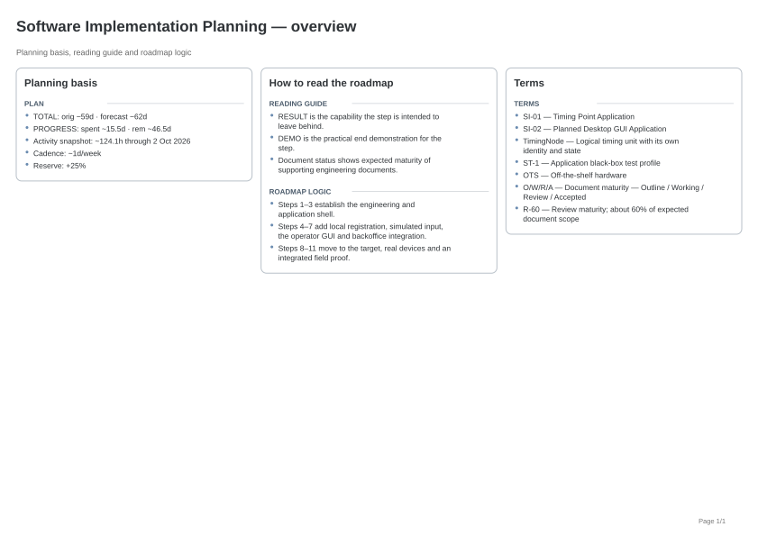

# Generated SIP planning

All files below are generated from the same SIP/YAML planning sources.

- [Planning overview](./sip-overview.svg)
- [Planning overview PDF](./sip-overview.pdf)
- [Continuous roadmap](./sip-roadmap.svg)
- [Roadmap PDF](./sip-roadmap.pdf) — 4 A4-landscape page(s).
- [Overview input](./roadmap-overview-view.yaml) — project-owned planning preface data.
- [RoadmapView input](./roadmap-view.yaml) — project-owned compact step presentation data.

Actual effort is a planning indication derived from repository activity, not time registration.
Approximation from commit activity within merged pull requests across the meta and implementation repositories. Each commit contributes a 60-minute activity window (30 minutes before and after); overlapping windows are merged and counted once. The project total merges all repository activity; per-step values use the same method after PR attribution. Hours are divided by 8 to obtain project days. This is a planning indication, not time tracking.

## Planning overview

## Roadmap pages

- [Roadmap page 1](./roadmap/sip-roadmap-1.svg)
- [Roadmap page 2](./roadmap/sip-roadmap-2.svg)
- [Roadmap page 3](./roadmap/sip-roadmap-3.svg)
- [Roadmap page 4](./roadmap/sip-roadmap-4.svg)

## Step details

- Step 2: [SVG](./steps/step-02.svg) · [PDF](./steps/step-02.pdf)
- Step 3: [SVG](./steps/step-03.svg) · [PDF](./steps/step-03.pdf)
- Step 4: [SVG](./steps/step-04.svg) · [PDF](./steps/step-04.pdf)
- Step 5: [SVG](./steps/step-05.svg) · [PDF](./steps/step-05.pdf)
- Step 6: [SVG](./steps/step-06.svg) · [PDF](./steps/step-06.pdf)
